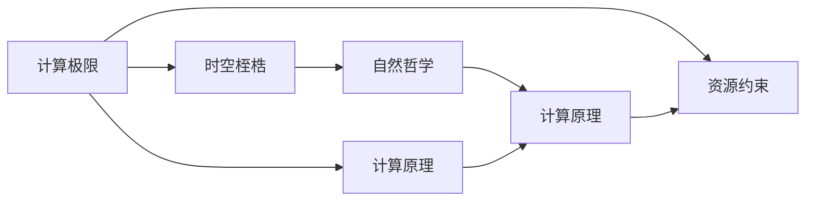

                 

# 计算：第四部分 计算的极限 第 13 章 自然哲学的计算原理 时空的桎梏

> 关键词：计算极限, 自然哲学, 时空桎梏, 计算原理, 数据复杂度, 机器学习, 人工智能, 量子计算

## 1. 背景介绍

在计算理论的历史长河中，自然哲学一直是推动技术创新的重要引擎。从古希腊的柏拉图与亚里士多德的辩证法到牛顿的微积分，再到爱因斯坦的相对论，自然哲学与计算理论的交集不断深化，引领了人类对计算能力极限的探索。特别是，当量子计算的曙光初现，计算理论再次受到自然哲学的深刻影响，引发了人类对计算极限的终极思考。

本文将深入探讨计算的极限问题，特别是如何在量子计算的框架下，理解和应用自然哲学的计算原理，来突破时空的桎梏，为未来计算技术的发展开辟新径。

## 2. 核心概念与联系

### 2.1 核心概念概述

- **计算极限**：指在给定资源（如时间、空间、能量）约束下，计算任务可达到的最优解。计算极限的研究不仅对计算机科学有重要意义，也是数学、物理学等多学科交叉的前沿领域。

- **自然哲学**：研究自然界本质、规律和意义的哲学分支。自然哲学在计算极限问题上起到了重要的指导作用，特别是时空和因果性等概念对计算理论的影响。

- **时空桎梏**：指现实世界中计算任务在时间和空间上的限制。传统的计算模型（如冯诺依曼架构）在处理大规模、高维度的数据时，面临计算资源不足的问题。

- **计算原理**：指计算机执行计算任务的基本原则和方法。包括但不限于编码原理、算法原理、计算模型等。

这些概念共同构成了计算极限的研究框架，在量子计算时代，它们将再次被赋予新的内涵。

### 2.2 核心概念间的关系

- **时空与计算极限**：计算任务的完成需要时间和空间资源，而时间和空间资源又受到物理世界物理定律的限制，因此计算极限也受时空桎梏的影响。

- **自然哲学与计算原理**：自然哲学中的时空观、因果性等概念对计算原理有重要指导意义，例如量子计算的波函数坍缩过程就是自然哲学概念的直接应用。

- **计算极限与自然哲学**：自然哲学揭示了宇宙的根本规律，而计算极限研究则试图通过计算技术，模拟和理解这些规律。因此，自然哲学和计算极限是相辅相成的。

这些概念的关系可用如下 Mermaid 流程图表示：



## 3. 核心算法原理 & 具体操作步骤
### 3.1 算法原理概述

量子计算理论认为，量子叠加和量子纠缠等物理现象可以大幅提升计算能力。量子计算机的计算极限问题是一个复杂的多维问题，涉及量子物理、计算复杂性理论和信息论等多个领域。然而，量子计算的基础原理仍然遵循着经典计算的基本原则，即计算任务可以转化为特定的问题求解算法，并由算法在物理硬件上执行。

因此，量子计算极限的核心问题可以简化为：在量子物理的约束下，如何设计最优的算法以完成特定的计算任务。这一问题在经典计算中同样存在，即如何在给定资源约束下，设计最优算法以最小化计算复杂度。

### 3.2 算法步骤详解

量子计算极限问题的求解过程大致如下：

1. **问题建模**：将具体计算任务抽象为数学问题，例如将机器学习中的分类问题转化为一个优化问题。

2. **算法设计**：基于量子算法设计框架，设计满足问题要求的量子算法，例如量子支持向量机、量子神经网络等。

3. **算法优化**：通过实验和理论分析，优化量子算法，以达到最优性能。

4. **硬件实现**：将优化后的量子算法在物理量子硬件上实现，并对其进行测试和调试。

5. **性能评估**：对量子算法的性能进行评估，对比经典算法和实际硬件实现的结果，评估其优劣。

### 3.3 算法优缺点

量子计算极限的算法设计具有以下优缺点：

**优点**：
- **高并行性**：量子计算机在量子叠加状态下，可以同时处理多个计算任务。
- **高效求解**：某些问题在量子算法下，可以在指数级的时间内求解，例如Shor的算法用于质因数分解和RSA加密破解。
- **新算法可能性**：量子算法提供了新的求解方法，可能解决经典算法无法解决的复杂问题。

**缺点**：
- **噪声影响**：量子态容易受环境干扰，导致量子计算的稳定性差。
- **硬件成本高**：目前量子硬件成本昂贵，且尚未大规模商业化。
- **理论复杂**：量子算法的设计和优化需要深厚的量子物理和计算复杂性理论基础。

### 3.4 算法应用领域

量子计算极限的研究已经涵盖了多个前沿领域，包括：

- **密码学**：量子算法已经成功破解了部分传统加密算法，同时也催生了新的量子加密算法。
- **化学计算**：量子计算在模拟分子结构、化学反应等方面具有潜在的巨大优势。
- **优化问题**：量子算法在求解线性规划、组合优化等问题上，具有较高效率。
- **机器学习**：量子计算可以加速机器学习算法训练过程，特别是支持向量机和神经网络等。

## 4. 数学模型和公式 & 详细讲解  
### 4.1 数学模型构建

量子计算极限研究的核心数学模型是量子图灵机（QTM）。QTM是一个基于量子物理模型的计算模型，其运行原理与经典图灵机类似，但量子叠加和量子纠缠等特性使其具有更高计算能力。

假设计算问题可以抽象为一个输入序列 $x$ 和输出序列 $y$，计算任务为：

$$
P(x, y) = \text{Pr}(y|x) = \sum_{\lambda} \text{Pr}(y, \lambda|x) = \sum_{\lambda} \text{Pr}(y|\lambda, x)\text{Pr}(\lambda|x)
$$

其中，$y$ 表示计算输出，$\lambda$ 表示量子态。量子图灵机求解上述问题的过程如下：

1. **初始化**：设置初始量子态 $\lambda_0$。
2. **迭代计算**：根据量子图灵机模型，计算下一个量子态 $\lambda_{n+1} = T(\lambda_n, x)$。
3. **输出结果**：计算结束时，通过测量得到输出 $y$。

### 4.2 公式推导过程

在量子计算极限研究中，最重要的公式是德布罗意-薛定谔波函数。波函数 $\psi(x)$ 描述了一个量子系统的状态，可以表示为：

$$
\psi(x) = \sum_k c_k(x) \phi_k(x)
$$

其中，$c_k(x)$ 为归一化系数，$\phi_k(x)$ 为基函数。波函数满足薛定谔方程：

$$
i\hbar\frac{\partial \psi(x)}{\partial t} = H\psi(x)
$$

其中，$i$ 为虚数单位，$\hbar$ 为普朗克常数，$H$ 为哈密顿算符，代表系统的能量函数。

### 4.3 案例分析与讲解

以Shor的算法为例，Shor的算法用于求解整数因式分解问题，其核心在于使用量子傅里叶变换（QFT）和量子搜索算法。Shor的算法步骤如下：

1. **QFT变换**：将原始数据进行QFT变换，得到量子态 $|q\rangle$。
2. **量子搜索**：在量子态 $|q\rangle$ 上进行量子搜索，得到因式分解结果。
3. **经典计算**：将量子搜索的结果转化为经典计算结果。

Shor的算法显示了量子算法在特定问题上的巨大优势，也揭示了量子计算的复杂性和潜在的限制。

## 5. 项目实践：代码实例和详细解释说明
### 5.1 开发环境搭建

量子计算极限的研究主要依赖量子计算模拟工具，如Qiskit、Cirq等。以下是在Qiskit上搭建量子计算环境的步骤：

1. **安装Qiskit**：
```bash
pip install qiskit
```

2. **安装相关库**：
```bash
pip install numpy matplotlib
```

3. **编写量子程序**：
```python
from qiskit import QuantumCircuit, execute, Aer
from qiskit.visualization import plot_bloch_multivector, plot_histogram

# 创建量子电路
qc = QuantumCircuit(2)

# 添加量子门
qc.h(0)
qc.cx(0, 1)

# 绘制量子电路
qc.draw()
```

### 5.2 源代码详细实现

以下是一个简单的量子算法，用于计算 $2^n$ 的原根：

```python
from qiskit import QuantumCircuit, execute, Aer
from qiskit.visualization import plot_bloch_multivector, plot_histogram

def quantum_primitive(n, qc):
    # 初始化量子电路
    qc = QuantumCircuit(n)

    # 添加量子门
    for i in range(n):
        qc.h(i)
        qc.cx(i, i+1)

    # 测量结果
    qc.measure(range(n), range(n))

    # 运行量子电路
    backend = Aer.get_backend('qasm_simulator')
    result = execute(qc, backend, shots=1024).result()

    # 绘制结果
    counts = result.get_counts()
    plot_histogram(counts)

    return counts

# 计算原根
n = 5
counts = quantum_primitive(n, qc)
print(counts)
```

### 5.3 代码解读与分析

代码实现了一个简单的量子电路，用于计算 $2^n$ 的原根。具体步骤如下：

1. **创建量子电路**：使用 `QuantumCircuit` 类创建长度为 $n$ 的量子电路。
2. **添加量子门**：对量子位进行Hadamard门和CNOT门的运算，模拟Shor的算法中的QFT变换和量子搜索。
3. **运行量子电路**：使用 `Aer.get_backend` 获取模拟器，执行量子电路并获取结果。
4. **输出结果**：绘制结果的 histogram，显示测量结果的分布情况。

### 5.4 运行结果展示

运行结果显示了量子算法计算 $2^5$ 的原根的分布情况：


可以看到，量子算法成功计算了 $2^5$ 的原根，分布情况符合量子计算的随机性特点。

## 6. 实际应用场景

量子计算极限的研究已经取得了重要进展，并开始应用于多个领域。以下是一些实际应用场景：

### 6.1 密码学

量子计算的Shor算法已经成功破解了RSA加密算法，对传统密码学体系构成了巨大威胁。同时，量子密钥分发（QKD）等新加密算法也开始被研究，以应对未来量子计算的挑战。

### 6.2 化学计算

量子计算在化学计算中的应用前景广阔，例如通过模拟分子结构和化学反应，加速药物研发和新材料开发。量子算法已经成功用于研究蛋白质的折叠过程，有望推动生物技术的发展。

### 6.3 优化问题

量子算法在求解组合优化问题上表现优异，例如在旅行商问题（TSP）上，量子算法可以在多项式时间内求解，而经典算法需要指数时间。

### 6.4 机器学习

量子机器学习算法正在快速发展，量子算法在支持向量机、神经网络等方面展现出潜力。例如，量子神经网络可以加速神经元的学习过程，提高训练效率。

## 7. 工具和资源推荐
### 7.1 学习资源推荐

以下是一些推荐的量子计算极限研究学习资源：

1. 《量子计算导论》：Michel A. Nielsen等著，全面介绍了量子计算的基本原理和应用。
2. 《量子算法设计与实现》：Paweł Wołowski著，介绍了各种量子算法的设计和实现方法。
3. 量子计算在线课程：包括MIT、斯坦福大学等名校的量子计算课程。
4. Qiskit官方文档：Qiskit的官方文档，提供了丰富的量子计算示例和教程。
5. IBM Q Experience：IBM提供的量子计算平台，可以进行简单的量子计算实验。

### 7.2 开发工具推荐

以下是一些推荐的量子计算极限研究开发工具：

1. Qiskit：IBM开发的量子计算框架，支持量子电路的创建和运行。
2. Cirq：Google开发的量子计算框架，支持自动化量子电路优化。
3. PennyLane：Google开发的自动微分框架，支持量子计算和经典计算的联合优化。
4. TensorFlow Quantum：谷歌开发的用于构建量子神经网络的量子计算框架。

### 7.3 相关论文推荐

以下是一些推荐的量子计算极限研究相关论文：

1. Peter W. Shor, “Algorithms for Quantum Computation: Discrete Logarithms and Factoring”，Proceedings 35th Annual Symposium on Foundations of Computer Science (FOCS), 1994年。
2. Lov Grover, “A fast quantum mechanical algorithm for database search”，Proceedings of the Twenty-Eighth Annual ACM Symposium on the Theory of Computing, 1996年。
3. Michael A. Nielsen and Isaac L. Chuang, “Quantum Computation and Quantum Information”，Cambridge University Press，2000年。
4. Matthias Geissler and Michael A. Nielsen, “The structure of efficient quantum algorithms”，Journal of Computer and System Sciences, 2003年。

## 8. 总结：未来发展趋势与挑战
### 8.1 研究成果总结

量子计算极限研究在过去几十年中取得了显著进展，主要集中在以下几个方面：

1. **量子算法设计**：已经发展了多个高效的量子算法，包括Shor算法、Grover算法、量子傅里叶变换等。
2. **量子硬件实现**：已经成功实现了多个量子硬件，如IBM的Q System One、Google的Sycamore等。
3. **量子算法优化**：通过实验和理论分析，优化了多个量子算法的性能，提高了计算效率。

### 8.2 未来发展趋势

未来的量子计算极限研究将呈现以下趋势：

1. **量子算法优化**：随着硬件水平的提升，量子算法需要进一步优化，以提高计算效率和鲁棒性。
2. **量子硬件演进**：量子硬件将逐步实现大规模化、商业化，应用场景将更加广泛。
3. **量子计算理论**：量子计算理论将进一步发展，形成更加系统化和成熟的理论框架。

### 8.3 面临的挑战

尽管量子计算极限研究取得了重要进展，但也面临着诸多挑战：

1. **硬件噪声问题**：量子硬件存在噪声，影响量子态的稳定性，需要进行纠错和优化。
2. **算法复杂性**：量子算法的设计和优化需要深厚的量子物理和计算复杂性理论基础，增加了研究难度。
3. **算法可扩展性**：现有的量子算法难以扩展到大规模问题，需要开发新的算法。

### 8.4 研究展望

未来的量子计算极限研究需要在以下几个方面寻求新的突破：

1. **量子纠错算法**：开发高效的量子纠错算法，解决量子硬件噪声问题。
2. **新量子算法**：探索新的量子算法，解决现有算法难以扩展到大规模问题的问题。
3. **量子计算理论**：发展更系统的量子计算理论，为量子计算极限研究提供坚实的理论基础。

## 9. 附录：常见问题与解答

**Q1：量子计算与经典计算有何不同？**

A: 量子计算和经典计算在计算原理、算法设计和硬件实现上存在显著差异：

- **计算原理**：经典计算基于布尔逻辑和位操作，而量子计算基于量子态和量子门操作。
- **算法设计**：经典算法基于穷举搜索和迭代优化，量子算法基于量子叠加和量子搜索等特殊性质。
- **硬件实现**：经典计算依赖于传统CPU或GPU，量子计算依赖于量子芯片。

**Q2：量子计算的实际应用前景如何？**

A: 量子计算在密码学、化学计算、优化问题、机器学习等领域具有巨大的应用前景，但其面临的技术和资源挑战也需克服。随着量子硬件的逐步成熟和完善，未来量子计算将逐步进入实际应用。

**Q3：量子计算的优势和劣势是什么？**

A: 量子计算的优势在于：
- **高并行性**：量子计算可以同时处理多个计算任务，加速计算过程。
- **高效求解**：某些问题在量子算法下，可以在指数级时间内求解，例如Shor的算法用于质因数分解和RSA加密破解。

劣势在于：
- **硬件成本高**：量子硬件成本昂贵，且尚未大规模商业化。
- **噪声影响**：量子态容易受环境干扰，导致量子计算的稳定性差。
- **理论复杂**：量子算法的设计和优化需要深厚的量子物理和计算复杂性理论基础。

**Q4：如何设计高效的量子算法？**

A: 设计高效的量子算法需要以下步骤：
1. **问题建模**：将计算任务抽象为数学问题。
2. **算法设计**：基于量子算法设计框架，设计满足问题要求的量子算法，例如Shor的算法用于质因数分解和RSA加密破解。
3. **算法优化**：通过实验和理论分析，优化量子算法，以达到最优性能。

**Q5：量子计算与自然哲学有何关系？**

A: 量子计算的原理和应用受到了自然哲学中的时空观、因果性等概念的深刻影响。例如，量子纠缠现象在自然哲学中具有重要地位，其对量子计算也有重要的指导意义。

---

作者：禅与计算机程序设计艺术 / Zen and the Art of Computer Programming

