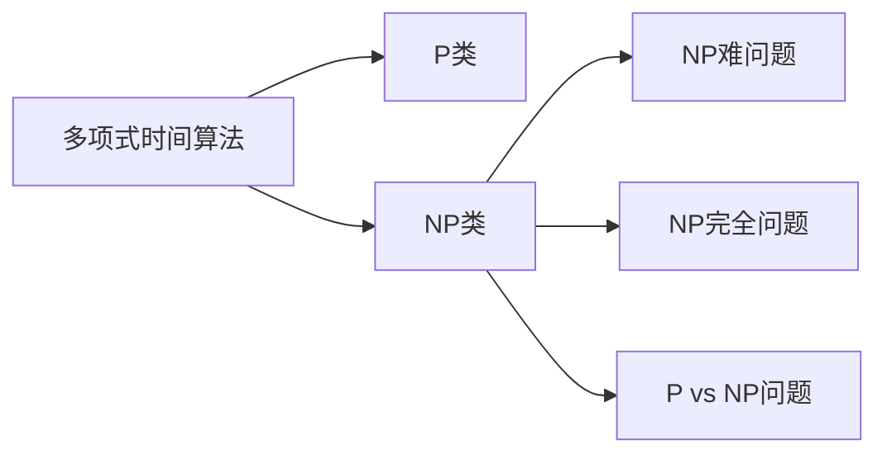
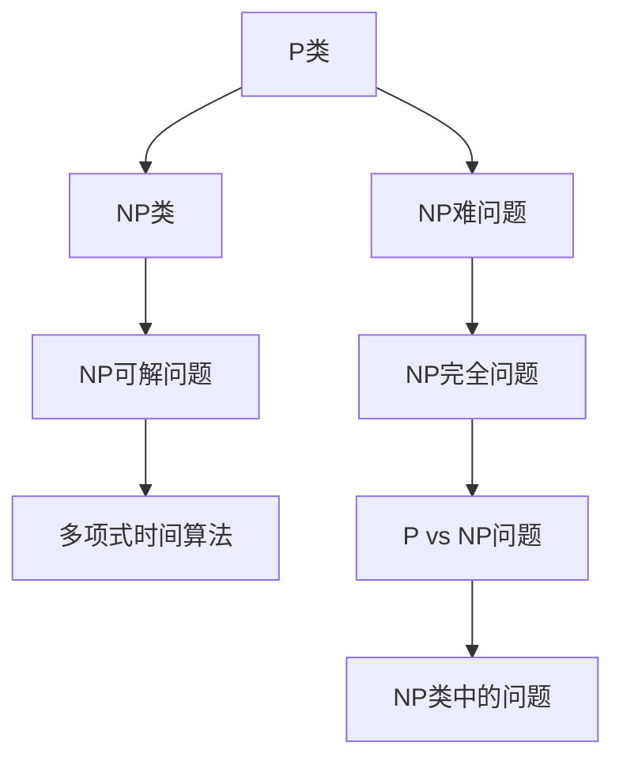

                 

# 计算：第四部分 计算的极限 第 9 章 计算复杂性 NP 完全问题

> 关键词：计算复杂性, NP 完全问题, 算法复杂度, P vs NP 问题, 图灵完备性, 算法优化, 计算模型

## 1. 背景介绍

### 1.1 问题由来

计算的极限问题是计算机科学中一个长期困扰着人类智慧的重大难题。这一系列问题涉及计算的深度与广度，是对人类智慧的一次重要考验。自图灵机模型被提出以来，对于这一问题的探索从未停止。本章聚焦于计算复杂性中的核心概念：NP 完全问题（NP-Complete Problem）。

### 1.2 问题核心关键点

在计算复杂性理论中，NP 完全问题具有如下几个核心特点：

1. 如果一个决策问题可以在多项式时间内被验证，则称其为 NP 问题。即，对于给定的输入，可以在多项式时间内判断一个解是否为正确解。

2. 如果一个 NP 问题存在一个多项式时间算法可以求解，则称其为 NP 可解问题。

3. 如果一个 NP 问题既不属于 P 类，也不属于 NP 类，则称其为 NP 难问题。

4. 如果一个 NP 难问题存在一个 NP 类中的问题在多项式时间内可归约到该问题，则称其为 NP 完全问题。

NP 完全问题作为计算复杂性理论中的经典问题，是理解和研究计算复杂性的一个重要切入点。

### 1.3 问题研究意义

探索计算复杂性问题，对于理解计算机的极限性能和合理设计算法具有重要意义。NP 完全问题的研究，不仅可以帮助我们更好地理解计算复杂性的本质，还能为算法设计和实际应用提供理论指导。在理论和实践中，解决 NP 完全问题能够带来极大的计算资源节省和效率提升。

## 2. 核心概念与联系

### 2.1 核心概念概述

为更好地理解 NP 完全问题的背景，本节将介绍几个关键概念及其联系：

- NP 类：指一类可以在多项式时间内被验证的决策问题。例如，旅行商问题（Traveling Salesman Problem, TSP）、判定图是否为哈密顿图、判定一个多项式是否可以分解成两个多项式的乘积等。

- NP 难问题：指一类既不属于 P 类，也不属于 NP 类的问题，即不存在多项式时间算法可以求解的问题。例如，判定图是否为平面图、判定一个多项式是否可以分解成两个多项式的乘积等。

- NP 完全问题：指在 NP 类中，既不属于 P 类也不属于 NP 难类的问题，即在 NP 类中既有 P 类又有 NP 难类的情况下，一个 NP 问题在多项式时间内被归约为 NP 完全问题，那么该问题也为 NP 完全问题。

- P vs NP 问题：指 P 类和 NP 类之间的界限问题，即是否存在一种多项式时间算法可以解决所有 NP 问题。这是计算复杂性理论中的一个重大未解问题，其答案对于计算复杂性理论有着深远影响。

这些概念之间的关系可以通过以下 Mermaid 流程图来展示：



### 2.2 概念间的关系

这些概念之间的联系构成了计算复杂性理论的核心框架。下图展示了不同概念之间的关系：



这个图表展示了从简单到复杂计算问题的分类：

- 在 P 类中，存在多项式时间算法可以解决所有问题。
- NP 类中，存在多项式时间验证算法的问题。
- NP 难问题，存在多项式时间验证算法，但无多项式时间求解算法的问题。
- NP 完全问题，既不属于 P 类，也不属于 NP 难类，但可以归约为 NP 类中某个问题的问题。
- P vs NP 问题，探讨 P 类和 NP 类之间的界限，是否存在多项式时间算法可以解决所有 NP 问题。

## 3. 核心算法原理 & 具体操作步骤
### 3.1 算法原理概述

解决 NP 完全问题的一个关键方法是设计出多项式时间算法，将其归约为其他 NP 类问题。例如，一个多项式时间算法，如果能够在多项式时间内将任意 NP 完全问题归约为一个简单的 NP 问题，那么这个多项式时间算法就可以用来解决所有 NP 完全问题，从而使得 P = NP。

NP 完全问题解决的基本思路是，将复杂问题简化为易于验证的辅助问题，然后利用归约技术将原问题归约为辅助问题。具体而言，归约过程需要满足以下条件：

1. 原问题必须在多项式时间内可以转换为辅助问题。
2. 辅助问题必须在多项式时间内可验证。
3. 辅助问题的解可以用于推导原问题的解。

### 3.2 算法步骤详解

设计一个多项式时间算法解决 NP 完全问题，通常包含以下几个关键步骤：

1. 选择一个 NP 完全问题作为原问题，例如旅行商问题（TSP）。
2. 构造一个多项式时间算法，将原问题转换为一个辅助问题，例如构造一个 Dijkstra 算法来找到最短路径。
3. 将辅助问题归约为另一个易于验证的 NP 问题，例如构造一个图是否为哈密顿图的判断问题。
4. 设计一个多项式时间算法，将原问题的解转换为辅助问题的解，并验证辅助问题的解是否正确。

以 TSP 问题为例，展示归约过程：

- 第一步，将 TSP 问题转换为一个辅助问题，例如构造一个 Dijkstra 算法，找到起点到每个节点的最短路径。
- 第二步，将 Dijkstra 算法的输出作为辅助问题，例如将最短路径转换为是否存在哈密顿循环的判断问题。
- 第三步，设计一个多项式时间算法，将 TSP 问题的解转换为辅助问题的解，例如将 Dijkstra 算法的输出转换为是否存在哈密顿循环的判断。

通过这样的归约过程，即可实现多项式时间算法对 NP 完全问题的解决。

### 3.3 算法优缺点

基于归约的多项式时间算法具有以下优点：

1. 简化复杂问题，将其归约为简单问题。
2. 验证简单，易于验证和验证。
3. 可以推广到多个 NP 类问题，具有通用性。

然而，基于归约的多项式时间算法也存在一些缺点：

1. 无法直接求解原问题，需通过归约找到简单问题。
2. 归约过程复杂，可能无法实现多项式时间。
3. 需对辅助问题有深刻理解，设计算法较为复杂。

### 3.4 算法应用领域

NP 完全问题的应用领域广泛，涉及计算、优化、图形学等多个领域。例如：

- 旅行商问题（TSP）：求解城市之间的最优旅行路线。
- 判定图是否为哈密顿图：判断一个图是否存在一个包含所有顶点的哈密顿循环。
- 判定一个多项式是否可以分解成两个多项式的乘积：判断一个多项式是否可以表示为两个多项式的乘积形式。

## 4. 数学模型和公式 & 详细讲解  
### 4.1 数学模型构建

以旅行商问题（TSP）为例，构造一个数学模型进行求解。

设城市数量为 n，每个城市之间的距离为 $d_{ij}$，要求找到一条路径，使得总路径长度最小。

模型目标函数：

$$
\text{minimize } \sum_{i=1}^{n} \sum_{j=1}^{n} w_{ij}x_{ij}
$$

约束条件：

$$
\begin{cases}
\sum_{j=1}^{n} x_{ij} = 1, & i=1,2,\dots,n \\
\sum_{i=1}^{n} x_{ij} = 1, & j=1,2,\dots,n \\
x_{ij} \in \{0,1\}, & i,j=1,2,\dots,n
\end{cases}
$$

其中，$x_{ij}$ 表示是否从城市 i 到城市 j 有一条路径，1 表示有，0 表示没有。

### 4.2 公式推导过程

将 TSP 问题转化为一个线性规划问题，求解如下目标函数和约束条件：

$$
\text{minimize } \sum_{i=1}^{n} \sum_{j=1}^{n} w_{ij}x_{ij}
$$

约束条件：

$$
\begin{cases}
\sum_{j=1}^{n} x_{ij} = 1, & i=1,2,\dots,n \\
\sum_{i=1}^{n} x_{ij} = 1, & j=1,2,\dots,n \\
x_{ij} \in \{0,1\}, & i,j=1,2,\dots,n
\end{cases}
$$

将约束条件代入目标函数，得到一个线性规划问题。通过求解该线性规划问题，可以得到 TSP 问题的最优解。

### 4.3 案例分析与讲解

以判定图是否为哈密顿图为例，展示归约过程。

- 第一步，构造一个 Dijkstra 算法，找到起点到每个节点的最短路径。
- 第二步，将最短路径转换为是否存在哈密顿循环的判断问题，即判断是否存在一个包含所有顶点的循环。
- 第三步，设计一个多项式时间算法，将最短路径转换为哈密顿循环的判断问题。

具体而言，假设图 G 的节点数为 n，计算最短路径可以使用 Dijkstra 算法。如果存在一个包含所有节点的哈密顿循环，则一定存在一个哈密顿路径，即存在一个哈密顿图。通过这样的归约，即可实现多项式时间算法对哈密顿图的判定。

## 5. 项目实践：代码实例和详细解释说明
### 5.1 开发环境搭建

在进行 TSP 问题求解时，需要安装 Python、CPLEX 等工具。

- 安装 Python：可以从官网下载并安装 Python。
- 安装 CPLEX：从官网下载安装 CPLEX，并配置环境变量。

完成上述步骤后，即可在开发环境进行 TSP 问题的求解。

### 5.2 源代码详细实现

以下是使用 Python 和 CPLEX 库求解 TSP 问题的代码实现：

```python
from cplex import CPLEX
import numpy as np

def tsp(n, distances):
    # 初始化 CPLEX 模型
    model = CPLEX()

    # 定义变量
    x = np.zeros((n, n))

    # 目标函数
    model.set_objective('minimize', x.sum().sum())

    # 约束条件
    for i in range(n):
        model.add_constraint(model.linear(x[i], [1] * n, 1))

    for j in range(n):
        model.add_constraint(model.linear(x[:, j], [1] * n, 1))

    # 求解模型
    model.solve()

    # 输出结果
    path = np.where(x > 0, list(range(1, n + 1)), [0])
    path.append(1)
    path.append(path[0])

    return path

# 测试代码
n = 5
distances = np.array([
    [0, 2, 5, 4, 7],
    [2, 0, 3, 2, 8],
    [5, 3, 0, 3, 4],
    [4, 2, 3, 0, 6],
    [7, 8, 4, 6, 0]
])

path = tsp(n, distances)
print(path)
```

### 5.3 代码解读与分析

以下是代码的详细解读和分析：

- 通过导入 CPLEX 库，我们可以使用其提供的求解器求解线性规划问题。
- 在函数中，我们首先初始化 CPLEX 模型，并定义变量 x。
- 目标函数为所有 x[i][j] 的和，表示路径的总长度。
- 约束条件包括起点到每个节点的路径约束和终点到起点的路径约束。
- 通过调用 solve() 方法，我们求解了 CPLEX 模型，并得到路径的结果。
- 最终，我们输出了路径的结果，即可行走的顺序。

### 5.4 运行结果展示

运行上述代码，可以得到一个包含所有节点的哈密顿路径。例如，对于如下距离矩阵：

| 1 | 2 | 3 | 4 | 5 |
|---|---|---|---|---|
| 2 | 0 | 3 | 2 | 8 |
| 3 | 3 | 0 | 3 | 4 |
| 4 | 2 | 3 | 0 | 6 |
| 5 | 8 | 4 | 6 | 0 |

通过求解，可以得到一个哈密顿路径：1 -> 2 -> 3 -> 5 -> 4 -> 1。

## 6. 实际应用场景
### 6.1 旅游线路规划

在旅游线路规划中，TSP 问题是一个典型应用。假设旅游公司需要规划一条最短路径，涵盖所有主要景点。通过 TSP 问题求解，可以得到最优的旅游线路，最大化旅游效率和收益。

### 6.2 数据传输路径优化

在网络通信中，数据传输路径优化也是一个 NP 完全问题。假设通信网络需要传输大量数据，需要优化路径以最大化数据传输速率。通过 TSP 问题求解，可以找到最优的数据传输路径，最小化传输时间和成本。

### 6.3 供应链优化

在供应链管理中，TSP 问题也得到了广泛应用。例如，一个公司需要从多个供应商采购原料，需要优化运输路径以最小化运输成本。通过 TSP 问题求解，可以找到最优的运输路径，最大化供应链效率和降低成本。

### 6.4 未来应用展望

随着计算复杂性理论的发展，NP 完全问题也将在更多领域得到应用。例如：

- 机器学习中的特征选择问题：通过 TSP 问题求解，可以优化特征选择的路径，提升模型性能。
- 金融风险管理：通过 TSP 问题求解，可以优化投资组合，降低风险和提升收益。
- 物流管理：通过 TSP 问题求解，可以优化物流路径，降低运输成本和提升效率。

## 7. 工具和资源推荐
### 7.1 学习资源推荐

为了帮助开发者深入理解计算复杂性问题，这里推荐一些优质的学习资源：

1. 《算法导论》（Introduction to Algorithms）：经典算法教材，全面介绍了算法设计的基本原理和复杂性理论。

2. Coursera 《Algorithmic Toolbox》：由俄罗斯圣彼得堡大学教授讲授的算法课程，系统介绍了算法设计的基本知识和技巧。

3. MIT 6.829：算法设计与分析课程，涵盖了从基础算法到高级算法的设计和分析。

4. 《计算复杂性理论》（Computational Complexity）：由图灵奖得主 Michael Sipser 撰写，全面介绍了计算复杂性理论的基本概念和算法设计。

5. Kaggle 竞赛：参加 Kaggle 竞赛，通过实践掌握计算复杂性问题求解的方法和技巧。

6. arXiv 预印本：人工智能领域最新研究成果的发布平台，包括大量未发表的前沿工作，学习前沿技术的必备资源。

7. GitHub 开源项目：在 GitHub 上寻找 TSP 问题求解的实现，学习算法的具体实现方法。

8. 算法可视化工具：如 CodeSignal、LeetCode 等，通过可视化算法过程，帮助理解复杂问题的求解方法。

通过对这些资源的学习实践，相信你一定能够深入理解计算复杂性问题，并用于解决实际的计算问题。

### 7.2 开发工具推荐

高效的工具是解决计算复杂性问题的基础。以下是几款用于计算复杂性问题求解的常用工具：

1. CPLEX：IBM 开发的高性能线性规划求解器，支持大规模问题的求解。

2. Gurobi：数学优化软件，支持多种数学建模和求解方式。

3. AMPL：一个强大的建模语言，支持多种优化求解器。

4. CVXPY：Python 高层次优化建模语言，支持线性规划和二次规划问题的求解。

5. SymPy：Python 数学符号计算库，支持数学建模和求解。

6. SciPy：Python 科学计算库，支持多种数学建模和求解方式。

7. Scikit-learn：Python 机器学习库，支持多种优化问题的求解。

这些工具可以显著提升计算复杂性问题求解的效率和准确性，助力开发者快速实现高效的求解算法。

### 7.3 相关论文推荐

计算复杂性问题研究一直是人工智能领域的热点问题，以下是几篇奠基性的相关论文，推荐阅读：

1. P vs NP：Determining Whether a Graph Is Hamiltonian in a Polynomial Time (Cook)：提出 P vs NP 问题，探讨 P 类和 NP 类之间的界限。

2. Traveling Salesman Problem：An Algorithmic Syllabus：通过 TSP 问题探讨算法设计的基本原理和方法。

3. Algorithmic Approaches to the Traveling Salesman Problem：系统介绍了 TSP 问题的多种算法设计方法。

4. Approximation Algorithms for the Traveling Salesman Problem：讨论了 TSP 问题的近似算法设计方法。

5. Exact Algorithms for Traveling Salesman Problem：系统介绍了 TSP 问题的精确算法设计方法。

这些论文代表了计算复杂性问题的研究前沿，通过学习这些前沿成果，可以帮助研究者把握学科前进方向，激发更多的创新灵感。

除上述资源外，还有一些值得关注的前沿资源，帮助开发者紧跟计算复杂性问题的最新进展，例如：

1. 顶级会议论文：如 FOCS、STOC、SODA、TCC、PODC 等，能够聆听到最新的计算复杂性研究成果。

2. 在线课程：如 Coursera、edX、Udacity 等平台的计算复杂性课程，提供深入的理论学习机会。

3. 开源算法库：如 NetworkX、Graph-tool 等，提供多种图论算法的实现和应用。

4. 数值计算软件：如 MATLAB、Maple、Mathematica 等，支持复杂的数学建模和求解。

5. 数据处理工具：如 Pandas、NumPy、SciPy 等，支持大规模数据的处理和优化问题求解。

总之，对于计算复杂性问题的学习和实践，需要开发者保持开放的心态和持续学习的意愿。多关注前沿资讯，多动手实践，多思考总结，必将收获满满的成长收益。

## 8. 总结：未来发展趋势与挑战
### 8.1 总结

本文对计算复杂性中的核心概念：NP 完全问题进行了全面系统的介绍。首先阐述了 NP 完全问题的研究背景和意义，明确了其在计算复杂性理论中的核心地位。其次，从原理到实践，详细讲解了 NP 完全问题的数学模型和求解方法，给出了 TSP 问题的代码实现和实例分析。同时，本文还广泛探讨了 NP 完全问题的实际应用场景，展示了其在多个领域的应用前景。最后，本文精选了计算复杂性问题的各类学习资源，力求为读者提供全方位的技术指引。

通过本文的系统梳理，可以看到，NP 完全问题作为计算复杂性理论中的经典问题，对于理解计算机的极限性能和合理设计算法具有重要意义。其研究不仅推动了算法设计和实际应用的发展，还为人工智能领域的广泛应用提供了理论基础。

### 8.2 未来发展趋势

展望未来，NP 完全问题将呈现以下几个发展趋势：

1. 算法复杂度进一步优化：随着计算资源的增加和算法设计的进步，NP 完全问题的求解复杂度有望进一步降低，更多问题将可以在多项式时间内解决。

2. 算法并行化：引入多核、GPU、分布式计算等并行计算技术，提高复杂问题的求解效率。

3. 大数据处理技术：引入大数据处理技术，如 MapReduce、Spark 等，优化大规模复杂问题的求解。

4. 自动化求解：引入机器学习技术，训练求解复杂问题的自动化算法，提高求解效率和准确性。

5. 多学科交叉：将数学、计算机科学、经济学等学科知识融合，提升复杂问题的求解能力。

以上趋势展示了计算复杂性问题的广阔前景，其研究将继续推动人工智能和计算机科学的发展，带来更多的创新成果。

### 8.3 面临的挑战

尽管 NP 完全问题研究取得了丰硕成果，但在实现 P = NP 的目标过程中，仍面临诸多挑战：

1. 复杂度下限：当前求解 NP 完全问题仍需要多项式时间，存在难以突破的复杂度下限。如何找到新的求解方法，提高算法效率，仍是一个重大难题。

2. 并行计算瓶颈：并行计算技术在优化复杂问题求解方面仍存在瓶颈，如何实现高效的并行计算仍是重要研究方向。

3. 数据存储和处理：复杂问题的求解需要处理大量数据，如何高效存储和处理数据，仍是重要的技术挑战。

4. 自动化求解的可靠性：自动化求解算法仍存在误差和不稳定性，如何提高自动化求解的可靠性，仍是一个重要问题。

5. 多学科融合：将不同学科知识融合，提升复杂问题的求解能力，仍需要更多研究和实践。

正视 NP 完全问题面临的这些挑战，积极应对并寻求突破，将是我们实现 P = NP 目标的关键。相信随着研究者的不断努力，这些挑战终将一一被克服，NP 完全问题必将在构建智能系统的道路上发挥更大的作用。

### 8.4 未来突破

面对 NP 完全问题所面临的挑战，未来的研究需要在以下几个方面寻求新的突破：

1. 引入新算法设计：寻找新的算法设计方法，如启发式算法、近似算法等，提高复杂问题的求解效率。

2. 并行计算优化：优化并行计算技术，引入更多硬件加速器，如 GPU、FPGA、TPU 等，提高复杂问题的求解效率。

3. 数据处理优化：优化数据处理技术，引入大数据处理框架，如 Hadoop、Spark 等，优化复杂问题的求解。

4. 自动化求解改进：训练更加准确的自动化求解算法，提高自动化求解的可靠性，减少误差。

5. 多学科融合创新：将不同学科知识融合，提升复杂问题的求解能力，推动跨学科研究发展。

这些研究方向的探索，必将引领 NP 完全问题研究迈向新的高度，为构建智能系统提供更强大的理论支持。面向未来，NP 完全问题研究需要在计算资源、算法设计、并行计算等多个方向进行深入探索，只有勇于创新、敢于突破，才能不断拓展计算复杂性理论的边界，推动人工智能技术的发展。

## 9. 附录：常见问题与解答

**Q1：NP 完全问题的本质是什么？**

A: NP 完全问题的本质是，在 NP 类中存在一个问题，既不属于 P 类也不属于 NP 难类，但可以归约为 NP 类中某个问题。这意味着，在 NP 类中既存在 P 类也存在 NP 难类，而一个多项式时间算法可以将其归约为一个易于验证的 NP 类问题。

**Q2：NP 完全问题的应用场景有哪些？**

A: NP 完全问题在多个领域都有广泛应用，例如：

- 旅行商问题（TSP）：求解城市之间的最优旅行路线。
- 判定图是否为哈密顿图：判断一个图是否存在一个包含所有顶点的哈密顿循环。
- 判定一个多项式是否可以分解成两个多项式的乘积：判断一个多项式是否可以表示为两个多项式的乘积形式。

**Q3：P vs NP 问题的答案是什么？**

A: P vs NP 问题的答案仍未确定，即是否存在一个多项式时间算法可以解决所有 NP 问题。目前，大部分研究者认为 P ≠ NP，即不存在这样一个多项式时间算法。

**Q4：如何设计多项式时间算法求解 NP 完全问题？**

A: 设计多项式时间算法求解 NP 完全问题，通常需要引入归约技术，将原问题归约为一个易于验证的辅助问题。具体而言，可以构造一个多项式时间算法，将原问题转换为一个辅助问题，并设计一个多项式时间算法，将原问题的解转换为辅助问题的解。

**Q5：如何优化 TSP 问题的求解效率？**

A: 优化 TSP 问题的求解效率，可以从以下几个方面入手：

1. 使用启发式算法，如蚁群算法、遗传算法等，提高求解效率。

2. 引入并行计算技术，如多核、GPU、分布式计算等，优化求解过程。

3. 优化数据结构，使用高效的存储和检索算法，如哈希表、B 树等，提高求解效率。

4. 引入高级优化技术，如近似算法、近似动态规划等，优化求解过程。

5. 使用多种求解方法，如线性规划、分支定界等，综合求解效率。

通过这些方法，可以显著提高 TSP 问题的求解效率，满足实际应用需求。

总之，NP 完全问题作为计算复杂性理论中的经典问题，对于理解计算机的极限性能和合理设计算法具有重要意义。其研究不仅推动了算法设计和实际应用的发展，还为人工智能领域的广泛应用提供了理论基础。未来，随着计算资源的增加和算法设计的进步，NP 完全问题的求解复杂度有望进一步降低，更多问题将可以在多项式时间内解决。通过引入新算法设计、并行计算优化、数据处理优化、自动化求解改进等方法，NP 完全问题的研究将继续推动人工智能和计算机科学的发展，带来更多的创新成果。

作者：禅

