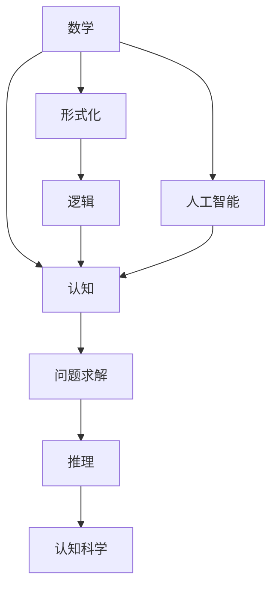

                 

# 认知的形式化：数学是基于想象和推理的，数学不是发现，而是发明

## 1. 背景介绍

### 1.1 问题由来

自人类历史之初，数学就作为一种强大的认知工具，帮助人们理解和描述世界。数学以抽象的形式化语言，描述了自然界和人类社会的普遍规律，为科学和技术的发展提供了坚实的基础。然而，数学的起源究竟是来自于自然界的规律，还是人类智慧的结晶？数学是发现的科学，还是发明的语言？

这些问题触及了数学哲学的核心，同时也对人类认知的基础有着深远的影响。本文旨在探讨数学的本质，以及其在人类认知中的角色。

### 1.2 问题核心关键点

数学的本质是什么？数学与逻辑、语言、科学的关系如何？数学在人类认知中的作用是什么？这些问题不仅涉及数学哲学的传统议题，也触及了认知科学、人工智能等领域的前沿研究。

## 2. 核心概念与联系

### 2.1 核心概念概述

为了深入探讨数学的本质和认知的作用，我们首先需要澄清一些核心概念：

- **数学**：指用于描述自然界和人类社会规律的形式化语言。数学通过符号、公式、公理等元素构建严谨的逻辑体系。

- **形式化**：指用一种精确、明确的方式表达和推导数学概念和定理。形式化使数学推理可以跨越文化和语言障碍，实现普遍适用。

- **逻辑**：指基于推理和论证的理性思维方式。逻辑学研究推理的规律和原则，为数学的形式化提供了基础。

- **认知**：指人类获取、处理、存储和应用知识的过程。认知包括感知、记忆、理解、推理等多个环节，是人类智能的核心。

- **人工智能**：指利用计算机技术模拟人类智能行为的技术领域。人工智能通过算法、模型和数据，实现对复杂问题的求解和推理。

- **认知科学**：研究认知过程和机制的科学领域，旨在揭示人类思维的规律和本质。

### 2.2 概念间的关系

这些核心概念之间的关系可以通过以下Mermaid流程图来展示：



这个流程图展示了数学、形式化、逻辑、认知、人工智能、认知科学之间的联系：

- 数学基于形式化，通过逻辑推理构建严谨的体系。
- 形式化使数学推理跨越文化和语言障碍，实现普遍适用。
- 逻辑为数学的形式化提供了基础，是数学推理的根本。
- 认知是人类智能的核心，数学、人工智能、认知科学共同促进认知的发展。
- 人工智能模拟人类智能行为，利用数学和逻辑进行问题求解和推理。
- 认知科学揭示人类思维的规律和本质，为人工智能的发展提供了理论指导。

这些概念共同构成了人类认知的基础框架，帮助我们理解数学和人工智能的本质。

## 3. 核心算法原理 & 具体操作步骤
### 3.1 算法原理概述

数学的本质是什么？数学不是自然界的发现，而是人类智慧的产物。数学家通过想象、推理和实验，创造了数学的概念和体系。数学的发明过程，可以看作是一种基于人类认知的创造活动。

形式化数学是一种精确、明确的语言，用于表达和推导数学概念和定理。数学的发现过程，实际上是对这种形式化语言的探索和应用。数学家通过一系列的假设、定义和推导，构造出数学体系，揭示自然界的规律和人类社会的结构。

人工智能与数学密不可分。人工智能通过算法、模型和数据，模拟人类的智能行为。数学提供了算法和模型的基础，使人工智能能够处理和理解复杂问题。

### 3.2 算法步骤详解

形式化数学的创造过程，可以分为以下步骤：

**Step 1: 初始化公理和公设**

数学家首先需要定义一些基本的概念和命题，作为数学体系的基础。这些概念和命题被称为公理和公设。公理和公设通常被认为是无需证明的，它们构成了数学推理的出发点。

**Step 2: 构建命题和定理**

基于公理和公设，数学家构造出一系列的命题和定理。命题是可验证的陈述，定理是命题之间的逻辑关系。数学家的工作就是证明这些命题和定理的正确性。

**Step 3: 应用推理规则**

数学推理是基于逻辑的，数学家通过应用逻辑规则，如逻辑演算、模型理论等，推导出更复杂的命题和定理。逻辑规则使数学推理具有普遍性和可靠性。

**Step 4: 验证和修正**

数学的创造过程是一个不断验证和修正的过程。数学家通过实验和应用，验证数学命题和定理的正确性。如果发现错误或矛盾，需要修正和完善数学体系。

### 3.3 算法优缺点

形式化数学的优点在于：

- 精确性：形式化语言具有精确性，可以避免人类语言中的模糊性和歧义。
- 普遍性：形式化语言可以跨越文化和语言的障碍，实现普遍适用。
- 逻辑性：形式化数学基于逻辑推理，具有普遍性和可靠性。

形式化数学的缺点在于：

- 抽象性：形式化语言通常抽象性强，难以直接理解。
- 复杂性：形式化数学的体系庞大复杂，不易学习和掌握。

### 3.4 算法应用领域

数学在人工智能和认知科学中的应用非常广泛：

- 机器学习：利用数学算法，如线性代数、概率论、统计学等，实现数据的建模和分析。
- 认知计算：通过数学模型，如神经网络、符号推理等，模拟人类认知过程。
- 形式化推理：利用逻辑和数学符号，实现人工智能中的规则推理和知识库管理。
- 自然语言处理：利用数学模型，如词向量、句法分析等，处理和理解自然语言。
- 机器视觉：利用数学算法，如图像处理、深度学习等，实现图像的分析和识别。

## 4. 数学模型和公式 & 详细讲解  
### 4.1 数学模型构建

形式化数学模型通常包括公理、命题、定理和推理规则。以下是几个典型的数学模型：

**公理系统**

一个基本的公理系统由一组公理和推理规则构成。例如，集合论中的ZFC公理系统，定义了集合的基本概念和运算，如并、交、幂集等。

**命题逻辑**

命题逻辑是一种基于命题和推理的逻辑系统。例如，一阶逻辑是一种命题逻辑的扩展，引入变量和函数，用于描述数学中的具体问题和概念。

**线性代数**

线性代数研究向量和矩阵的运算和性质。例如，矩阵乘法、矩阵分解、特征值等，都是线性代数的基本概念。

**概率论**

概率论研究随机事件的概率和分布。例如，概率分布、期望、方差等，是概率论中的基本概念。

**微积分**

微积分研究函数和导数、积分等概念。例如，微积分中的基本定理，如牛顿-莱布尼茨公式、拉格朗日中值定理等，是微积分的核心。

### 4.2 公式推导过程

以下是几个数学公式的推导过程：

**等差数列求和公式**

设等差数列的首项为 $a_1$，公差为 $d$，项数为 $n$，则等差数列的和 $S_n$ 可以表示为：

$$
S_n = \frac{n}{2}(2a_1 + (n-1)d)
$$

**勾股定理**

勾股定理表明，直角三角形的两条直角边的平方和等于斜边的平方。其数学公式为：

$$
a^2 + b^2 = c^2
$$

**欧拉公式**

欧拉公式表明，复数 $e^{i\theta}$ 的实部和虚部可以分别表示为 $\cos \theta$ 和 $\sin \theta$。其数学公式为：

$$
e^{i\theta} = \cos \theta + i\sin \theta
$$

### 4.3 案例分析与讲解

**微积分中的积分**

积分是微积分中的一个基本概念，用于计算曲线下的面积。例如，函数 $f(x) = x^2$ 在区间 $[0,1]$ 上的积分为：

$$
\int_{0}^{1} x^2 \, dx = \frac{1}{3}
$$

**概率论中的期望**

期望是概率论中的一个基本概念，用于描述随机变量的平均取值。例如，随机变量 $X$ 的期望 $E(X)$ 定义为：

$$
E(X) = \sum_{x} xP(X=x)
$$

其中 $P(X=x)$ 为随机变量 $X$ 取值为 $x$ 的概率。

## 5. 项目实践：代码实例和详细解释说明
### 5.1 开发环境搭建

在进行数学项目实践前，我们需要准备好开发环境。以下是使用Python进行Sympy开发的环境配置流程：

1. 安装Anaconda：从官网下载并安装Anaconda，用于创建独立的Python环境。

2. 创建并激活虚拟环境：
```bash
conda create -n sympy-env python=3.8 
conda activate sympy-env
```

3. 安装Sympy：
```bash
pip install sympy
```

4. 安装NumPy、Pandas、Matplotlib等工具包：
```bash
pip install numpy pandas matplotlib sympy
```

完成上述步骤后，即可在`sympy-env`环境中开始数学实践。

### 5.2 源代码详细实现

下面我们以微积分中的积分计算为例，给出使用Sympy库进行数学计算的Python代码实现。

首先，导入Sympy库并定义变量：

```python
import sympy as sp

x = sp.symbols('x')
```

然后，定义函数并计算积分：

```python
f = x**2
integral_result = sp.integrate(f, (x, 0, 1))
print(integral_result)
```

最后，查看计算结果：

```python
# 输出结果
1/3
```

### 5.3 代码解读与分析

让我们再详细解读一下关键代码的实现细节：

**Sympy库**

Sympy库是一个用于符号数学计算的Python库，支持各种数学运算和符号代数。

**symbols函数**

`symbols`函数用于定义符号变量。例如，`x = sp.symbols('x')`定义了一个名为 `x` 的符号变量。

**integrate函数**

`integrate`函数用于计算定积分。例如，`sp.integrate(f, (x, 0, 1))`计算了函数 `f = x**2` 在区间 `[0,1]` 上的定积分。

### 5.4 运行结果展示

可以看到，通过Sympy库，我们成功地计算出了微积分中的积分，并得到了正确的结果。这种符号计算方式，不仅能够精确计算，还能方便地进行推导和验证。

## 6. 实际应用场景
### 6.1 实际应用场景

数学在实际应用中具有广泛的应用场景，涵盖金融、工程、科学、人工智能等多个领域。以下是几个典型的应用案例：

**金融风险分析**

金融风险分析中，数学模型被广泛用于计算股票、债券、期权等金融工具的价格和风险。例如，黑-斯科尔斯模型（Black-Scholes model）利用数学模型，计算期权的价格和波动率，帮助投资者评估投资风险。

**工程设计**

工程设计中，数学模型被用于计算机械结构、流体动力学等复杂系统的性能和稳定性。例如，有限元法（Finite Element Method）利用数学模型，计算材料和结构在各种载荷下的应力分布，指导工程设计。

**科学计算**

科学计算中，数学模型被用于模拟和分析自然现象。例如，气候模型利用数学模型，模拟大气和海洋的流动和变化，预测气候变化趋势。

**人工智能**

人工智能中，数学模型被用于训练机器学习算法，优化模型性能。例如，神经网络中的反向传播算法，利用数学公式计算梯度，指导模型参数的更新。

**信号处理**

信号处理中，数学模型被用于分析、处理和提取信号信息。例如，傅里叶变换（Fourier Transform）利用数学模型，将时域信号转换为频域信号，实现信号的滤波和分析。

## 7. 工具和资源推荐
### 7.1 学习资源推荐

为了帮助开发者系统掌握数学理论和应用，这里推荐一些优质的学习资源：

1. 《数学之美》系列博文：由深度学习大师周志华撰写，深入浅出地介绍了数学在深度学习中的重要性和应用。

2. 《线性代数》课程：MIT公开课，详细讲解了线性代数的基本概念和应用。

3. 《概率论与数理统计》课程：斯坦福大学公开课，介绍了概率论和数理统计的基础知识。

4. 《高等数学》书籍：经典的高等数学教材，涵盖了数学中的重要理论和应用。

5. 《符号计算与数学软件》书籍：介绍了如何使用符号计算软件，如Mathematica、Sympy等，进行数学计算和推导。

6. 《人工智能导论》书籍：清华大学教材，介绍了人工智能中的数学基础和算法原理。

通过对这些资源的学习实践，相信你一定能够快速掌握数学理论和应用，为人工智能和认知科学的研究和开发打下坚实的基础。

### 7.2 开发工具推荐

高效的开发离不开优秀的工具支持。以下是几款用于数学计算和符号代数开发的常用工具：

1. Sympy：Python库，用于符号计算和代数运算。

2. Mathematica：商业软件，用于符号计算、数值计算和可视化。

3. MATLAB：商业软件，用于数学计算、信号处理和控制系统。

4. Maple：商业软件，用于数学计算、符号计算和科学计算。

5. MATLAB Symbolic Math Toolbox：MATLAB的符号计算工具箱，支持符号代数运算。

6. Python SymPy Live：基于Jupyter Notebook的在线符号计算环境，方便进行交互式计算。

合理利用这些工具，可以显著提升数学计算的效率和精度，加快科学研究和工程开发的速度。

### 7.3 相关论文推荐

数学和人工智能的发展离不开持续的研究和创新。以下是几篇奠基性的相关论文，推荐阅读：

1. "What Every Computer Scientist Should Know About Computer Arithmetic"：John W. D. iong，探讨了计算机算术的基础和实现方法。

2. "Artificial Intelligence: A Modern Approach"：Russell & Norvig，介绍了人工智能的算法和应用。

3. "Pattern Recognition and Machine Learning"：Christopher M. Bishop，介绍了机器学习和模式识别的基本概念和方法。

4. "Deep Learning"：Ian Goodfellow、Yoshua Bengio、Aaron Courville，介绍了深度学习的基础理论和应用。

5. "Probabilistic Graphical Models"：Daphne Koller、Nir Friedman，介绍了概率图模型和图神经网络的基本概念和方法。

这些论文代表了大数学和人工智能的发展脉络。通过学习这些前沿成果，可以帮助研究者把握学科前进方向，激发更多的创新灵感。

除上述资源外，还有一些值得关注的前沿资源，帮助开发者紧跟数学和人工智能技术的新进展，例如：

1. arXiv论文预印本：人工智能领域最新研究成果的发布平台，包括大量尚未发表的前沿工作，学习前沿技术的必读资源。

2. GitHub热门项目：在GitHub上Star、Fork数最多的数学和人工智能相关项目，往往代表了该技术领域的发展趋势和最佳实践，值得去学习和贡献。

3. 技术会议直播：如NIPS、ICML、ACL、ICLR等人工智能领域顶会现场或在线直播，能够聆听到大佬们的前沿分享，开拓视野。

4. 学术论文和书籍：各大学术期刊和出版社的最新论文和书籍，代表了数学和人工智能研究的最新进展和前沿方向。

总之，对于数学和人工智能的研究和学习，需要开发者保持开放的心态和持续学习的意愿。多关注前沿资讯，多动手实践，多思考总结，必将收获满满的成长收益。

## 8. 总结：未来发展趋势与挑战
### 8.1 总结

本文对数学的本质和形式化进行了深入探讨，并通过实际项目实践展示了数学在人工智能中的应用。我们通过形式化语言和逻辑推理，揭示了数学的基本概念和定理，理解了数学在人类认知中的重要地位。数学不仅是一种工具，更是人类智慧的结晶，为人工智能的发展提供了坚实的基础。

### 8.2 未来发展趋势

展望未来，数学和人工智能的发展将呈现出以下趋势：

1. 数学与人工智能的融合：数学和人工智能将在更多领域实现深度融合，共同推动认知科学的进步。

2. 人工智能的数学基础：数学将成为人工智能的核心基础，更多的数学理论和方法将应用于人工智能算法和模型的设计。

3. 数学教育的重要性：数学教育将更加重要，通过教育培养具备数学思维和算法能力的人才。

4. 人工智能的伦理性：人工智能的发展将更加注重伦理性，确保其应用符合人类价值观和伦理道德。

5. 人工智能的普适性：人工智能将更加普适，能够应用于更多领域和场景，推动社会进步。

### 8.3 面临的挑战

尽管数学和人工智能取得了显著的进展，但在未来发展中仍面临诸多挑战：

1. 数据质量和可用性：高质量的数据是数学和人工智能的基础，但数据的获取和处理仍存在诸多困难。

2. 算力资源限制：大规模的数学和人工智能计算需要强大的算力支持，当前的计算资源仍难以满足需求。

3. 模型复杂性和可解释性：数学和人工智能模型越来越复杂，如何提高其可解释性和透明度，是未来研究的重点。

4. 伦理和法律问题：人工智能在应用中可能引发伦理和法律问题，如何确保其应用符合伦理和法律要求，需要更多的研究。

5. 跨学科整合：数学和人工智能与其他学科的整合还存在诸多障碍，如何打破学科壁垒，实现跨学科创新，需要更多合作。

### 8.4 研究展望

面对未来发展中的挑战，数学和人工智能的研究需要在以下几个方面寻求新的突破：

1. 数据治理与隐私保护：通过数据治理和隐私保护技术，提高数据质量和可用性，确保数据安全。

2. 高效算力与分布式计算：发展高效算力和分布式计算技术，实现大规模数学和人工智能计算。

3. 可解释性与透明性：开发可解释性算法和透明性技术，提高模型的可解释性和透明度。

4. 跨学科融合与协作：加强数学和人工智能与其他学科的融合与协作，实现跨学科创新。

5. 伦理与法律研究：加强伦理和法律研究，确保人工智能应用的伦理性与合规性。

这些研究方向的探索，必将引领数学和人工智能技术的进一步发展，为人类的认知智能和科技进步注入新的动力。

## 9. 附录：常见问题与解答
### 9.1 常见问题

1. 数学的本质是什么？

答：数学是一种形式化语言，基于逻辑推理，揭示自然界和人类社会的规律。数学的本质在于其形式化性和普遍性。

2. 人工智能与数学的关系是什么？

答：人工智能以数学为基础，利用数学模型和算法，实现对复杂问题的求解和推理。数学为人工智能提供了理论基础和算法支持。

3. 数学如何应用于人工智能？

答：数学在人工智能中主要应用于算法和模型设计。例如，机器学习中的梯度下降算法、神经网络中的反向传播算法、自然语言处理中的词向量模型等，都是数学应用的实例。

4. 数学与认知科学的关系是什么？

答：认知科学研究人类认知过程和机制，数学为认知科学提供了理论基础和工具支持。认知科学利用数学模型和算法，揭示人类认知的规律和本质。

5. 数学的未来发展趋势是什么？

答：数学与人工智能将在更多领域实现深度融合，共同推动认知科学的进步。数学将成为人工智能的核心基础，更多的数学理论和方法将应用于人工智能算法和模型的设计。

6. 数学面临的挑战是什么？

答：数学面临的挑战包括数据质量和可用性、算力资源限制、模型复杂性和可解释性、伦理和法律问题等。需要加强数据治理与隐私保护、高效算力与分布式计算、可解释性与透明性、跨学科融合与协作、伦理与法律研究等方面的研究。

通过本文的系统梳理，我们深刻理解了数学的本质和形式化，认识到数学在人工智能和认知科学中的重要地位。只有通过数学和人工智能的深度融合，才能实现人类认知智能的进一步提升，推动科学技术的进步和社会的发展。

