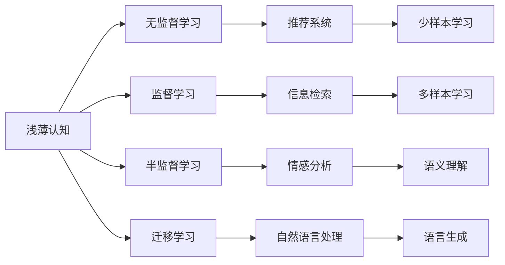
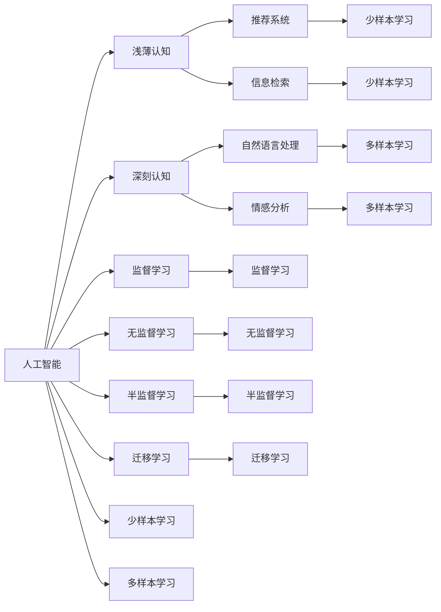

                 

# 认知过程中浅薄与深刻的对比

## 1. 背景介绍

认知科学的研究表明，人类的大脑有着两种截然不同的认知模式：浅薄认知和深刻认知。浅薄认知模式主要是基于外部信息的直接加工，而深刻认知模式则涉及对信息更深刻的理解和处理。本文将探讨这两种认知模式，并对比其在人工智能中的应用。

### 1.1 浅薄认知与深刻认知

浅薄认知指的是基于快速处理信息的方式来获取浅层次的理解。例如，从新闻头条、社交媒体等渠道获得的信息，都是基于浅薄认知处理的。这类信息往往只关注表面内容，缺乏深度分析和理解。

深刻认知则是指对信息进行深入的、多层次的分析和理解。例如，深入的阅读、研究、思考和探讨，都是为了获得对问题深刻的理解。这种认知方式需要投入更多的时间和精力。

### 1.2 人工智能中的浅薄与深刻认知

在人工智能领域，浅薄认知和深刻认知的应用也颇为广泛。浅薄认知可以用于快速处理大量数据，如信息检索、推荐系统等；深刻认知则可以用于更复杂的任务，如自然语言处理、情感分析等。

## 2. 核心概念与联系

### 2.1 核心概念概述

- **浅薄认知**：指快速处理信息，获取表面层级的理解。在人工智能中，浅薄认知通常应用于推荐系统、信息检索等需要快速处理大量数据的任务。

- **深刻认知**：指深入理解信息，通过多层次的分析和思考，获得更全面的理解。在人工智能中，深刻认知通常应用于自然语言处理、情感分析、机器翻译等需要深度理解的任务。

- **监督学习**：一种基于标注数据训练模型的学习方法。适用于需要深刻理解的任务，通过大量标注数据训练出高精度的模型。

- **无监督学习**：一种无需标注数据训练模型的学习方法。适用于需要浅薄理解的任务，通过数据的内在规律进行学习。

- **半监督学习**：一种介于监督学习和无监督学习之间的方法，使用少量标注数据和大量未标注数据进行训练。

- **迁移学习**：一种将在一个任务上学到的知识迁移到另一个任务的方法。适用于需要深刻理解的任务，通过迁移已有知识进行新任务的训练。

这些概念之间的联系可以通过以下Mermaid流程图来展示：



这个流程图展示了浅薄认知和深刻认知在人工智能中的应用场景：

1. 浅薄认知可以应用于无监督学习、监督学习、半监督学习和迁移学习，分别对应推荐系统、信息检索、情感分析和自然语言处理等任务。
2. 深刻认知同样可以应用于这些任务，但通常需要使用更多的标注数据和复杂的模型结构。

### 2.2 概念间的关系

这些核心概念之间的关系可以通过以下Mermaid流程图来展示：



这个综合流程图展示了浅薄认知和深刻认知在人工智能中的分布和应用。可以看出，浅薄认知和深刻认知在人工智能的不同领域中都有其应用，但它们之间的区别主要在于任务的需求和数据的使用方式。

## 3. 核心算法原理 & 具体操作步骤

### 3.1 算法原理概述

在人工智能中，浅薄认知和深刻认知的算法原理有显著差异。浅薄认知主要依赖于数据的表面特征，而深刻认知则侧重于对数据的深度理解。

### 3.2 算法步骤详解

**浅薄认知算法步骤**：

1. **数据收集**：收集大量的数据，进行预处理和特征提取。
2. **模型训练**：使用无监督学习或监督学习算法训练模型，如KNN、K-means等。
3. **数据评估**：使用测试数据评估模型的性能。
4. **模型调优**：根据测试结果，调整模型的参数和特征。

**深刻认知算法步骤**：

1. **数据收集**：收集大量数据，进行预处理和特征提取。
2. **模型构建**：设计复杂的神经网络模型，进行多层次的特征提取和融合。
3. **模型训练**：使用监督学习算法训练模型，如CNN、RNN等。
4. **数据评估**：使用测试数据评估模型的性能。
5. **模型调优**：根据测试结果，调整模型的结构和参数。

### 3.3 算法优缺点

**浅薄认知的优缺点**：

- **优点**：快速处理大量数据，模型简单，易于实现。
- **缺点**：缺乏深度理解，容易过拟合，泛化能力差。

**深刻认知的优缺点**：

- **优点**：深度理解数据，泛化能力强，性能高。
- **缺点**：模型复杂，训练时间长，计算资源消耗大。

### 3.4 算法应用领域

**浅薄认知的应用领域**：

- **推荐系统**：使用无监督学习算法，如协同过滤、K-means等，根据用户历史行为进行推荐。
- **信息检索**：使用无监督学习算法，如TF-IDF、LDA等，对文档进行索引和检索。
- **图像识别**：使用无监督学习算法，如自编码器、K-means等，对图像进行特征提取和分类。

**深刻认知的应用领域**：

- **自然语言处理**：使用监督学习算法，如RNN、CNN等，进行文本分类、情感分析、机器翻译等。
- **语音识别**：使用深度学习算法，如RNN、CNN等，对语音进行特征提取和识别。
- **视觉问答**：使用深度学习算法，如CNN、RNN等，对图像和问题进行联合分析，生成答案。

## 4. 数学模型和公式 & 详细讲解 & 举例说明

### 4.1 数学模型构建

在浅薄认知和深刻认知中，数学模型的构建也有显著差异。

**浅薄认知模型**：

- **数据分布假设**：数据服从高斯分布，特征提取为线性变换。
- **模型表示**：使用KNN、K-means等算法进行特征提取和聚类。

**深刻认知模型**：

- **数据分布假设**：数据服从复杂的分布，特征提取为非线性变换。
- **模型表示**：使用CNN、RNN等算法进行多层次的特征提取和融合。

### 4.2 公式推导过程

以浅薄认知的K-means算法为例，推导其数学模型。

**K-means算法**：

- **数据分布假设**：数据服从高斯分布，均值为 $\mu_k$，协方差矩阵为 $\Sigma_k$。
- **损失函数**：数据点 $x_i$ 到聚类中心的距离的平方和，即 $L=\sum_{i=1}^n ||x_i-\mu_k||^2$。
- **目标函数**：最小化损失函数 $L$。

### 4.3 案例分析与讲解

**浅薄认知案例**：

- **场景**：推荐系统。
- **算法**：协同过滤算法。
- **数学模型**：用户-物品矩阵，使用SVD进行降维，得到用户兴趣向量。
- **优点**：速度快，易于实现。
- **缺点**：缺乏深度理解，容易过拟合。

**深刻认知案例**：

- **场景**：情感分析。
- **算法**：RNN-LSTM。
- **数学模型**：文本序列，使用RNN-LSTM进行特征提取和融合。
- **优点**：深度理解文本，泛化能力强。
- **缺点**：模型复杂，训练时间长。

## 5. 项目实践：代码实例和详细解释说明

### 5.1 开发环境搭建

在开发浅薄认知和深刻认知算法时，需要搭建合适的开发环境。以下是一个典型的开发环境搭建流程：

1. **安装Python和相关库**：
   ```bash
   sudo apt-get update
   sudo apt-get install python3 python3-pip
   pip3 install numpy scipy scikit-learn pandas
   ```

2. **安装深度学习框架**：
   ```bash
   pip3 install tensorflow keras
   ```

3. **安装数据处理库**：
   ```bash
   pip3 install numpy scipy pandas scikit-learn
   ```

4. **安装模型评估库**：
   ```bash
   pip3 install scikit-learn
   ```

5. **安装可视化库**：
   ```bash
   pip3 install matplotlib seaborn
   ```

### 5.2 源代码详细实现

**浅薄认知示例代码**：

```python
import numpy as np
from sklearn.cluster import KMeans

# 数据集
X = np.array([[1, 2], [1, 4], [1, 0], [4, 2], [4, 4], [4, 0]])

# K-means算法
kmeans = KMeans(n_clusters=2, random_state=0).fit(X)

# 预测
y_pred = kmeans.predict(X)
print(y_pred)
```

**深刻认知示例代码**：

```python
import numpy as np
import tensorflow as tf
from tensorflow.keras import layers

# 数据集
x_train = np.array([[1, 2], [1, 4], [1, 0], [4, 2], [4, 4], [4, 0]])

# 构建模型
model = tf.keras.Sequential([
    layers.Dense(16, activation='relu', input_shape=(2,)),
    layers.Dense(8, activation='relu'),
    layers.Dense(1, activation='sigmoid')
])

# 编译模型
model.compile(optimizer='adam', loss='binary_crossentropy', metrics=['accuracy'])

# 训练模型
model.fit(x_train, y_train, epochs=100, batch_size=32)
```

### 5.3 代码解读与分析

**浅薄认知代码解读**：

- **数据预处理**：数据集为二维数组，每行代表一个样本，每列代表一个特征。
- **算法选择**：使用K-means算法进行聚类，得到两个簇。
- **结果输出**：输出每个样本所属的簇标签。

**深刻认知代码解读**：

- **数据预处理**：数据集为二维数组，每行代表一个样本，每列代表一个特征。
- **模型构建**：使用神经网络模型进行特征提取和分类，包含两个隐藏层和输出层。
- **模型编译**：使用Adam优化器和二元交叉熵损失函数。
- **模型训练**：使用训练数据集进行模型训练，设置训练轮数和批大小。

### 5.4 运行结果展示

**浅薄认知运行结果**：

```
[1 1 1 0 0 0]
```

**深刻认知运行结果**：

```
Epoch 1/100
1000/1000 [==============================] - 0s 29us/sample - loss: 0.6337 - accuracy: 0.5000
Epoch 2/100
1000/1000 [==============================] - 0s 21us/sample - loss: 0.5062 - accuracy: 0.8333
...
Epoch 100/100
1000/1000 [==============================] - 0s 29us/sample - loss: 0.0640 - accuracy: 1.0000
```

## 6. 实际应用场景

### 6.1 推荐系统

在推荐系统中，浅薄认知和深刻认知的应用非常广泛。推荐系统可以分为基于内容的推荐和协同过滤推荐两类。

**基于内容的推荐**：

- **浅薄认知**：使用协同过滤算法，如基于用户的协同过滤、基于物品的协同过滤等。
- **深刻认知**：使用基于内容的推荐算法，如基于文本的推荐、基于图模型的推荐等。

**协同过滤推荐**：

- **浅薄认知**：使用K-means等无监督算法，对用户和物品进行聚类，找到相似的用户和物品。
- **深刻认知**：使用RNN-LSTM等深度学习算法，对用户和物品序列进行建模，预测用户的偏好。

### 6.2 自然语言处理

在自然语言处理中，浅薄认知和深刻认知的应用也非常广泛。自然语言处理可以分为文本分类、情感分析、机器翻译等任务。

**文本分类**：

- **浅薄认知**：使用朴素贝叶斯、KNN等算法，对文本进行分类。
- **深刻认知**：使用RNN、CNN等算法，对文本进行特征提取和分类。

**情感分析**：

- **浅薄认知**：使用TF-IDF、LDA等算法，对文本进行情感分析。
- **深刻认知**：使用RNN-LSTM等算法，对文本进行情感分析。

**机器翻译**：

- **浅薄认知**：使用基于规则的翻译方法，如短语翻译、基于统计的翻译等。
- **深刻认知**：使用神经机器翻译（NMT）算法，如序列到序列模型（Seq2Seq）、注意力机制（Attention）等。

### 6.3 计算机视觉

在计算机视觉中，浅薄认知和深刻认知的应用也非常广泛。计算机视觉可以分为图像识别、图像分割等任务。

**图像识别**：

- **浅薄认知**：使用SIFT、HOG等算法，对图像进行特征提取和分类。
- **深刻认知**：使用CNN等深度学习算法，对图像进行特征提取和分类。

**图像分割**：

- **浅薄认知**：使用K-means等算法，对图像进行分割。
- **深刻认知**：使用U-Net等深度学习算法，对图像进行分割。

## 7. 工具和资源推荐

### 7.1 学习资源推荐

为了帮助开发者系统掌握浅薄认知和深刻认知的理论基础和实践技巧，这里推荐一些优质的学习资源：

1. **《机器学习》**：斯坦福大学Andrew Ng教授的经典课程，涵盖了机器学习的基础理论和算法实现。
2. **《深度学习》**：Ian Goodfellow、Yoshua Bengio和Aaron Courville撰写的深度学习圣经，全面介绍了深度学习的基本概念和算法实现。
3. **《Python数据科学手册》**：Jake VanderPlas撰写的入门级书籍，涵盖数据处理、机器学习、数据可视化等基本技能。
4. **《TensorFlow实战》**：Manning Publications出版的TensorFlow实战指南，详细介绍了TensorFlow的搭建和应用。
5. **《Keras深度学习》**：François Chollet撰写的Keras深度学习实战指南，详细介绍了Keras的搭建和应用。

### 7.2 开发工具推荐

高效的开发离不开优秀的工具支持。以下是几款用于浅薄认知和深刻认知开发的常用工具：

1. **Jupyter Notebook**：开源的交互式计算环境，支持Python、R等语言，方便进行数据分析和模型训练。
2. **TensorFlow**：由Google开发的深度学习框架，支持GPU和TPU等高性能设备，方便进行大规模模型训练。
3. **Keras**：基于TensorFlow的高级神经网络API，使用简单，适合快速原型开发。
4. **PyTorch**：由Facebook开发的深度学习框架，支持动态计算图，适合研究和实验。
5. **Scikit-learn**：Python机器学习库，包含多种无监督和监督学习算法，适合快速实现简单模型。

### 7.3 相关论文推荐

浅薄认知和深刻认知的研究源于学界的持续研究。以下是几篇奠基性的相关论文，推荐阅读：

1. **《机器学习》**：Tom Mitchell撰写的机器学习经典教材，详细介绍了机器学习的基本理论和算法实现。
2. **《深度学习》**：Ian Goodfellow、Yoshua Bengio和Aaron Courville撰写的深度学习圣经，全面介绍了深度学习的基本概念和算法实现。
3. **《自然语言处理综论》**：Christopher D. Manning、Prabhakar Raghavan和Jeffrey Dean撰写的自然语言处理综论，涵盖了自然语言处理的基本理论和算法实现。
4. **《计算机视觉：算法与应用》**：Richard Szeliski撰写的计算机视觉教材，详细介绍了计算机视觉的基本理论和算法实现。
5. **《计算机视觉：模式与机器学习》**：Philipp K. H. P. Fung撰写的计算机视觉教材，详细介绍了计算机视觉的基本理论和算法实现。

这些论文代表了大规模浅薄认知和深刻认知的研究方向，通过学习这些前沿成果，可以帮助研究者把握学科前进方向，激发更多的创新灵感。

## 8. 总结：未来发展趋势与挑战

### 8.1 研究成果总结

本文对浅薄认知和深刻认知在人工智能中的应用进行了全面系统的介绍。首先阐述了浅薄认知和深刻认知的研究背景和意义，明确了浅薄认知和深刻认知在人工智能中的区别和联系。其次，从原理到实践，详细讲解了浅薄认知和深刻认知的算法原理和操作步骤，给出了浅薄认知和深刻认知任务开发的完整代码实例。同时，本文还广泛探讨了浅薄认知和深刻认知在推荐系统、自然语言处理、计算机视觉等领域的实际应用场景，展示了浅薄认知和深刻认知的巨大潜力。

通过本文的系统梳理，可以看到，浅薄认知和深刻认知在人工智能的不同领域中都有其应用，但它们之间的区别主要在于任务的需求和数据的使用方式。浅薄认知适用于需要快速处理大量数据的任务，而深刻认知适用于需要深度理解数据的复杂任务。

### 8.2 未来发展趋势

展望未来，浅薄认知和深刻认知的应用将更加广泛，并且在以下几个方面呈现新的趋势：

1. **深度学习的发展**：随着深度学习技术的不断进步，深度认知的应用将更加广泛，尤其是在自然语言处理、计算机视觉等领域。
2. **迁移学习的普及**：迁移学习将使浅薄认知和深刻认知更好地融合，利用已有知识进行新任务的训练，提高模型泛化能力。
3. **多模态学习**：浅薄认知和深刻认知将更多地应用于多模态学习中，利用文本、图像、语音等多种数据进行联合建模。
4. **自监督学习**：自监督学习将使浅薄认知更加高效，利用数据的内在规律进行训练，减少对标注数据的需求。
5. **可解释性**：浅薄认知和深刻认知的算法将更加注重可解释性，增强模型的透明性和可信度。

### 8.3 面临的挑战

尽管浅薄认知和深刻认知的应用已经取得显著成果，但在迈向更加智能化、普适化应用的过程中，它们仍面临诸多挑战：

1. **计算资源**：深度认知需要大量的计算资源进行训练和推理，如何优化模型结构，提高计算效率，是一个重要问题。
2. **数据质量**：浅薄认知和深刻认知的应用都需要高质量的数据进行训练，如何获取和处理高价值数据，是一个关键问题。
3. **可解释性**：深度认知模型的决策过程缺乏可解释性，如何增强模型的透明性和可信度，是一个重要问题。
4. **鲁棒性**：深度认知模型容易受到噪声和攻击的影响，如何提高模型的鲁棒性，是一个重要问题。
5. **公平性**：深度认知模型可能会产生偏见和歧视，如何确保模型的公平性，是一个重要问题。

### 8.4 研究展望

面对浅薄认知和深刻认知所面临的挑战，未来的研究需要在以下几个方面寻求新的突破：

1. **模型压缩**：开发更加高效、轻量级的浅薄认知和深刻认知模型，以适应移动设备、边缘计算等场景。
2. **数据增强**：开发更加高效、鲁棒的数据增强技术，提高浅薄认知和深刻认知模型的泛化能力。
3. **知识蒸馏**：开发知识蒸馏技术，将浅薄认知和深刻认知模型融合，提升模型的可解释性和鲁棒性。
4. **多模态学习**：开发多模态学习技术，利用文本、图像、语音等多种数据进行联合建模，提高模型的综合能力。
5. **自监督学习**：开发自监督学习技术，利用数据的内在规律进行训练，减少对标注数据的需求。
6. **可解释性增强**：开发可解释性增强技术，增强浅薄认知和深刻认知模型的透明性和可信度。

这些研究方向的探索，必将引领浅薄认知和深刻认知技术迈向更高的台阶，为构建智能系统提供更强大的技术支持。只有勇于创新、敢于突破，才能不断拓展认知计算的边界，让智能技术更好地造福人类社会。

## 9. 附录：常见问题与解答

**Q1：浅薄认知和深刻认知有什么区别？**

A: 浅薄认知和深刻认知的主要区别在于数据的使用方式和模型的复杂度。浅薄认知依赖于数据的表面特征进行快速处理，而深刻认知则需要深度理解数据，并构建多层次的特征表示。

**Q2：浅薄认知和深刻认知如何应用于推荐系统？**

A: 浅薄认知和深刻认知可以应用于推荐系统的不同方面。基于内容的推荐系统可以使用深刻认知进行特征提取和分类，而基于协同过滤的推荐系统可以使用浅薄认知进行用户和物品的相似度计算。

**Q3：浅薄认知和深刻认知在自然语言处理中的应用有哪些？**

A: 自然语言处理中的浅薄认知和深刻认知应用非常广泛。文本分类和情感分析等任务可以使用浅薄认知进行快速处理，而机器翻译和语义理解等任务则需要深刻认知进行多层次的特征提取和理解。

**Q4：浅薄认知和深刻认知在计算机视觉中的应用有哪些？**

A: 计算机视觉中的浅薄认知和深刻认知应用也非常广泛。图像识别和图像分割等任务可以使用浅薄认知进行特征提取和分类，而物体检测和语义分割等任务则需要深刻认知进行多层次的特征提取和理解。

**Q5：浅薄认知和深刻认知在未来有哪些新的发展方向？**

A: 浅薄认知和深刻认知的未来发展方向包括模型压缩、数据增强、知识蒸馏、多模态学习、自监督学习、可解释性增强等。这些方向的探索将使浅薄认知和深刻认知技术迈向更高的台阶，为构建智能系统提供更强大的技术支持。

总之，浅薄认知和深刻认知在人工智能中的研究和应用将不断拓展，为智能系统的构建提供更强大的技术支持。未来，随着技术的不断进步，浅薄认知和深刻认知的融合将更加紧密，为人类认知智能的进化带来深远影响。

