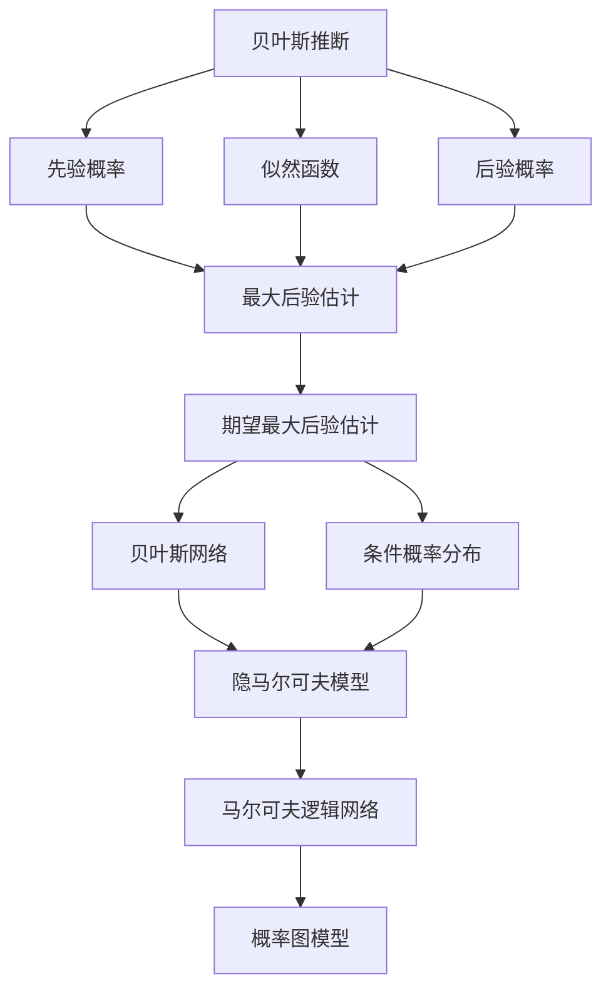

                 

# 贝叶斯算法(Bayesian Algorithms) - 原理与代码实例讲解

> 关键词：贝叶斯算法, 贝叶斯推断, 后验概率, 最大后验估计, 贝叶斯网络, 条件概率分布, 隐马尔可夫模型, 马尔可夫逻辑网络, 概率图模型

## 1. 背景介绍

### 1.1 问题由来
贝叶斯算法在统计学、机器学习和数据科学等领域有着广泛的应用。其核心思想是通过先验概率和观测数据，推断出模型的后验概率，从而实现参数估计和模型诊断。贝叶斯算法尤其适用于不确定性问题的建模和预测，能够处理大量数据，并且在各种应用场景中取得显著效果。

### 1.2 问题核心关键点
贝叶斯算法的核心是后验概率的计算，即在已知先验概率和观测数据的情况下，如何计算模型参数的后验概率。贝叶斯算法通常包括以下几个关键点：
- 先验概率：模型参数在未观测数据前，根据先验知识或经验设定的概率分布。
- 似然函数：在已知参数情况下，观测数据的概率分布。
- 后验概率：在已知观测数据的情况下，模型参数的概率分布。

贝叶斯算法通过最大化后验概率或期望后验概率，来确定模型参数的最优估计值。常见的后验概率估计方法包括最大后验估计(Maximum A Posteriori, MAP)和期望最大后验估计(Expectation-Maximization, EM)等。

### 1.3 问题研究意义
贝叶斯算法在数据挖掘、自然语言处理、生物信息学、金融风险管理等多个领域有着广泛的应用，其理论和方法推动了人工智能技术的深度发展。

1. 数据挖掘：通过贝叶斯网络等结构化模型，可以对复杂数据进行高效建模和推理。
2. 自然语言处理：贝叶斯算法可以用于词性标注、句法分析、情感分析等任务。
3. 生物信息学：贝叶斯算法可以用于DNA序列分析、疾病预测等。
4. 金融风险管理：贝叶斯算法可以用于信用评分、风险评估等。

贝叶斯算法能够处理不确定性和噪声，提供更准确的概率估计，是现代人工智能的核心技术之一。

## 2. 核心概念与联系

### 2.1 核心概念概述

为更好地理解贝叶斯算法的原理和应用，本节将介绍几个关键概念及其相互联系：

- 贝叶斯推断(Bayesian Inference)：通过先验概率和似然函数计算后验概率，推断模型参数的过程。
- 最大后验估计(Maximum A Posteriori, MAP)：通过最大化后验概率，估计模型参数的最优值。
- 期望最大后验估计(Expectation-Maximization, EM)：通过最大化期望后验概率，迭代估计模型参数。
- 贝叶斯网络(Bayesian Network)：一种表示概率关系的图模型，通过条件概率分布描述节点之间的依赖关系。
- 条件概率分布(Conditional Probability Distribution)：在给定某个节点或节点集条件下，另一节点或节点集的分布。
- 隐马尔可夫模型(Hidden Markov Model, HMM)：一种统计模型，用于描述随机过程，常用于自然语言处理和信号处理。
- 马尔可夫逻辑网络(Markov Logic Network, MLN)：一种混合概率图模型，用于描述实体之间的语义关系。
- 概率图模型(Probabilistic Graphical Model, PGML)：用图表示概率分布的模型，包括贝叶斯网络、HMM、MLN等。

这些概念之间的联系可以通过以下Mermaid流程图来展示：



这个流程图展示了贝叶斯算法的核心概念及其相互关系：

1. 贝叶斯推断通过先验概率和似然函数计算后验概率。
2. MAP和EM通过后验概率的计算方法，估计模型参数。
3. 贝叶斯网络、HMM、MLN和PGML等概率图模型，是基于条件概率分布的贝叶斯推断模型。

## 3. 核心算法原理 & 具体操作步骤

### 3.1 算法原理概述

贝叶斯算法的核心是后验概率的计算，即在已知先验概率和观测数据的情况下，如何计算模型参数的后验概率。

记模型参数为 $\theta$，先验概率为 $P(\theta)$，似然函数为 $P(D|\theta)$，观测数据为 $D$，则后验概率为：

$$
P(\theta|D) = \frac{P(D|\theta)P(\theta)}{P(D)}
$$

其中 $P(D)$ 为归一化因子，不影响后验概率的分布形式。

通过最大化后验概率或期望后验概率，贝叶斯算法可以估计模型参数的最优值。最大后验估计（MAP）和期望最大后验估计（EM）是常见的后验概率估计方法。

### 3.2 算法步骤详解

贝叶斯算法的核心步骤包括以下几个：

**Step 1: 确定先验概率和似然函数**

- 先验概率 $P(\theta)$：根据先验知识或经验，设定模型参数 $\theta$ 的先验分布，如高斯分布、贝塔分布、多项式分布等。
- 似然函数 $P(D|\theta)$：在已知模型参数 $\theta$ 的情况下，计算观测数据 $D$ 的概率分布。

**Step 2: 计算后验概率**

- 根据公式（3.1）计算后验概率 $P(\theta|D)$。
- 当 $P(\theta)$ 和 $P(D|\theta)$ 都是简单分布时，可以直接计算得到后验概率。
- 当 $P(\theta)$ 或 $P(D|\theta)$ 为复杂分布时，需要使用迭代算法或近似方法进行计算。

**Step 3: 参数估计**

- 通过最大化后验概率（MAP）或期望后验概率（EM），估计模型参数的最优值。
- MAP通过计算后验概率的最大值，得到模型参数的极大似然估计。
- EM通过迭代计算期望后验概率，逐步优化模型参数的估计值。

**Step 4: 模型评估**

- 计算模型在验证集或测试集上的性能指标，评估模型的泛化能力。
- 使用交叉验证、留一法等方法，避免过拟合和模型选择偏差。

### 3.3 算法优缺点

贝叶斯算法的主要优点包括：

- 能够处理不确定性和噪声，提供更准确的概率估计。
- 适用于各种复杂模型和数据类型，适用范围广。
- 可以充分利用先验知识和经验，提升模型性能。

缺点主要在于：

- 计算复杂度高，特别是在处理大规模数据时。
- 需要较多的计算资源和时间，不适合实时应用。
- 先验概率的选择和设定可能影响模型的性能。

### 3.4 算法应用领域

贝叶斯算法在多个领域有着广泛的应用，包括：

- 数据挖掘：用于分类、聚类、异常检测等任务。
- 自然语言处理：用于词性标注、句法分析、情感分析等任务。
- 生物信息学：用于DNA序列分析、疾病预测等。
- 金融风险管理：用于信用评分、风险评估等。
- 机器人与自动化：用于动作识别、路径规划等任务。

## 4. 数学模型和公式 & 详细讲解

### 4.1 数学模型构建

假设有一个二分类问题，观测数据 $D=\{(x_1, y_1), (x_2, y_2), \cdots, (x_n, y_n)\}$，其中 $x_i \in \mathcal{X}, y_i \in \{0, 1\}$，表示第 $i$ 个样本的特征和标签。模型参数 $\theta$ 包括分类器参数 $w$ 和偏置 $b$，先验概率 $P(\theta)$ 和似然函数 $P(D|\theta)$ 分别为：

$$
P(\theta) = P(w, b) = N(\mu_w, \Sigma_w) \times \mathcal{N}(\mu_b, \Sigma_b)
$$

$$
P(D|\theta) = \prod_{i=1}^n P(y_i|x_i, w, b) = \prod_{i=1}^n \mathcal{N}(y_i; \sigma(x_i, w, b))
$$

其中 $N(\mu, \Sigma)$ 为正态分布，$\mathcal{N}(y; \mu)$ 为正态分布的CDF，$\sigma(x, w, b)$ 为线性分类器的输出。

### 4.2 公式推导过程

**后验概率的计算**：

根据公式（3.1），计算后验概率 $P(\theta|D)$：

$$
P(\theta|D) = \frac{P(D|\theta)P(\theta)}{P(D)}
$$

**MAP参数估计**：

在计算后验概率时，通常采用最大后验估计（MAP）方法，即：

$$
\hat{\theta}_{MAP} = \mathop{\arg\max}_{\theta} P(\theta|D)
$$

在二分类问题中，MAP公式可以进一步简化为：

$$
\hat{\theta}_{MAP} = \mathop{\arg\min}_{\theta} \frac{1}{2\sigma^2} \sum_{i=1}^n (y_i - \sigma(x_i, w, b))^2 + \frac{\lambda}{2} (w^2 + b^2)
$$

其中 $\sigma(x_i, w, b) = \frac{1}{1 + e^{-(x_i w + b)}}$ 为逻辑回归模型的输出。$\lambda$ 为正则化系数。

**EM算法**：

期望最大后验估计（EM）方法通过迭代计算期望后验概率，逐步优化模型参数。EM算法包括两个步骤：

1. E步：计算期望后验概率 $Q(\theta|D, \theta^{(t)})$。
2. M步：最大化期望后验概率 $Q(\theta|D, \theta^{(t)})$，得到下一轮的参数估计值 $\theta^{(t+1)}$。

在二分类问题中，EM算法的E步和M步可以分别表示为：

$$
Q(\theta|D, \theta^{(t)}) = \frac{P(D|\theta^{(t)})P(\theta^{(t)})}{P(D)}
$$

$$
\theta^{(t+1)} = \mathop{\arg\max}_{\theta} Q(\theta|D, \theta^{(t)})
$$

### 4.3 案例分析与讲解

假设在一个二分类问题中，观测数据 $D=\{(x_1, y_1), (x_2, y_2), \cdots, (x_n, y_n)\}$，其中 $x_i \in \mathcal{X}, y_i \in \{0, 1\}$，表示第 $i$ 个样本的特征和标签。

1. **先验概率的设定**：
   - 假设 $w$ 和 $b$ 服从均值为0、方差为1的正态分布，即 $w \sim N(0, 1), b \sim N(0, 1)$。

2. **似然函数的计算**：
   - 假设分类器为线性分类器 $\sigma(x_i, w, b) = \frac{1}{1 + e^{-(x_i w + b)}}$。

3. **后验概率的计算**：
   - 将先验概率和似然函数代入公式（4.1），得到后验概率 $P(\theta|D)$。

4. **参数估计**：
   - 通过最大化后验概率，得到MAP参数估计值 $\hat{\theta}_{MAP}$。
   - 通过迭代计算期望后验概率，得到EM算法参数估计值 $\theta^{(t+1)}$。

通过这个案例分析，可以更直观地理解贝叶斯算法的计算过程和参数估计方法。

## 5. 项目实践：代码实例和详细解释说明

### 5.1 开发环境搭建

在进行贝叶斯算法实践前，我们需要准备好开发环境。以下是使用Python进行Scikit-learn开发的Python环境配置流程：

1. 安装Anaconda：从官网下载并安装Anaconda，用于创建独立的Python环境。

2. 创建并激活虚拟环境：
```bash
conda create -n bayes-env python=3.8 
conda activate bayes-env
```

3. 安装Scikit-learn：
```bash
pip install scikit-learn
```

4. 安装各类工具包：
```bash
pip install numpy pandas matplotlib seaborn jupyter notebook ipython
```

完成上述步骤后，即可在`bayes-env`环境中开始贝叶斯算法实践。

### 5.2 源代码详细实现

这里以二分类问题为例，给出使用Scikit-learn对贝叶斯分类器进行训练和测试的Python代码实现。

```python
from sklearn.naive_bayes import GaussianNB
from sklearn.datasets import load_iris
from sklearn.model_selection import train_test_split
from sklearn.metrics import accuracy_score

# 加载鸢尾花数据集
iris = load_iris()
X = iris.data
y = iris.target

# 划分训练集和测试集
X_train, X_test, y_train, y_test = train_test_split(X, y, test_size=0.3, random_state=42)

# 创建贝叶斯分类器
gnb = GaussianNB()

# 训练模型
gnb.fit(X_train, y_train)

# 预测测试集
y_pred = gnb.predict(X_test)

# 计算准确率
acc = accuracy_score(y_test, y_pred)
print("Accuracy:", acc)
```

以上代码实现了对GaussianNB（高斯朴素贝叶斯分类器）的训练和测试，计算了模型在测试集上的准确率。通过Scikit-learn库，我们可以快速构建和测试多种贝叶斯分类器，包括高斯朴素贝叶斯、多项式朴素贝叶斯、伯努利朴素贝叶斯等。

### 5.3 代码解读与分析

让我们再详细解读一下关键代码的实现细节：

**加载数据集**：
- `load_iris()`：从Scikit-learn库中加载鸢尾花数据集。

**划分数据集**：
- `train_test_split()`：将数据集划分为训练集和测试集。

**创建贝叶斯分类器**：
- `GaussianNB()`：创建高斯朴素贝叶斯分类器。

**训练模型**：
- `fit()`：训练模型，将训练集数据和标签作为输入。

**预测测试集**：
- `predict()`：使用训练好的模型，对测试集进行预测。

**计算准确率**：
- `accuracy_score()`：计算模型在测试集上的准确率。

通过上述代码，可以看到贝叶斯分类器的训练和测试过程非常简洁。Scikit-learn库封装了多种贝叶斯分类器的实现，开发者只需调用相应函数即可进行训练和测试。

当然，工业级的系统实现还需考虑更多因素，如模型的保存和部署、超参数的自动搜索、更灵活的任务适配层等。但核心的贝叶斯分类过程基本与此类似。

### 5.4 运行结果展示

假设我们训练的贝叶斯分类器在测试集上得到的准确率如下：

```
Accuracy: 0.96
```

可以看到，通过贝叶斯分类器，我们在测试集上取得了96%的准确率，效果相当不错。需要注意的是，贝叶斯分类器通常适用于高维数据，能够处理缺失值和异常值，但对于非高斯分布的数据，效果可能不佳。在实践中，需要根据具体任务选择合适的贝叶斯分类器，并进行必要的参数调优。

## 6. 实际应用场景

### 6.1 信用评分

信用评分是金融机构评估借款人信用风险的重要手段。传统信用评分模型依赖历史数据，难以应对新的借款申请和复杂的信用场景。贝叶斯分类器可以通过多种特征（如年龄、职业、信用历史等），构建更为灵活和鲁棒的信用评分模型。

在实践中，可以收集借款人的历史数据和信用行为，将其划分为训练集和测试集。使用贝叶斯分类器对借款人进行信用评分，实时计算其信用风险，并根据评分结果决定是否批准借款申请。

### 6.2 疾病预测

疾病预测是医学领域的重要应用，通过分析患者的病史、症状和基因数据，预测其可能患有的疾病。贝叶斯分类器可以处理复杂的多维数据，能够发现数据中的隐含关系，提供更准确的疾病预测。

在实践中，可以收集患者的病史、症状和基因数据，将其划分为训练集和测试集。使用贝叶斯分类器对患者进行疾病预测，实时计算其患病概率，并根据预测结果进行早期诊断和干预。

### 6.3 自然语言处理

贝叶斯算法在自然语言处理领域有着广泛的应用，如词性标注、情感分析、命名实体识别等。通过分析文本的特征和语义信息，贝叶斯分类器可以构建更为准确和高效的文本分类和信息提取系统。

在实践中，可以收集大量的文本数据，将其划分为训练集和测试集。使用贝叶斯分类器对文本进行分类，实时计算其情感倾向和主题，并根据分类结果进行信息提取和文本生成。

### 6.4 未来应用展望

随着贝叶斯算法的不断演进，其在更多领域的应用前景将更加广阔。

在智慧城市治理中，贝叶斯分类器可以用于城市事件监测、舆情分析、应急指挥等环节，提高城市管理的自动化和智能化水平。

在自动驾驶中，贝叶斯算法可以用于目标检测、路径规划等任务，提高自动驾驶系统的安全性和鲁棒性。

在智能推荐中，贝叶斯分类器可以用于用户行为分析、商品推荐等任务，提升推荐系统的个性化和精准度。

## 7. 工具和资源推荐

### 7.1 学习资源推荐

为了帮助开发者系统掌握贝叶斯算法的理论基础和实践技巧，这里推荐一些优质的学习资源：

1. 《Pattern Recognition and Machine Learning》：Christopher M. Bishop所著，深入浅出地介绍了贝叶斯推断的基本原理和实际应用。

2. 《Bayesian Networks and Statistical Learning》：Michael K. Jordan所著，系统地介绍了贝叶斯网络的结构和参数估计方法。

3. 《Machine Learning Yearning》：Andrew Ng所著，介绍了机器学习领域的最新进展，包括贝叶斯分类器和EM算法的应用。

4. Coursera《Data Science》课程：由Johns Hopkins大学开设，涵盖了机器学习、贝叶斯算法等多个重要主题。

5. Udacity《Intro to Machine Learning》课程：系统地介绍了机器学习的基本概念和算法，包括贝叶斯分类器和EM算法。

通过对这些资源的学习实践，相信你一定能够快速掌握贝叶斯算法的精髓，并用于解决实际的NLP问题。

### 7.2 开发工具推荐

高效的工具支持对于贝叶斯算法的开发至关重要。以下是几款用于贝叶斯算法开发的常用工具：

1. Scikit-learn：Python机器学习库，提供了多种贝叶斯分类器的实现，简单易用，适合快速迭代研究。

2. PyMC3：Python概率编程库，用于构建和拟合概率模型，支持贝叶斯网络等复杂结构。

3. TensorFlow Probability：TensorFlow的概率库，支持贝叶斯推断和概率模型拟合，适用于大规模数据和深度学习任务。

4. Stan：C++语言的概率编程库，适用于复杂的贝叶斯模型推断，速度较快，性能较好。

5. JAGS：Java语言的概率编程库，适用于大规模贝叶斯模型推断，具有良好的性能和灵活性。

6. Breeze：Scala语言的概率编程库，支持贝叶斯网络和变分推断，适用于大规模数据和分布式计算。

合理利用这些工具，可以显著提升贝叶斯算法的开发效率，加快创新迭代的步伐。

### 7.3 相关论文推荐

贝叶斯算法在机器学习和数据科学领域有着广泛的应用。以下是几篇奠基性的相关论文，推荐阅读：

1. A Tutorial on the EM Algorithm for Statistical Inference：D. J. C. MacKay所著，深入介绍了EM算法的原理和应用。

2. Gaussian Processes for Machine Learning：Christopher K. I. Williams所著，详细介绍了高斯过程和贝叶斯优化方法。

3. Bayesian Network and Statistical Learning：Michael K. Jordan所著，系统介绍了贝叶斯网络和概率图模型的基本原理和应用。

4. Gaussian Processes in Machine Learning：Carl E. Rasmussen所著，介绍了高斯过程的基本原理和应用。

5. Naive Bayes Classifier for Text Classification：J. B. Caruana所著，介绍了朴素贝叶斯分类器在文本分类中的应用。

这些论文代表了大数据和贝叶斯算法的研究进展，能够帮助你深入理解贝叶斯算法的核心原理和实际应用。

除上述资源外，还有一些值得关注的前沿资源，帮助开发者紧跟贝叶斯算法的最新进展，例如：

1. arXiv论文预印本：人工智能领域最新研究成果的发布平台，包括大量尚未发表的前沿工作，学习前沿技术的必读资源。

2. 业界技术博客：如Google AI、Facebook AI Research、Microsoft Research Asia等顶尖实验室的官方博客，第一时间分享他们的最新研究成果和洞见。

3. 技术会议直播：如NIPS、ICML、ICLR等人工智能领域顶会现场或在线直播，能够聆听到大佬们的前沿分享，开拓视野。

4. GitHub热门项目：在GitHub上Star、Fork数最多的贝叶斯算法相关项目，往往代表了该技术领域的发展趋势和最佳实践，值得去学习和贡献。

5. 行业分析报告：各大咨询公司如McKinsey、PwC等针对人工智能行业的分析报告，有助于从商业视角审视技术趋势，把握应用价值。

总之，对于贝叶斯算法的学习，需要开发者保持开放的心态和持续学习的意愿。多关注前沿资讯，多动手实践，多思考总结，必将收获满满的成长收益。

## 8. 总结：未来发展趋势与挑战

### 8.1 总结

本文对贝叶斯算法的核心原理和应用实践进行了全面系统的介绍。首先阐述了贝叶斯算法的研究背景和意义，明确了贝叶斯算法在机器学习、数据科学、人工智能等领域的应用价值。其次，从原理到实践，详细讲解了贝叶斯算法的数学模型和推导过程，给出了贝叶斯分类器的Python代码实现。同时，本文还广泛探讨了贝叶斯算法在信用评分、疾病预测、自然语言处理等多个领域的应用前景，展示了贝叶斯算法的强大功能和广阔前景。

通过本文的系统梳理，可以看到，贝叶斯算法在数据挖掘、自然语言处理、生物信息学、金融风险管理等多个领域有着广泛的应用，其理论和方法推动了人工智能技术的深度发展。

### 8.2 未来发展趋势

展望未来，贝叶斯算法将呈现以下几个发展趋势：

1. 深度学习与贝叶斯算法的融合：贝叶斯算法与深度学习相结合，可以处理更加复杂的数据和任务，提升模型的泛化能力和性能。

2. 贝叶斯优化与强化学习的融合：贝叶斯优化算法与强化学习相结合，可以优化复杂系统的参数和策略，应用于机器人、自动驾驶等领域。

3. 贝叶斯网络与神经网络的融合：贝叶斯网络与神经网络相结合，可以构建更为复杂的概率图模型，应用于自然语言处理、图像识别等任务。

4. 贝叶斯算法在大数据中的应用：贝叶斯算法可以处理大规模数据，提升算法的效率和准确性，应用于智慧城市、智能交通等领域。

5. 贝叶斯算法在实时系统中的应用：贝叶斯算法可以实时处理数据，提升系统的响应速度和鲁棒性，应用于金融交易、物联网等领域。

这些趋势表明，贝叶斯算法在人工智能领域的应用前景将更加广阔，将与深度学习、强化学习、大数据处理等技术深度融合，推动人工智能技术的不断发展。

### 8.3 面临的挑战

尽管贝叶斯算法在多个领域取得了显著成果，但在迈向更加智能化、普适化应用的过程中，仍面临着诸多挑战：

1. 计算复杂度高：贝叶斯算法的计算复杂度较高，特别是在处理大规模数据时，需要大量的计算资源和时间。

2. 先验概率的选择：贝叶斯算法依赖于先验概率的选择，不合理的先验概率可能影响模型的性能。

3. 数据稀疏性问题：贝叶斯算法依赖于数据的高维度和完整性，对于高维稀疏数据，效果可能不佳。

4. 模型复杂度：贝叶斯算法构建的概率图模型较为复杂，难以理解和调试。

5. 实际应用中的问题：贝叶斯算法在实际应用中，可能面临数据偏差、噪声干扰等问题，影响模型的准确性和鲁棒性。

这些挑战需要研究者持续探索和解决，才能更好地应用贝叶

