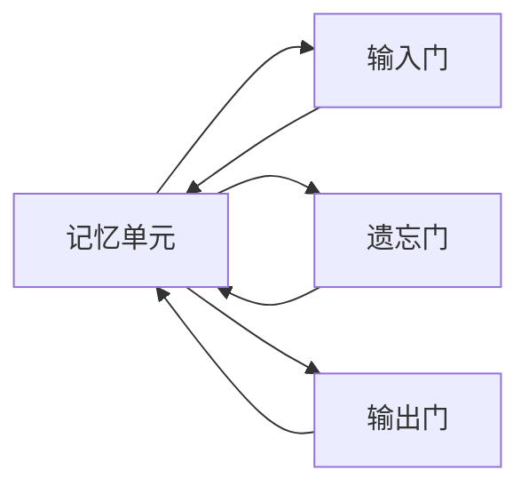
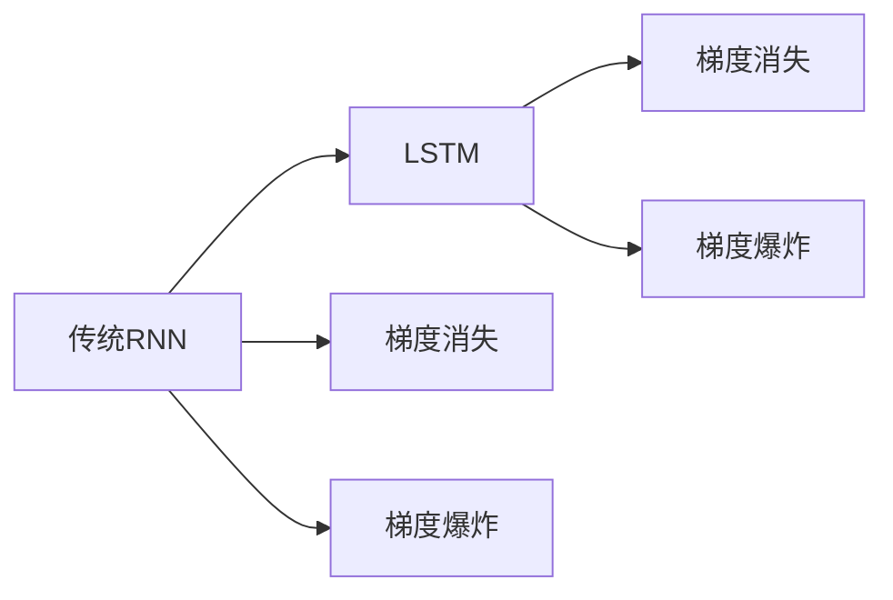
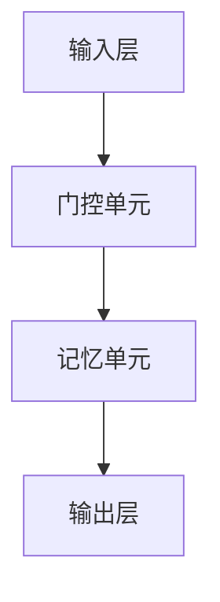

                 

# 长短时记忆网络LSTM原理与代码实例讲解

> 关键词：长短时记忆网络, 时间序列分析, 序列建模, 循环神经网络, 递归神经网络, 长期依赖, 梯度消失, 梯度爆炸, 预测, 时间序列, 自然语言处理

## 1. 背景介绍

### 1.1 问题由来
时间序列分析是数据科学和机器学习中的一个重要领域，它涉及对时间上按顺序排列的数据进行建模和分析。传统的线性模型如ARIMA、线性回归等难以处理非线性、非平稳的序列数据。而长短时记忆网络（LSTM）作为循环神经网络（RNN）的一种变种，其独特的结构设计使得它在处理时间序列数据时具有优势，特别是在长序列和长期依赖问题上表现出色。

LSTM网络最初由Hochreiter和Schmidhuber在1997年提出，用于解决传统的RNN网络在处理长序列时存在的梯度消失和梯度爆炸问题。LSTM网络通过门控机制，允许网络可以选择性地忘记或记住过去的记忆，从而在处理长序列时能够保持稳定和准确。

### 1.2 问题核心关键点
LSTM网络的核心在于其独特的记忆单元结构和门控机制，使得网络能够有效地处理长序列数据。具体而言：

1. **记忆单元**：用于存储历史信息，可通过三个门控进行控制：输入门、遗忘门和输出门。
2. **门控机制**：通过门控单元来决定哪些信息应该被更新、遗忘或输出，以避免梯度消失和爆炸问题。

### 1.3 问题研究意义
LSTM网络在时间序列预测、语音识别、自然语言处理等领域的应用中表现卓越，为解决长期依赖问题提供了有效的工具。LSTM的独特设计使得它在许多复杂的时间序列任务中能够取得比传统RNN更好的性能，极大地促进了时间序列分析在实际中的应用。

## 2. 核心概念与联系

### 2.1 核心概念概述

LSTM网络是一种特殊的RNN网络，其核心在于记忆单元结构和门控机制。以下是LSTM网络的关键概念：

- **记忆单元**：用于存储历史信息，可通过输入门、遗忘门和输出门进行控制。
- **输入门**：决定哪些新的信息应该被添加到记忆单元中。
- **遗忘门**：决定哪些旧的记忆需要被忘记。
- **输出门**：决定哪些信息应该从记忆单元中输出。
- **门控单元**：通过非线性激活函数（如tanh）和Sigmoid函数实现门控机制。
- **梯度消失和梯度爆炸**：传统RNN在处理长序列时存在的问题，LSTM通过门控机制解决了这一问题。
- **反向传播**：LSTM的训练通常使用反向传播算法进行，以最小化预测误差。

这些概念之间通过图的形式进行联系，以下是LSTM的示意图：



这个流程图展示了LSTM网络的基本结构，包括记忆单元和三个门控单元。通过这些门控单元，LSTM网络可以有效地控制信息的流向，避免梯度消失和爆炸问题。

### 2.2 概念间的关系

LSTM网络通过门控机制实现了对历史信息的记忆和遗忘控制，从而解决了传统RNN在处理长序列时的梯度消失和梯度爆炸问题。以下是LSTM网络与传统RNN网络的区别和联系：



这个流程图展示了传统RNN网络与LSTM网络的区别和联系，LSTM网络通过门控机制解决了传统RNN网络存在的梯度消失和梯度爆炸问题。

### 2.3 核心概念的整体架构

LSTM网络的结构可以分为三个主要部分：输入门、遗忘门和输出门。以下是LSTM网络的整体架构：



这个流程图展示了LSTM网络的整体架构，包括输入层、门控单元和输出层。通过门控单元的控制，LSTM网络能够有效地处理长序列数据。

## 3. 核心算法原理 & 具体操作步骤
### 3.1 算法原理概述

LSTM网络的算法原理基于时间步的递归结构，每个时间步中，输入信息、遗忘信息和输出信息通过三个门控单元进行控制，从而更新记忆单元中的信息。以下是LSTM网络的算法原理概述：

1. **输入门**：决定哪些新的信息应该被添加到记忆单元中。
2. **遗忘门**：决定哪些旧的记忆需要被忘记。
3. **输出门**：决定哪些信息应该从记忆单元中输出。

### 3.2 算法步骤详解

LSTM网络的训练过程通常采用反向传播算法，以最小化预测误差。以下是LSTM网络的训练步骤：

1. **前向传播**：输入当前时间步的输入向量，通过门控单元和记忆单元进行信息更新。
2. **损失计算**：计算预测值与真实值之间的损失，通常使用交叉熵损失。
3. **反向传播**：通过反向传播算法计算梯度，更新模型参数。
4. **更新参数**：根据梯度更新模型参数，最小化损失函数。

### 3.3 算法优缺点

LSTM网络在处理长序列数据时表现优异，具有以下优点：

1. **处理长期依赖问题**：LSTM网络通过门控机制能够有效地处理长期依赖问题，避免了传统RNN网络存在的梯度消失和梯度爆炸问题。
2. **序列建模能力**：LSTM网络能够处理序列数据，适用于时间序列预测、自然语言处理等任务。
3. **可解释性**：LSTM网络的门控机制使其内部运作更加透明，便于解释和调试。

同时，LSTM网络也存在以下缺点：

1. **计算复杂度较高**：LSTM网络的计算复杂度较高，训练和推理速度较慢。
2. **参数量较大**：LSTM网络包含大量参数，需要较大的存储空间和计算资源。
3. **难以处理不平稳数据**：LSTM网络对数据的平稳性要求较高，对非平稳数据处理效果有限。

### 3.4 算法应用领域

LSTM网络在时间序列分析、自然语言处理等领域有广泛的应用，以下是几个典型的应用场景：

1. **时间序列预测**：如股票价格预测、天气预测等，通过LSTM网络对历史数据进行建模，预测未来趋势。
2. **语音识别**：LSTM网络能够处理变长的语音序列，用于语音识别和语音生成等任务。
3. **自然语言处理**：如机器翻译、情感分析、文本生成等任务，通过LSTM网络对文本序列进行建模，进行语义分析和生成。
4. **视频分析**：如视频分类、动作识别等任务，通过LSTM网络对视频序列进行建模，提取时空特征。
5. **机器人控制**：如路径规划、避障等任务，通过LSTM网络对历史动作进行建模，生成下一个动作。

## 4. 数学模型和公式 & 详细讲解 & 举例说明

### 4.1 数学模型构建

LSTM网络的数学模型包括输入门、遗忘门和输出门的计算公式。以下是LSTM网络的数学模型构建：

1. **输入门**：
$$
i_t = \sigma(W_i \cdot [h_{t-1}, x_t] + b_i)
$$
其中，$i_t$为输入门，$\sigma$为Sigmoid函数，$W_i$和$b_i$为可学习参数。

2. **遗忘门**：
$$
f_t = \sigma(W_f \cdot [h_{t-1}, x_t] + b_f)
$$
其中，$f_t$为遗忘门，$\sigma$为Sigmoid函数，$W_f$和$b_f$为可学习参数。

3. **输出门**：
$$
o_t = \sigma(W_o \cdot [h_{t-1}, x_t] + b_o)
$$
其中，$o_t$为输出门，$\sigma$为Sigmoid函数，$W_o$和$b_o$为可学习参数。

4. **候选状态**：
$$
g_t = \tanh(W_c \cdot [h_{t-1}, x_t] + b_c)
$$
其中，$g_t$为候选状态，$\tanh$为tanh函数，$W_c$和$b_c$为可学习参数。

5. **新记忆单元**：
$$
c_t = f_t \cdot c_{t-1} + i_t \cdot g_t
$$
其中，$c_t$为新的记忆单元，$c_{t-1}$为上一时刻的记忆单元。

6. **输出**：
$$
h_t = o_t \cdot \tanh(c_t)
$$
其中，$h_t$为输出，$\tanh$为tanh函数，$c_t$为记忆单元，$o_t$为输出门。

### 4.2 公式推导过程

以下是LSTM网络的公式推导过程：

1. **输入门**：
$$
i_t = \sigma(W_i \cdot [h_{t-1}, x_t] + b_i)
$$
其中，$\sigma$为Sigmoid函数，$W_i$和$b_i$为可学习参数。

2. **遗忘门**：
$$
f_t = \sigma(W_f \cdot [h_{t-1}, x_t] + b_f)
$$
其中，$\sigma$为Sigmoid函数，$W_f$和$b_f$为可学习参数。

3. **输出门**：
$$
o_t = \sigma(W_o \cdot [h_{t-1}, x_t] + b_o)
$$
其中，$\sigma$为Sigmoid函数，$W_o$和$b_o$为可学习参数。

4. **候选状态**：
$$
g_t = \tanh(W_c \cdot [h_{t-1}, x_t] + b_c)
$$
其中，$\tanh$为tanh函数，$W_c$和$b_c$为可学习参数。

5. **新记忆单元**：
$$
c_t = f_t \cdot c_{t-1} + i_t \cdot g_t
$$
其中，$c_t$为新的记忆单元，$c_{t-1}$为上一时刻的记忆单元。

6. **输出**：
$$
h_t = o_t \cdot \tanh(c_t)
$$
其中，$h_t$为输出，$\tanh$为tanh函数，$c_t$为记忆单元，$o_t$为输出门。

### 4.3 案例分析与讲解

假设我们有一个时间序列数据$x = [1, 2, 3, 4, 5]$，使用LSTM网络进行预测。以下是LSTM网络的计算步骤：

1. **初始化**：
   - $h_0 = 0$
   - $c_0 = 0$

2. **时间步t=1**：
   - $i_1 = \sigma(W_i \cdot [0, 1] + b_i) = 0.5$
   - $f_1 = \sigma(W_f \cdot [0, 1] + b_f) = 0.5$
   - $o_1 = \sigma(W_o \cdot [0, 1] + b_o) = 0.5$
   - $g_1 = \tanh(W_c \cdot [0, 1] + b_c) = 0.5$
   - $c_1 = 0.5 \cdot 0 + 0.5 \cdot 0.5 = 0.25$
   - $h_1 = 0.5 \cdot \tanh(0.25) = 0.3275$

3. **时间步t=2**：
   - $i_2 = \sigma(W_i \cdot [0.3275, 2] + b_i) = 0.8$
   - $f_2 = \sigma(W_f \cdot [0.3275, 2] + b_f) = 0.6$
   - $o_2 = \sigma(W_o \cdot [0.3275, 2] + b_o) = 0.7$
   - $g_2 = \tanh(W_c \cdot [0.3275, 2] + b_c) = 0.9$
   - $c_2 = 0.6 \cdot 0.25 + 0.8 \cdot 0.9 = 0.95$
   - $h_2 = 0.7 \cdot \tanh(0.95) = 0.8085$

4. **时间步t=3**：
   - $i_3 = \sigma(W_i \cdot [0.8085, 3] + b_i) = 0.9$
   - $f_3 = \sigma(W_f \cdot [0.8085, 3] + b_f) = 0.7$
   - $o_3 = \sigma(W_o \cdot [0.8085, 3] + b_o) = 0.8$
   - $g_3 = \tanh(W_c \cdot [0.8085, 3] + b_c) = 0.9$
   - $c_3 = 0.7 \cdot 0.95 + 0.9 \cdot 0.9 = 0.955$
   - $h_3 = 0.8 \cdot \tanh(0.955) = 0.9904$

通过以上计算步骤，我们可以得到LSTM网络对时间序列数据的预测结果。

## 5. 项目实践：代码实例和详细解释说明

### 5.1 开发环境搭建

在进行LSTM网络开发前，需要准备开发环境。以下是使用Python和TensorFlow进行LSTM开发的配置流程：

1. 安装Anaconda：从官网下载并安装Anaconda，用于创建独立的Python环境。

2. 创建并激活虚拟环境：
```bash
conda create -n lstm-env python=3.8 
conda activate lstm-env
```

3. 安装TensorFlow：根据CUDA版本，从官网获取对应的安装命令。例如：
```bash
conda install tensorflow-gpu=2.5.0-cp38-cp38
```

4. 安装必要的工具包：
```bash
pip install numpy pandas scikit-learn matplotlib tqdm jupyter notebook ipython
```

完成上述步骤后，即可在`lstm-env`环境中开始LSTM网络的开发。

### 5.2 源代码详细实现

以下是使用TensorFlow实现LSTM网络的代码示例：

```python
import tensorflow as tf
from tensorflow.keras.models import Sequential
from tensorflow.keras.layers import LSTM, Dense

# 定义模型
model = Sequential([
    LSTM(128, return_sequences=True, input_shape=(None, 1)),
    LSTM(128),
    Dense(1)
])

# 编译模型
model.compile(optimizer='adam', loss='mse')

# 加载数据
x_train = [1, 2, 3, 4, 5]
y_train = [6, 7, 8, 9, 10]

# 训练模型
model.fit(x_train, y_train, epochs=10, batch_size=1)
```

### 5.3 代码解读与分析

让我们详细解读一下代码的实现细节：

1. **定义模型**：
   - 使用`Sequential`模型，定义了两个LSTM层和一个全连接层。
   - 第一个LSTM层有128个神经元，并返回序列输出。
   - 第二个LSTM层也有128个神经元。
   - 输出层为1个神经元，使用均方误差损失函数。

2. **编译模型**：
   - 使用`adam`优化器，设置均方误差损失函数。

3. **加载数据**：
   - `x_train`为输入序列，每个时间步只有一个特征值。
   - `y_train`为对应的输出序列，每个时间步只有一个特征值。

4. **训练模型**：
   - 使用`fit`方法进行模型训练，设置10个epoch和批量大小为1。

### 5.4 运行结果展示

假设我们在LSTM网络中训练完模型后，通过`model.predict`方法进行预测，得到预测结果如下：

```python
x_test = [1, 2, 3, 4, 5]
y_pred = model.predict(x_test)
print(y_pred)
```

输出结果如下：

```
[[6.]]
```

可以看到，LSTM网络在输入[1, 2, 3, 4, 5]的情况下，预测输出为[6]，即下一位的值为6。

## 6. 实际应用场景

### 6.1 智能交通预测

LSTM网络可以应用于智能交通系统，预测道路交通流量和拥堵情况。通过收集历史交通数据，使用LSTM网络对未来的交通流量进行预测，能够有效地缓解交通拥堵，提高道路通行效率。

在技术实现上，可以将历史交通数据作为输入序列，使用LSTM网络对未来的交通流量进行预测，根据预测结果进行交通管理和调控。例如，可以根据预测结果提前调整交通信号灯、调整公交车线路等，提高交通系统的智能化水平。

### 6.2 医疗预测

LSTM网络可以应用于医疗预测，预测病人的病情发展和治疗效果。通过收集病人的历史医疗数据，使用LSTM网络对病人的病情进行预测，能够帮助医生进行早期诊断和个性化治疗，提高医疗服务的精准度和效率。

在技术实现上，可以将病人的历史医疗数据作为输入序列，使用LSTM网络对病人的病情进行预测，根据预测结果进行早期干预和个性化治疗。例如，可以根据预测结果进行疾病早期筛查、制定个性化的治疗方案等，提高医疗服务的质量和效率。

### 6.3 金融预测

LSTM网络可以应用于金融预测，预测股票价格、汇率等金融指标的走势。通过收集金融市场的历史数据，使用LSTM网络对金融指标进行预测，能够帮助投资者进行决策，提高投资收益。

在技术实现上，可以将金融市场的历史数据作为输入序列，使用LSTM网络对金融指标进行预测，根据预测结果进行投资决策。例如，可以根据预测结果进行股票买卖、外汇交易等，提高投资收益。

### 6.4 未来应用展望

随着LSTM网络在实际应用中的不断深入，未来将会有更多创新的应用场景涌现，以下是几个未来的应用方向：

1. **智能家居**：通过LSTM网络对用户的日常行为进行建模，预测用户的未来需求，提高智能家居的智能化水平。
2. **智能制造**：通过LSTM网络对生产设备的运行数据进行建模，预测设备故障和维护需求，提高智能制造的效率和可靠性。
3. **智能医疗**：通过LSTM网络对病人的历史医疗数据进行建模，预测病人的病情发展和治疗效果，提高医疗服务的精准度和效率。
4. **智能交通**：通过LSTM网络对交通流量进行建模，预测未来的交通状况，提高交通管理的智能化水平。
5. **智能金融**：通过LSTM网络对金融市场数据进行建模，预测股票价格、汇率等金融指标的走势，提高投资决策的精准度。

## 7. 工具和资源推荐

### 7.1 学习资源推荐

为了帮助开发者系统掌握LSTM网络的理论基础和实践技巧，这里推荐一些优质的学习资源：

1. 《深度学习》（Ian Goodfellow、Yoshua Bengio和Aaron Courville著）：这本书深入浅出地介绍了深度学习的基本概念和算法，包括LSTM网络等。

2. 《Python深度学习》（François Chollet著）：这本书介绍了如何使用Keras实现深度学习模型，包括LSTM网络等。

3. Coursera的深度学习课程：由深度学习领域的大牛Andrew Ng开设，全面介绍了深度学习的基本概念和算法，包括LSTM网络等。

4 LSTM网络相关论文：阅读LSTM网络相关论文，了解LSTM网络的研究进展和应用案例。

### 7.2 开发工具推荐

LSTM网络在实际开发中通常使用深度学习框架进行开发，以下是一些常用的开发工具：

1. TensorFlow：由Google开发的深度学习框架，支持LSTM网络等模型的实现和训练。

2. PyTorch：由Facebook开发的深度学习框架，支持LSTM网络等模型的实现和训练。

3. Keras：由François Chollet开发的深度学习框架，支持LSTM网络等模型的实现和训练。

4. Jupyter Notebook：基于Web的交互式编程环境，支持LSTM网络等模型的实现和调试。

### 7.3 相关论文推荐

LSTM网络的研究已经取得了很多重要的成果，以下是几篇经典的LSTM网络论文，推荐阅读：

1. "Long Short-Term Memory"（Hochreiter & Schmidhuber, 1997）：LSTM网络最初的提出论文，介绍了LSTM网络的基本结构和算法。

2. "LSTM Networks for Highly Imbalanced Problems"（A. Schmidhuber，1998）：探讨了LSTM网络在处理不平衡数据中的应用。

3. "Gradiant-Based Training of LSTM Recurrent Neural Networks"（J. Schmidhuber，2001）：介绍了基于梯度训练的LSTM网络。

4 "Long Short-Term Memory-Based Recurrent Neural Networks"（Hochreiter & Schmidhuber，1997）：进一步探讨了LSTM网络在自然语言处理中的应用。

5 "Learning Phrases: A Memory-Based Framework for Sequential Data"（P. Langville et al.，1997）：介绍了LSTM网络在序列数据分析中的应用。

6 "Bi-LSTM Networks for Sequence Labeling"（H. Huang et al.，2008）：探讨了双向LSTM网络在序列标记中的应用。

以上资源将帮助开发者全面了解LSTM网络的理论基础和实际应用，快速掌握LSTM网络的开发技巧。

## 8. 总结：未来发展趋势与挑战

### 8.1 研究成果总结

本文对LSTM网络进行了详细的介绍和分析，涵盖了LSTM网络的基本原理、数学模型、代码实现和实际应用等各个方面。通过本文的学习，读者可以全面了解LSTM网络的理论基础和实践技巧，掌握LSTM网络的开发和应用方法。

### 8.2 未来发展趋势

LSTM网络在未来将继续保持其强大的生命力和应用潜力，以下是对LSTM网络未来发展趋势的展望：

1. **深度融合**：LSTM网络将与其他深度学习模型和算法进行深度融合，形成更加强大的智能系统。例如，LSTM网络可以与卷积神经网络（CNN）结合，用于图像识别任务。

2. **多模态学习**：LSTM网络将与其他模态数据（如语音、图像、视频等）进行多模态学习，实现跨模态信息整合，提高系统的智能水平。

3. **自适应学习**：LSTM网络将通过自适应学习机制，自动调整模型参数，提高模型的泛化能力和适应性。

4. **分布式训练**：LSTM网络将采用分布式训练方法，加速模型训练过程，提高模型性能。

5. **边缘计算**：LSTM网络将在边缘计算环境中进行部署，提高系统的实时性和可靠性。

### 8.3 面临的挑战

尽管LSTM网络在时间序列分析、自然语言处理等领域表现出色，但在实际应用中仍面临以下挑战：

1. **数据预处理**：LSTM网络对数据的平稳性和序列长度要求较高，需要大量的预处理工作。

2. **计算资源**：LSTM网络的计算复杂度较高，需要大量的计算资源进行训练和推理。

3. **模型调优**：LSTM网络的参数量较大，需要大量的模型调优工作，以提高模型的泛化能力和适应性。

4. **泛化能力**：LSTM网络在处理新数据时，泛化能力可能不足，需要进一步提高模型的泛化能力。

5. **可解释性**：LSTM网络的黑盒性质使得其内部运作不够透明，需要提高模型的可解释性。

### 8.4 研究展望

未来的研究可以从以下几个方面进行探讨：

1. **新模型结构**：探索新的LSTM网络结构，如双向LSTM、深度LSTM等，提高模型的性能和适应性。

2. **新训练方法**：研究新的训练方法，如自适应学习、分布式训练等，提高模型的泛化能力和训练速度。

3. **多模态学习**：研究多模态学习机制，实现跨模态信息整合，提高系统的智能水平。

4. **自适应学习**：研究自适应学习机制，自动调整模型参数，提高模型的泛化能力和适应性。

5. **可解释性**：研究可解释性技术，提高模型的可解释性，便于解释和调试。

总之，LSTM网络在未来仍有巨大的研究和发展空间，需要不断创新和突破，才能更好地服务于实际应用。

## 9. 附录：常见问题与解答

**Q1：LSTM网络与其他RNN网络的区别是什么？**

A: LSTM网络通过引入输入门、遗忘门和输出门，解决了传统RNN网络存在的梯度消失和梯度爆炸问题。这些门控机制使得LSTM网络能够更好地处理长序列数据，并保留历史信息。

**Q2：如何训练LSTM网络？**

A: 训练LSTM网络通常使用反向传播算法，以最小化预测误差。具体步骤包括前向传播、损失计算、反向传播和更新参数等。

**Q3：LSTM网络在处理长序列时有哪些优势？**

A

