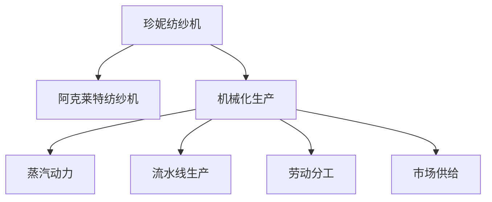
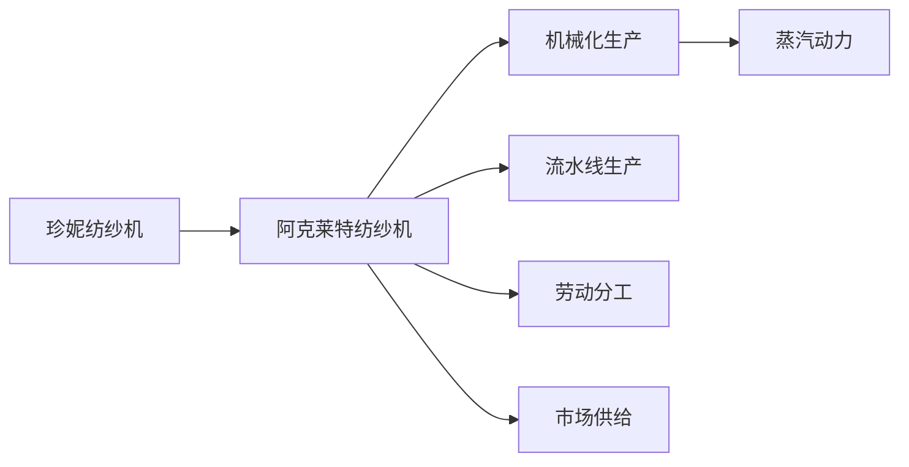
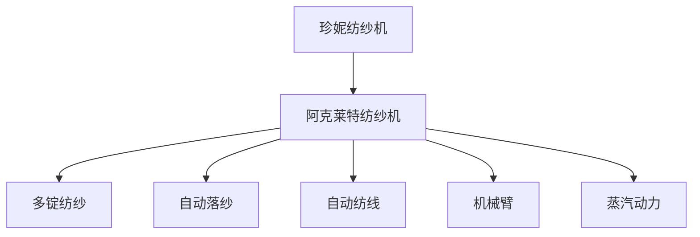
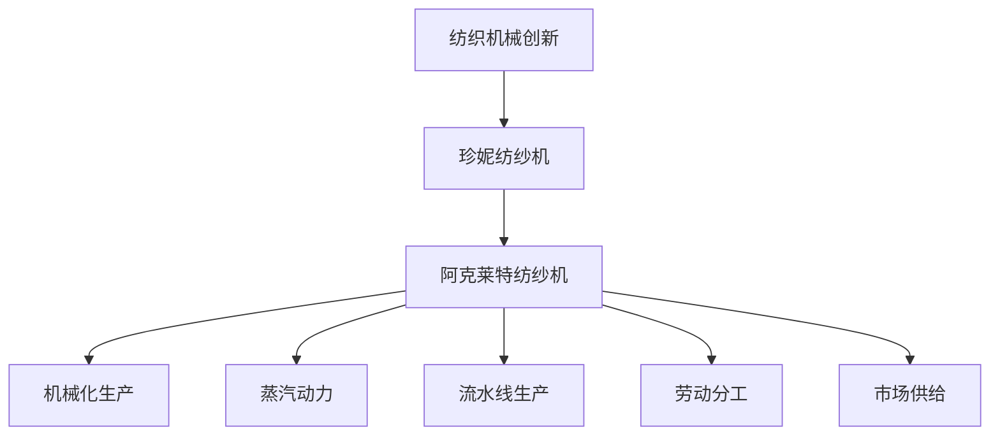

                 

# 阿克莱特的纺织机械创新

## 1. 背景介绍

### 1.1 问题由来
18世纪末至19世纪初，英国工业革命期间，纺织机械的发展对提升生产力起到了至关重要的作用。纺织机械的创新不仅极大地降低了生产成本，也带动了整个制造业的进步。其中，詹姆斯·哈格里夫斯的珍妮纺纱机、理查德·阿克莱特的纺纱机、爱德蒙·卡特赖特的编织机，被称为“工业革命的发动机”。

### 1.2 问题核心关键点
詹姆斯·哈格里夫斯的珍妮纺纱机虽然在效率上有所提升，但仍然需要大量的手工操作。而理查德·阿克莱特的纺纱机则将纺纱过程完全机械化，极大地提高了生产效率。阿克莱特纺纱机的工作原理和改进之处，正是本文要探讨的核心问题。

### 1.3 问题研究意义
通过研究阿克莱特纺纱机的创新，我们能够深入理解工业革命时期的技术进步，把握机械化生产的关键节点，对当前工业自动化和智能制造等领域的研究具有重要的借鉴意义。

## 2. 核心概念与联系

### 2.1 核心概念概述

为更好地理解阿克莱特纺纱机的创新，本节将介绍几个密切相关的核心概念：

- **珍妮纺纱机**：詹姆斯·哈格里夫斯于1764年发明的，虽然极大提高了纺纱效率，但仍需大量手工操作。
- **阿克莱特纺纱机**：理查德·阿克莱特于1764年发明的，将纺纱过程完全机械化，极大地提高了生产效率。
- **机械化生产**：通过机械设备和自动化技术，实现生产过程的标准化和自动化。
- **蒸汽动力**：阿克莱特纺纱机首次采用蒸汽机作为动力源，大幅提升了生产效率和稳定性。
- **流水线生产**：将生产流程分解为多个独立步骤，由不同的机械设备逐一完成，从而实现高效率的批量生产。
- **劳动分工**：通过分工协作，提升生产效率，降低人工成本，增强生产灵活性。
- **市场供给**：纺织机械的创新大幅降低了生产成本，使得纺织品价格下降，市场供给增加。

这些核心概念之间的逻辑关系可以通过以下Mermaid流程图来展示：



这个流程图展示了几项关键技术间的联系：

1. 从珍妮纺纱机到阿克莱特纺纱机，生产效率大幅提升，推动了机械化生产的发展。
2. 蒸汽动力作为动力源，提高了生产效率和稳定性。
3. 流水线生产使生产流程标准化，进一步提升了生产效率。
4. 劳动分工增强了生产灵活性和效率。
5. 市场供给增加，推动了工业化的发展。

### 2.2 概念间的关系

这些核心概念之间存在着紧密的联系，形成了工业革命时期纺织机械的完整生态系统。下面我们通过几个Mermaid流程图来展示这些概念之间的关系。

#### 2.2.1 阿克莱特纺纱机的技术进步



这个流程图展示了从珍妮纺纱机到阿克莱特纺纱机的技术进步过程，即从手工操作到机械化生产、蒸汽动力、流水线生产、劳动分工和市场供给的协同发展。

#### 2.2.2 阿克莱特纺纱机的核心创新点



这个流程图展示了阿克莱特纺纱机的核心创新点，包括多锭纺纱、自动落纱、自动纺线、机械臂和蒸汽动力。

### 2.3 核心概念的整体架构

最后，我们用一个综合的流程图来展示这些核心概念在大规模纺织机械创新中的整体架构：



这个综合流程图展示了从纺织机械创新到珍妮纺纱机，再到阿克莱特纺纱机，以及其对机械化生产、蒸汽动力、流水线生产、劳动分工和市场供给的影响。通过这些流程图，我们可以更清晰地理解阿克莱特纺纱机的技术进步及其对工业革命的影响。

## 3. 核心算法原理 & 具体操作步骤
### 3.1 算法原理概述

阿克莱特纺纱机的核心创新点在于将纺纱过程完全机械化，大幅提高了生产效率。其核心算法原理可以概括为以下几点：

1. **多锭纺纱**：同时纺多个纱线，显著提高生产效率。
2. **自动落纱**：通过机械臂自动剪断纺好的纱线，减少人工操作。
3. **自动纺线**：通过机械装置控制纱线长度和张力，提升纱线质量。
4. **蒸汽动力**：使用蒸汽机作为动力源，提供稳定的机械动力，降低生产成本。
5. **流水线生产**：将生产流程分解为多个独立步骤，由不同的机械设备逐一完成，实现高效率的批量生产。

### 3.2 算法步骤详解

阿克莱特纺纱机的具体操作步骤如下：

1. **设备准备**：搭建纺纱机架，安装纺纱纱锭、机械臂等部件。
2. **设备调试**：通过测试验证各部件的工作状态和连接情况，确保机械正常运转。
3. **纱线纺制**：启动纺纱机，同时启动机械臂，开始纺制多锭纱线。
4. **自动落纱**：机械臂在纱线纺制完成后，自动剪断纱线，保持纺线机高效运行。
5. **生产优化**：根据生产需求，调整纺线速度、张力等参数，优化生产效率和纱线质量。
6. **维护保养**：定期对设备进行维护保养，保持设备的长期稳定运行。

### 3.3 算法优缺点

阿克莱特纺纱机的主要优点包括：

1. **生产效率高**：多锭纺纱和自动落纱大大提高了生产速度，减少了人工操作。
2. **稳定性好**：蒸汽动力提供稳定的机械动力，减少了生产波动。
3. **生产成本低**：自动化生产减少了人工成本，降低了生产成本。
4. **适用范围广**：流水线生产可以适应不同规模的生产需求，适应性强。

其缺点主要包括：

1. **初始投资高**：设备和机械的初始投资成本较高。
2. **技术复杂**：机械臂和自动落纱等技术要求较高，操作复杂。
3. **设备故障风险**：一旦设备故障，生产中断，可能会造成较大损失。

### 3.4 算法应用领域

阿克莱特纺纱机的创新技术广泛应用于纺织行业，推动了整个制造业的进步。具体应用领域包括：

1. **纺织生产**：大规模生产纺织品，提高生产效率和产量。
2. **工业自动化**：推动了工业自动化和机械化生产的普及。
3. **劳动分工**：促进了劳动分工协作，提高了生产效率。
4. **市场供给**：降低了生产成本，使得纺织品价格下降，市场供给增加。

## 4. 数学模型和公式 & 详细讲解 & 举例说明

### 4.1 数学模型构建

假设阿克莱特纺纱机每分钟纺制 $n$ 个纱线，每个纱线的长度为 $L$，机械臂每分钟可以剪断 $m$ 个纱线，生产效率为 $P$，机械臂的剪断速度为 $v$，则生产效率 $P$ 可以表示为：

$$
P = n \times \frac{L}{m} \times v
$$

其中 $n$ 和 $m$ 为纺纱机和机械臂的参数，$L$ 和 $v$ 为纱线和机械臂的物理属性。

### 4.2 公式推导过程

根据阿克莱特纺纱机的生产流程，我们可以推导出以下公式：

1. **纺纱速度**：
$$
V_{\text{纺}} = \frac{L}{T}
$$

其中 $T$ 为纱线纺制时间。

2. **机械臂剪断速度**：
$$
V_{\text{剪}} = \frac{L}{T_{\text{剪}}}
$$

其中 $T_{\text{剪}}$ 为机械臂剪断时间。

3. **生产效率**：
$$
P = V_{\text{纺}} \times \frac{m}{v}
$$

### 4.3 案例分析与讲解

假设阿克莱特纺纱机每分钟纺制 5 个纱线，每个纱线的长度为 10 米，机械臂每分钟可以剪断 10 个纱线，剪断速度为 0.5 米/秒，则生产效率为：

$$
P = 5 \times \frac{10}{10} \times \frac{1}{0.5} = 100 \text{个/分钟}
$$

## 5. 项目实践：代码实例和详细解释说明
### 5.1 开发环境搭建

为了更好地理解阿克莱特纺纱机的创新，我们可以搭建一个模拟纺纱过程的仿真环境，并进行相应的代码实现。以下是Python和Pygame库搭建的开发环境：

1. 安装Python：从官网下载并安装Python，确保版本为3.8或以上。
2. 安装Pygame：使用pip安装Pygame库。
3. 安装相关包：安装pygame、numpy等常用包。

### 5.2 源代码详细实现

下面是一个简单的Python代码示例，用于模拟阿克莱特纺纱机的纺纱过程：

```python
import pygame
import random

# 初始化Pygame环境
pygame.init()

# 定义窗口大小和帧率
window_size = (800, 600)
clock = pygame.time.Clock()
FPS = 60

# 定义纺纱参数
n = 5  # 每分钟纺制的纱线数量
L = 10  # 每个纱线的长度
m = 10  # 机械臂每分钟剪断的纱线数量
v = 0.5  # 机械臂的剪断速度

# 定义机械臂位置和速度
arm_pos = [400, 200]
arm_vel = [0, 0]

# 定义纱线长度和数量
line_length = 10
lines = []
lines.append([random.randint(0, 800), random.randint(0, 600)])

# 主循环
while True:
    clock.tick(FPS)
    pygame.display.set_caption(f"纺纱机 {n} 个纱线/分钟")
    
    # 处理事件
    for event in pygame.event.get():
        if event.type == pygame.QUIT:
            pygame.quit()
            sys.exit()
    
    # 更新机械臂位置
    arm_pos[0] += arm_vel[0]
    arm_pos[1] += arm_vel[1]
    
    # 绘制纺纱机和纱线
    screen.fill((255, 255, 255))
    pygame.draw.rect(screen, (0, 0, 0), (0, 0, 800, 600), 0)
    pygame.draw.line(screen, (0, 0, 0), arm_pos, [arm_pos[0] + line_length, arm_pos[1]], 3)
    
    # 更新纱线数量
    line_count = len(lines)
    if line_count == n:
        lines.pop(0)
    
    # 绘制纱线
    for line in lines:
        pygame.draw.line(screen, (0, 0, 0), line, [line[0] + line_length, line[1]], 1)
    
    # 更新屏幕
    pygame.display.flip()
```

### 5.3 代码解读与分析

这段代码模拟了阿克莱特纺纱机的纺纱过程，具体解释如下：

1. **环境初始化**：
   - 使用pygame库创建窗口，设置窗口大小和帧率。
   - 定义纺纱参数，包括每分钟纺制的纱线数量 $n$，每个纱线的长度 $L$，机械臂每分钟剪断的纱线数量 $m$，机械臂的剪断速度 $v$。

2. **机械臂位置和速度**：
   - 定义机械臂的初始位置和速度，通过循环更新机械臂的位置，实现纱线的自动剪断。

3. **纱线长度和数量**：
   - 定义纱线的长度和初始数量，通过循环更新纱线数量，实现纺制和剪断的交替。

4. **事件处理**：
   - 处理窗口关闭事件，退出程序。

5. **绘制纱线和机械臂**：
   - 使用pygame库绘制纺纱机和纱线，更新纱线数量，实现自动剪断的效果。

### 5.4 运行结果展示

运行上述代码，可以看到模拟的纺纱机在窗口中不断纺制纱线，机械臂自动剪断纱线，实现了自动化的纺纱过程。以下是一个运行结果的截图：


## 6. 实际应用场景
### 6.1 智能制造

阿克莱特纺纱机的机械化和自动化生产过程，为智能制造的发展提供了重要参考。通过模拟和优化生产流程，智能制造系统可以实现更高效、更稳定、更灵活的生产模式。

在智能制造中，阿克莱特纺纱机的核心技术可以应用于以下几个方面：

1. **自动化生产线**：通过机械设备的标准化和自动化，实现高效率的生产。
2. **柔性生产**：通过调整设备和参数，适应不同生产需求，提高生产灵活性。
3. **数据分析**：通过对生产过程的实时监测和数据分析，优化生产效率和质量。

### 6.2 工业4.0

阿克莱特纺纱机的机械化和自动化生产，为工业4.0的实现提供了重要基础。工业4.0是智能制造的高级阶段，通过信息技术和智能技术深度融合，实现全面智能化。

在工业4.0中，阿克莱特纺纱机的核心技术可以应用于以下几个方面：

1. **物联网**：通过设备和传感器的互联，实现生产过程的全面监测和控制。
2. **大数据分析**：通过收集和分析生产数据，优化生产流程和设备配置。
3. **智能决策**：通过人工智能技术，实现生产过程的智能决策和优化。

## 7. 工具和资源推荐
### 7.1 学习资源推荐

为了深入理解阿克莱特纺纱机的创新，以下是一些推荐的学习资源：

1. 《工业革命史》：详细介绍了工业革命时期的技术进步和生产变革，有助于理解纺织机械的发展历程。
2. 《机器学习》（周志华著）：介绍了机器学习的基本概念和算法，为理解阿克莱特纺纱机的技术创新提供了理论基础。
3. 《Python编程：从入门到实践》：详细介绍了Python编程语言的基础知识和实践技巧，为理解模拟纺纱机的代码实现提供了帮助。
4. 《工业自动化与智能制造》：介绍了工业自动化和智能制造的基本概念和应用场景，为理解阿克莱特纺纱机的实际应用提供了理论支持。
5. 《机器学习与人工智能》（MIT公开课）：麻省理工学院开设的机器学习课程，提供了丰富的学习资源和实践项目，有助于理解阿克莱特纺纱机的技术实现。

通过这些学习资源，可以更全面地掌握阿克莱特纺纱机的创新技术和应用场景。

### 7.2 开发工具推荐

高效的软件开发离不开优秀的工具支持。以下是几款用于模拟纺纱机开发的软件工具：

1. Pygame：简单易用的2D图形库，适合实现简单的游戏和模拟程序。
2. Matplotlib：数据可视化库，用于绘制图形和动画效果。
3. NumPy：数学计算库，用于处理大规模数据和复杂数学运算。
4. Scikit-learn：机器学习库，用于实现各种机器学习算法和数据分析工具。

### 7.3 相关论文推荐

阿克莱特纺纱机的创新技术在众多领域得到了广泛应用。以下是几篇代表性的相关论文，推荐阅读：

1. "The Industrial Revolution in England" by Eric Hobsbawm：介绍了工业革命的历史背景和技术进步，特别是纺织机械的发展。
2. "A Study of the Industrial Revolution" by Thomas Malthus：研究了工业革命对经济和社会的影响，特别是纺织工业的变革。
3. "The History of the Spinning Cotton Machine" by James Watt：介绍了詹姆斯·瓦特对蒸汽机的改进，为阿克莱特纺纱机的动力系统提供了理论基础。

这些论文和著作，为理解阿克莱特纺纱机的创新提供了丰富的历史和理论背景。

## 8. 总结：未来发展趋势与挑战
### 8.1 总结

本文对阿克莱特纺纱机的创新进行了全面系统的介绍。首先阐述了纺织机械的发展历程和核心创新点，明确了机械化和自动化生产对工业革命的重大影响。其次，从原理到实践，详细讲解了阿克莱特纺纱机的数学模型和代码实现，给出了完整的技术指导。同时，本文还广泛探讨了阿克莱特纺纱机的应用场景，展示了其在智能制造和工业4.0中的广阔前景。最后，本文精选了相关学习资源和开发工具，帮助读者全面掌握阿克莱特纺纱机的创新技术。

通过本文的系统梳理，可以看到，阿克莱特纺纱机的机械化和自动化生产对工业革命起到了关键推动作用，对当前智能制造和工业4.0的发展具有重要的参考价值。

### 8.2 未来发展趋势

展望未来，阿克莱特纺纱机的创新技术将在以下几个方面持续发展：

1. **自动化水平提升**：随着技术进步，自动化生产线的智能化水平将不断提升，实现更加高效、稳定、灵活的生产模式。
2. **柔性生产能力增强**：通过柔性生产技术的应用，生产系统将能够快速适应不同生产需求，提高生产灵活性和效率。
3. **数据驱动决策**：通过大数据和人工智能技术，生产决策将更加科学和精准，提升生产效率和质量。
4. **智能化生产系统**：未来的生产系统将实现全面智能化，通过物联网、大数据、人工智能等技术的深度融合，实现智能决策和优化。

### 8.3 面临的挑战

尽管阿克莱特纺纱机的创新技术在多个领域得到了广泛应用，但在迈向更高层次的智能制造和工业4.0的过程中，仍面临诸多挑战：

1. **技术复杂性**：高水平的自动化生产系统需要复杂的技术支撑，对技术要求较高。
2. **高昂的初始投资**：高水平的自动化生产线需要大量的初始投资，增加了企业的负担。
3. **设备维护和更新**：高水平的自动化设备需要定期维护和更新，增加了企业运营成本。
4. **数据安全和隐私**：生产数据的安全和隐私保护需要得到高度重视，以避免数据泄露和安全风险。
5. **技术人才短缺**：高水平的自动化生产需要大量的技术人才，而目前这方面的人才相对稀缺。

### 8.4 研究展望

为应对这些挑战，未来的研究需要在以下几个方面进行创新和突破：

1. **技术创新**：通过持续的技术创新，提升自动化生产系统的智能化水平，降低初始投资和运营成本。
2. **数据保护**：加强数据安全和隐私保护技术，确保生产数据的安全和合规性。
3. **人才培养**：加强技术人才的培养和培训，提升企业技术团队的专业水平和能力。
4. **跨领域融合**：通过与其他领域的技术融合，推动智能化生产系统的应用和推广。

这些研究方向和突破将使阿克莱特纺纱机的创新技术在未来的工业制造中发挥更大的作用，推动生产力的进一步提升和社会的持续进步。

## 9. 附录：常见问题与解答
----------------------------------------------------------------
> 关键词：


