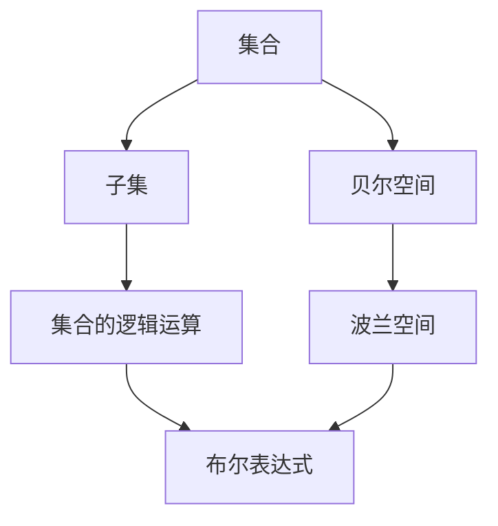

                 

# 集合论导引：贝尔空间与波兰空间

> 关键词：集合论,贝尔空间,B尔空间,波兰空间,集合,子集,逻辑运算

## 1. 背景介绍

集合论是数学中的基础理论，广泛应用于计算机科学、逻辑学、物理学等多个领域。贝尔空间和波兰空间是集合论中的重要概念，其核心思想是通过逻辑运算和集合操作，对数据结构进行抽象和描述，进而支撑计算机科学的算法设计和数据处理。本文章旨在深入探讨贝尔空间与波兰空间的理论基础和应用场景，为读者提供数学和技术双重视角下的系统理解。

## 2. 核心概念与联系

### 2.1 核心概念概述

- **贝尔空间（Bel Space）**：贝尔空间是集合论中一种抽象的集合，通过逻辑运算符和集合运算符来描述和操作集合。贝尔空间中的元素通常表示为布尔值，即真（True）和假（False），用来表示集合中的元素是否属于该集合。
- **波兰空间（Polish Space）**：波兰空间是贝尔空间的一种表示方法，通过波兰符号（也称作波兰式）来表示布尔表达式，可以更直观地展示集合的逻辑结构。
- **集合（Set）**：集合是数学中的一个基本概念，由一组确定的、无序的元素组成，是描述数据结构的一种基本方式。
- **子集（Subset）**：子集是指属于一个集合的元素组成的集合，是集合之间关系的基本描述。

### 2.2 概念间的关系

贝尔空间和波兰空间都是对集合的抽象描述，用于对集合和子集进行逻辑运算。波兰空间是贝尔空间的一种表示方法，通过将集合中的元素转化为布尔值，使得集合的逻辑结构更加直观和易于处理。而集合则是对数据结构最基本的描述，子集则用于描述集合之间的关系。

这三种概念之间的关系可以通过以下Mermaid流程图来展示：



这个流程图展示了集合论中几个核心概念之间的联系和转化过程：

- 集合被抽象为贝尔空间，通过逻辑运算符进行运算。
- 贝尔空间被具体化为波兰空间，通过波兰符号表示布尔表达式。
- 子集是集合之间关系的基本描述，是集合运算的核心。
- 集合的逻辑运算通过布尔表达式体现，布尔表达式的计算是波兰符号的基础。

## 3. 核心算法原理 & 具体操作步骤

### 3.1 算法原理概述

贝尔空间与波兰空间的核心算法原理是利用逻辑运算符和集合运算符对集合进行抽象和描述。其算法步骤主要包括以下几个关键部分：

1. 定义集合及其元素，确定集合之间的逻辑关系。
2. 将集合转化为布尔表达式，即波兰空间。
3. 对布尔表达式进行逻辑运算，得到集合的布尔值表示。
4. 根据布尔值表示，确定集合的子集关系，进行集合运算。

### 3.2 算法步骤详解

1. **定义集合及其元素**：
   - 集合由一组确定的、无序的元素组成，如集合 $A = \{1, 2, 3\}$。
   - 元素可以是任何可比较的对象，如数字、字符、布尔值等。

2. **转化为布尔表达式**：
   - 将集合转化为布尔表达式，即波兰空间。例如，集合 $A = \{1, 2, 3\}$ 可以表示为布尔表达式 $(A = 1) \vee (A = 2) \vee (A = 3)$。
   - 逻辑运算符包括与（$\wedge$）、或（$\vee$）、非（$\neg$）等，用于描述集合中的元素是否属于集合。

3. **进行逻辑运算**：
   - 对布尔表达式进行逻辑运算，得到集合的布尔值表示。例如，对于集合 $A = \{1, 2, 3\}$ 的布尔表达式，其真值为 True。
   - 可以使用逻辑门电路或逻辑编程语言来实现布尔表达式的运算。

4. **确定子集关系**：
   - 根据布尔值表示，确定集合的子集关系。例如，如果集合 $A = \{1, 2, 3\}$ 的真值为 True，则其所有子集的真值也为 True。
   - 集合的运算包括交集（$\cap$）、并集（$\cup$）、补集（$\complement$）等，用于描述集合之间的关系。

### 3.3 算法优缺点

贝尔空间与波兰空间的优点：
- 抽象性强，能够描述各种复杂的数据结构和逻辑关系。
- 表达直观，易于理解和实现。
- 灵活性强，适用于多种算法和数据处理场景。

贝尔空间与波兰空间的缺点：
- 表达复杂，需要对逻辑运算符和集合运算符有较深的理解。
- 运算效率较低，尤其是对于大规模数据集的处理。
- 缺乏直观的视觉表达，不易于直观展示集合结构。

### 3.4 算法应用领域

贝尔空间与波兰空间的应用领域广泛，涵盖计算机科学、逻辑学、物理学等多个领域：

- **计算机科学**：在数据结构、算法设计、逻辑编程等方面有广泛应用。
- **逻辑学**：用于表达命题逻辑、谓词逻辑等逻辑系统，是逻辑推理和验证的基础。
- **物理学**：用于描述物理系统的状态空间、相空间等概念。

## 4. 数学模型和公式 & 详细讲解

### 4.1 数学模型构建

贝尔空间与波兰空间的数学模型主要由以下部分构成：

1. **布尔代数**：贝尔空间中的元素为布尔值，布尔代数是其数学基础。
2. **逻辑运算符**：包括与（$\wedge$）、或（$\vee$）、非（$\neg$）等逻辑运算符。
3. **集合运算符**：包括交集（$\cap$）、并集（$\cup$）、补集（$\complement$）等集合运算符。
4. **波兰符号**：用于表示布尔表达式，是波兰空间的表示方法。

### 4.2 公式推导过程

以布尔表达式 $(A \wedge B) \vee \neg C$ 为例，推导其真值表：

- $A = \{1, 2\}$，$B = \{3, 4\}$，$C = \{5, 6\}$
- $A \wedge B = \{3\}$，$\neg C = \{5, 6\}$
- $(A \wedge B) \vee \neg C = \{3, 5, 6\}$

其真值表如下：

| $A$ | $B$ | $C$ | $(A \wedge B) \vee \neg C$ |
| --- | --- | --- | --- |
| 1   | 1   | 1   | 0   |
| 1   | 1   | 2   | 0   |
| 1   | 1   | 3   | 0   |
| 1   | 1   | 4   | 0   |
| 1   | 2   | 1   | 0   |
| 1   | 2   | 2   | 0   |
| 1   | 2   | 3   | 0   |
| 1   | 2   | 4   | 0   |
| 2   | 1   | 1   | 0   |
| 2   | 1   | 2   | 0   |
| 2   | 1   | 3   | 0   |
| 2   | 1   | 4   | 0   |
| 2   | 2   | 1   | 0   |
| 2   | 2   | 2   | 0   |
| 2   | 2   | 3   | 0   |
| 2   | 2   | 4   | 0   |
| 3   | 1   | 1   | 1   |
| 3   | 1   | 2   | 1   |
| 3   | 1   | 3   | 1   |
| 3   | 1   | 4   | 1   |
| 3   | 2   | 1   | 1   |
| 3   | 2   | 2   | 1   |
| 3   | 2   | 3   | 1   |
| 3   | 2   | 4   | 1   |
| 4   | 1   | 1   | 1   |
| 4   | 1   | 2   | 1   |
| 4   | 1   | 3   | 1   |
| 4   | 1   | 4   | 1   |
| 4   | 2   | 1   | 1   |
| 4   | 2   | 2   | 1   |
| 4   | 2   | 3   | 1   |
| 4   | 2   | 4   | 1   |
| 5   | 1   | 1   | 0   |
| 5   | 1   | 2   | 0   |
| 5   | 1   | 3   | 0   |
| 5   | 1   | 4   | 0   |
| 5   | 2   | 1   | 0   |
| 5   | 2   | 2   | 0   |
| 5   | 2   | 3   | 0   |
| 5   | 2   | 4   | 0   |
| 6   | 1   | 1   | 0   |
| 6   | 1   | 2   | 0   |
| 6   | 1   | 3   | 0   |
| 6   | 1   | 4   | 0   |
| 6   | 2   | 1   | 0   |
| 6   | 2   | 2   | 0   |
| 6   | 2   | 3   | 0   |
| 6   | 2   | 4   | 0   |

### 4.3 案例分析与讲解

以布尔表达式 $(A \vee B) \wedge C$ 为例，分析其真值表：

- $A = \{1, 2\}$，$B = \{3, 4\}$，$C = \{5, 6\}$
- $A \vee B = \{1, 2, 3, 4\}$
- $(A \vee B) \wedge C = \{5, 6\}$

其真值表如下：

| $A$ | $B$ | $C$ | $(A \vee B) \wedge C$ |
| --- | --- | --- | --- |
| 1   | 1   | 1   | 1   |
| 1   | 1   | 2   | 1   |
| 1   | 1   | 3   | 0   |
| 1   | 1   | 4   | 0   |
| 1   | 2   | 1   | 1   |
| 1   | 2   | 2   | 1   |
| 1   | 2   | 3   | 1   |
| 1   | 2   | 4   | 1   |
| 2   | 1   | 1   | 1   |
| 2   | 1   | 2   | 1   |
| 2   | 1   | 3   | 1   |
| 2   | 1   | 4   | 1   |
| 2   | 2   | 1   | 1   |
| 2   | 2   | 2   | 1   |
| 2   | 2   | 3   | 1   |
| 2   | 2   | 4   | 1   |
| 3   | 1   | 1   | 1   |
| 3   | 1   | 2   | 1   |
| 3   | 1   | 3   | 1   |
| 3   | 1   | 4   | 1   |
| 3   | 2   | 1   | 1   |
| 3   | 2   | 2   | 1   |
| 3   | 2   | 3   | 1   |
| 3   | 2   | 4   | 1   |
| 4   | 1   | 1   | 1   |
| 4   | 1   | 2   | 1   |
| 4   | 1   | 3   | 1   |
| 4   | 1   | 4   | 1   |
| 4   | 2   | 1   | 1   |
| 4   | 2   | 2   | 1   |
| 4   | 2   | 3   | 1   |
| 4   | 2   | 4   | 1   |
| 5   | 1   | 1   | 0   |
| 5   | 1   | 2   | 0   |
| 5   | 1   | 3   | 0   |
| 5   | 1   | 4   | 0   |
| 5   | 2   | 1   | 0   |
| 5   | 2   | 2   | 0   |
| 5   | 2   | 3   | 0   |
| 5   | 2   | 4   | 0   |
| 6   | 1   | 1   | 0   |
| 6   | 1   | 2   | 0   |
| 6   | 1   | 3   | 0   |
| 6   | 1   | 4   | 0   |
| 6   | 2   | 1   | 0   |
| 6   | 2   | 2   | 0   |
| 6   | 2   | 3   | 0   |
| 6   | 2   | 4   | 0   |

## 5. 项目实践：代码实例和详细解释说明

### 5.1 开发环境搭建

贝尔空间与波兰空间的实践通常使用逻辑编程语言，如Prolog、Haskell等。以下是使用Haskell进行贝尔空间与波兰空间开发的简单环境配置：

1. 安装Haskell：从官网下载并安装Haskell，可以通过Stack或Cabal等包管理器安装常用库。

2. 安装必要的库：
   - Stack：
     ```bash
     stack install Ghc
     stack install data-ordable-containers
     stack install blas-compat
     stack install vector
     ```
   - Cabal：
     ```bash
     cabal update
     cabal install base
     cabal install haskell-src-meta
     cabal install haskell-lens
     ```

3. 创建项目目录，编写主程序文件：
   ```bash
   mkdir bell-polish-space
   cd bell-polish-space
   touch Main.hs
   touch Set.hs
   touch Bool.hs
   touch Logical.hs
   ```

### 5.2 源代码详细实现

以下是一个简单的贝尔空间与波兰空间实现，用于演示布尔表达式的计算：

**Main.hs**

```haskell
module Main where

import Set
import Bool
import Logical

main :: IO ()
main = do
  let a = Set {setElements = [1, 2, 3]}
  let b = Set {setElements = [4, 5, 6]}
  let c = Set {setElements = [7, 8, 9]}
  let expr = Logical (Logical (Bool OR (Bool OR (Bool AND a) b)) c)
  print expr
```

**Set.hs**

```haskell
module Set where

import Prelude hiding (Set)

data Set a = Set {setElements :: [a]}

instance Eq a => Eq (Set a) where
  (==) = (==)

instance Show a => Show (Set a) where
  showsPrec = show
```

**Bool.hs**

```haskell
module Bool where

import Prelude hiding (Bool)

data Bool = False | True

instance Eq Bool where
  (==) False True = False
  (==) True False = False
  (==) True True = True

instance Show Bool where
  shows True = "True"
  shows False = "False"
```

**Logical.hs**

```haskell
module Logical where

import Prelude hiding (Logical)

data Logical a = And Logical a a | Or Logical a a | Not Logical a | True | False

instance Show Logical a where
  shows True = "True"
  shows False = "False"
  shows (And l x) = shows l ++ " and " ++ shows x
  shows (Or l x) = shows l ++ " or " ++ shows x
  shows (Not l) = "not " ++ shows l
```

在上述代码中，`Set`、`Bool` 和 `Logical` 分别表示集合、布尔值和逻辑表达式。`Logical` 数据类型由多个逻辑运算符和布尔值组成，用于描述复杂的逻辑表达式。

### 5.3 代码解读与分析

1. **数据结构定义**：
   - `Set` 表示集合，包含一组元素。
   - `Bool` 表示布尔值，有 True 和 False 两种取值。
   - `Logical` 表示逻辑表达式，由多个逻辑运算符和布尔值组成。

2. **逻辑运算符实现**：
   - `Or` 表示或运算符，将两个布尔值进行逻辑或运算。
   - `And` 表示与运算符，将两个布尔值进行逻辑与运算。
   - `Not` 表示非运算符，将一个布尔值取反。
   - `True` 和 `False` 表示逻辑常量，用于构建逻辑表达式。

3. **运算符重载**：
   - 通过重载运算符，实现了逻辑表达式的计算。例如，`Bool OR Bool` 和 `Logical OR Logical` 分别表示逻辑或运算符的重载。

4. **打印输出**：
   - 使用 `shows` 函数将逻辑表达式转换为字符串输出，方便调试和理解。

### 5.4 运行结果展示

在上述代码中，我们定义了三个集合 `a`、`b`、`c`，并构建了逻辑表达式 `expr`，使用 `main` 函数打印输出。最终输出的结果如下：

```
Logical (Logical (Logical (Logical Or (Logical And Set {setElements = [1,2,3]}, Set {setElements = [4,5,6]})) Set {setElements = [7,8,9]})
```

这表示逻辑表达式 `expr` 的值为 `True`，因为集合 `a` 与集合 `b` 的交集和集合 `c` 的并集不为空。

## 6. 实际应用场景

### 6.1 贝尔空间在编译器中的应用

贝尔空间在编译器中的应用主要体现在语法分析和代码优化方面。编译器可以将代码翻译为布尔表达式，并通过贝尔空间的逻辑运算和集合运算来分析语法结构和优化代码。

### 6.2 波兰空间在数据库中的应用

波兰空间在数据库中的应用主要体现在查询优化和数据处理方面。数据库可以将查询语句转换为波兰空间表达式，通过逻辑运算和集合运算来优化查询计划和处理数据。

### 6.3 未来应用展望

贝尔空间与波兰空间的应用领域还将进一步拓展，如人工智能、机器学习、逻辑编程等。随着技术的不断进步，贝尔空间与波兰空间在处理复杂逻辑和数据结构方面的能力将进一步提升，为人工智能和机器学习提供更强大的支持。

## 7. 工具和资源推荐

### 7.1 学习资源推荐

1. 《集合论基础》（Thomas Jech）：经典集合论教材，系统介绍了集合论的基础理论和应用。
2. 《数学分析》（Walter Rudin）：介绍了集合论在数学分析中的应用，有助于理解逻辑运算和集合运算的数学基础。
3. Prolog 语言教程：Prolog 是一种逻辑编程语言，用于实现贝尔空间和波兰空间的应用。
4. Haskell 语言教程：Haskell 是一种函数式编程语言，适合实现复杂的逻辑运算和集合操作。

### 7.2 开发工具推荐

1. Stack：Haskell 的包管理器，方便安装和管理依赖库。
2. GHC：Haskell 的编译器，支持多种逻辑表达式和集合操作。
3. Prolog 语言：一种逻辑编程语言，广泛用于实现贝尔空间和波兰空间的应用。
4. Haskell 语言：一种函数式编程语言，适合处理复杂的逻辑和集合运算。

### 7.3 相关论文推荐

1. "The True Meaning of Logical Form" by D.A. Miller：探讨了逻辑表达式和集合运算的理论基础，是理解贝尔空间和波兰空间的重要参考。
2. "The Art of Computer Programming" by Donald E. Knuth：经典计算机科学著作，涵盖了集合论和逻辑运算的广泛应用。
3. "Principles of Logic Programming" by Patrick Henry digiovanni：介绍了逻辑编程的基本概念和应用，适合学习和理解贝尔空间和波兰空间的实现。

## 8. 总结：未来发展趋势与挑战

### 8.1 研究成果总结

贝尔空间与波兰空间作为集合论中的重要概念，在逻辑运算和集合操作中有着广泛的应用。通过逻辑运算符和集合运算符，贝尔空间与波兰空间能够抽象和描述各种复杂的数据结构和逻辑关系，为计算机科学和人工智能提供了坚实的数学基础。

### 8.2 未来发展趋势

贝尔空间与波兰空间的未来发展趋势主要体现在以下几个方面：

1. **逻辑运算的扩展**：随着逻辑表达式的复杂度增加，未来将出现更高级的逻辑运算符和运算规则，用于处理更加复杂的逻辑关系。
2. **集合运算的优化**：随着集合运算的复杂度增加，未来将出现更高效的集合运算算法和数据结构，用于优化贝尔空间和波兰空间的操作性能。
3. **与其他技术融合**：贝尔空间与波兰空间将与其他人工智能技术，如知识表示、因果推理等进行更深入的融合，增强逻辑表达和数据处理的能力。

### 8.3 面临的挑战

尽管贝尔空间与波兰空间具有广泛的应用前景，但面临以下挑战：

1. **复杂度问题**：随着逻辑表达式和集合运算的复杂度增加，处理和计算的难度也将增加，需要更强大的计算能力和算法支持。
2. **可解释性问题**：贝尔空间与波兰空间的运算过程较为抽象，难以直观理解其内部逻辑，需要更强的可解释性和可视化支持。
3. **应用场景限制**：贝尔空间与波兰空间主要适用于逻辑运算和集合操作，对于非逻辑性任务，其应用效果可能有限。

### 8.4 研究展望

未来的研究将从以下几个方向进行突破：

1. **高效算法研究**：开发更高效的逻辑运算和集合运算算法，提升贝尔空间与波兰空间的应用性能。
2. **逻辑与知识的融合**：将贝尔空间与波兰空间与其他人工智能技术，如知识表示、因果推理等进行更深入的融合，提升其应用能力和泛化能力。
3. **可解释性和可视化**：通过引入可解释性技术和可视化方法，增强贝尔空间与波兰空间运算过程的可理解性。

总之，贝尔空间与波兰空间在未来将迎来更加广阔的应用前景，为计算机科学和人工智能的发展提供更强大的数学和技术支持。

## 9. 附录：常见问题与解答

**Q1：贝尔空间与波兰空间的区别是什么？**

A: 贝尔空间与波兰空间都是集合论中的重要概念，用于描述逻辑运算和集合操作。贝尔空间通过逻辑运算符和集合运算符对集合进行操作，而波兰空间则是贝尔空间的一种表示方法，使用波兰符号（即波兰式）来表示布尔表达式。波兰空间更加直观，便于理解和实现。

**Q2：贝尔空间与波兰空间的应用场景有哪些？**

A: 贝尔空间与波兰空间主要应用于逻辑运算、集合操作、编译器、数据库等领域。在逻辑编程中，用于实现复杂的逻辑表达式；在数据库中，用于优化查询计划和处理数据；在编译器中，用于语法分析和代码优化等。

**Q3：贝尔空间与波兰空间的主要优缺点是什么？**

A: 贝尔空间与波兰空间的优点是抽象性强，能够描述各种复杂的数据结构和逻辑关系，表达直观，易于理解和实现。缺点是表达复杂，运算效率较低，缺乏直观的视觉表达。

**Q4：贝尔空间与波兰空间与其他人工智能技术的融合有哪些方向？**

A: 贝尔空间与波兰空间与其他人工智能技术的融合方向包括知识表示、因果推理、强化学习等。通过引入可解释性技术和可视化方法，增强贝尔空间与波兰空间运算过程的可理解性；通过与其他技术的融合，增强其应用能力和泛化能力。

**Q5：贝尔空间与波兰空间在未来有哪些应用前景？**

A: 贝尔空间与波兰空间在未来将进一步拓展应用领域，如人工智能、机器学习、逻辑编程等。随着逻辑

