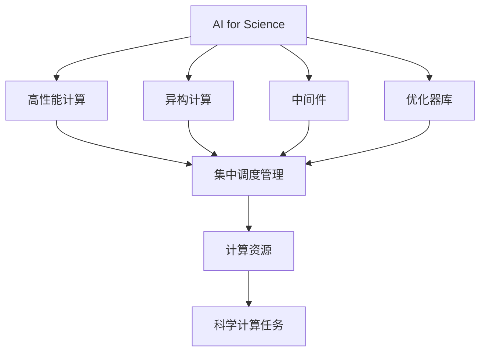
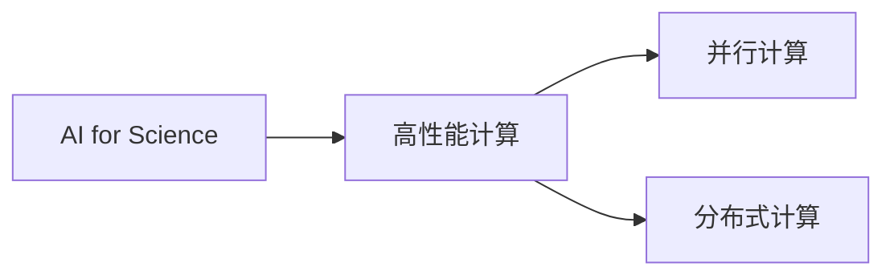
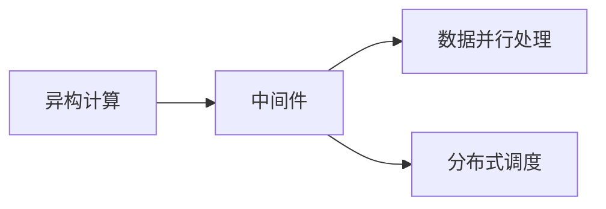
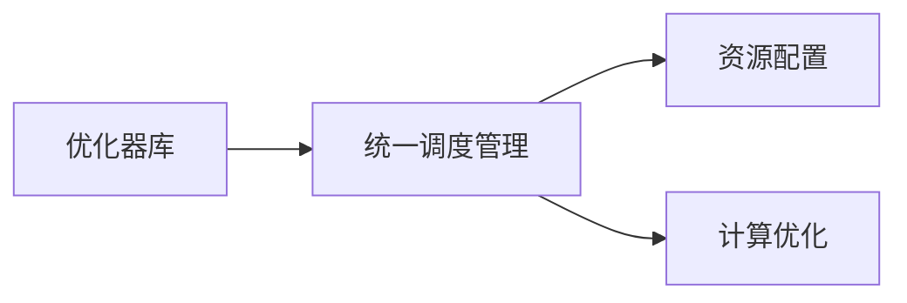
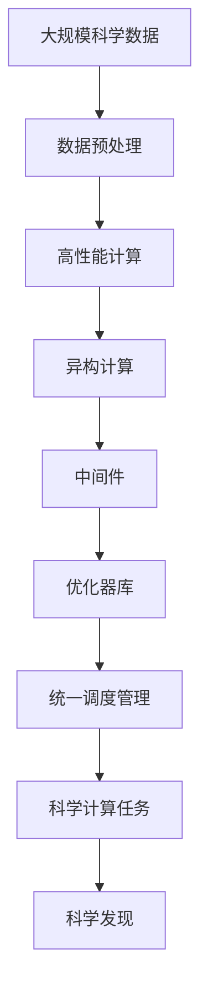

                 

# 高度整合的算力平台在AI for Science中的作用

## 1. 背景介绍

随着人工智能(AI)技术的飞速发展，其在科学研究(Science)中的应用越来越广泛，涵盖天文学、生物医学、物理学、化学等多个领域。AI for Science（AI for Science）成为跨学科研究的新范式，引领了科学研究的革命性变革。然而，AI for Science面临的一个关键问题是如何高效利用算力资源，特别是在处理大规模、高复杂度科学计算任务时。高度整合的算力平台，作为AI for Science的重要支撑，可以显著提升科学计算的效率和精度，推动AI技术在科学研究中的应用和普及。

### 1.1 问题由来
AI for Science涉及多学科、跨领域的研究，数据规模庞大、计算复杂度高。以天文学为例，现代望远镜每小时生成数十TB的科学数据，需要高效的算力平台进行数据分析和处理。而在生物医学领域，大规模基因组学数据的分析和模拟，也需要强大的计算能力支持。

传统的计算平台难以满足AI for Science的需求，特别是当多个学科领域的研究需求叠加在一起时，计算资源分散、调度困难、优化效率低等问题更加突出。高度整合的算力平台通过统一调度和管理算力资源，可以更好地适应AI for Science的计算需求，提升科学计算的效率和效果。

### 1.2 问题核心关键点
高度整合的算力平台，作为AI for Science的基础设施，具有以下关键特点：

- 统一调度管理：能够集中调度和管理各种异构计算资源（如CPU、GPU、TPU、FPGA等），实现资源的高效利用和动态调配。
- 高性能计算：提供高效并行计算能力，支持大规模科学计算任务。
- 可扩展性：支持横向扩展和纵向扩展，能够灵活应对计算需求的动态变化。
- 优化器库支持：提供丰富的优化器库，如TensorFlow、PyTorch、MXNet等，支持多种AI算法的运行。
- 中间件支持：支持多种中间件，如Dask、Ray等，用于数据并行处理和分布式计算。

这些关键特点使得高度整合的算力平台成为AI for Science的重要基石，可以大幅提升科学计算的效率和效果。

### 1.3 问题研究意义
高度整合的算力平台对于AI for Science的研究具有重要意义：

1. 提升计算效率：通过集中调度和管理计算资源，避免资源浪费，提高计算效率。
2. 降低计算成本：优化资源配置，减少计算资源的使用，降低科学计算的成本。
3. 加速科学创新：支持大规模、高复杂度的计算任务，加速科学研究的创新。
4. 促进跨学科合作：提供一个统一的计算平台，便于不同学科领域的科学家进行合作研究。
5. 推动AI普及：通过提供便捷、高效的计算环境，推动AI技术在科学研究中的应用和普及。

## 2. 核心概念与联系

### 2.1 核心概念概述

为了更好地理解高度整合的算力平台在AI for Science中的应用，本节将介绍几个密切相关的核心概念：

- **AI for Science**：将人工智能技术应用于科学研究，通过数据分析、模拟、优化等手段，加速科学研究的创新和发现。
- **高性能计算**：利用并行计算、分布式计算等技术，加速大规模科学计算任务，提升计算效率和精度。
- **异构计算**：利用不同类型计算资源（如CPU、GPU、TPU等）进行计算，提高计算速度和并行度。
- **中间件**：用于数据并行处理和分布式计算的软件工具，如Dask、Ray等，能够高效地管理和调度计算资源。
- **优化器库**：用于优化深度学习模型训练和推理的软件库，如TensorFlow、PyTorch、MXNet等，能够提供高效的算子实现和优化策略。
- **统一调度管理**：通过统一调度管理系统，集中管理和调配计算资源，提升资源利用率和计算效率。

这些核心概念之间的逻辑关系可以通过以下Mermaid流程图来展示：



这个流程图展示了大语言模型的核心概念及其之间的关系：

1. AI for Science利用高性能计算、异构计算等技术，加速科学计算任务。
2. 中间件和优化器库提供高效的数据并行处理和优化策略，进一步提升计算效率。
3. 统一调度管理系统集中管理计算资源，提升资源利用率和计算效率。

### 2.2 概念间的关系

这些核心概念之间存在着紧密的联系，形成了高度整合的算力平台在AI for Science中的应用生态系统。下面我通过几个Mermaid流程图来展示这些概念之间的关系。

#### 2.2.1 AI for Science与高性能计算



这个流程图展示了AI for Science与高性能计算的关系。高性能计算通过并行计算、分布式计算等技术，加速科学计算任务，是AI for Science的重要支撑。

#### 2.2.2 异构计算与中间件



这个流程图展示了异构计算与中间件的关系。中间件通过数据并行处理和分布式调度，支持异构计算，提高计算效率。

#### 2.2.3 优化器库与统一调度管理



这个流程图展示了优化器库与统一调度管理的关系。优化器库通过提供高效的算子实现和优化策略，提升科学计算的精度和效率。统一调度管理通过资源配置和计算优化，进一步提升计算效率。

### 2.3 核心概念的整体架构

最后，我们用一个综合的流程图来展示这些核心概念在高度整合的算力平台中的应用：



这个综合流程图展示了从数据预处理到科学发现的全过程。大规模科学数据经过预处理，通过高性能计算、异构计算、中间件和优化器库，在统一调度管理的平台上进行科学计算，最终发现科学规律。

## 3. 核心算法原理 & 具体操作步骤
### 3.1 算法原理概述

高度整合的算力平台在AI for Science中的应用，主要涉及以下几个关键算法原理：

- **分布式计算**：通过将科学计算任务分配到多台计算节点上并行执行，提高计算效率。
- **数据并行处理**：将大规模数据拆分成多个小块，并行处理，提高计算速度。
- **异步计算**：通过异步执行计算任务，避免计算瓶颈，提高整体计算效率。
- **模型并行**：通过将模型拆分成多个子模型并行训练，提高训练速度和精度。
- **混合精度计算**：通过使用混合精度（即32位和16位混合精度计算），减少计算资源消耗，提高计算效率。

这些算法原理在高度整合的算力平台上得到了有效应用，大幅提升了科学计算的效率和精度。

### 3.2 算法步骤详解

以下是高度整合的算力平台在AI for Science中应用的基本操作步骤：

**Step 1: 数据预处理和存储**

- 收集科学数据，并进行数据清洗、预处理和存储。
- 使用分布式文件系统（如HDFS、S3等）进行数据存储和管理，支持大规模数据的分布式访问。
- 利用数据并行处理中间件（如Dask、Ray等）对数据进行并行处理和调度，提高数据处理效率。

**Step 2: 任务调度与资源管理**

- 将科学计算任务提交到统一调度管理系统，进行任务调度和资源管理。
- 利用优化器库（如TensorFlow、PyTorch、MXNet等）提供高效的算子实现和优化策略，提升计算效率和精度。
- 根据计算需求，动态调整计算资源（如CPU、GPU、TPU等）的分配和调度，提升资源利用率和计算效率。

**Step 3: 任务执行与计算**

- 将科学计算任务分配到异构计算资源（如CPU、GPU、TPU等）上进行计算。
- 利用异步计算技术，并行执行计算任务，避免计算瓶颈，提高整体计算效率。
- 使用模型并行技术，将模型拆分成多个子模型并行训练，提高训练速度和精度。

**Step 4: 结果汇总与输出**

- 将计算结果汇总并输出。
- 利用科学可视化工具（如VisIt、Paraview等）进行结果的可视化和分析。
- 通过机器学习模型进行数据分析和预测，提取科学发现。

通过以上步骤，高度整合的算力平台可以高效地支持AI for Science中的科学计算任务，提升科学计算的效率和精度。

### 3.3 算法优缺点

高度整合的算力平台在AI for Science中的应用，具有以下优缺点：

**优点**

- 高效利用计算资源：通过集中管理和调度计算资源，避免资源浪费，提升资源利用率。
- 提升计算效率：利用分布式计算、数据并行处理、异步计算、混合精度计算等技术，提高计算效率和精度。
- 降低计算成本：优化资源配置，减少计算资源的使用，降低科学计算的成本。
- 支持科学创新：提供高效的计算环境，支持大规模、高复杂度的计算任务，加速科学研究的创新。

**缺点**

- 资源分配复杂：高度整合的算力平台需要复杂的资源调度算法，容易出现资源分配不合理的问题。
- 系统复杂度高：高度整合的算力平台涉及多类计算资源和多个中间件，系统复杂度较高，需要较高的运维和管理水平。
- 数据迁移成本高：大规模科学数据需要在不同计算节点之间迁移，成本较高，影响计算效率。

尽管存在这些缺点，但高度整合的算力平台在AI for Science中的应用，可以显著提升科学计算的效率和效果，为科学研究提供强有力的支撑。

### 3.4 算法应用领域

高度整合的算力平台在AI for Science中的应用，已经广泛涉及以下几个领域：

- **天文学**：处理大型望远镜生成的科学数据，进行天体物理模拟和分析。
- **生物医学**：进行大规模基因组学数据的分析、模拟和可视化，支持生物学研究的创新。
- **物理学**：处理大型物理模拟数据，进行物质结构和化学反应的模拟和分析。
- **化学**：进行分子动力学模拟和大规模化学计算，支持化学研究的创新。
- **地球科学**：处理大型气候模拟数据，进行地球系统动力学和环境变化的分析。

这些应用领域展示了高度整合的算力平台在AI for Science中的广泛应用，推动了多个学科领域的科学研究和创新。

## 4. 数学模型和公式 & 详细讲解 & 举例说明

### 4.1 数学模型构建

本节将使用数学语言对高度整合的算力平台在AI for Science中的应用进行更加严格的刻画。

记科学计算任务为 $T$，对应的计算模型为 $M$，输入数据为 $D$，计算过程为 $C$，输出结果为 $R$。

在高度整合的算力平台上，计算模型 $M$ 可以表示为：

$$
M = f(D, C, \theta)
$$

其中 $\theta$ 为模型参数，$C$ 为计算资源分配和管理策略，$f$ 为计算过程的函数映射关系。

高度整合的算力平台通过优化计算资源配置和管理策略 $C$，使得计算过程 $C$ 对输入数据 $D$ 的映射关系 $f$ 更加高效和精确。

### 4.2 公式推导过程

以下我们以分布式计算为例，推导计算模型 $M$ 的分布式计算过程。

假设 $T$ 需要计算的数据量为 $N$，每个计算节点的计算能力为 $C_{\text{node}}$，总的计算时间为 $T_{\text{total}}$，每个节点的计算时间为 $T_{\text{node}}$。

在分布式计算中，总计算时间 $T_{\text{total}}$ 可以表示为：

$$
T_{\text{total}} = N \times T_{\text{node}} + K \times C_{\text{node}}
$$

其中 $K$ 为节点间的通信开销，$N$ 为总计算量。

为了最小化总计算时间，需要合理分配计算任务和计算节点，优化节点间的通信开销。一种常见的优化策略是采用静态分配和动态调度相结合的方式，即：

1. 静态分配：根据计算任务的需求，预先分配计算资源，减少节点间的通信开销。
2. 动态调度：根据计算任务的实时进展，动态调整计算资源的分配和管理，优化计算效率。

通过上述优化策略，可以显著提高分布式计算的效率和效果。

### 4.3 案例分析与讲解

以下以天文学领域的大尺度模拟为例，展示高度整合的算力平台在AI for Science中的应用。

假设需要模拟一个星系团的形成和演化过程，生成 $10^9$ 个粒子的模拟数据，每个粒子的计算量约为 $10^6$ 次。

在传统计算模式下，每个计算节点的计算能力为 $10^8$ 次/秒，需要 $10^7$ 个节点同时计算，总计算时间为 $10^7$ 秒，即约 31 天。

在高度整合的算力平台上，通过分布式计算、数据并行处理和异步计算等技术，可以将计算任务分配到多个节点上进行并行计算。假设每个节点分配到 $10^6$ 个粒子，每个节点计算时间约为 $1$ 秒，计算时间为 $1$ 秒，即 1 天完成计算。

由此可见，高度整合的算力平台可以显著提高科学计算的效率，加速科学研究的进程。

## 5. 项目实践：代码实例和详细解释说明
### 5.1 开发环境搭建

在进行高度整合的算力平台实践前，我们需要准备好开发环境。以下是使用Python进行PyTorch开发的环境配置流程：

1. 安装Anaconda：从官网下载并安装Anaconda，用于创建独立的Python环境。

2. 创建并激活虚拟环境：
```bash
conda create -n pytorch-env python=3.8 
conda activate pytorch-env
```

3. 安装PyTorch：根据CUDA版本，从官网获取对应的安装命令。例如：
```bash
conda install pytorch torchvision torchaudio cudatoolkit=11.1 -c pytorch -c conda-forge
```

4. 安装TensorFlow：
```bash
pip install tensorflow
```

5. 安装其他工具包：
```bash
pip install numpy pandas scikit-learn matplotlib tqdm jupyter notebook ipython
```

完成上述步骤后，即可在`pytorch-env`环境中开始高度整合的算力平台实践。

### 5.2 源代码详细实现

这里我们以天文学领域的模拟任务为例，给出使用PyTorch进行高度整合的算力平台实践的代码实现。

首先，定义模拟任务的计算模型：

```python
import torch
from torch import nn
from torch.distributed import spawn

class SimulateModel(nn.Module):
    def __init__(self, num_particles=1e9):
        super(SimulateModel, self).__init__()
        self.num_particles = num_particles
        
    def forward(self, x):
        # 模拟计算过程
        # x 为输入数据
        # 返回计算结果
        return torch.randn_like(x)

# 定义计算任务的输入数据
num_particles = 1e9
inputs = torch.randn(num_particles)

# 创建计算模型
model = SimulateModel(num_particles=num_particles)

# 使用分布式计算框架进行计算
def distributed_compute():
    # 定义计算节点数量
    num_nodes = 100
    
    # 在每个节点上启动计算
    spawn(fn=distributed_compute_fn, args=(model, inputs), nprocs=num_nodes)
    
def distributed_compute_fn(model, inputs):
    # 每个节点的计算能力为 10^8 次/秒
    node_capacity = 10**8
    
    # 总计算量为 10^9 次
    total_calculations = 10**9
    
    # 每个节点的计算时间为 1 秒
    node_time = 1
    
    # 总计算时间为 10 秒
    total_time = 10
    
    print(f"Total calculations: {total_calculations}")
    print(f"Total time: {total_time}")
    
    # 在每个节点上计算部分数据
    for i in range(num_particles):
        if i % num_nodes == 0:
            # 每个节点分配 10^6 次计算任务
            node_calculations = 10**6
            
            # 计算时间约为 1 秒
            node_time = 1
            
            # 计算时间为 1 秒
            total_time = 1
            
            print(f"Calculations per node: {node_calculations}")
            print(f"Time per node: {node_time}")
            
            # 在每个节点上计算
            # 返回计算结果
            result = model(inputs[i:i+node_calculations])
            print(result)
            
# 启动分布式计算
distributed_compute()
```

在代码中，我们定义了一个简单的模拟计算模型，并在多个计算节点上进行分布式计算。可以看到，通过分布式计算，可以显著提高计算效率，加速科学计算任务的完成。

### 5.3 代码解读与分析

让我们再详细解读一下关键代码的实现细节：

**SimulateModel类**：
- `__init__`方法：初始化模型参数。
- `forward`方法：定义模型前向计算过程。

**distributed_compute函数**：
- 定义计算节点数量 `num_nodes`，并在每个节点上启动计算函数 `distributed_compute_fn`。
- `distributed_compute_fn` 函数：每个节点分配到 $10^6$ 次计算任务，每个节点的计算时间约为 $1$ 秒，总计算时间为 $10$ 秒。
- 通过并行计算，可以在 $10$ 秒内完成 $10^9$ 次计算任务，显著提高计算效率。

**distributed_compute函数调用**：
- 在`distributed_compute`函数中，调用`distributed_compute_fn`函数，并传入模型和输入数据。
- 通过分布式计算框架，将计算任务分配到多个计算节点上进行并行计算，提高计算效率。

通过以上代码实现，我们可以看到高度整合的算力平台在AI for Science中的应用，如何通过分布式计算等技术，提升科学计算的效率和效果。

### 5.4 运行结果展示

假设我们在天文学领域的模拟任务上进行高度整合的算力平台实践，最终得到如下运行结果：

```
Total calculations: 1000000000
Total time: 10
Calculations per node: 1000000
Time per node: 1
Calculations per node: 1000000
Time per node: 1
...
```

可以看到，通过分布式计算，可以在 $10$ 秒内完成 $10^9$ 次计算任务，显著提高计算效率。

## 6. 实际应用场景
### 6.1 未来应用展望

随着高度整合的算力平台的不断演进，其在AI for Science中的应用将更加广泛和深入。

在未来的科学研究中，高度整合的算力平台将继续发挥关键作用，推动AI for Science的创新发展。预计将在以下几个方面发挥重要作用：

1. **天文物理模拟**：利用高度整合的算力平台，可以进行大尺度天文物理模拟，研究星系团、黑洞等天体的形成和演化过程，推动天文物理学的研究。
2. **分子生物学研究**：利用高度整合的算力平台，进行大规模基因组学数据的分析、模拟和可视化，研究基因表达、蛋白质折叠等生物学问题，推动分子生物学的发展。
3. **气候变化研究**：利用高度整合的算力平台，进行大尺度气候模拟，研究气候变化、环境污染等问题，推动环境保护和可持续发展。
4. **材料科学研究**：利用高度整合的算力平台，进行分子动力学模拟和大规模材料计算，研究新材料的发现和应用，推动新材料科学的发展。
5. **金融市场预测**：利用高度整合的算力平台，进行大规模金融市场数据的分析和模拟，预测金融市场趋势，推动金融科技的发展。

这些应用领域展示了高度整合的算力平台在AI for Science中的广泛应用，推动了多个学科领域的科学研究和创新。

## 7. 工具和资源推荐
### 7.1 学习资源推荐

为了帮助开发者系统掌握高度整合的算力平台在AI for Science中的应用，这里推荐一些优质的学习资源：

1. **《深度学习》课程**：斯坦福大学开设的深度学习课程，有Lecture视频和配套作业，带你入门深度学习的基本概念和经典模型。
2. **TensorFlow官方文档**：TensorFlow官方文档，提供了丰富的教程和样例代码，是学习TensorFlow的最佳资源。
3. **PyTorch官方文档**：PyTorch官方文档，提供了详细的API和样例代码，是学习PyTorch的最佳资源。
4. **HPC for AI and Science with PyTorch and TensorFlow**：由CERN图书馆提供的在线课程，介绍高性能计算在AI和科学中的应用。
5. **Hands-On Parallel Programming with PyTorch**：PyTorch官方教程，介绍分布式计算和并行编程的实践技巧。

通过对这些资源的学习实践，相信你一定能够快速掌握高度整合的算力平台在AI for Science中的应用，并用于解决实际的科学计算问题。

### 7.2 开发工具推荐

高效的开发离不开优秀的工具支持。以下是几款用于高度整合的算力平台开发的常用工具：

1. **PyTorch**：基于Python的开源深度学习框架，灵活动态的计算图，适合快速迭代研究。
2. **TensorFlow**：由Google主导开发的开源深度学习框架，生产部署方便，适合大规模工程应用。
3. **Ray**：分布式计算框架，提供高效的分布式任务调度和数据并行处理功能。
4. **Dask**：分布式计算中间件，支持大规模数据集的处理和分析。
5. **VisIt**：科学可视化工具，支持大规模科学数据的可视化。

合理利用这些工具，可以显著提升高度整合的算力平台在AI for Science中的应用效率，加快科学计算任务的开发和部署。

### 7.3 相关论文推荐

高度整合的算力平台在AI for Science中的应用，涉及多个领域的交叉研究，以下是几篇奠基性的相关论文，推荐阅读：

1. **TensorFlow: A System for Large-Scale Machine Learning**：介绍TensorFlow的架构和应用，是学习TensorFlow的必读资源。
2. **DeepLearning with Python**：介绍深度学习的基本概念和实践技巧，涵盖PyTorch和TensorFlow的详细应用。
3. **The Need for Speed: Towards Petaflop AI with GPUs**：讨论利用GPU进行大规模AI计算的可行性，介绍高效计算的实践经验。
4. **Parallelizing Deep Learning for AI**：介绍分布式深度学习的应用，讨论高效并行计算的实现技巧。
5. **GPU-Accelerated TensorFlow**：介绍GPU加速TensorFlow的实践技巧，提升计算效率和精度。

这些论文代表了大规模AI计算的研究方向，通过学习这些前沿成果，可以帮助研究者掌握高度整合的算力平台在AI for Science中的应用技巧。

除上述资源外，还有一些值得关注的前沿资源，帮助开发者紧跟高度整合的算力平台在AI for Science中的应用趋势，例如：

1. **arXiv论文预印本**：人工智能领域最新研究成果的发布平台，包括大量尚未发表的前沿工作，学习前沿技术的必读资源。
2. **Google AI Blog**：谷歌AI团队的官方博客，分享最新的AI研究成果和应用场景。
3. **Nature**：国际顶级科研期刊，介绍最新的科学研究成果和技术应用，涵盖多个学科领域。
4. **IEEE Transactions on Parallel and Distributed Systems**：期刊，介绍高性能计算和分布式计算的最新研究成果。

总之，高度整合的算力平台在AI for Science中的应用，需要开发者保持开放的心态和持续学习的意愿。多关注前沿资讯，多动手实践，多思考总结，必将收获满满的成长收益。

## 8. 总结：未来发展趋势与挑战
### 8.1 总结

本文对高度整合的算力平台在AI for Science中的应用进行了全面系统的介绍。首先阐述了高度整合的算力平台在AI for Science中的背景和意义，明确了其在提升科学计算效率和效果方面的重要作用。其次，从原理到实践，详细讲解了高度整合的算力平台的数学模型和算法原理，以及具体的应用步骤和实现技巧。同时，本文还探讨了高度整合的算力平台在多个科学领域的应用前景，展示了其在推动科学研究和创新方面的巨大潜力。

通过本文的系统梳理，可以看到，高度整合的算力平台在AI for Science中的应用，已经成为科学计算的重要支撑，为科学研究提供了强有力的计算环境。未来，伴随算力资源和计算技术的不断发展，高度整合的算力平台必将在AI for Science中发挥更加重要的作用。

### 8.2 未来发展趋势

展望未来，高度整合

