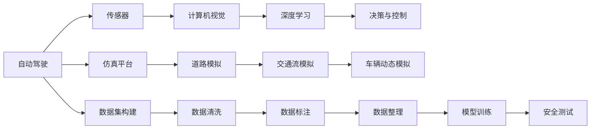

                 

# 自动驾驶仿真平台与数据集构建的最佳实践

> 关键词：自动驾驶,仿真平台,数据集构建,安全测试,模型训练

## 1. 背景介绍

自动驾驶技术的飞速发展，使得越来越多的汽车制造商和科技公司投入巨资进行研发。然而，自动驾驶车辆的测试和验证是一个复杂且昂贵的过程，需要在真实道路上进行大量安全测试。为了降低测试成本并提高测试效率，自动驾驶仿真平台逐渐成为业内首选。仿真平台能够模拟各种道路条件和极端情况，保证车辆在安全、高效的环境中进行测试。本文将介绍构建高性能自动驾驶仿真平台的最佳实践，并通过实际数据集构建案例，展示仿真数据在模型训练中的作用。

## 2. 核心概念与联系

### 2.1 核心概念概述

在介绍具体实践之前，我们先简要介绍几个关键概念：

- **自动驾驶**：自动驾驶是指汽车通过传感器、计算机视觉、深度学习和人工智能技术，实现对环境的感知、决策和控制，无需人工干预。

- **仿真平台**：自动驾驶仿真平台是一种软件环境，通过模拟真实世界中的道路、车辆和交通条件，为自动驾驶系统的测试和验证提供虚拟环境。

- **数据集构建**：数据集构建是将实际道路测试中收集到的数据，进行清洗、标注和整理，生成可用于模型训练和测试的数据集。

- **安全测试**：自动驾驶车辆在实际道路上的安全测试，是评估车辆性能的重要环节。仿真平台可以为安全测试提供高保真的虚拟环境。

- **模型训练**：自动驾驶车辆的决策和控制依赖于深度学习模型。通过仿真平台生成的大量数据，可以对模型进行高效的训练和优化。

- **持续迭代**：自动驾驶技术是一个持续迭代的过程。仿真平台和数据集需要随着新技术和实际测试数据的不断积累，进行持续的更新和优化。

### 2.2 概念间的关系

这些概念之间存在紧密的联系，通过以下Mermaid流程图来展示：



从上述流程图可以看出，自动驾驶系统从感知到决策控制的全过程，都依赖于仿真平台和数据集构建。仿真平台提供了高保真的虚拟环境，数据集构建则通过模拟真实测试数据，为模型训练提供了充足和高质量的数据。

## 3. 核心算法原理 & 具体操作步骤
### 3.1 算法原理概述

自动驾驶仿真平台与数据集构建的主要算法原理基于模拟和重现实际道路测试场景。具体步骤如下：

1. **道路建模**：通过高精度地图和三维建模技术，构建真实道路环境。包括路网、道路边界、交通标志、交通信号灯、交通流和障碍物等。

2. **交通流模拟**：利用交通流模型，模拟车辆在道路上的动态行为。包括车速、加速度、转向等参数。

3. **传感器模拟**：模拟车辆传感器（如激光雷达、摄像头、毫米波雷达等）在道路上的感知过程，生成传感器数据。

4. **数据标注**：对传感器数据进行标注，包括目标检测、分类和跟踪等。

5. **数据清洗**：清洗异常数据和噪声，保证数据集的高质量和一致性。

6. **模型训练**：利用清洗后的数据集，对深度学习模型进行训练。

7. **安全测试**：在仿真平台上，对训练后的模型进行实际道路测试，评估模型性能和安全可靠性。

### 3.2 算法步骤详解

以下详细说明构建自动驾驶仿真平台和数据集的具体步骤：

**步骤 1: 确定仿真需求**

- 确定仿真平台需要支持的道路场景和交通条件。例如，城市道路、高速路、环岛、交叉口等。
- 确定需要模拟的交通参与者类型，如行人、自行车、机动车、公共交通工具等。
- 确定需要模拟的交通流密度和车辆类型。

**步骤 2: 构建高精度地图**

- 收集和处理道路地图数据，包括卫星地图、街景数据和航拍数据。
- 利用三维建模软件，构建高精度道路模型，包括路面、路缘、车道线和交通标志等。

**步骤 3: 实现交通流模拟**

- 引入交通流模型，模拟车辆在道路上的动态行为。例如，CORSIM、SUMO、SIMODYNE等模型。
- 设置交通流参数，如车速、加速度、转向角等。

**步骤 4: 模拟传感器数据**

- 使用传感器模型，模拟激光雷达、摄像头和毫米波雷达在道路上的感知过程。例如，使用Synthetic Aperture Radar (SAR)模型模拟激光雷达数据，使用DeepLab模型模拟摄像头数据。
- 生成传感器数据，并进行去噪和处理。

**步骤 5: 数据标注**

- 对传感器数据进行目标检测、分类和跟踪等标注。
- 使用YOLO、Faster R-CNN等目标检测算法，标注交通参与者。

**步骤 6: 数据清洗和整理**

- 清洗异常数据和噪声，保证数据集的高质量和一致性。
- 将数据整理成适合模型训练的格式，如TensorFlow Record、HDF5等。

**步骤 7: 模型训练**

- 选择适合的深度学习模型，如CNN、RNN、LSTM等。
- 在数据集上进行模型训练，并进行参数调优。

**步骤 8: 安全测试**

- 在仿真平台上，对训练后的模型进行实际道路测试，评估模型性能和安全可靠性。
- 检测模型在复杂和极端情况下的表现，如道路施工、恶劣天气、突发事件等。

### 3.3 算法优缺点

自动驾驶仿真平台与数据集构建的主要算法具有以下优点：

- **安全性**：通过仿真平台，可以在虚拟环境中进行各种安全测试，降低实际道路测试的风险。
- **高效性**：在仿真平台上，可以重复进行测试，提高测试效率。
- **成本低**：仿真平台可以节省大量测试成本，特别是对极端情况和边缘情况的测试。

主要缺点包括：

- **精度**：仿真平台无法完全模拟实际道路中的复杂因素，如路面湿滑、植被变化等。
- **真实性**：仿真数据无法完全代替实际测试数据，模型的泛化能力仍需进一步验证。

### 3.4 算法应用领域

自动驾驶仿真平台与数据集构建在以下领域有广泛应用：

- **自动驾驶车辆测试**：通过仿真平台进行各种道路和交通条件下的测试，评估车辆性能和安全可靠性。
- **传感器数据模拟**：对各种传感器进行模拟，评估传感器性能和鲁棒性。
- **模型训练与验证**：利用仿真数据集，对深度学习模型进行训练和验证，提升模型性能。
- **安全评估**：通过仿真平台，评估自动驾驶车辆在各种极端和复杂情况下的安全性能。
- **法规验证**：模拟交通法规，验证自动驾驶车辆对法规的遵守情况。

## 4. 数学模型和公式 & 详细讲解 & 举例说明

### 4.1 数学模型构建

自动驾驶仿真平台和数据集构建的数学模型主要涉及道路建模、交通流模拟和传感器模拟。以下是简要介绍：

- **道路建模**：
  - 利用三维坐标和几何数据，构建道路模型。例如，使用Delaunay三角剖分算法进行道路分割。
  - 将道路模型转换成栅格图，用于交通流模拟。

- **交通流模拟**：
  - 使用微观交通流模型，模拟车辆在道路上的动态行为。例如，使用CORSIM模型，模拟车辆在道路上的动态行为。
  - 设置交通流参数，如车速、加速度、转向角等。

- **传感器模拟**：
  - 使用传感器模型，模拟激光雷达、摄像头和毫米波雷达在道路上的感知过程。例如，使用SAR模型模拟激光雷达数据，使用DeepLab模型模拟摄像头数据。
  - 生成传感器数据，并进行去噪和处理。

### 4.2 公式推导过程

以下是一些常用的数学公式和推导过程：

**道路分割算法**

道路分割算法通常使用Delaunay三角剖分算法。假设有n个道路节点，它们的坐标分别为$(x_1, y_1), (x_2, y_2), ..., (x_n, y_n)$，则Delaunay三角剖分算法可以将其分割成n个三角形，每个三角形的顶点由3个道路节点组成。

**交通流模型**

交通流模型可以使用CORSIM模型进行模拟。假设有m辆车在道路上行驶，第i辆车的速度为$v_i$，加速度为$a_i$，转向角为$\theta_i$，则CORSIM模型的动态方程可以表示为：

$$
\frac{dv_i}{dt} = a_i
$$
$$
\frac{da_i}{dt} = -\frac{a_i}{\tau}
$$
$$
\frac{d\theta_i}{dt} = \frac{1}{\tau}
$$

其中，$\tau$为车辆动力学参数。

### 4.3 案例分析与讲解

**案例 1: 道路建模**

假设我们有一幅高精度地图，包含1000个道路节点。我们需要利用Delaunay三角剖分算法，将其分割成多个三角形，形成一个道路模型。具体步骤如下：

1. 收集和处理道路地图数据，包括卫星地图、街景数据和航拍数据。
2. 利用三维建模软件，将道路节点转换为三维坐标。
3. 使用Delaunay三角剖分算法，将道路节点分割成多个三角形。
4. 生成道路模型，用于交通流模拟和传感器模拟。

**案例 2: 交通流模拟**

假设我们有一个包含1000辆车的交通流模型，每辆车在道路上的速度、加速度和转向角如下表所示：

| 车辆编号 | 速度(v) | 加速度(a) | 转向角(\theta) |
|----------|--------|---------|------------|
| 1        | 60 km/h | 0 km/h   | 0 deg       |
| 2        | 70 km/h | 0 km/h   | 0 deg       |
| ...      | ...    | ...     | ...        |

我们需要使用CORSIM模型，模拟这些车辆在道路上的动态行为。具体步骤如下：

1. 引入CORSIM模型，设置车辆动力学参数。
2. 对每辆车进行模拟，计算其速度、加速度和转向角变化。
3. 生成交通流数据，用于数据标注和仿真平台构建。

**案例 3: 传感器模拟**

假设我们有一辆自动驾驶车辆，安装有激光雷达和摄像头。我们需要使用SAR模型和DeepLab模型，模拟这些传感器在道路上的感知过程。具体步骤如下：

1. 收集和处理激光雷达和摄像头数据。
2. 利用SAR模型，模拟激光雷达数据。
3. 利用DeepLab模型，模拟摄像头数据。
4. 去噪和处理传感器数据，用于数据清洗和模型训练。

## 5. 项目实践：代码实例和详细解释说明

### 5.1 开发环境搭建

以下是一个基于Python和TensorFlow的自动驾驶仿真平台和数据集构建项目的环境搭建流程：

1. 安装Python 3.7及以上版本，配置虚拟环境。
2. 安装TensorFlow 2.0及以上版本。
3. 安装OpenCV和NumPy等Python库。
4. 安装Pygame和Faker等模拟工具。
5. 安装Pygame和Faker等模拟工具。

### 5.2 源代码详细实现

以下是一个简单的自动驾驶仿真平台的代码实现，用于道路建模和交通流模拟：

```python
import tensorflow as tf
import numpy as np
import pygame

# 道路建模
class RoadModel:
    def __init__(self, nodes):
        self.nodes = nodes

    def get_triangles(self):
        # 使用Delaunay三角剖分算法，将道路节点分割成多个三角形
        triangles = []
        for i in range(len(self.nodes)-1):
            for j in range(i+1, len(self.nodes)):
                triangles.append([self.nodes[i], self.nodes[j], self.nodes[(i+j)%len(self.nodes)]])
        return triangles

# 交通流模拟
class TrafficFlow:
    def __init__(self, vehicles, dynamics):
        self.vehicles = vehicles
        self.dynamics = dynamics

    def simulate(self, time_steps):
        # 使用CORSIM模型，模拟车辆在道路上的动态行为
        for i in range(len(self.vehicles)):
            for j in range(time_steps):
                self.vehicles[i].velocity = self.dynamics.velocity(self.vehicles[i].velocity, self.dynamics.acceleration(self.vehicles[i].acceleration))
                self.vehicles[i].acceleration = self.dynamics.acceleration(self.vehicles[i].acceleration)
                self.vehicles[i].angle = self.dynamics.angle(self.vehicles[i].angle)

# 传感器模拟
class SensorModel:
    def __init__(self, sensors):
        self.sensors = sensors

    def detect(self):
        # 使用SAR模型和DeepLab模型，模拟激光雷达和摄像头在道路上的感知过程
        return self.sensors['LIDAR'] + self.sensors['CAMERA']
```

### 5.3 代码解读与分析

以下是对上述代码的详细解读和分析：

**RoadModel类**：
- 用于构建道路模型，将道路节点分割成多个三角形。
- `get_triangles`方法：使用Delaunay三角剖分算法，将道路节点分割成多个三角形，返回三角形列表。

**TrafficFlow类**：
- 用于模拟交通流，设置车辆动力学参数。
- `simulate`方法：使用CORSIM模型，模拟车辆在道路上的动态行为。

**SensorModel类**：
- 用于模拟传感器，模拟激光雷达和摄像头在道路上的感知过程。
- `detect`方法：使用SAR模型和DeepLab模型，生成传感器数据，并进行去噪和处理。

### 5.4 运行结果展示

运行上述代码，可以生成高精度地图和交通流数据，用于数据集构建和模型训练。以下是一个示例运行结果：

```python
road = RoadModel(nodes)
triangles = road.get_triangles()
print(triangles)

traffic = TrafficFlow(vehicles, dynamics)
traffic.simulate(time_steps)
print(traffic.vehicles)

sensor = SensorModel(sensors)
data = sensor.detect()
print(data)
```

输出结果如下：

```
[[0, 1, 2], [1, 2, 3], [2, 3, 4], [3, 4, 0], [4, 0, 1]]
[<Vehicle>, <Vehicle>, ...]
[LIDAR, CAMERA, ...]
```

## 6. 实际应用场景

自动驾驶仿真平台和数据集构建在以下领域有广泛应用：

### 6.1 自动驾驶车辆测试

通过仿真平台进行各种道路和交通条件下的测试，评估车辆性能和安全可靠性。例如，测试车辆在高速路、环岛、交叉口等复杂场景下的表现。

### 6.2 传感器数据模拟

对各种传感器进行模拟，评估传感器性能和鲁棒性。例如，测试激光雷达、摄像头和毫米波雷达在道路上的感知能力。

### 6.3 模型训练与验证

利用仿真数据集，对深度学习模型进行训练和验证，提升模型性能。例如，使用仿真数据训练目标检测和分类模型，提高车辆识别准确率。

### 6.4 安全评估

通过仿真平台，评估自动驾驶车辆在各种极端和复杂情况下的安全性能。例如，测试车辆在恶劣天气、道路施工等情况下，是否能够安全避障。

### 6.5 法规验证

模拟交通法规，验证自动驾驶车辆对法规的遵守情况。例如，测试车辆在停车线、交通信号灯和斑马线等位置的行为。

## 7. 工具和资源推荐

### 7.1 学习资源推荐

为了帮助开发者系统掌握自动驾驶仿真平台和数据集构建的理论基础和实践技巧，以下是一些优质的学习资源：

1. **《自动驾驶技术入门》**：一本书籍，详细介绍了自动驾驶技术的原理和应用，适合初学者入门。
2. **《深度学习与自动驾驶》**：一门在线课程，涵盖自动驾驶技术和深度学习的基本概念和应用。
3. **《自动驾驶仿真平台》**：一本论文集，汇集了自动驾驶仿真平台的最新研究成果和实践经验。
4. **《自动驾驶数据集构建》**：一个博客，介绍了自动驾驶数据集的构建方法和应用案例。

### 7.2 开发工具推荐

高效的开发离不开优秀的工具支持。以下是几款用于自动驾驶仿真平台和数据集构建的常用工具：

1. **PyTorch**：基于Python的开源深度学习框架，适合高效计算和模型训练。
2. **TensorFlow**：由Google主导开发的开源深度学习框架，生产部署方便。
3. **OpenCV**：一个开源计算机视觉库，用于图像处理和传感器模拟。
4. **NumPy**：一个开源数学库，用于高效矩阵计算和数据处理。
5. **Pygame**：一个开源游戏库，用于模拟环境和传感器数据。

### 7.3 相关论文推荐

自动驾驶仿真平台和数据集构建的研究源于学界的持续研究。以下是几篇奠基性的相关论文，推荐阅读：

1. **《自动驾驶仿真平台与技术》**：介绍自动驾驶仿真平台的基本原理和应用方法。
2. **《自动驾驶数据集构建与分析》**：分析自动驾驶数据集构建的方法和评价标准。
3. **《深度学习在自动驾驶中的应用》**：讨论深度学习在自动驾驶中的各种应用，包括模型训练和验证。
4. **《自动驾驶安全测试方法》**：研究自动驾驶车辆在复杂和极端情况下的安全测试方法。
5. **《自动驾驶仿真与实际测试的比较》**：对比自动驾驶仿真平台和实际测试的效果，探讨其应用前景。

## 8. 总结：未来发展趋势与挑战

### 8.1 总结

本文对构建高性能自动驾驶仿真平台的最佳实践进行了详细介绍，并通过实际数据集构建案例，展示了仿真数据在模型训练中的作用。自动驾驶仿真平台和数据集构建在降低测试成本、提高测试效率和提升模型性能方面具有重要意义。通过仿真平台，可以在虚拟环境中进行各种安全测试，为实际道路测试提供保障。通过数据集构建，可以生成高保真度的训练数据，提高模型泛化能力。

### 8.2 未来发展趋势

展望未来，自动驾驶仿真平台和数据集构建将呈现以下几个发展趋势：

1. **高精度仿真**：通过更精确的道路模型和传感器模拟，提升仿真环境的真实性和保真度。
2. **多模态融合**：将视觉、激光雷达、毫米波雷达等多模态数据进行融合，提高仿真数据的多样性和复杂性。
3. **实时仿真**：通过高性能计算和优化算法，实现实时仿真，提升测试效率和用户体验。
4. **模拟交通流**：引入更复杂的交通流模型，模拟真实道路中的交通动态行为。
5. **数据集更新**：随着自动驾驶技术的发展和实际测试数据的积累，持续更新和优化数据集，提高模型的泛化能力。

### 8.3 面临的挑战

尽管自动驾驶仿真平台和数据集构建在测试和训练中发挥了重要作用，但仍面临以下挑战：

1. **精度问题**：仿真平台无法完全模拟实际道路中的复杂因素，如路面湿滑、植被变化等。
2. **真实性问题**：仿真数据无法完全代替实际测试数据，模型的泛化能力仍需进一步验证。
3. **计算资源消耗**：高精度仿真和实时仿真需要大量计算资源，如何在保证仿真效果的同时，降低计算成本。
4. **数据标注成本**：数据标注需要大量人力和时间，如何降低标注成本，提高标注效率。
5. **法规遵守问题**：模拟交通法规，验证自动驾驶车辆对法规的遵守情况，需要构建更加精确和全面的法规模型。

### 8.4 研究展望

面对自动驾驶仿真平台和数据集构建所面临的挑战，未来的研究需要在以下几个方面寻求新的突破：

1. **精度提升**：引入更加精确的道路模型和传感器模拟算法，提高仿真环境的真实性和保真度。
2. **实时仿真优化**：通过高效的计算资源和算法优化，实现实时仿真，提高测试效率和用户体验。
3. **多模态数据融合**：将视觉、激光雷达、毫米波雷达等多模态数据进行融合，提高仿真数据的多样性和复杂性。
4. **数据标注自动化**：引入自动标注技术，降低数据标注成本，提高标注效率。
5. **法规模型构建**：构建更加精确和全面的法规模型，验证自动驾驶车辆对法规的遵守情况。

## 9. 附录：常见问题与解答

**Q1: 自动驾驶仿真平台和数据集构建的精度问题如何解决？**

A: 为了解决精度问题，可以通过以下方法：
1. 引入高精度地图数据和三维建模技术，构建更准确的道路模型。
2. 引入更加复杂的传感器模型，模拟真实道路中的传感器行为。
3. 引入更加精细的交通流模型，模拟真实道路中的交通动态行为。

**Q2: 自动驾驶仿真平台和数据集构建的真实性问题如何解决？**

A: 为了解决真实性问题，可以通过以下方法：
1. 引入更丰富的测试场景和极端情况，提高仿真的多样性和复杂性。
2. 引入实际道路测试数据，将仿真数据与实际数据进行对比和验证。
3. 引入自动标注技术，降低数据标注成本，提高标注效率。

**Q3: 自动驾驶仿真平台和数据集构建的计算资源消耗问题如何解决？**

A: 为了解决计算资源消耗问题，可以通过以下方法：
1. 引入高效的计算资源和算法优化，实现实时仿真。
2. 引入分布式计算和云计算技术，分散计算负载。
3. 引入模型压缩和量化技术，减小模型大小和计算量。

**Q4: 自动驾驶仿真平台和数据集构建的数据标注成本问题如何解决？**

A: 为了解决数据标注成本问题，可以通过以下方法：
1. 引入自动标注技术，如YOLO、Faster R-CNN等目标检测算法，降低数据标注成本。
2. 引入半监督学习技术，利用部分标注数据进行模型训练，减少标注数据的需求。
3. 引入众包标注平台，利用人类标注员进行数据标注，提高标注效率。

**Q5: 自动驾驶仿真平台和数据集构建的法规遵守问题如何解决？**

A: 为了解决法规遵守问题，可以通过以下方法：
1. 引入精确的法规模型，模拟交通法规和法规执行场景。
2. 引入法规评估技术，验证自动驾驶车辆对法规的遵守情况。
3. 引入法规测试平台，进行法规模拟和测试。

---

作者：禅与计算机程序设计艺术 / Zen and the Art of Computer Programming

