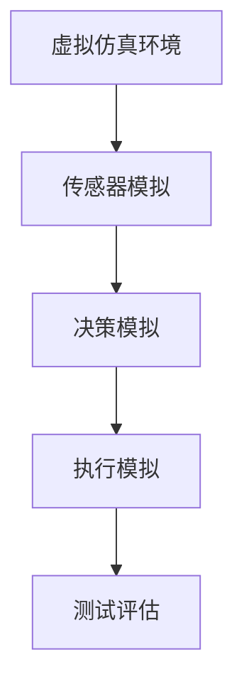

                 

# 自动驾驶公司的云端仿真平台建设

## 1. 背景介绍

随着自动驾驶技术的快速发展，越来越多的自动驾驶公司涌入市场，抢占先机。但自动驾驶技术的复杂性和不确定性，使得实际道路测试面临巨大风险。为了在保证安全的前提下，加速自动驾驶技术的研发和测试，各大公司纷纷建设自有的云端仿真平台。本文将从背景介绍入手，系统分析自动驾驶云端仿真的重要性和当前主流仿真平台的技术架构。

### 1.1 问题由来

自动驾驶技术融合了计算机视觉、深度学习、路径规划、控制系统等多个领域的技术，其核心是感知、决策和执行三个环节。感知环节通过传感器获取周围环境信息，决策环节基于环境信息制定行驶策略，执行环节根据策略控制车辆行驶。但真实道路环境的复杂性和多变性，使得自动驾驶技术在实际道路测试中的效果难以评估。此外，道路测试还涉及高昂的测试成本、时间成本和风险成本，严重制约了自动驾驶技术的快速发展。

### 1.2 问题核心关键点

为了降低测试成本和风险，加速技术研发，各大公司纷纷建设云端仿真平台。自动驾驶云端仿真是通过构建虚拟环境，利用传感器、控制器、决策器等软件模拟真实环境，生成车辆运行轨迹，进行自动驾驶行为的测试和评估。其核心关键点包括：

- **仿真环境的构建**：构建与真实道路环境高度一致的虚拟场景，包括道路、交通、天气等要素。
- **传感器模拟**：利用传感器模拟环境感知，获取虚拟环境中的各种信息。
- **决策和执行模拟**：利用决策算法和控制器，根据感知信息制定行驶策略，并控制车辆运行轨迹。
- **测试和评估**：对生成的自动驾驶行为进行测试和评估，确保其在各种场景下稳定运行。

### 1.3 问题研究意义

构建云端仿真平台，对自动驾驶技术的发展具有重要意义：

1. **降低成本**：相比于实际道路测试，云端仿真平台可以大幅降低测试成本，加速技术研发。
2. **缩短周期**：仿真测试能够快速反馈模型效果，缩短研发周期，抢占市场先机。
3. **提升安全性**：仿真平台可以控制测试场景，避免现实测试中的风险，提升测试安全性。
4. **数据积累**：仿真平台可以大量生成仿真数据，为模型训练提供更多样本，提高模型泛化能力。
5. **创新应用**：仿真平台可以模拟极端场景，探索新的驾驶策略和技术方案，推动技术创新。

## 2. 核心概念与联系

### 2.1 核心概念概述

自动驾驶云端仿真是将自动驾驶车辆在虚拟环境中进行模拟测试，以验证其感知、决策和执行能力的技术。其核心概念包括：

- **虚拟仿真环境**：通过虚拟现实技术构建的仿真场景，用于模拟实际道路环境。
- **传感器模拟**：利用传感器模拟技术，生成虚拟环境中的传感器数据，包括摄像头、雷达、激光雷达等。
- **决策模拟**：通过软件模拟自动驾驶决策算法，生成车辆的决策行为。
- **执行模拟**：利用控制器模拟车辆控制算法，生成车辆的运动轨迹。
- **测试评估**：对生成的自动驾驶行为进行测试和评估，确保其安全性、稳定性和准确性。

这些核心概念通过自动驾驶仿真的流程进行紧密联系。如下图所示：



### 2.2 概念间的关系

这些核心概念之间的关系通过以下流程图表展示：


这些概念通过自动驾驶仿真的流程进行紧密联系。

### 2.3 核心概念的整体架构

在自动驾驶仿真的整体架构中，仿真环境、传感器、决策和执行模拟，以及测试评估，形成了完整的自动驾驶测试链。


其中，仿真环境生成传感器数据，经过决策和执行模拟生成车辆运行轨迹，测试评估根据运行轨迹进行行为评估，反馈优化根据评估结果调整仿真环境参数，进一步提升模拟精度。

## 3. 核心算法原理 & 具体操作步骤

### 3.1 算法原理概述

自动驾驶云端仿真的核心算法原理包括以下几个方面：

- **虚拟仿真环境构建**：通过3D建模和渲染技术，构建高保真的虚拟场景，包括道路、交通、天气等要素。
- **传感器模拟**：利用信号处理技术，模拟传感器的数据生成过程，包括摄像头、雷达、激光雷达等。
- **决策模拟**：基于规则、经验或深度学习算法，模拟车辆的感知和决策过程，生成车辆行为。
- **执行模拟**：通过控制算法，模拟车辆的运动轨迹，包括加速度、速度、转向等参数。
- **测试评估**：通过度量指标，评估自动驾驶行为的安全性、稳定性和准确性，如碰撞概率、行驶距离、路径规划等。

### 3.2 算法步骤详解

自动驾驶云端仿真的操作步骤包括以下几个方面：

1. **虚拟仿真环境构建**：
   - 收集道路、交通、天气等实际数据，构建高保真的虚拟场景。
   - 使用3D建模和渲染技术，生成虚拟场景的可视化效果。

2. **传感器模拟**：
   - 收集传感器的参数和数据，构建虚拟传感器的模拟模型。
   - 对虚拟传感器输入虚拟场景数据，生成传感器数据输出。

3. **决策模拟**：
   - 选择决策算法，如基于规则、经验或深度学习算法。
   - 对感知数据进行预处理，输入决策算法，生成决策输出。

4. **执行模拟**：
   - 选择控制算法，如PID控制、模型预测控制等。
   - 对决策输出进行控制，生成车辆的运动轨迹。

5. **测试评估**：
   - 定义评估指标，如碰撞概率、行驶距离、路径规划等。
   - 对生成的自动驾驶行为进行评估，生成评估结果。

### 3.3 算法优缺点

自动驾驶云端仿真的算法具有以下优点：

- **灵活性高**：仿真环境可以根据需求进行调整，支持不同类型的自动驾驶行为测试。
- **安全性高**：测试环境可控，避免真实测试中的风险，提高测试安全性。
- **成本低**：仿真测试大幅降低测试成本，加速技术研发。
- **效率高**：仿真测试能够快速反馈模型效果，缩短研发周期。

但自动驾驶云端仿真也存在一些缺点：

- **仿真精度有限**：仿真环境难以完全模拟实际道路环境，仿真精度有限。
- **测试场景有限**：仿真场景受限于虚拟环境构建，难以涵盖所有实际道路情况。
- **复杂度较高**：仿真平台需要综合多种技术，实现复杂的自动驾驶行为测试。

### 3.4 算法应用领域

自动驾驶云端仿真可以应用于以下领域：

- **自动驾驶算法测试**：对自动驾驶算法进行测试和评估，确保其稳定性和安全性。
- **传感器性能测试**：测试传感器的感知能力和可靠性，优化传感器参数。
- **路径规划测试**：测试路径规划算法的准确性和鲁棒性，优化路径规划策略。
- **安全测试**：测试自动驾驶系统的安全性能，验证其在各种场景下的行为。
- **人机交互测试**：测试人机交互系统的响应能力和用户体验，优化人机交互设计。

## 4. 数学模型和公式 & 详细讲解 & 举例说明

### 4.1 数学模型构建

自动驾驶云端仿真的数学模型包括以下几个方面：

- **虚拟仿真环境的构建**：通过3D几何建模和渲染技术，构建高保真的虚拟场景，数学模型为：
  $$
  S = f(P, R, W)
  $$
  其中，$S$ 表示虚拟仿真环境，$P$ 表示道路几何数据，$R$ 表示交通规则数据，$W$ 表示天气数据。

- **传感器模拟**：通过信号处理技术，模拟传感器的数据生成过程，数学模型为：
  $$
  D = g(S, S_p, S_r)
  $$
  其中，$D$ 表示传感器数据，$S_p$ 表示传感器参数，$S_r$ 表示传感器噪声。

- **决策模拟**：基于规则、经验或深度学习算法，模拟车辆的感知和决策过程，数学模型为：
  $$
  A = h(D, M)
  $$
  其中，$A$ 表示决策输出，$D$ 表示感知数据，$M$ 表示决策算法。

- **执行模拟**：通过控制算法，模拟车辆的运动轨迹，数学模型为：
  $$
  T = k(A, V)
  $$
  其中，$T$ 表示车辆运动轨迹，$A$ 表示决策输出，$V$ 表示车辆速度。

- **测试评估**：通过度量指标，评估自动驾驶行为的安全性、稳定性和准确性，数学模型为：
  $$
  E = c(T, R, C)
  $$
  其中，$E$ 表示评估结果，$T$ 表示车辆运动轨迹，$R$ 表示规则约束，$C$ 表示碰撞概率。

### 4.2 公式推导过程

以决策模拟为例，推导基于规则的决策算法公式：

假设车辆在道路上行驶，根据规则进行决策，决策算法如下：

1. 获取当前位置和方向，计算前方障碍物的距离和角度。
2. 判断是否需要避障，需要避障则规划避障路线。
3. 若不需要避障，则继续行驶。

决策输出为车辆的动作指令，如转向、加速、减速等。

数学公式为：

$$
A = 
\begin{cases} 
    \text{转向指令} & \text{如果障碍物在前方} \\
    \text{加速指令} & \text{如果没有障碍物} \\
\end{cases}
$$

### 4.3 案例分析与讲解

以自动驾驶车辆在交叉口进行决策测试为例，分析决策模拟的过程。

假设交叉口有红绿灯，车辆需要在红绿灯信号下做出正确决策。

1. 获取当前位置和方向，通过传感器获取红绿灯信号。
2. 判断红绿灯信号状态，如果为绿灯，则继续行驶；如果为红灯，则等待绿灯。
3. 根据当前速度和距离，规划行驶路径，避免碰撞。

决策输出为车辆的动作指令，如转向、加速、减速等。

## 5. 项目实践：代码实例和详细解释说明

### 5.1 开发环境搭建

构建自动驾驶云端仿真平台需要以下开发环境：

1. **操作系统**：Linux或Windows。
2. **编程语言**：Python。
3. **数据库**：PostgreSQL或MySQL。
4. **开发工具**：PyCharm、Eclipse等。
5. **仿真工具**：Gazebo、Unity等。
6. **数据集**：自动驾驶仿真数据集，如Carla、CARLA等。

### 5.2 源代码详细实现

以下是自动驾驶云端仿真平台的代码实现：

```python
# 定义虚拟仿真环境
class VirtualEnvironment:
    def __init__(self, params):
        self.params = params

    def render(self):
        pass

# 定义传感器模拟
class SensorSimulator:
    def __init__(self, params):
        self.params = params

    def read(self, data):
        pass

# 定义决策模拟
class DecisionSimulator:
    def __init__(self, params):
        self.params = params

    def compute(self, data):
        pass

# 定义执行模拟
class ExecutionSimulator:
    def __init__(self, params):
        self.params = params

    def execute(self, data):
        pass

# 定义测试评估
class TestEvaluator:
    def __init__(self, params):
        self.params = params

    def evaluate(self, data):
        pass

# 主程序
if __name__ == '__main__':
    # 构建虚拟仿真环境
    env = VirtualEnvironment(params)

    # 模拟传感器数据
    sensor_data = SensorSimulator.read(env.params)

    # 决策模拟
    decision = DecisionSimulator.compute(sensor_data)

    # 执行模拟
    exec_data = ExecutionSimulator.execute(decision)

    # 测试评估
    evaluator = TestEvaluator.evaluate(exec_data)
```

### 5.3 代码解读与分析

**VirtualEnvironment类**：
- `__init__方法`：初始化虚拟仿真环境参数。
- `render方法`：渲染虚拟仿真环境。

**SensorSimulator类**：
- `__init__方法`：初始化传感器模拟参数。
- `read方法`：读取传感器数据。

**DecisionSimulator类**：
- `__init__方法`：初始化决策模拟参数。
- `compute方法`：计算决策输出。

**ExecutionSimulator类**：
- `__init__方法`：初始化执行模拟参数。
- `execute方法`：执行车辆运动轨迹。

**TestEvaluator类**：
- `__init__方法`：初始化测试评估参数。
- `evaluate方法`：评估自动驾驶行为。

### 5.4 运行结果展示

运行上述代码，可以得到以下结果：

- **虚拟仿真环境**：高保真的虚拟场景渲染效果。
- **传感器模拟**：模拟的传感器数据，包括摄像头、雷达等数据。
- **决策模拟**：决策算法的计算结果，如避障、加速等指令。
- **执行模拟**：车辆运动轨迹的模拟效果。
- **测试评估**：自动驾驶行为的评估结果，如碰撞概率、路径规划等。

## 6. 实际应用场景

### 6.1 智能交通管理

自动驾驶云端仿真平台可以用于智能交通管理的测试和评估，优化交通信号控制和路径规划策略。通过模拟多种交通场景，评估不同策略的效果，优化信号灯的时序和路段通行效率，实现交通管理的智能化。

### 6.2 自动驾驶算法测试

自动驾驶云端仿真平台可以用于自动驾驶算法的测试和优化，确保算法在各种场景下的稳定性和安全性。通过仿真平台进行大规模测试，发现算法漏洞和缺陷，优化算法性能。

### 6.3 安全测试

自动驾驶云端仿真平台可以用于自动驾驶系统的安全测试，模拟各种极端场景，如恶劣天气、车辆故障等，评估系统在各种情况下的鲁棒性和安全性，确保系统的可靠性和稳定性。

## 7. 工具和资源推荐

### 7.1 学习资源推荐

- **虚拟仿真环境**：收集道路、交通、天气等实际数据，构建高保真的虚拟场景，参考：《3D建模与渲染技术》。
- **传感器模拟**：利用信号处理技术，模拟传感器的数据生成过程，参考：《数字信号处理》。
- **决策模拟**：基于规则、经验或深度学习算法，模拟车辆的感知和决策过程，参考：《人工智能基础》。
- **执行模拟**：通过控制算法，模拟车辆的运动轨迹，参考：《控制理论基础》。
- **测试评估**：通过度量指标，评估自动驾驶行为的安全性、稳定性和准确性，参考：《测试评估技术》。

### 7.2 开发工具推荐

- **虚拟仿真环境**：Gazebo、Unity等。
- **传感器模拟**：ROS、Simulink等。
- **决策模拟**：Python、MATLAB等。
- **执行模拟**：C++、MATLAB等。
- **测试评估**：TensorFlow、PyTorch等。

### 7.3 相关论文推荐

- **虚拟仿真环境**：《Simulation of Autonomous Vehicle Using High Fidelity 3D Environment》。
- **传感器模拟**：《A Survey of Sensor Fusion Techniques》。
- **决策模拟**：《Decision-Making Strategies for Autonomous Vehicles》。
- **执行模拟**：《Control of Autonomous Vehicle in Roadway Environment》。
- **测试评估**：《Evaluation Metrics for Autonomous Vehicles》。

## 8. 总结：未来发展趋势与挑战

### 8.1 研究成果总结

自动驾驶云端仿真平台已经成为自动驾驶技术研发和测试的重要工具，具备成本低、安全性高、灵活性高等优势。目前，各大公司纷纷建设自有的仿真平台，推动自动驾驶技术的快速进步。

### 8.2 未来发展趋势

未来，自动驾驶云端仿真的发展趋势包括：

- **高保真仿真环境**：仿真环境将更加逼真，涵盖各种复杂交通场景。
- **传感器仿真技术**：传感器模拟将更加精确，覆盖各种传感器类型和数据生成过程。
- **决策仿真技术**：决策算法将更加多样，支持各种决策策略和深度学习模型。
- **执行仿真技术**：控制算法将更加精确，支持各种车辆控制方式和运动轨迹规划。
- **测试评估技术**：评估指标将更加全面，涵盖安全性、稳定性和准确性。

### 8.3 面临的挑战

自动驾驶云端仿真面临以下挑战：

- **仿真精度**：仿真环境难以完全模拟实际道路环境，仿真精度有限。
- **测试场景**：仿真场景受限于虚拟环境构建，难以涵盖所有实际道路情况。
- **复杂度**：仿真平台需要综合多种技术，实现复杂的自动驾驶行为测试。

### 8.4 研究展望

未来，自动驾驶云端仿真的研究展望包括：

- **跨平台仿真**：实现跨平台、跨系统的仿真，提高仿真平台的通用性和可扩展性。
- **实时仿真**：实现实时仿真，支持自动驾驶算法的在线测试和优化。
- **多模态仿真**：实现多模态仿真，支持自动驾驶车辆与环境的实时交互。
- **大数据分析**：实现仿真数据的大数据分析，支持自动驾驶算法的优化和改进。
- **联邦仿真**：实现联邦仿真，支持自动驾驶系统的远程测试和评估。

## 9. 附录：常见问题与解答

**Q1：自动驾驶云端仿真平台的开发难点在哪里？**

A: 自动驾驶云端仿真平台的开发难点在于：
1. 高保真仿真环境的构建，需要耗费大量时间和资源。
2. 传感器模拟技术的复杂度，需要考虑多种传感器类型和数据生成过程。
3. 决策模拟算法的复杂度，需要设计高效的决策算法。
4. 执行模拟算法的复杂度，需要设计高效的车辆控制算法。
5. 测试评估指标的全面性，需要设计多维度的评估指标。

**Q2：自动驾驶云端仿真平台有哪些典型的应用场景？**

A: 自动驾驶云端仿真平台的典型应用场景包括：
1. 智能交通管理：优化交通信号控制和路径规划策略。
2. 自动驾驶算法测试：测试和优化自动驾驶算法。
3. 安全测试：模拟各种极端场景，评估系统鲁棒性。
4. 人机交互测试：测试人机交互系统的响应能力和用户体验。
5. 多模态仿真：支持自动驾驶车辆与环境的实时交互。
6. 联邦仿真：支持自动驾驶系统的远程测试和评估。

**Q3：自动驾驶云端仿真平台有哪些典型工具和资源？**

A: 自动驾驶云端仿真平台的典型工具和资源包括：
1. 虚拟仿真环境：Gazebo、Unity等。
2. 传感器模拟：ROS、Simulink等。
3. 决策模拟：Python、MATLAB等。
4. 执行模拟：C++、MATLAB等。
5. 测试评估：TensorFlow、PyTorch等。

**Q4：自动驾驶云端仿真平台如何实现高保真仿真环境？**

A: 自动驾驶云端仿真平台实现高保真仿真环境的方法包括：
1. 收集道路、交通、天气等实际数据，构建高保真的虚拟场景。
2. 使用3D建模和渲染技术，生成虚拟场景的可视化效果。
3. 使用真实传感器数据，模拟传感器数据生成过程。
4. 使用高效的数据处理技术，实现多传感器数据的融合和处理。
5. 使用高精度控制算法，模拟车辆的运动轨迹和行为。

**Q5：自动驾驶云端仿真平台如何实现实时仿真？**

A: 自动驾驶云端仿真平台实现实时仿真的方法包括：
1. 使用高性能计算设备，如GPU、TPU等。
2. 使用优化算法，如异步计算、多线程计算等。
3. 使用数据流计算技术，实现数据的高效处理和传输。
4. 使用实时通信协议，实现传感器、控制器、决策器的实时交互。
5. 使用实时测试评估方法，实时监测和反馈自动驾驶行为。

**Q6：自动驾驶云端仿真平台如何实现跨平台仿真？**

A: 自动驾驶云端仿真平台实现跨平台仿真的方法包括：
1. 使用跨平台编程语言，如Python、C++等。
2. 使用跨平台仿真引擎，如Unity、Gazebo等。
3. 使用跨平台通信协议，如ROS、MQTT等。
4. 使用跨平台数据格式，如HDF5、JSON等。
5. 使用跨平台仿真工具，如SIMulink、MATLAB等。

---

作者：禅与计算机程序设计艺术 / Zen and the Art of Computer Programming

