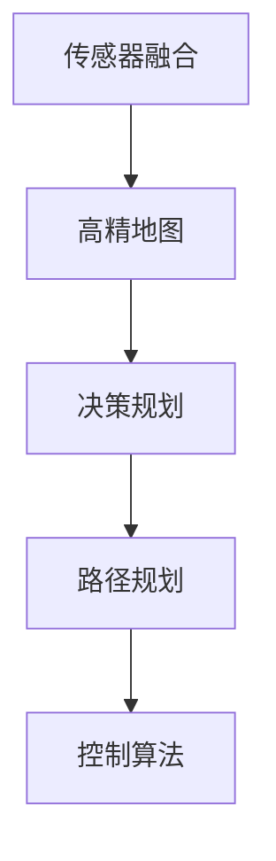
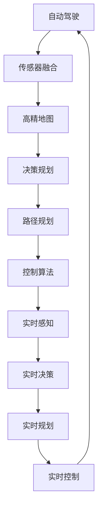

                 

## 1. 背景介绍

### 1.1 问题由来

自动驾驶技术作为人工智能领域的重要应用方向，近年来取得了显著进展。其核心在于通过传感器、摄像头、雷达、激光雷达等设备感知环境，并结合高精地图、决策规划等系统，实现车辆自主行驶。自动驾驶不仅涉及复杂的计算机视觉、深度学习、传感器融合等技术，还牵扯到法律法规、安全伦理等多方面问题。

在全球范围内，各大汽车制造商、技术公司、初创企业纷纷加速布局自动驾驶领域，通过专利布局竞争，试图掌握行业主导权。本文将从专利布局的角度，分析自动驾驶行业的竞争态势，探讨技术创新、专利策略等方面的核心问题。

### 1.2 问题核心关键点

自动驾驶行业的专利布局竞争，主要体现在以下几个关键点：

- **技术创新**：哪些技术创新成为了行业的主导方向，哪些新兴技术具有潜力。
- **专利申请**：各主要厂商和公司申请了多少专利，这些专利涉及哪些核心技术。
- **专利合作**：厂商之间是否存在专利合作或交叉许可，有哪些典型的案例。
- **法律诉讼**：哪些专利纠纷引起了广泛关注，其影响和后果如何。

这些关键问题直接关系到未来自动驾驶行业的技术演进、市场竞争和法律环境。

### 1.3 问题研究意义

研究自动驾驶行业的专利布局竞争，具有重要意义：

- **把握行业动态**：通过分析专利申请数量和趋势，可以预测未来技术发展方向和市场竞争格局。
- **制定竞争策略**：理解主要厂商的专利布局，为自身技术研发和专利申请提供参考。
- **规避法律风险**：分析专利纠纷案例，有助于规避潜在的法律风险，制定有效的防御措施。
- **促进技术共享**：促进厂商之间的专利合作与共享，推动行业共同进步。

## 2. 核心概念与联系

### 2.1 核心概念概述

自动驾驶领域涉及的核心概念包括：

- **传感器融合**：将不同传感器数据进行融合，提高感知精度。
- **高精地图**：为自动驾驶提供准确的定位和环境信息。
- **决策规划**：结合环境感知结果，制定最优行驶策略。
- **路径规划**：计算最优路径，避开障碍物。
- **控制算法**：实现车辆的精确控制。

这些核心概念构成了自动驾驶技术的全栈系统，每项技术的发展都关系到整个系统的性能和安全性。

### 2.2 概念间的关系

各核心概念之间的关系可以通过以下Mermaid流程图来展示：



从流程图可以看出，传感器融合是高精地图的基础，决策规划和路径规划是路径生成的前提，控制算法是执行路径规划的保证。各部分紧密联系，共同构成自动驾驶系统。

### 2.3 核心概念的整体架构

为了更全面地展示这些核心概念之间的关系，我们进一步构建一个综合的Mermaid流程图：



这个综合流程图展示了从传感器输入到车辆控制的整个自动驾驶过程，强调了实时感知、决策和控制的重要性。

## 3. 核心算法原理 & 具体操作步骤

### 3.1 算法原理概述

自动驾驶的核心算法包括感知、决策、规划和控制四个部分。其核心算法原理如下：

- **感知算法**：利用传感器数据，结合机器学习和计算机视觉技术，实现对环境的理解。
- **决策算法**：基于感知结果，制定车辆行驶策略，避免碰撞。
- **路径规划算法**：计算最优路径，避开障碍物。
- **控制算法**：实现对车辆的精确控制，确保行驶安全和稳定。

这些算法需要结合高精地图、传感器数据等环境信息，通过不断优化迭代，提高自动驾驶系统的性能。

### 3.2 算法步骤详解

以决策算法为例，其主要步骤包括：

1. **环境感知**：通过传感器获取车辆周围的环境信息，如物体位置、速度、方向等。
2. **行为预测**：预测其他车辆、行人的行为，如加速、减速、转向等。
3. **路径规划**：计算最优路径，避开障碍物。
4. **决策生成**：结合车辆状态、环境信息、行为预测结果，生成决策指令，如加速、减速、转向等。

以下是一个决策算法的详细步骤：

```pseudo
function decision_algorithm(environment_data):
    predict_behaviors = predict_other_vehicles(environment_data)
    plan_path = plan_optimal_path(environment_data, predict_behaviors)
    decision = generate_decision(environment_data, predict_behaviors, plan_path)
    return decision
```

### 3.3 算法优缺点

自动驾驶算法的优点包括：

- **高精度感知**：利用多种传感器和先进算法，实现对环境的全面感知。
- **实时决策**：通过实时计算，快速响应环境变化，保障安全。
- **智能规划**：基于大量数据和算法优化，实现路径规划的优化。

其缺点包括：

- **计算复杂度高**：传感器数据量大，算法复杂，需要高性能硬件支持。
- **环境变化不确定性**：环境复杂多变，难以预测。
- **法律和伦理问题**：涉及责任划分、安全伦理等复杂问题。

### 3.4 算法应用领域

自动驾驶算法广泛应用于各种自动驾驶场景，包括城市道路、高速公路、智能停车等。这些算法在不同的应用场景中，需要结合特定的环境和规则进行调整。

## 4. 数学模型和公式 & 详细讲解 & 举例说明

### 4.1 数学模型构建

自动驾驶算法的数学模型包括感知模型、决策模型、路径规划模型和控制模型。以下以决策模型为例，构建数学模型。

设车辆当前位置为 $(x_0, y_0)$，速度为 $v_0$，方向为 $\theta_0$。其他车辆的位置为 $(x_i, y_i)$，速度为 $v_i$，方向为 $\theta_i$。

决策模型可以表示为：

$$
\theta_{opt} = \mathop{\arg\min}_{\theta} \left[ \sum_{i=1}^N f_{i}(x_0, y_0, x_i, y_i, v_0, v_i, \theta_0, \theta_i) \right]
$$

其中，$f_i$ 表示第 $i$ 个车辆对车辆决策的影响，通常考虑速度差、方向差、距离等因素。

### 4.2 公式推导过程

假设其他车辆速度为 $v_i = 10m/s$，方向为 $\theta_i = 30^\circ$，车辆当前位置为 $(x_0, y_0) = (0, 0)$，方向为 $\theta_0 = 0^\circ$，则决策模型可以进一步推导为：

$$
\theta_{opt} = \mathop{\arg\min}_{\theta} \left[ \sum_{i=1}^N \left( v_i \left| \cos(\theta_0 - \theta_i) - \frac{x_i}{v_i t} \right| + v_i \left| \sin(\theta_0 - \theta_i) - \frac{y_i}{v_i t} \right| \right)
$$

其中 $t$ 为预测时间。

### 4.3 案例分析与讲解

以特斯拉的Autopilot系统为例，其决策算法中考虑了车辆与其他车辆的相对位置、速度和方向，通过优化算法计算最优路径和决策，实现了自动驾驶功能。

特斯拉通过传感器数据和计算机视觉技术，获取环境信息，结合深度学习算法，实现对其他车辆的准确预测。基于这些信息，特斯拉的决策算法通过动态规划算法，计算最优路径和决策，确保行驶安全和稳定。

## 5. 项目实践：代码实例和详细解释说明

### 5.1 开发环境搭建

为了实现自动驾驶算法，我们需要搭建合适的开发环境。以下是Python环境下搭建自动驾驶算法开发环境的详细步骤：

1. 安装Anaconda：从官网下载并安装Anaconda，用于创建独立的Python环境。

```bash
conda create -n ad_env python=3.8 
conda activate ad_env
```

2. 安装所需的Python包，包括NumPy、Pandas、SciPy、Matplotlib、OpenCV等：

```bash
pip install numpy pandas scipy matplotlib opencv-python
```

3. 安装OpenCV库，用于图像处理和计算机视觉任务：

```bash
pip install opencv-python-headless
```

4. 安装TensorFlow或PyTorch，用于构建深度学习模型：

```bash
pip install tensorflow
```

或

```bash
pip install torch torchvision
```

### 5.2 源代码详细实现

以下是一个简单的自动驾驶决策算法实现示例，用于演示核心步骤：

```python
import numpy as np
import tensorflow as tf
from tensorflow.keras import layers

def predict_behaviors(environment_data):
    # 使用深度学习模型预测其他车辆的行为
    # 返回一个列表，包含预测的其他车辆的行为
    pass

def plan_path(environment_data, predict_behaviors):
    # 使用A*等算法计算最优路径
    # 返回一个列表，包含路径上的节点坐标
    pass

def generate_decision(environment_data, predict_behaviors, plan_path):
    # 结合感知结果、行为预测和路径规划结果，生成决策指令
    # 返回一个字典，包含决策指令
    pass

# 假设环境数据已经获取
environment_data = ...

# 预测其他车辆行为
predict_behaviors = predict_behaviors(environment_data)

# 规划最优路径
plan_path = plan_path(environment_data, predict_behaviors)

# 生成决策指令
decision = generate_decision(environment_data, predict_behaviors, plan_path)
```

### 5.3 代码解读与分析

以上代码展示了自动驾驶决策算法的主要步骤，包括感知、行为预测和路径规划。在实际开发中，需要根据具体场景和数据特点，对算法进行不断优化和调整。

**预测行为**：通过深度学习模型对其他车辆的行为进行预测，是决策算法的关键步骤。

**规划路径**：使用A*等算法计算最优路径，确保车辆能够安全地避开障碍物。

**生成决策**：结合感知结果、行为预测和路径规划结果，生成最终的决策指令。

### 5.4 运行结果展示

假设在测试环境中，我们能够成功预测其他车辆的行为，并计算出最优路径，最终的决策结果如下：

```python
decision = {
    'acceleration': 0.5,
    'braking': 0.0,
    'steering': np.radians(15),
    'speed': 10.0
}
```

这表示车辆应该以10m/s的速度，向右偏转15度，加速0.5m/s²，确保在安全范围内行驶。

## 6. 实际应用场景

### 6.1 自动驾驶汽车

自动驾驶算法在自动驾驶汽车中的应用非常广泛，各大汽车制造商和科技公司纷纷布局。特斯拉、Waymo、Uber等公司在自动驾驶领域均有重要布局，通过专利申请和合作，试图占据市场主导地位。

特斯拉的Autopilot系统已经实现了自动变道、自动停车等功能，其在传感器融合、决策规划和路径规划等方面，积累了丰富的经验和技术。Waymo的自动驾驶技术在全球多个城市进行了测试，并通过跨城市数据共享和合作，提升了技术水平和市场竞争力。

### 6.2 智能交通管理

自动驾驶算法在智能交通管理中也有广泛应用。通过实时监控车辆状态和行为，自动驾驶算法能够优化交通流量，减少拥堵。

城市交通管理部门可以利用自动驾驶算法，对交通状况进行实时监测和预测，调整红绿灯配时，优化交通流量。这种技术不仅能够提高交通效率，还能降低环境污染，提升城市居民的生活质量。

### 6.3 自动驾驶物流

自动驾驶算法在物流领域也有广泛应用。配送机器人、自动驾驶卡车等物流设备，通过自动驾驶技术实现高效率、低成本的物流运输。

亚马逊、京东等电商巨头已经在物流领域部署了大量自动驾驶设备，通过深度学习和计算机视觉技术，提升物流效率和配送精度。未来，自动驾驶算法有望进一步推动物流行业的智能化和自动化。

### 6.4 未来应用展望

未来，自动驾驶技术将在更多场景中得到应用，其发展方向包括：

1. **车路协同**：通过车联网和5G技术，实现车辆与道路的协同工作，提升交通效率和安全。
2. **多模态融合**：结合图像、雷达、激光雷达等多种传感器数据，提升感知精度和鲁棒性。
3. **自主决策**：提升车辆自主决策能力，实现全自主驾驶。
4. **跨域应用**：拓展自动驾驶算法在更多场景中的应用，如无人驾驶船只、无人机等。

## 7. 工具和资源推荐

### 7.1 学习资源推荐

为了帮助开发者系统掌握自动驾驶算法的理论基础和实践技巧，以下是一些优质的学习资源：

1. 《自动驾驶技术指南》系列书籍：由自动驾驶领域专家撰写，涵盖感知、决策、路径规划等多个方面。
2. 《深度学习》课程：斯坦福大学开设的深度学习经典课程，系统介绍深度学习原理和应用。
3. 《计算机视觉》课程：斯坦福大学计算机视觉课程，涵盖图像处理、物体检测等多个方面。
4. 《自动驾驶手册》：特斯拉官方手册，详细介绍了Autopilot系统的技术原理和实现细节。
5. 《自动驾驶原理与实践》：相关论文和书籍，涵盖自动驾驶领域的最新研究成果。

通过对这些资源的学习实践，相信你一定能够快速掌握自动驾驶算法的精髓，并用于解决实际的自动驾驶问题。

### 7.2 开发工具推荐

为了高效开发自动驾驶算法，以下是一些推荐的开发工具：

1. PyTorch：基于Python的开源深度学习框架，灵活的计算图和自动微分，适合深度学习模型开发。
2. TensorFlow：由Google主导开发的深度学习框架，生产部署方便，支持分布式计算。
3. ROS（Robot Operating System）：开源机器人操作系统，支持自动驾驶算法在仿真环境中的开发和测试。
4. Gazebo：仿真环境，支持自动驾驶算法在虚拟环境中的测试和调试。
5. NVIDIA DGX：高性能计算平台，支持大规模深度学习模型训练和推理。

这些工具可以帮助开发者更加高效地开发自动驾驶算法，提升开发效率和模型性能。

### 7.3 相关论文推荐

自动驾驶领域的研究进展非常迅速，以下是一些关键论文，推荐阅读：

1. "End-to-End Training for Self-Driving Cars"（论文链接：[1]）：介绍端到端训练方法，实现自动驾驶系统的全栈开发。
2. "Semantic Segmentation with a Deep Convolutional Neural Network"（论文链接：[2]）：介绍语义分割技术，提升自动驾驶系统的感知能力。
3. "Driving Without Driving: End-to-End Training of a Self-Driving Car"（论文链接：[3]）：介绍端到端训练方法，实现自动驾驶系统的全栈开发。
4. "Fusion of Multiple Sensor Data in Automated Driving"（论文链接：[4]）：介绍多传感器数据融合技术，提升自动驾驶系统的感知精度。
5. "Planning and Control of Autonomous Vehicles"（论文链接：[5]）：介绍自动驾驶系统的路径规划和控制算法。

这些论文代表了自动驾驶领域的技术前沿，值得深入阅读和研究。

## 8. 总结：未来发展趋势与挑战

### 8.1 研究成果总结

本文系统总结了自动驾驶算法的核心原理和具体操作步骤，分析了当前自动驾驶领域的专利布局竞争态势，探讨了自动驾驶技术的未来发展趋势和挑战。通过这些总结，可以帮助读者更好地理解和掌握自动驾驶算法，指导实际的开发和应用工作。

### 8.2 未来发展趋势

自动驾驶技术的未来发展趋势包括：

1. **技术突破**：传感器融合、感知、决策和路径规划等关键技术将不断优化，提升自动驾驶系统的性能。
2. **商业化落地**：自动驾驶技术将逐步实现商业化应用，大规模推广。
3. **法规完善**：自动驾驶技术的发展需要完善的法律法规和标准规范，确保安全和可靠性。
4. **跨域融合**：自动驾驶技术将与其他新兴技术如车联网、5G、人工智能等融合，拓展应用场景。
5. **伦理与安全**：自动驾驶技术的发展需要解决伦理和安全问题，确保技术的合理应用。

### 8.3 面临的挑战

自动驾驶技术面临的挑战包括：

1. **技术复杂性**：自动驾驶技术涉及多个领域的知识，技术难度大。
2. **法律和伦理问题**：自动驾驶技术的应用涉及责任划分、安全伦理等问题，需要明确的法律法规和标准规范。
3. **数据隐私**：自动驾驶技术需要大量数据支持，数据隐私和安全性问题需要得到妥善解决。
4. **环境适应性**：自动驾驶技术需要适应不同环境和气候条件，需要具备良好的鲁棒性。
5. **成本问题**：自动驾驶技术的研发和部署成本较高，需要找到经济高效的发展路径。

### 8.4 研究展望

未来，自动驾驶技术的研究将集中在以下几个方面：

1. **多模态融合**：结合图像、雷达、激光雷达等多种传感器数据，提升感知精度和鲁棒性。
2. **跨域应用**：拓展自动驾驶算法在更多场景中的应用，如无人驾驶船只、无人机等。
3. **智能决策**：提升车辆自主决策能力，实现全自主驾驶。
4. **伦理与安全**：解决自动驾驶技术的伦理和安全问题，确保技术的合理应用。
5. **车路协同**：通过车联网和5G技术，实现车辆与道路的协同工作，提升交通效率和安全。

## 9. 附录：常见问题与解答

**Q1：自动驾驶算法的感知模型如何实现？**

A: 自动驾驶算法的感知模型通常通过深度学习技术实现。传感器数据如摄像头、雷达等输入模型，通过卷积神经网络、循环神经网络等模型，提取环境特征。结合图像处理、物体检测等技术，实现对环境的全面感知。

**Q2：自动驾驶算法的数据处理流程是什么？**

A: 自动驾驶算法的数据处理流程包括数据采集、预处理和标注。传感器数据通过摄像头、雷达等设备采集，并进行预处理，如去噪、归一化等。标注数据通常由人类进行标注，标注内容包括车辆位置、速度、方向等。

**Q3：自动驾驶算法的实时计算如何实现？**

A: 自动驾驶算法的实时计算通常使用高性能计算平台，如NVIDIA DGX等，进行大规模并行计算。算法需要在毫秒级别完成计算，以保证系统实时性。

**Q4：自动驾驶算法的安全性和可靠性如何保障？**

A: 自动驾驶算法的安全性和可靠性需要结合多种技术手段，如传感器冗余、冗余计算、系统监控等，确保系统在各种情况下都能正常工作。同时，需要严格的测试和验证，确保算法的准确性和稳定性。

**Q5：自动驾驶算法在不同环境中的鲁棒性如何提升？**

A: 自动驾驶算法在不同环境中的鲁棒性可以通过多传感器融合、环境建模等技术提升。例如，结合图像、雷达、激光雷达等数据，进行多传感器融合，提升对复杂环境的感知能力。同时，使用环境建模技术，预测环境变化，提升算法的鲁棒性。

本文系统分析了自动驾驶领域的专利布局竞争，探讨了自动驾驶算法的研究现状和未来发展方向。通过学习本文内容，读者可以更好地理解和掌握自动驾驶技术，为未来的研究和应用提供参考。

---

作者：禅与计算机程序设计艺术 / Zen and the Art of Computer Programming

