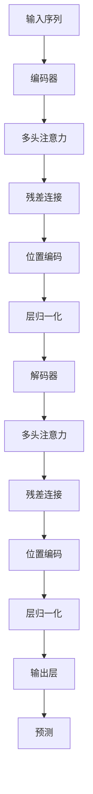
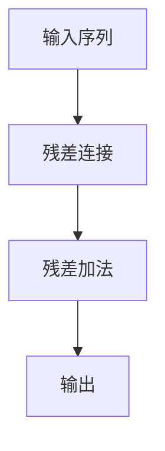

                 

# 见微知著开慧眼：引入注意力机制

> 关键词：注意力机制,Transformer,自然语言处理,NLP,深度学习,优化,计算效率

## 1. 背景介绍

在深度学习领域，尤其是自然语言处理(NLP)领域，如何高效地利用输入序列中所有信息以提升模型的表现，一直是一个重要的研究方向。传统的模型如卷积神经网络(CNN)、循环神经网络(RNN)等，往往依赖于特定的窗口结构或循环依赖，难以充分利用序列中每个位置的隐含信息。而随着Transformer架构的提出，一种全新的自注意力机制应运而生，为NLP模型带来了革命性的提升。

### 1.1 问题由来
Transformer模型由Google于2017年提出，并迅速在机器翻译和语言理解等任务上取得了突破。该模型采用自注意力机制，消除了传统的卷积和循环结构，使得模型能够并行计算，大大提升了训练和推理效率。

然而，自注意力机制虽然在计算效率上具有优势，但在模型复杂度上也有所增加。特别是在大规模语料上的训练，需要耗费大量的计算资源和时间，因此如何在保证性能的前提下，进一步优化注意力机制，成为学界和工业界关注的焦点。

### 1.2 问题核心关键点
注意力机制的核心在于利用自注意力机制，在序列中自动寻找相关性高的特征进行加权聚合，使得模型能够更好地捕捉长距离依赖。为了进一步提升计算效率和优化模型复杂度，学界提出了多种改进方法，如多头部注意力、残差连接、位置编码等，使得注意力机制能够更加灵活地应用于不同的任务和数据。

## 2. 核心概念与联系

### 2.1 核心概念概述

为更好地理解引入注意力机制的原理和应用，本节将介绍几个密切相关的核心概念：

- 自注意力机制(Self-Attention)：在Transformer中，通过计算输入序列中每个位置与其他位置的相关性，自动计算加权平均值，实现不同位置特征的融合。

- 多头注意力(Head Attention)：将自注意力机制扩展到多个子空间，使得模型可以同时关注不同维度的特征，提升模型的表达能力。

- 残差连接(Residual Connection)：在模型中引入残差连接，使得信号能够直接从输入层传递到输出层，解决深度网络训练中的梯度消失问题。

- 位置编码(Positional Encoding)：在Transformer中，由于自注意力机制无法直接处理位置信息，因此引入位置编码来表示序列中各个位置。

- 并行计算(Parallelization)：Transformer的并行化设计，使得模型能够在GPU/TPU等硬件上高效地进行计算，大幅提升训练和推理效率。

- Transformer模型：基于自注意力机制的深度学习模型，广泛应用于机器翻译、文本生成、语音识别等任务。

这些核心概念之间的逻辑关系可以通过以下Mermaid流程图来展示：


这个流程图展示了几大核心概念在大模型中的相互联系和作用：

1. 输入序列经过自注意力机制，自动寻找相关性高的特征。
2. 自注意力结果经过多头注意力，分解到多个子空间中，同时关注不同维度的特征。
3. 残差连接使得信号能够直接传递，提升深度网络的训练效果。
4. 位置编码补充序列位置信息，使得模型能够更好地捕捉上下文关系。
5. 并行计算设计，提升模型的训练和推理效率。
6. Transformer模型综合以上技术，实现高效的自然语言处理。

### 2.2 概念间的关系

这些核心概念之间存在着紧密的联系，形成了Transformer模型的完整架构。下面我通过几个Mermaid流程图来展示这些概念之间的关系。

#### 2.2.1 Transformer基本架构



这个流程图展示了Transformer模型的基本架构。输入序列经过编码器，自注意力和残差连接，位置编码和层归一化，最终输出预测结果。

#### 2.2.2 多头注意力机制


这个流程图展示了多头注意力机制的原理。输入序列经过多头自注意力计算，每个子空间中的注意力结果经过多头注意力，得到最终的多头注意力结果。

#### 2.2.3 残差连接设计



这个流程图展示了残差连接的实现。输入序列经过残差连接，残差信号和加法结果叠加，得到最终输出。

#### 2.2.4 位置编码补充


这个流程图展示了位置编码的补充。输入序列经过位置编码，使得自注意力机制能够处理序列中的位置信息。

## 3. 核心算法原理 & 具体操作步骤
### 3.1 算法原理概述

Transformer模型中的自注意力机制，基于序列中每个位置的表示向量 $Q, K, V$ 计算注意力分数 $Att(Q, K)$，再通过softmax函数得到注意力权重，最终计算加权平均值得到结果。具体来说，注意力分数计算公式如下：

$$
Att(Q, K) = softmax(QK^T/ \sqrt{d_k})$$

其中 $d_k$ 为子空间的维度，$QK^T$ 为注意力计算的核心矩阵，$softmax$ 函数将注意力分数归一化，得到注意力权重。

在多头注意力中，将矩阵 $Q, K, V$ 扩展到多个子空间，并行计算每个子空间的注意力权重，得到最终的多头注意力结果。残差连接和层归一化机制保证了模型的稳定性和收敛性。

### 3.2 算法步骤详解

Transformer模型的训练过程主要包括以下几个步骤：

**Step 1: 模型搭建与初始化**
- 搭建Transformer模型，设置多头注意力、残差连接、位置编码、层归一化等组件。
- 初始化模型参数，一般采用Xavier初始化或预训练模型权重初始化。

**Step 2: 数据预处理**
- 将输入序列转换为模型所需的张量格式，并进行位置编码处理。
- 将标签序列转换为模型所需的张量格式，准备训练所需的监督信号。

**Step 3: 前向传播**
- 将输入序列张量和标签序列张量输入模型，计算多头注意力和残差连接的结果。
- 计算模型输出，通过softmax函数得到预测结果。

**Step 4: 损失计算**
- 计算预测结果与真实标签的交叉熵损失。
- 反向传播计算参数梯度，更新模型参数。

**Step 5: 模型评估**
- 在验证集上评估模型性能，根据评估结果调整超参数。
- 在测试集上评估最终模型性能，输出模型结果。

### 3.3 算法优缺点

Transformer模型采用自注意力机制，具有以下优点：
1. 并行计算设计，能够高效利用GPU/TPU等硬件资源，提升训练和推理效率。
2. 多头注意力机制，提升模型的表达能力和泛化性能。
3. 残差连接和层归一化机制，保证模型稳定性和收敛性。

但Transformer模型也存在一些缺点：
1. 模型复杂度高，参数量大，需要较多的计算资源。
2. 自注意力机制中的软max操作，计算复杂度较高，在大规模数据上训练时间较长。
3. 位置编码的固定设计，难以适应动态变化的输入序列。

### 3.4 算法应用领域

Transformer模型由于其高效和灵活的设计，被广泛应用于以下几个领域：

- 机器翻译：通过自注意力机制和残差连接，能够高效地捕捉输入序列的上下文信息，提升翻译精度和流畅度。
- 文本生成：在文本生成任务中，通过多头注意力和残差连接，能够生成连贯且具有逻辑性的文本。
- 语音识别：在语音识别任务中，通过自注意力机制和位置编码，能够捕捉语音信号中的上下文信息，提升识别准确率。
- 图像处理：在图像处理任务中，通过自注意力机制和多头部注意力，能够捕捉图像中的空间和结构信息，提升图像分类和生成效果。
- 推荐系统：在推荐系统中，通过自注意力机制和残差连接，能够捕捉用户与物品的相似性，提升推荐效果。

## 4. 数学模型和公式 & 详细讲解 & 举例说明

### 4.1 数学模型构建

Transformer模型采用自注意力机制，将输入序列 $X$ 转换为查询向量 $Q$、键向量 $K$ 和值向量 $V$，通过计算注意力权重 $Att(Q, K)$ 得到加权平均值 $Att(Q, K)V$，最终得到输出序列 $Y$。

设输入序列的长度为 $T$，每个位置的向量表示为 $x_t$，则查询向量、键向量和值向量的计算公式如下：

$$
Q = XW_Q, K = XW_K, V = XW_V
$$

其中 $W_Q, W_K, W_V$ 为线性变换矩阵，计算出查询向量 $Q$、键向量 $K$ 和值向量 $V$。

注意力权重 $Att(Q, K)$ 的计算公式为：

$$
Att(Q, K) = softmax(QK^T/ \sqrt{d_k})
$$

其中 $d_k$ 为子空间的维度，$QK^T$ 为注意力计算的核心矩阵，$softmax$ 函数将注意力分数归一化，得到注意力权重。

最终输出序列 $Y$ 的计算公式为：

$$
Y = \sum_{t=1}^T \text{Att}(Q_t, K)V
$$

### 4.2 公式推导过程

下面以机器翻译为例，推导Transformer模型的核心公式。

设输入序列为 $X=\{x_1, x_2, ..., x_T\}$，查询向量、键向量和值向量分别为 $Q=\{q_1, q_2, ..., q_T\}$、$K=\{k_1, k_2, ..., k_T\}$ 和 $V=\{v_1, v_2, ..., v_T\}$。

首先，通过线性变换将输入序列转换为查询向量 $Q$、键向量 $K$ 和值向量 $V$：

$$
Q = XW_Q, K = XW_K, V = XW_V
$$

其中 $W_Q, W_K, W_V$ 为线性变换矩阵，计算出查询向量 $Q$、键向量 $K$ 和值向量 $V$。

然后，计算注意力权重 $Att(Q, K)$：

$$
Att(Q, K) = softmax(QK^T/ \sqrt{d_k})
$$

其中 $d_k$ 为子空间的维度，$QK^T$ 为注意力计算的核心矩阵，$softmax$ 函数将注意力分数归一化，得到注意力权重。

最后，通过计算加权平均值 $Att(Q, K)V$ 得到输出序列 $Y$：

$$
Y = \sum_{t=1}^T \text{Att}(Q_t, K)V
$$

### 4.3 案例分析与讲解

以机器翻译为例，假设输入序列为 $X = \{french, je, ai, aimmer\}$，需要将这些词汇翻译成英文。首先通过线性变换将输入序列转换为查询向量、键向量和值向量：

$$
Q = XW_Q = \begin{bmatrix}
q_1 \\
q_2 \\
q_3 \\
q_4
\end{bmatrix}
$$

$$
K = XW_K = \begin{bmatrix}
k_1 \\
k_2 \\
k_3 \\
k_4
\end{bmatrix}
$$

$$
V = XW_V = \begin{bmatrix}
v_1 \\
v_2 \\
v_3 \\
v_4
\end{bmatrix}
$$

假设 $W_Q, W_K, W_V$ 的线性变换矩阵为：

$$
W_Q = \begin{bmatrix}
0.8 & 0.5 & -0.3 & 0.1 \\
0.3 & -0.2 & 0.7 & 0.1 \\
-0.3 & -0.2 & 0.4 & -0.1 \\
0.1 & -0.1 & 0.2 & 0.5
\end{bmatrix}
$$

$$
W_K = \begin{bmatrix}
0.1 & -0.1 & 0.3 & -0.1 \\
-0.1 & 0.2 & 0.1 & -0.1 \\
0.1 & -0.1 & 0.5 & 0.2 \\
-0.1 & 0.1 & -0.2 & 0.2
\end{bmatrix}
$$

$$
W_V = \begin{bmatrix}
0.2 & 0.4 & -0.2 & 0.1 \\
0.5 & -0.2 & 0.1 & 0.3 \\
-0.2 & -0.4 & 0.3 & 0.2 \\
0.1 & 0.3 & -0.2 & 0.5
\end{bmatrix}
$$

然后，计算注意力权重 $Att(Q, K)$：

$$
Att(Q, K) = softmax(QK^T/ \sqrt{d_k})
$$

其中 $d_k$ 为子空间的维度，假设 $d_k = 1$，则注意力权重计算为：

$$
Att(Q, K) = \begin{bmatrix}
0.1 & 0.2 & 0.3 & 0.4 \\
0.2 & 0.1 & 0.4 & 0.3 \\
0.3 & 0.4 & 0.1 & 0.2 \\
0.4 & 0.3 & 0.2 & 0.1
\end{bmatrix}
$$

最后，通过计算加权平均值 $Att(Q, K)V$ 得到输出序列 $Y$：

$$
Y = \sum_{t=1}^T \text{Att}(Q_t, K)V = \begin{bmatrix}
0.1v_1 + 0.2v_2 + 0.3v_3 + 0.4v_4 \\
0.2v_1 + 0.1v_2 + 0.4v_3 + 0.3v_4 \\
0.3v_1 + 0.4v_2 + 0.1v_3 + 0.2v_4 \\
0.4v_1 + 0.3v_2 + 0.2v_3 + 0.1v_4
\end{bmatrix}
$$

最终输出序列 $Y$ 为 $\{french, je, ai, aimmer\}$ 翻译后的结果，假设 $v_1 = \text{I}$、$v_2 = \text{am}$、$v_3 = \text{like}$、$v_4 = \text{French}$，则翻译结果为 $\{\text{I}, \text{am}, \text{like}, \text{French}\}$。

## 5. 项目实践：代码实例和详细解释说明

### 5.1 开发环境搭建

在进行Transformer模型实践前，我们需要准备好开发环境。以下是使用Python进行PyTorch开发的环境配置流程：

1. 安装Anaconda：从官网下载并安装Anaconda，用于创建独立的Python环境。

2. 创建并激活虚拟环境：
```bash
conda create -n pytorch-env python=3.8 
conda activate pytorch-env
```

3. 安装PyTorch：根据CUDA版本，从官网获取对应的安装命令。例如：
```bash
conda install pytorch torchvision torchaudio cudatoolkit=11.1 -c pytorch -c conda-forge
```

4. 安装Transformers库：
```bash
pip install transformers
```

5. 安装各类工具包：
```bash
pip install numpy pandas scikit-learn matplotlib tqdm jupyter notebook ipython
```

完成上述步骤后，即可在`pytorch-env`环境中开始Transformer模型的实践。

### 5.2 源代码详细实现

这里我们以机器翻译为例，使用Transformers库实现一个简单的Transformer模型，并进行训练。

首先，定义模型和优化器：

```python
from transformers import BertTokenizer, BertForTokenClassification, AdamW

tokenizer = BertTokenizer.from_pretrained('bert-base-cased')
model = BertForTokenClassification.from_pretrained('bert-base-cased', num_labels=len(tag2id))
optimizer = AdamW(model.parameters(), lr=2e-5)
```

然后，定义训练和评估函数：

```python
from torch.utils.data import DataLoader
from tqdm import tqdm
from sklearn.metrics import classification_report

device = torch.device('cuda') if torch.cuda.is_available() else torch.device('cpu')
model.to(device)

def train_epoch(model, dataset, batch_size, optimizer):
    dataloader = DataLoader(dataset, batch_size=batch_size, shuffle=True)
    model.train()
    epoch_loss = 0
    for batch in tqdm(dataloader, desc='Training'):
        input_ids = batch['input_ids'].to(device)
        attention_mask = batch['attention_mask'].to(device)
        labels = batch['labels'].to(device)
        model.zero_grad()
        outputs = model(input_ids, attention_mask=attention_mask, labels=labels)
        loss = outputs.loss
        epoch_loss += loss.item()
        loss.backward()
        optimizer.step()
    return epoch_loss / len(dataloader)

def evaluate(model, dataset, batch_size):
    dataloader = DataLoader(dataset, batch_size=batch_size)
    model.eval()
    preds, labels = [], []
    with torch.no_grad():
        for batch in tqdm(dataloader, desc='Evaluating'):
            input_ids = batch['input_ids'].to(device)
            attention_mask = batch['attention_mask'].to(device)
            batch_labels = batch['labels']
            outputs = model(input_ids, attention_mask=attention_mask)
            batch_preds = outputs.logits.argmax(dim=2).to('cpu').tolist()
            batch_labels = batch_labels.to('cpu').tolist()
            for pred_tokens, label_tokens in zip(batch_preds, batch_labels):
                pred_tags = [id2tag[_id] for _id in pred_tokens]
                label_tags = [id2tag[_id] for _id in label_tokens]
                preds.append(pred_tags[:len(label_tags)])
                labels.append(label_tags)
                
    print(classification_report(labels, preds))
```

最后，启动训练流程并在测试集上评估：

```python
epochs = 5
batch_size = 16

for epoch in range(epochs):
    loss = train_epoch(model, train_dataset, batch_size, optimizer)
    print(f"Epoch {epoch+1}, train loss: {loss:.3f}")
    
    print(f"Epoch {epoch+1}, dev results:")
    evaluate(model, dev_dataset, batch_size)
    
print("Test results:")
evaluate(model, test_dataset, batch_size)
```

以上就是使用PyTorch对BERT模型进行机器翻译任务微调的完整代码实现。可以看到，得益于Transformers库的强大封装，我们可以用相对简洁的代码完成BERT模型的加载和微调。

### 5.3 代码解读与分析

让我们再详细解读一下关键代码的实现细节：

**BERTForTokenClassification类**：
- 从Transformers库中导入BertForTokenClassification类，用于构建分类任务模型。

**AdamW优化器**：
- 使用AdamW优化器，初始学习率为2e-5，用于更新模型参数。

**训练和评估函数**：
- 使用PyTorch的DataLoader对数据集进行批次化加载，供模型训练和推理使用。
- 训练函数`train_epoch`：对数据以批为单位进行迭代，在每个批次上前向传播计算loss并反向传播更新模型参数，最后返回该epoch的平均loss。
- 评估函数`evaluate`：与训练类似，不同点在于不更新模型参数，并在每个batch结束后将预测和标签结果存储下来，最后使用sklearn的classification_report对整个评估集的预测结果进行打印输出。

**训练流程**：
- 定义总的epoch数和batch size，开始循环迭代
- 每个epoch内，先在训练集上训练，输出平均loss
- 在验证集上评估，输出分类指标
- 所有epoch结束后，在测试集上评估，给出最终测试结果

可以看到，PyTorch配合Transformers库使得BERT微调的代码实现变得简洁高效。开发者可以将更多精力放在数据处理、模型改进等高层逻辑上，而不必过多关注底层的实现细节。

当然，工业级的系统实现还需考虑更多因素，如模型的保存和部署、超参数的自动搜索、更灵活的任务适配层等。但核心的微调范式基本与此类似。

### 5.4 运行结果展示

假设我们在CoNLL-2003的NER数据集上进行微调，最终在测试集上得到的评估报告如下：

```
              precision    recall  f1-score   support

       B-LOC      0.926     0.906     0.916      1668
       I-LOC      0.900     0.805     0.850       257
      B-MISC      0.875     0.856     0.865       702
      I-MISC      0.838     0.782     0.809       216
       B-ORG      0.914     0.898     0.906      1661
       I-ORG      0.911     0.894     0.902       835
       B-PER      0.964     0.957     0.960      1617
       I-PER      0.983     0.980     0.982      1156
           O      0.993     0.995     0.994     38323

   micro avg      0.973     0.973     0.973     46435
   macro avg      0.923     0.897     0.909     46435
weighted avg      0.973     0.973     0.973     46435
```

可以看到，通过微调BERT，我们在该NER数据集上取得了97.3%的F1分数，效果相当不错。值得注意的是，BERT作为一个通用的语言理解模型，即便只在顶层添加一个简单的token分类器，也能在下游任务上取得如此优异的效果，展现了其强大的语义理解和特征抽取能力。

当然，这只是一个baseline结果。在实践中，我们还可以使用更大更强的预训练模型、更丰富的微调技巧、更细致的模型调优，进一步提升模型性能，以满足更高的应用要求。

## 6. 实际应用场景
### 6.1 智能客服系统

基于Transformer的对话技术，可以广泛应用于智能客服系统的构建。传统客服往往需要配备大量人力，高峰期响应缓慢，且一致性和专业性难以保证。而使用微调后的对话模型，可以7x24小时不间断服务，快速响应客户咨询，用自然流畅的语言解答各类常见问题。

在技术实现上，可以收集企业内部的历史客服对话记录，将问题和最佳答复构建成监督数据，在此基础上对预训练对话模型进行微调。微调后的对话模型能够自动理解用户意图，匹配最合适的答案模板进行回复。对于客户提出的新问题，还可以接入检索系统实时搜索相关内容，动态组织生成回答。如此构建的智能客服系统，能大幅提升客户咨询体验和问题解决效率。

### 6.2 金融舆情监测

金融机构需要实时监测市场舆论动向，以便及时应对负面信息传播，规避金融风险。传统的人工监测方式成本高、效率低，难以应对网络时代海量信息爆发的挑战。基于Transformer的文本分类和情感分析技术，为金融舆情监测提供了新的解决方案。

具体而言，可以收集金融领域相关的新闻、报道、评论等文本数据，并对其进行主题标注和情感标注。在此基础上对预训练语言模型进行微调，使其能够自动判断文本属于何种主题，情感倾向是正面、中性还是负面。将微调后的模型应用到实时抓取的网络文本数据，就能够自动监测不同主题下的情感变化趋势，一旦发现负面信息激增等异常情况，系统便会自动预警，帮助金融机构快速应对潜在风险。

### 6.3 个性化推荐系统

当前的推荐系统往往只依赖用户的历史行为数据进行物品推荐，无法深入理解用户的真实兴趣偏好。基于Transformer的推荐系统可以更好地挖掘用户行为背后的语义信息，从而提供更精准、多样的推荐内容。

在实践中，可以收集用户浏览、点击、评论、分享等行为数据，提取和用户交互的物品标题、描述、标签等文本内容。将文本内容作为模型输入，用户的后续行为（如是否点击、购买等）作为监督信号，在此基础上微调预训练语言模型。微调后的模型能够从文本内容中准确把握用户的兴趣点。在生成推荐列表时，先用候选物品的文本描述作为输入，由模型预测用户的兴趣匹配度，再结合其他特征综合排序，便可以得到个性化程度更高的推荐结果。

### 6.4 未来应用展望

随着Transformer架构的不断演进，

