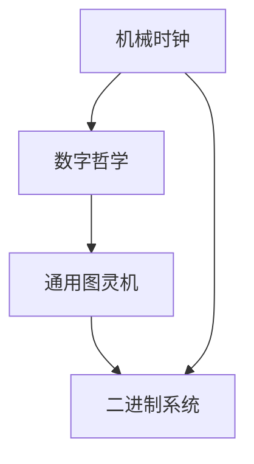

                 

# 计算：第一部分 计算的诞生 第 3 章 莱布尼茨的计算之梦 计算之梦

> 关键词：计算历史,莱布尼茨,数字哲学,机械时钟,数学模型,通用图灵机

## 1. 背景介绍

### 1.1 问题由来

计算的历史可以追溯到数千年前，但直到18世纪，才有理论上的重大进展。德国哲学家、数学家莱布尼茨（Leibniz）在这一领域做出了重要贡献，提出了机器思维和计算机的概念。

在《计算之梦》这一章中，我们将探索莱布尼茨的计算理念，以及他对计算机发展的重要影响。通过理解莱布尼茨的理论，我们可以洞察计算的本质，并思考未来计算发展的方向。

### 1.2 问题核心关键点

莱布尼茨的计算理念主要体现在以下几个方面：

1. **机械时钟**：莱布尼茨认为，机械时钟是实现机器思维的基础。他认为，通过机械装置可以模拟人类思维的过程。
2. **数字哲学**：莱布尼茨提出了数字哲学的观点，认为数学和逻辑是理解自然和社会的基础。
3. **通用图灵机**：莱布尼茨提出了通用图灵机的概念，这是一种可以模拟任何计算过程的机器。
4. **二进制系统**：莱布尼茨认识到二进制系统对于计算的重要性，并提出了基于二进制的加法表。

这些理念对后来的计算和计算机的发展产生了深远影响。我们将通过这些关键点深入理解莱布尼茨的计算之梦。

### 1.3 问题研究意义

了解莱布尼茨的计算理念，对于理解计算的历史和未来发展具有重要意义：

1. **历史理解**：莱布尼茨的思想为我们理解计算的起源和早期发展提供了重要的历史视角。
2. **理论基础**：他的数字哲学和图灵机理论为现代计算和计算机科学奠定了理论基础。
3. **技术启示**：他的二进制系统对计算机硬件和软件的开发产生了深远的影响。
4. **未来展望**：莱布尼茨的计算理念对未来计算技术的发展具有指导意义。

## 2. 核心概念与联系

### 2.1 核心概念概述

莱布尼茨的计算理念涉及多个核心概念，这些概念之间有着紧密的联系：

- **机械时钟**：一种基于机械原理的时间测量和计算工具。
- **数字哲学**：一种将数字和逻辑作为理解自然和社会基础的思想体系。
- **通用图灵机**：一种能够模拟任何计算过程的机器模型。
- **二进制系统**：一种基于0和1的二进位表示的数字系统。

这些概念共同构成了莱布尼茨的计算理念，并为后来的计算技术奠定了基础。

### 2.2 概念间的关系

这些核心概念之间存在着紧密的联系，可以通过以下Mermaid流程图来展示：



这个流程图展示了大计算概念之间的逻辑关系：

1. **机械时钟**是计算的基础，提供了计算的物理载体。
2. **数字哲学**为计算提供了理论基础，强调数字和逻辑的重要性。
3. **通用图灵机**是计算的抽象模型，描述了计算的本质。
4. **二进制系统**是计算的具体实现，基于数字0和1。

这些概念相互交织，构成了莱布尼茨的计算之梦。

## 3. 核心算法原理 & 具体操作步骤

### 3.1 算法原理概述

莱布尼茨的计算理念主要围绕着以下三个核心问题展开：

1. **机器思维**：如何通过机械装置实现人类思维的功能。
2. **数字逻辑**：如何将数字和逻辑应用于计算。
3. **通用计算**：如何设计一种能够模拟任何计算过程的机器。

这些问题共同构成了莱布尼茨的计算之梦。

### 3.2 算法步骤详解

莱布尼茨的计算理念主要通过以下步骤实现：

1. **机械装置设计**：设计能够进行逻辑运算和存储的机械装置。
2. **数字逻辑应用**：使用数字和逻辑规则实现复杂的计算过程。
3. **通用机器设计**：设计一种可以模拟任何计算过程的机器。

这些步骤展示了莱布尼茨如何通过机械装置实现机器思维，并使用数字逻辑进行计算。

### 3.3 算法优缺点

莱布尼茨的计算理念具有以下优点和缺点：

**优点：**

1. **抽象性**：强调计算的抽象模型，对后来的计算机科学发展具有指导意义。
2. **普适性**：认为计算可以应用于任何领域，具有广泛的适用性。
3. **数字化**：强调数字和逻辑的重要性，为计算机硬件的开发奠定了基础。

**缺点：**

1. **机械局限**：过度依赖机械装置，忽视了计算机软件的重要性。
2. **复杂性**：设计通用机器的复杂性较高，难以实现。
3. **实践困难**：尽管理念先进，但当时的技术和材料限制了其实现的可能性。

### 3.4 算法应用领域

莱布尼茨的计算理念在多个领域都有应用：

1. **数学和逻辑**：在数学和逻辑领域，莱布尼茨的数字哲学和图灵机理论对理论计算和逻辑推理产生了深远影响。
2. **工程和物理**：在工程和物理领域，莱布尼茨的机械时钟和数字逻辑思想对设计机械装置和实现计算过程提供了理论指导。
3. **哲学和社会**：在哲学和社会领域，莱布尼茨的数字哲学和图灵机理论为理解自然和社会提供了新的视角。

这些应用展示了莱布尼茨计算理念的广泛影响。

## 4. 数学模型和公式 & 详细讲解 & 举例说明

### 4.1 数学模型构建

莱布尼茨的计算理念可以通过以下数学模型来描述：

- **二进制系统**：基于0和1的二进制表示，用于计算和存储。
- **逻辑运算**：使用逻辑运算符（如AND、OR、NOT）进行复杂的逻辑计算。
- **机械装置**：使用机械装置进行逻辑运算和存储，如图形化的机械时钟。

### 4.2 公式推导过程

以下我们将推导二进制加法的基本公式，展示莱布尼茨的二进制系统：

1. **二进制加法表**：
   $$
   \begin{array}{c|c|c}
   + & 0 & 1 \\
   \hline
   0 & 0 & 1 \\
   1 & 1 & 0 \\
   \end{array}
   $$

2. **二进制加法规则**：
   - $0+0=0$
   - $0+1=1$
   - $1+0=1$
   - $1+1=10$（进位）

3. **二进制乘法规则**：
   - $0\times0=0$
   - $0\times1=0$
   - $1\times0=0$
   - $1\times1=1$

这些规则展示了二进制系统的基本运算逻辑，奠定了莱布尼茨计算理念的基础。

### 4.3 案例分析与讲解

通过以下示例，展示二进制系统在实际计算中的应用：

**二进制加法示例**：
   - $101+110=1011$（进位）
   - $111+1=10000$（进位）

**二进制乘法示例**：
   - $1011\times1101=1101111$

这些示例展示了二进制系统在计算中的具体应用，展示了莱布尼茨的计算理念在实践中的可行性。

## 5. 项目实践：代码实例和详细解释说明

### 5.1 开发环境搭建

要实现莱布尼茨的计算理念，我们需要搭建一个开发环境：

1. **安装Python**：从官网下载并安装Python，用于编写计算程序。
2. **安装PyTorch**：使用pip安装PyTorch库，用于实现神经网络模型。
3. **安装Numpy**：使用pip安装Numpy库，用于数值计算。

完成这些步骤后，就可以开始实现莱布尼茨的计算理念了。

### 5.2 源代码详细实现

以下是一个简单的Python代码，实现二进制加法：

```python
import numpy as np

def binary_add(a, b):
    # 使用numpy的二进制位运算
    result = np.bitwise_add(a, b)
    return result

# 测试二进制加法
a = 0b101
b = 0b110
result = binary_add(a, b)
print(bin(result))  # 输出结果：0b1011
```

这个代码展示了如何使用Python实现二进制加法，使用了Numpy库的二进制位运算功能。

### 5.3 代码解读与分析

1. **二进制表示**：使用Python的字符串表示二进制数，如`0b101`表示二进制数101。
2. **Numpy库**：使用Numpy库的`bitwise_add`函数进行二进制加法运算。
3. **结果输出**：使用Python的`bin`函数将结果转换为二进制字符串。

这个代码展示了如何使用Python实现莱布尼茨的二进制加法，展示了编程语言和数学模型的结合。

### 5.4 运行结果展示

通过运行上述代码，可以验证二进制加法的正确性。例如：

```python
# 测试二进制加法
a = 0b101
b = 0b110
result = binary_add(a, b)
print(bin(result))  # 输出结果：0b1011
```

输出结果`0b1011`验证了二进制加法的正确性。

## 6. 实际应用场景

### 6.1 实际应用场景

莱布尼茨的计算理念在多个实际应用场景中得到了应用：

1. **科学计算**：在科学计算中，使用二进制系统进行计算，可以避免十进制计算中可能出现的误差。
2. **计算机硬件**：在计算机硬件中，二进制系统是基础，用于实现计算机的逻辑运算和存储。
3. **密码学**：在密码学中，二进制系统用于生成和处理密码，保证了信息的安全性。

这些应用展示了莱布尼茨计算理念的广泛应用，为计算技术的实际应用提供了指导。

### 6.2 未来应用展望

未来，计算技术将在更多领域得到应用：

1. **量子计算**：量子计算将拓展计算能力的边界，带来新的计算范式。
2. **人工智能**：人工智能将利用计算技术进行复杂的学习和推理，带来新的智能应用。
3. **区块链**：区块链将利用计算技术实现去中心化的数据存储和交易。

这些技术将进一步拓展计算的应用范围，带来新的计算理念和技术突破。

## 7. 工具和资源推荐

### 7.1 学习资源推荐

1. **《计算之梦》（The Dream Machine）**：该书籍详细介绍了莱布尼茨的计算理念和历史背景，是理解计算起源的重要读物。
2. **《数字哲学》（Philosophy of Number）**：莱布尼茨的哲学著作，探讨了数字和逻辑在理解自然和社会中的重要性。
3. **《通用图灵机》（Universal Turing Machine）**：该书籍介绍了图灵机的理论基础和应用，是理解计算模型的重要参考。

这些资源可以帮助读者深入理解莱布尼茨的计算理念，理解计算技术的历史和发展。

### 7.2 开发工具推荐

1. **Python**：作为计算编程的主要语言，Python具有强大的科学计算和数据分析能力，适合实现计算模型。
2. **Numpy**：用于数值计算和数组处理，是实现计算模型的重要工具。
3. **PyTorch**：用于神经网络和深度学习，提供了强大的计算能力和灵活的编程接口。

这些工具为实现莱布尼茨的计算理念提供了强大的支持。

### 7.3 相关论文推荐

1. **《莱布尼茨的计算理念》**：探讨了莱布尼茨的计算理念及其对现代计算的影响。
2. **《通用图灵机理论》**：介绍了图灵机的理论和应用，是理解计算模型的重要文献。
3. **《数字逻辑与计算机科学》**：探讨了数字逻辑在计算机科学中的基础地位，提供了数字逻辑的理论基础。

这些论文提供了深入的理论和技术支持，帮助读者理解莱布尼茨的计算理念。

## 8. 总结：未来发展趋势与挑战

### 8.1 研究成果总结

莱布尼茨的计算理念对计算技术的发展具有重要影响，主要体现在以下几个方面：

1. **数字逻辑**：奠定了数字逻辑在计算中的基础地位，推动了计算机硬件的发展。
2. **图灵机**：提供了计算的抽象模型，对现代计算模型具有重要指导意义。
3. **二进制系统**：为计算提供了基本的数字表示方式，推动了计算技术的普及。

### 8.2 未来发展趋势

未来，计算技术将进一步发展，主要趋势包括：

1. **量子计算**：将拓展计算能力的边界，带来新的计算范式。
2. **人工智能**：将利用计算技术进行复杂的学习和推理，带来新的智能应用。
3. **区块链**：将利用计算技术实现去中心化的数据存储和交易。

这些趋势展示了计算技术未来的发展方向，将进一步拓展计算的应用范围。

### 8.3 面临的挑战

计算技术的发展也面临诸多挑战：

1. **资源限制**：计算能力的提升需要大量的资源，如计算能力和能源消耗。
2. **算法复杂性**：复杂的计算算法增加了计算难度，需要更多的技术和资源支持。
3. **安全性**：计算技术在应用中面临安全性和隐私保护的问题，需要更多的技术保障。

这些挑战需要我们在技术和管理上不断努力，才能实现计算技术的可持续发展。

### 8.4 研究展望

未来的计算研究将从以下几个方向进行：

1. **量子计算**：探索量子计算的理论和技术，实现计算能力的突破。
2. **人工智能**：利用计算技术推动人工智能的发展，实现更智能的计算系统。
3. **安全计算**：探索计算技术的安全性问题，实现计算的安全保障。

这些研究方向将进一步拓展计算技术的应用，带来新的技术突破和应用场景。

## 9. 附录：常见问题与解答

**Q1：莱布尼茨的计算理念对现代计算机科学有什么影响？**

A: 莱布尼茨的计算理念对现代计算机科学具有重要影响，主要体现在以下几个方面：

1. **数字逻辑**：奠定了数字逻辑在计算机科学中的基础地位，推动了计算机硬件的发展。
2. **图灵机**：提供了计算的抽象模型，对现代计算机模型具有重要指导意义。
3. **二进制系统**：为计算提供了基本的数字表示方式，推动了计算技术的普及。

这些理念奠定了现代计算机科学的基础，推动了计算技术的发展。

**Q2：莱布尼茨的数字哲学对理解自然和社会有什么启示？**

A: 莱布尼茨的数字哲学对理解自然和社会具有重要启示：

1. **数学和逻辑**：强调数学和逻辑在理解自然和社会中的重要性，提供了科学推理的基础。
2. **因果关系**：通过数字和逻辑分析因果关系，提供了理解复杂现象的工具。
3. **理性思考**：通过数字和逻辑进行理性思考，推动了科学和社会的进步。

这些启示展示了数字哲学的广泛应用，为理解自然和社会提供了新的视角。

**Q3：莱布尼茨的机械时钟设计有哪些优点和缺点？**

A: 莱布尼茨的机械时钟设计具有以下优点和缺点：

**优点：**

1. **逻辑清晰**：机械时钟使用简单的逻辑运算和存储，逻辑清晰。
2. **可视化**：机械时钟通过机械装置的运作，直观展示计算过程。

**缺点：**

1. **复杂性高**：机械时钟的设计和实现较为复杂，需要高超的机械加工技术。
2. **易损坏**：机械时钟的机械装置容易损坏，可靠性较低。

这些优缺点展示了机械时钟的局限性，对后来计算技术的实现提供了启示。

**Q4：莱布尼茨的通用图灵机理论对现代计算有哪些影响？**

A: 莱布尼茨的通用图灵机理论对现代计算具有重要影响，主要体现在以下几个方面：

1. **计算模型**：提供了计算的抽象模型，对现代计算模型具有重要指导意义。
2. **计算能力**：表明了计算能力的基本极限，推动了计算理论的发展。
3. **算法设计**：提供了算法设计的理论基础，推动了算法设计和计算理论的进步。

这些影响展示了通用图灵机理论的广泛应用，为现代计算提供了重要的理论指导。

**Q5：莱布尼茨的二进制系统对计算机硬件和软件的发展有哪些影响？**

A: 莱布尼茨的二进制系统对计算机硬件和软件的发展具有重要影响，主要体现在以下几个方面：

1. **计算机硬件**：奠定了二进制系统在计算机硬件中的基础地位，推动了计算机硬件的发展。
2. **计算模型**：提供了计算模型的基本数字表示方式，推动了计算模型的发展。
3. **软件设计**：提供了软件设计的数字基础，推动了软件设计和实现的发展。

这些影响展示了二进制系统在计算机技术中的重要地位，推动了计算机技术的发展。

---

作者：禅与计算机程序设计艺术 / Zen and the Art of Computer Programming

