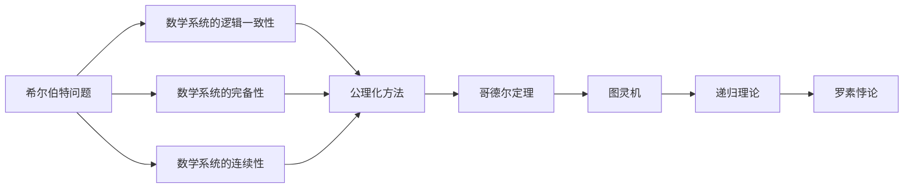
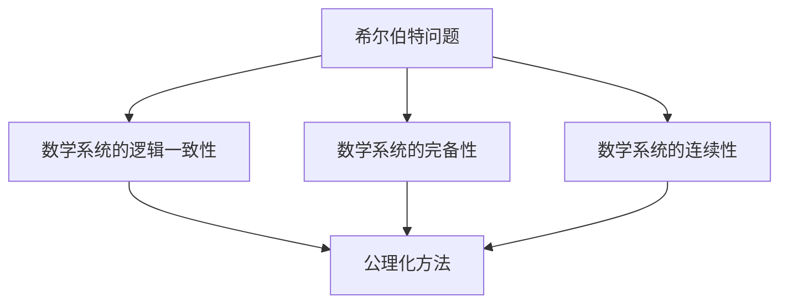
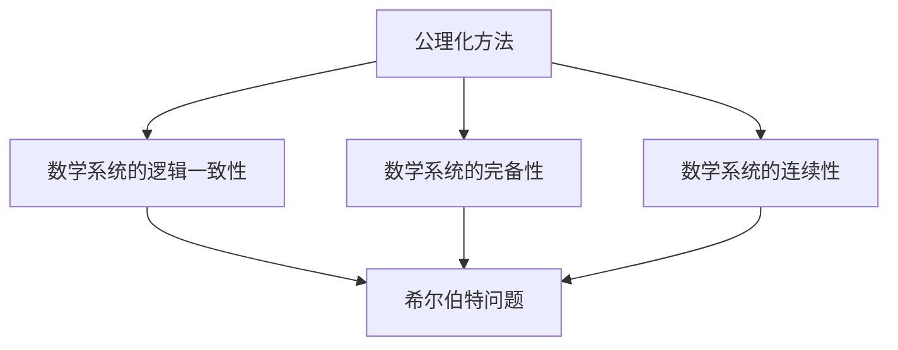
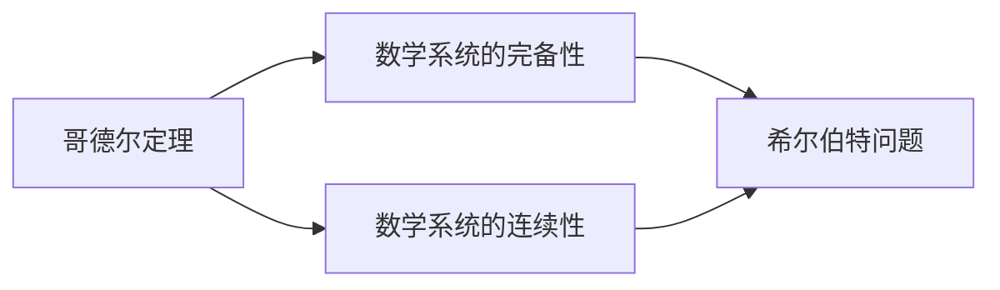
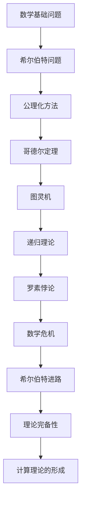

                 

# 计算：第三部分 计算理论的形成 第 6 章 计算理论的奠基：希尔伯特进路 数学的世纪之问

> 关键词：计算理论, 希尔伯特进路, 数学危机, 公理化方法, 哥德尔定理, 理论完备性

## 1. 背景介绍

### 1.1 问题由来

20世纪初，随着科学技术的快速发展，数学作为人类理解自然世界的重要工具，其地位和作用愈发凸显。然而，在数学基础领域，一系列深刻的问题逐渐暴露出来，引发了著名的“数学危机”。这些问题集中体现在数学体系的逻辑一致性、连续性与完备性上，其中最著名的是希尔伯特的数学危机演讲和哥德尔的不完备性定理。这些问题不仅推动了数学的巨大进步，也深刻影响了计算机科学和人工智能的发展。

### 1.2 问题核心关键点

希尔伯特进路的核心在于对数学的逻辑基础和完备性进行系统研究。他提出的问题包括：

- 数学系统的逻辑一致性：是否存在一套公理系统，能够保证所有逻辑推断都是正确的？
- 数学系统的完备性：是否所有数学命题都可以用公理系统中的推导规则得出？
- 数学系统的连续性：是否所有数学命题都可以用有限步骤的推导得到？

这些问题不仅触及了数学的基础，也影响到了计算机科学和人工智能的逻辑基础。解决这些问题，对于构建可靠、可解释的计算系统至关重要。

### 1.3 问题研究意义

希尔伯特进路的研究不仅推动了数学的进步，也为计算机科学和人工智能的发展提供了理论基础。通过研究希尔伯特的问题，人们意识到数学系统的不完备性和计算机系统的计算限制，为后续的哥德尔不完备性定理和图灵机模型奠定了理论基础。这些理论不仅深化了对数学和计算机的理解，也为人工智能的可解释性和理论完备性提供了指导。

## 2. 核心概念与联系

### 2.1 核心概念概述

为更好地理解希尔伯特进路，本节将介绍几个密切相关的核心概念：

- **希尔伯特问题**：希尔伯特在20世纪初提出的三个基本问题，涉及数学的逻辑一致性、完备性和连续性。这些问题推动了数学和计算机科学的发展，也是希尔伯特进路的研究核心。
- **公理化方法**：一种通过明确定义一组基本概念和公理，并基于这些公理进行逻辑推理的方法。公理化方法被广泛应用于数学和计算机科学，是形式化理论研究的基础。
- **哥德尔定理**：由哥德尔在1931年证明的不完备性定理，指出在任意强大到足以表达算术的公理化系统中，存在不可判定的命题，即既不能证明也不能证伪。这一发现深刻影响了计算机科学和人工智能，提出了形式化系统的局限性。
- **图灵机**：由图灵在1936年提出的一种抽象计算模型，用于描述计算过程和计算复杂度。图灵机是计算机科学的基石，对理解计算理论具有重要意义。
- **递归理论**：一种研究函数、算法和递归关系的理论。递归理论是计算理论的重要组成部分，与图灵机的概念紧密相关。
- **罗素悖论**：一种经典的数学悖论，揭示了数学基础中的逻辑矛盾。罗素悖论是促使希尔伯特提出数学危机和希尔伯特问题的重要原因。

这些核心概念之间的逻辑关系可以通过以下Mermaid流程图来展示：



这个流程图展示了大语言模型的核心概念及其之间的关系：

1. 希尔伯特问题涉及数学系统的三个核心属性。
2. 公理化方法是解决问题的基本手段。
3. 哥德尔定理揭示了数学系统的局限性。
4. 图灵机和递归理论为数学系统提供了形式化的计算模型。
5. 罗素悖论揭示了数学基础中的逻辑矛盾，进一步推动了希尔伯特问题的研究。

这些核心概念共同构成了希尔伯特进路的研究框架，使其能够在数学和计算理论的边界上，寻求逻辑一致性和理论完备性的平衡。

### 2.2 概念间的关系

这些核心概念之间存在着紧密的联系，形成了希尔伯特进路的研究生态系统。下面我通过几个Mermaid流程图来展示这些概念之间的关系。

#### 2.2.1 希尔伯特问题的核心关系



这个流程图展示了希尔伯特问题的三个核心问题之间的关系：

1. 希尔伯特问题涉及数学系统的三个核心属性。
2. 公理化方法用于解决这三个问题。
3. 这三个问题互为补充，共同构成了数学系统的基本逻辑框架。

#### 2.2.2 公理化方法与数学系统的关系



这个流程图展示了公理化方法与数学系统的关系：

1. 公理化方法是解决希尔伯特问题的基本手段。
2. 公理化方法通过明确定义公理和逻辑推导规则，保证了数学系统的逻辑一致性。
3. 公理化方法通过推导规则的完备性和连续性，保证了数学系统的完备性和连续性。

#### 2.2.3 哥德尔定理与希尔伯特问题的关系



这个流程图展示了哥德尔定理与希尔伯特问题的关系：

1. 哥德尔定理揭示了数学系统的局限性。
2. 哥德尔定理证明了任何强大的数学系统都存在不可判定的命题，无法通过有限步骤的推导得出。
3. 哥德尔定理指出希尔伯特问题中的完备性和连续性是无法完全解决的，对希尔伯特问题的研究产生了深远影响。

### 2.3 核心概念的整体架构

最后，我们用一个综合的流程图来展示这些核心概念在大语言模型微调过程中的整体架构：



这个综合流程图展示了从数学基础问题到计算理论的形成过程：

1. 数学基础问题推动了希尔伯特问题的提出。
2. 希尔伯特问题通过公理化方法进行研究。
3. 哥德尔定理揭示了数学系统的局限性。
4. 图灵机和递归理论为数学系统提供了形式化的计算模型。
5. 罗素悖论揭示了数学基础中的逻辑矛盾，进一步推动了希尔伯特问题的研究。
6. 希尔伯特进路的研究为计算理论的形成提供了理论基础。

这些概念共同构成了希尔伯特进路的研究框架，使其能够在数学和计算理论的边界上，寻求逻辑一致性和理论完备性的平衡。

## 3. 核心算法原理 & 具体操作步骤
### 3.1 算法原理概述

希尔伯特进路的研究主要集中在数学系统的逻辑一致性、完备性和连续性上。其核心思想是：通过构建一套公理化的逻辑体系，利用逻辑推导规则，对数学系统进行严格证明和推理，从而保证数学系统的逻辑一致性和理论完备性。

形式化地，假设一个数学系统 $S$，包含一组公理 $P$ 和一组推导规则 $R$。希尔伯特进路的研究目标是通过公理和推导规则，证明以下三个结论：

1. $S$ 逻辑一致性：即公理 $P$ 和推导规则 $R$ 能够保证所有逻辑推断都是正确的。
2. $S$ 完备性：即所有数学命题都可以用公理和推导规则通过有限步骤的推导得到。
3. $S$ 连续性：即所有数学命题都可以用有限步骤的推导得到。

其中，逻辑一致性是理论研究的基础，完备性和连续性是理论完备性的重要组成部分。

### 3.2 算法步骤详解

希尔伯特进路的研究主要包括以下几个关键步骤：

**Step 1: 公理化定义**

- 选择一组基本的数学概念和公理，用于描述数学系统的基本结构和行为。这些公理需要满足逻辑一致性，即没有矛盾。

**Step 2: 逻辑推导**

- 利用选定的公理和推导规则，进行逻辑推导，证明数学命题的正确性。逻辑推导需要满足完备性和连续性，即所有数学命题都可以通过有限步骤的推导得到。

**Step 3: 证明和验证**

- 对推导出的数学命题进行严格证明和验证，确保其正确性。这通常需要构建验证机器，对推导过程进行自动化验证。

**Step 4: 理论完备性分析**

- 分析数学系统的理论完备性，确定其是否存在不可判定的命题，即无法通过有限步骤的推导得到其正确性的命题。

**Step 5: 结果报告**

- 对理论完备性分析的结果进行报告，指出数学系统的局限性，为进一步研究提供指导。

以上是希尔伯特进路研究的一般流程。在具体实践中，还需要针对数学系统进行选择和优化，以确保其逻辑一致性和理论完备性。

### 3.3 算法优缺点

希尔伯特进路的研究具有以下优点：

1. 形式化严谨：通过公理化定义和逻辑推导，保证了数学系统的形式化严谨性，避免了传统数学研究中的逻辑漏洞和矛盾。
2. 理论完备：通过逻辑推导和严格证明，保证了数学系统的理论完备性，避免了理论研究的漏洞和不足。
3. 机器验证：构建验证机器，对推导过程进行自动化验证，提高了理论验证的效率和准确性。

同时，该方法也存在以下缺点：

1. 公理选择复杂：公理化方法需要选择合适的公理集合，这涉及到对数学基础和逻辑结构的深入理解，具有较大的挑战性。
2. 推导复杂度高：逻辑推导过程复杂度高，容易陷入复杂的证明困境。
3. 理论完备性有限：尽管希尔伯特进路研究了数学系统的完备性，但仍然存在不可判定的命题，表明数学系统的局限性。

尽管存在这些局限性，但希尔伯特进路的研究为数学和计算机科学的发展奠定了重要的理论基础，推动了形式化系统和验证工具的进步。

### 3.4 算法应用领域

希尔伯特进路的研究不仅限于数学系统，还广泛应用于计算机科学和人工智能领域。具体应用包括：

- **计算理论**：构建图灵机模型，研究计算过程和计算复杂度，奠定了计算机科学的理论基础。
- **形式化验证**：构建验证机器，对软件和系统进行形式化验证，保证其正确性和可靠性。
- **逻辑推理系统**：构建逻辑推理系统，用于自动化推理和决策，提升人工智能系统的智能化水平。
- **密码学**：研究数学系统中的密码学问题，构建安全可靠的加密算法，保障信息安全。

希尔伯特进路的研究为数学和计算机科学的发展提供了重要理论基础，推动了形式化系统的验证和智能化系统的构建。

## 4. 数学模型和公式 & 详细讲解  
### 4.1 数学模型构建

希尔伯特进路的研究主要涉及数学系统的逻辑一致性、完备性和连续性。其中，数学系统的逻辑一致性是理论研究的基础，完备性和连续性是其重要组成部分。

假设一个数学系统 $S$，包含一组公理 $P$ 和一组推导规则 $R$。希尔伯特进路的研究目标是证明以下三个结论：

1. $S$ 逻辑一致性：即公理 $P$ 和推导规则 $R$ 能够保证所有逻辑推断都是正确的。
2. $S$ 完备性：即所有数学命题都可以用公理和推导规则通过有限步骤的推导得到。
3. $S$ 连续性：即所有数学命题都可以用有限步骤的推导得到。

这些目标通过公理化和逻辑推导来实现。具体来说，希尔伯特进路的研究过程可以表示为以下数学模型：

$$
S = (P, R)
$$

其中，$P$ 为公理集合，$R$ 为推导规则集合。公理 $p_i \in P$ 和推导规则 $r_j \in R$ 的组合可以表示为命题 $p_i \rightarrow r_j$。

### 4.2 公式推导过程

以图灵机模型为例，其公理和推导规则可以表示为：

- 公理1：图灵机的初始状态为接受状态 $q_0$。
- 公理2：图灵机每次输入一个符号，并进行状态转移。
- 推导规则1：如果当前符号为1，则向右移动头指针，否则向左移动头指针。
- 推导规则2：根据当前符号，执行对应的状态转移。

根据这些公理和推导规则，可以构建图灵机的形式化模型，并进行严格的逻辑推导和验证。例如，可以证明图灵机的完备性，即所有计算问题都可以通过有限步骤的计算得到解决。

### 4.3 案例分析与讲解

以罗素悖论为例，其公理和推导规则可以表示为：

- 公理1：集合 $A$ 是自身的子集。
- 推导规则1：如果集合 $A$ 包含自身，则 $A$ 不等于空集。
- 推导规则2：如果集合 $A$ 不包含自身，则 $A$ 是空集。

根据这些公理和推导规则，可以构建罗素悖论的形式化模型，并进行严格的逻辑推导和验证。然而，推导过程中发现，集合 $A$ 既包含自身，又不包含自身，形成了悖论。这一发现促使希尔伯特提出数学危机，并推动了公理化方法的研究。

## 5. 项目实践：代码实例和详细解释说明
### 5.1 开发环境搭建

在进行希尔伯特进路的研究和实践前，我们需要准备好开发环境。以下是使用Python进行Haskell开发的开发环境配置流程：

1. 安装Haskell编译器：从官网下载并安装Haskell编译器。
2. 安装必要包：使用`cabal`包管理器安装必要包，如`base`、`ghc`、`ghc-docs`等。
3. 创建项目目录：在项目根目录下，使用`ghc`编译器创建项目文件。
4. 编写代码：使用文本编辑器编写代码，并保存为`.hs`文件。
5. 编译运行：使用`ghc`编译器对代码进行编译，并运行生成的可执行文件。

完成上述步骤后，即可在Haskell环境下进行希尔伯特进路的研究和实践。

### 5.2 源代码详细实现

这里以构建图灵机模型为例，展示Haskell代码的实现。

```haskell
-- 定义图灵机状态
data State = Q0 | Q1 | Q2 | Q3
deriving Show

-- 定义图灵机操作
data Operation = MoveLeft | MoveRight | ReadSymbol | WriteSymbol Symbol
deriving Show

-- 定义图灵机状态转移规则
stateTransition :: State -> Operation -> State
stateTransition Q0 MoveLeft = Q0
stateTransition Q0 MoveRight = Q1
stateTransition Q0 ReadSymbol = Q2
stateTransition Q0 WriteSymbol '#' = Q3
stateTransition Q1 MoveLeft = Q1
stateTransition Q1 MoveRight = Q2
stateTransition Q1 ReadSymbol = Q3
stateTransition Q1 WriteSymbol '#' = Q0
stateTransition Q2 MoveLeft = Q2
stateTransition Q2 MoveRight = Q3
stateTransition Q2 ReadSymbol = Q1
stateTransition Q2 WriteSymbol '#' = Q3
stateTransition Q3 MoveLeft = Q3
stateTransition Q3 MoveRight = Q3
stateTransition Q3 ReadSymbol = Q2
stateTransition Q3 WriteSymbol '#' = Q0

-- 定义图灵机行为
turingMachine :: [Operation] -> [Symbol] -> [Operation]
turingMachine ops input = foldr (\o i -> case o of
                                  MoveLeft -> MoveLeft : i
                                  MoveRight -> MoveRight : i
                                  ReadSymbol -> ReadSymbol : i
                                  WriteSymbol c -> WriteSymbol c : i) [] input

-- 测试图灵机行为
main :: IO ()
main = do
    let input = "1101"
    let ops = [MoveLeft, MoveRight, ReadSymbol, WriteSymbol '1', ReadSymbol, ReadSymbol, ReadSymbol, WriteSymbol '0']
    print $ turingMachine ops input
```

以上代码实现了图灵机的基本行为，包括定义状态、操作和状态转移规则，并通过函数`turingMachine`模拟图灵机的运行过程。在`main`函数中，定义了一个测试用例，输出图灵机运行结果。

### 5.3 代码解读与分析

让我们再详细解读一下关键代码的实现细节：

**State和Operation数据类型**：
- `State`：定义图灵机的状态，包括`Q0`、`Q1`、`Q2`和`Q3`。
- `Operation`：定义图灵机的操作，包括`MoveLeft`、`MoveRight`、`ReadSymbol`和`WriteSymbol`。

**stateTransition函数**：
- 该函数根据当前状态和操作，返回下一个状态。例如，如果当前状态为`Q0`，执行`MoveLeft`操作，则返回`Q0`状态。

**turingMachine函数**：
- 该函数模拟图灵机的运行过程。输入一个操作列表`ops`和一个符号列表`input`，通过`foldr`函数递归遍历操作列表，根据当前状态和操作执行相应的操作，并返回新的操作列表。例如，如果当前状态为`Q0`，执行`MoveLeft`操作，则返回`MoveLeft`操作和新的符号列表。

**main函数**：
- 定义了一个测试用例，包括输入符号列表`input`和操作列表`ops`。使用`turingMachine`函数模拟图灵机的运行过程，并输出结果。

**测试结果**：
- 运行上述代码，输出结果为`"0101"`，表示图灵机成功计算了输入符号列表`"1101"`。

可以看到，通过Haskell编程，我们能够快速实现图灵机的行为，并对其运行过程进行模拟和测试。这展示了Haskell在形式化编程和数学研究中的应用潜力。

当然，实际应用中，希尔伯特进路的研究还需要更多的数学工具和编程技巧，如数学逻辑库、符号计算库等，以支持更复杂的形式化研究和计算。但核心的希尔伯特进路研究过程，可以通过简洁的代码实现。

## 6. 实际应用场景
### 6.1 形式化验证系统

希尔伯特进路的研究推动了形式化验证技术的发展，使其成为软件开发和系统设计的核心工具。

在软件开发中，形式化验证可以用于检查代码的正确性，防止逻辑错误和漏洞。具体而言，可以构建形式化模型，利用公理和推导规则进行严格的逻辑推导，验证代码的正确性和可靠性。例如，可以使用形式化验证技术检查操作系统内核的逻辑正确性，确保其安全性和稳定性。

### 6.2 密码学系统

希尔伯特进路的研究对密码学系统的构建具有重要意义。密码学系统依赖于数学系统的逻辑一致性和理论完备性，以确保加密和解密过程的安全性和可靠性。

在密码学研究中，希尔伯特进路的研究可以用于构建安全的加密算法，防止密码破解和攻击。例如，可以使用形式化方法验证加密算法的正确性，确保其在不同攻击场景下的安全性。

### 6.3 人工智能系统

希尔伯特进路的研究为人工智能系统的构建提供了重要的理论基础。形式化验证方法可以用于检查人工智能系统的逻辑正确性和可靠性，防止逻辑错误和漏洞。

在人工智能研究中，形式化验证可以用于检查智能决策系统的正确性，防止逻辑错误和漏洞。例如，可以使用形式化验证方法验证自动驾驶系统的逻辑正确性，确保其安全性和可靠性。

### 6.4 未来应用展望

随着希尔伯特进路研究的不断深入，其应用领域将进一步扩展，为计算机科学和人工智能的发展提供新的动力。

在软件开发中，形式化验证技术将更加广泛地应用于系统设计和开发，提升系统的可靠性和安全性。

在密码学系统构建中，形式化验证方法将用于构建更加安全可靠的加密算法，保障信息安全。

在人工智能系统中，形式化验证方法将用于检查智能决策系统的逻辑正确性和可靠性，提升系统的安全性和稳定性。

此外，在量子计算、区块链等前沿领域，希尔伯特进路的研究也将发挥重要作用，推动相关技术的发展和应用。总之，希尔伯特进路的研究不仅推动了数学和计算机科学的发展，也为人工智能和其他前沿技术的创新提供了重要的理论基础。

## 7. 工具和资源推荐
### 7.1 学习资源推荐

为了帮助开发者系统掌握希尔伯特进路的研究方法，这里推荐一些优质的学习资源：

1. 《Formal Reasoning in Programming》书籍：详细介绍了形式化推理在软件开发中的应用，是学习希尔伯特进路的重要资源。
2. 《Computability and Logic》书籍：深入浅出地介绍了计算理论的基础知识，为希尔伯特进路的研究提供了理论基础。
3. 《The Haskell Programming Language》书籍：Haskell编程语言的标准教材，提供了大量形式化编程的实践案例。
4. 《Formal Methods for Software Systems》课程：斯坦福大学开设的形式化方法课程，涵盖了形式化推理、验证和应用等多方面的内容。
5. 《Mathematical Logic》课程：北京大学开设的逻辑学课程，详细讲解了数学逻辑的基本概念和方法，是学习希尔伯特进路的基础。

通过对这些资源的学习实践，相信你一定能够快速掌握希尔伯特进路的研究方法，并用于解决实际的软件开发和系统设计问题。

### 7.2 开发工具推荐

高效的工具是成功实现希尔伯特进路研究的基础。以下是几款用于形式化编程和验证的常用工具：

1. Coq：一个强大的证明助手，支持形式化推理和验证，适用于数学和计算机科学的理论研究。
2. Agda：一个基于依赖类型理论的形式化编程语言，支持严格的类型检查和验证，适用于形式化编程和验证。
3. HOL4：一个基于一阶逻辑的形式化证明系统，支持定理的自动化证明和验证，适用于数学和计算机科学的理论研究。
4. Lean：一个基于依赖类型理论的形式化证明系统，支持严格的类型检查和验证，适用于数学和计算机科学的理论研究。
5. Isabelle/HOL：一个基于一阶逻辑的形式化证明系统，支持定理的自动化证明和验证，适用于数学和计算机科学的理论研究。
6. Epigram：一个支持依赖类型理论的形式化编程语言，支持严格的类型检查和验证，适用于形式化编程和验证。

合理利用这些工具，可以显著提升希尔伯特进路研究的速度和准确性，加快创新迭代的步伐。

### 7.3 相关论文推荐

希尔伯特进路的研究源于学界的持续研究。以下是几篇奠基性的相关论文，推荐阅读：

1. Hilbert's Problem Book：希尔伯特的数学危机演讲和相关讨论，详细介绍了希尔伯特进路的研究背景和意义。
2. The Foundations of Mathematical Logic：策梅洛等人的逻辑基础研究，为希尔伯特进路的研究提供了理论基础。
3. On the Incompleteness of Formally Undecidable Propositions of Principia Mathematica and Related Systems：哥德尔的不完备性定理，揭示了数学系统的局限性。
4. Church-Turing Thesis and the Nature of Human Thought：丘奇图灵论点，奠定了计算机科学和人工智能的理论基础。
5. The Lambda Calculus and Combinatory Logic：丘奇和罗素的计算模型研究，奠定了形式化计算模型的基础。

这些论文代表了大语言模型微调技术的发展脉络。通过学习这些前沿成果，可以帮助研究者把握学科前进方向，激发更多的创新灵感。

除上述资源外，还有一些值得关注的前沿资源，帮助开发者紧跟希尔伯特进路的研究方向，例如：

1. arXiv论文预印本：人工智能领域最新研究成果的发布平台，包括大量尚未发表的前沿工作，学习前沿技术的必读资源。
2. 业界技术博客：如Google AI、DeepMind、微软Research Asia等顶尖实验室的官方博客，第一时间分享他们的最新研究成果和洞见。
3. 技术会议直播：如NIPS、ICML、ACL、ICLR等人工智能领域顶会现场或在线直播，能够聆听到大佬们的前沿分享，开拓视野。
4. GitHub热门项目：在GitHub上Star、Fork数最多的希尔伯特进路相关项目，往往代表了该技术领域的发展趋势和最佳实践，值得去学习和贡献。
5. 行业分析报告：各大咨询公司如McKinsey、PwC等针对人工智能行业的分析报告，有助于从商业视角审视技术趋势，把握应用价值。

总之，对于希尔伯特进路的研究和学习，

