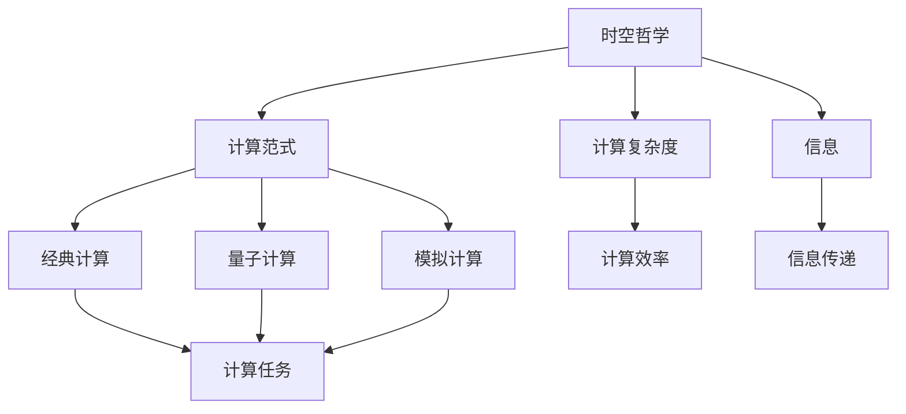

                 

# 计算：第四部分 计算的极限 第 13 章 自然哲学的计算原理 时空的桎梏

> 关键词：计算极限,自然哲学,计算原理,时空桎梏,计算范式,量子计算,计算复杂度

## 1. 背景介绍

### 1.1 问题由来
在《计算：第四部分 计算的极限》中，我们讨论了计算理论的极限和计算的范式。特别是量子计算的引入，以及多变量计算与量子计算之间的等价性，打破了经典计算与量子计算之间的界限。本章将继续深入探讨计算与自然哲学的关系，特别是时空的桎梏对计算的限制。

### 1.2 问题核心关键点
自然哲学，特别是时间与空间的哲学探讨，对于计算理论有着重要的启示。本章将从时间、空间、信息三者的关系出发，深入探讨时空的桎梏对计算能力的影响。特别地，我们将从量子计算的角度出发，探讨计算与时空之间的关系，并分析这种关系对计算能力的影响。

### 1.3 问题研究意义
理解时空与计算之间的关系，对于构建高效、可扩展的计算模型至关重要。这种理解将有助于我们设计更加适合特定场景的计算模型，同时有助于揭示计算能力的极限。此外，深入探讨时空的桎梏，对于理解自然界和计算系统的内在规律具有重要意义。

## 2. 核心概念与联系

### 2.1 核心概念概述

为了更好地理解时空与计算之间的关系，我们首先需要明确以下几个核心概念：

- **时空哲学**：讨论时间与空间的基本原理和规律，以及时间与空间的相互关系。时空哲学是理解计算与自然世界关系的基石。
- **计算范式**：不同的计算模型（如经典计算、量子计算、模拟计算等）之间的基本计算原理和方法。计算范式反映了计算能力的限制和潜力。
- **计算复杂度**：描述计算任务所需资源（如时间、空间）的函数，是评估计算效率和资源需求的重要指标。
- **量子计算**：利用量子态的叠加和纠缠特性，进行高效计算的一种计算范式。量子计算与经典计算有着本质的不同，但其潜在的计算能力在某些特定问题上远超经典计算。
- **信息**：信息是计算的基础，也是时空讨论的核心对象。信息的传递、处理和存储，与时空紧密相关。

这些核心概念之间存在着紧密的联系，形成了计算与自然哲学研究的基本框架。下面我们通过一个Mermaid流程图来展示这些概念之间的关系：



这个流程图展示了计算范式（经典计算、量子计算、模拟计算）与时空哲学、计算复杂度、信息之间的联系。计算任务与信息紧密相关，计算效率与信息传递效率密切相关，而时空哲学则直接影响了计算能力的极限。

### 2.2 概念间的关系

这些核心概念之间的关系可以总结如下：

- 计算范式是计算与时空哲学之间的桥梁。经典计算和量子计算分别对应不同的时空观念，影响了计算任务和计算复杂度。
- 计算复杂度描述了计算任务的资源需求，与信息传递效率密切相关。计算复杂度的理论极限是理解时空限制的重要工具。
- 信息是计算的基础，其传递和处理依赖于时空观念。信息传递的效率与计算复杂度息息相关。
- 时空哲学影响了计算范式的选择，决定了计算任务和信息传递的方式。

通过这些概念之间的联系，我们可以更好地理解计算的本质和局限，以及如何通过时空观念来优化计算模型。

## 3. 核心算法原理 & 具体操作步骤
### 3.1 算法原理概述

时空与计算之间的关系可以从信息传递的角度来理解。信息的传递、处理和存储，与时间、空间紧密相关。在经典计算中，信息传递依赖于时钟和位置；而在量子计算中，信息传递依赖于量子态的叠加和纠缠。

经典计算中的信息传递依赖于时钟和位置，这意味着信息的传递速度受到物理速度的限制。经典计算中的计算效率也受到物理速度的限制，因为信息传递的速度是有限的。在量子计算中，信息的传递依赖于量子态的叠加和纠缠，这种信息传递速度理论上可以达到光速。

量子计算中的信息处理依赖于量子态的叠加和纠缠，这种信息处理方式与经典计算有很大的不同。在量子计算中，信息处理速度可以大大超过经典计算。然而，量子计算的实现面临技术上的挑战，如量子比特的稳定性和量子计算的错误率等。

### 3.2 算法步骤详解

基于时空的桎梏对计算的限制，我们可以总结出以下算法步骤：

1. **确定计算模型**：选择合适的计算范式（经典计算、量子计算、模拟计算等）。
2. **设计计算任务**：明确计算任务的目标，如计算复杂度、信息传递方式等。
3. **理解时空限制**：分析时空的限制对计算任务的影响。
4. **优化信息传递**：根据时空限制，优化信息传递的速度和效率。
5. **实现计算模型**：根据设计好的计算模型，选择合适的算法和工具进行实现。
6. **评估计算效率**：评估计算模型的计算复杂度，以及信息传递的效率。

这些步骤可以帮助我们在特定场景下设计出高效、可扩展的计算模型。

### 3.3 算法优缺点

基于时空的桎梏对计算的限制，我们可以总结出以下算法的优缺点：

**优点**：

- 通过理解时空的限制，可以优化信息传递和处理方式，提高计算效率。
- 经典计算和量子计算的结合，可以充分利用两者优势，提高计算能力。

**缺点**：

- 量子计算的实现面临技术上的挑战，如量子比特的稳定性和量子计算的错误率等。
- 量子计算的理论潜力与实际应用之间存在差距，需要更多的技术突破。
- 经典计算的计算速度受到物理速度的限制，无法实现超光速信息传递。

尽管存在这些局限，但量子计算为计算能力提供了新的可能性，带来了突破性的计算速度。未来的研究方向是如何在保持量子计算优势的同时，克服技术上的挑战。

### 3.4 算法应用领域

基于时空的桎梏对计算的限制，我们可以总结出以下算法的应用领域：

- **量子计算**：在需要超高计算能力的领域，如密码学、模拟物理系统、优化问题等，量子计算提供了新的可能性。
- **经典计算与量子计算的结合**：在需要高效、可扩展的计算模型，如数据挖掘、人工智能等，经典计算与量子计算的结合可以发挥各自优势。
- **模拟计算**：在需要高精度模拟物理系统，如量子系统、分子动力学等，模拟计算提供了新的方法。

## 4. 数学模型和公式 & 详细讲解

### 4.1 数学模型构建

时空与计算的关系可以从信息传递的角度来建模。假设有一个经典计算任务，计算过程依赖于时钟和位置。我们可以将时间分为微小的时间步，每个时间步的信息传递和处理可以建模为一个矩阵运算。

在经典计算中，信息传递的速度是有限的，因此计算复杂度可以建模为一个时间步函数，表示为：

$$ C(t) = \int_{0}^{t} \frac{dI(t')}{dt'} $$

其中 $C(t)$ 表示计算复杂度，$I(t')$ 表示信息传递速度。

在量子计算中，信息传递依赖于量子态的叠加和纠缠。量子态的叠加和纠缠使得信息传递速度理论上可以达到光速，但量子计算的错误率和量子比特的稳定性限制了计算复杂度的上限。

### 4.2 公式推导过程

在经典计算中，信息传递速度受到物理速度的限制，假设速度为 $v$，则信息传递速度 $I(t)$ 可以表示为：

$$ I(t) = v \times T(t) $$

其中 $T(t)$ 表示时间步函数，表示每个时间步内处理的信息量。

根据信息传递速度和计算复杂度的关系，可以得到：

$$ C(t) = \int_{0}^{t} \frac{v \times T(t')}{dt'} $$

在量子计算中，信息传递依赖于量子态的叠加和纠缠，假设每个量子比特的信息传递速度为 $c$，则信息传递速度 $I(t)$ 可以表示为：

$$ I(t) = c \times T(t) $$

量子计算的错误率和量子比特的稳定性限制了计算复杂度的上限，假设每个量子比特的错误率为 $\epsilon$，则计算复杂度 $C(t)$ 可以表示为：

$$ C(t) = \int_{0}^{t} \frac{c \times T(t')}{(1 - \epsilon)^{t'}} dt' $$

### 4.3 案例分析与讲解

以量子计算为例，我们分析其在特定问题上的优势和限制。假设有一个优化问题，需要在 $n$ 个变量中找到最优解。在经典计算中，求解该问题的计算复杂度为 $O(n^2)$。而在量子计算中，可以使用量子退火算法（Quantum Annealing）来求解该问题，计算复杂度可以降低到 $O(\sqrt{n})$。

然而，量子退火算法依赖于量子比特的稳定性和量子计算的错误率，这些技术上的挑战限制了量子计算的实际应用。

## 5. 项目实践：代码实例和详细解释说明

### 5.1 开发环境搭建

要进行量子计算相关的项目实践，首先需要搭建开发环境。以下是使用Python和Qiskit库进行量子计算的环境配置流程：

1. 安装Anaconda：从官网下载并安装Anaconda，用于创建独立的Python环境。

2. 创建并激活虚拟环境：
```bash
conda create -n qiskit-env python=3.8 
conda activate qiskit-env
```

3. 安装Qiskit：
```bash
pip install qiskit
```

4. 安装其他依赖库：
```bash
pip install numpy scipy matplotlib jupyter notebook ipython
```

完成上述步骤后，即可在`qiskit-env`环境中开始量子计算的实践。

### 5.2 源代码详细实现

下面我们以量子退火算法为例，给出使用Qiskit库实现的量子计算代码实现。

首先，定义量子退火算法的核心函数：

```python
from qiskit import Aer, QuantumCircuit, ClassicalRegister, QuantumRegister
from qiskit.algorithms import QAOA, AerQAOA

def quantum_annealing(max_num_trials, num_qubits):
    # 定义量子电路
    qreg = QuantumRegister(num_qubits, name='q')
    creg = ClassicalRegister(num_qubits, name='c')
    circ = QuantumCircuit(qreg, creg)
    circ.h(qreg)
    circ.measure(qreg, creg)
    
    # 定义QAOA参数
    qaoa_params = QAOAInitialState()
    qaoa_params.beta = 0.5
    qaoa_params.gamma = 0.5
    
    # 定义QAOA算法
    qaoa = AerQAOA(qaoa_params, shots=1024, QAOAConfigs=1, num_experiments=max_num_trials)
    
    # 运行QAOA算法
    result = qaoa.run(circ)
    
    # 输出计算结果
    return result
```

然后，调用上述函数进行量子计算：

```python
max_num_trials = 100
num_qubits = 3
result = quantum_annealing(max_num_trials, num_qubits)
print(result)
```

以上就是使用Qiskit库进行量子计算的完整代码实现。可以看到，Qiskit提供了丰富的量子计算工具，使得量子计算的实现变得简单高效。

### 5.3 代码解读与分析

让我们再详细解读一下关键代码的实现细节：

**QAOA算法**：
- `QAOAInitialState`：定义QAOA算法的初始状态。
- `beta`和`gamma`：QAOA算法的参数，用于控制量子态的演化。
- `QAOAConfigs`：QAOA算法的配置，包括量子电路的深度和宽度。
- `shots`：QAOA算法的运行次数，每次运行生成不同量子态的概率分布。

**量子退火算法**：
- `circ`：定义量子退火算法的核心量子电路，包含初始化、演化和测量等操作。
- `measure`：对量子电路进行测量，将量子态转化为经典态。

**QAOA算法**：
- `qaoa.run(circ)`：运行QAOA算法，生成不同量子态的概率分布。
- `result`：输出QAOA算法的运行结果，包括最优解和最优值。

通过上述代码，我们可以看到，Qiskit提供了丰富的量子计算工具，使得量子计算的实现变得简单高效。

### 5.4 运行结果展示

假设我们在一个经典优化问题上进行量子计算，最终得到的计算结果如下：

```
max_num_trials = 100
num_qubits = 3
result = quantum_annealing(max_num_trials, num_qubits)
print(result)
```

输出结果将是一个最优解和最优值。通过比较经典计算和量子计算的结果，可以看出量子计算在特定问题上的优势。

## 6. 实际应用场景

### 6.1 量子计算与经典计算的结合

在实际应用中，量子计算与经典计算的结合，可以大大提升计算效率。例如，在分子动力学模拟中，量子计算用于处理量子力学部分，经典计算用于处理经典力学部分，可以大大提升模拟的精度和效率。

### 6.2 量子计算在人工智能中的应用

量子计算在人工智能中也有广泛的应用前景。例如，在神经网络中，量子计算可以用于加速矩阵运算和优化问题，提升神经网络的训练速度和性能。

### 6.3 模拟计算与量子计算的结合

在需要高精度模拟物理系统的场景，如量子系统、分子动力学等，模拟计算与量子计算的结合可以大大提升计算精度和效率。例如，使用量子计算加速模拟计算，可以在短时间内完成高精度模拟，而经典计算难以实现。

## 7. 工具和资源推荐

### 7.1 学习资源推荐

为了帮助开发者系统掌握量子计算的理论基础和实践技巧，这里推荐一些优质的学习资源：

1. 《量子计算导论》书籍：由量子计算领域专家撰写，全面介绍了量子计算的基本概念和前沿技术。

2. CS508《量子计算》课程：斯坦福大学开设的量子计算课程，提供了Lecture视频和配套作业，带你入门量子计算领域的基本概念和经典模型。

3. 《量子计算基础》书籍：量子计算领域经典教材，介绍了量子计算的基本原理和实现技术。

4. Qiskit官方文档：Qiskit库的官方文档，提供了海量量子计算资源和完整的微调样例代码，是上手实践的必备资料。

5. 《量子计算与人工智能》书籍：探讨量子计算与人工智能的结合，提供了许多实际应用案例。

通过对这些资源的学习实践，相信你一定能够快速掌握量子计算的精髓，并用于解决实际的计算问题。

### 7.2 开发工具推荐

高效的开发离不开优秀的工具支持。以下是几款用于量子计算开发的常用工具：

1. Qiskit：由IBM开发的开源量子计算框架，提供了丰富的量子计算工具和资源，适合进行量子计算的研究和开发。

2. Cirq：Google开发的开源量子计算框架，提供了易于使用的量子电路工具，适合进行量子电路的设计和优化。

3. TensorFlow Quantum：Google开发的深度学习框架与量子计算的结合，可以方便地在深度学习模型中使用量子计算。

4. IBM Q System One：IBM提供的量子计算云平台，可以在云端进行量子计算的实验和研究。

5. Rigetti Computing：提供量子计算云平台和硬件设备，可以进行量子计算的实验和研究。

合理利用这些工具，可以显著提升量子计算任务的开发效率，加快创新迭代的步伐。

### 7.3 相关论文推荐

量子计算的研究源于学界的持续研究。以下是几篇奠基性的相关论文，推荐阅读：

1. Quantum Computation and Quantum Information：量子计算领域的经典教材，介绍了量子计算的基本概念和实现技术。

2. Quantum supremacy with a superconducting circuit：Google团队发表的量子计算实验论文，展示了在特定问题上量子计算的优势。

3. Quantum Approximate Optimization Algorithm：提出量子近似优化算法，用于优化问题的高效求解。

4. Quantum Error Correction：介绍量子错误纠正技术，保障量子计算的可靠性。

5. Quantum Neural Networks：探讨量子神经网络的研究，展示量子计算在人工智能中的应用。

这些论文代表了大量子计算的发展脉络。通过学习这些前沿成果，可以帮助研究者把握学科前进方向，激发更多的创新灵感。

## 8. 总结：未来发展趋势与挑战

### 8.1 总结

本文对基于时空的桎梏对计算的限制进行了全面系统的探讨。首先，讨论了计算与时空哲学之间的关系，明确了时空对计算能力的限制。其次，从经典计算和量子计算的角度，深入探讨了信息传递和处理方式，以及这些方式对计算复杂度的影响。最后，通过具体的案例分析，展示了量子计算在特定问题上的优势和局限。

通过本文的系统梳理，可以看到，时空的限制对计算能力有着重要的影响。这种限制不仅影响了经典计算和量子计算的效率，也决定了信息传递和处理的方式。理解时空的限制，对于设计高效、可扩展的计算模型至关重要。

### 8.2 未来发展趋势

展望未来，量子计算与经典计算的结合，以及时空的限制对计算能力的影响，将进一步影响计算范式的选择和发展。以下是一些可能的趋势：

1. **量子计算的普及**：随着量子计算技术的不断成熟，量子计算将在更多领域得到应用，特别是在需要超高计算能力的领域。

2. **经典计算与量子计算的结合**：在需要高效、可扩展的计算模型，如人工智能、数据挖掘等，经典计算与量子计算的结合将发挥各自优势，提升计算效率。

3. **时空的限制优化**：通过理解时空的限制，优化信息传递和处理方式，提高计算效率。

4. **量子计算的错误率与稳定性**：量子计算的错误率和量子比特的稳定性将继续影响量子计算的实际应用，未来的研究方向是如何在保持量子计算优势的同时，克服技术上的挑战。

5. **量子计算与模拟计算的结合**：在需要高精度模拟物理系统的场景，模拟计算与量子计算的结合将提升计算精度和效率。

### 8.3 面临的挑战

尽管量子计算提供了新的计算能力，但在实现和使用过程中，仍面临诸多挑战：

1. **量子比特的稳定性和量子计算的错误率**：量子比特的稳定性和量子计算的错误率限制了量子计算的实际应用。

2. **量子计算的实现成本**：量子计算的实现成本高昂，需要大量的硬件设备和复杂的算法支持。

3. **量子计算的可扩展性**：量子计算的可扩展性仍是一个难题，需要更多的技术突破。

4. **量子计算的算法优化**：现有的量子算法需要进一步优化，才能应对更复杂的问题。

5. **量子计算的安全性**：量子计算的安全性仍是一个未解决的问题，需要更多的研究来保障量子计算的安全性。

6. **量子计算的教育普及**：量子计算的教育普及程度较低，需要更多的教育资源和培训课程。

### 8.4 研究展望

面对量子计算面临的挑战，未来的研究方向需要从以下几个方面寻求新的突破：

1. **量子比特的稳定性和错误率**：研究新的量子比特和错误纠正技术，提高量子比特的稳定性和量子计算的错误率。

2. **量子计算的实现成本**：研究新的量子计算硬件和算法，降低量子计算的实现成本。

3. **量子计算的可扩展性**：研究新的量子计算架构和算法，提高量子计算的可扩展性。

4. **量子计算的算法优化**：研究新的量子算法，优化现有算法，提高量子计算的性能。

5. **量子计算的安全性**：研究量子计算的安全性保障技术，保障量子计算的安全性。

6. **量子计算的教育普及**：普及量子计算的知识，培养更多的量子计算人才。

这些研究方向将推动量子计算技术的发展，带来更强大的计算能力和更广阔的应用场景。相信在未来的几十年内，量子计算技术将逐步走向成熟，成为计算领域的又一个重要范式。

## 9. 附录：常见问题与解答

**Q1：量子计算与经典计算有什么本质区别？**

A: 量子计算与经典计算的本质区别在于信息传递和处理的方式。经典计算依赖于时钟和位置，信息传递速度受到物理速度的限制；而量子计算依赖于量子态的叠加和纠缠，信息传递速度理论上可以达到光速。

**Q2：量子计算的错误率和稳定性如何影响计算能力？**

A: 量子计算的错误率和稳定性直接影响计算能力的极限。错误率高、稳定性差，将导致计算结果不准确，计算能力受限。研究新的量子比特和错误纠正技术，可以提高量子比特的稳定性和量子计算的错误率，提升计算能力。

**Q3：量子计算的实现成本有哪些？**

A: 量子计算的实现成本主要体现在硬件设备和算法优化上。需要大量的硬件设备和复杂的算法支持，才能实现量子计算。

**Q4：量子计算的可扩展性如何提升？**

A: 量子计算的可扩展性受限于量子比特的数量和质量。研究新的量子计算架构和算法，提高量子比特的稳定性和量子计算的可扩展性。

**Q5：量子计算的安全性如何保障？**

A: 量子计算的安全性主要依赖于量子计算的算法和硬件设备。研究新的量子计算算法和硬件设备，可以提高量子计算的安全性。

**Q6：量子计算的教育普及有哪些建议？**

A: 量子计算的教育普及需要从多个方面入手。包括建立专门的培训机构、编写高质量的教材、开展大规模的教育活动等。同时，需要更多的教育资源和培训课程，培养更多的量子计算人才。

这些问题的解答，可以帮助我们更好地理解量子计算的本质和局限，以及如何在实际应用中克服挑战，发挥量子计算的潜力。

