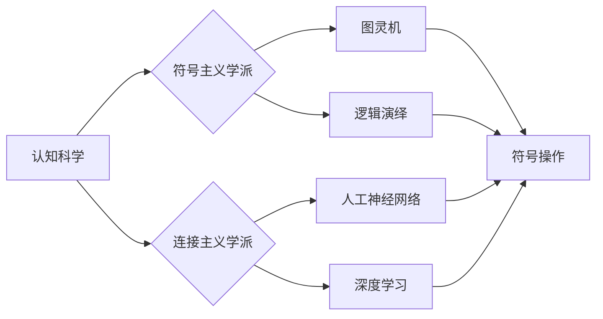

> 关键词：认知科学，人工智能，符号主义，抽象，形式化，图灵机，神经网络，可计算性，人类智能

# 认知的形式化：人工智能符号主义学派与认知“抽象”

### 1. 背景介绍

人工智能（AI）作为一门交叉学科，其研究目标之一是模拟、增强乃至扩展人类智能。自20世纪50年代以来，人工智能领域涌现出了多种研究学派，其中符号主义学派和连接主义学派是两大主要流派。符号主义学派强调符号和逻辑推理在认知过程中的作用，而连接主义学派则侧重于神经网络和大脑生物学的灵感。本文将深入探讨认知的形式化，分析符号主义学派与认知“抽象”之间的关系，并展望人工智能的未来发展趋势。

### 2. 核心概念与联系

#### 2.1 核心概念原理

**认知科学**：认知科学是研究人类认知过程的科学，它融合了心理学、神经科学、哲学、语言学等多个学科，旨在理解人类如何获取、处理和运用知识。

**符号主义学派**：符号主义学派认为，认知过程可以通过符号操作和逻辑推理来模拟，因此提出了图灵机、逻辑演绎等理论模型。

**连接主义学派**：连接主义学派认为，认知过程是通过神经网络中神经元的相互连接和激活来实现的，因此提出了人工神经网络、深度学习等模型。

**认知“抽象”**：认知“抽象”是指人类在认知过程中将复杂信息简化为基本概念和规则的能力。这种能力使得人类能够高效地处理信息，进行推理和决策。

#### 2.2 核心概念架构的 Mermaid 流程图



### 3. 核心算法原理 & 具体操作步骤

#### 3.1 算法原理概述

**符号主义学派**：

- 使用图灵机等抽象模型模拟人类的认知过程。
- 通过逻辑推理和符号操作解决复杂问题。
- 强调知识的表示和推理机制。

**连接主义学派**：

- 使用神经网络模拟大脑的结构和功能。
- 通过训练学习数据，使神经网络具备识别、分类等能力。
- 强调数据驱动和自学习。

#### 3.2 算法步骤详解

**符号主义学派**：

1. 确定问题领域，抽象出核心概念和规则。
2. 使用图灵机等模型表示问题和解法。
3. 通过逻辑推理和符号操作解决问题。

**连接主义学派**：

1. 收集大量标注数据。
2. 设计神经网络结构。
3. 使用梯度下降等优化算法训练模型。
4. 使用训练好的模型进行预测或分类。

#### 3.3 算法优缺点

**符号主义学派**：

优点：

- 理论基础扎实，易于理解。
- 可解释性强，易于调试。

缺点：

- 模型复杂度较高，难以处理复杂问题。
- 需要大量专家知识构建模型。

**连接主义学派**：

优点：

- 模型复杂度较低，易于处理复杂问题。
- 可解释性差，难以解释模型的决策过程。

缺点：

- 需要大量训练数据。
- 模型泛化能力有限。

#### 3.4 算法应用领域

**符号主义学派**：

- 理论研究、问题求解、知识表示等。

**连接主义学派**：

- 图像识别、语音识别、自然语言处理等。

### 4. 数学模型和公式 & 详细讲解 & 举例说明

#### 4.1 数学模型构建

**符号主义学派**：

- 图灵机模型：使用图灵机的状态转换函数和接受-拒绝规则来模拟认知过程。

**连接主义学派**：

- 神经网络模型：使用神经元之间的连接权重和激活函数来模拟大脑神经网络。

#### 4.2 公式推导过程

**符号主义学派**：

- 图灵机模型：使用状态转换函数 $f(q, w, b) = q' \rightarrow w \rightarrow b$ 来表示。

**连接主义学派**：

- 神经网络模型：使用神经元之间的连接权重 $w$ 和激活函数 $\sigma(x)$ 来表示。

#### 4.3 案例分析与讲解

**案例一：符号主义学派**

使用图灵机模型解决汉诺塔问题。

**案例二：连接主义学派**

使用神经网络模型进行图像分类。

### 5. 项目实践：代码实例和详细解释说明

#### 5.1 开发环境搭建

- 安装Python、NumPy、SciPy、Matplotlib等库。

#### 5.2 源代码详细实现

**案例一：符号主义学派**

```python
# 汉诺塔问题的图灵机模型实现

class TuringMachine:
    def __init__(self, states, alphabet, transitions, initial_state, accept_states):
        self.states = states
        self.alphabet = alphabet
        self.transitions = transitions
        self.initial_state = initial_state
        self.accept_states = accept_states
        self.state = initial_state
        self.tape = list(alphabet) + ['_'] * 1000  # 初始化空白带

    def step(self):
        # 执行一个步骤
        if self.state in self.transitions:
            transition = self.transitions[self.state]
            if transition[0] in self.tape:
                self.state = transition[1]
                self.tape.remove(transition[0])
                self.tape.append(transition[2])
        else:
            self.state = 'accept' if self.state in self.accept_states else 'reject'

    def run(self, steps):
        for _ in range(steps):
            self.step()

# 定义汉诺塔问题的图灵机模型
states = ['q0', 'q1', 'q2', 'q3']
alphabet = ['A', 'B', 'C', 'X']
transitions = {
    'q0': [('A', 'q1', 'B'), ('B', 'q2', 'A'), ('C', 'q3', 'C'), ('X', 'q0', '_')],
    'q1': [('A', 'q1', 'C'), ('B', 'q1', 'B'), ('C', 'q2', 'A'), ('X', 'q0', '_')],
    'q2': [('A', 'q3', 'B'), ('B', 'q3', 'A'), ('C', 'q3', 'C'), ('X', 'q0', '_')],
    'q3': [('A', 'q0', 'B'), ('B', 'q0', 'A'), ('C', 'q0', 'C'), ('X', 'q0', '_')],
}
initial_state = 'q0'
accept_states = {'q0'}

# 创建图灵机实例
tm = TuringMachine(states, alphabet, transitions, initial_state, accept_states)
tm.run(1000)

# 输出图灵机带的当前状态
print(''.join(tm.tape))
```

**案例二：连接主义学派**

```python
# 图像分类的神经网络模型实现

import numpy as np
from sklearn.datasets import load_iris
from sklearn.neural_network import MLPClassifier

# 加载数据集
iris = load_iris()
X = iris.data
y = iris.target

# 定义神经网络模型
model = MLPClassifier(hidden_layer_sizes=(50,), activation='logistic', solver='sgd', max_iter=1000)

# 训练模型
model.fit(X, y)

# 预测
X_new = np.array([[2.5, 1.9]])
y_pred = model.predict(X_new)

# 输出预测结果
print('Predicted class:', y_pred)
```

#### 5.3 代码解读与分析

**案例一：符号主义学派**

- 定义了TuringMachine类，包含状态、字母表、转换函数、初始状态和接受状态等信息。
- 实现了step方法，根据当前状态和带上的字符执行相应的转换。
- 实现了run方法，执行多个步骤，模拟图灵机的运行过程。
- 创建了汉诺塔问题的图灵机实例，并执行1000个步骤，最终输出图灵机带的当前状态。

**案例二：连接主义学派**

- 加载了iris数据集。
- 定义了MLPClassifier模型，包含50个隐藏层神经元，激活函数为logistic，优化器为sgd，最大迭代次数为1000。
- 使用iris数据集训练模型。
- 使用训练好的模型对新样本进行预测，输出预测结果。

### 6. 实际应用场景

#### 6.1 认知计算

认知计算是符号主义学派的典型应用，它试图模拟人类的认知过程，解决复杂的推理和决策问题。

#### 6.2 自然语言处理

自然语言处理是连接主义学派的典型应用，它利用神经网络模型理解和生成自然语言。

#### 6.3 计算机视觉

计算机视觉是连接主义学派的另一个重要应用，它利用神经网络模型识别和分类图像。

### 6.4 未来应用展望

随着人工智能技术的不断发展，认知的形式化将在更多领域得到应用，如机器人学、心理学、神经科学等。

### 7. 工具和资源推荐

#### 7.1 学习资源推荐

- 《认知科学导论》
- 《人工智能：一种现代的方法》
- 《深度学习》
- 《图灵机与语言理论》

#### 7.2 开发工具推荐

- Python
- NumPy
- SciPy
- TensorFlow
- PyTorch

#### 7.3 相关论文推荐

- 《图灵机与语言理论》
- 《认知计算：原理、方法与应用》
- 《深度学习》
- 《人工智能：一种现代的方法》

### 8. 总结：未来发展趋势与挑战

#### 8.1 研究成果总结

本文探讨了认知的形式化，分析了符号主义学派与认知“抽象”之间的关系，并介绍了相关算法原理和应用场景。

#### 8.2 未来发展趋势

随着人工智能技术的不断发展，认知的形式化将在更多领域得到应用，如机器人学、心理学、神经科学等。

#### 8.3 面临的挑战

认知的形式化面临着以下挑战：

- 如何更准确地模拟人类的认知过程。
- 如何提高模型的解释性和可解释性。
- 如何解决模型的过拟合问题。

#### 8.4 研究展望

未来，认知的形式化将在以下方面取得突破：

- 开发更加准确的认知模型。
- 提高模型的解释性和可解释性。
- 解决模型的过拟合问题。
- 将认知的形式化应用于更多领域。

### 9. 附录：常见问题与解答

**Q1：什么是认知的形式化？**

A：认知的形式化是指将认知过程用数学和符号语言进行描述和建模的过程。

**Q2：符号主义学派和连接主义学派的主要区别是什么？**

A：符号主义学派强调符号操作和逻辑推理在认知过程中的作用，而连接主义学派侧重于神经网络和大脑生物学的灵感。

**Q3：认知的形式化有哪些应用领域？**

A：认知的形式化在认知计算、自然语言处理、计算机视觉等领域有广泛的应用。

**Q4：未来认知的形式化有哪些发展趋势？**

A：未来认知的形式化将在以下方面取得突破：开发更加准确的认知模型，提高模型的解释性和可解释性，解决模型的过拟合问题，将认知的形式化应用于更多领域。

作者：禅与计算机程序设计艺术 / Zen and the Art of Computer Programming