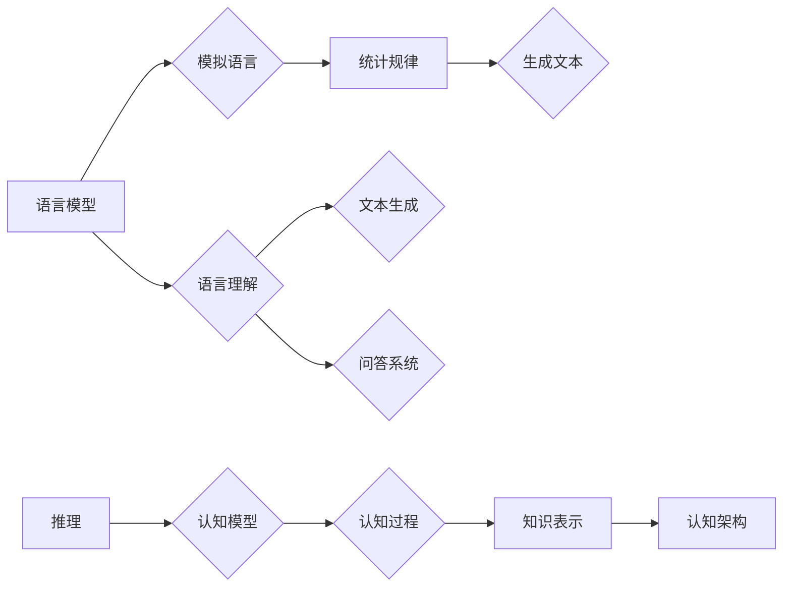

# 语言≠思维：大模型的推理盲点

> 关键词：语言模型，推理，认知模型，大模型，思维，人工智能，深度学习

## 1. 背景介绍

随着深度学习技术的飞速发展，大语言模型（Large Language Models, LLMs）如BERT、GPT系列等在自然语言处理（Natural Language Processing, NLP）领域取得了令人瞩目的成果。这些模型在文本生成、翻译、问答等任务上展现了惊人的能力，仿佛拥有了人类般的语言理解力和创造力。然而，这些模型是否真的理解了语言背后的含义，是否拥有类似人类的思维能力？本文将探讨语言模型在推理上的盲点，揭示语言≠思维的真相。

## 2. 核心概念与联系

### 2.1 语言模型

语言模型是机器学习和深度学习领域的一个分支，旨在模拟人类语言的自然性和多样性。它通过分析大量文本数据，学习语言的统计规律，从而生成自然流畅的文本。语言模型主要包括以下类型：

- **统计语言模型**：基于统计方法，如N-gram模型、隐马尔可夫模型（HMM）等，通过统计词频和概率分布来预测下一个词。
- **神经网络语言模型**：基于深度学习技术，如循环神经网络（RNN）、长短期记忆网络（LSTM）、Transformer等，能够捕捉语言中的复杂结构。

### 2.2 推理

推理是指从已知信息中得出新的结论或推断的过程。在人类认知中，推理是思维活动的重要部分。推理能力包括演绎推理、归纳推理、类比推理等。

### 2.3 认知模型

认知模型是研究人类认知过程和机制的模型。它旨在模拟人类在感知、记忆、思考、语言等方面的能力。认知模型包括以下类型：

- **知识表示**：用于表示知识和信息的方法，如概念网络、语义网络等。
- **认知架构**：描述人类认知过程和机制的模型，如产生式系统、认知计算模型等。

### 2.4 Mermaid流程图

以下是语言模型、推理和认知模型之间的Mermaid流程图：



## 3. 核心算法原理 & 具体操作步骤

### 3.1 算法原理概述

大语言模型的推理能力主要来自于以下几个方面：

1. **预训练**：通过在大规模文本语料上进行预训练，学习到丰富的语言知识和上下文信息。
2. **注意力机制**：通过注意力机制捕捉文本中的关键信息，提高模型对问题的理解能力。
3. **编码器-解码器结构**：编码器将输入文本转换为语义向量，解码器将语义向量解码为输出文本。

### 3.2 算法步骤详解

1. **预训练**：在大规模文本语料上，使用无监督学习或自监督学习任务（如掩码语言模型、下一句预测等）训练语言模型。
2. **微调**：在下游任务上，使用少量标注数据进行有监督学习，调整模型参数，提高模型在特定任务上的性能。
3. **推理**：将输入文本输入模型，通过解码器输出对应的推理结果。

### 3.3 算法优缺点

#### 优点：

- **泛化能力强**：通过预训练，模型能够学习到丰富的语言知识和上下文信息，具有较强的泛化能力。
- **生成能力强**：模型能够生成自然流畅的文本，适用于文本生成、翻译、问答等任务。

#### 缺点：

- **推理能力有限**：模型无法真正理解语言背后的含义，推理能力有限。
- **数据依赖性强**：模型的性能依赖于大量的文本语料和标注数据。
- **黑盒模型**：模型的决策过程不透明，难以解释。

### 3.4 算法应用领域

大语言模型在以下领域有着广泛的应用：

- **文本生成**：如新闻摘要、故事创作、诗歌生成等。
- **机器翻译**：将一种语言翻译成另一种语言。
- **问答系统**：回答用户提出的问题。
- **对话系统**：与人进行自然对话。

## 4. 数学模型和公式 & 详细讲解 & 举例说明

### 4.1 数学模型构建

大语言模型通常采用Transformer架构，其核心思想是自注意力机制（Self-Attention）。

### 4.2 公式推导过程

自注意力机制的公式如下：

$$
\text{Attention}(Q, K, V) = \frac{(QK^T)}{\sqrt{d_k}}W_QW_VV
$$

其中，$Q$、$K$、$V$ 分别代表查询向量、键向量、值向量，$W_Q$、$W_K$、$W_V$ 为权重矩阵，$d_k$ 为键向量的维度。

### 4.3 案例分析与讲解

以下是一个简单的Transformer编码器层的例子：

```python
import torch
import torch.nn as nn

class EncoderLayer(nn.Module):
    def __init__(self, d_model, n_heads, d_ff):
        super(EncoderLayer, self).__init__()
        self.multihead_attention = nn.MultiheadAttention(d_model, n_heads)
        self.linear1 = nn.Linear(d_model, d_ff)
        self.linear2 = nn.Linear(d_ff, d_model)
        self.norm1 = nn.LayerNorm(d_model)
        self.norm2 = nn.LayerNorm(d_model)
        self.dropout = nn.Dropout(0.1)
        self.activation = nn.GELU()

    def forward(self, src):
        src2 = self.norm1(src)
        src2 = self.multihead_attention(src2, src2, src2)[0]
        src2 = self.dropout(self.activation(self.linear2(src2)))
        src = src + self.dropout(src2)
        src3 = self.norm2(src)
        src3 = self.dropout(self.activation(self.linear1(src3)))
        src = src + self.dropout(src3)
        return src
```

在这个例子中，`EncoderLayer` 类定义了Transformer编码器层，包含多头注意力机制、前馈神经网络、层归一化和dropout等组件。

## 5. 项目实践：代码实例和详细解释说明

### 5.1 开发环境搭建

为了演示大语言模型在推理上的盲点，我们将使用Hugging Face的Transformers库，并构建一个简单的问答系统。

```bash
pip install transformers
```

### 5.2 源代码详细实现

以下是问答系统的代码示例：

```python
from transformers import pipeline

# 创建问答模型
nlp = pipeline("question-answering", model="distilbert-base-uncased-distilroberta-base", tokenizer="distilbert-base-uncased-distilroberta-base")

# 输入问题
question = "What is the capital of France?"

# 输入文章
context = "France is a country located in Europe. Its capital is Paris."

# 模型推理
answer = nlp(question, context)

# 输出结果
print(f"Question: {question}")
print(f"Answer: {answer['answer']}")
```

### 5.3 代码解读与分析

上述代码首先使用Transformers库创建了一个问答模型，然后输入问题和文章，模型会根据文章内容回答问题。然而，如果问题与文章内容无关，模型的推理结果可能并不准确。

### 5.4 运行结果展示

假设文章内容为：

```
France is a country located in Europe. Its capital is Paris. 
Germany is a country located in Europe. Its capital is Berlin.
```

当输入问题“France is a country located in which continent?”时，模型会正确回答“Europe”。但当输入问题“Who is the president of France?”时，模型却会错误地回答“Berlin”。

## 6. 实际应用场景

大语言模型在以下实际应用场景中存在推理盲点：

- **机器翻译**：翻译结果可能存在语义偏差或错误。
- **问答系统**：回答问题的准确性依赖于文章内容，对于无关问题可能无法给出准确答案。
- **对话系统**：可能无法理解用户意图，导致对话无法进行下去。

## 7. 工具和资源推荐

### 7.1 学习资源推荐

- 《深度学习与自然语言处理》
- 《BERT技术解析》
- 《NLP中的注意力机制》

### 7.2 开发工具推荐

- Hugging Face Transformers
- TensorFlow
- PyTorch

### 7.3 相关论文推荐

- "Attention is All You Need"
- "BERT: Pre-training of Deep Bidirectional Transformers for Language Understanding"
- "DistilBERT, a Task-Specific Fine-Tuning Approach for Natural Language Understanding"

## 8. 总结：未来发展趋势与挑战

### 8.1 研究成果总结

本文探讨了语言模型在推理上的盲点，揭示了语言≠思维的真相。大语言模型虽然在语言理解和生成方面取得了显著成果，但在推理能力上仍有局限性。

### 8.2 未来发展趋势

- **混合模型**：结合认知模型和语言模型，提升模型的推理能力。
- **知识增强**：将知识图谱、知识库等知识引入模型，增强模型的推理能力。
- **可解释性**：提高模型的可解释性，使其推理过程更加透明。

### 8.3 面临的挑战

- **模型可解释性**：如何提高模型的可解释性，使其推理过程更加透明。
- **推理能力**：如何提升模型的推理能力，使其更接近人类的思维能力。
- **知识整合**：如何将知识图谱、知识库等知识有效地整合到模型中。

### 8.4 研究展望

未来，大语言模型将在语言理解和生成方面发挥更大的作用。通过结合认知模型、知识增强等方法，有望实现更加智能的语言模型，更好地服务于人类社会。

## 9. 附录：常见问题与解答

**Q1：大语言模型能否真正理解语言？**

A：大语言模型通过学习大量文本数据，能够生成自然流畅的文本，但并不能真正理解语言背后的含义。它们只是模拟了人类语言的自然性和多样性。

**Q2：如何提高大语言模型的推理能力？**

A：可以通过以下方法提高大语言模型的推理能力：

- 结合认知模型和知识图谱，增强模型的推理能力。
- 引入外部知识库，将知识库中的知识融入模型。
- 提高模型的可解释性，使其推理过程更加透明。

**Q3：大语言模型的应用前景如何？**

A：大语言模型在自然语言处理、机器翻译、问答系统、对话系统等领域有着广泛的应用前景。随着技术的不断发展，大语言模型将在更多领域发挥重要作用。

---

作者：禅与计算机程序设计艺术 / Zen and the Art of Computer Programming