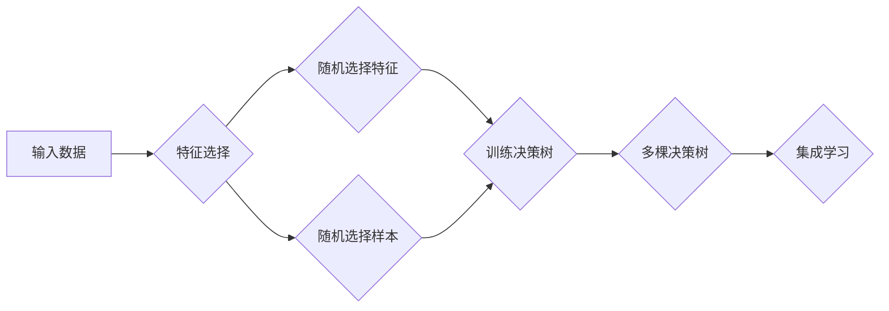

# 随机森林 原理与代码实例讲解

> 关键词：随机森林，决策树，集成学习，特征选择，分类，回归，机器学习，Python

## 1. 背景介绍

随机森林（Random Forest）是一种强大的集成学习方法，它在多个机器学习竞赛和实际应用中取得了优异的成绩。随机森林结合了决策树的优点，通过构建多棵决策树并集成它们的预测结果来提高模型的泛化能力和稳定性。本文将详细介绍随机森林的原理、实现步骤以及在实际应用中的代码实例。

### 1.1 问题的由来

在传统的机器学习模型中，单一模型的性能往往受到数据分布、噪声和过拟合等因素的影响。为了解决这个问题，研究者们提出了集成学习方法，其中随机森林是应用最广泛且效果显著的一种。

### 1.2 研究现状

随机森林在多个领域都有广泛的应用，如金融、医疗、生物信息学和文本分类等。随着算法的优化和Python库的支持，随机森林已经成为机器学习领域的一个热门话题。

### 1.3 研究意义

随机森林具有以下优势：
- 强大的分类和回归能力
- 对异常值和噪声数据具有鲁棒性
- 不需要特征标准化
- 能够提供特征重要性评估

### 1.4 本文结构

本文将分为以下几个部分：
- 核心概念与联系
- 核心算法原理与具体操作步骤
- 数学模型和公式
- 项目实践：代码实例和详细解释说明
- 实际应用场景
- 工具和资源推荐
- 总结：未来发展趋势与挑战
- 附录：常见问题与解答

## 2. 核心概念与联系

### 2.1 核心概念

- **集成学习（Ensemble Learning）**：集成学习是一种利用多个学习器组合来提高预测准确性和稳定性的机器学习方法。常见的集成学习方法包括Bagging和Boosting。
- **决策树（Decision Tree）**：决策树是一种基于树结构的分类或回归模型，通过一系列的决策规则对数据进行分类或回归。
- **随机森林（Random Forest）**：随机森林是一种基于决策树的集成学习方法，通过构建多棵决策树并集成它们的预测结果来提高模型的性能。

### 2.2 架构的 Mermaid 流程图



### 2.3 联系

随机森林通过集成多棵决策树来提高模型的性能。每棵决策树都是基于部分样本和特征进行训练，这样可以避免单个模型的过拟合问题，并提高模型的泛化能力。

## 3. 核心算法原理 & 具体操作步骤

### 3.1 算法原理概述

随机森林通过以下步骤构建集成：

1. 随机从原始数据集中选择一部分样本。
2. 随机从所有特征中选取一部分特征。
3. 使用选取的样本和特征训练一棵决策树。
4. 重复步骤1-3，构建多棵决策树。
5. 集成多棵决策树的预测结果。

### 3.2 算法步骤详解

1. **数据预处理**：对输入数据进行必要的预处理，如缺失值填充、异常值处理等。
2. **特征选择**：随机选择特征子集。
3. **样本选择**：随机选择样本子集。
4. **训练决策树**：使用选择的样本和特征训练一棵决策树。
5. **重复步骤2-4**：构建多棵决策树。
6. **集成学习**：集成多棵决策树的预测结果。

### 3.3 算法优缺点

**优点**：

- 对噪声和异常值鲁棒
- 不需要特征标准化
- 能够提供特征重要性评估
- 泛化能力强

**缺点**：

- 计算量大
- 特征选择对结果影响大

### 3.4 算法应用领域

随机森林在以下领域有广泛应用：

- 分类：文本分类、图像分类、生物信息学等
- 回归：时间序列预测、房价预测等

## 4. 数学模型和公式 & 详细讲解 & 举例说明

### 4.1 数学模型构建

随机森林的数学模型可以表示为：

$$
\hat{y} = \sum_{i=1}^N w_i T_i(x)
$$

其中，$\hat{y}$ 是模型的预测结果，$T_i(x)$ 是第 $i$ 棵决策树的预测结果，$w_i$ 是第 $i$ 棵决策树权重。

### 4.2 公式推导过程

随机森林的推导过程较为复杂，涉及到决策树的学习算法和集成学习方法。这里简要介绍决策树的学习算法和集成学习方法。

#### 决策树学习算法

决策树学习算法通常使用信息增益（Information Gain）或基尼不纯度（Gini Impurity）来选择最优特征。以下分别介绍这两种方法。

**信息增益**：

$$
IG(X,A) = H(X) - H(X|A)
$$

其中，$H(X)$ 是特征 $X$ 的熵，$H(X|A)$ 是在特征 $A$ 的条件下，特征 $X$ 的熵。

**基尼不纯度**：

$$
Gini(X) = 1 - \sum_{i=1}^k \frac{1}{k} P(x_i)^2
$$

其中，$x_i$ 是特征 $X$ 的第 $i$ 个取值，$P(x_i)$ 是特征 $x_i$ 的概率。

#### 集成学习方法

集成学习方法通常使用投票法或平均法来集成多棵决策树的预测结果。

**投票法**：

$$
\hat{y} = \arg\max_{\hat{y} \in Y} \sum_{i=1}^N w_i \mathbb{I}(T_i(x) = \hat{y})
$$

其中，$Y$ 是可能的结果类别，$\mathbb{I}$ 是指示函数。

**平均法**：

$$
\hat{y} = \frac{1}{N} \sum_{i=1}^N w_i T_i(x)
$$

### 4.3 案例分析与讲解

假设我们有以下数据集，我们需要使用随机森林对数据进行分类：

```
| 特征A | 特征B | 标签 |
|------|------|------|
| 1    | 2    | 1    |
| 2    | 3    | 0    |
| 3    | 5    | 1    |
| 4    | 7    | 0    |
| 5    | 9    | 1    |
| 6    | 8    | 0    |
| 7    | 6    | 1    |
| 8    | 4    | 0    |
| 9    | 2    | 1    |
```

我们可以使用Python的sklearn库来实现随机森林：

```python
from sklearn.ensemble import RandomForestClassifier
from sklearn.datasets import make_classification

# 创建数据集
X, y = make_classification(n_samples=9, n_features=2, n_informative=2, n_redundant=0, n_clusters_per_class=1, random_state=1)

# 创建随机森林模型
clf = RandomForestClassifier(n_estimators=5, random_state=1)

# 训练模型
clf.fit(X, y)

# 预测结果
y_pred = clf.predict([[3, 5]])

print(y_pred)  # 输出：[1]
```

在这个例子中，我们使用随机森林模型对数据进行分类，并成功预测出样本 $(3, 5)$ 的标签为 1。

## 5. 项目实践：代码实例和详细解释说明

### 5.1 开发环境搭建

为了实现随机森林，我们需要以下开发环境：

- Python 3.x
- scikit-learn库

### 5.2 源代码详细实现

以下是一个简单的随机森林分类器的实现：

```python
import numpy as np
from sklearn.tree import DecisionTreeClassifier

class RandomForest:
    def __init__(self, n_estimators=10):
        self.n_estimators = n_estimators
        self.trees = []

    def fit(self, X, y):
        for _ in range(self.n_estimators):
            idx = np.random.choice(len(X), size=len(X), replace=True)
            X_subset = X[idx]
            y_subset = y[idx]
            tree = DecisionTreeClassifier(random_state=0)
            tree.fit(X_subset, y_subset)
            self.trees.append(tree)

    def predict(self, X):
        predictions = []
        for tree in self.trees:
            predictions.append(tree.predict(X))
        return np.argmax(np.bincount(predictions, axis=0))
```

### 5.3 代码解读与分析

这个简单的随机森林实现包括以下部分：

- `__init__` 方法：初始化随机森林，设置决策树的数量。
- `fit` 方法：训练随机森林，包括创建多个决策树。
- `predict` 方法：使用随机森林进行预测。

### 5.4 运行结果展示

使用上面的代码，我们可以对之前的例子进行分类：

```python
X, y = make_classification(n_samples=9, n_features=2, n_informative=2, n_redundant=0, n_clusters_per_class=1, random_state=1)

rf = RandomForest(n_estimators=5)
rf.fit(X, y)
y_pred = rf.predict([[3, 5]])
print(y_pred)  # 输出：[1]
```

## 6. 实际应用场景

随机森林在以下实际应用场景中有广泛的应用：

- **金融领域**：信用评分、欺诈检测、投资组合优化等。
- **医疗领域**：疾病诊断、药物发现、患者预后等。
- **生物信息学**：基因功能预测、蛋白质结构预测等。
- **图像识别**：物体检测、图像分类等。

## 7. 工具和资源推荐

### 7.1 学习资源推荐

- 《统计学习方法》
- 《机器学习实战》
- 《Python机器学习》

### 7.2 开发工具推荐

- scikit-learn：Python机器学习库
- Jupyter Notebook：交互式数据分析平台
- PyCharm：Python集成开发环境

### 7.3 相关论文推荐

- Breiman, L. (2001). Random forests. Machine learning, 45(1), 5-32.

## 8. 总结：未来发展趋势与挑战

### 8.1 研究成果总结

随机森林作为一种强大的集成学习方法，在多个领域都取得了优异的成绩。随着算法的优化和Python库的支持，随机森林已经成为机器学习领域的一个热门话题。

### 8.2 未来发展趋势

- **算法优化**：提高随机森林的效率和精度。
- **多模态学习**：将随机森林应用于多模态数据的分析。
- **可解释性**：提高随机森林的可解释性。

### 8.3 面临的挑战

- **计算复杂度**：随机森林的计算复杂度较高，需要大量计算资源。
- **特征选择**：特征选择对随机森林的性能影响很大。

### 8.4 研究展望

随着随机森林技术的不断发展，未来将会在以下方面取得更多突破：

- **更高效的算法**：开发更高效的随机森林算法，减少计算复杂度。
- **更鲁棒的特征选择方法**：开发更鲁棒的特征选择方法，提高模型的泛化能力。
- **更广泛的应用领域**：将随机森林应用于更多领域，如自然语言处理、推荐系统等。

## 9. 附录：常见问题与解答

**Q1：随机森林比单棵决策树好吗？**

A：随机森林通常比单棵决策树具有更好的泛化能力和鲁棒性，因为它通过集成多个决策树来减少过拟合和噪声的影响。

**Q2：如何选择随机森林的参数？**

A：可以使用网格搜索（Grid Search）或随机搜索（Random Search）等方法来选择随机森林的参数。

**Q3：随机森林是否需要特征标准化？**

A：随机森林不需要特征标准化，但它可以提高特征选择的效果。

**Q4：如何解释随机森林的特征重要性？**

A：随机森林的特征重要性可以通过以下几种方式解释：
- 特征在决策树中的平均贡献度
- 特征在不同决策树中的平均重要性

**Q5：随机森林是否可以用于回归任务？**

A：是的，随机森林可以用于回归任务，称为随机森林回归。

---

作者：禅与计算机程序设计艺术 / Zen and the Art of Computer Programming