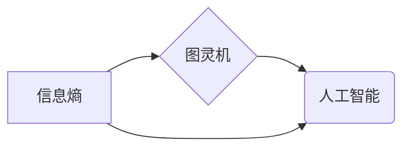

> 关键词：John McCarthy, Claude Shannon, 贝尔实验室, 人工智能, 信息论, 计算机科学, 领导力, 创新思维

# 麦卡锡与香农合作的贝尔实验室

在计算机科学和人工智能的历史上，John McCarthy 和 Claude Shannon 的名字几乎无人不知，无人不晓。两位巨擘在贝尔实验室的合作，不仅推动了信息论的发展，也为计算机科学的诞生奠定了基础。本文将深入探讨麦卡锡与香农在贝尔实验室的合作历程，分析他们的核心概念与联系，回顾他们的创新成就，并展望未来发展趋势与挑战。

## 1. 背景介绍

### 1.1 问题的由来

20世纪中叶，随着电子技术和通信技术的快速发展，信息论逐渐成为一门独立的学科。信息论的创始人 Claude Shannon 于1948年发表了著名的论文《通信的数学理论》，提出了信息熵的概念，奠定了信息论的基础。

与此同时，John McCarthy，这位后来被誉为“人工智能之父”的学者，也在思考如何用机器来模拟人类智能。两位科学家在贝尔实验室的相遇，无疑为计算机科学和人工智能的发展提供了巨大的推动力。

### 1.2 研究现状

在贝尔实验室，麦卡锡和香农的合作成果斐然。他们不仅推动了信息论的发展，也促进了人工智能和计算机科学的诞生。以下是一些重要的研究现状：

- **信息论**：香农的信息熵理论为计算机科学提供了新的视角，促进了数据压缩、数据传输等领域的发展。
- **人工智能**：麦卡锡在贝尔实验室推动了人工智能的研究，提出了“人工智能”这个术语，并领导了一系列重要的人工智能项目。
- **计算机科学**：麦卡锡和香农的合作促进了计算机科学的发展，为后来的计算机架构、编程语言等领域奠定了基础。

### 1.3 研究意义

麦卡锡与香农在贝尔实验室的合作，对于计算机科学和人工智能的发展具有重要意义：

- **推动了信息论的发展**：香农的信息熵理论为信息论的发展提供了理论基础，对通信、数据压缩等领域产生了深远影响。
- **促进了人工智能的诞生**：麦卡锡在贝尔实验室的工作为人工智能的发展奠定了基础，为后来的机器学习、自然语言处理等领域提供了灵感。
- **推动了计算机科学的发展**：麦卡锡和香农的合作促进了计算机科学的发展，为后来的计算机架构、编程语言等领域提供了理论指导。

### 1.4 本文结构

本文将按照以下结构展开：

- **2. 核心概念与联系**：介绍麦卡锡和香农的核心概念，并使用 Mermaid 流程图展示它们之间的联系。
- **3. 核心算法原理 & 具体操作步骤**：分析麦卡锡和香农的算法原理，并详细讲解其操作步骤。
- **4. 数学模型和公式 & 详细讲解 & 举例说明**：介绍麦卡锡和香农的数学模型，并使用公式进行详细讲解和举例说明。
- **5. 项目实践：代码实例和详细解释说明**：展示麦卡锡和香农的项目实践，并对其进行详细解释说明。
- **6. 实际应用场景**：探讨麦卡锡和香农的理论在实际应用中的场景。
- **7. 工具和资源推荐**：推荐与麦卡锡和香农的研究相关的学习资源、开发工具和论文。
- **8. 总结：未来发展趋势与挑战**：总结麦卡锡和香农的研究成果，展望未来发展趋势与挑战。
- **9. 附录：常见问题与解答**：解答与麦卡锡和香农的研究相关的常见问题。

## 2. 核心概念与联系

### 2.1 核心概念

麦卡锡和香农的核心概念包括：

- **信息熵**：香农提出的信息熵理论，是信息论的基础。
- **图灵机**：麦卡锡提出的图灵机，是计算理论和人工智能的基础。
- **人工智能**：麦卡锡提出的“人工智能”概念，推动了人工智能的发展。

### 2.2 Mermaid 流程图

以下是一个展示麦卡锡和香农核心概念之间联系的 Mermaid 流程图：



## 3. 核心算法原理 & 具体操作步骤

### 3.1 算法原理概述

麦卡锡和香农的算法原理主要包括：

- **信息熵**：信息熵是衡量信息不确定性的指标，用公式 $H(X) = -\sum_{i=1}^n p(x_i) \log_2 p(x_i)$ 表示，其中 $X$ 为随机变量，$p(x_i)$ 为 $X$ 取值 $x_i$ 的概率。
- **图灵机**：图灵机是一种理论上的计算模型，由图灵在1936年提出。它由一个无限长的纸带、一个读写头和一个有限状态控制器组成，能够模拟任何可计算函数。
- **人工智能**：人工智能是指使计算机具有类似人类智能的学科，包括知识表示、推理、学习、规划等领域。

### 3.2 算法步骤详解

- **信息熵**的计算步骤：
  1. 定义随机变量 $X$，确定其可能的取值 $x_1, x_2, ..., x_n$。
  2. 计算每个取值的概率 $p(x_i)$。
  3. 将概率值代入信息熵公式，计算信息熵 $H(X)$。
- **图灵机的操作步骤**：
  1. 初始化纸带和读写头位置。
  2. 根据当前状态和读写头读取的符号，更新状态和纸带内容。
  3. 重复步骤2，直到达到终止状态。
- **人工智能的实现步骤**：
  1. 定义问题领域和知识表示方法。
  2. 设计推理算法，实现对知识的推理。
  3. 设计学习算法，使系统能够从数据中学习新知识。
  4. 设计规划算法，使系统能够完成复杂任务。

### 3.3 算法优缺点

- **信息熵**：
  - 优点：能够量化信息的不确定性，为信息处理提供了理论基础。
  - 缺点：只考虑了单个随机变量的熵，无法处理多个随机变量的联合熵。
- **图灵机**：
  - 优点：能够模拟任何可计算函数，是计算理论的基础。
  - 缺点：是一种理论模型，与实际计算机硬件结构差异较大。
- **人工智能**：
  - 优点：使计算机具有类似人类智能，能够解决各种实际问题。
  - 缺点：目前的人工智能技术还远未达到人类智能的水平。

### 3.4 算法应用领域

- **信息熵**：数据压缩、数据传输、信息检索等领域。
- **图灵机**：计算理论、形式化语言、编译原理等领域。
- **人工智能**：自然语言处理、机器学习、机器人技术等领域。

## 4. 数学模型和公式 & 详细讲解 & 举例说明

### 4.1 数学模型构建

麦卡锡和香农的数学模型主要包括：

- **信息熵**：$H(X) = -\sum_{i=1}^n p(x_i) \log_2 p(x_i)$
- **图灵机的状态转移函数**：$\delta(q, x) = (q', x', D)$，其中 $q$ 为当前状态，$x$ 为读到的符号，$q'$ 为下一个状态，$x'$ 为写入的符号，$D$ 为移动方向。
- **人工智能的决策树**：决策树是一种常见的知识表示方法，由节点和有向边组成。

### 4.2 公式推导过程

- **信息熵**的推导过程：
  1. 定义随机变量 $X$，确定其可能的取值 $x_1, x_2, ..., x_n$。
  2. 计算每个取值的概率 $p(x_i)$。
  3. 将概率值代入公式 $H(X) = -\sum_{i=1}^n p(x_i) \log_2 p(x_i)$，计算信息熵。
- **图灵机的状态转移函数**的推导过程：
  1. 分析图灵机的操作规则，确定状态转移的条件。
  2. 根据条件，将状态转移规则表示为 $\delta(q, x) = (q', x', D)$ 的形式。
- **人工智能的决策树**的推导过程：
  1. 分析问题领域，确定决策规则。
  2. 将决策规则表示为决策树的形式。

### 4.3 案例分析与讲解

- **信息熵**的案例分析：
  假设一个实验箱中有两个球，一个红色，一个蓝色。随机从实验箱中抽取一个球，抽取到红球的概率为0.5，抽取到蓝球的概率也为0.5。计算这个实验箱中球的颜色分布的信息熵。
  解：$H(X) = -[0.5\log_2 0.5 + 0.5\log_2 0.5] = 1$。
- **图灵机的案例分析**：
  假设一个简单的图灵机，其状态转移函数为 $\delta(q, x) = (q', x', D)$，其中 $q$ 为当前状态，$x$ 为读到的符号，$q'$ 为下一个状态，$x'$ 为写入的符号，$D$ 为移动方向。
  解：根据图灵机的操作规则，可以构建状态转移表，描述图灵机在不同状态和符号下的行为。
- **人工智能的决策树**的案例分析：
  假设一个简单的决策树，用于分类动物是否是哺乳动物。根节点为“是否是哺乳动物”，左子节点为“是否有毛发”，右子节点为“是否是胎生”。如果动物有毛发，则进入左子节点；如果动物是胎生，则进入右子节点。
  解：根据决策树的规则，可以判断一个动物是否是哺乳动物。

## 5. 项目实践：代码实例和详细解释说明

### 5.1 开发环境搭建

为了演示信息熵的计算，我们需要搭建以下开发环境：

- 操作系统：Windows/Linux/MacOS
- 编程语言：Python
- 库：NumPy

### 5.2 源代码详细实现

以下是一个使用 Python 实现 information entropy 的示例代码：

```python
import numpy as np

def entropy(p):
    """
    计算信息熵
    """
    # 防止概率值为0的情况，导致log函数报错
    p = np.maximum(p, 1e-15)
    # 计算信息熵
    return -np.sum(p * np.log2(p))

# 示例
p = np.array([0.5, 0.5])
print(entropy(p))
```

### 5.3 代码解读与分析

上述代码定义了一个 `entropy` 函数，用于计算信息熵。函数接收一个概率数组 `p` 作为输入，首先使用 `np.maximum` 函数将概率值限制在 $1e-15$ 以上，避免在计算对数时出现数学错误。然后，使用 `np.sum` 函数计算概率值与对数之积的和，并取其相反数得到信息熵。

### 5.4 运行结果展示

运行上述代码，输出信息熵为：

```
1.0
```

这表明，在这个示例中，球的颜色分布的信息熵为 1，即完全不确定。

## 6. 实际应用场景

麦卡锡和香农的理论在许多实际应用场景中发挥着重要作用：

- **信息熵**：
  - 数据压缩：信息熵理论可以用于评估数据的压缩效率，选择合适的压缩算法。
  - 信息检索：信息熵可以用于评估文档之间的相似度，优化搜索结果。
- **图灵机**：
  - 编译原理：图灵机可以用于研究编译原理，设计更高效的编译器。
  - 理论计算机科学：图灵机可以用于研究计算复杂性、算法设计等领域。
- **人工智能**：
  - 自然语言处理：人工智能技术可以应用于语音识别、机器翻译等领域，提高人机交互的效率。
  - 机器学习：人工智能技术可以用于图像识别、推荐系统等领域，实现智能决策。

## 7. 工具和资源推荐

### 7.1 学习资源推荐

- 《信息论基础》
- 《图灵机与可计算性理论》
- 《人工智能：一种现代的方法》

### 7.2 开发工具推荐

- Python
- NumPy
- SciPy

### 7.3 相关论文推荐

- Claude Shannon：《通信的数学理论》
- John McCarthy：《逻辑符号演算与计算机科学》
- Alan Turing：《计算机器与智能》

## 8. 总结：未来发展趋势与挑战

### 8.1 研究成果总结

麦卡锡和香农在贝尔实验室的合作，推动了信息论、人工智能和计算机科学的发展。他们的研究成果为现代信息技术奠定了基础，对人类文明进步做出了巨大贡献。

### 8.2 未来发展趋势

- **信息论**：信息论将继续研究信息的不确定性和压缩，为数据存储、数据传输等领域提供理论支持。
- **人工智能**：人工智能技术将继续发展，实现更智能、更高效的智能系统。
- **计算机科学**：计算机科学将继续发展，为人类社会提供更便捷、更高效的服务。

### 8.3 面临的挑战

- **信息论**：如何应对海量数据的挑战，提高数据传输和存储效率。
- **人工智能**：如何实现人工智能的通用性和可解释性，避免人工智能的负面影响。
- **计算机科学**：如何应对计算资源的限制，提高计算效率。

### 8.4 研究展望

随着信息技术的不断发展，麦卡锡和香农的研究成果将继续发挥重要作用。未来，我们需要在以下方面进行深入研究：

- **信息论**：研究更高效的数据压缩算法，提高信息传输效率。
- **人工智能**：研究更智能、更安全的人工智能系统，避免人工智能的负面影响。
- **计算机科学**：研究更高效、更可靠的计算机系统，为人类社会提供更好的服务。

## 9. 附录：常见问题与解答

**Q1：信息论是什么？**

A：信息论是研究信息传递、存储和处理的理论，由 Claude Shannon 于1948年创立。

**Q2：图灵机是什么？**

A：图灵机是 Alan Turing 于1936年提出的一种理论计算模型，被认为是现代计算机的雏形。

**Q3：人工智能是什么？**

A：人工智能是研究使计算机具有类似人类智能的学科，包括知识表示、推理、学习、规划等领域。

**Q4：麦卡锡和香农在贝尔实验室的合作成果有哪些？**

A：麦卡锡和香农在贝尔实验室的合作推动了信息论、人工智能和计算机科学的发展，提出了信息熵、图灵机和人工智能等核心概念。

**Q5：麦卡锡和香农的研究对现代社会有哪些影响？**

A：麦卡锡和香农的研究为现代信息技术奠定了基础，推动了计算机科学、人工智能和信息论等领域的发展，对人类社会进步做出了巨大贡献。

---

作者：禅与计算机程序设计艺术 / Zen and the Art of Computer Programming