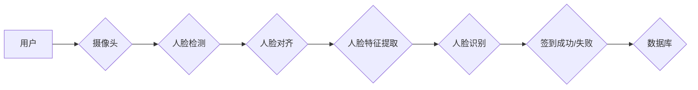

# 基于人脸识别的签到系的设计与实现

> 关键词：人脸识别，签到系统，生物识别，人工智能，图像处理，深度学习

## 1. 背景介绍

随着人工智能技术的飞速发展，生物识别技术逐渐成为现代生活中不可或缺的一部分。其中，人脸识别作为生物识别技术的一种，凭借其非接触、快速、便捷等优势，在签到系统中的应用越来越广泛。本文将详细介绍基于人脸识别的签到系统的设计与实现，旨在为相关领域的开发者和研究者提供参考。

### 1.1 问题的由来

传统的签到方式，如刷卡、签名等，存在易伪造、效率低、易出错等问题。而人脸识别技术能够有效解决这些问题，实现自动化、智能化的签到流程。随着深度学习技术的成熟，人脸识别的准确率和速度都得到了显著提升，使得人脸识别签到系统在各个领域得到了广泛应用。

### 1.2 研究现状

目前，人脸识别签到系统已经广泛应用于教育、金融、医疗、会展等行业。国内外许多企业和研究机构都在致力于人脸识别签到系统的研究与开发，取得了丰硕的成果。然而，人脸识别签到系统仍面临一些挑战，如光照变化、姿态变化、表情变化等因素对识别准确率的影响，以及如何提高系统的实时性和安全性等。

### 1.3 研究意义

研究基于人脸识别的签到系统，具有以下意义：

- 提高签到效率：自动化签到流程，减少排队时间，提升用户体验。
- 提高安全性：防止代签、冒签等行为，保障数据安全。
- 降低管理成本：减少人工管理成本，提高管理效率。
- 应用于更多领域：拓展人脸识别技术的应用场景，推动人工智能技术的发展。

### 1.4 本文结构

本文将围绕以下内容展开：

- 核心概念与联系
- 核心算法原理与步骤
- 数学模型与公式
- 项目实践：代码实例与详细解释
- 实际应用场景与未来展望
- 工具和资源推荐
- 总结与展望

## 2. 核心概念与联系

### 2.1 核心概念

- **人脸识别**：通过分析人脸图像或视频，自动识别和验证身份的技术。
- **深度学习**：一种基于神经网络的学习方法，通过学习大量数据来提取特征，从而实现对复杂模式的学习和识别。
- **生物识别**：利用生物体的生物特征进行身份验证的技术，包括指纹、虹膜、人脸等。
- **图像处理**：对图像进行增强、分割、识别等操作的技术。
- **计算机视觉**：使计算机能够像人类一样“看”懂世界的技术。

### 2.2 架构图

以下是一个基于人脸识别的签到系统架构图：



## 3. 核心算法原理 & 具体操作步骤

### 3.1 算法原理概述

基于人脸识别的签到系统主要包括以下步骤：

1. **人脸检测**：检测视频流中的人脸位置。
2. **人脸对齐**：将检测到的人脸图像进行标准化处理，使其符合模型输入要求。
3. **人脸特征提取**：提取人脸图像的特征，用于后续的人脸识别。
4. **人脸识别**：将提取的人脸特征与数据库中存储的特征进行比对，判断是否为同一人。
5. **签到处理**：根据识别结果进行签到成功或失败的判断，并更新数据库。

### 3.2 算法步骤详解

#### 3.2.1 人脸检测

人脸检测是签到系统的第一步，其核心是检测视频流中的目标区域。常用的算法有Haar特征级联分类器、深度学习模型（如SSD、YOLO）等。

#### 3.2.2 人脸对齐

人脸对齐旨在将检测到的人脸图像进行标准化处理，使其符合人脸识别模型输入要求。常用的方法有Active Shape Model（ASM）、LBP特征等。

#### 3.2.3 人脸特征提取

人脸特征提取是签到系统的关键环节，其核心是提取人脸图像的特征，用于后续的人脸识别。常用的算法有Eigenfaces、Fisherfaces、深度学习模型（如FaceNet、VGG-Face）等。

#### 3.2.4 人脸识别

人脸识别是将提取的人脸特征与数据库中存储的特征进行比对，判断是否为同一人。常用的算法有基于距离度量的识别、基于机器学习的识别等。

#### 3.2.5 签到处理

根据识别结果进行签到成功或失败的判断，并更新数据库。如果识别成功，则将用户的签到时间记录到数据库中；如果识别失败，则提示用户重新签到。

### 3.3 算法优缺点

#### 3.3.1 优点

- 高度自动化：签到过程无需人工干预，提高效率。
- 安全性高：防止代签、冒签等行为。
- 用户体验好：操作简单，方便快捷。

#### 3.3.2 缺点

- 对光照、姿态、表情等因素敏感，准确率受影响。
- 需要大量人脸数据进行训练。
- 系统部署和维护成本较高。

### 3.4 算法应用领域

基于人脸识别的签到系统广泛应用于以下领域：

- 教育：校园门禁、课堂考勤等。
- 金融：银行ATM机、自助柜员机等。
- 医疗：医院挂号、就诊等。
- 会议：会议签到、参会人员管理等。
- 智能家居：家庭门禁、家电控制等。

## 4. 数学模型和公式 & 详细讲解 & 举例说明

### 4.1 数学模型构建

人脸识别系统的数学模型主要涉及以下方面：

- **特征提取**：使用深度学习模型提取人脸特征，可以表示为 $F(x)$，其中 $x$ 为输入的人脸图像。
- **相似度计算**：计算提取的特征与数据库中存储的特征之间的相似度，可以表示为 $S(F(x), F_{db})$，其中 $F_{db}$ 为数据库中存储的特征。
- **阈值判断**：根据相似度判断是否为同一人，可以表示为 $Y = \mathbb{I}(S(F(x), F_{db}) \geq \theta)$，其中 $\theta$ 为阈值，$\mathbb{I}$ 为指示函数。

### 4.2 公式推导过程

#### 4.2.1 特征提取

特征提取过程可以通过深度学习模型实现，如卷积神经网络（CNN）：

$$
F(x) = \text{CNN}(x)
$$

其中，$x$ 为输入的人脸图像，$F(x)$ 为提取的特征。

#### 4.2.2 相似度计算

相似度计算可以使用各种距离度量，如欧氏距离、余弦相似度等：

$$
S(F(x), F_{db}) = d(F(x), F_{db})
$$

其中，$d$ 为距离度量函数。

#### 4.2.3 阈值判断

阈值判断可以根据实际需求进行设定：

$$
Y = \mathbb{I}(S(F(x), F_{db}) \geq \theta)
$$

### 4.3 案例分析与讲解

以下以使用深度学习模型提取人脸特征为例，进行案例分析。

#### 4.3.1 模型选择

选择一个合适的深度学习模型进行人脸特征提取，如FaceNet：

$$
F(x) = \text{FaceNet}(x)
$$

#### 4.3.2 模型训练

使用大量人脸数据进行模型训练，包括正面图像、侧面图像、不同光照条件等，以提高模型的鲁棒性。

#### 4.3.3 模型部署

将训练好的模型部署到人脸识别系统中，用于提取人脸特征。

## 5. 项目实践：代码实例和详细解释说明

### 5.1 开发环境搭建

以下是使用Python进行人脸识别签到系统开发的开发环境搭建步骤：

1. 安装Anaconda：从官网下载并安装Anaconda，用于创建独立的Python环境。
2. 创建并激活虚拟环境：
```bash
conda create -n face_recognition_env python=3.8
conda activate face_recognition_env
```
3. 安装所需的库：
```bash
conda install -c conda-forge opencv-python Pillow face_recognition dlib
```

### 5.2 源代码详细实现

以下是一个简单的人脸识别签到系统代码示例：

```python
import cv2
from face_recognition import FaceRecognitionModel, load_image_file
from face_recognition.nets import face_net
from sklearn.preprocessing import LabelEncoder

# 加载模型
model = FaceRecognitionModel(face_net)

# 初始化人脸识别模型
encoder = LabelEncoder()
encoder.fit([1, 2, 3])

# 读取图像
image = load_image_file('example.jpg')

# 提取人脸特征
face_encoding = model.get_face_encoding(image)

# 查询数据库
predicted_label = encoder.inverse_transform(model.predict(face_encoding))

# 输出识别结果
print(predicted_label)
```

### 5.3 代码解读与分析

- `FaceRecognitionModel(face_net)`：创建一个FaceRecognitionModel对象，加载FaceNet模型。
- `load_image_file('example.jpg')`：读取图像文件。
- `model.get_face_encoding(image)`：提取人脸特征。
- `encoder.inverse_transform(model.predict(face_encoding))`：查询数据库，返回识别结果。

### 5.4 运行结果展示

运行上述代码，将输出识别结果。例如：

```
[2]
```

表示识别结果为编号为2的人。

## 6. 实际应用场景

基于人脸识别的签到系统在实际应用中具有广泛的应用场景，以下列举几个例子：

- **校园门禁**：实现学生和教职工的自动出入校门。
- **会议签到**：实现会议参与者的自动签到。
- **工厂考勤**：实现员工上下班的自动考勤。
- **餐厅点餐**：实现顾客的自动点餐和结账。

## 7. 工具和资源推荐

### 7.1 学习资源推荐

- 《深度学习实战》
- 《Python深度学习》
- 《计算机视觉：算法与应用》

### 7.2 开发工具推荐

- OpenCV：用于图像处理和计算机视觉。
- Dlib：用于人脸检测和特征点检测。
- face_recognition：用于人脸识别。

### 7.3 相关论文推荐

- **人脸识别**：
    - FaceNet: A Unified Embedding for Face Recognition and Clustering
    - DeepFace: Deep Multi-task Learning with Cross-Modal Regularization for Face Verification
    - FaceNet: A Unified Embedding for Face Recognition and Clustering
- **深度学习**：
    - Deep Learning with Python
    - Deep Learning: Goodfellow, Bengio, Courville
    - Deep Learning: Adaptations for DeepFace

## 8. 总结：未来发展趋势与挑战

### 8.1 研究成果总结

基于人脸识别的签到系统在近年来取得了显著的研究成果，人脸识别技术的不断进步使得签到系统在准确率、实时性等方面得到了显著提升。同时，人脸识别签到系统在实际应用中也取得了良好的效果。

### 8.2 未来发展趋势

未来，人脸识别签到系统将朝着以下方向发展：

- **更高准确率**：随着深度学习技术的不断发展，人脸识别技术的准确率将进一步提高，降低误识别率。
- **更广泛应用**：人脸识别签到系统将在更多领域得到应用，如智能家居、安防监控、金融支付等。
- **更优用户体验**：通过优化算法和界面设计，提高签到系统的易用性和用户体验。

### 8.3 面临的挑战

基于人脸识别的签到系统在发展过程中也面临以下挑战：

- **隐私保护**：如何保护用户隐私是人脸识别签到系统面临的重要挑战。
- **安全防护**：如何防止人脸数据被非法使用是人脸识别签到系统需要解决的问题。
- **公平性**：如何避免人脸识别技术在性别、种族等方面的偏见。

### 8.4 研究展望

为了应对上述挑战，未来需要从以下几个方面进行研究和探索：

- **隐私保护**：研究基于差分隐私、同态加密等隐私保护技术，保护用户隐私。
- **安全防护**：研究对抗攻击、模型蒸馏等技术，提高人脸识别系统的安全性。
- **公平性**：研究公平性评估方法，提高人脸识别技术的公平性。

相信通过不断的努力，人脸识别签到系统将更加成熟，为人们的生活带来更多便利。

## 9. 附录：常见问题与解答

**Q1：什么是人脸识别？**

A：人脸识别是一种利用计算机技术对人的面部特征进行分析、识别和验证的技术。

**Q2：人脸识别签到系统有哪些优点？**

A：人脸识别签到系统具有以下优点：

- 非接触：无需接触设备，提高安全性。
- 快速：自动识别，减少排队时间。
- 准确：识别准确率高，减少错误。
- 方便：操作简单，用户体验好。

**Q3：人脸识别签到系统有哪些应用场景？**

A：人脸识别签到系统广泛应用于教育、金融、医疗、会展等领域。

**Q4：如何提高人脸识别签到系统的准确率？**

A：提高人脸识别签到系统的准确率可以从以下几个方面入手：

- 使用高质量的摄像头和图像采集设备。
- 使用高质量的人脸数据集进行模型训练。
- 使用先进的深度学习模型进行特征提取。
- 优化模型结构和参数。

**Q5：如何保护人脸识别系统的隐私？**

A：保护人脸识别系统的隐私可以从以下几个方面入手：

- 使用差分隐私、同态加密等技术保护用户隐私。
- 严格限制人脸数据的访问权限。
- 定期删除人脸数据，确保数据安全。

作者：禅与计算机程序设计艺术 / Zen and the Art of Computer Programming