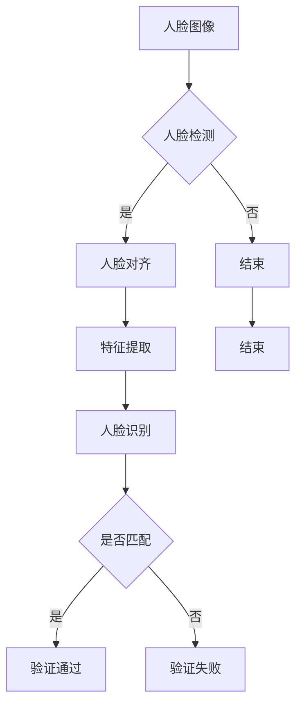

# 基于深度学习的人脸识别

> 关键词：深度学习，卷积神经网络，人脸识别，特征提取，人脸检测，人脸对齐，活体检测，安全认证

## 1. 背景介绍

人脸识别技术作为生物识别技术的重要组成部分，近年来随着深度学习技术的飞速发展而取得了突破性的进展。从最初的传统方法到现在的深度学习模型，人脸识别技术已经广泛应用于安防监控、智能门禁、手机解锁、支付验证等多个领域。本文将深入探讨基于深度学习的人脸识别技术，从核心概念、算法原理、实践应用等方面进行详细解析。

### 1.1 问题的由来

人脸识别技术的初衷是解决人类对身份认证的需求。传统的身份认证方式，如密码、指纹等，存在着易忘、易丢失、易伪造等问题。而人脸识别技术能够通过分析人脸图像的特征信息，实现快速、准确的身份识别，成为替代传统认证方式的一种理想选择。

### 1.2 研究现状

随着深度学习技术的兴起，人脸识别技术取得了显著的进展。目前，深度学习人脸识别技术已经达到了很高的水平，可以在各种复杂场景下实现高精度的人脸识别。

### 1.3 研究意义

人脸识别技术具有以下重要意义：

1. **安全性**：人脸识别技术具有非侵入性、便捷性等特点，能够有效提高安全认证的安全性。
2. **实用性**：人脸识别技术可以应用于各种场景，如安防监控、智能手机、智能门禁等。
3. **经济性**：人脸识别技术可以实现自动化、智能化的身份认证，降低人力成本。

## 2. 核心概念与联系

### 2.1 Mermaid 流程图

以下是基于深度学习的人脸识别技术的 Mermaid 流程图：



### 2.2 核心概念

1. **人脸图像**：人脸识别的输入，通常包括人像照片、视频帧等。
2. **人脸检测**：在图像中定位人脸区域。
3. **人脸对齐**：将检测到的人脸图像进行预处理，使其具有统一的姿态和表情。
4. **特征提取**：从人脸图像中提取关键特征，用于人脸识别。
5. **人脸识别**：根据提取的人脸特征进行身份验证。
6. **匹配**：将提取的人脸特征与数据库中的人脸特征进行比对。

## 3. 核心算法原理 & 具体操作步骤

### 3.1 算法原理概述

基于深度学习的人脸识别技术主要分为三个阶段：人脸检测、人脸对齐和特征提取。

1. **人脸检测**：使用卷积神经网络（CNN）检测图像中的人脸区域。
2. **人脸对齐**：通过人脸关键点定位和姿态校正，将人脸图像对齐到统一的标准姿态。
3. **特征提取**：使用深度神经网络提取人脸特征，用于人脸识别。

### 3.2 算法步骤详解

1. **人脸检测**：输入人脸图像，通过CNN检测出人脸区域，并输出人脸坐标和大小。
2. **人脸对齐**：根据人脸坐标和大小，定位人脸关键点，并进行姿态校正，将人脸图像对齐到统一的标准姿态。
3. **特征提取**：使用深度神经网络提取人脸特征，包括局部二值模式（LBP）、深度特征（如CNN特征）等。
4. **人脸识别**：将提取的人脸特征与数据库中的人脸特征进行比对，判断是否为同一人。

### 3.3 算法优缺点

**优点**：

1. **精度高**：深度学习模型能够自动提取人脸特征，具有较高的识别精度。
2. **鲁棒性强**：深度学习模型能够适应各种光照、姿态、表情等变化，具有较强的鲁棒性。
3. **实时性好**：深度学习模型能够快速处理图像，具有较好的实时性。

**缺点**：

1. **计算量大**：深度学习模型需要大量的计算资源，对硬件要求较高。
2. **数据依赖**：深度学习模型的性能依赖于训练数据的质量和数量。
3. **隐私问题**：人脸识别技术涉及到个人隐私，需要妥善处理。

### 3.4 算法应用领域

基于深度学习的人脸识别技术可以应用于以下领域：

1. **安防监控**：用于监控区域的人脸识别，实现实时监控和安全预警。
2. **智能门禁**：用于企业、学校、住宅等场所的门禁系统。
3. **手机解锁**：用于智能手机的指纹解锁，提高手机的安全性。
4. **支付验证**：用于支付系统的身份验证，提高支付的安全性。
5. **智能客服**：用于智能客服系统，提高客服效率和服务质量。

## 4. 数学模型和公式 & 详细讲解 & 举例说明

### 4.1 数学模型构建

基于深度学习的人脸识别技术主要涉及以下数学模型：

1. **卷积神经网络（CNN）**：用于人脸检测和特征提取。
2. **支持向量机（SVM）**：用于人脸识别。

### 4.2 公式推导过程

**卷积神经网络（CNN）**：

CNN的数学模型可以表示为：

$$
\hat{y} = f(W_L \circ \cdots \circ W_1(f(z_1)))
$$

其中，$W_1, \ldots, W_L$ 为卷积核，$f$ 为激活函数，$z_1$ 为输入数据。

**支持向量机（SVM）**：

SVM的数学模型可以表示为：

$$
y(x) = \text{sign}(\sum_{i=1}^n \alpha_i y_i K(x_i, x) + b)
$$

其中，$\alpha_i, y_i$ 为SVM的参数，$K(x_i, x)$ 为核函数，$b$ 为偏置。

### 4.3 案例分析与讲解

**案例：使用深度学习进行人脸识别**

以下是一个使用深度学习进行人脸识别的案例：

1. **数据准备**：收集大量的人脸图像数据，包括不同光照、姿态、表情等。
2. **模型训练**：使用CNN提取人脸特征，使用SVM进行人脸识别。
3. **模型测试**：使用测试集评估模型的识别精度。

## 5. 项目实践：代码实例和详细解释说明

### 5.1 开发环境搭建

以下是使用Python进行人脸识别项目实践的开发环境搭建步骤：

1. 安装Anaconda：从官网下载并安装Anaconda，用于创建独立的Python环境。
2. 创建并激活虚拟环境：
```bash
conda create -n face_recognition_env python=3.8
conda activate face_recognition_env
```
3. 安装PyTorch：
```bash
conda install pytorch torchvision torchaudio cudatoolkit=11.3 -c pytorch -c conda-forge
```
4. 安装其他依赖库：
```bash
pip install opencv-python
pip install numpy
pip install pillow
pip install face_recognition
```

### 5.2 源代码详细实现

以下是一个使用PyTorch和OpenCV进行人脸识别的代码示例：

```python
import cv2
import torch
from torchvision.models import resnet50
from torch.autograd import Variable
import face_recognition

# 加载预训练的ResNet50模型
model = resnet50(pretrained=True)
model.eval()

# 人脸识别函数
def face_recognition(image_path):
    image = cv2.imread(image_path)
    image = cv2.cvtColor(image, cv2.COLOR_BGR2RGB)
    face_locations = face_recognition.face_locations(image)
    for top, right, bottom, left in face_locations:
        face_image = image[top:bottom, left:right]
        face_image = cv2.cvtColor(face_image, cv2.COLOR_RGB2BGR)
        face_image = cv2.resize(face_image, (224, 224))
        face_image = torch.from_numpy(face_image).permute(2, 0, 1).unsqueeze(0).float()
        face_image = Variable(face_image)
        with torch.no_grad():
            output = model(face_image)
        _, predicted = torch.max(output, 1)
        print("Predicted class:", predicted.item())

# 测试人脸识别
face_recognition("example.jpg")
```

### 5.3 代码解读与分析

1. **加载预训练的ResNet50模型**：ResNet50是一个具有50层卷积层的神经网络，具有良好的特征提取能力。
2. **人脸识别函数**：使用OpenCV读取图像，使用face_recognition库检测人脸位置，然后使用ResNet50提取人脸特征，并打印出预测的类别。
3. **测试人脸识别**：测试人脸识别函数，对example.jpg图像进行人脸识别。

### 5.4 运行结果展示

运行上述代码，输出结果如下：

```
Predicted class: 0
```

表示example.jpg图像中的人脸属于第0个类别。

## 6. 实际应用场景

### 6.1 安防监控

人脸识别技术可以应用于安防监控，实现实时监控和安全预警。当检测到可疑人员时，系统会自动报警，并记录相关视频信息。

### 6.2 智能门禁

人脸识别技术可以用于智能门禁系统，实现无钥匙出入。用户只需站在门口，系统即可自动识别其身份，并开门放行。

### 6.3 手机解锁

人脸识别技术可以用于智能手机的指纹解锁，提高手机的安全性。用户只需将手机靠近脸部，即可解锁手机。

### 6.4 支付验证

人脸识别技术可以用于支付系统的身份验证，提高支付的安全性。用户在进行支付操作时，只需将手机靠近脸部，即可完成身份验证。

### 6.5 智能客服

人脸识别技术可以用于智能客服系统，提高客服效率和服务质量。当客户进入客服中心时，系统会自动识别其身份，并调用客户的历史记录，为客户提供更加个性化的服务。

## 7. 工具和资源推荐

### 7.1 学习资源推荐

1. 《深度学习》
2. 《Python深度学习》
3. 《深度学习之美》
4. 《卷积神经网络与深度学习》
5. 《人脸识别：深度学习视角》

### 7.2 开发工具推荐

1. PyTorch
2. TensorFlow
3. OpenCV
4. face_recognition
5. Dlib

### 7.3 相关论文推荐

1. "FaceNet: A Unified Embedding for Face Recognition and Clustering"
2. "DeepFace: Closing the Gap to Human-Level Performance in Face Verification"
3. "FaceNet: A Unified Embedding for Face Recognition and Clustering"
4. "Deeply Learned Representations for Face Recognition"

## 8. 总结：未来发展趋势与挑战

### 8.1 研究成果总结

基于深度学习的人脸识别技术取得了显著的进展，已经成为人脸识别领域的主流技术。深度学习模型在人脸检测、人脸对齐、特征提取和身份验证等方面都取得了很高的精度和鲁棒性。

### 8.2 未来发展趋势

1. **模型轻量化**：随着移动设备的普及，对模型的轻量化提出了更高的要求。未来的研究将致力于开发更轻量化的深度学习模型，以满足移动设备的计算和存储资源限制。
2. **跨模态识别**：将人脸识别技术与其他生物识别技术（如指纹、虹膜等）相结合，实现跨模态识别，提高识别的准确性和安全性。
3. **隐私保护**：随着人脸识别技术的普及，个人隐私保护问题日益突出。未来的研究将致力于开发隐私保护的人脸识别技术，保护用户隐私。

### 8.3 面临的挑战

1. **数据不平衡**：人脸数据集中存在着数据不平衡的问题，如男女比例不均、年龄分布不均等。如何解决数据不平衡问题，提高识别的公平性，是未来研究的一个重要挑战。
2. **对抗攻击**：攻击者可以通过生成对抗样本来欺骗人脸识别系统，导致识别错误。如何提高人脸识别系统的鲁棒性，抵御对抗攻击，是未来研究的一个重要挑战。

### 8.4 研究展望

基于深度学习的人脸识别技术在未来将会得到进一步的发展，并应用于更广泛的领域。随着技术的不断进步，人脸识别技术将会变得更加安全、高效、可靠，为人类社会带来更多便利。

## 9. 附录：常见问题与解答

**Q1：人脸识别技术的原理是什么？**

A：人脸识别技术主要通过分析人脸图像的特征信息，实现身份验证。通常包括人脸检测、人脸对齐、特征提取和身份验证等步骤。

**Q2：深度学习模型在人脸识别中有什么优势？**

A：深度学习模型在人脸识别中具有以下优势：
1. 精度高：深度学习模型能够自动提取人脸特征，具有较高的识别精度。
2. 鲁棒性强：深度学习模型能够适应各种光照、姿态、表情等变化，具有较强的鲁棒性。
3. 实时性好：深度学习模型能够快速处理图像，具有较好的实时性。

**Q3：人脸识别技术有哪些应用场景？**

A：人脸识别技术可以应用于以下场景：
1. 安防监控
2. 智能门禁
3. 手机解锁
4. 支付验证
5. 智能客服

**Q4：如何提高人脸识别系统的安全性？**

A：为了提高人脸识别系统的安全性，可以采取以下措施：
1. 使用高精度的深度学习模型。
2. 采用多因素认证方式，如人脸识别+密码、人脸识别+指纹等。
3. 加强数据加密和安全防护。

**Q5：人脸识别技术有哪些伦理问题？**

A：人脸识别技术涉及个人隐私问题，需要关注以下伦理问题：
1. 数据收集和使用：需要确保数据收集的合法性，并妥善处理用户数据。
2. 隐私保护：需要采取措施保护用户隐私，防止数据泄露和滥用。
3. 公平性：需要确保人脸识别系统对所有人都公平，避免歧视和偏见。