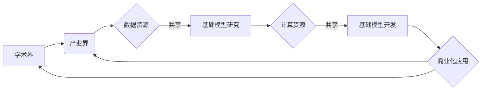

# 基础模型的学术界与产业界合作

> 关键词：基础模型，学术界，产业界，合作，人工智能，深度学习，预训练，开放性，知识产权，商业化

## 1. 背景介绍

随着深度学习技术的飞速发展，基础模型（如神经网络、Transformer等）在各个领域展现出强大的能力。基础模型已经成为推动人工智能技术进步的关键因素，它们在语音识别、图像识别、自然语言处理等领域取得了突破性进展。然而，基础模型的研发和应用也面临着诸多挑战，其中最为突出的是学术界与产业界之间的合作问题。

### 1.1 问题的由来

学术界在基础模型的理论研究和创新方面具有优势，而产业界在数据资源、计算资源和商业化应用方面具有优势。然而，由于双方在目标、资源、利益等方面的差异，学术界与产业界之间的合作面临着诸多挑战：

- **知识产权**：基础模型的研究成果往往属于知识产权范畴，如何保护知识产权，同时促进成果转化，是双方合作需要解决的核心问题。
- **数据资源**：基础模型的训练需要海量数据，而产业界往往掌握大量数据资源，如何实现数据共享，是双方合作的关键。
- **计算资源**：深度学习模型的训练需要高性能计算资源，而产业界通常拥有更丰富的计算资源，如何实现计算资源的共享，是双方合作的重要保障。
- **商业化应用**：产业界对基础模型的应用需求更加迫切，而学术界的研究成果可能难以满足产业界的实际需求，如何实现研究成果的商业化转化，是双方合作的重要目标。

### 1.2 研究现状

近年来，学术界与产业界在基础模型领域的合作逐渐增多，主要体现在以下几个方面：

- **联合研发**：学术界与产业界共同开展基础模型的研究和开发，共享研究成果和资源。
- **成果转化**：学术界将研究成果转化为产业界可用的技术产品，实现商业化应用。
- **人才培养**：产业界为学术界提供实习、就业机会，学术界为产业界提供技术支持和人才储备。

### 1.3 研究意义

学术界与产业界在基础模型领域的合作具有重要意义：

- **推动技术创新**：合作可以促进基础模型的理论创新和技术突破，推动人工智能技术的进步。
- **加速成果转化**：合作可以加速基础模型的研究成果转化为实际应用，提升产业竞争力。
- **培养人才**：合作可以促进学术研究与产业实践的结合，培养更多具有创新能力和实践能力的人工智能人才。

## 2. 核心概念与联系

### 2.1 核心概念原理和架构的 Mermaid 流程图



### 2.2 核心概念

- **基础模型**：指在特定领域具有通用性、可扩展性和可迁移性的模型，如神经网络、Transformer等。
- **知识产权**：指对创造性智力成果所享有的专有权利，包括专利权、著作权、商标权等。
- **数据资源**：指用于人工智能模型训练和推理的数据集，包括文本、图像、语音等。
- **计算资源**：指用于人工智能模型训练和推理的计算能力，包括CPU、GPU、TPU等。
- **商业化应用**：指将人工智能技术应用于实际业务场景，实现商业价值。

## 3. 核心算法原理 & 具体操作步骤

### 3.1 算法原理概述

基础模型的研发和应用主要包括以下几个步骤：

1. **数据收集与预处理**：收集相关领域的海量数据，并进行清洗、标注等预处理操作。
2. **模型设计与训练**：设计合适的模型架构，并在预训练数据上训练模型。
3. **模型评估与优化**：评估模型性能，并根据评估结果优化模型结构和参数。
4. **模型部署与应用**：将模型部署到实际业务场景，实现商业化应用。

### 3.2 算法步骤详解

1. **数据收集与预处理**：根据具体任务需求，从公开数据集或私有数据集中收集数据，并进行数据清洗、标注、增强等预处理操作，提高数据质量。
2. **模型设计与训练**：选择合适的模型架构，如神经网络、Transformer等，并在预训练数据上训练模型，学习数据中的特征和规律。
3. **模型评估与优化**：使用验证集或测试集评估模型性能，根据评估结果调整模型结构和参数，提高模型精度和泛化能力。
4. **模型部署与应用**：将模型部署到实际业务场景，如智能客服、图像识别、自然语言处理等，实现商业化应用。

### 3.3 算法优缺点

**优点**：

- **提高模型性能**：基础模型可以学习到更丰富的特征和规律，提高模型在各个领域的性能。
- **降低开发成本**：基础模型可以复用于多个任务，降低开发成本和时间。
- **促进技术进步**：基础模型的研究和应用推动了人工智能技术的进步。

**缺点**：

- **数据依赖**：基础模型的训练需要海量数据，数据质量对模型性能有重要影响。
- **计算资源依赖**：基础模型的训练需要高性能计算资源，计算资源限制了模型的规模和应用范围。
- **知识产权问题**：基础模型的研究成果可能涉及知识产权，需要妥善处理知识产权问题。

### 3.4 算法应用领域

基础模型在各个领域都有广泛的应用，主要包括：

- **图像识别**：如人脸识别、物体检测、图像分类等。
- **语音识别**：如语音识别、语音合成、语音翻译等。
- **自然语言处理**：如文本分类、机器翻译、情感分析等。
- **推荐系统**：如商品推荐、新闻推荐、音乐推荐等。

## 4. 数学模型和公式 & 详细讲解 & 举例说明

### 4.1 数学模型构建

以卷积神经网络（CNN）为例，其数学模型可以表示为：

$$
h_{l}^{(i)} = f(W_{l}^{(i)}h_{l-1}^{(i-1) + b_{l}^{(i)})
$$

其中，$h_{l}^{(i)}$ 表示第 $l$ 层第 $i$ 个神经元的激活值，$W_{l}^{(i)}$ 表示第 $l$ 层第 $i$ 个神经元的权重，$b_{l}^{(i)}$ 表示第 $l$ 层第 $i$ 个神经元的偏置，$f$ 表示激活函数。

### 4.2 公式推导过程

以ReLU激活函数为例，其公式推导过程如下：

$$
f(x) = \max(0, x)
$$

其中，当 $x \geq 0$ 时，$f(x) = x$；当 $x < 0$ 时，$f(x) = 0$。

### 4.3 案例分析与讲解

以下以BERT模型为例，讲解自然语言处理领域的基础模型应用。

BERT（Bidirectional Encoder Representations from Transformers）是一种基于Transformer的预训练语言模型，其核心思想是通过对文本进行双向上下文编码，学习到更丰富的语义表示。

BERT模型主要由以下几个部分组成：

1. **输入层**：将文本输入转换为Token ID序列。
2. **Transformer编码器**：对Token ID序列进行双向上下文编码，学习到更丰富的语义表示。
3. **输出层**：根据编码后的语义表示，输出分类标签或文本摘要等。

BERT模型在多个自然语言处理任务上取得了优异的性能，如文本分类、命名实体识别、情感分析等。

## 5. 项目实践：代码实例和详细解释说明

### 5.1 开发环境搭建

以下以TensorFlow为例，介绍基础模型的开发环境搭建。

1. 安装TensorFlow：

```bash
pip install tensorflow
```

2. 安装相关依赖库：

```bash
pip install numpy pandas scikit-learn matplotlib
```

### 5.2 源代码详细实现

以下以TensorFlow实现BERT模型为例，展示基础模型的代码实现。

```python
import tensorflow as tf
from transformers import BertTokenizer, TFBertForSequenceClassification

# 加载预训练的BERT模型和分词器
tokenizer = BertTokenizer.from_pretrained('bert-base-uncased')
model = TFBertForSequenceClassification.from_pretrained('bert-base-uncased')

# 加载数据
train_dataset = ...
dev_dataset = ...
test_dataset = ...

# 训练模型
model.fit(train_dataset, validation_data=dev_dataset, epochs=3)

# 评估模型
test_loss, test_accuracy = model.evaluate(test_dataset)
```

### 5.3 代码解读与分析

以上代码展示了使用TensorFlow实现BERT模型的简单流程。

1. 加载预训练的BERT模型和分词器。
2. 加载数据集，包括训练集、验证集和测试集。
3. 训练模型，将训练集输入模型进行训练，并使用验证集进行评估。
4. 评估模型，在测试集上评估模型的性能。

## 6. 实际应用场景

### 6.1 智能问答系统

智能问答系统是基础模型在自然语言处理领域的典型应用之一。通过训练预训练语言模型，可以实现对用户问题的理解、分析和回答。

### 6.2 智能推荐系统

智能推荐系统是基础模型在推荐系统领域的典型应用之一。通过训练预训练语言模型，可以实现对用户兴趣和内容的建模，为用户提供个性化的推荐。

### 6.3 智能客服系统

智能客服系统是基础模型在客服领域的典型应用之一。通过训练预训练语言模型，可以实现对用户咨询的理解和回答，提高客服效率。

## 7. 工具和资源推荐

### 7.1 学习资源推荐

- 《深度学习》
- 《神经网络与深度学习》
- 《自然语言处理入门》
- Hugging Face官网

### 7.2 开发工具推荐

- TensorFlow
- PyTorch
- Keras

### 7.3 相关论文推荐

- "BERT: Pre-training of Deep Bidirectional Transformers for Language Understanding"
- "Generative Language Models: A Survey of Recent Advances"
- "Attention Is All You Need"

## 8. 总结：未来发展趋势与挑战

### 8.1 研究成果总结

基础模型在学术界与产业界合作中取得了显著成果，推动了人工智能技术的进步和应用。

### 8.2 未来发展趋势

- **基础模型规模将不断扩大**：随着计算资源的提升，基础模型的规模将不断扩大，模型参数量将达到数十亿甚至数千亿级别。
- **基础模型将更加泛化**：基础模型将更加关注泛化能力，降低对特定领域数据的依赖。
- **基础模型将更加可解释**：基础模型将更加关注可解释性，提高模型的可信度和透明度。

### 8.3 面临的挑战

- **数据资源**：数据资源是基础模型训练的基础，如何获取高质量、大规模的数据资源是当前面临的挑战。
- **计算资源**：基础模型的训练需要大量的计算资源，如何提高计算效率是当前面临的挑战。
- **知识产权**：知识产权保护是基础模型研发和应用的重要问题，如何平衡知识产权保护与成果转化是当前面临的挑战。

### 8.4 研究展望

未来，基础模型将在以下方面取得更多突破：

- **跨模态基础模型**：将图像、语音、文本等不同模态信息进行整合，实现更全面的信息理解和建模。
- **可解释性基础模型**：提高基础模型的可解释性，增强模型的可信度和透明度。
- **小样本学习基础模型**：降低基础模型对大规模数据的依赖，实现小样本学习。

## 9. 附录：常见问题与解答

**Q1：基础模型的训练需要哪些数据？**

A：基础模型的训练需要大量高质量的数据，包括文本、图像、语音等。数据来源可以是公开数据集或私有数据集。

**Q2：基础模型的训练需要哪些计算资源？**

A：基础模型的训练需要大量的计算资源，包括CPU、GPU、TPU等。高性能计算集群是基础模型训练的必要条件。

**Q3：基础模型的知识产权如何保护？**

A：基础模型的知识产权保护可以通过专利、著作权等方式进行。同时，可以与相关机构合作，共同制定知识产权保护规范。

**Q4：如何平衡知识产权保护与成果转化？**

A：平衡知识产权保护与成果转化可以通过以下方式实现：

- 制定合理的知识产权保护策略，既要保护知识产权，又要促进成果转化。
- 与相关机构合作，共同制定知识产权保护规范。
- 建立知识产权交易平台，促进知识产权的流动和转化。

作者：禅与计算机程序设计艺术 / Zen and the Art of Computer Programming