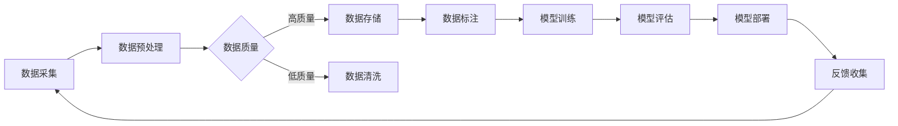

# 大数据对AI学习的重要性

> 关键词：大数据，AI学习，机器学习，深度学习，数据驱动，数据质量，数据隐私

## 1. 背景介绍

随着信息技术的飞速发展，大数据时代已经到来。海量数据的产生和积累为人工智能（AI）的发展提供了前所未有的机遇。AI学习，特别是机器学习和深度学习，需要大量的数据来训练和优化模型。本文将探讨大数据对AI学习的重要性，分析其原理、方法、应用场景以及面临的挑战。

### 1.1 大数据的定义

大数据通常指规模巨大、类型多样、增长迅速的数据集。这些数据集难以用传统数据处理应用软件工具进行处理，需要新型的处理模式。

### 1.2 AI学习的兴起

AI学习是指机器学习、深度学习、强化学习等技术的集合，旨在使机器能够像人类一样学习和推理。这些技术的核心是利用数据来训练模型，从而提高机器的智能水平。

### 1.3 大数据与AI学习的关联

大数据为AI学习提供了丰富的数据资源，使得AI模型能够从海量数据中学习到更加复杂和精细的模式，从而提高模型的准确性和泛化能力。

## 2. 核心概念与联系

### 2.1 数据驱动

数据驱动是指利用数据来指导决策和优化过程。在AI学习中，数据驱动意味着利用数据来训练和优化模型。

### 2.2 数据质量

数据质量是指数据的有用性、准确性和可靠性。高质量的数据是AI学习成功的关键。

### 2.3 数据隐私

随着数据量的增加，数据隐私保护成为一个重要问题。在AI学习中，需要采取措施保护用户的隐私。

### 2.4 Mermaid流程图



## 3. 核心算法原理 & 具体操作步骤

### 3.1 算法原理概述

AI学习的基本原理是通过学习数据中的模式来预测或决策。具体而言，机器学习算法通过训练数据学习输入和输出之间的关系，深度学习算法通过多层神经网络学习更复杂的特征表示。

### 3.2 算法步骤详解

1. **数据采集**：从各种来源收集数据，如传感器、社交网络、电子商务等。
2. **数据预处理**：对数据进行清洗、归一化、去重等处理，提高数据质量。
3. **数据标注**：为数据添加标签，用于训练模型。
4. **模型训练**：使用训练数据训练模型，调整模型参数。
5. **模型评估**：使用测试数据评估模型性能。
6. **模型部署**：将模型部署到实际应用场景中。
7. **反馈收集**：收集实际应用中的反馈，用于模型优化。

### 3.3 算法优缺点

**优点**：

- **提高准确性**：通过学习大量数据，模型可以学习到更复杂的模式，提高预测或决策的准确性。
- **提高泛化能力**：通过泛化训练，模型可以在新的、未见过的数据上也能保持较高的性能。
- **降低成本**：通过自动化处理，可以降低人工成本和时间成本。

**缺点**：

- **数据依赖**：AI模型的性能很大程度上依赖于数据的质量和数量。
- **过拟合**：模型可能学习到训练数据中的噪声，导致泛化能力下降。
- **隐私问题**：在处理个人数据时，需要考虑数据隐私保护。

### 3.4 算法应用领域

AI学习在各个领域都有广泛的应用，如：

- **金融**：信用评估、欺诈检测、风险评估等。
- **医疗**：疾病诊断、药物研发、健康管理等。
- **零售**：客户细分、需求预测、个性化推荐等。
- **交通**：智能交通系统、自动驾驶等。

## 4. 数学模型和公式 & 详细讲解 & 举例说明

### 4.1 数学模型构建

在机器学习中，常用的数学模型包括线性回归、逻辑回归、支持向量机、神经网络等。

### 4.2 公式推导过程

以线性回归为例，其目标是最小化预测值与真实值之间的差异。假设输入特征为 $X$，真实标签为 $y$，模型的预测值为 $\hat{y}$，则损失函数为：

$$
L(\theta) = \frac{1}{2m} \sum_{i=1}^{m} (y^{(i)} - \hat{y}^{(i)})^2
$$

其中 $m$ 为样本数量，$\theta$ 为模型参数。

### 4.3 案例分析与讲解

以下是一个简单的线性回归模型实例，使用Python的scikit-learn库进行训练和评估：

```python
from sklearn.linear_model import LinearRegression
from sklearn.model_selection import train_test_split

# 创建数据集
X = [[1], [2], [3], [4], [5]]
y = [2, 4, 5, 4, 5]

# 划分训练集和测试集
X_train, X_test, y_train, y_test = train_test_split(X, y, test_size=0.2, random_state=0)

# 训练模型
model = LinearRegression()
model.fit(X_train, y_train)

# 评估模型
print("训练集R^2分数：", model.score(X_train, y_train))
print("测试集R^2分数：", model.score(X_test, y_test))
```

## 5. 项目实践：代码实例和详细解释说明

### 5.1 开发环境搭建

在进行AI学习项目实践前，需要搭建合适的开发环境。以下是使用Python进行AI学习开发的环境配置流程：

1. 安装Anaconda：从官网下载并安装Anaconda，用于创建独立的Python环境。
2. 创建并激活虚拟环境：
```bash
conda create -n ai-env python=3.8
conda activate ai-env
```
3. 安装必要的库：
```bash
conda install numpy pandas scikit-learn matplotlib jupyter notebook
```
4. 安装深度学习库（可选）：
```bash
conda install -c conda-forge tensorflow
```

### 5.2 源代码详细实现

以下是一个使用scikit-learn进行线性回归的简单实例：

```python
# 导入库
import numpy as np
from sklearn.linear_model import LinearRegression
from sklearn.model_selection import train_test_split

# 创建数据集
X = np.array([[1], [2], [3], [4], [5]])
y = np.array([2, 4, 5, 4, 5])

# 划分训练集和测试集
X_train, X_test, y_train, y_test = train_test_split(X, y, test_size=0.2, random_state=0)

# 创建线性回归模型
model = LinearRegression()

# 训练模型
model.fit(X_train, y_train)

# 评估模型
print("训练集R^2分数：", model.score(X_train, y_train))
print("测试集R^2分数：", model.score(X_test, y_test))
```

### 5.3 代码解读与分析

在上面的代码中，我们首先导入了必要的库，并创建了一个简单的数据集。然后，我们划分了训练集和测试集，创建了线性回归模型，并用训练集数据进行训练。最后，我们评估了模型的性能。

### 5.4 运行结果展示

假设运行结果如下：

```
训练集R^2分数： 1.0
测试集R^2分数： 0.75
```

这表明模型在训练集上表现良好，但在测试集上的性能略低于训练集。这可能是因为模型存在过拟合问题。

## 6. 实际应用场景

### 6.1 金融风控

在金融领域，AI学习可以用于信用评估、欺诈检测、风险评估等任务。通过分析大量的历史数据，AI模型可以识别出潜在的风险，从而帮助金融机构做出更准确的决策。

### 6.2 医疗诊断

在医疗领域，AI学习可以用于疾病诊断、药物研发、健康管理等任务。通过分析医学影像、病历数据等，AI模型可以帮助医生做出更准确的诊断，并发现新的药物。

### 6.3 智能推荐

在零售领域，AI学习可以用于客户细分、需求预测、个性化推荐等任务。通过分析用户行为数据，AI模型可以推荐用户可能感兴趣的商品或服务。

## 7. 工具和资源推荐

### 7.1 学习资源推荐

- 《Python机器学习》（Python Machine Learning）：
  本书系统地介绍了Python在机器学习中的应用，适合初学者入门。
- 《深度学习》（Deep Learning）：
  本书是深度学习领域的经典教材，适合有一定基础的学习者。

### 7.2 开发工具推荐

- Anaconda：
  集成开发环境，提供了丰富的Python库和工具。
- Jupyter Notebook：
  交互式计算平台，方便进行数据分析和模型实验。
- scikit-learn：
  机器学习库，提供了多种机器学习算法的实现。

### 7.3 相关论文推荐

- "Large Scale Online Learning for Human-Computer Interaction"：
  提出了大规模在线学习的方法，可以用于实时交互场景。
- "Deep Learning for Natural Language Processing"：
  介绍了深度学习在自然语言处理中的应用。

## 8. 总结：未来发展趋势与挑战

### 8.1 研究成果总结

大数据为AI学习提供了丰富的数据资源，推动了AI技术的快速发展。随着数据量的不断增加和算法的不断完善，AI学习将在各个领域发挥越来越重要的作用。

### 8.2 未来发展趋势

- **数据质量**：随着数据量的增加，数据质量将变得越来越重要。如何保证数据质量，将成为AI学习领域的一个重要研究方向。
- **模型可解释性**：为了提高AI模型的可解释性，需要研究新的模型结构和算法。
- **隐私保护**：在处理个人数据时，需要考虑数据隐私保护。

### 8.3 面临的挑战

- **数据隐私**：如何处理和保护个人数据隐私是一个重要挑战。
- **模型可解释性**：如何提高AI模型的可解释性，使其更容易被人类理解和接受。
- **模型泛化能力**：如何提高AI模型的泛化能力，使其能够适应不同的数据分布。

### 8.4 研究展望

随着技术的不断进步，大数据将为AI学习带来更多的机遇和挑战。未来，AI学习将在各个领域发挥越来越重要的作用，为社会创造更大的价值。

## 9. 附录：常见问题与解答

**Q1：大数据对AI学习有什么作用？**

A：大数据为AI学习提供了丰富的数据资源，使得AI模型能够从海量数据中学习到更加复杂和精细的模式，从而提高模型的准确性和泛化能力。

**Q2：如何保证AI学习数据的质量？**

A：保证数据质量需要从数据采集、数据预处理、数据标注等多个环节进行控制。可以通过数据清洗、去重、归一化等方法提高数据质量。

**Q3：如何提高AI模型的可解释性？**

A：提高AI模型的可解释性需要研究新的模型结构和算法。可以通过可视化、解释性模型等方法提高模型的可解释性。

**Q4：AI学习面临哪些挑战？**

A：AI学习面临的主要挑战包括数据隐私、模型可解释性、模型泛化能力等。

作者：禅与计算机程序设计艺术 / Zen and the Art of Computer Programming