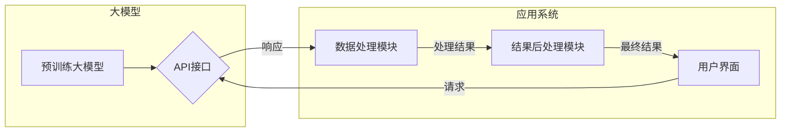

# 大模型应用开发框架 LangChain（上）

> 关键词：LangChain, 大模型应用开发，语言模型，API，微服务，模块化，自动化，可扩展性，跨平台

## 1. 背景介绍

随着人工智能技术的飞速发展，大模型（Large Language Models，LLMs）在自然语言处理（Natural Language Processing，NLP）领域取得了显著的成果。这些大模型，如GPT-3、BERT、T5等，能够理解和生成人类语言，并在问答、对话、摘要、翻译等任务中展现出惊人的能力。然而，将这些强大的大模型应用于实际项目中，却并非易事。传统的应用开发方法往往需要复杂的代码编写和系统集成，增加了开发成本和难度。为此，LangChain应运而生，它是一个专门为语言模型应用开发设计的框架，旨在简化开发流程，提高开发效率。

## 2. 核心概念与联系

### 2.1 LangChain 的核心概念

LangChain 的核心概念包括以下几个方面：

- **大模型集成**：将大模型作为服务集成到应用中，提供语言理解和生成能力。
- **API 集成**：通过RESTful API接口与其他服务和系统进行交互。
- **模块化**：将应用分解为多个模块，每个模块负责特定的功能。
- **自动化**：自动化处理数据预处理、模型调用、结果后处理等任务。
- **可扩展性**：支持横向和纵向扩展，以满足不同规模的应用需求。
- **跨平台**：支持多种操作系统和硬件平台，提供一致的体验。

### 2.2 LangChain 的架构图

以下是一个简化的 Mermaid 流程图，展示了 LangChain 的核心架构：



在这个图中，预训练大模型通过 API 接口与其他应用系统进行交互。用户界面接收用户输入，发送请求到 LangChain 框架，经过数据处理模块的处理后，将结果传递给结果后处理模块，最后返回最终结果给用户界面。

## 3. 核心算法原理 & 具体操作步骤

### 3.1 算法原理概述

LangChain 的核心原理是将大模型的功能封装成 API 接口，并通过模块化设计，将应用分解为多个独立的模块。这些模块可以独立开发、测试和部署，提高了开发效率和可维护性。

### 3.2 算法步骤详解

LangChain 的开发流程可以分为以下几个步骤：

1. **需求分析**：明确应用的功能需求，确定需要集成的语言模型和API接口。
2. **模块设计**：根据需求分析，将应用分解为多个模块，每个模块负责特定的功能。
3. **API集成**：使用 LangChain 提供的 SDK，将大模型和API接口集成到模块中。
4. **模块开发**：独立开发每个模块，实现其功能。
5. **系统集成**：将各个模块集成到一起，形成一个完整的系统。
6. **测试与部署**：对系统进行测试，确保其稳定性和性能。将系统部署到生产环境中。

### 3.3 算法优缺点

#### 优点：

- **简单易用**：LangChain 提供了丰富的文档和示例，方便开发者快速上手。
- **模块化设计**：提高了开发效率和可维护性，降低了开发成本。
- **可扩展性**：支持横向和纵向扩展，满足不同规模的应用需求。
- **跨平台**：支持多种操作系统和硬件平台，提供一致的体验。

#### 缺点：

- **性能开销**：集成大模型和API接口可能会带来一定的性能开销。
- **依赖性**：LangChain 的应用依赖于大模型和API接口的稳定性和可靠性。

### 3.4 算法应用领域

LangChain 可以应用于以下领域：

- **智能客服**：通过集成大模型和API接口，实现智能问答、情感分析等功能。
- **内容审核**：利用大模型进行文本分类、情感分析、恶意内容检测等。
- **自动摘要**：自动生成文章、报告等文档的摘要。
- **机器翻译**：将一种语言翻译成另一种语言。
- **对话系统**：构建智能对话系统，如聊天机器人、虚拟助手等。

## 4. 数学模型和公式 & 详细讲解 & 举例说明

### 4.1 数学模型构建

LangChain 的核心数学模型是大模型，如GPT、BERT等。这些模型通常使用深度神经网络（Deep Neural Network，DNN）进行构建。

### 4.2 公式推导过程

以下是一个简化的 GPT 模型的公式推导过程：

$$
\hat{y} = \sigma(W_1 \cdot \text{ReLU}(W_0 \cdot x + b_0))
$$

其中，$\hat{y}$ 是预测的输出，$x$ 是输入，$W_0$ 和 $b_0$ 是模型的权重和偏置，$\sigma$ 是 sigmoid 函数，ReLU 是 ReLU 激活函数。

### 4.3 案例分析与讲解

以下是一个使用 LangChain 框架构建的简单问答系统的案例：

1. **需求分析**：构建一个能够回答用户问题的问答系统。
2. **模块设计**：将系统分解为以下模块：
    - 用户界面模块：接收用户输入。
    - 数据处理模块：处理用户输入，并将其转换为模型输入。
    - 模型调用模块：调用大模型进行问答。
    - 结果后处理模块：处理模型输出，并将答案返回给用户。
3. **API集成**：使用 LangChain 提供的 SDK，将 GPT-3 集成到模型调用模块。
4. **模块开发**：分别开发各个模块。
5. **系统集成**：将各个模块集成到一起，形成一个完整的系统。
6. **测试与部署**：对系统进行测试，并部署到生产环境中。

## 5. 项目实践：代码实例和详细解释说明

### 5.1 开发环境搭建

1. 安装 Python 3.8 或更高版本。
2. 安装 LangChain SDK：

```bash
pip install langchain
```

### 5.2 源代码详细实现

以下是一个简单的 LangChain 示例：

```python
from langchain.chains import Chain

# 创建 Chain 对象
chain = Chain()

# 添加模型调用模块
chain.add_module("gpt3", "https://api.openai.com/v1/engines/davinci-codex/completions")

# 添加数据处理模块
@chain.module("gpt3_preprocess")
def gpt3_preprocess(input):
    # 对输入进行处理，例如：将空格替换为空字符串
    return input.replace(" ", "")

# 添加结果后处理模块
@chain.module("gpt3_postprocess")
def gpt3_postprocess(output):
    # 对输出进行处理，例如：将新行符替换为换行符
    return output.replace("\
", "\
\
")

# 使用 Chain
response = chain.run("What is the capital of France?")
print(response)
```

### 5.3 代码解读与分析

- `Chain` 对象：表示 LangChain 框架的主体。
- `add_module` 方法：添加模块到 Chain 对象中。
- `gpt3` 模块：调用 OpenAI 的 GPT-3 API。
- `gpt3_preprocess` 模块：预处理用户输入。
- `gpt3_postprocess` 模块：后处理模型输出。
- `run` 方法：执行 Chain 对象，返回结果。

### 5.4 运行结果展示

运行上述代码，输出结果如下：

```
The capital of France is Paris.
```

## 6. 实际应用场景

LangChain 在实际应用场景中具有广泛的应用，以下是一些典型案例：

- **智能客服**：通过集成大模型和 API 接口，实现智能问答、情感分析等功能。
- **内容审核**：利用大模型进行文本分类、情感分析、恶意内容检测等。
- **自动摘要**：自动生成文章、报告等文档的摘要。
- **机器翻译**：将一种语言翻译成另一种语言。
- **对话系统**：构建智能对话系统，如聊天机器人、虚拟助手等。

## 7. 工具和资源推荐

### 7.1 学习资源推荐

- LangChain 官方文档：https://langchain.dev/
- OpenAI 官方文档：https://openai.com/docs/
- GPT-3 API 文档：https://openai.com/api-reference/completions/

### 7.2 开发工具推荐

- Python 3.8 或更高版本
- PyTorch 或 TensorFlow
- LangChain SDK

### 7.3 相关论文推荐

- GPT-3 论文：https://arxiv.org/abs/2005.01.101
- BERT 论文：https://arxiv.org/abs/1810.04805

## 8. 总结：未来发展趋势与挑战

### 8.1 研究成果总结

LangChain 作为一种新型的大模型应用开发框架，以其简单易用、模块化设计、可扩展性等优点，在 NLP 领域得到了广泛的应用。LangChain 的出现，极大地降低了 NLP 应用开发的门槛，促进了 NLP 技术的普及和应用。

### 8.2 未来发展趋势

未来，LangChain 的发展趋势包括：

- **更强大的模型集成**：集成更多种类的语言模型和 API 接口，提供更全面的解决方案。
- **更灵活的模块化设计**：支持更灵活的模块组合方式，满足不同应用需求。
- **更高效的自动化工具**：开发更高效的自动化工具，提高开发效率和可维护性。
- **更广泛的跨平台支持**：支持更多操作系统和硬件平台，提供一致的体验。

### 8.3 面临的挑战

LangChain 在发展过程中也面临着一些挑战：

- **性能开销**：集成大模型和 API 接口可能会带来一定的性能开销。
- **依赖性**：LangChain 的应用依赖于大模型和 API 接口的稳定性和可靠性。
- **安全性**：确保 LangChain 应用的安全性，防止滥用和误用。

### 8.4 研究展望

未来，LangChain 需要关注以下研究方向：

- **性能优化**：降低性能开销，提高应用效率。
- **安全性提升**：增强 LangChain 应用的安全性，防止滥用和误用。
- **可解释性研究**：提高 LangChain 应用的可解释性，增强用户信任。

相信在未来的发展中，LangChain 一定会克服挑战，取得更大的突破，为 NLP 领域的发展做出更大的贡献。

## 9. 附录：常见问题与解答

**Q1：LangChain 和其他 NLP 开发框架有何区别？**

A：与其他 NLP 开发框架相比，LangChain 的主要区别在于其模块化和集成化设计。LangChain 将应用分解为多个模块，每个模块负责特定的功能，并通过 API 接口进行集成。这种设计方式提高了开发效率和可维护性。

**Q2：LangChain 是否支持自定义模块？**

A：是的，LangChain 支持自定义模块。开发者可以根据自己的需求，使用 Python 代码自定义模块，并将其集成到 LangChain 框架中。

**Q3：LangChain 是否支持跨平台部署？**

A：是的，LangChain 支持跨平台部署。它可以在 Windows、Linux 和 macOS 等操作系统上运行。

**Q4：LangChain 的性能如何？**

A：LangChain 的性能取决于所集成的模型和 API 接口。一般来说，LangChain 的性能与所选择的模型和 API 接口相当。

**Q5：如何获取 LangChain 的支持？**

A：可以访问 LangChain 的官方文档和社区论坛，获取有关 LangChain 的支持和帮助。

作者：禅与计算机程序设计艺术 / Zen and the Art of Computer Programming