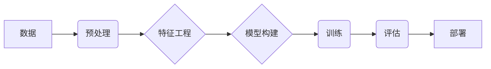

# 大模型训练的技术挑战:基础设施、算法与数据处理

> 关键词：大模型，训练挑战，基础设施，算法，数据处理，分布式训练，优化技术，数据质量控制，模型压缩

## 1. 背景介绍

随着深度学习技术的迅猛发展，大模型在自然语言处理、计算机视觉、语音识别等领域取得了显著的成果。大模型通常指的是拥有数亿甚至上千亿参数的神经网络模型，它们能够在海量的数据集上学习到丰富的特征和模式。然而，大模型的训练和部署面临着诸多技术挑战，这些挑战涉及基础设施、算法和数据处理等多个方面。

### 1.1 问题的由来

大模型的训练需要大量的计算资源和数据存储，同时，算法的效率和稳定性也是关键因素。此外，数据的质量和处理方式也对模型的性能产生重要影响。这些挑战迫使研究人员和工程师不断探索新的技术方案，以应对大模型训练的复杂性。

### 1.2 研究现状

目前，针对大模型训练的技术挑战，已经有很多研究和解决方案。例如，分布式训练、优化技术、数据质量控制等。然而，随着模型的规模和复杂性的增加，新的挑战也不断涌现。

### 1.3 研究意义

解决大模型训练的技术挑战对于推动人工智能技术的发展至关重要。它不仅能够提升模型的性能，还能够降低训练成本，加快模型部署的速度。

### 1.4 本文结构

本文将从基础设施、算法和数据处理三个方面，详细探讨大模型训练的技术挑战。具体内容安排如下：

- 第2部分，介绍大模型训练的核心概念和流程。
- 第3部分，分析大模型训练中的算法挑战，包括分布式训练、优化技术和模型压缩。
- 第4部分，讨论大模型训练中的数据处理挑战，包括数据质量控制、数据预处理和特征工程。
- 第5部分，通过实例展示如何使用深度学习框架进行大模型训练。
- 第6部分，分析大模型在实际应用场景中的表现和未来应用展望。
- 第7部分，推荐大模型训练相关的学习资源、开发工具和参考文献。
- 第8部分，总结大模型训练技术的发展趋势和面临的挑战。
- 第9部分，提供常见问题与解答。

## 2. 核心概念与联系

大模型训练涉及多个核心概念，包括：

- **深度学习**：一种使用神经网络进行数据建模的方法。
- **神经网络**：由大量神经元连接而成的计算模型，可以学习数据的复杂模式。
- **大规模数据集**：用于训练模型的大型数据集，通常包含数百万到数十亿个数据点。
- **计算资源**：用于训练模型的硬件资源，包括CPU、GPU和TPU等。
- **分布式训练**：将训练任务分配到多个计算节点上并行执行的方法。
- **优化技术**：用于提高训练效率和学习率调整等策略。
- **数据预处理**：对原始数据进行清洗、转换和标准化等操作。
- **特征工程**：从数据中提取有助于模型学习的特征。

以下是这些概念之间的Mermaid流程图：



## 3. 核心算法原理 & 具体操作步骤

### 3.1 算法原理概述

大模型训练的核心算法包括：

- **深度学习框架**：提供模型构建、训练和评估的软件工具，如TensorFlow、PyTorch等。
- **分布式训练**：将训练任务分配到多个计算节点上并行执行，以提高训练速度。
- **优化技术**：包括学习率调整、批量归一化、Dropout等，以提高模型的稳定性和性能。
- **模型压缩**：通过剪枝、量化和知识蒸馏等方法减小模型尺寸，加快推理速度。

### 3.2 算法步骤详解

大模型训练的步骤通常包括：

1. **数据预处理**：清洗、转换和标准化数据。
2. **特征工程**：从数据中提取有助于模型学习的特征。
3. **模型构建**：使用深度学习框架构建神经网络模型。
4. **分布式训练**：将模型和数据分配到多个计算节点上。
5. **优化训练**：使用优化技术调整模型参数，以最小化损失函数。
6. **评估模型**：在验证集上评估模型的性能。
7. **模型压缩**：减小模型尺寸，以提高推理速度。
8. **模型部署**：将模型部署到生产环境中。

### 3.3 算法优缺点

分布式训练、优化技术和模型压缩各有优缺点：

- **分布式训练**：优点是训练速度快，缺点是实施复杂，需要复杂的网络架构和同步机制。
- **优化技术**：优点是提高模型的稳定性和性能，缺点是可能增加训练时间。
- **模型压缩**：优点是减小模型尺寸，加快推理速度，缺点是可能牺牲一些性能。

### 3.4 算法应用领域

这些算法在大模型训练中广泛应用于以下领域：

- **自然语言处理**：如文本分类、机器翻译、问答系统等。
- **计算机视觉**：如图像识别、目标检测、视频分析等。
- **语音识别**：如语音转文字、语音合成等。

## 4. 数学模型和公式 & 详细讲解 & 举例说明

### 4.1 数学模型构建

大模型的数学模型通常基于神经网络，其中最常用的神经网络是卷积神经网络（CNN）和循环神经网络（RNN）。以下是CNN的数学模型：

$$
\hat{y} = f(W_L \cdot f(W_{L-1} \cdot ... \cdot f(W_1 \cdot x + b_1) + b_L) + b_L)
$$

其中，$f$ 是激活函数，$W$ 和 $b$ 分别是权重和偏置。

### 4.2 公式推导过程

CNN的公式推导过程涉及到前向传播和反向传播算法。以下是前向传播的推导过程：

1. 输入数据 $x$ 通过第一层卷积层，得到特征图 $h_1$。
2. 将 $h_1$ 通过激活函数 $f$，得到激活后的特征图 $a_1$。
3. 将 $a_1$ 通过池化层，得到池化后的特征图 $p_1$。
4. 重复以上步骤，最终得到最后一层的输出 $\hat{y}$。

### 4.3 案例分析与讲解

以下是一个简单的CNN模型在图像识别任务中的应用案例：

1. **数据准备**：收集并预处理图像数据，将其转换为模型所需的格式。
2. **模型构建**：使用深度学习框架构建CNN模型。
3. **训练模型**：使用训练数据训练模型，通过反向传播算法更新模型参数。
4. **评估模型**：在验证集上评估模型的性能，调整模型参数。
5. **模型部署**：将模型部署到生产环境中，对新的图像进行识别。

## 5. 项目实践：代码实例和详细解释说明

### 5.1 开发环境搭建

以下是在Python环境下使用PyTorch框架进行大模型训练的步骤：

1. 安装Python和PyTorch：从官网下载并安装Python和PyTorch。
2. 创建虚拟环境：使用Anaconda创建一个虚拟环境。
3. 安装其他依赖库：安装NumPy、Pandas等依赖库。

### 5.2 源代码详细实现

以下是一个简单的CNN模型在图像识别任务中的PyTorch代码实现：

```python
import torch
import torch.nn as nn
import torch.optim as optim

# 定义CNN模型
class CNN(nn.Module):
    def __init__(self):
        super(CNN, self).__init__()
        self.conv1 = nn.Conv2d(1, 20, 5)
        self.pool = nn.MaxPool2d(2, 2)
        self.conv2 = nn.Conv2d(20, 50, 5)
        self.fc1 = nn.Linear(50 * 4 * 4, 500)
        self.fc2 = nn.Linear(500, 10)
        self.relu = nn.ReLU()

    def forward(self, x):
        x = self.pool(self.relu(self.conv1(x)))
        x = self.pool(self.relu(self.conv2(x)))
        x = x.view(-1, 50 * 4 * 4)
        x = self.relu(self.fc1(x))
        x = self.fc2(x)
        return x

# 创建模型实例
model = CNN()

# 定义损失函数和优化器
criterion = nn.CrossEntropyLoss()
optimizer = optim.SGD(model.parameters(), lr=0.001)

# 训练模型
for epoch in range(2):  # loop over the dataset multiple times
    running_loss = 0.0
    for i, data in enumerate(trainloader, 0):
        # get the inputs; data is a list of [inputs, labels]
        inputs, labels = data

        # zero the parameter gradients
        optimizer.zero_grad()

        # forward + backward + optimize
        outputs = model(inputs)
        loss = criterion(outputs, labels)
        loss.backward()
        optimizer.step()

        # print statistics
        running_loss += loss.item()
        if i % 2000 == 1999:    # print every 2000 mini-batches
            print('[%d, %5d] loss: %.3f' %
                  (epoch + 1, i + 1, running_loss / 2000))
            running_loss = 0.0

print('Finished Training')
```

### 5.3 代码解读与分析

以上代码实现了一个简单的CNN模型，用于图像识别任务。模型包含两个卷积层和两个全连接层。在训练过程中，模型使用反向传播算法更新参数，以最小化损失函数。

### 5.4 运行结果展示

运行上述代码，可以在训练集和验证集上评估模型的性能。根据性能指标调整模型结构和参数，以提高模型的准确率。

## 6. 实际应用场景

大模型在实际应用场景中的表现如下：

- **自然语言处理**：大模型在文本分类、机器翻译、问答系统等任务中取得了显著的成果。
- **计算机视觉**：大模型在图像识别、目标检测、视频分析等任务中取得了突破性进展。
- **语音识别**：大模型在语音转文字、语音合成等任务中提高了识别和合成质量。

## 7. 工具和资源推荐

### 7.1 学习资源推荐

- 《深度学习》（Goodfellow, Bengio, Courville著）
- 《深度学习快速入门》（Ian Goodfellow, Yoshua Bengio, Aaron Courville著）
- 《PyTorch深度学习实战》（Antonio Gulli著）

### 7.2 开发工具推荐

- PyTorch：开源深度学习框架，适合快速开发。
- TensorFlow：开源深度学习框架，适合大规模应用。
- Keras：Python深度学习库，简单易用。

### 7.3 相关论文推荐

- "ImageNet Classification with Deep Convolutional Neural Networks"（Alex Krizhevsky等）
- "Distributed Training of Deep Neural Networks"（Quoc V. Le等）
- "BERT: Pre-training of Deep Bidirectional Transformers for Language Understanding"（Jacob Devlin等）

## 8. 总结：未来发展趋势与挑战

### 8.1 研究成果总结

大模型训练技术在过去几年取得了显著的进展，包括：

- 分布式训练技术的成熟
- 优化技术的不断改进
- 数据处理方法的创新

### 8.2 未来发展趋势

未来大模型训练技术的发展趋势包括：

- 模型规模的进一步扩大
- 分布式训练的优化
- 模型压缩和加速
- 无监督和半监督学习技术的融合

### 8.3 面临的挑战

大模型训练技术面临的挑战包括：

- 计算资源需求
- 数据质量控制
- 模型可解释性
- 模型安全性和隐私保护

### 8.4 研究展望

未来大模型训练技术的研究展望包括：

- 开发更加高效、可解释、安全的模型
- 探索新的训练范式，如迁移学习和多模态学习
- 将大模型应用于更多领域，如医疗、金融、教育等

## 9. 附录：常见问题与解答

**Q1：大模型训练需要多少计算资源？**

A：大模型训练需要大量的计算资源，包括CPU、GPU和TPU等。具体的资源需求取决于模型的规模和训练数据的大小。

**Q2：如何提高大模型的训练效率？**

A：提高大模型的训练效率可以通过以下方法实现：

- 使用分布式训练
- 优化算法和优化器
- 减小模型尺寸

**Q3：如何处理训练数据？**

A：处理训练数据包括以下步骤：

- 数据清洗
- 数据转换
- 数据标准化

**Q4：如何保证模型的可解释性？**

A：保证模型的可解释性可以通过以下方法实现：

- 使用可解释的模型结构
- 分析模型的决策过程
- 使用可视化技术

**Q5：如何保证模型的安全性？**

A：保证模型的安全性可以通过以下方法实现：

- 限制模型访问敏感数据
- 使用加密技术
- 建立模型审查机制

---

作者：禅与计算机程序设计艺术 / Zen and the Art of Computer Programming