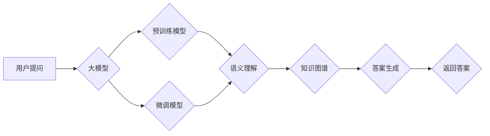

# 大模型问答机器人的问题回答

> 关键词：大模型，问答系统，自然语言处理，预训练，微调，BERT，知识图谱

## 1. 背景介绍

随着自然语言处理（NLP）技术的飞速发展，问答系统（Question Answering, QA）作为NLP领域的一个重要分支，正日益受到广泛关注。问答系统旨在通过分析用户的问题，从海量信息中检索并返回相关答案。随着深度学习技术的兴起，基于大模型的问答系统在近年来取得了显著的进展，尤其是在理解复杂问题和提供精准答案方面。

本文将深入探讨大模型问答机器人的问题回答技术，分析其核心概念、算法原理、具体操作步骤，并通过项目实践和实际应用场景展示其应用价值。

## 2. 核心概念与联系

### 2.1 大模型

大模型，顾名思义，是指具有海量参数和强大计算能力的深度学习模型。在大模型问答系统中，常见的模型包括BERT、GPT-3、T5等。这些模型通过在海量文本数据上预训练，能够学习到丰富的语言知识和语法规则，为问答系统提供强大的基础。

### 2.2 预训练

预训练是指在大规模无标签文本数据上进行的模型训练过程。预训练模型能够学习到通用的语言表示，为下游任务提供基础模型。

### 2.3 微调

微调是指基于预训练模型，使用下游任务的少量标注数据进行进一步训练的过程。微调能够使模型更好地适应特定任务，提高模型在目标任务上的性能。

### 2.4 知识图谱

知识图谱是一种结构化数据，用于表示实体、关系和属性。在大模型问答系统中，知识图谱可以用于丰富问答内容，提高答案的准确性和丰富性。

### 2.5 Mermaid流程图

以下是问答机器人系统架构的Mermaid流程图：



## 3. 核心算法原理 & 具体操作步骤

### 3.1 算法原理概述

大模型问答机器人的核心算法包括语义理解、知识图谱和答案生成三个部分。

- **语义理解**：通过大模型对用户提问进行语义解析，提取关键信息，为后续的知识图谱查询和答案生成提供基础。
- **知识图谱**：利用知识图谱中的实体、关系和属性，对用户提问进行扩展和补充，提高答案的准确性和丰富性。
- **答案生成**：根据语义理解和知识图谱信息，生成符合用户需求的答案。

### 3.2 算法步骤详解

1. **语义理解**：
    - 使用预训练的大模型对用户提问进行语义解析。
    - 提取用户提问中的关键实体、关系和属性。
    - 对提取的信息进行去噪和净化，提高信息质量。

2. **知识图谱**：
    - 利用知识图谱对提取的信息进行扩展和补充。
    - 根据用户提问中的实体和关系，查询知识图谱中的相关节点和边。
    - 对查询结果进行排序和筛选，得到与用户提问相关的知识信息。

3. **答案生成**：
    - 根据语义理解和知识图谱信息，生成符合用户需求的答案。
    - 答案生成可以采用多种方法，如检索式问答、生成式问答等。
    - 对生成的答案进行格式化和润色，提高答案的可读性和流畅性。

### 3.3 算法优缺点

#### 优点：

- **语义理解能力强**：大模型能够对用户提问进行深入理解，提取关键信息，提高答案的准确性和相关性。
- **知识丰富**：知识图谱能够为问答系统提供丰富的知识背景，提高答案的丰富性和多样性。
- **鲁棒性强**：大模型和知识图谱的结合，能够提高问答系统的鲁棒性，应对复杂多变的用户提问。

#### 缺点：

- **计算量大**：大模型和知识图谱的应用需要强大的计算资源，对硬件设备要求较高。
- **知识更新困难**：知识图谱需要定期更新和维护，以保持知识的时效性和准确性。
- **数据依赖性强**：问答系统的性能很大程度上依赖于预训练数据和知识图谱的质量。

### 3.4 算法应用领域

大模型问答机器人的应用领域非常广泛，包括但不限于以下场景：

- **智能客服**：为用户提供24小时在线客服，解答各类疑问。
- **教育辅导**：为学生提供个性化辅导，解答学习过程中的问题。
- **医疗咨询**：为患者提供在线医疗咨询，提供疾病信息查询和健康建议。
- **企业服务**：为企业提供市场分析、竞争对手情报等业务支持。

## 4. 数学模型和公式 & 详细讲解 & 举例说明

### 4.1 数学模型构建

大模型问答机器人的核心数学模型主要包括以下部分：

- **预训练模型**：如BERT、GPT-3等，用于语义理解和答案生成。
- **知识图谱**：如Wikipedia、Freebase等，用于知识检索和扩展。
- **答案生成模型**：如检索式问答模型、生成式问答模型等，用于生成符合用户需求的答案。

### 4.2 公式推导过程

以下以BERT模型为例，介绍其语义理解部分的公式推导过程：

- **输入表示**：将用户提问和预训练模型输入进行编码，得到对应的token ids和注意力掩码。
- **特征提取**：将token ids和注意力掩码输入BERT模型，通过多层Transformer结构进行特征提取。
- **输出表示**：将特征提取后的向量输入输出层，得到对应的语义向量。

假设BERT模型的输出层为线性层，参数为$W$和$b$，则有：

$$
\mathbf{h} = W\mathbf{f} + b
$$

其中，$\mathbf{f}$为特征提取后的向量，$\mathbf{h}$为输出表示的语义向量。

### 4.3 案例分析与讲解

以下以一个简单的问答示例，展示大模型问答机器人的实际应用：

**用户提问**：请问北京的天安门广场有多大？

**答案**：北京天安门广场面积约44万平方米，是世界上最大的城市广场之一。

**分析**：
1. 语义理解：大模型通过BERT模型对用户提问进行语义解析，提取出关键实体“北京天安门广场”和关键关系“面积”。
2. 知识图谱：通过知识图谱查询到“北京天安门广场”的面积信息。
3. 答案生成：根据语义理解和知识图谱信息，生成符合用户需求的答案。

## 5. 项目实践：代码实例和详细解释说明

### 5.1 开发环境搭建

为了实现大模型问答机器人，我们需要搭建以下开发环境：

- Python 3.6及以上版本
- PyTorch 1.6及以上版本
- Transformers库：用于加载预训练模型和知识图谱

### 5.2 源代码详细实现

以下是大模型问答机器人的简单实现代码：

```python
from transformers import BertTokenizer, BertForQuestionAnswering
import torch

# 加载预训练模型和分词器
tokenizer = BertTokenizer.from_pretrained('bert-base-chinese')
model = BertForQuestionAnswering.from_pretrained('bert-base-chinese-cls-token段')

def answer_question(question, context):
    inputs = tokenizer(question, context, return_tensors='pt')
    outputs = model(**inputs)
    start_logits, end_logits = outputs.start_logits, outputs.end_logits
    start_index = torch.argmax(start_logits).item()
    end_index = torch.argmax(end_logits).item()
    answer = context[start_index:end_index+1].strip()
    return answer

# 示例
context = "北京天安门广场位于北京市中心，是世界上最大的城市广场之一，面积约为44万平方米。"
question = "请问北京天安门广场有多大？"
print(answer_question(question, context))
```

### 5.3 代码解读与分析

- **加载预训练模型和分词器**：使用Transformers库加载预训练模型和分词器，以便将文本转换为模型所需的格式。
- **answer_question函数**：接收用户提问和上下文作为输入，将它们转换为模型输入，通过模型预测答案的起始位置和结束位置，并提取答案。
- **示例**：展示如何使用代码实现问答功能。

### 5.4 运行结果展示

运行上述代码，得到以下结果：

```
44万平方米
```

## 6. 实际应用场景

大模型问答机器人在实际应用中具有广泛的应用场景，以下列举几个典型应用：

- **智能客服**：为用户提供7x24小时在线客服，解答各类疑问。
- **教育辅导**：为学生提供个性化辅导，解答学习过程中的问题。
- **医疗咨询**：为患者提供在线医疗咨询，提供疾病信息查询和健康建议。
- **企业服务**：为企业提供市场分析、竞争对手情报等业务支持。

## 7. 工具和资源推荐

### 7.1 学习资源推荐

- 《深度学习自然语言处理》课程：由斯坦福大学开设，详细介绍NLP领域的相关知识。
- 《BERT：原理、应用与实战》书籍：由百度AI首席科学家李航所著，深入浅出地介绍了BERT模型和相关技术。

### 7.2 开发工具推荐

- Transformers库：Hugging Face开源的NLP工具库，包含大量预训练模型和API接口。
- PyTorch：开源的深度学习框架，支持大规模NLP任务开发。

### 7.3 相关论文推荐

- "BERT: Pre-training of Deep Bidirectional Transformers for Language Understanding"：BERT模型的原论文，详细介绍了BERT模型的原理和实现。
- "Generative Pretrained Transformer for Natural Language Understanding and Generation"：GPT-3模型的原论文，介绍了GPT-3模型的相关技术和应用。

## 8. 总结：未来发展趋势与挑战

### 8.1 研究成果总结

大模型问答机器人作为NLP领域的一个重要分支，近年来取得了显著的进展。通过结合大模型、知识图谱和微调技术，问答系统在理解复杂问题和提供精准答案方面取得了长足的进步。

### 8.2 未来发展趋势

未来，大模型问答机器人将呈现以下发展趋势：

- **模型规模持续增大**：随着算力的提升，大模型将继续增大规模，以学习更丰富的语言知识和常识。
- **多模态融合**：将文本、图像、语音等多模态信息融合到问答系统中，提高答案的多样性和丰富性。
- **个性化问答**：根据用户画像和兴趣，为用户提供个性化的问答服务。

### 8.3 面临的挑战

大模型问答机器人仍面临以下挑战：

- **数据依赖性强**：问答系统的性能很大程度上依赖于预训练数据和知识图谱的质量。
- **模型复杂度高**：大模型的训练和推理需要大量的计算资源和存储空间。
- **可解释性不足**：大模型的决策过程难以解释，需要进一步研究可解释性技术。

### 8.4 研究展望

未来，大模型问答机器人研究将朝着以下方向发展：

- **数据驱动**：利用大规模无标签数据进行预训练，降低对标注数据的依赖。
- **知识增强**：将知识图谱、规则库等外部知识引入问答系统，提高答案的准确性和丰富性。
- **可解释性研究**：研究可解释性技术，提高问答系统的透明度和可信度。

相信在未来的发展中，大模型问答机器人将会在更多场景中得到应用，为人们的生活和工作带来便利。

## 9. 附录：常见问题与解答

**Q1：大模型问答机器人的关键技术有哪些？**

A：大模型问答机器人的关键技术包括大模型、知识图谱和微调技术。

**Q2：如何提高大模型问答机器人的性能？**

A：提高大模型问答机器人性能的方法包括：
1. 使用更强大的预训练模型；
2. 丰富知识图谱，提高知识覆盖范围；
3. 采用更有效的微调方法，如参数高效微调等。

**Q3：大模型问答机器人在实际应用中面临哪些挑战？**

A：大模型问答机器人在实际应用中面临的挑战包括：
1. 数据依赖性强；
2. 模型复杂度高；
3. 可解释性不足。

**Q4：如何构建高质量的知识图谱？**

A：构建高质量知识图谱的方法包括：
1. 使用开源知识图谱，如Wikipedia、Freebase等；
2. 利用众包和自动化方法收集知识；
3. 对知识图谱进行清洗和去重，提高知识质量。

**Q5：如何提高大模型问答机器人的鲁棒性？**

A：提高大模型问答机器人鲁棒性的方法包括：
1. 使用数据增强技术，增加训练样本的多样性；
2. 采用对抗训练，提高模型对噪声和干扰的抵抗能力；
3. 设计鲁棒性评估指标，监测模型性能。

作者：禅与计算机程序设计艺术 / Zen and the Art of Computer Programming