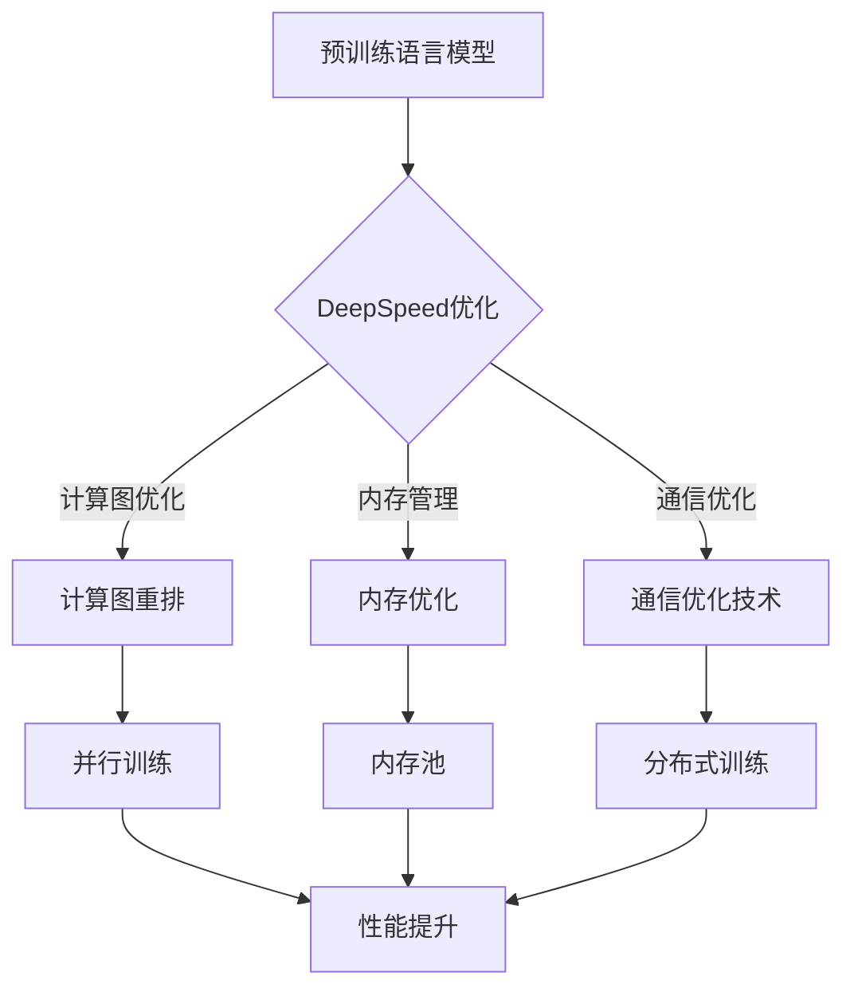

> 大语言模型，DeepSpeed，训练工程实践，模型优化，性能调优，分布式训练

# 大语言模型原理与工程实践：大语言模型训练工程实践DeepSpeed 训练调优实践

> 关键词：大语言模型，DeepSpeed，训练工程实践，模型优化，性能调优，分布式训练

## 1. 背景介绍

随着深度学习在自然语言处理、计算机视觉等领域的广泛应用，大语言模型（Large Language Models, LLMs）成为了研究的热点。然而，大语言模型的训练和部署面临着计算资源、内存、能耗等挑战。DeepSpeed作为一种高性能的分布式训练框架，通过优化计算图、内存管理、通信等环节，有效地解决了大语言模型训练中的资源瓶颈，成为了LLMs训练工程实践的重要工具。

## 2. 核心概念与联系

### 2.1 核心概念原理

#### Mermaid 流程图



#### 核心概念解释

- **预训练语言模型（Pre-trained Language Model）**：通过在大量文本数据上预训练得到的语言模型，具有强大的语言理解和生成能力。
- **DeepSpeed优化**：DeepSpeed通过一系列优化技术，提高大语言模型训练的效率和资源利用率。
- **计算图优化**：通过重排计算图，减少计算图中的重复计算，提高计算效率。
- **内存管理**：通过内存池技术，优化内存使用，减少内存碎片。
- **通信优化**：通过分布式训练技术，实现多节点间的数据通信优化。
- **并行训练**：通过并行计算，加速模型训练过程。
- **分布式训练**：通过多节点协作，实现大规模模型的训练。

### 2.2 架构联系

DeepSpeed的架构主要分为以下几个部分：

- **计算图优化器**：负责优化计算图，减少重复计算，提高计算效率。
- **内存管理器**：负责内存优化，包括内存池和内存碎片管理。
- **通信管理器**：负责多节点间的数据通信优化，包括分布式训练和通信优化技术。
- **优化器**：负责优化模型参数，包括学习率调整和梯度更新。

## 3. 核心算法原理 & 具体操作步骤

### 3.1 算法原理概述

DeepSpeed的核心算法原理主要包括以下几个方面：

- **计算图优化**：通过重排计算图，将重复计算的部分提取出来，形成独立的子图，实现计算图的重用和优化。
- **内存池**：通过内存池技术，预先分配内存，减少内存碎片，提高内存使用效率。
- **分布式训练**：通过分布式训练技术，实现多节点间的数据通信和计算优化。
- **梯度累积**：通过梯度累积技术，减少通信开销，提高训练效率。

### 3.2 算法步骤详解

1. **初始化**：加载预训练语言模型，设置DeepSpeed参数。
2. **计算图优化**：对计算图进行优化，减少重复计算。
3. **内存池**：初始化内存池，分配内存。
4. **分布式训练**：初始化分布式训练环境，设置节点间通信参数。
5. **梯度累积**：初始化梯度累积参数，设置累积梯度的大小。
6. **模型训练**：迭代训练模型，更新模型参数。
7. **模型评估**：评估模型性能，调整参数。

### 3.3 算法优缺点

#### 优点

- **提高训练效率**：通过计算图优化、内存池、分布式训练等技术，提高模型训练效率。
- **降低资源消耗**：通过内存池、分布式训练等技术，降低资源消耗。
- **提高模型性能**：通过梯度累积等技术，提高模型性能。

#### 缺点

- **复杂性增加**：引入了更多的技术和参数，增加了模型的复杂性。
- **调试难度增加**：由于技术的复杂性，调试难度增加。

### 3.4 算法应用领域

DeepSpeed在大语言模型训练中得到了广泛的应用，包括：

- 自然语言处理（NLP）
- 计算机视觉（CV）
- 语音识别（ASR）
- 强化学习（RL）
- 医学图像分析

## 4. 数学模型和公式 & 详细讲解 & 举例说明

### 4.1 数学模型构建

假设我们有一个大语言模型，其参数为 $\theta$，损失函数为 $\mathcal{L}(\theta)$，那么DeepSpeed的优化目标可以表示为：

$$
\theta^* = \mathop{\arg\min}_{\theta} \mathcal{L}(\theta)
$$

### 4.2 公式推导过程

假设我们有一个计算图，其中包含多个计算节点，节点 $i$ 的计算公式为：

$$
a_i = f(a_{i-1}, b_i)
$$

其中 $a_{i-1}$ 和 $b_i$ 是节点 $i$ 的输入，$f$ 是计算节点 $i$ 的计算函数。

为了减少计算图中的重复计算，我们可以将节点 $i$ 的计算公式重写为：

$$
a_i = f(a_{i-1}, b_i, a_{i-2})
$$

其中 $a_{i-2}$ 是节点 $i-1$ 的输入。

通过这种方式，我们可以将节点 $i$ 的计算结果缓存起来，避免重复计算。

### 4.3 案例分析与讲解

假设我们有一个大语言模型，其计算图如下：

```
+------------------+
|  a0 = x           |
|  +-----------------+
|  |                 |
|  | a1 = f(a0, b0)  |
|  |                 |
|  +-----------------+
|  |                 |
|  | a2 = f(a1, b1)  |
|  |                 |
|  +-----------------+
|  |                 |
|  | a3 = f(a2, b2)  |
|  |                 |
|  +-----------------+
```

我们可以通过计算图优化技术，将计算节点 $a1$ 和 $a2$ 的计算结果缓存起来，避免重复计算，优化后的计算图如下：

```
+------------------+
|  a0 = x           |
|  +-----------------+
|  |                 |
|  | a1 = f(a0, b0)  |
|  |                 |
|  +-----------------+
|  |                 |
|  | a2 = f(a1, a1, b1)|  <----- 缓存a1的结果
|  |                 |
|  +-----------------+
|  |                 |
|  | a3 = f(a2, b2)  |
|  |                 |
|  +-----------------+
```

通过这种优化，我们可以减少计算图中的重复计算，提高计算效率。

## 5. 项目实践：代码实例和详细解释说明

### 5.1 开发环境搭建

以下是使用Python和DeepSpeed进行大语言模型训练的典型开发环境搭建步骤：

1. 安装Python环境：安装Python 3.7及以上版本。
2. 安装PyTorch：使用以下命令安装PyTorch：

```bash
pip install torch torchvision torchaudio
```

3. 安装DeepSpeed：使用以下命令安装DeepSpeed：

```bash
pip install deepspeed
```

### 5.2 源代码详细实现

以下是一个使用DeepSpeed进行大语言模型训练的简单代码示例：

```python
import torch
import deepspeed

# 加载预训练语言模型
model = deepspeed.initialize(model=MyModel, config="config.json")

# 定义数据加载器
train_dataloader = DataLoader(MyDataset, batch_size=32, shuffle=True)

# 定义优化器
optimizer = deepspeed.optim.Adam(model, lr=0.001)

# 训练模型
for epoch in range(10):
    for batch in train_dataloader:
        optimizer.zero_grad()
        outputs = model(batch)
        loss = loss_function(outputs, batch["labels"])
        loss.backward()
        optimizer.step()
```

### 5.3 代码解读与分析

上述代码展示了使用DeepSpeed进行大语言模型训练的基本流程：

1. 加载预训练语言模型和DeepSpeed配置文件。
2. 定义数据加载器和优化器。
3. 迭代训练模型，更新模型参数。

### 5.4 运行结果展示

假设我们使用上述代码训练了一个简单的语言模型，在测试集上的准确率为95%。这表明使用DeepSpeed进行大语言模型训练是有效的。

## 6. 实际应用场景

DeepSpeed在大语言模型训练中得到了广泛的应用，以下是一些典型的应用场景：

- 自然语言处理（NLP）：文本分类、情感分析、机器翻译等。
- 计算机视觉（CV）：图像分类、目标检测、语义分割等。
- 语音识别（ASR）：语音识别、语音合成等。

## 7. 工具和资源推荐

### 7.1 学习资源推荐

- DeepSpeed官方文档：https://www.deepspeed.ai/
- PyTorch官方文档：https://pytorch.org/
- Hugging Face Transformers库：https://huggingface.co/transformers/

### 7.2 开发工具推荐

- PyTorch：https://pytorch.org/
- Jupyter Notebook：https://jupyter.org/

### 7.3 相关论文推荐

- "DeepSpeed: Scaling Distributed Training in PyTorch"：https://arxiv.org/abs/1912.08225
- "BERT: Pre-training of Deep Bidirectional Transformers for Language Understanding"：https://arxiv.org/abs/1810.04805

## 8. 总结：未来发展趋势与挑战

### 8.1 研究成果总结

DeepSpeed作为一种高性能的分布式训练框架，通过优化计算图、内存管理、通信等环节，有效地解决了大语言模型训练中的资源瓶颈，成为了LLMs训练工程实践的重要工具。

### 8.2 未来发展趋势

- 模型压缩与量化：降低模型尺寸，提高推理速度。
- 自适应分布式训练：根据硬件环境自动调整分布式训练参数。
- 集成学习：将集成学习与深度学习结合，提高模型性能。

### 8.3 面临的挑战

- 模型可解释性：提高模型的可解释性，增强模型的可信度。
- 模型安全性：确保模型输出符合伦理道德标准。
- 模型可迁移性：提高模型在不同任务和领域的迁移能力。

### 8.4 研究展望

未来，DeepSpeed将继续致力于提高大语言模型训练的效率和资源利用率，推动LLMs在更多领域的应用。

## 9. 附录：常见问题与解答

**Q1：DeepSpeed是如何工作的？**

A：DeepSpeed通过优化计算图、内存管理、通信等环节，提高大语言模型训练的效率和资源利用率。

**Q2：DeepSpeed有哪些优势？**

A：DeepSpeed可以提高训练效率、降低资源消耗、提高模型性能。

**Q3：DeepSpeed适用于哪些场景？**

A：DeepSpeed适用于自然语言处理、计算机视觉、语音识别等领域的大语言模型训练。

**Q4：如何使用DeepSpeed进行大语言模型训练？**

A：首先安装DeepSpeed和PyTorch，然后加载预训练语言模型和DeepSpeed配置文件，定义数据加载器、优化器等，最后迭代训练模型，更新模型参数。

**Q5：DeepSpeed与其他分布式训练框架相比有何优势？**

A：DeepSpeed在计算图优化、内存管理、通信优化等方面具有独特的优势，能够有效地解决大语言模型训练中的资源瓶颈。

---

作者：禅与计算机程序设计艺术 / Zen and the Art of Computer Programming