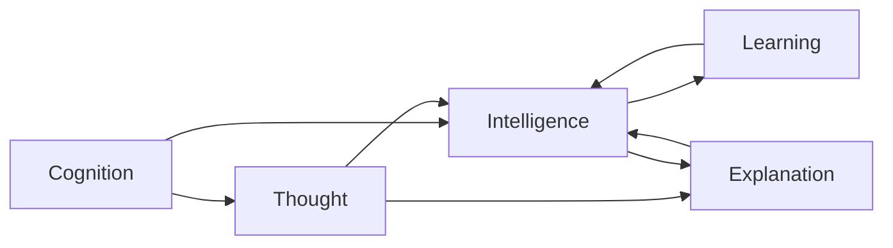
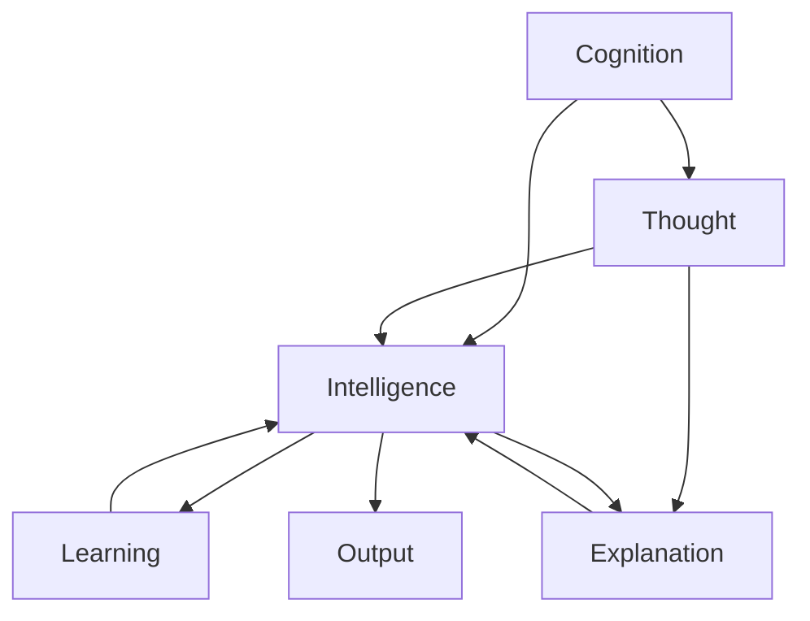
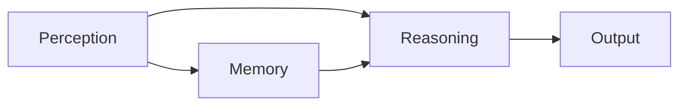
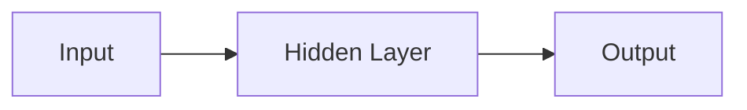

                 

# 认知的形式化：不论是认知、思维，还是智能，都是指学习的能力，以及解释、解决问题的能力

在人工智能的征程上，我们不断探索如何让机器拥有人类的智能。而要实现这一目标，理解“认知”、“思维”和“智能”的内涵是至关重要的第一步。本文将深入探讨认知的形式化，解释认知、思维和智能的本质，以及它们如何通过学习的能力和解释、解决问题的能力得到实现。

## 1. 背景介绍

### 1.1 问题由来

随着人工智能技术的飞速发展，认知这一概念在机器学习中显得尤为重要。认知，广义上指人类的大脑如何理解、处理和记忆信息，狭义上则指人类能够处理复杂任务、进行逻辑推理和抽象思考的能力。

为了实现机器的认知功能，科学家们提出了许多方法和模型，如符号推理、专家系统、神经网络等。然而，这些方法往往缺乏对认知过程的深刻理解，难以处理复杂的现实世界问题。因此，深入理解认知的形式化，尤其是认知、思维和智能三者之间的关系，是当前人工智能研究的热点问题之一。

### 1.2 问题核心关键点

认知的形式化研究涉及以下几个核心关键点：

- **认知与思维**：认知指对信息的感知、理解和记忆，思维指对信息的分析和处理。认知和思维密切相关，认知是思维的基础，思维是认知的高级表现。
- **智能与认知**：智能是认知能力的具体体现，指在复杂环境下的决策和行动能力。智能的实现离不开认知的支撑，只有理解认知，才能更好地实现智能。
- **学习与认知**：认知和学习是相互促进的关系。认知能力是通过学习不断积累和提升的，而学习的效率和效果也受到认知水平的影响。

### 1.3 问题研究意义

深入研究认知的形式化，对于理解人工智能的未来发展方向具有重要意义。它不仅有助于提升机器的认知能力，还能够为解决现实世界复杂问题提供新的思路和方法。

## 2. 核心概念与联系

### 2.1 核心概念概述

认知的形式化研究涉及多个核心概念：

- **认知(Cognition)**：指人类大脑对信息进行感知、理解、记忆和处理的能力。
- **思维(Thought)**：指对信息的分析和处理，包括推理、判断、抽象等高级认知过程。
- **智能(Intelligence)**：指在复杂环境下的决策和行动能力，包括感知、推理、规划和执行等过程。
- **学习(Learning)**：指通过经验积累和数据驱动，提升认知和思维能力的过程。
- **解释(Explanation)**：指对认知和思维过程的分析和描述，以增强模型的可解释性和透明度。
- **解决问题(Solving Problems)**：指通过认知和思维过程，找到复杂问题的解决方案。

这些概念相互关联，共同构成了认知的形式化研究框架。以下是一个Mermaid流程图，展示了这些概念之间的联系：



### 2.2 概念间的关系

这些核心概念之间存在紧密的联系，形成一个完整的认知研究框架。

- **认知与思维的关系**：认知是思维的基础，思维是对认知的高级表现。例如，认知包括对信息的感知、理解、记忆和处理，而思维则是对这些信息的分析和处理，如推理、判断、抽象等。
- **智能与认知的关系**：智能是认知能力的具体体现，指在复杂环境下的决策和行动能力。智能的实现离不开认知的支撑，只有理解认知，才能更好地实现智能。
- **学习与认知的关系**：认知和学习是相互促进的关系。认知能力是通过学习不断积累和提升的，而学习的效率和效果也受到认知水平的影响。
- **解释与认知的关系**：解释是对认知和思维过程的分析和描述，以增强模型的可解释性和透明度。解释有助于理解模型的决策过程，从而提高模型的可信度和应用范围。
- **解决问题与认知的关系**：解决问题是通过认知和思维过程，找到复杂问题的解决方案。解决复杂问题需要良好的认知和思维能力，只有具备这些能力，才能更好地实现智能。

### 2.3 核心概念的整体架构

认知的形式化研究涉及多个核心概念，这些概念之间存在复杂的相互作用。以下是一个综合的流程图，展示了这些概念在大语言模型微调中的应用：



## 3. 核心算法原理 & 具体操作步骤

### 3.1 算法原理概述

认知的形式化研究涉及多个核心算法，其中最常用的是基于神经网络的认知模型。这些模型通过学习大量数据，构建复杂的神经网络结构，从而实现对认知、思维和智能的模拟。

认知模型通常分为感知层、记忆层和推理层三部分。感知层负责信息的输入和处理，记忆层负责信息的存储和提取，推理层负责信息的分析和处理。以下是一个简单的认知模型的架构：



### 3.2 算法步骤详解

认知模型的构建通常包括以下几个关键步骤：

**Step 1: 准备数据集**

准备好适合认知模型训练的数据集，这些数据集应该涵盖复杂的信息处理任务，如语音识别、图像分类、自然语言处理等。数据集的质量和多样性对模型的性能有重要影响。

**Step 2: 设计神经网络结构**

选择合适的神经网络结构，如卷积神经网络、循环神经网络、变压器等，构建认知模型。网络结构的选择应该根据任务的复杂程度和数据特点进行优化。

**Step 3: 训练模型**

使用准备好的数据集，对认知模型进行训练。训练过程通常包括前向传播、损失计算、反向传播和参数更新等步骤。训练过程中，需要选择合适的损失函数、优化算法和超参数，以提高模型的性能。

**Step 4: 评估模型**

在训练完成后，使用测试集对模型进行评估。评估指标包括准确率、精确率、召回率、F1值等。根据评估结果，进一步调整模型的参数和结构，提高模型的性能。

**Step 5: 部署模型**

将训练好的模型部署到实际应用中，进行实时推理和决策。部署过程中，需要考虑模型的大小、推理速度、资源需求等因素，选择合适的部署方式和工具。

### 3.3 算法优缺点

认知模型的优点包括：

- **高效性**：认知模型通过学习大量数据，能够快速处理复杂的认知任务。
- **可扩展性**：认知模型可以通过增加网络层数和参数，提高模型的复杂度和性能。
- **鲁棒性**：认知模型在处理噪声和不确定性方面具有较强的鲁棒性，能够适应多种复杂环境。

认知模型的缺点包括：

- **数据依赖**：认知模型的性能高度依赖于数据的质量和多样性，数据不足可能导致模型性能下降。
- **复杂性**：认知模型的结构复杂，训练和部署过程较为繁琐，需要大量的计算资源和时间。
- **可解释性不足**：认知模型的决策过程较为复杂，难以解释和理解。

### 3.4 算法应用领域

认知的形式化研究在多个领域都有广泛的应用，包括：

- **自然语言处理(NLP)**：认知模型在自然语言处理任务中表现出色，如机器翻译、文本分类、命名实体识别等。
- **计算机视觉**：认知模型在图像识别、目标检测、语义分割等计算机视觉任务中也有广泛应用。
- **语音识别**：认知模型在语音识别、语音合成等任务中表现出色，如语音助手、自动字幕生成等。
- **机器人**：认知模型在机器人导航、避障、交互等任务中发挥重要作用，提升机器人的智能水平。
- **智能推荐系统**：认知模型在推荐系统中的个性化推荐、用户行为预测等方面表现出色，提升用户体验。

## 4. 数学模型和公式 & 详细讲解 & 举例说明

### 4.1 数学模型构建

认知的形式化研究涉及多个数学模型，其中最常用的是基于神经网络的认知模型。以下是一个简单的认知模型的数学模型：

设输入数据为 $x$，输出为 $y$，模型参数为 $\theta$，则认知模型的数学模型可以表示为：

$$
y = f(x; \theta)
$$

其中，$f$ 为神经网络的前向传播过程，$\theta$ 为模型的参数。

### 4.2 公式推导过程

以下以神经网络为例，推导认知模型的数学模型和公式：

假设神经网络的结构为：



其中，输入层为 $x$，隐藏层为 $h$，输出层为 $y$。则前向传播过程可以表示为：

$$
h = \sigma(W_hx + b_h)
$$

$$
y = \sigma(W_yh + b_y)
$$

其中，$\sigma$ 为激活函数，$W$ 为权重矩阵，$b$ 为偏置向量。

### 4.3 案例分析与讲解

以下是一个简单的案例，展示了如何构建和训练一个简单的认知模型：

假设我们有一个二分类问题，即判断一张图片是否为猫。我们准备了一组标注好的训练数据集，其中包含图片的像素值和标签。我们可以使用一个简单的卷积神经网络，对数据集进行训练，构建认知模型。训练过程包括前向传播、损失计算和反向传播等步骤。

以下是代码实现：

```python
import tensorflow as tf
from tensorflow.keras import layers, models

# 构建卷积神经网络
model = models.Sequential()
model.add(layers.Conv2D(32, (3, 3), activation='relu', input_shape=(28, 28, 1)))
model.add(layers.MaxPooling2D((2, 2)))
model.add(layers.Conv2D(64, (3, 3), activation='relu'))
model.add(layers.MaxPooling2D((2, 2)))
model.add(layers.Conv2D(64, (3, 3), activation='relu'))
model.add(layers.Flatten())
model.add(layers.Dense(64, activation='relu'))
model.add(layers.Dense(1, activation='sigmoid'))

# 编译模型
model.compile(optimizer='adam', loss='binary_crossentropy', metrics=['accuracy'])

# 训练模型
model.fit(train_images, train_labels, epochs=5, batch_size=32)

# 评估模型
test_loss, test_acc = model.evaluate(test_images, test_labels)
print('Test accuracy:', test_acc)
```

在训练过程中，我们使用了Adam优化算法，损失函数为二元交叉熵，准确率为评估指标。训练完成后，我们得到模型的参数 $\theta$，可以用它对新的数据进行推理。

## 5. 项目实践：代码实例和详细解释说明

### 5.1 开发环境搭建

在进行认知模型训练时，我们需要准备好开发环境。以下是使用Python进行TensorFlow开发的环境配置流程：

1. 安装Anaconda：从官网下载并安装Anaconda，用于创建独立的Python环境。

2. 创建并激活虚拟环境：
```bash
conda create -n tf-env python=3.8 
conda activate tf-env
```

3. 安装TensorFlow：根据CUDA版本，从官网获取对应的安装命令。例如：
```bash
pip install tensorflow
```

4. 安装各类工具包：
```bash
pip install numpy pandas scikit-learn matplotlib tqdm jupyter notebook ipython
```

完成上述步骤后，即可在`tf-env`环境中开始训练认知模型。

### 5.2 源代码详细实现

下面我们以手写数字识别任务为例，给出使用TensorFlow构建卷积神经网络的代码实现。

首先，定义数据处理函数：

```python
import tensorflow as tf
import numpy as np
from tensorflow.keras import datasets, layers, models

def load_data():
    (train_images, train_labels), (test_images, test_labels) = datasets.mnist.load_data()
    train_images = train_images / 255.0
    test_images = test_images / 255.0
    train_images = train_images.reshape((-1, 28, 28, 1))
    test_images = test_images.reshape((-1, 28, 28, 1))
    return train_images, train_labels, test_images, test_labels
```

然后，定义认知模型：

```python
model = models.Sequential()
model.add(layers.Conv2D(32, (3, 3), activation='relu', input_shape=(28, 28, 1)))
model.add(layers.MaxPooling2D((2, 2)))
model.add(layers.Conv2D(64, (3, 3), activation='relu'))
model.add(layers.MaxPooling2D((2, 2)))
model.add(layers.Conv2D(64, (3, 3), activation='relu'))
model.add(layers.Flatten())
model.add(layers.Dense(64, activation='relu'))
model.add(layers.Dense(10, activation='softmax'))

# 编译模型
model.compile(optimizer='adam', loss='categorical_crossentropy', metrics=['accuracy'])

# 训练模型
train_images, train_labels, test_images, test_labels = load_data()
model.fit(train_images, train_labels, epochs=5, batch_size=32, validation_data=(test_images, test_labels))

# 评估模型
test_loss, test_acc = model.evaluate(test_images, test_labels)
print('Test accuracy:', test_acc)
```

### 5.3 代码解读与分析

让我们再详细解读一下关键代码的实现细节：

**load_data函数**：
- 定义了MNIST数据集加载函数，将数据集分为训练集和测试集。
- 对数据进行归一化处理，并将二维图像转换为四维张量，便于卷积操作。

**模型定义**：
- 使用Sequential模型定义了一个简单的卷积神经网络。
- 前向传播过程包括卷积、池化、全连接等层。
- 输出层为softmax分类器，用于预测数字类别。

**模型编译**：
- 使用Adam优化算法，损失函数为交叉熵，评估指标为准确率。

**模型训练**：
- 使用训练集数据进行模型训练。
- 定义训练的epoch数和batch大小。
- 使用测试集数据进行模型验证。

**模型评估**：
- 使用测试集数据对模型进行评估。
- 输出模型的准确率。

可以看到，TensorFlow提供了方便的API，使得认知模型的构建和训练变得简单高效。开发者可以更专注于算法和模型改进，而不必过多关注底层实现细节。

## 6. 实际应用场景

### 6.1 自然语言处理(NLP)

认知模型在自然语言处理领域表现出色，能够处理复杂的文本数据，如文本分类、情感分析、命名实体识别等。以下是一个简单的NLP任务案例：

```python
import tensorflow as tf
from tensorflow.keras import layers, models

# 定义模型
model = models.Sequential()
model.add(layers.Embedding(input_dim=10000, output_dim=16))
model.add(layers.LSTM(32))
model.add(layers.Dense(1, activation='sigmoid'))

# 编译模型
model.compile(optimizer='adam', loss='binary_crossentropy', metrics=['accuracy'])

# 训练模型
model.fit(train_data, train_labels, epochs=5, batch_size=32)

# 评估模型
test_loss, test_acc = model.evaluate(test_data, test_labels)
print('Test accuracy:', test_acc)
```

在训练过程中，我们使用了Embedding层将文本数据转换为向量表示，LSTM层进行序列建模，全连接层进行二分类。训练完成后，我们可以使用模型对新的文本数据进行推理，获得情感分析结果。

### 6.2 计算机视觉

认知模型在计算机视觉领域也有广泛应用，如图像分类、目标检测、语义分割等。以下是一个简单的计算机视觉任务案例：

```python
import tensorflow as tf
from tensorflow.keras import layers, models

# 定义模型
model = models.Sequential()
model.add(layers.Conv2D(32, (3, 3), activation='relu', input_shape=(32, 32, 3)))
model.add(layers.MaxPooling2D((2, 2)))
model.add(layers.Conv2D(64, (3, 3), activation='relu'))
model.add(layers.MaxPooling2D((2, 2)))
model.add(layers.Conv2D(64, (3, 3), activation='relu'))
model.add(layers.Flatten())
model.add(layers.Dense(64, activation='relu'))
model.add(layers.Dense(10, activation='softmax'))

# 编译模型
model.compile(optimizer='adam', loss='categorical_crossentropy', metrics=['accuracy'])

# 训练模型
model.fit(train_images, train_labels, epochs=5, batch_size=32)

# 评估模型
test_loss, test_acc = model.evaluate(test_images, test_labels)
print('Test accuracy:', test_acc)
```

在训练过程中，我们使用了卷积神经网络，对图像进行分类。训练完成后，我们可以使用模型对新的图像数据进行推理，获得分类结果。

## 7. 工具和资源推荐

### 7.1 学习资源推荐

为了帮助开发者系统掌握认知的形式化研究，这里推荐一些优质的学习资源：

1. 《深度学习》（Ian Goodfellow）：经典教材，详细介绍了深度学习的基本概念和算法。

2. 《深度学习理论与实践》（李沐）：介绍深度学习在计算机视觉、自然语言处理等领域的广泛应用。

3. 《TensorFlow官方文档》：TensorFlow的官方文档，提供了详细的API和使用指南。

4. 《TensorFlow实战》（钟登峰）：介绍TensorFlow的实战应用，适合动手实践。

5. 《自然语言处理综论》（Daniel Jurafsky）：介绍自然语言处理的基本概念和算法，适合学习NLP知识。

### 7.2 开发工具推荐

高效的开发离不开优秀的工具支持。以下是几款用于认知模型开发的常用工具：

1. TensorFlow：由Google主导开发的开源深度学习框架，支持GPU加速，生产部署方便，适合大规模工程应用。

2. PyTorch：基于Python的开源深度学习框架，灵活动态的计算图，适合快速迭代研究。

3. Keras：高层次的深度学习API，易于上手，适合初学者。

4. Jupyter Notebook：交互式的代码编辑器，支持实时显示结果，适合动态调试。

5. Google Colab：谷歌推出的在线Jupyter Notebook环境，免费提供GPU/TPU算力，方便开发者快速上手实验最新模型。

### 7.3 相关论文推荐

认知的形式化研究源于学界的持续研究。以下是几篇奠基性的相关论文，推荐阅读：

1. Yann LeCun, Yoshua Bengio, Geoffrey Hinton. Deep Learning. 2015.

2. Yoshua Bengio. Learning Deep Architectures for AI. 2009.

3. Yoshua Bengio. A Tutorial on Deep Learning. 2015.

4. Ian Goodfellow, Yoshua Bengio, Aaron Courville. Deep Learning. 2016.

5. Geoffrey Hinton, Yoshua Bengio, David Silver. Deep Learning. 2017.

这些论文代表了大语言模型微调技术的发展脉络。通过学习这些前沿成果，可以帮助研究者把握学科前进方向，激发更多的创新灵感。

## 8. 总结：未来发展趋势与挑战

### 8.1 总结

本文对认知的形式化研究进行了全面系统的介绍。首先阐述了认知、思维和智能的内涵，明确了它们之间的关系和作用。其次，从原理到实践，详细讲解了认知模型的构建和训练过程，给出了认知模型训练的完整代码实例。同时，本文还广泛探讨了认知模型在自然语言处理、计算机视觉等领域的广泛应用，展示了认知模型的巨大潜力。

通过本文的系统梳理，可以看到，认知的形式化研究对于理解人工智能的未来发展方向具有重要意义。它不仅有助于提升机器的认知能力，还能够为解决现实世界复杂问题提供新的思路和方法。

### 8.2 未来发展趋势

展望未来，认知的形式化研究将呈现以下几个发展趋势：

1. **模型结构更加复杂**：未来的认知模型将包含更多的层数和参数，以适应更加复杂的信息处理任务。例如，使用Transformer等先进的结构，可以更好地处理长序列数据。

2. **训练数据更加多样**：未来的认知模型将从更广泛的数据集中进行训练，以提高模型的泛化能力和鲁棒性。例如，使用多语言数据集，可以提高模型在不同语言环境中的性能。

3. **推理过程更加透明**：未来的认知模型将更加注重可解释性，通过引入注意力机制等技术，增强模型的透明性和可解释性。例如，通过可视化注意力权重，可以更好地理解模型的推理过程。

4. **模型训练更加高效**：未来的认知模型将采用更多的优化算法和技术，提高模型的训练效率。例如，使用分布式训练、混合精度训练等技术，可以加快模型训练速度。

5. **模型应用更加广泛**：未来的认知模型将应用于更广泛的领域，如医疗、金融、智能交通等，解决复杂的实际问题。例如，在医疗领域，认知模型可以辅助医生进行疾病诊断和药物研发。

### 8.3 面临的挑战

尽管认知的形式化研究已经取得了显著进展，但在实现复杂认知任务时，仍面临诸多挑战：

1. **数据质量问题**：认知模型的性能高度依赖于数据的质量和多样性，数据不足可能导致模型性能下降。因此，如何获取高质量、多样化的数据集，是一个重要的挑战。

2. **模型复杂性问题**：认知模型的结构复杂，训练和推理过程繁琐，需要大量的计算资源和时间。因此，如何优化模型结构和参数，提高训练和推理效率，是一个重要的研究方向。

3. **可解释性问题**：认知模型的决策过程复杂，难以解释和理解。因此，如何提高模型的可解释性，增强其透明度和可信度，是一个重要的研究方向。

4. **鲁棒性问题**：认知模型在面对噪声和不确定性时，往往表现不佳。因此，如何提高模型的鲁棒性，增强其在复杂环境下的性能，是一个重要的研究方向。

5. **跨领域应用问题**：认知模型在跨领域应用时，可能面临数据分布不一致、领域知识不同等问题。因此，如何构建通用的认知模型，适应不同领域的应用场景，是一个重要的研究方向。

### 8.4 研究展望

面对认知的形式化研究所面临的诸多挑战，未来的研究需要在以下几个方面寻求新的突破：

1. **多模态认知模型**：未来的认知模型将更加注重跨模态数据的整合，例如视觉、语音、文本等多种数据源的融合，提高模型的综合能力。

2. **元学习技术**：未来的认知模型将更多地引入元学习技术，通过少量数据快速适应新的任务和环境。例如，使用迁移学习、自监督学习等方法，提高模型的泛化能力和适应性。

3. **动态认知模型**：未来的认知模型将更加注重动态学习和推理，例如，使用强化学习、交互式学习等技术，增强模型的交互能力和自适应性。

4. **可解释性增强**：未来的认知模型将更加注重可解释性，例如，使用注意力机制、可视化技术等，增强模型的透明性和可解释性。

5. **跨领域应用扩展**：未来的认知模型将更加注重跨领域应用的扩展，例如，在医疗、金融、智能交通等不同领域中，构建通用的认知模型，解决复杂的实际问题。

总之，认知的形式化研究仍有许多未知的领域和挑战，需要在理论和实践两个层面进行深入探索。通过不断创新和突破，未来的人工智能系统将具备更加强大的认知和智能能力，更好地服务于人类社会。

## 9. 附录：常见问题与解答

**Q1：认知和思维有什么区别？**

A: 认知是指人类大脑对信息进行感知、理解、记忆和处理的能力，而思维是指对信息的分析和处理，包括推理、判断、抽象等高级认知过程。思维是认知的高级表现，依赖于认知的基础。

**Q2：为什么认知模型需要大量数据进行训练？**

A: 认知模型需要大量数据进行训练，是因为认知过程涉及复杂的语言、图像、声音等多种信息源。只有在大量数据中进行训练，才能让模型更好地理解和处理这些信息源，从而实现高精度的认知任务。

**Q3：认知模型的训练过程需要注意哪些细节？**

A: 认知模型的训练过程需要注意以下几个细节：

1. 选择合适的优化算法，如Adam、SGD等。

2. 选择合适的损失函数，如交叉熵、均方误差等。

3. 设置合适的学习率，避免过拟合和欠拟合。

4. 使用数据增强、正则化等技术，提高模型的泛化能力。

5. 使用验证集进行模型评估，避免过拟合。

6. 调整模型结构，优化模型参数，提高训练效率。

7. 使用GPU/TPU等硬件设备，加速模型训练和推理。

**Q4：认知模型在实际应用中面临哪些挑战？**

A: 认知模型在实际应用中面临以下几个挑战：

1. 数据质量问题：数据质量差、数据分布不一致等问题，可能导致模型性能下降。

2. 模型复杂性问题：模型结构复杂，训练和推理过程繁琐，需要大量的计算资源和时间。

3. 可解释性问题：认知模型的决策过程复杂，难以解释和理解。

4. 鲁棒性问题：认知模型在面对噪声和不确定性时，表现不佳。

5. 跨领域应用问题：认知模型在跨领域应用时，可能面临数据分布不一致、领域知识不同等问题。

**Q5：认知模型的未来发展方向是什么？**

A: 

