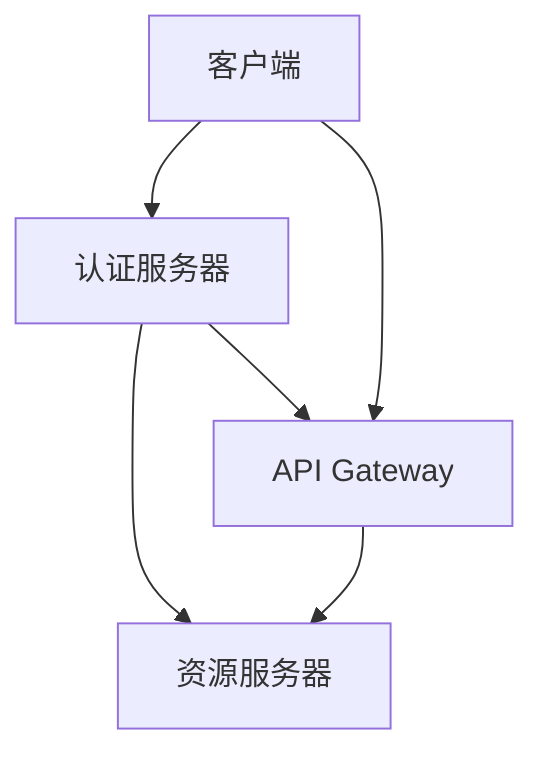

                 

# 设计安全 API 的注意事项

## 1. 背景介绍

在当今数字化时代，API（应用程序接口）在各种应用场景中扮演着至关重要的角色。无论是内部系统集成、第三方服务调用，还是云计算平台提供的公有API，API的安全性都至关重要。随着网络攻击手段的不断演进，API成为黑客攻击的主要目标之一。据统计，每年因API安全漏洞导致的损失高达数十亿美元。因此，设计安全的API不仅是技术实现的必要条件，也是保障企业业务安全、用户隐私的重要保障。本文将详细探讨设计安全API的注意事项，帮助开发者构建坚固的API防御体系。

## 2. 核心概念与联系

### 2.1 核心概念概述

为了更好地理解安全API的设计，我们需要先了解几个核心概念：

- **API（应用程序接口）**：一种使不同的软件组件能够交互的方式。API提供了一种抽象的接口，使得不同系统的组件可以相互通信。
- **API安全**：指保护API不被未经授权的访问、数据篡改或泄露。API安全是网络安全的重要组成部分。
- **OAuth2**：一种开放标准，用于授权第三方应用程序访问受保护的Web资源。OAuth2提供了一种安全的授权机制，防止客户端直接访问服务器资源。
- **JWT（JSON Web Token）**：一种开放标准，用于安全传输信息。JWT可以用于身份验证和授权，确保数据的完整性和保密性。
- **RSA加密算法**：一种非对称加密算法，用于保护数据传输的安全性。RSA算法利用公钥和私钥进行数据加密和解密。

这些概念构成了安全API的核心基础，下面我们通过一个简单的Mermaid流程图来展示API安全的核心架构：



在上述架构中，客户端通过API Gateway访问认证服务器和资源服务器。API Gateway作为API安全的前线，负责处理身份验证和授权请求。认证服务器和资源服务器则负责具体的数据验证和安全防护。

### 2.2 概念间的关系

这些核心概念之间存在紧密的联系，形成了API安全的整体框架。以下是几个关键概念之间的关系：

- **OAuth2和JWT**：OAuth2和JWT是API安全的两大支柱。OAuth2用于授权第三方应用访问资源，JWT则用于传输安全信息。
- **API Gateway**：API Gateway是连接客户端和资源服务器的桥梁，负责统一处理安全请求和业务逻辑。
- **RSA加密算法**：RSA加密算法用于保护数据传输的安全性，是API安全的重要手段之一。

这些概念相互依赖，共同构建了API安全的防护体系。在实践中，开发者需要综合考虑这些概念，设计出高效、安全的API接口。

## 3. 核心算法原理 & 具体操作步骤

### 3.1 算法原理概述

API安全的设计原理主要基于以下四个步骤：

1. **身份验证**：确保请求者的身份，防止假冒攻击。
2. **授权检查**：判断请求者是否有访问资源的权限。
3. **数据加密**：保护传输过程中的数据安全。
4. **日志记录**：记录API调用记录，便于审计和追踪。

每个步骤都是API安全设计不可或缺的部分。下面我们将详细介绍每个步骤的具体实现。

### 3.2 算法步骤详解

#### 3.2.1 身份验证

身份验证是API安全的第一步。常见身份验证方法包括：

- **用户名密码验证**：使用用户名和密码进行验证。
- **OAuth2验证**：通过OAuth2协议获取访问令牌，验证用户身份。

下面我们以OAuth2为例，展示身份验证的具体步骤：

1. 客户端向认证服务器发起登录请求，提交用户名和密码。
2. 认证服务器验证用户名和密码，成功认证后生成JWT令牌。
3. 认证服务器将JWT令牌返回给客户端。
4. 客户端将JWT令牌携带在HTTP请求头部中，访问资源服务器。
5. 资源服务器解析JWT令牌，验证令牌的合法性。

#### 3.2.2 授权检查

授权检查是API安全的核心。授权检查通常通过角色和权限控制实现，确保请求者只能访问其授权的资源。

1. 认证服务器在生成JWT令牌时，将用户角色和权限信息嵌入到令牌中。
2. 资源服务器解析JWT令牌，提取用户角色和权限信息。
3. 资源服务器根据用户角色和权限信息，判断请求是否合法。
4. 如果请求合法，资源服务器返回资源数据；否则拒绝访问。

#### 3.2.3 数据加密

数据加密是保护数据传输安全的关键措施。常见的加密方法包括：

- **SSL/TLS加密**：使用SSL/TLS协议对数据进行加密，防止中间人攻击。
- **RSA加密**：使用RSA算法对数据进行加密和解密，确保数据传输的安全性。

下面我们以RSA加密为例，展示数据加密的具体步骤：

1. 客户端和资源服务器在初次连接时，交换公钥和私钥。
2. 客户端将请求数据进行RSA加密，生成密文。
3. 客户端将密文发送给资源服务器。
4. 资源服务器使用私钥对密文进行解密，获取原始数据。

#### 3.2.4 日志记录

日志记录是API安全的重要保障。通过记录API调用记录，可以追踪和审计API的使用情况，及时发现异常行为。

1. 资源服务器在每次处理请求时，记录请求信息，包括请求时间、请求路径、请求参数等。
2. 资源服务器将日志信息存储到日志服务器或数据库中。
3. 管理员可以通过日志审计，发现潜在的安全威胁。

### 3.3 算法优缺点

#### 3.3.1 优点

- **灵活性**：API Gateway可以统一处理身份验证和授权请求，使得API接口更加灵活。
- **安全性**：OAuth2和JWT提供了一种安全的授权机制，防止未经授权的访问。
- **可扩展性**：API Gateway可以与各种身份验证和授权方式无缝集成，支持多种安全策略。

#### 3.3.2 缺点

- **复杂性**：API Gateway的设计和实现较为复杂，需要综合考虑身份验证、授权、数据加密等多个环节。
- **性能瓶颈**：API Gateway作为API安全的前线，可能会成为性能瓶颈，影响API调用的响应速度。

### 3.4 算法应用领域

API安全设计广泛应用于各种领域，包括但不限于：

- **Web应用**：保护Web应用的API接口，防止未经授权的访问。
- **移动应用**：保护移动应用的API接口，防止客户端的恶意行为。
- **物联网设备**：保护物联网设备的API接口，防止设备被攻击。
- **云平台**：保护云平台的API接口，防止云服务的滥用。

这些应用场景都需要设计高效的API安全机制，确保API接口的安全性。

## 4. 数学模型和公式 & 详细讲解 & 举例说明

### 4.1 数学模型构建

为了更好地理解API安全的设计，我们可以构建一个简单的数学模型，描述API安全的基本流程。

假设有一个API接口，需要保护资源的安全性。API接口的访问请求由客户端发起，请求数据为$r$，响应数据为$s$。API接口的安全流程包括：

1. **身份验证**：验证客户端的身份。
2. **授权检查**：判断请求者是否有访问资源的权限。
3. **数据加密**：保护数据传输的安全性。
4. **日志记录**：记录API调用记录。

数学模型可以表示为：

$$
S = V(r, k_1) \cap P(r, k_2) \cap E(r, k_3) \cap L(r, k_4)
$$

其中：
- $S$表示API接口的安全性。
- $V$表示身份验证过程，$k_1$表示身份验证密钥。
- $P$表示授权检查过程，$k_2$表示授权检查密钥。
- $E$表示数据加密过程，$k_3$表示数据加密密钥。
- $L$表示日志记录过程，$k_4$表示日志记录密钥。

### 4.2 公式推导过程

在上述数学模型中，每个过程都需要使用不同的密钥进行加密和验证。下面我们推导每个过程的加密和验证公式：

1. **身份验证**：

$$
V(r, k_1) = (r, H(k_1, r))
$$

其中，$H$表示哈希函数，$k_1$表示身份验证密钥。

2. **授权检查**：

$$
P(r, k_2) = (r, K(k_2, r))
$$

其中，$K$表示密钥生成函数，$k_2$表示授权检查密钥。

3. **数据加密**：

$$
E(r, k_3) = (r', D(k_3, r'))
$$

其中，$r'$表示加密后的数据，$D$表示解密函数，$k_3$表示数据加密密钥。

4. **日志记录**：

$$
L(r, k_4) = (r', T(k_4, r'))
$$

其中，$r'$表示日志记录数据，$T$表示时间戳函数，$k_4$表示日志记录密钥。

### 4.3 案例分析与讲解

假设有一个电子商务网站，需要保护其API接口的安全性。该网站使用OAuth2和RSA加密算法，确保API接口的安全。

1. **身份验证**：用户通过OAuth2协议获取访问令牌，验证用户身份。

2. **授权检查**：API Gateway根据令牌中的用户角色和权限信息，判断请求是否合法。

3. **数据加密**：API Gateway在请求数据中进行RSA加密，保护数据传输的安全性。

4. **日志记录**：API Gateway在每次请求时记录请求信息，存储到日志服务器中。

通过上述步骤，电子商务网站可以有效地保护其API接口的安全性，防止未经授权的访问。

## 5. 项目实践：代码实例和详细解释说明

### 5.1 开发环境搭建

为了设计安全的API接口，我们需要搭建一个完整的开发环境。以下是Python开发环境的搭建步骤：

1. **安装Python**：从官网下载并安装Python 3.x版本。

2. **安装Flask**：使用pip命令安装Flask框架。

3. **安装Flask-RESTful**：使用pip命令安装Flask-RESTful插件。

4. **安装Flask-JWT-Extended**：使用pip命令安装Flask-JWT-Extended插件，用于JWT身份验证。

5. **安装Flask-Security**：使用pip命令安装Flask-Security插件，用于用户管理和密码验证。

6. **安装Flask-SQLAlchemy**：使用pip命令安装Flask-SQLAlchemy插件，用于数据库管理。

### 5.2 源代码详细实现

以下是使用Flask框架实现安全API接口的示例代码：

```python
from flask import Flask, request
from flask_restful import Resource, Api
from flask_jwt_extended import JWTManager, jwt_required, create_access_token
from flask_sqlalchemy import SQLAlchemy

app = Flask(__name__)
app.config['SQLALCHEMY_DATABASE_URI'] = 'sqlite:////tmp/test.db'
app.config['JWT_SECRET_KEY'] = 'super-secret-key'
app.config['JWT_ACCESS_TOKEN_EXPIRES'] = timedelta(days=1)
db = SQLAlchemy(app)
api = Api(app)
jwt = JWTManager(app)

# 用户模型
class User(db.Model):
    id = db.Column(db.Integer, primary_key=True)
    username = db.Column(db.String(64), unique=True)
    password = db.Column(db.String(128))

    def __init__(self, username, password):
        self.username = username
        self.password = password

# 用户注册接口
@app.route('/register', methods=['POST'])
def register():
    data = request.json
    username = data['username']
    password = data['password']
    user = User(username=username, password=password)
    db.session.add(user)
    db.session.commit()
    return {'status': 'success'}, 201

# 用户登录接口
@app.route('/login', methods=['POST'])
def login():
    data = request.json
    username = data['username']
    password = data['password']
    user = User.query.filter_by(username=username).first()
    if user is None or not user.check_password(password):
        return {'status': 'error'}, 401
    access_token = create_access_token(identity=user.username)
    return {'access_token': access_token}, 200

# 用户信息接口
@app.route('/user', methods=['GET'])
@jwt_required
def user():
    current_user = jwt.current_identity
    user = User.query.filter_by(username=current_user).first()
    return {'username': user.username}, 200

# 安全API接口
class APIResource(Resource):
    decorators = [jwt_required]

    def get(self):
        return {'message': 'API interface is secure'}

api.add_resource(APIResource, '/api')

if __name__ == '__main__':
    db.create_all()
    app.run(debug=True)
```

### 5.3 代码解读与分析

以上代码实现了使用Flask框架设计安全API接口的基本流程。具体解读如下：

- **用户注册**：使用SQLAlchemy插件管理用户信息，实现用户注册功能。
- **用户登录**：使用JWT-Extended插件进行身份验证，生成访问令牌。
- **用户信息**：使用JWT-Extended插件进行授权检查，获取用户信息。
- **安全API**：使用JWT-Extended插件进行授权检查，返回安全API接口信息。

### 5.4 运行结果展示

运行上述代码后，在浏览器中访问`http://127.0.0.1:5000/register`和`http://127.0.0.1:5000/login`，完成用户注册和登录。然后使用访问令牌访问`http://127.0.0.1:5000/user`，获取用户信息。

```json
{
    "username": "user1"
}
```

这表明用户注册和登录成功，API接口的访问被JWT加密保护，且只有合法用户才能访问。

## 6. 实际应用场景

### 6.1 智能城市

在智能城市建设中，API接口的安全性至关重要。智能城市涉及大量的传感器数据、监控视频、交通流量等敏感信息，一旦被攻击，将对城市安全造成严重威胁。

1. **身份验证**：智能城市的API接口需要验证访问者的身份，防止未经授权的访问。

2. **授权检查**：智能城市的API接口需要根据访问者的角色和权限，判断请求是否合法。

3. **数据加密**：智能城市的API接口需要保护数据传输的安全性，防止中间人攻击。

4. **日志记录**：智能城市的API接口需要记录API调用记录，便于审计和追踪。

通过设计安全的API接口，智能城市可以实现高效、安全的传感器数据管理、视频监控、交通控制等功能。

### 6.2 金融交易

金融交易是API安全防护的重点领域。金融交易涉及大量的敏感信息，如账户余额、交易记录、个人隐私等，一旦被攻击，将导致巨大的经济损失。

1. **身份验证**：金融交易API接口需要验证访问者的身份，防止假冒攻击。

2. **授权检查**：金融交易API接口需要根据访问者的角色和权限，判断请求是否合法。

3. **数据加密**：金融交易API接口需要保护数据传输的安全性，防止数据泄露。

4. **日志记录**：金融交易API接口需要记录API调用记录，便于审计和追踪。

通过设计安全的API接口，金融交易平台可以实现高效、安全的交易管理、账户监控、风险控制等功能。

### 6.3 医疗健康

医疗健康领域的API接口需要保护患者隐私和医疗数据安全。医疗健康涉及大量的敏感信息，如病历记录、健康数据、诊断结果等，一旦被攻击，将对患者隐私造成严重威胁。

1. **身份验证**：医疗健康API接口需要验证访问者的身份，防止假冒攻击。

2. **授权检查**：医疗健康API接口需要根据访问者的角色和权限，判断请求是否合法。

3. **数据加密**：医疗健康API接口需要保护数据传输的安全性，防止数据泄露。

4. **日志记录**：医疗健康API接口需要记录API调用记录，便于审计和追踪。

通过设计安全的API接口，医疗健康平台可以实现高效、安全的医疗数据管理、病历记录、诊断辅助等功能。

## 7. 工具和资源推荐

### 7.1 学习资源推荐

为了帮助开发者系统掌握API安全的设计和实现，以下是几个优质的学习资源：

1. **OAuth2官方文档**：OAuth2官网提供了详细的技术文档和API参考，帮助开发者快速上手OAuth2身份验证。

2. **JWT-Extended官方文档**：Flask-JWT-Extended提供了详细的文档和示例代码，帮助开发者实现JWT身份验证。

3. **Flask-Security官方文档**：Flask-Security提供了详细的文档和示例代码，帮助开发者实现用户管理和密码验证。

4. **OWASP API Security Guide**：OWASP提供了API安全指南，涵盖API安全的各个方面，帮助开发者设计安全的API接口。

5. **API Security Fundamentals**：这本书详细介绍了API安全的原理和实践，帮助开发者全面了解API安全的设计。

### 7.2 开发工具推荐

为了高效实现API安全的设计和实现，以下是几款推荐的工具：

1. **Flask**：基于Python的轻量级Web框架，易于上手和扩展，适合开发API接口。

2. **Flask-RESTful**：基于Flask的RESTful API扩展，提供简单的API路由和视图功能，适合开发RESTful API。

3. **Flask-JWT-Extended**：基于Flask的JWT身份验证插件，支持OAuth2和JWT身份验证，适合设计安全的API接口。

4. **SQLAlchemy**：基于Python的ORM框架，支持多种数据库，适合管理用户信息和其他数据。

5. **Flask-Security**：基于Flask的用户管理和密码验证插件，支持用户注册、登录和角色管理，适合保护用户信息。

### 7.3 相关论文推荐

API安全的设计和实现涉及多个学科的交叉，以下是几篇有影响力的相关论文：

1. **OAuth2.0 for People**：介绍了OAuth2的原理和实现，帮助开发者理解OAuth2的身份验证机制。

2. **JWT in Action**：详细介绍了JWT的原理和实现，帮助开发者实现JWT身份验证。

3. **Practical Guide to API Security**：提供了API安全的实践指南，涵盖身份验证、授权检查、数据加密等多个方面。

4. **Secure API Development**：介绍了API安全的最佳实践，涵盖身份验证、授权检查、数据加密等多个方面。

5. **Designing Secure REST APIs**：提供了RESTful API设计的最佳实践，涵盖身份验证、授权检查、数据加密等多个方面。

## 8. 总结：未来发展趋势与挑战

### 8.1 研究成果总结

本文详细介绍了设计安全API的注意事项，涵盖身份验证、授权检查、数据加密、日志记录等多个环节。通过实际案例和代码实现，帮助开发者全面掌握API安全的设计和实现。

### 8.2 未来发展趋势

未来API安全设计将呈现以下几个发展趋势：

1. **零信任架构**：零信任架构是一种新兴的安全理念，强调对每个访问请求进行严格的验证和授权。零信任架构将使得API接口更加安全可靠。

2. **人工智能**：随着AI技术的不断发展，API安全将引入更多AI算法，如机器学习、深度学习等，实现更高效、智能的安全防护。

3. **多因素认证**：多因素认证是一种新兴的认证方式，结合多种验证手段，提高身份验证的安全性。多因素认证将使API接口更加安全。

4. **区块链技术**：区块链技术可以用于分布式身份验证和授权，防止单点故障和数据篡改。区块链技术将使API接口更加安全可靠。

5. **边缘计算**：边缘计算可以降低网络延迟和带宽消耗，提高API接口的响应速度和安全性。

### 8.3 面临的挑战

尽管API安全设计取得了一定的进展，但仍面临诸多挑战：

1. **攻击手段多样化**：随着攻击手段的不断演进，API接口的防御难度不断加大。开发者需要不断更新防御策略，以应对新的安全威胁。

2. **性能瓶颈**：API接口的防御措施可能会带来一定的性能损失。如何在保证安全性的同时，提升API接口的性能，是一个重要的挑战。

3. **用户体验**：API接口的防御措施可能会影响用户体验，如增加身份验证步骤、降低API响应速度等。如何在保证安全性的同时，提升用户体验，是一个重要的挑战。

4. **标准不一致**：现有的API安全标准不统一，开发者需要同时遵守多种标准，增加了设计和实现的复杂度。

### 8.4 研究展望

未来API安全设计需要在以下几个方面进行深入研究：

1. **统一标准**：制定统一的API安全标准，简化开发者的设计和实现工作。

2. **自动化检测**：引入自动化工具，实现API接口的自动化安全检测和分析。

3. **AI辅助防御**：引入AI技术，提高API接口的安全性。

4. **边缘计算与区块链结合**：将边缘计算和区块链技术结合，提升API接口的安全性和可靠性。

通过不断探索和创新，相信API安全设计将迎来更加智能、高效、安全的未来，为数字化时代提供坚实的安全保障。

## 9. 附录：常见问题与解答

**Q1: 如何保护API接口免受DDoS攻击？**

A: DDoS攻击是一种常见的网络攻击方式，可以针对API接口进行流量淹没。为了防止DDoS攻击，可以采用以下措施：

1. 使用DDoS防护服务，如Cloudflare、Akamai等，提供DDoS防护功能。

2. 使用限流技术，限制API接口的请求频率，防止恶意流量攻击。

3. 使用反向代理，分散流量，降低DDoS攻击的风险。

4. 使用IP黑名单，阻止恶意IP地址的请求。

**Q2: 如何实现跨域请求？**

A: 跨域请求是一种常见的API接口需求，可以通过以下方法实现：

1. 在API接口中添加Access-Control-Allow-Origin头，允许指定的域名访问API接口。

2. 使用CORS（跨域资源共享）技术，允许浏览器跨域请求API接口。

3. 使用代理服务器，将请求转发到目标服务器，实现跨域请求。

4. 使用AJAX请求，通过XMLHttpRequest对象实现跨域请求。

**Q3: 如何防止SQL注入攻击？**

A: SQL注入攻击是一种常见的网络攻击方式，可以绕过身份验证和授权检查。为了防止SQL注入攻击，可以采用以下措施：

1. 使用ORM框架，如Flask-SQLAlchemy，自动转义SQL语句，防止注入攻击。

2. 使用预编译语句，如Flask-SQLAlchemy的预编译功能，防止注入攻击。

3. 使用输入验证，对用户输入进行验证和过滤，防止注入攻击。

4. 使用白名单，只允许合法的输入数据，防止注入攻击。

**Q4: 如何防止XSS攻击？**

A: XSS攻击是一种常见的网络攻击方式，可以通过浏览器注入恶意脚本。为了防止XSS攻击，可以采用以下措施：

1. 对用户输入进行过滤和转义，防止恶意脚本注入。

2. 使用安全框架，如Flask-Security，提供安全工具和插件，防止XSS攻击。

3. 使用HTTPOnly Cookie，防止浏览器端脚本访问Cookie。

4. 使用跨站请求伪造(CSRF)防御技术，防止恶意请求。

**Q5: 如何防止API接口被滥用？**

A: API接口的滥用会导致资源浪费、服务中断等后果。为了防止API接口被滥用，可以采用以下措施：

1. 使用API密钥，为每个API接口分配唯一的密钥，防止未经授权的访问。

2. 使用限流技术，限制API接口的调用频率，防止滥用行为。

3. 使用IP黑名单，阻止恶意IP地址的请求。

4. 使用API审计日志，记录API调用记录，便于追踪和审计。

通过上述措施，可以有效地保护API接口的安全性，防止各种安全威胁。

