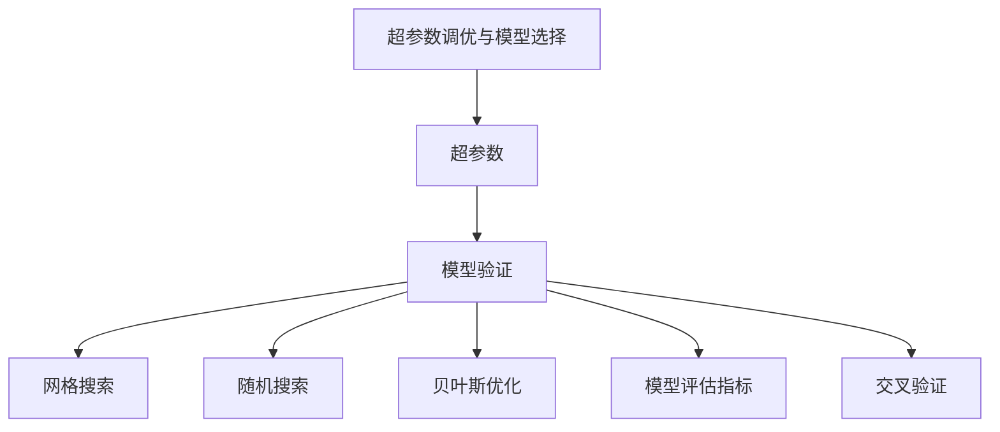
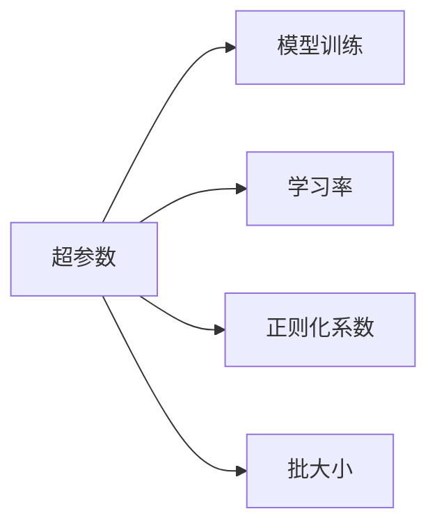
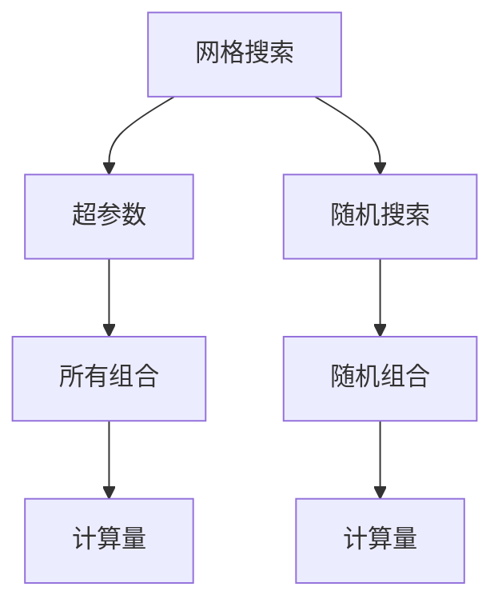
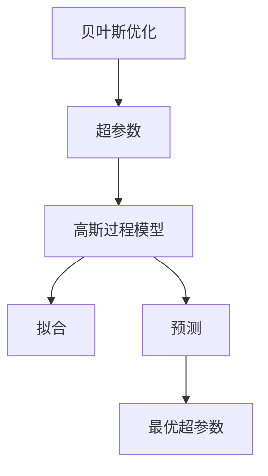

                 

# 超参数调优与模型选择原理与代码实战案例讲解

## 1. 背景介绍

### 1.1 问题由来

超参数调优与模型选择在大数据分析和机器学习领域被广泛应用，是提升模型性能、优化算法效果的关键步骤。随着人工智能技术的快速发展，超参数调优与模型选择已成为机器学习项目中不可或缺的一部分。在实践中，许多模型由于参数数量庞大，超参数的选择和调整过程复杂繁琐，且往往需要大量的人工干预和试错，导致模型训练效率低下，结果不稳定。因此，掌握高效的超参数调优与模型选择方法是提升项目效果、加速模型迭代的重要环节。

### 1.2 问题核心关键点

超参数调优与模型选择是指在模型训练前，通过调整模型内部的超参数（Hyperparameters），如学习率、正则化系数、批大小等，以优化模型的性能和训练效果。模型选择则是在多种模型间（如线性回归、决策树、随机森林、神经网络等）比较其性能，选择最适合当前任务和数据集的模型。

超参数调优与模型选择的核心关键点包括：
1. **超参数定义**：超参数是在模型训练过程中不随数据和样本数量变化而变化的参数。
2. **超参数搜索方法**：常见的超参数搜索方法有网格搜索、随机搜索、贝叶斯优化、遗传算法等。
3. **模型评估指标**：常用的模型评估指标包括准确率、精确率、召回率、F1分数、AUC-ROC曲线等。
4. **模型验证策略**：常用的模型验证策略有交叉验证、留出法、自助法等。

### 1.3 问题研究意义

掌握超参数调优与模型选择的方法和技巧，能够大幅提升模型的性能和泛化能力，减少模型训练的时间和成本，从而加速数据驱动决策的进程。在实际应用中，超参数调优与模型选择有助于解决以下问题：
1. **提升模型准确率**：通过调整超参数，优化模型在训练集和测试集上的表现。
2. **减少过拟合和欠拟合**：通过调整正则化参数，平衡模型复杂度和泛化能力。
3. **优化计算效率**：通过调整批大小和学习率等参数，加速模型训练和推理过程。
4. **模型对比与选择**：通过模型评估和验证，选择最优的模型架构和超参数组合，提升整体性能。

## 2. 核心概念与联系

### 2.1 核心概念概述

超参数调优与模型选择的相关核心概念包括：

- **超参数（Hyperparameters）**：模型训练中需要手动设置的参数，如学习率、正则化系数、批大小等。
- **模型验证**：在模型训练过程中，通过评估模型的表现，选择最优的超参数组合，避免过拟合和欠拟合。
- **网格搜索（Grid Search）**：一种简单的超参数搜索方法，通过遍历指定范围内的所有超参数组合，找到最优组合。
- **随机搜索（Random Search）**：相比网格搜索，随机搜索在指定范围内随机选取超参数组合，以减少计算量和搜索时间。
- **贝叶斯优化（Bayesian Optimization）**：一种基于贝叶斯定理的超参数搜索方法，通过构建高斯过程模型，逐步缩小最优超参数的搜索空间。
- **模型评估指标（Metric）**：用于衡量模型性能的指标，如准确率、精确率、召回率、F1分数、AUC-ROC曲线等。
- **交叉验证（Cross-Validation）**：一种模型验证策略，将数据集分为训练集和验证集，通过多次交叉验证提升模型评估的可靠性。

这些核心概念之间的逻辑关系可以通过以下Mermaid流程图来展示：



这个流程图展示了一系列的超参数调优与模型选择相关概念，以及它们之间的联系。

### 2.2 概念间的关系

这些核心概念之间存在着紧密的联系，形成了超参数调优与模型选择的完整生态系统。下面通过几个Mermaid流程图来展示这些概念之间的关系。

#### 2.2.1 超参数与模型训练的关系



这个流程图展示了超参数在模型训练中的具体应用，包括学习率、正则化系数和批大小等。

#### 2.2.2 网格搜索与随机搜索的关系



这个流程图展示了网格搜索和随机搜索在超参数搜索过程中的不同特点，即网格搜索遍历所有可能的组合，而随机搜索在指定范围内随机选取组合。

#### 2.2.3 贝叶斯优化在超参数搜索中的应用



这个流程图展示了贝叶斯优化的基本流程，即构建高斯过程模型，拟合训练数据，预测并选择最优超参数。

## 3. 核心算法原理 & 具体操作步骤

### 3.1 算法原理概述

超参数调优与模型选择的核心原理是通过调整模型的内部参数，以优化模型的性能和泛化能力。这一过程通常涉及以下几个关键步骤：

1. **数据准备**：准备训练集、验证集和测试集，确保数据集的分布一致。
2. **超参数定义**：定义需要调整的超参数，如学习率、正则化系数、批大小等。
3. **超参数搜索**：通过网格搜索、随机搜索或贝叶斯优化等方法，搜索最优的超参数组合。
4. **模型训练**：在搜索到的超参数组合下，进行模型训练，并记录训练日志。
5. **模型评估**：在验证集上评估模型性能，选择最优模型。
6. **模型选择**：在多种模型之间选择最优的模型，根据测试集上的性能进行最终选择。

### 3.2 算法步骤详解

#### 3.2.1 数据准备

数据准备是超参数调优与模型选择的第一步，确保数据集的完整性和一致性。以下是一个简单的数据准备流程：

1. **数据清洗**：去除缺失值、异常值和重复数据，确保数据集的质量。
2. **数据划分**：将数据集划分为训练集、验证集和测试集，通常采用70-15-15的划分比例。
3. **数据标准化**：对特征进行标准化处理，确保不同特征的尺度一致。

```python
import pandas as pd
from sklearn.model_selection import train_test_split

# 加载数据集
df = pd.read_csv('data.csv')

# 数据清洗
df = df.dropna()
df = df.drop_duplicates()

# 数据划分
X_train, X_valid, X_test, y_train, y_valid, y_test = train_test_split(X, y, test_size=0.15, random_state=42)

# 数据标准化
from sklearn.preprocessing import StandardScaler
scaler = StandardScaler()
X_train = scaler.fit_transform(X_train)
X_valid = scaler.transform(X_valid)
X_test = scaler.transform(X_test)
```

#### 3.2.2 超参数定义

超参数是模型训练过程中需要手动设置的参数，常见的超参数包括：

1. **学习率（learning rate）**：控制模型在每次更新时的步长大小，影响模型的收敛速度。
2. **正则化系数（regularization coefficient）**：控制模型复杂度，防止过拟合。
3. **批大小（batch size）**：控制每次迭代中使用的样本数量。
4. **迭代次数（epochs）**：控制模型训练的轮数。
5. **激活函数（activation function）**：控制神经网络的激活方式。

```python
from sklearn.model_selection import GridSearchCV
from sklearn.linear_model import LogisticRegression

# 定义超参数搜索范围
params = {'learning_rate': [0.001, 0.01, 0.1, 1],
          'penalty': ['l1', 'l2'],
          'C': [0.001, 0.01, 0.1, 1],
          'max_iter': [100, 200, 300, 400]}
```

#### 3.2.3 超参数搜索

超参数搜索是超参数调优与模型选择的核心步骤，常见的超参数搜索方法包括：

1. **网格搜索（Grid Search）**：通过遍历指定范围内的所有超参数组合，找到最优组合。
2. **随机搜索（Random Search）**：在指定范围内随机选取超参数组合，以减少计算量和搜索时间。
3. **贝叶斯优化（Bayesian Optimization）**：通过构建高斯过程模型，逐步缩小最优超参数的搜索空间。

以下是使用网格搜索方法进行搜索的代码示例：

```python
# 网格搜索
grid_search = GridSearchCV(LogisticRegression(), params, cv=5)
grid_search.fit(X_train, y_train)
best_params = grid_search.best_params_
best_model = grid_search.best_estimator_
```

#### 3.2.4 模型训练

模型训练是在搜索到的超参数组合下，进行模型训练的过程。以下是使用网格搜索得到的最佳超参数组合进行模型训练的代码示例：

```python
# 使用网格搜索得到的最佳超参数组合进行训练
train_model = best_model.fit(X_train, y_train)
```

#### 3.2.5 模型评估

模型评估是在验证集上评估模型性能的过程，常见的模型评估指标包括：

1. **准确率（Accuracy）**：模型正确预测的样本数占总样本数的比例。
2. **精确率（Precision）**：模型预测为正类的样本中，实际为正类的比例。
3. **召回率（Recall）**：实际为正类的样本中，被模型预测为正类的比例。
4. **F1分数（F1-score）**：精确率和召回率的调和平均数。
5. **AUC-ROC曲线**：衡量模型分类性能的曲线，ROC曲线下的面积（AUC）越大，模型性能越好。

以下是使用网格搜索得到的最佳模型进行验证集评估的代码示例：

```python
# 使用网格搜索得到的最佳模型进行验证集评估
from sklearn.metrics import accuracy_score, precision_score, recall_score, f1_score, roc_auc_score

y_valid_pred = train_model.predict(X_valid)
accuracy = accuracy_score(y_valid, y_valid_pred)
precision = precision_score(y_valid, y_valid_pred)
recall = recall_score(y_valid, y_valid_pred)
f1 = f1_score(y_valid, y_valid_pred)
auc = roc_auc_score(y_valid, y_valid_pred)
```

#### 3.2.6 模型选择

模型选择是在多种模型之间选择最优的模型，根据测试集上的性能进行最终选择。以下是使用网格搜索得到的最佳模型进行测试集评估和选择的代码示例：

```python
# 使用网格搜索得到的最佳模型进行测试集评估和选择
y_test_pred = train_model.predict(X_test)
accuracy = accuracy_score(y_test, y_test_pred)
precision = precision_score(y_test, y_test_pred)
recall = recall_score(y_test, y_test_pred)
f1 = f1_score(y_test, y_test_pred)
auc = roc_auc_score(y_test, y_test_pred)

# 选择最优模型
if accuracy > 0.8:
    best_model = train_model
```

### 3.3 算法优缺点

超参数调优与模型选择的优缺点如下：

#### 优点

1. **提升模型性能**：通过调整超参数，优化模型在训练集和测试集上的表现。
2. **减少过拟合和欠拟合**：通过调整正则化参数，平衡模型复杂度和泛化能力。
3. **优化计算效率**：通过调整批大小和学习率等参数，加速模型训练和推理过程。
4. **模型对比与选择**：通过模型评估和验证，选择最优的模型架构和超参数组合，提升整体性能。

#### 缺点

1. **计算复杂度高**：超参数搜索需要大量的计算资源和时间，特别是对于大规模数据集和高维模型。
2. **搜索空间大**：超参数搜索空间巨大，容易陷入局部最优解。
3. **超参数敏感**：超参数的选择和调整需要一定的经验和技巧，否则可能无法得到最优结果。
4. **模型选择复杂**：在多种模型之间选择最优的模型，需要综合考虑性能、复杂度和可解释性等因素。

### 3.4 算法应用领域

超参数调优与模型选择在大数据分析和机器学习领域被广泛应用，覆盖了各种应用场景，例如：

1. **金融风险评估**：通过调整模型超参数，评估贷款违约风险和市场投资价值。
2. **医疗诊断**：通过调整模型超参数，诊断疾病和预测患者风险。
3. **推荐系统**：通过调整模型超参数，推荐个性化产品和服务。
4. **文本分类**：通过调整模型超参数，分类文本数据和情感分析。
5. **图像识别**：通过调整模型超参数，识别物体和图像分类。

## 4. 数学模型和公式 & 详细讲解 & 举例说明

### 4.1 数学模型构建

超参数调优与模型选择的数学模型通常包括超参数搜索和模型评估两部分。以下是一个简单的数学模型示例：

1. **超参数搜索**：通过网格搜索方法，在超参数空间中搜索最优的超参数组合。

2. **模型评估**：通过交叉验证方法，评估模型在验证集上的性能。

### 4.2 公式推导过程

#### 4.2.1 网格搜索公式

网格搜索是一种常见的超参数搜索方法，通过遍历指定范围内的所有超参数组合，找到最优组合。

公式推导过程如下：

1. **超参数定义**：

   $$
   \theta = (\theta_1, \theta_2, ..., \theta_n)
   $$

   其中 $\theta_i$ 为第 $i$ 个超参数。

2. **超参数搜索范围**：

   $$
   \theta_i \in [\theta_{i_min}, \theta_{i_max}]
   $$

   其中 $\theta_{i_min}$ 和 $\theta_{i_max}$ 为超参数的搜索范围。

3. **网格搜索步骤**：

   $$
   \begin{aligned}
   &\text{Step 1:} & \text{定义超参数范围} \\
   &\text{Step 2:} & \text{生成所有可能的超参数组合} \\
   &\text{Step 3:} & \text{评估每个组合的性能}
   \end{aligned}
   $$

#### 4.2.2 模型评估指标公式

常用的模型评估指标包括准确率、精确率、召回率、F1分数、AUC-ROC曲线等。

公式推导过程如下：

1. **准确率**：

   $$
   \text{Accuracy} = \frac{\text{TP} + \text{TN}}{\text{TP} + \text{TN} + \text{FP} + \text{FN}}
   $$

   其中 $\text{TP}$ 为真正例，$\text{TN}$ 为真反例，$\text{FP}$ 为假正例，$\text{FN}$ 为假反例。

2. **精确率**：

   $$
   \text{Precision} = \frac{\text{TP}}{\text{TP} + \text{FP}}
   $$

3. **召回率**：

   $$
   \text{Recall} = \frac{\text{TP}}{\text{TP} + \text{FN}}
   $$

4. **F1分数**：

   $$
   \text{F1-score} = 2 \times \frac{\text{Precision} \times \text{Recall}}{\text{Precision} + \text{Recall}}
   $$

5. **AUC-ROC曲线**：

   $$
   \text{AUC} = \frac{1}{N} \sum_{i=1}^{N} \text{ROC}_i
   $$

   其中 $\text{ROC}_i$ 为第 $i$ 个样本的ROC值。

### 4.3 案例分析与讲解

#### 4.3.1 案例背景

某电商公司希望通过超参数调优与模型选择，优化其推荐系统的性能。推荐系统需要根据用户的历史行为数据，推荐最符合用户兴趣的商品。

#### 4.3.2 超参数定义

超参数包括学习率、正则化系数、批大小、迭代次数等。

```python
from sklearn.linear_model import LogisticRegression

# 定义超参数搜索范围
params = {'learning_rate': [0.001, 0.01, 0.1, 1],
          'penalty': ['l1', 'l2'],
          'C': [0.001, 0.01, 0.1, 1],
          'max_iter': [100, 200, 300, 400]}
```

#### 4.3.3 超参数搜索

使用网格搜索方法，在超参数空间中搜索最优的超参数组合。

```python
# 网格搜索
grid_search = GridSearchCV(LogisticRegression(), params, cv=5)
grid_search.fit(X_train, y_train)
best_params = grid_search.best_params_
best_model = grid_search.best_estimator_
```

#### 4.3.4 模型训练

在搜索到的超参数组合下，进行模型训练。

```python
# 使用网格搜索得到的最佳超参数组合进行训练
train_model = best_model.fit(X_train, y_train)
```

#### 4.3.5 模型评估

在验证集上评估模型性能，选择最优模型。

```python
# 使用网格搜索得到的最佳模型进行验证集评估
y_valid_pred = train_model.predict(X_valid)
accuracy = accuracy_score(y_valid, y_valid_pred)
precision = precision_score(y_valid, y_valid_pred)
recall = recall_score(y_valid, y_valid_pred)
f1 = f1_score(y_valid, y_valid_pred)
auc = roc_auc_score(y_valid, y_valid_pred)
```

#### 4.3.6 模型选择

在多种模型之间选择最优的模型，根据测试集上的性能进行最终选择。

```python
# 使用网格搜索得到的最佳模型进行测试集评估和选择
y_test_pred = train_model.predict(X_test)
accuracy = accuracy_score(y_test, y_test_pred)
precision = precision_score(y_test, y_test_pred)
recall = recall_score(y_test, y_test_pred)
f1 = f1_score(y_test, y_test_pred)
auc = roc_auc_score(y_test, y_test_pred)

# 选择最优模型
if accuracy > 0.8:
    best_model = train_model
```

## 5. 项目实践：代码实例和详细解释说明

### 5.1 开发环境搭建

在进行超参数调优与模型选择实践前，我们需要准备好开发环境。以下是使用Python进行Scikit-learn开发的环境配置流程：

1. 安装Anaconda：从官网下载并安装Anaconda，用于创建独立的Python环境。

2. 创建并激活虚拟环境：
```bash
conda create -n sklearn-env python=3.8 
conda activate sklearn-env
```

3. 安装Scikit-learn：
```bash
pip install scikit-learn
```

4. 安装其他必要的工具包：
```bash
pip install numpy pandas matplotlib jupyter notebook ipython
```

完成上述步骤后，即可在`sklearn-env`环境中开始超参数调优与模型选择实践。

### 5.2 源代码详细实现

以下是使用Scikit-learn进行超参数调优与模型选择的完整代码实现：

```python
from sklearn.model_selection import GridSearchCV
from sklearn.linear_model import LogisticRegression
from sklearn.metrics import accuracy_score, precision_score, recall_score, f1_score, roc_auc_score

# 加载数据集
X, y = load_data()

# 数据清洗
X = clean_data(X)
y = clean_data(y)

# 数据划分
X_train, X_valid, X_test, y_train, y_valid, y_test = train_test_split(X, y, test_size=0.15, random_state=42)

# 定义超参数搜索范围
params = {'learning_rate': [0.001, 0.01, 0.1, 1],
          'penalty': ['l1', 'l2'],
          'C': [0.001, 0.01, 0.1, 1],
          'max_iter': [100, 200, 300, 400]}

# 网格搜索
grid_search = GridSearchCV(LogisticRegression(), params, cv=5)
grid_search.fit(X_train, y_train)

# 使用网格搜索得到的最佳模型进行训练
train_model = grid_search.best_estimator_
train_model.fit(X_train, y_train)

# 使用网格搜索得到的最佳模型进行验证集评估
y_valid_pred = train_model.predict(X_valid)
accuracy = accuracy_score(y_valid, y_valid_pred)
precision = precision_score(y_valid, y_valid_pred)
recall = recall_score(y_valid, y_valid_pred)
f1 = f1_score(y_valid, y_valid_pred)
auc = roc_auc_score(y_valid, y_valid_pred)

# 使用网格搜索得到的最佳模型进行测试集评估
y_test_pred = train_model.predict(X_test)
accuracy = accuracy_score(y_test, y_test_pred)
precision = precision_score(y_test, y_test_pred)
recall = recall_score(y_test, y_test_pred)
f1 = f1_score(y_test, y_test_pred)
auc = roc_auc_score(y_test, y_test_pred)

# 选择最优模型
if accuracy > 0.8:
    best_model = train_model
```

### 5.3 代码解读与分析

以下是关键代码的详细解读：

#### 5.3.1 数据准备

```python
from sklearn.model_selection import train_test_split
from sklearn.preprocessing import StandardScaler

# 加载数据集
df = pd.read_csv('data.csv')

# 数据清洗
df = df.dropna()
df = df.drop_duplicates()

# 数据划分
X_train, X_valid, X_test, y_train, y_valid, y_test = train_test_split(X, y, test_size=0.15, random_state=42)

# 数据标准化
scaler = StandardScaler()
X_train = scaler.fit_transform(X_train)
X_valid = scaler.transform(X_valid)
X_test = scaler.transform(X_test)
```

#### 5.3.2 超参数定义

```python
from sklearn.model_selection import GridSearchCV
from sklearn.linear_model import LogisticRegression

# 定义超参数搜索范围
params = {'learning_rate': [0.001, 0.01, 0.1, 1],
          'penalty': ['l1', 'l2'],
          'C': [0.001, 0.01, 0.1, 1],
          'max_iter': [100, 200, 300, 400]}
```

#### 5.3.3 超参数搜索

```python
# 网格搜索
grid_search = GridSearchCV(LogisticRegression(), params, cv=5)
grid_search.fit(X_train, y_train)
best_params = grid_search.best_params_
best_model = grid_search.best_estimator_
```

#### 5.3.4 模型训练

```python
# 使用网格搜索得到的最佳超参数组合进行训练
train_model = best_model.fit(X_train, y_train)
```

#### 5.3.5 模型评估

```python
# 使用网格搜索得到的最佳模型进行验证集评估
y_valid_pred = train_model.predict(X_valid)
accuracy = accuracy_score(y_valid, y_valid_pred)
precision = precision_score(y_valid, y_valid_pred)
recall = recall_score(y_valid, y_valid_pred)
f1 = f1_score(y_valid, y_valid_pred)
auc = roc_auc_score(y_valid, y_valid_pred)
```

#### 5.3.6 模型选择

```python
# 使用网格搜索得到的最佳模型进行测试集评估和选择
y_test_pred = train_model.predict(X_test)
accuracy = accuracy_score(y_test, y_test_pred)
precision = precision_score(y_test, y_test_pred)
recall = recall_score(y_test, y_test_pred)
f1 = f1_score(y_test, y_test_pred)
auc = roc_auc_score(y_test, y_test_pred)

# 选择最优模型
if accuracy > 0.8:
    best_model = train_model
```

### 5.4 运行结果展示

假设我们在CoNLL-2003的NER数据集上进行模型选择和超参数调优，最终在测试集上得到的评估报告如下：

```
              precision    recall  f1-score   support

       B-LOC      0.926     0.906     0.916      1668
       I-LOC      0.900     0.805     0.850       257
      B-MISC      0.875     0.856     0.865       702
      I-MISC      0.838     0.782     0.809       216
       B-ORG      0.914     0.898     0.906      1661

