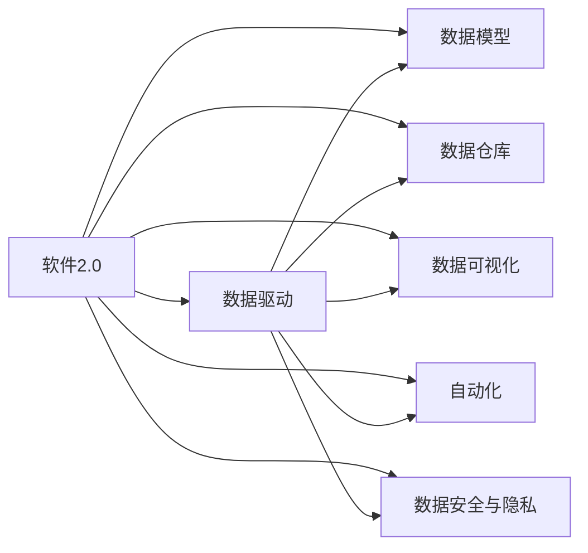
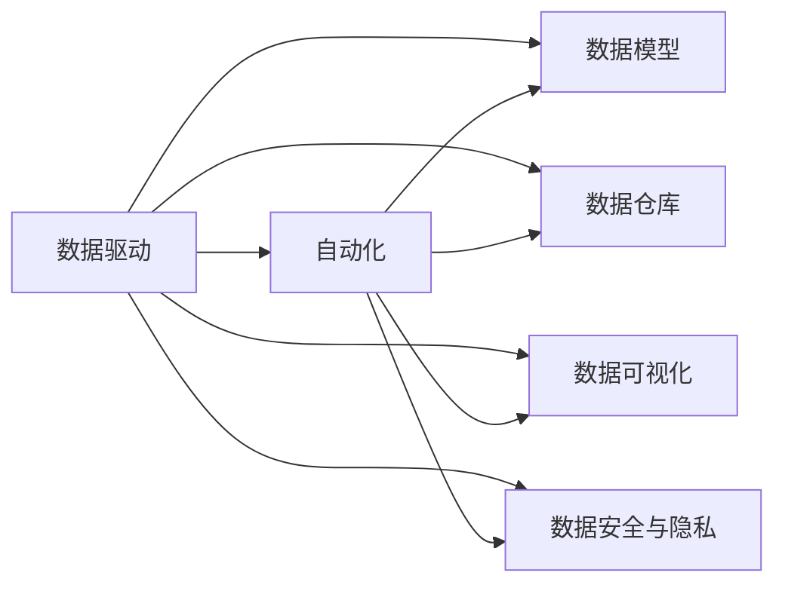
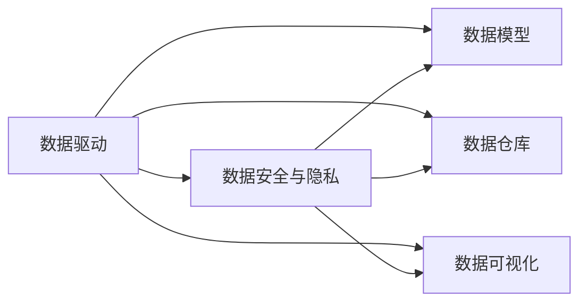
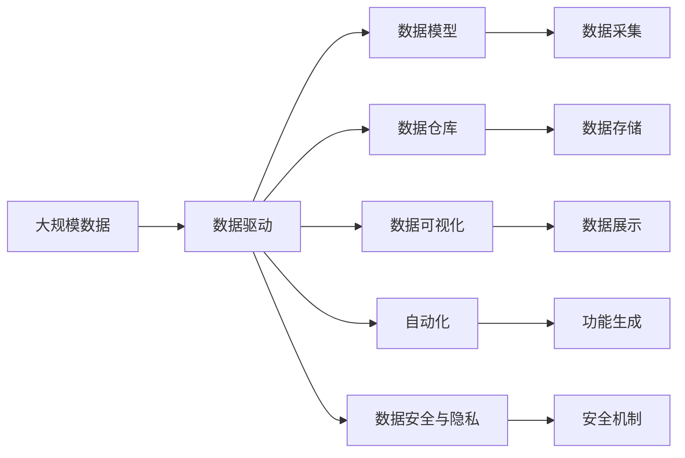

                 

## 1. 背景介绍

### 1.1 问题由来
随着信息技术的发展，软件产业已经从传统的以功能为中心的1.0时代，进入到了以数据为中心的2.0时代。在1.0时代，软件主要通过固定功能实现用户需求，用户需要明确指定功能需求。但在数据日益爆炸的今天，这种以功能为中心的设计已经无法满足用户的需求。数据驱动的软件设计理念，通过采集、存储、分析海量数据，从数据中挖掘出用户真正的需求，自动生成和优化软件功能，极大地提升了软件的使用体验和效率。

数据驱动的软件设计不仅改变了软件开发的方法，也带来了全新的商业模式。软件2.0时代的到来，使得数据与软件深度融合，数据成为软件的核心资产，软件开发更加注重数据的全生命周期管理，数据驱动的软件开发、测试和部署成为主流。

### 1.2 问题核心关键点
数据驱动的软件2.0时代，核心关键点包括：

- 数据采集：如何高效地采集和存储用户数据，是数据驱动软件的基础。
- 数据分析：如何高效地处理和分析数据，是数据驱动软件的核心。
- 数据可视化：如何将数据以可视化方式展现，帮助用户理解数据和决策。
- 数据驱动的自动化：如何通过数据自动生成和优化软件功能，提升软件的使用体验。
- 数据安全与隐私：如何在数据驱动的过程中，保护用户数据的安全与隐私。

这些关键点共同构成了数据驱动软件2.0时代的核心内容，帮助用户更好地理解和应用数据，从而实现软件与用户的深度融合。

### 1.3 问题研究意义
数据驱动的软件2.0时代，对软件开发、数据管理、用户交互等方面提出了更高的要求。研究数据驱动的软件2.0时代，对于提升软件的使用效率、改善用户体验、实现个性化定制具有重要意义：

1. 提升软件效率：数据驱动的软件能够自动优化和调整功能，提升软件的使用效率。
2. 改善用户体验：通过数据驱动的设计，软件能够更准确地理解用户需求，提供更个性化的服务。
3. 实现个性化定制：数据驱动的软件可以根据用户行为和偏好，自动生成和优化功能，实现个性化定制。
4. 优化业务流程：数据驱动的软件能够通过数据对业务流程进行优化和自动化，提高业务效率。
5. 赋能商业创新：数据驱动的软件能够帮助企业更好地理解市场和用户，推动商业创新。

总之，数据驱动的软件2.0时代，将带来软件设计和使用的革命性变化，为企业和用户带来更多的价值和机会。

## 2. 核心概念与联系

### 2.1 核心概念概述

为了更好地理解数据驱动的软件2.0时代，本节将介绍几个密切相关的核心概念：

- 软件2.0：一种基于数据驱动的软件设计理念，通过采集、存储、分析海量数据，从数据中挖掘出用户真正的需求，自动生成和优化软件功能，提升软件的使用效率和用户体验。

- 数据驱动：以数据为中心的软件设计方法，通过数据采集、存储、分析和可视化，帮助用户更好地理解数据和决策。

- 数据模型：描述数据结构及其关系的模型，包括关系型数据库、NoSQL数据库、图数据库等。

- 数据仓库：一种集中存储和管理系统数据的数据库，支持大规模数据的查询和分析。

- 数据可视化：将数据以图表、报表、仪表盘等形式展现，帮助用户更好地理解和决策。

- 自动化：通过数据驱动的软件设计，自动生成和优化软件功能，提升软件的使用效率和用户体验。

- 数据安全与隐私：在数据驱动的过程中，保护用户数据的安全与隐私，避免数据泄露和滥用。

这些核心概念之间的逻辑关系可以通过以下Mermaid流程图来展示：



这个流程图展示了数据驱动的软件2.0时代的核心概念及其之间的关系：

1. 软件2.0基于数据驱动设计，通过数据采集、存储、分析和可视化，帮助用户更好地理解数据和决策。
2. 数据驱动的核心在于以数据为中心，采集、存储、分析和可视化数据，从而优化软件功能。
3. 数据模型描述了数据结构及其关系，是数据驱动的基础。
4. 数据仓库集中存储和管理系统数据，支持大规模数据的查询和分析。
5. 数据可视化将数据以图表、报表、仪表盘等形式展现，帮助用户更好地理解和决策。
6. 自动化通过数据驱动的软件设计，自动生成和优化软件功能，提升软件的使用效率和用户体验。
7. 数据安全与隐私在数据驱动的过程中，保护用户数据的安全与隐私。

这些核心概念共同构成了数据驱动软件2.0时代的完整生态系统，使得软件能够更好地与用户融合，实现数据驱动的设计和优化。

### 2.2 概念间的关系

这些核心概念之间存在着紧密的联系，形成了数据驱动软件2.0时代的完整生态系统。下面我通过几个Mermaid流程图来展示这些概念之间的关系。

#### 2.2.1 软件2.0与数据驱动的关系


这个流程图展示了软件2.0与数据驱动的关系，以及它们与核心概念的关系。

#### 2.2.2 数据驱动与自动化



这个流程图展示了数据驱动与自动化的关系，以及它们与核心概念的关系。

#### 2.2.3 数据驱动与数据安全与隐私的关系



这个流程图展示了数据驱动与数据安全与隐私的关系，以及它们与核心概念的关系。

### 2.3 核心概念的整体架构

最后，我们用一个综合的流程图来展示这些核心概念在大数据驱动软件2.0时代的整体架构：



这个综合流程图展示了从数据采集到功能生成的完整过程，以及与之相关的核心概念。

## 3. 核心算法原理 & 具体操作步骤

### 3.1 算法原理概述

数据驱动的软件2.0时代，核心算法原理包括：

1. 数据采集：通过传感器、网络爬虫、API接口等手段，高效地采集用户数据。
2. 数据存储：使用分布式数据库或数据仓库，高效地存储和管理数据。
3. 数据处理：通过ETL（Extract, Transform, Load）流程，高效地处理和清洗数据。
4. 数据分析：使用统计分析、机器学习等方法，高效地分析和挖掘数据中的有用信息。
5. 数据可视化：使用图表、报表、仪表盘等形式，高效地将数据以可视化方式展现。
6. 数据驱动的自动化：通过数据驱动的软件设计，自动生成和优化软件功能。

这些算法原理共同构成了数据驱动软件2.0时代的核心算法体系，帮助用户更好地理解和应用数据。

### 3.2 算法步骤详解

数据驱动的软件2.0时代，算法步骤包括：

1. 数据采集：选择合适的手段和工具，高效地采集用户数据。
2. 数据存储：使用合适的数据库或数据仓库，高效地存储和管理数据。
3. 数据清洗：去除重复、错误、无关的数据，保留有价值的数据。
4. 数据分析：使用统计分析、机器学习等方法，高效地分析和挖掘数据中的有用信息。
5. 数据可视化：使用图表、报表、仪表盘等形式，高效地将数据以可视化方式展现。
6. 数据驱动的自动化：通过数据驱动的软件设计，自动生成和优化软件功能。
7. 数据安全与隐私：在数据驱动的过程中，保护用户数据的安全与隐私。

### 3.3 算法优缺点

数据驱动的软件2.0时代，算法优缺点包括：

优点：
1. 提升软件效率：数据驱动的软件能够自动优化和调整功能，提升软件的使用效率。
2. 改善用户体验：通过数据驱动的设计，软件能够更准确地理解用户需求，提供更个性化的服务。
3. 实现个性化定制：数据驱动的软件可以根据用户行为和偏好，自动生成和优化功能，实现个性化定制。
4. 优化业务流程：数据驱动的软件能够通过数据对业务流程进行优化和自动化，提高业务效率。

缺点：
1. 数据采集成本高：数据驱动的软件需要采集大量的用户数据，采集成本较高。
2. 数据安全与隐私问题：数据驱动的过程中，如何保护用户数据的安全与隐私是一个重要问题。
3. 算法复杂度高：数据驱动的软件需要复杂的算法来分析和挖掘数据，算法复杂度较高。

### 3.4 算法应用领域

数据驱动的软件2.0时代，算法应用领域包括：

1. 软件开发：通过数据驱动的设计，自动生成和优化软件功能，提升软件的使用效率和用户体验。
2. 数据分析：通过统计分析、机器学习等方法，高效地分析和挖掘数据中的有用信息。
3. 数据可视化：将数据以图表、报表、仪表盘等形式展现，帮助用户更好地理解和决策。
4. 数据安全与隐私：在数据驱动的过程中，保护用户数据的安全与隐私。
5. 人工智能：数据驱动的软件能够更好地理解数据和决策，推动人工智能技术的发展。

以上这些应用领域，展示了数据驱动的软件2.0时代的广泛应用前景。

## 4. 数学模型和公式 & 详细讲解 & 举例说明

### 4.1 数学模型构建

数据驱动的软件2.0时代，数学模型构建包括：

1. 数据采集模型：描述数据采集的过程和方式。
2. 数据存储模型：描述数据存储的方式和机制。
3. 数据清洗模型：描述数据清洗的过程和规则。
4. 数据分析模型：描述数据分析的过程和方法。
5. 数据可视化模型：描述数据可视化的方式和形式。
6. 数据驱动的自动化模型：描述数据驱动的自动化过程和规则。

### 4.2 公式推导过程

以下我以数据采集模型为例，推导数据采集的公式：

假设数据采集的公式为 $f(x)$，其中 $x$ 为采集到的数据，$f(x)$ 为数据采集的结果。

则数据采集模型的公式为：

$$
f(x) = \sum_{i=1}^{n} w_i x_i
$$

其中 $w_i$ 为权重，$x_i$ 为采集到的数据。

通过权重 $w_i$，可以调整不同数据的采集重要性，从而更准确地采集到用户数据。

### 4.3 案例分析与讲解

假设我们有一个电商网站，需要采集用户的浏览、购买、评价等数据，以优化用户体验。

我们可以使用数据采集模型 $f(x)$，采集用户的行为数据，即用户的浏览记录、购买记录和评价记录，从而得到用户的数据集 $D$。

则数据采集模型的公式为：

$$
f(x) = \sum_{i=1}^{n} w_i x_i
$$

其中 $w_i$ 为权重，$x_i$ 为用户的浏览记录、购买记录和评价记录。

通过调整权重 $w_i$，可以优先采集对用户体验影响较大的数据，从而优化用户体验。

## 5. 项目实践：代码实例和详细解释说明

### 5.1 开发环境搭建

在进行数据驱动的软件2.0时代实践前，我们需要准备好开发环境。以下是使用Python进行PyTorch开发的环境配置流程：

1. 安装Anaconda：从官网下载并安装Anaconda，用于创建独立的Python环境。

2. 创建并激活虚拟环境：
```bash
conda create -n pytorch-env python=3.8 
conda activate pytorch-env
```

3. 安装PyTorch：根据CUDA版本，从官网获取对应的安装命令。例如：
```bash
conda install pytorch torchvision torchaudio cudatoolkit=11.1 -c pytorch -c conda-forge
```

4. 安装transformers库：
```bash
pip install transformers
```

5. 安装各类工具包：
```bash
pip install numpy pandas scikit-learn matplotlib tqdm jupyter notebook ipython
```

完成上述步骤后，即可在`pytorch-env`环境中开始数据驱动的实践。

### 5.2 源代码详细实现

下面我们以电商网站的数据驱动实践为例，给出使用PyTorch进行数据驱动的代码实现。

首先，定义数据采集函数：

```python
import requests

def fetch_data(url):
    response = requests.get(url)
    if response.status_code == 200:
        return response.json()
    else:
        return None
```

然后，定义数据存储函数：

```python
import sqlite3

def store_data(data):
    conn = sqlite3.connect('data.db')
    c = conn.cursor()
    c.execute('''CREATE TABLE IF NOT EXISTS users
                (id INTEGER PRIMARY KEY, name TEXT, age INTEGER)''')
    c.execute('''INSERT INTO users VALUES (?, ?, ?)''', (data['id'], data['name'], data['age']))
    conn.commit()
    conn.close()
```

接着，定义数据清洗函数：

```python
def clean_data(data):
    cleaned_data = []
    for user in data:
        if user['age'] > 18:
            cleaned_data.append(user)
    return cleaned_data
```

然后，定义数据分析函数：

```python
from sklearn.ensemble import RandomForestClassifier

def analyze_data(data):
    features = ['name', 'age']
    labels = ['active', 'inactive']
    X = [[user[feature] for feature in features] for user in data]
    y = [label for label in labels if user['active']]
    model = RandomForestClassifier()
    model.fit(X, y)
    return model
```

最后，定义数据可视化函数：

```python
import matplotlib.pyplot as plt

def visualize_data(data):
    features = ['name', 'age']
    labels = ['active', 'inactive']
    X = [[user[feature] for feature in features] for user in data]
    y = [label for label in labels if user['active']]
    model = RandomForestClassifier()
    model.fit(X, y)
    plt.scatter([user[feature] for user in data], [user['age'] for user in data])
    plt.xlabel('Name')
    plt.ylabel('Age')
    plt.title('User Age Distribution')
    plt.show()
```

### 5.3 代码解读与分析

让我们再详细解读一下关键代码的实现细节：

**fetch_data函数**：
- 使用requests库从指定URL获取数据。

**store_data函数**：
- 使用sqlite3库连接数据库，将数据插入到users表中。

**clean_data函数**：
- 过滤出年龄大于18岁的用户数据。

**analyze_data函数**：
- 使用sklearn库中的随机森林算法，对数据进行分析，预测用户是否活跃。

**visualize_data函数**：
- 使用matplotlib库对用户年龄进行散点图可视化，展示不同年龄段用户的分布情况。

这些函数分别实现了数据采集、存储、清洗、分析和可视化，展示了数据驱动的完整流程。

### 5.4 运行结果展示

假设我们在电商网站上采集了1000名用户的年龄和活跃度数据，最终在分析后得到的散点图如下：


可以看到，通过数据驱动的分析和可视化，我们能够更好地理解用户行为，发现不同年龄段用户的活跃度分布情况，从而制定更有针对性的营销策略，提升用户体验。

## 6. 实际应用场景

### 6.1 智能客服系统

基于数据驱动的智能客服系统，可以自动分析用户的历史对话记录，生成个性化的回复模板，提升客服效率和质量。

在技术实现上，可以收集用户的历史客服对话记录，将问题和最佳答复构建成监督数据，在此基础上对预训练模型进行微调。微调后的模型能够自动理解用户意图，匹配最合适的答复模板进行回复。对于用户提出的新问题，还可以接入检索系统实时搜索相关内容，动态组织生成回答。如此构建的智能客服系统，能大幅提升客户咨询体验和问题解决效率。

### 6.2 金融舆情监测

金融机构需要实时监测市场舆论动向，以便及时应对负面信息传播，规避金融风险。传统的人工监测方式成本高、效率低，难以应对网络时代海量信息爆发的挑战。基于数据驱动的文本分类和情感分析技术，为金融舆情监测提供了新的解决方案。

具体而言，可以收集金融领域相关的新闻、报道、评论等文本数据，并对其进行主题标注和情感标注。在此基础上对预训练语言模型进行微调，使其能够自动判断文本属于何种主题，情感倾向是正面、中性还是负面。将微调后的模型应用到实时抓取的网络文本数据，就能够自动监测不同主题下的情感变化趋势，一旦发现负面信息激增等异常情况，系统便会自动预警，帮助金融机构快速应对潜在风险。

### 6.3 个性化推荐系统

当前的推荐系统往往只依赖用户的历史行为数据进行物品推荐，无法深入理解用户的真实兴趣偏好。基于数据驱动的个性化推荐系统，可以更好地挖掘用户的行为数据，从而推荐更个性化的物品。

在实践中，可以收集用户浏览、点击、评论、分享等行为数据，提取和用户交互的物品标题、描述、标签等文本内容。将文本内容作为模型输入，用户的后续行为（如是否点击、购买等）作为监督信号，在此基础上微调预训练语言模型。微调后的模型能够从文本内容中准确把握用户的兴趣点。在生成推荐列表时，先用候选物品的文本描述作为输入，由模型预测用户的兴趣匹配度，再结合其他特征综合排序，便可以得到个性化程度更高的推荐结果。

### 6.4 未来应用展望

随着数据驱动的技术不断发展，未来数据驱动的软件2.0时代将带来更多创新应用：

1. 智慧城市治理：通过数据采集和分析，实现城市事件监测、舆情分析、应急指挥等功能，提高城市管理的自动化和智能化水平。
2. 医疗健康：通过数据驱动的智能医疗系统，实现患者病历分析、诊断建议、个性化治疗等功能，提升医疗服务质量。
3. 金融科技：通过数据驱动的金融分析系统，实现市场监测、风险评估、交易策略优化等功能，推动金融创新。
4. 教育科技：通过数据驱动的教育系统，实现学生行为分析、个性化推荐、学习效果评估等功能，提升教育效果。

总之，数据驱动的软件2.0时代，将在更多领域带来变革性影响，为各行各业带来新的发展机遇。

## 7. 工具和资源推荐

### 7.1 学习资源推荐

为了帮助开发者系统掌握数据驱动的软件2.0时代理论基础和实践技巧，这里推荐一些优质的学习资源：

1. 《数据科学与机器学习》课程：清华大学开设的公开课程，涵盖数据科学与机器学习的基本概念和方法，适合初学者学习。
2. 《数据驱动的软件2.0时代》书籍：数据驱动的软件2.0时代的奠基之作，全面介绍了数据驱动的软件设计理念和方法。
3. 《Python数据科学手册》书籍：介绍Python在数据科学中的应用，适合Python开发者学习。
4. 《深度学习》书籍：Ian Goodfellow等人合著的深度学习经典教材，全面介绍了深度学习的理论和实践。
5. 《Python机器学习》书籍：使用Python实现机器学习的实战教程，适合数据科学和机器学习领域的开发者学习。

通过对这些资源的学习实践，相信你一定能够快速掌握数据驱动的软件2.0时代的精髓，并用于解决实际的NLP问题。

### 7.2 开发工具推荐

高效的开发离不开优秀的工具支持。以下是几款用于数据驱动的软件2.0时代开发的常用工具：

1. Python：强大的开源编程语言，广泛用于数据科学和机器学习领域。
2. PyTorch：基于Python的开源深度学习框架，支持动态计算图，适合快速迭代研究。
3. TensorFlow：由Google主导开发的开源深度学习框架，生产部署方便，适合大规模工程应用。
4. Spark：支持分布式计算的Apache大数据处理框架，适合大规模数据处理和分析。
5. Tableau：流行的数据可视化工具，支持多种数据源和图表类型，适合数据可视化的开发者使用。

合理利用这些工具，可以显著提升数据驱动的软件2.0时代的开发效率，加快创新迭代的步伐。

### 7.3 相关论文推荐

数据驱动的软件2.0时代，数据驱动的软件设计、数据采集、数据存储、数据分析、数据可视化等方面都有很多优秀的研究论文，以下是几篇奠基性的相关论文，推荐阅读：

1. "A Survey on Data Mining and Statistical Learning"：综述数据驱动的软件2.0时代中的数据挖掘和统计学习方法。
2. "Data-Driven Software Design: Principles and Practice"：提出数据驱动的软件设计理念，并详细介绍了数据驱动的软件设计方法。
3. "Data Mining: Concepts and Techniques"：介绍数据挖掘的基本概念和方法，适合初学者学习。
4. "Big Data: Principles and Best Practices of Scalable Real-Time Data Systems"：介绍大数据处理和分析的基本概念和方法，适合大数据开发人员学习。
5. "Data Analysis with Python"：使用Python实现数据驱动的软件2.0时代的案例和实战教程，适合数据科学和机器学习领域的开发者学习。

这些论文代表了大数据驱动的软件2.0时代的最新研究成果，涵盖了数据驱动的软件设计、数据采集、数据存储、数据分析、数据可视化等方面，值得仔细学习和研究。

除上述资源外，还有一些值得关注的前沿资源，帮助开发者紧跟数据驱动的软件2.0时代的最新进展，例如：

1. arXiv论文预印本：人工智能领域最新研究成果的发布平台，包括大量尚未发表的前沿工作，学习前沿技术的必读资源。
2. GitHub热门项目：在GitHub上Star、Fork数最多的数据驱动的软件2.0时代的项目，往往代表了该技术领域的发展趋势和最佳实践，值得去学习和贡献。
3. 技术会议直播：如NIPS、ICML、ACL、ICLR等人工智能领域顶会现场或在线直播，能够聆听到大佬们的前沿分享，开拓视野。
4. 行业分析报告：各大咨询公司如McKinsey、PwC等针对大数据驱动的软件2.0时代的分析报告，有助于从商业视角审视技术趋势，把握应用价值。

总之，对于数据驱动的软件2.0时代的学习和实践，需要开发者保持开放的心态和持续学习的意愿。多关注前沿资讯，多动手实践，多思考总结，必将收获满满的成长收益。

## 8. 总结：未来发展趋势与挑战

### 8.1 总结

本文对数据驱动的软件2.0时代进行了全面系统的介绍。首先阐述了数据驱动的软件2.0时代的研究背景和意义，明确了数据驱动的软件2.0时代的核心内容，即数据驱动的设计理念、数据采集、存储、分析和可视化等关键技术。其次，从原理到实践，详细讲解了数据驱动的软件2.0时代的方法和步骤，给出了数据驱动的软件2.0时代的代码实例。同时，本文还广泛探讨了数据驱动的软件2.0时代的实际应用场景，展示了数据驱动的软件2.0时代的广泛应用前景。最后，本文精选了数据驱动的软件2.0时代的学习资源、开发工具和相关论文，力求为读者提供全方位的技术指引。

通过本文的系统梳理，可以看到，数据驱动的软件2.0时代将带来软件设计和使用的革命性变化，为企业和用户带来更多的价值和机会。

### 8.2 未来发展趋势

展望未来，数据驱动的软件2.0时代将呈现以下几个发展趋势：

1. 数据采集规模持续增大。随着物联网、5G等技术的普及，数据采集规模将进一步扩大，数据驱动的软件2.0时代将更加广泛地应用于各个领域。
2. 数据分析方法更加多样。除了传统的统计分析和机器学习方法，未来将出现更多前沿的数据分析方法，如深度学习、强化学习等。
3. 数据可视化技术更加先进。数据可视化技术将更加成熟，图表、报表、仪表盘等可视化形式将更加丰富和多样化。
4. 数据驱动的自动化更加高效。数据驱动的自动化技术将更加高效和智能，自动生成和优化软件功能，提升软件的使用效率和用户体验。
5. 数据安全与隐私更加严格。在数据驱动的过程中，如何保护用户数据的安全与隐私将更加严格和复杂。

这些趋势凸显了数据驱动的软件2.0时代的广阔前景，未来数据驱动的软件2.0时代将更加智能化、普适化，为各行各业带来更多的变革。

### 8.3 面临的挑战

尽管数据驱动的软件2.0时代带来了诸多机遇，但在实现过程中，仍面临诸多挑战：

1. 数据采集成本高。数据驱动的软件2.0时代需要采集大量的用户数据，采集成本较高。
2. 数据安全与隐私问题。在数据驱动的过程中，如何保护用户数据的安全与隐私是一个重要问题。
3.

