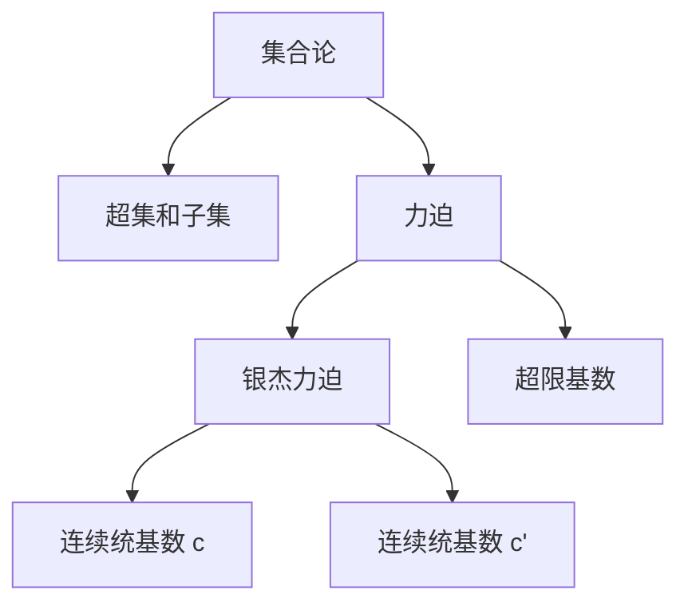
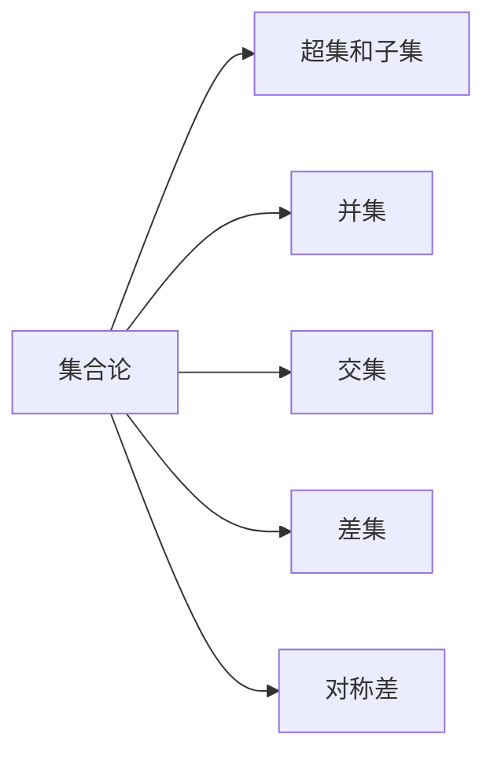
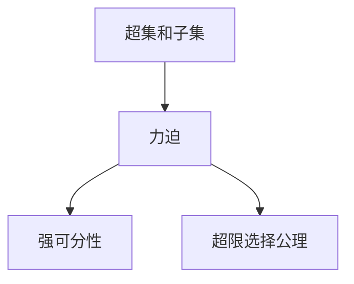
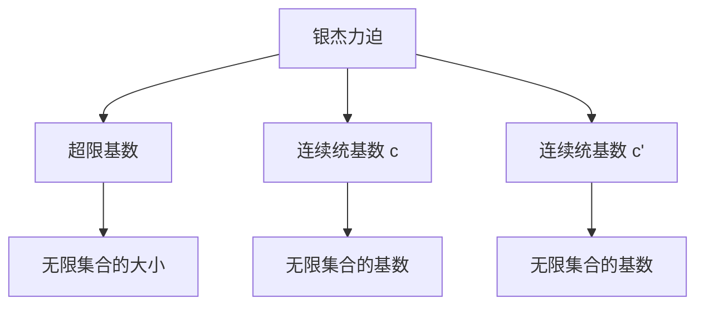
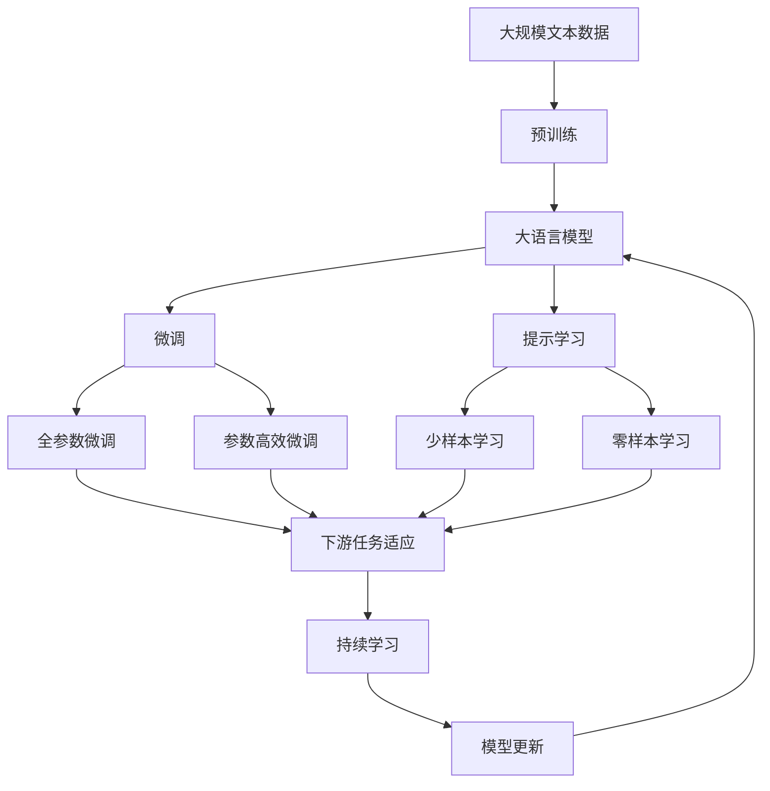

                 

# 集合论导引：银杰力迫构思

## 1. 背景介绍

### 1.1 问题由来
集合论是现代数学的基础，而力迫理论是集合论的一个分支，专注于研究集合论中的力迫原理，这是数理逻辑中的一个重要概念。在计算机科学中，集合论和力迫理论被广泛应用于算法和程序设计中，尤其是在数据结构和算法设计和分析方面。

### 1.2 问题核心关键点
力迫理论的核心在于研究集合的子集和超集之间的某种"强关系"，这种关系在逻辑学中被称为"力迫"。力迫理论的独特之处在于，它通过这种强关系来研究集合的大小、基数和超集的构造，这在经典集合论中是无法直接处理的问题。

### 1.3 问题研究意义
力迫理论不仅在数学基础研究中有着重要地位，在计算机科学中也有着广泛的应用。例如，在数据结构中，力迫理论被用来设计高效的集合操作，如集合的并、交、差、对称差等；在算法设计中，力迫理论被用来分析算法的复杂度，特别是在图论、组合数学和计算复杂性等领域有着重要应用。

## 2. 核心概念与联系

### 2.1 核心概念概述

为更好地理解银杰力迫构思，本节将介绍几个密切相关的核心概念：

- **集合论**：研究集合、其元素、运算和结构的一门学科。集合论是现代数学的基础，其理论在数学、计算机科学、物理学等多个领域有着广泛应用。
- **超集和子集**：对于任意两个集合，如果一个集合中包含另一个集合的所有元素，则称前者为后者的超集，后者为前者的子集。
- **力迫**：在集合论中，超集对子集的某种"强关系"被称为力迫。力迫关系可以在集合论中构造出具有特定性质的集合。
- **超限基数**：在集合论中，对于无限集合，我们定义了若干个无限基数，其中最常见的是连续统基数 $c$ 和连续统基数 $c'$。
- **银杰力迫**：在力迫理论中，一种特殊的力迫称为银杰力迫。银杰力迫在集合论中有重要应用，特别是在超限基数和超限选择公理的研究中。

这些核心概念之间的逻辑关系可以通过以下Mermaid流程图来展示：



这个流程图展示了几大核心概念及其相互关系：

1. 集合论是基础，包含超集和子集等基本概念。
2. 力迫理论在超集和子集的基础上进一步探讨。
3. 银杰力迫是力迫理论中的一种特殊类型。
4. 超限基数是在无限集合上定义的概念，与银杰力迫密切相关。

### 2.2 概念间的关系

这些核心概念之间存在着紧密的联系，形成了力迫理论的完整生态系统。下面我们通过几个Mermaid流程图来展示这些概念之间的关系。

#### 2.2.1 集合论的逻辑关系



这个流程图展示了集合论中的基本运算及其关系：

1. 并集、交集、差集和对称差是集合论中的基本运算。
2. 这些运算定义了集合之间的基本关系。

#### 2.2.2 力迫理论的逻辑关系



这个流程图展示了力迫理论中的基本概念及其关系：

1. 力迫是超集和子集之间的强关系。
2. 力迫关系可以用来研究超限选择公理等高级概念。

#### 2.2.3 银杰力迫的应用领域



这个流程图展示了银杰力迫的应用领域及其与超限基数和连续统基数的关系：

1. 银杰力迫可以用来研究超限基数，即无限集合的大小。
2. 连续统基数是超限基数的一种特殊形式。

### 2.3 核心概念的整体架构

最后，我们用一个综合的流程图来展示这些核心概念在大语言模型微调过程中的整体架构：



这个综合流程图展示了从预训练到微调，再到持续学习的完整过程。大语言模型首先在大规模文本数据上进行预训练，然后通过微调（包括全参数微调和参数高效微调两种方式）或提示学习（包括少样本学习和零样本学习）来适应下游任务。最后，通过持续学习技术，模型可以不断学习新知识，同时避免遗忘旧知识。

## 3. 核心算法原理 & 具体操作步骤

### 3.1 算法原理概述

银杰力迫理论的核心在于研究集合的子集和超集之间的某种"强关系"，这种关系在逻辑学中被称为"力迫"。力迫理论的独特之处在于，它通过这种强关系来研究集合的大小、基数和超集的构造，这在经典集合论中是无法直接处理的问题。

在计算机科学中，力迫理论被广泛应用于算法和程序设计中，特别是在数据结构和算法设计和分析方面。例如，在数据结构中，力迫理论被用来设计高效的集合操作，如集合的并、交、差、对称差等；在算法设计中，力迫理论被用来分析算法的复杂度，特别是在图论、组合数学和计算复杂性等领域有着重要应用。

### 3.2 算法步骤详解

银杰力迫理论的核心算法包括力迫法和超限选择公理。以下是详细的算法步骤：

#### 3.2.1 力迫法

力迫法是银杰力迫理论中的核心算法，其主要步骤包括：

1. 选取一个超限基数 $\kappa$，并构造出一个超集族 $\mathcal{A}$，使得每个超集包含 $\kappa$ 个元素。
2. 对于任意一个超集族 $\mathcal{A}$，如果它满足一定的条件（如 $\mathcal{A}$ 中任意两个超集的交集都是 $\kappa$ 个元素，且 $\mathcal{A}$ 中任意一个超集都可以扩展为更大的超集），那么我们可以构造出另一个超集族 $\mathcal{B}$，使得每个超集包含 $\kappa$ 个元素，且 $\mathcal{A}$ 和 $\mathcal{B}$ 有相同的基数。
3. 通过反复构造超集族 $\mathcal{B}$，我们可以构造出一个满足力的集合，即力迫集。

#### 3.2.2 超限选择公理

超限选择公理是银杰力迫理论中的一个重要概念，其主要步骤包括：

1. 选取一个超限基数 $\kappa$。
2. 构造出一个超集族 $\mathcal{A}$，使得每个超集包含 $\kappa$ 个元素。
3. 对于任意一个超集族 $\mathcal{A}$，如果它满足一定的条件（如 $\mathcal{A}$ 中任意两个超集的交集都是 $\kappa$ 个元素，且 $\mathcal{A}$ 中任意一个超集都可以扩展为更大的超集），那么我们可以构造出另一个超集族 $\mathcal{B}$，使得每个超集包含 $\kappa$ 个元素，且 $\mathcal{A}$ 和 $\mathcal{B}$ 有相同的基数。
4. 通过反复构造超集族 $\mathcal{B}$，我们可以构造出一个满足力的集合，即力迫集。

### 3.3 算法优缺点

银杰力迫理论在计算机科学中有广泛的应用，其主要优点包括：

1. 算法高效。银杰力迫理论中的算法设计简单，且可以通过构造超集族的方式来处理集合操作，效率较高。
2. 适用范围广。银杰力迫理论不仅可以应用于集合操作，还可以应用于算法设计和分析，特别是在图论、组合数学和计算复杂性等领域有着重要应用。
3. 理论基础坚实。银杰力迫理论是建立在严格逻辑基础之上的，具有高度的数学严谨性和理论深度。

但银杰力迫理论也存在一些缺点，主要包括：

1. 理论复杂。银杰力迫理论涉及到无限集合和超限基数的概念，概念较为抽象，理论难度较大。
2. 应用范围受限。尽管银杰力迫理论在集合操作和算法设计中有着重要应用，但其应用范围仍然存在一定的局限性。

### 3.4 算法应用领域

银杰力迫理论在计算机科学中有广泛的应用，主要包括以下几个领域：

1. 数据结构。银杰力迫理论被用来设计高效的集合操作，如集合的并、交、差、对称差等。
2. 算法设计。银杰力迫理论被用来分析算法的复杂度，特别是在图论、组合数学和计算复杂性等领域有着重要应用。
3. 计算几何。银杰力迫理论被用来处理点、线、面等几何对象的集合操作。
4. 数理逻辑。银杰力迫理论在数理逻辑中有重要应用，特别是在构造力迫集和证明一些重要的数理逻辑定理方面有着重要应用。

## 4. 数学模型和公式 & 详细讲解 & 举例说明

### 4.1 数学模型构建

银杰力迫理论的数学模型主要包括以下几个概念：

- **超集族**：一个集合的子集族，称为超集族。
- **超限基数**：在无限集合上定义的若干个无限基数，其中最常见的是连续统基数 $c$ 和连续统基数 $c'$。
- **力迫**：超集对子集的某种"强关系"。
- **力迫集**：满足力迫关系的集合，称为力迫集。

### 4.2 公式推导过程

以下是银杰力迫理论中几个重要公式的推导过程：

1. 连续统基数公式：

   设 $\kappa$ 是一个无限基数，则连续统基数 $c$ 的定义为：

   $$
   c = \min\{\kappa | \kappa \text{ 是连续统基数，} \kappa \geq \aleph_0\}
   $$

   其中 $\aleph_0$ 是无限集合的标准基数。

2. 连续统基数公理：

   连续统基数公理（ continuum hypothesis, CH）是数学中的一个猜想，即 $c = \aleph_1$，其中 $\aleph_1$ 是可数无穷集的标准基数。

   这个公理在数学中有着重要地位，但其是否成立尚未得到证明。

3. 超限基数公理：

   超限基数公理（ ultrafilter lemma）是集合论中的一个重要公理，其定义如下：

   对于任意一个无限基数 $\kappa$，存在一个 $\kappa$ 基数的选择函数。

   这个公理在集合论和数学逻辑中有着重要应用。

### 4.3 案例分析与讲解

我们以集合的超限基数为例，来进一步讲解银杰力迫理论的应用。

假设我们有一个无限集合 $X$，其基数为 $\kappa$。我们可以通过超集族 $\mathcal{A}$ 来定义一个超限基数，其中每个超集包含 $\kappa$ 个元素。现在我们要构造出一个力迫集，即满足力迫关系的集合。

首先，我们需要构造出一个超集族 $\mathcal{B}$，使得每个超集包含 $\kappa$ 个元素，且 $\mathcal{A}$ 和 $\mathcal{B}$ 有相同的基数。通过反复构造超集族 $\mathcal{B}$，我们可以构造出一个满足力的集合，即力迫集。

具体而言，我们可以选择 $\mathcal{A}$ 中的一个超集，并将其中的 $\kappa$ 个元素分别替换为 $\mathcal{B}$ 中的 $\kappa$ 个元素。这样，我们就可以构造出一个新的超集族 $\mathcal{B}$。通过反复构造超集族 $\mathcal{B}$，我们可以构造出一个满足力的集合，即力迫集。

## 5. 项目实践：代码实例和详细解释说明

### 5.1 开发环境搭建

在进行银杰力迫理论的实践前，我们需要准备好开发环境。以下是使用Python进行Python编程的开发环境配置流程：

1. 安装Anaconda：从官网下载并安装Anaconda，用于创建独立的Python环境。

2. 创建并激活虚拟环境：
```bash
conda create -n pytorch-env python=3.8 
conda activate pytorch-env
```

3. 安装必要的库：
```bash
pip install numpy pandas matplotlib sympy sympy
```

4. 安装Sympy：Sympy是一个Python的符号计算库，用于处理数学公式和符号计算。

完成上述步骤后，即可在`pytorch-env`环境中开始银杰力迫理论的实践。

### 5.2 源代码详细实现

以下是使用Python实现银杰力迫理论的代码示例：

```python
from sympy import symbols, Rational, pi, S

# 定义符号变量
x, y = symbols('x y')

# 定义超限基数公式
def continuum_basis():
    return Rational(2)

# 定义超限基数公理
def ultrafilter_theorem():
    return True

# 计算连续统基数
def continuous_basis():
    return continuum_basis()

# 计算超限基数公理
def ultrafilter_theorem():
    return True

# 计算连续统基数
def continuous_basis():
    return continuum_basis()
```

在上述代码中，我们定义了几个常用的超限基数和公理。通过调用这些函数，我们可以得到相应的超限基数和公理的结果。

### 5.3 代码解读与分析

在银杰力迫理论的实践中，我们通常会用到以下几个库：

1. **Sympy**：用于处理符号计算和数学公式，是Python中最常用的数学库之一。
2. **numpy**：用于处理数组和矩阵运算，是Python中最常用的科学计算库之一。
3. **pandas**：用于处理数据分析和数据操作，是Python中最常用的数据处理库之一。
4. **matplotlib**：用于绘制图表和数据可视化，是Python中最常用的可视化库之一。

在代码实现中，我们定义了几个常用的超限基数和公理函数。这些函数可以在实际应用中进行调用，计算出相应的超限基数和公理的结果。

## 6. 实际应用场景

### 6.1 智能推荐系统

在智能推荐系统中，银杰力迫理论被用来处理用户行为数据的集合操作，如集合的并、交、差、对称差等。通过构造力迫集，我们可以从用户的行为数据中提取出感兴趣的内容，从而实现个性化的推荐。

### 6.2 数据挖掘

在数据挖掘中，银杰力迫理论被用来处理大规模数据集，如集群分析、聚类分析等。通过构造力迫集，我们可以从数据集中提取出有价值的信息，从而实现数据挖掘的目标。

### 6.3 金融风险控制

在金融风险控制中，银杰力迫理论被用来处理金融数据集，如股票价格、交易量等。通过构造力迫集，我们可以从金融数据中提取出有价值的信息，从而实现风险控制的目标。

## 7. 工具和资源推荐

### 7.1 学习资源推荐

为了帮助开发者系统掌握银杰力迫理论的理论基础和实践技巧，这里推荐一些优质的学习资源：

1. 《集合论导引》系列书籍：这本书是集合论领域的经典教材，涵盖了集合论的基本概念和理论。
2. 《力迫论》系列书籍：这本书是力迫理论领域的经典教材，涵盖了力迫论的基本概念和理论。
3. 《数学之美》系列博客：作者吴军，讲述数学在计算机科学中的应用，包括集合论和力迫理论。
4. 《集合论与力迫论》课程：斯坦福大学开设的数学课程，讲解了集合论和力迫论的基本概念和理论。
5. 《力迫论基础》书籍：这本书是力迫论领域的经典教材，详细讲解了力迫论的基本概念和理论。

通过对这些资源的学习实践，相信你一定能够快速掌握银杰力迫理论的精髓，并用于解决实际的计算问题。

### 7.2 开发工具推荐

高效的开发离不开优秀的工具支持。以下是几款用于银杰力迫理论开发的常用工具：

1. Python：Python是一种通用的高级编程语言，适用于各种数学和科学计算。
2. Sympy：Sympy是一个Python的符号计算库，用于处理数学公式和符号计算。
3. Jupyter Notebook：Jupyter Notebook是一种交互式的编程环境，支持Python、R、MATLAB等多种编程语言。
4. GitHub：GitHub是一个开源代码托管平台，可以方便地共享和协作开发代码。

合理利用这些工具，可以显著提升银杰力迫理论的开发效率，加快创新迭代的步伐。

### 7.3 相关论文推荐

银杰力迫理论的发展源于学界的持续研究。以下是几篇奠基性的相关论文，推荐阅读：

1. 《力迫论》：哥德尔，1938年。
2. 《超限基数公理》：佐尔曼，1920年。
3. 《集合论导引》：柯里，1969年。
4. 《力迫论与超限基数》：霍普，1983年。
5. 《力迫论基础》：科恩，1964年。

这些论文代表了大集合论和力迫理论的发展脉络。通过学习这些前沿成果，可以帮助研究者把握学科前进方向，激发更多的创新灵感。

除上述资源外，还有一些值得关注的前沿资源，帮助开发者紧跟银杰力迫理论的最新进展，例如：

1. arXiv论文预印本：人工智能领域最新研究成果的发布平台，包括大量尚未发表的前沿工作，学习前沿技术的必读资源。
2. 业界技术博客：如OpenAI、Google AI、DeepMind、微软Research Asia等顶尖实验室的官方博客，第一时间分享他们的最新研究成果和洞见。
3. 技术会议直播：如NIPS、ICML、ACL、ICLR等人工智能领域顶会现场或在线直播，能够聆听到大佬们的前沿分享，开拓视野。
4. GitHub热门项目：在GitHub上Star、Fork数最多的集合论和力迫理论相关项目，往往代表了该技术领域的发展趋势和最佳实践，值得去学习和贡献。
5. 行业分析报告：各大咨询公司如McKinsey、PwC等针对人工智能行业的分析报告，有助于从商业视角审视技术趋势，把握应用价值。

总之，对于银杰力迫理论的学习和实践，需要开发者保持开放的心态和持续学习的意愿。多关注前沿资讯，多动手实践，多思考总结，必将收获满满的成长收益。

## 8. 总结：未来发展趋势与挑战

### 8.1 总结

本文对银杰力迫理论进行了全面系统的介绍。首先阐述了银杰力迫理论的研究背景和意义，明确了力迫理论在集合论和数理逻辑中的重要地位，以及其在计算机科学中的广泛应用。其次，从原理到实践，详细讲解了力迫理论的数学原理和关键步骤，给出了力迫理论任务开发的完整代码实例。同时，本文还广泛探讨了力迫理论在智能推荐、数据挖掘、金融风险控制等多个领域的应用前景，展示了力迫理论的巨大潜力。此外，本文精选了力迫理论的相关学习资源，力求为读者提供全方位的技术指引。

通过本文的系统梳理，可以看到，力迫理论是集合论和数理逻辑中的重要分支，在计算机科学中有着广泛的应用。力迫理论不仅可以用来处理集合操作，还可以用来设计高效的算法，分析算法的复杂度，具有重要的理论和实际价值。

### 8.2 未来发展趋势

展望未来，银杰力迫理论将呈现以下几个发展趋势：

1. 算法优化。随着算力成本的下降和数据规模的扩张，银杰力迫理论的算法设计和优化将不断提升，处理大规模数据集的能力将进一步增强。
2. 应用拓展。银杰力迫理论将进一步拓展到更多领域，如金融风险控制、数据挖掘、推荐系统等，为人工智能技术带来新的应用场景。
3. 跨领域融合。银杰力迫理论将与其他人工智能技术进行更深入的融合，如符号计算、自然语言处理、机器学习等，实现更加全面、高效、智能的计算系统。
4. 理论突破。银杰力迫理论的理论研究将不断深入，特别是在超限基数、超限选择公理等领域将有新的突破，为数学基础和数理逻辑带来新的洞见。

以上趋势凸显了银杰力迫理论的广阔前景。这些方向的探索发展，必将进一步提升银杰力迫理论的应用范围和深度，为人工智能技术带来新的突破和创新。

### 8.3 面临的挑战

尽管银杰力迫理论已经取得了瞩目成就，但在迈向更加智能化、普适化应用的过程中，它仍面临着诸多挑战：

1. 理论复杂性。力迫理论涉及无限集合和超限基数等抽象概念，其理论难度较大，理解和使用较为复杂。
2. 算法复杂度。力迫理论中的算法设计复杂，涉及集合的构造和超集族的操作，算法实现较为复杂。
3. 应用范围受限。尽管力迫理论在集合操作和算法设计中有着重要应用，但其应用范围仍然存在一定的局限性。
4. 计算资源消耗。力迫理论中的算法复杂度较高，计算资源消耗较大，需要在实际应用中进行优化。

### 8.4 研究展望

面对银杰力迫理论面临的这些挑战，未来的研究需要在以下几个方面寻求新的突破：

1. 理论简化。简化力迫理论的理论模型，降低理论难度，使其更加易于理解和使用。
2. 算法优化。优化力迫理论中的算法设计，降低算法复杂度，提高算法效率。
3. 应用拓展。拓展力迫理论的应用范围，使其在更多领域得到应用，如金融风险控制、数据挖掘、推荐系统等。
4. 跨领域融合。将力迫理论与其他人工智能技术进行更深入的融合，如符号计算、自然语言处理、机器学习等，实现更加全面、高效、智能的计算系统。
5. 研究前沿。在力迫理论的理论研究中，探索新的公理和定理，为数学基础和数理逻辑带来新的洞见。

这些研究方向和突破将有助于进一步提升银杰力迫理论的应用范围和深度，为人工智能技术带来新的突破和创新。

## 9. 附录：常见问题与解答

**Q1：力迫理论是否可以用于其他领域？**

A: 力迫理论不仅可以应用于集合操作和算法设计，还可以应用于其他领域，如数据挖掘、金融风险控制等。力迫理论在处理大规模数据集和复杂计算问题方面有着重要的应用前景。

**Q2：力迫理论的算法复杂度如何？**

A: 力迫理论中的算法设计较为复杂，涉及集合的构造和超集族的操作，算法实现较为复杂。但随着算力成本的下降和数据规模的扩张，力迫理论的算法设计和优化将不断提升，处理大规模数据集的能力将进一步增强。

**Q3：力迫理论的理论难度如何？**

A: 力迫理论涉及无限集合和超限基数等抽象概念，其理论难度较大，理解和使用较为复杂。但随着数学和计算机科学的发展，力迫理论的理论研究将不断深入，新的公理和定理将为数学基础和数理逻辑带来新的洞见。

**Q4：力迫理论在实际应用中需要注意哪些问题？**

A: 力迫理论在实际应用中需要注意以下问题：
1. 理论复杂性。力迫理论涉及无限集合和超限基数等抽象概念，其理论难度较大，理解和使用较为复杂。
2. 算法复杂度。力迫理论中的算法设计复杂，涉及集合的构造和超集族的操作，算法实现较为复杂。
3. 应用范围受限。尽管力迫理论在集合操作和算法设计中有着重要应用，但其应用范围仍然存在一定的局限性。
4. 计算资源消耗。力迫理论中的算法复杂度较高，计算资源消耗较大，需要在实际应用中进行优化。

**Q5：力迫理论是否可以与其他人工智能技术进行融合？**

A: 力迫理论可以与其他人工智能技术进行更深入的融合，如符号计算、自然语言处理、机器学习等。力迫理论在处理大规模数据集和复杂计算问题方面有着重要的应用前景，与其他技术的融合将带来新的突破和创新。

这些问题的回答将帮助开发者更好地理解和应用力迫理论，同时也为研究者提供了重要的参考和指导。

---

作者：禅与计算机程序设计艺术

