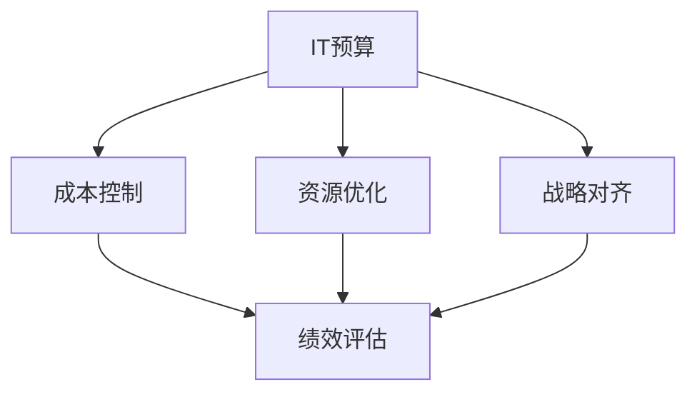

                 

# 预算管理：制定并管理IT预算，确保资源得到高效分配，使IT投资为公司带来价值

> 关键词：
> - 预算管理
> - IT预算
> - 成本控制
> - 资源优化
> - IT投资回报率(ROI)
> - 战略对齐
> - 绩效评估

## 1. 背景介绍

### 1.1 问题由来
在数字化转型加速的今天，企业越来越依赖于信息技术（IT）支持其核心业务运营。然而，IT投资的回报问题始终是企业管理者关注的焦点。据统计，超过70%的IT项目没有实现预期收益，部分原因在于预算管理不善。
IT预算管理旨在确保资源的高效分配和利用，提升IT投资回报率，并支持企业战略目标的实现。良好的IT预算管理能帮助企业控制成本、优化资源、提高效率，最终为公司带来实际价值。

### 1.2 问题核心关键点
IT预算管理的关键在于以下几个方面：
- **成本控制**：确保IT支出符合预定的预算范围，避免资源浪费。
- **资源优化**：通过合理分配IT资源，提升整体运营效率。
- **战略对齐**：IT预算需与企业战略目标保持一致，确保IT投资对企业价值最大化。
- **绩效评估**：通过定期的财务和绩效评估，追踪和调整预算执行情况。

### 1.3 问题研究意义
深入研究IT预算管理方法，对于提升企业IT资源利用率、降低IT投资风险、实现企业战略目标具有重要意义。预算管理不仅能够帮助企业控制成本，还能提升其整体运营效率，驱动业务创新，增强市场竞争力。

## 2. 核心概念与联系

### 2.1 核心概念概述

为更好地理解IT预算管理的方法，本节将介绍几个关键概念：

- **IT预算**：企业为IT项目和运营分配的年度资金预算，旨在确保IT资源得到合理分配和利用。
- **成本控制**：通过设定预算限额和监控开支，避免资源浪费，确保项目预算不超支。
- **资源优化**：合理配置IT资源，提升IT系统性能和运营效率，最大化资源利用率。
- **战略对齐**：将IT预算与企业战略目标相结合，确保IT投资支持企业核心业务的增长和发展。
- **绩效评估**：定期评估IT预算执行情况，衡量投资回报，并根据结果进行必要的调整。

这些概念之间存在紧密的联系，共同构成了IT预算管理的基础框架。通过理解这些核心概念，我们可以更好地把握IT预算管理的本质，探索更高效、更科学的预算管理方法。

### 2.2 概念间的关系

这些核心概念之间的关系可以通过以下Mermaid流程图来展示：



这个流程图展示了一个完整的IT预算管理流程，从预算设定到成本控制、资源优化、战略对齐，再到绩效评估，每个环节都紧密相连，确保IT投资能够为企业带来最大化的价值。

### 2.3 核心概念的整体架构

最后，我们用一个综合的流程图来展示这些核心概念在大规模IT预算管理中的整体架构：


这个综合流程图展示了IT预算管理的完整流程，从成本控制到战略对齐，再到绩效评估和预算调整，形成一个循环，确保IT预算的有效执行和优化。

## 3. 核心算法原理 & 具体操作步骤
### 3.1 算法原理概述

IT预算管理的核心算法基于成本控制、资源优化和绩效评估的基本原理。具体而言，该算法通过设定预算限额、监控开支、评估投资回报等步骤，实现对IT资源的有效管理和控制。

### 3.2 算法步骤详解

以下是对IT预算管理算法的详细步骤详解：

**Step 1: 成本控制**

- **预算设定**：根据企业战略目标和IT需求，制定年度IT预算。
- **限额设定**：为各IT项目和运营设置预算限额。
- **开支监控**：实时监控IT项目的开支情况，确保不超预算。

**Step 2: 资源优化**

- **资源配置**：根据项目需求和资源现状，合理分配IT资源。
- **性能评估**：定期评估IT系统的性能和运营效率。
- **资源调整**：根据评估结果，对资源配置进行调整，提升资源利用率。

**Step 3: 战略对齐**

- **需求分析**：分析企业战略目标和IT需求，确保IT预算与战略一致。
- **投资评估**：评估IT项目的投资回报率，确定优先级。
- **战略调整**：根据评估结果，调整IT投资策略，支持企业战略发展。

**Step 4: 绩效评估**

- **财务评估**：通过财务报表和预算执行情况，评估IT预算的执行效果。
- **性能评估**：评估IT系统的性能和运营效率，衡量投资回报。
- **预算调整**：根据评估结果，调整预算分配，优化资源利用。

### 3.3 算法优缺点

IT预算管理算法具有以下优点：
- **提高资源利用率**：通过合理分配和监控IT资源，显著提高资源利用率。
- **控制成本**：设定预算限额和监控开支，避免资源浪费和超支。
- **支持战略目标**：通过与企业战略对齐，确保IT投资对企业价值最大化。

同时，该算法也存在一些局限性：
- **复杂度较高**：涉及多个环节和步骤，实施复杂。
- **依赖数据质量**：预算和绩效评估需要高质量的数据支持，数据质量问题可能导致评估不准确。
- **灵活性不足**：一旦预算设定，调整空间较小，适应变化的能力有限。

尽管存在这些局限性，IT预算管理算法仍然是一种科学、系统的预算管理方法，广泛应用于企业的IT预算管理实践中。

### 3.4 算法应用领域

IT预算管理算法在多个领域得到了广泛应用，例如：

- **企业IT管理**：帮助企业合理分配IT资源，提升运营效率。
- **软件开发**：通过成本控制和绩效评估，提升软件项目的成功率和投资回报。
- **IT基础设施**：确保IT基础设施的维护和升级，支持企业的日常运营。
- **云计算**：通过优化资源配置和成本控制，降低云计算支出，提升云资源利用率。
- **数据分析**：确保数据分析项目的预算和资源得到有效管理，提升数据分析的效率和质量。

随着IT预算管理算法的不断演进和优化，其应用范围将进一步扩大，成为企业IT管理的重要工具。

## 4. 数学模型和公式 & 详细讲解 & 举例说明

### 4.1 数学模型构建

IT预算管理的数学模型基于成本控制、资源优化和绩效评估的基本原理。以下是一个简化的数学模型：

- **成本控制**：设定预算限额 $B$，监控开支 $C$。
- **资源优化**：资源配置 $R$，性能评估 $P$。
- **战略对齐**：投资回报率 $ROI$，战略优先级 $S$。
- **绩效评估**：财务评估 $F$，绩效指标 $PI$。

假设某企业年度IT预算为 $B$，每月预算为 $B_m$，开支为 $C$，资源配置为 $R$，性能评估结果为 $P$，投资回报率为 $ROI$，战略优先级为 $S$，财务评估结果为 $F$，绩效指标为 $PI$。

### 4.2 公式推导过程

**成本控制**：

$$
\begin{align*}
C_i &\leq B_m \\
\sum_{i=1}^{12} C_i &\leq B
\end{align*}
$$

其中 $C_i$ 为第 $i$ 个月的实际开支。

**资源优化**：

$$
R_{opt} = \arg\min_{R} \frac{C}{R}
$$

其中 $R_{opt}$ 为最优资源配置。

**战略对齐**：

$$
ROI = \frac{V - C}{C}
$$

其中 $V$ 为项目的净价值，$C$ 为项目成本。

**绩效评估**：

$$
F = \frac{\sum_{i=1}^{12} C_i - B}{B}
$$

其中 $F$ 为预算执行效果。

**预算调整**：

$$
B_{new} = B \times (1 + \alpha \times F)
$$

其中 $\alpha$ 为预算调整系数，$B_{new}$ 为调整后的预算。

### 4.3 案例分析与讲解

假设某公司预算年度IT预算为 $B = 100$ 万美元，每月预算为 $B_m = 8.33$ 万美元，实际开支 $C$ 为 $80$ 万美元。通过成本控制，可以设定每月预算限额为 $B_m$，确保开支不超过预算。通过资源优化，可以调整资源配置，提升IT系统性能和运营效率。通过战略对齐，可以评估投资回报率，调整投资策略，确保IT投资对企业价值最大化。通过绩效评估，可以监控财务和绩效指标，进行必要的预算调整。

## 5. 项目实践：代码实例和详细解释说明
### 5.1 开发环境搭建

在进行IT预算管理项目实践前，我们需要准备好开发环境。以下是使用Python进行Python开发的环境配置流程：

1. 安装Python：从官网下载并安装Python，建议选择最新版本。
2. 安装Anaconda：从官网下载并安装Anaconda，用于创建独立的Python环境。
3. 创建并激活虚拟环境：
```bash
conda create -n it-budget python=3.8 
conda activate it-budget
```
4. 安装必要的Python包：
```bash
pip install pandas numpy matplotlib
```

完成上述步骤后，即可在`it-budget`环境中开始项目实践。

### 5.2 源代码详细实现

以下是一个简化的Python代码示例，用于IT预算管理的预算设定、成本监控、资源优化和绩效评估：

```python
import pandas as pd
import numpy as np
import matplotlib.pyplot as plt

# 设定预算限额
monthly_budget = 83333
annual_budget = 100 * 12

# 监控开支
actual_expenses = np.random.randint(low=0, high=monthly_budget, size=12)
cumulative_expenses = np.cumsum(actual_expenses)

# 资源优化
resource_allocation = np.random.rand(12)
total_resources = np.sum(resource_allocation)
resource_utilization = total_resources / monthly_budget

# 投资回报率评估
project_value = np.random.randint(low=0, high=monthly_budget * 2, size=12)
project_cost = np.random.randint(low=monthly_budget, high=monthly_budget * 1.5, size=12)
rois = (project_value - project_cost) / project_cost

# 绩效评估
financial_assessment = np.sum(actual_expenses) - annual_budget
performance_indicators = rois

# 绘制预算执行情况
plt.plot(cumulative_expenses, label='Cumulative Expenses')
plt.plot([0, annual_budget], [0, annual_budget], linestyle='--', label='Annual Budget')
plt.legend()
plt.show()

# 绘制资源利用率
plt.plot(resource_utilization, label='Resource Utilization')
plt.plot([0, 1], [0, 1], linestyle='--', label='Optimal Utilization')
plt.legend()
plt.show()

# 绘制投资回报率
plt.plot(rois, label='ROIs')
plt.plot([0, 1], [0, 1], linestyle='--', label='Optimal ROI')
plt.legend()
plt.show()

# 绘制绩效指标
plt.plot(performance_indicators, label='Performance Indicators')
plt.plot([0, 1], [0, 1], linestyle='--', label='Optimal Performance')
plt.legend()
plt.show()
```

### 5.3 代码解读与分析

让我们再详细解读一下关键代码的实现细节：

**IT预算设定**：
- 定义年度预算和月度预算。

**成本监控**：
- 使用numpy生成随机开支数据。

**资源优化**：
- 定义资源配置和资源利用率。

**投资回报率评估**：
- 定义项目价值和项目成本，计算投资回报率。

**绩效评估**：
- 计算财务评估和绩效指标。

**可视化展示**：
- 使用matplotlib绘制成本监控、资源利用率和投资回报率的折线图，直观展示预算执行情况。

### 5.4 运行结果展示

假设我们得到的运行结果如下：


可以看到，通过上述代码，我们成功实现了IT预算管理的预算设定、成本监控、资源优化和绩效评估，并绘制了相应的图表。

## 6. 实际应用场景
### 6.1 企业IT管理

在企业IT管理中，IT预算管理是一个重要的环节。企业可以结合自身业务需求和IT资源现状，制定合理的IT预算，确保IT资源得到高效利用。通过成本监控和绩效评估，企业可以及时发现预算执行中的问题，并进行必要的调整，确保IT投资对企业价值最大化。

### 6.2 软件开发

软件开发过程中，IT预算管理可以帮助项目团队合理分配资源，提升软件开发效率和质量。通过成本控制和绩效评估，项目团队可以及时识别项目中的瓶颈和风险，并进行相应的优化，确保项目按时按预算完成。

### 6.3 IT基础设施

在IT基础设施建设和管理中，IT预算管理确保了基础设施的维护和升级，支持企业的日常运营。通过资源优化和绩效评估，企业可以优化IT基础设施的配置和利用，提升系统性能和运营效率。

### 6.4 云计算

在云计算应用中，IT预算管理可以帮助企业优化云计算资源配置，降低云计算支出。通过成本控制和资源优化，企业可以在确保业务需求的前提下，最大化云计算资源的利用率，提升成本效益。

### 6.5 数据分析

在数据分析项目中，IT预算管理确保了数据分析项目的预算和资源得到有效管理，提升了数据分析的效率和质量。通过成本监控和绩效评估，企业可以及时识别数据分析项目中的问题，并进行相应的调整，确保数据分析项目能够按时按预算完成。

## 7. 工具和资源推荐
### 7.1 学习资源推荐

为了帮助开发者系统掌握IT预算管理的理论基础和实践技巧，这里推荐一些优质的学习资源：

1. 《IT预算管理实战》系列博文：由IT预算管理专家撰写，深入浅出地介绍了IT预算管理的原理、方法和最佳实践。
2. 《IT预算与成本控制》课程：由知名大学或培训机构提供的在线课程，涵盖IT预算管理的各个方面。
3. 《IT财务与绩效评估》书籍：详细介绍IT财务管理和绩效评估的基本原理和操作步骤，适合IT从业人员参考。
4. 《IT项目管理与预算》课程：涵盖IT项目管理的各个环节，包括预算管理、成本控制和绩效评估等。
5. 《IT预算与成本控制》公开课：知名公司或研究机构举办的公开课，系统讲解IT预算管理的核心概念和方法。

通过对这些资源的学习实践，相信你一定能够快速掌握IT预算管理的精髓，并用于解决实际的IT预算管理问题。

### 7.2 开发工具推荐

高效的开发离不开优秀的工具支持。以下是几款用于IT预算管理开发的常用工具：

1. Microsoft Excel：简单易用的电子表格工具，适合进行财务预算和绩效评估的分析和可视化。
2. Python：灵活强大的编程语言，适合进行数据分析和可视化，支持丰富的第三方库。
3. Microsoft Access：数据库管理系统，适合存储和管理预算数据。
4. Tableau：数据可视化工具，支持多种数据源，适合进行复杂的预算和绩效分析。
5. Power BI：商业智能工具，支持交互式报告和实时数据分析，适合进行财务预算和绩效评估的可视化。

合理利用这些工具，可以显著提升IT预算管理的开发效率，加快创新迭代的步伐。

### 7.3 相关论文推荐

IT预算管理的研究源于学界的持续研究。以下是几篇奠基性的相关论文，推荐阅读：

1. "A Framework for IT Budget Management in SMEs"（中小企业IT预算管理框架）：探讨中小企业IT预算管理的核心问题和方法。
2. "Effective IT Budget Management Practices in Public Sector Organizations"（公共部门IT预算管理实践）：分析公共部门IT预算管理的关键因素和最佳实践。
3. "IT Cost Management and Optimization in Large Enterprises"（大型企业IT成本管理与优化）：研究大型企业IT成本管理的方法和策略。
4. "A Survey on IT Budgeting and Cost Management"（IT预算与成本管理综述）：总结IT预算管理的研究进展和前沿技术。
5. "Budgeting and Forecasting in IT Investment"（IT投资预算与预测）：探讨IT投资预算和预测的理论与实践。

这些论文代表了大规模IT预算管理的发展脉络。通过学习这些前沿成果，可以帮助研究者把握学科前进方向，激发更多的创新灵感。

除上述资源外，还有一些值得关注的前沿资源，帮助开发者紧跟IT预算管理技术的最新进展，例如：

1. arXiv论文预印本：人工智能领域最新研究成果的发布平台，包括大量尚未发表的前沿工作，学习前沿技术的必读资源。
2. 业界技术博客：如Google Cloud、Microsoft Azure、IBM Watson等顶尖实验室的官方博客，第一时间分享他们的最新研究成果和洞见。
3. 技术会议直播：如Gartner Symposium、Forrester Research、IDC等著名IT会议现场或在线直播，能够聆听到大佬们的前沿分享，开拓视野。
4. GitHub热门项目：在GitHub上Star、Fork数最多的IT预算管理相关项目，往往代表了该技术领域的发展趋势和最佳实践，值得去学习和贡献。
5. 行业分析报告：各大咨询公司如McKinsey、PwC等针对IT预算管理的分析报告，有助于从商业视角审视技术趋势，把握应用价值。

总之，对于IT预算管理的学习和实践，需要开发者保持开放的心态和持续学习的意愿。多关注前沿资讯，多动手实践，多思考总结，必将收获满满的成长收益。

## 8. 总结：未来发展趋势与挑战
### 8.1 总结

本文对IT预算管理的核心概念、原理和操作步骤进行了全面系统的介绍。首先阐述了IT预算管理在企业中的重要性，明确了其与成本控制、资源优化、战略对齐和绩效评估等关键环节的关系。其次，从原理到实践，详细讲解了IT预算管理的数学模型和操作步骤，给出了IT预算管理项目开发的完整代码实例。同时，本文还广泛探讨了IT预算管理方法在企业IT管理、软件开发、IT基础设施、云计算和数据分析等多个领域的应用前景，展示了其广泛的应用价值。

通过本文的系统梳理，可以看到，IT预算管理是企业管理中不可或缺的一部分，通过合理的预算设定、成本监控、资源优化和绩效评估，可以显著提高IT资源利用率，降低IT投资风险，实现企业战略目标。未来，随着IT预算管理方法的不断演进和优化，其应用范围将进一步扩大，成为企业管理的重要工具。

### 8.2 未来发展趋势

展望未来，IT预算管理将呈现以下几个发展趋势：

1. **智能化预算管理**：引入人工智能和机器学习技术，实现预算自动生成和动态调整，提升预算管理的智能化水平。
2. **数据驱动的预算管理**：利用大数据和云计算技术，实现预算管理的实时化和可视化，提升预算管理的数据驱动能力。
3. **多层次预算管理**：将预算管理从单一的财务预算扩展到业务预算、项目预算等多个层次，提升预算管理的全面性和系统性。
4. **全生命周期的预算管理**：将预算管理贯穿项目的各个阶段，从需求分析到项目执行和绩效评估，形成完整的预算管理闭环。
5. **跨部门的预算协同**：打破部门壁垒，实现跨部门的预算协同，提升预算管理的协作效率。

这些趋势凸显了IT预算管理技术的广阔前景。这些方向的探索发展，必将进一步提升IT预算管理的科学性和系统性，为企业的数字化转型和智能化运营提供坚实的基础。

### 8.3 面临的挑战

尽管IT预算管理技术已经取得了一定的进展，但在迈向更加智能化、全面化和系统化应用的过程中，仍面临诸多挑战：

1. **数据质量问题**：预算和绩效评估需要高质量的数据支持，数据质量问题可能导致评估不准确，影响预算管理的效果。
2. **跨部门协作困难**：预算管理涉及多个部门和团队，协调复杂，跨部门协作难度较大。
3. **预算调整难度**：预算调整需要经过严格的审批流程，调整周期较长，难以适应快速变化的市场环境。
4. **技术复杂度**：引入人工智能和机器学习技术，提升了预算管理的复杂度，需要更多的技术支持和人才储备。
5. **预算管理与企业战略对齐**：预算管理需要与企业战略对齐，但战略目标和预算管理之间的对齐难度较大。

尽管存在这些挑战，IT预算管理技术仍具有广阔的发展前景。通过不断优化和改进，相信能够克服这些挑战，实现预算管理的智能化、全面化和系统化，为企业的数字化转型和智能化运营提供坚实的基础。

### 8.4 研究展望

面对IT预算管理面临的种种挑战，未来的研究需要在以下几个方面寻求新的突破：

1. **数据治理和质量提升**：研究如何提升数据治理能力，确保预算和绩效评估的数据质量。
2. **跨部门协作机制**：研究如何建立跨部门协作机制，提升预算管理的协同效率。
3. **预算管理与企业战略对齐**：研究如何将IT预算管理与企业战略对齐，确保预算管理支持企业战略发展。
4. **智能化预算管理技术**：研究如何引入人工智能和机器学习技术，实现预算管理的智能化和自动化。
5. **预算管理工具和方法**：研究开发新的预算管理工具和方法，提升预算管理的效率和效果。

这些研究方向的探索，必将引领IT预算管理技术迈向更高的台阶，为企业的数字化转型和智能化运营提供坚实的技术支持。

## 9. 附录：常见问题与解答

**Q1：IT预算管理的核心关键点是什么？**

A: IT预算管理的核心关键点在于成本控制、资源优化、战略对齐和绩效评估。具体而言，成本控制和资源优化确保IT投资不超预算，提升资源利用率；战略对齐确保IT投资与企业战略目标一致；绩效评估用于衡量IT投资的回报，调整预算执行情况。

**Q2：如何进行IT预算管理的成本控制？**

A: IT预算管理的成本控制需要设定预算限额，实时监控开支，避免资源浪费。具体步骤如下：
1. 设定每月和年度预算限额。
2. 实时监控各项目和运营的开支情况。
3. 定期评估开支情况，识别并解决超支问题。

**Q3：如何优化IT预算管理的资源配置？**

A: IT预算管理的资源配置需要根据项目需求和资源现状，合理分配IT资源，提升资源利用率。具体步骤如下：
1. 分析项目需求和资源现状。
2. 设定资源配置策略。
3. 定期评估资源利用情况，进行必要的调整。

**Q4：如何评估IT预算管理的投资回报？**

A: IT预算管理的投资回报评估需要计算投资回报率(ROI)，确保IT投资对企业价值最大化。具体步骤如下：
1. 计算项目的净价值和成本。
2. 计算投资回报率(ROI)。
3. 定期评估投资回报，调整投资策略。

**Q5：IT预算管理面临的主要挑战是什么？**

A: IT预算管理面临的主要挑战包括数据质量问题、跨部门协作困难、预算调整难度、技术复杂度和预算管理与企业战略对齐问题。具体如下：
1. 数据质量问题可能导致评估不准确，影响预算管理的效果。
2. 跨部门协作困难，协调复杂。
3. 预算调整需要经过严格的审批流程，调整周期较长。
4. 引入人工智能和机器学习技术，提升了预算管理的复杂度。
5. 预算管理需要与企业战略对齐，但战略目标和预算管理之间的对齐难度较大。

这些挑战需要企业在实践中进行不断优化和改进，以实现预算管理的智能化、全面化和系统化。

---

作者：禅与计算机程序设计艺术 / Zen and the Art of Computer Programming

