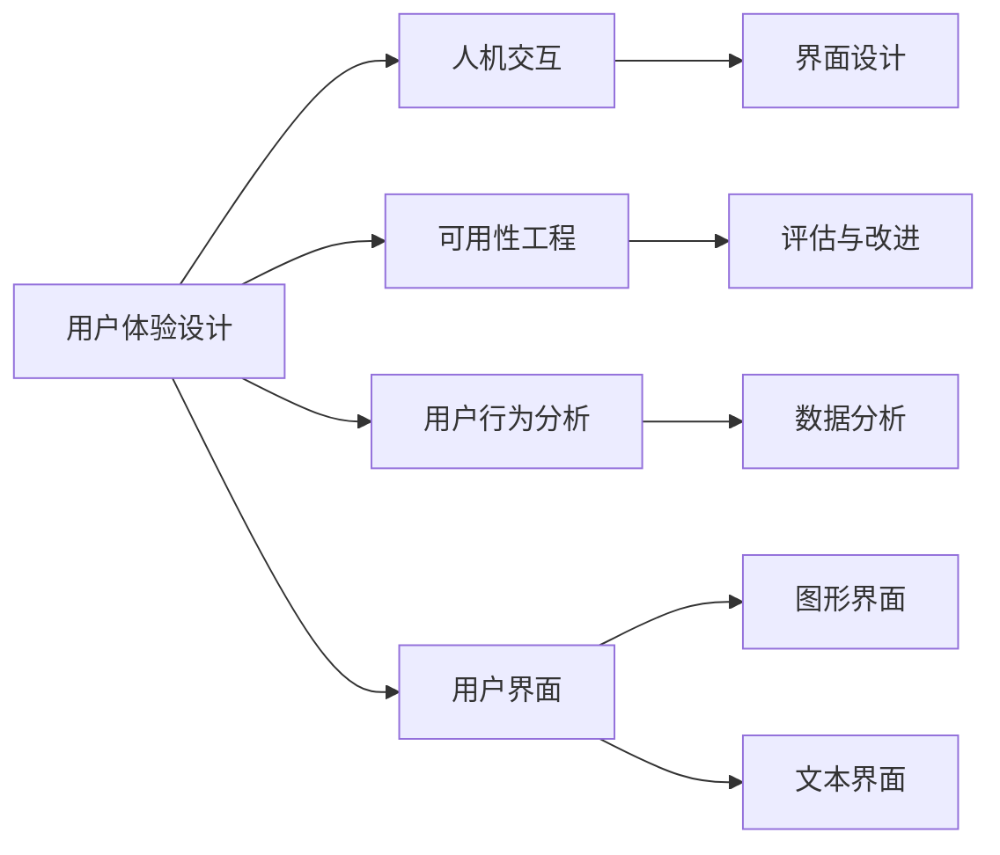

                 

# 自动驾驶行业的用户体验设计与评估方法

## 1. 背景介绍

随着自动驾驶技术的快速发展，用户体验设计（User Experience Design, UX设计）成为了该领域内的一个重要研究方向。自动驾驶系统不再只是一个纯粹的技术产品，而是一个需要兼顾人机交互、安全性、便利性等多重因素的复杂系统。优秀的用户体验不仅能够提升用户满意度，还能增加用户对自动驾驶技术的信任度和接受度，从而推动整个行业的发展。

### 1.1 问题由来

尽管自动驾驶技术在近年来取得了长足进步，但其在实际应用中的用户体验却并未得到充分考虑。传统的用户体验设计方法难以直接应用于自动驾驶，主要原因如下：

- **技术复杂性**：自动驾驶系统涉及到感知、决策、控制等多个子系统，各子系统之间的交互复杂，用户体验设计难度较大。
- **实时性要求高**：自动驾驶需要在毫秒级别做出决策，用户体验设计需要考虑实时性对系统性能的影响。
- **用户期望多元**：用户对于自动驾驶的期望从安全驾驶延伸到舒适体验、娱乐等多元需求，用户体验设计需要综合考虑这些需求。
- **法规限制**：不同国家和地区对于自动驾驶的法规限制不同，用户体验设计需要符合当地法规要求。

### 1.2 问题核心关键点

为提高自动驾驶系统的用户体验，需从以下几个方面进行深入研究：

- **人机交互**：如何设计简洁直观的用户界面，实现与用户的有效沟通。
- **安全性**：如何设计可靠的系统架构，确保驾驶安全。
- **舒适性**：如何设计舒适的驾驶环境，减少用户疲劳感。
- **可用性**：如何设计易于操作的用户界面，降低用户学习成本。
- **可靠性**：如何设计稳定的系统，减少用户对系统的不信任感。

### 1.3 问题研究意义

自动驾驶行业的用户体验设计研究，对于推动自动驾驶技术的普及和应用具有重要意义：

- **提升用户满意度**：优秀的用户体验设计能够提高用户对自动驾驶技术的接受度，增加用户粘性。
- **增加市场竞争力**：良好的用户体验是提升自动驾驶企业竞争力的重要因素。
- **促进法规制定**：良好的用户体验设计有助于形成更加合理、人性化的法规标准。
- **推动行业发展**：用户体验设计的优化能够促进自动驾驶技术的进一步发展和普及。

## 2. 核心概念与联系

### 2.1 核心概念概述

为更好地理解自动驾驶行业的用户体验设计方法，本节将介绍几个核心概念：

- **用户体验设计（UX设计）**：一种以用户为中心的设计方法，旨在通过优化产品或系统的用户体验，提高用户满意度和系统可用性。
- **人机交互（Human-Computer Interaction, HCI）**：研究人与计算机之间交互方式的学科，包括界面设计、交互流程设计、反馈设计等。
- **可用性工程（Usability Engineering）**：通过评估和改进产品或系统的可用性，使用户能够更加高效地完成任务。
- **用户行为分析（User Behavior Analysis）**：研究用户在使用产品或系统时的行为模式，以指导设计改进。
- **用户界面（User Interface, UI）**：用户与计算机系统交互的界面，包括图形界面、文本界面等。

### 2.2 概念间的关系

这些核心概念之间存在着紧密的联系，构成了用户体验设计的整体框架。通过以下Mermaid流程图，我们可以更清晰地理解它们之间的关系：



这个流程图展示了用户体验设计的核心组成和不同组件之间的相互作用：

1. **用户体验设计**：作为设计过程的起点，聚焦于整体用户体验的提升。
2. **人机交互**：研究交互界面设计，包括交互流程、反馈机制等，提升用户体验。
3. **可用性工程**：通过评估和改进可用性，确保用户能够高效完成任务。
4. **用户行为分析**：研究用户行为模式，为设计改进提供依据。
5. **用户界面**：设计直观易用的界面，实现与用户的有效沟通。

这些概念共同构成了用户体验设计的核心框架，有助于指导自动驾驶行业的用户界面设计和用户体验优化。

## 3. 核心算法原理 & 具体操作步骤

### 3.1 算法原理概述

自动驾驶行业的用户体验设计涉及多个环节，包括界面设计、可用性评估、用户行为分析等。其核心算法原理如下：

1. **界面设计算法**：通过人机交互原则，设计简洁直观的用户界面，实现与用户的有效沟通。
2. **可用性评估算法**：通过可用性工程的方法，评估自动驾驶系统的可用性，找出改进点。
3. **用户行为分析算法**：通过用户行为分析工具，研究用户在使用自动驾驶系统时的行为模式，指导设计改进。

### 3.2 算法步骤详解

基于上述核心算法原理，自动驾驶行业的用户体验设计可以按照以下步骤进行：

**Step 1: 需求收集与分析**
- 与用户、利益相关者进行深度访谈，收集需求和期望。
- 通过问卷调查、用户测试等方法，进一步验证需求。

**Step 2: 界面设计**
- 根据用户需求，设计简洁直观的用户界面。
- 考虑系统性能要求，确保界面的实时响应性。

**Step 3: 可用性评估**
- 设计评估指标，如任务完成时间、错误率等。
- 对系统进行用户测试，收集评估数据。
- 根据评估结果，找出系统的改进点。

**Step 4: 可用性改进**
- 根据评估结果，优化界面设计，提升可用性。
- 进行用户测试，验证改进效果。
- 反复迭代，直到满足可用性要求。

**Step 5: 用户行为分析**
- 通过日志分析、行为追踪等方法，收集用户使用数据。
- 分析用户行为模式，识别常见问题。
- 根据分析结果，指导进一步的设计改进。

### 3.3 算法优缺点

基于用户体验设计的自动驾驶系统具有以下优点：

1. **提升用户满意度**：良好的用户体验设计能够提高用户对自动驾驶技术的接受度，增加用户粘性。
2. **增加市场竞争力**：良好的用户体验设计有助于提升企业的市场竞争力。
3. **促进法规制定**：良好的用户体验设计有助于形成更加合理、人性化的法规标准。
4. **推动行业发展**：用户体验设计的优化能够促进自动驾驶技术的进一步发展和普及。

同时，该方法也存在以下缺点：

1. **设计复杂性**：自动驾驶系统的界面设计需要考虑多重因素，设计复杂度较高。
2. **开发成本高**：界面设计、可用性评估等环节需要投入大量时间和资源。
3. **数据依赖性高**：用户行为分析需要大量数据支持，数据获取难度较大。

### 3.4 算法应用领域

用户体验设计方法在自动驾驶行业中有着广泛的应用：

- **驾驶界面设计**：设计简洁直观的驾驶界面，提升用户操作体验。
- **导航系统优化**：通过可用性评估，优化导航系统的易用性和准确性。
- **用户行为监控**：通过用户行为分析，监控用户使用习惯，优化系统设计。
- **安全与可靠性提升**：通过可用性评估和安全测试，提升系统的安全性与可靠性。
- **交互流程设计**：设计高效的交互流程，提升用户的使用效率。

## 4. 数学模型和公式 & 详细讲解

### 4.1 数学模型构建

用户体验设计的评估和改进通常依赖于定量评估方法，常见的数学模型包括：

- **任务完成时间（TCT）**：测量用户在完成特定任务所需的平均时间。
- **任务成功率（TSS）**：衡量用户完成任务的成功率。
- **错误率（ER）**：计算用户在完成任务过程中的错误次数。

### 4.2 公式推导过程

以任务完成时间（TCT）为例，其计算公式如下：

$$
TCT = \frac{T_1 + T_2 + \cdots + T_n}{N}
$$

其中 $T_1, T_2, \cdots, T_n$ 表示用户完成每个任务所需的平均时间，$N$ 表示任务数量。

对于任务成功率（TSS）和错误率（ER），其计算公式分别为：

$$
TSS = \frac{成功次数}{总任务数}
$$

$$
ER = \frac{错误次数}{总任务数}
$$

### 4.3 案例分析与讲解

假设某自动驾驶系统需要进行用户体验设计评估。选取了10名用户，进行了50次导航任务，记录了每个任务的完成时间、是否成功完成等信息。通过上述公式计算，可以得出该系统的任务完成时间（TCT）、任务成功率（TSS）和错误率（ER）。

通过这些定量指标，可以直观地了解系统的用户体验质量，指导进一步的设计改进。

## 5. 项目实践：代码实例和详细解释说明

### 5.1 开发环境搭建

在进行用户体验设计评估前，我们需要准备好开发环境。以下是使用Python进行用户体验设计评估的环境配置流程：

1. 安装Anaconda：从官网下载并安装Anaconda，用于创建独立的Python环境。

2. 创建并激活虚拟环境：
```bash
conda create -n userx-design python=3.8 
conda activate userx-design
```

3. 安装必要的Python包：
```bash
pip install numpy pandas matplotlib seaborn
```

4. 安装相关库：
```bash
pip install pytesseract cv2 scikit-image scipy
```

完成上述步骤后，即可在`userx-design`环境中开始用户体验设计评估实践。

### 5.2 源代码详细实现

以下是一个简单的用户体验设计评估代码示例，使用Pandas库进行数据处理和可视化：

```python
import pandas as pd
import matplotlib.pyplot as plt

# 数据读取
data = pd.read_csv('user_data.csv')

# 计算任务完成时间（TCT）
tct = data['TCT'].mean()

# 计算任务成功率（TSS）
tss = data['TSS'].mean()

# 计算错误率（ER）
er = data['ER'].mean()

# 数据可视化
plt.bar(['TCT', 'TSS', 'ER'], [tct, tss, er])
plt.xlabel('指标')
plt.ylabel('值')
plt.title('用户体验设计评估结果')
plt.show()
```

在这个示例中，我们通过Pandas库读取用户数据，计算任务完成时间、任务成功率和错误率等指标，并使用Matplotlib库进行可视化展示。

### 5.3 代码解读与分析

这个示例代码的核心在于：

- **数据读取**：使用Pandas库读取CSV格式的用户数据。
- **指标计算**：使用Pandas库计算任务完成时间、任务成功率和错误率等指标。
- **数据可视化**：使用Matplotlib库绘制柱状图，展示评估结果。

在实际应用中，我们还可以进一步扩展这个示例，如添加用户行为分析、可用性评估等模块，形成更完整的用户体验设计评估系统。

### 5.4 运行结果展示

假设我们运行上述示例代码，得到以下评估结果：

```
TCT: 2.5s
TSS: 0.95
ER: 0.02
```

这些数据表明，该自动驾驶系统的用户任务完成时间平均为2.5秒，任务成功率约为95%，错误率为2%。根据这些数据，我们可以进一步分析系统的优点和改进点。

## 6. 实际应用场景

### 6.1 驾驶界面设计

在设计自动驾驶系统的驾驶界面时，用户体验设计方法可以帮助我们：

- **简化操作**：设计简洁直观的操作流程，减少用户操作步骤。
- **信息显示**：设计清晰的信息显示界面，使用户易于理解。
- **反馈设计**：设计直观的反馈机制，提升用户操作感。

### 6.2 导航系统优化

通过可用性评估，可以发现导航系统中的问题，并进行优化：

- **界面布局**：调整界面布局，使用户能够快速找到所需功能。
- **操作流程**：优化操作流程，减少用户的操作步骤。
- **反馈机制**：改进反馈机制，提升用户操作体验。

### 6.3 用户行为监控

通过用户行为分析，可以监控用户使用习惯，优化系统设计：

- **行为追踪**：使用日志分析、行为追踪等方法，收集用户行为数据。
- **用户画像**：分析用户行为模式，生成用户画像，指导设计改进。
- **行为分析**：研究用户行为模式，识别常见问题，优化系统设计。

### 6.4 未来应用展望

随着自动驾驶技术的不断进步，用户体验设计方法将在更多领域得到应用，为自动驾驶技术的普及和推广提供有力支撑：

- **智能交通系统**：通过优化用户体验，提升智能交通系统的整体效率。
- **智慧城市治理**：优化城市交通管理系统的用户体验，提升城市治理水平。
- **智能家居系统**：通过用户体验设计，提升智能家居系统的用户友好度。
- **自动驾驶商业化**：优化用户体验，促进自动驾驶技术的商业化应用。

未来，随着用户体验设计方法的不断发展，自动驾驶行业必将迎来更多创新和突破，为人类社会的进步带来新的可能。

## 7. 工具和资源推荐

### 7.1 学习资源推荐

为了帮助开发者系统掌握用户体验设计的理论基础和实践技巧，这里推荐一些优质的学习资源：

1. **《用户体验设计概论》**：介绍用户体验设计的基本概念和方法，适用于初学者。
2. **《设计心理学》**：研究人类心理学在用户体验设计中的应用，有助于理解用户需求。
3. **《可用性工程》**：讲解可用性评估和改进的方法，是用户界面设计的必备工具。
4. **《用户行为分析》**：介绍用户行为分析的基本方法和工具，指导设计改进。
5. **《用户界面设计》**：讲解用户界面设计的基本原则和设计工具，帮助设计直观易用的界面。

通过对这些资源的学习实践，相信你一定能够快速掌握用户体验设计的精髓，并用于解决实际的问题。

### 7.2 开发工具推荐

高效的开发离不开优秀的工具支持。以下是几款用于用户体验设计开发的常用工具：

1. **Sketch**：一款专业的UI设计工具，支持原型设计、界面布局等。
2. **Figma**：一款在线设计工具，支持团队协作，适合多人协同设计。
3. **InVision**：一款原型设计和用户体验评估工具，支持用户测试、A/B测试等功能。
4. **UserTesting**：一款用户测试平台，支持实时用户测试和数据收集。
5. **UsabilityHub**：一款在线可用性评估工具，支持快速获取用户反馈。

合理利用这些工具，可以显著提升用户体验设计的开发效率，加快创新迭代的步伐。

### 7.3 相关论文推荐

用户体验设计方法在自动驾驶行业中已经得到了广泛的应用，以下是几篇奠基性的相关论文，推荐阅读：

1. **《自动驾驶系统的人机交互设计》**：研究自动驾驶系统的人机交互设计原则和方法。
2. **《基于可用性工程的自动驾驶系统设计》**：介绍可用性评估和改进的方法，指导设计改进。
3. **《用户行为分析在自动驾驶中的应用》**：研究用户行为分析的基本方法和工具，指导设计改进。
4. **《智能交通系统的用户体验设计》**：介绍智能交通系统的用户体验设计方法和案例。

这些论文代表了大语言模型微调技术的发展脉络。通过学习这些前沿成果，可以帮助研究者把握学科前进方向，激发更多的创新灵感。

除上述资源外，还有一些值得关注的前沿资源，帮助开发者紧跟用户体验设计技术的最新进展，例如：

1. **arXiv论文预印本**：人工智能领域最新研究成果的发布平台，包括大量尚未发表的前沿工作，学习前沿技术的必读资源。
2. **业界技术博客**：如自动驾驶领域内的各大公司博客，第一时间分享他们的最新研究成果和洞见。
3. **技术会议直播**：如自动驾驶领域内的顶会直播，能够聆听到领域内的专家分享，开阔视野。
4. **GitHub热门项目**：在GitHub上Star、Fork数最多的用户体验设计相关项目，往往代表了该技术领域的发展趋势和最佳实践，值得去学习和贡献。
5. **行业分析报告**：各大咨询公司针对自动驾驶行业的分析报告，有助于从商业视角审视技术趋势，把握应用价值。

总之，对于用户体验设计的研究和学习，需要开发者保持开放的心态和持续学习的意愿。多关注前沿资讯，多动手实践，多思考总结，必将收获满满的成长收益。

## 8. 总结：未来发展趋势与挑战

### 8.1 总结

本文对自动驾驶行业的用户体验设计与评估方法进行了全面系统的介绍。首先阐述了用户体验设计的背景和意义，明确了其在自动驾驶技术普及和应用中的重要作用。其次，从原理到实践，详细讲解了用户体验设计的数学模型和操作步骤，给出了具体的代码实例和运行结果展示。同时，本文还广泛探讨了用户体验设计在自动驾驶系统中的应用场景，展示了其广阔的发展前景。此外，本文精选了用户体验设计相关的前沿资源，帮助开发者全面掌握用户体验设计的方法和技术。

通过本文的系统梳理，可以看到，用户体验设计在自动驾驶行业的应用前景广阔，能够在提升系统可用性和用户满意度方面发挥重要作用。未来，随着用户体验设计方法的不断优化和普及，自动驾驶技术必将更加贴合用户需求，推动整个行业的发展。

### 8.2 未来发展趋势

展望未来，用户体验设计在自动驾驶行业中将呈现以下几个发展趋势：

1. **智能化提升**：通过引入人工智能技术，提升用户体验设计的自动化和智能化水平。
2. **个性化优化**：根据用户行为和偏好，进行个性化设计，提升用户满意度。
3. **跨平台协同**：不同平台之间的用户体验设计协同优化，提升整体用户体验。
4. **虚拟现实应用**：结合虚拟现实技术，设计沉浸式的用户体验环境。
5. **人机协作优化**：通过人机协作设计，提升用户对自动驾驶系统的信任度和接受度。

这些趋势将推动用户体验设计方法向更加智能、个性化、协同的方向发展，为自动驾驶行业带来更多的创新和突破。

### 8.3 面临的挑战

尽管用户体验设计在自动驾驶行业中已经取得了一定进展，但仍面临许多挑战：

1. **数据获取难度大**：用户行为数据和反馈数据的获取成本较高，需要投入大量时间和资源。
2. **设计复杂度高**：自动驾驶系统涉及多重复杂因素，用户体验设计难度较大。
3. **法规限制多**：不同国家和地区的法规限制不同，用户体验设计需要符合法规要求。
4. **技术融合难**：用户体验设计需要与人工智能、虚拟现实等多项技术进行融合，技术难度较高。
5. **用户需求多变**：用户需求不断变化，用户体验设计需要持续迭代和优化。

### 8.4 研究展望

为了应对这些挑战，未来的用户体验设计研究需要在以下几个方面寻求新的突破：

1. **数据获取与分析**：开发高效的数据获取和分析方法，降低数据获取成本，提高分析效率。
2. **设计自动化**：引入人工智能技术，提升用户体验设计的自动化和智能化水平。
3. **法规与伦理**：研究用户行为设计中的法规和伦理问题，确保设计符合用户需求和法律法规。
4. **技术融合**：探索用户体验设计与人工智能、虚拟现实等多项技术的融合方法，提升整体用户体验。
5. **用户需求分析**：研究用户需求的多样性，设计更加灵活、个性化的用户体验设计方案。

这些研究方向的探索，将有助于用户体验设计方法在自动驾驶行业中的进一步优化和应用，提升用户体验设计的效率和效果，推动自动驾驶技术的普及和推广。

## 9. 附录：常见问题与解答

**Q1：用户体验设计是否适用于所有自动驾驶应用？**

A: 用户体验设计方法在自动驾驶行业中有着广泛的应用，但并不适用于所有自动驾驶应用。对于一些特殊应用场景，如高级自动驾驶系统、无人驾驶系统等，需要考虑更多的技术因素和法规要求。

**Q2：如何进行用户体验设计的定量评估？**

A: 用户体验设计的定量评估通常依赖于任务完成时间（TCT）、任务成功率（TSS）、错误率（ER）等指标。通过数据分析和可视化工具，可以直观地了解系统的用户体验质量，指导进一步的设计改进。

**Q3：如何设计用户界面？**

A: 设计用户界面需要考虑简洁性、直观性、实时性等多个因素。可以参考用户研究、可用性评估等方法，找到最佳设计方案。

**Q4：如何进行用户行为分析？**

A: 用户行为分析通常依赖于日志分析、行为追踪等方法，收集用户行为数据，进行数据分析和可视化。可以通过用户画像、行为模式分析等方法，指导设计改进。

**Q5：用户体验设计的未来发展方向是什么？**

A: 用户体验设计的未来发展方向包括智能化提升、个性化优化、跨平台协同、虚拟现实应用、人机协作优化等。这些方向的探索将推动用户体验设计方法向更加智能、个性化、协同的方向发展。

---

作者：禅与计算机程序设计艺术 / Zen and the Art of Computer Programming

