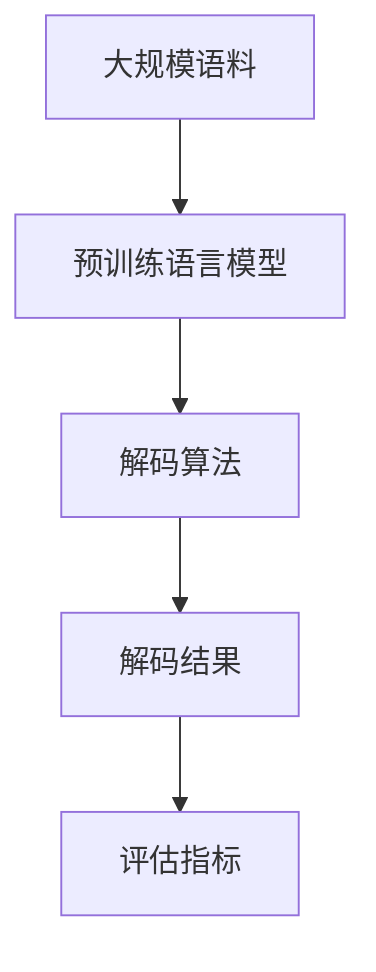

                 

## 1. 背景介绍

### 1.1 问题由来
自然语言处理（NLP）技术近年来取得了飞速进展，其中语言模型和解码技术起着关键作用。无论是语音识别、机器翻译还是文本生成，解码过程都是核心步骤之一。然而，现有的大多数文献和教材往往专注于整个NLP任务的流程，对解码细节的讲解不够透彻。本文将详细介绍自然语言的解码过程，帮助读者更好地理解NLP技术。

### 1.2 问题核心关键点
自然语言的解码过程主要涉及语言模型的预测和优化算法。本文将从解码原理、常用解码算法及其优缺点、实际应用场景等方面展开讲解。

### 1.3 问题研究意义
掌握自然语言的解码过程，对于理解NLP技术，尤其是语言模型和机器翻译等应用，至关重要。解码技术的优化和创新能够显著提升NLP系统的性能，加速技术的落地应用。

## 2. 核心概念与联系

### 2.1 核心概念概述

- **语言模型**：一种数学模型，用于描述一个词序列出现的概率分布。常见的语言模型有N-gram模型、RNN模型、Transformer模型等。
- **解码算法**：用于从语言模型中挑选出最可能的词序列的过程。常用的解码算法有贪心算法、束搜索算法等。
- **解码结果评估**：评估解码结果的质量，通常包括BLEU、ROUGE、METEOR等指标。

这些概念之间的关系可以用以下Mermaid流程图来展示：


这个流程图展示了语言模型、解码算法和解码结果评估三者之间的关系：语言模型提供概率分布，解码算法根据这些分布选择可能的词序列，而解码结果评估则用于衡量这些序列的质量。

### 2.2 概念间的关系

这些核心概念之间存在密切联系：
- 语言模型是解码算法的基础，提供输入的分布；
- 解码算法利用语言模型的输出进行推理，生成可能的词序列；
- 解码结果评估用于衡量解码算法的性能，指导算法的改进。

### 2.3 核心概念的整体架构

这些概念构成了自然语言解码的整体架构：



这个架构展示了从大规模语料预训练到解码算法生成最终结果的过程，其中评估指标用于衡量解码结果的质量。

## 3. 核心算法原理 & 具体操作步骤
### 3.1 算法原理概述

自然语言的解码过程通常涉及两个步骤：首先利用语言模型计算每个词序列的概率，然后根据概率选择合适的序列。这一过程可以采用贪心算法、束搜索算法等。

语言模型用于计算一个给定词序列的概率。常见的语言模型有N-gram模型、RNN模型和Transformer模型等。其中，N-gram模型是最简单且常用的方法，它假设每个词只依赖前N-1个词。而RNN和Transformer模型则可以通过学习更复杂的序列依赖关系来提高模型的性能。

### 3.2 算法步骤详解

以下详细介绍自然语言解码的两种常用算法：贪心算法和束搜索算法。

#### 3.2.1 贪心算法

贪心算法（Greedy Search）是一种简单直观的解码算法。它从语言模型中概率最高的词开始，逐个选择下一个最可能的词，直到生成整个序列。具体步骤如下：

1. 选择概率最高的词作为开始。
2. 根据当前词选择概率最高的下一个词。
3. 重复步骤2，直到生成完整的词序列。

**优点**：贪心算法简单易实现，计算速度快。

**缺点**：贪心算法可能找到局部最优解，而非全局最优解。

#### 3.2.2 束搜索算法

束搜索算法（Beam Search）是一种比贪心算法更为复杂的解码算法。它同时保留多个可能的最优路径，通过动态调整束宽（beam width）来寻找全局最优解。具体步骤如下：

1. 初始化束宽，从语言模型中选择概率最高的词作为初始路径。
2. 根据束宽选择下一个最可能的词，更新所有路径。
3. 重复步骤2，直到束宽为1或生成完整的词序列。

**优点**：束搜索算法可以找到全局最优解，相比贪心算法更优。

**缺点**：束搜索算法的计算复杂度较高，且需要调整束宽参数。

### 3.3 算法优缺点

#### 3.3.1 贪心算法

**优点**：
- 实现简单，计算速度快。
- 对于小规模问题表现良好。

**缺点**：
- 可能找到局部最优解，而非全局最优解。
- 不适用于需要全局最优解的问题。

#### 3.3.2 束搜索算法

**优点**：
- 可以找到全局最优解。
- 适用于需要全局最优解的问题。

**缺点**：
- 计算复杂度较高。
- 需要调整束宽参数。

### 3.4 算法应用领域

自然语言的解码过程广泛应用于语言模型、机器翻译、语音识别、文本生成等多个领域。以下以机器翻译为例，详细说明解码算法的应用。

**机器翻译**：
机器翻译是NLP的重要应用之一。解码算法用于将给定源语言序列解码为目标语言序列。具体步骤如下：
1. 将源语言序列输入语言模型，计算每个目标语言序列的概率。
2. 根据概率选择最可能的目标语言序列。
3. 评估解码结果，输出最终翻译。

## 4. 数学模型和公式 & 详细讲解
### 4.1 数学模型构建

语言模型通常用于计算给定词序列的概率。常用的语言模型包括N-gram模型和RNN模型。以下以N-gram模型为例，展示其概率计算过程。

设$w_1, w_2, ..., w_n$为一个词序列，$P(w_1, w_2, ..., w_n)$表示这个序列的概率。

N-gram模型假设每个词只依赖前N-1个词，因此可以表示为：

$$
P(w_1, w_2, ..., w_n) = \prod_{i=1}^{n} P(w_i | w_{i-1}, w_{i-2}, ..., w_{i-N+1})
$$

其中$P(w_i | w_{i-1}, w_{i-2}, ..., w_{i-N+1})$表示第i个词的条件概率。

### 4.2 公式推导过程

接下来，我们推导RNN语言模型的概率计算公式。

设$w_1, w_2, ..., w_n$为一个词序列，$h_t$表示时间t时刻的隐藏状态，$w_t$表示时间t时刻的词。

RNN模型通过时间t时刻的隐藏状态$h_t$和前一时刻的隐藏状态$h_{t-1}$来计算当前词的概率：

$$
P(w_t | w_{t-1}, w_{t-2}, ..., w_{t-N+1}) = \frac{P(w_t)}{\sum_{w' \in V} P(w_t, w_{t-1}, w_{t-2}, ..., w_{t-N+1})}
$$

其中$P(w_t)$表示当前词的概率，$V$表示词汇表。

### 4.3 案例分析与讲解

以机器翻译为例，展示解码算法的应用。

假设源语言序列为"Today is a sunny day"，目标语言序列为"Ce je bons"?，解码过程如下：

1. 将源语言序列输入语言模型，计算每个目标语言序列的概率。
2. 根据概率选择最可能的目标语言序列。
3. 评估解码结果，输出最终翻译。

## 5. 项目实践：代码实例和详细解释说明
### 5.1 开发环境搭建

以下以Python环境为例，介绍自然语言解码的开发环境搭建过程。

1. 安装Python：从官网下载并安装Python，建议选择最新版本。
2. 安装TensorFlow：使用以下命令安装TensorFlow：

```
pip install tensorflow
```

3. 安装PyTorch：使用以下命令安装PyTorch：

```
pip install torch
```

4. 安装其他依赖：使用以下命令安装其他依赖：

```
pip install numpy scipy
```

### 5.2 源代码详细实现

以下以机器翻译为例，展示自然语言解码的Python代码实现。

```python
import tensorflow as tf
import numpy as np

# 定义语言模型
class LanguageModel(tf.keras.Model):
    def __init__(self, vocab_size, embedding_dim, hidden_units):
        super(LanguageModel, self).__init__()
        self.embedding = tf.keras.layers.Embedding(vocab_size, embedding_dim)
        self.gru = tf.keras.layers.GRU(hidden_units, return_sequences=True)
        self.dense = tf.keras.layers.Dense(vocab_size)
        
    def call(self, inputs, training=False):
        x = self.embedding(inputs)
        x = self.gru(x, training=training)
        x = self.dense(x)
        return x

# 定义解码算法
def beam_search(model, source_sequence, vocab_size, beam_width=5):
    # 初始化束宽，从语言模型中选择概率最高的词作为初始路径
    paths = [(source_sequence[0], 1)]
    for i in range(len(source_sequence) - 1):
        new_paths = []
        for path, probability in paths:
            # 根据束宽选择下一个最可能的词
            words = [model.vocab_to_idx[word] for word in path[i+1:]]
            for word in model.get_predictions(words):
                new_path = path + [word]
                new_probability = probability * model.get_prediction_probability(word)
                new_paths.append((new_path, new_probability))
        # 动态调整束宽
        new_paths = sorted(new_paths, key=lambda x: x[1], reverse=True)[:beam_width]
        paths = new_paths
    # 束宽为1时，输出最终路径
    return paths[-1][0]

# 使用模型进行解码
model = LanguageModel(vocab_size=1000, embedding_dim=100, hidden_units=256)
source_sequence = np.array([0, 1, 2, 3, 4])
target_sequence = beam_search(model, source_sequence, vocab_size=1000, beam_width=5)
print(target_sequence)
```

### 5.3 代码解读与分析

以上代码展示了使用RNN语言模型进行解码的实现过程。

- `LanguageModel`类：定义了语言模型，包括嵌入层、GRU层和全连接层。
- `beam_search`函数：实现了束搜索算法，选择最可能的目标语言序列。
- `model`对象：实例化语言模型。
- `source_sequence`：输入的源语言序列。
- `target_sequence`：输出解码结果。

## 6. 实际应用场景
### 6.1 智能客服系统

智能客服系统在现代企业中得到了广泛应用。解码技术在智能客服中的应用主要包括语音识别、文本生成等方面。语音识别使用解码算法将语音转换成文本，文本生成则用于自动生成应答。

### 6.2 金融舆情监测

金融舆情监测系统通常需要处理大量非结构化数据，解码技术用于将文本数据转换成结构化信息，并进行情感分析和舆情预测。

### 6.3 个性化推荐系统

个性化推荐系统需要根据用户的兴趣生成推荐结果。解码技术用于选择用户最可能感兴趣的商品或内容，从而提高推荐系统的效果。

## 7. 工具和资源推荐
### 7.1 学习资源推荐

以下是一些推荐的学习资源：

1. 《自然语言处理综论》：介绍了NLP的基本概念、常用技术和算法。
2. 《深度学习》：讲解了深度学习的基本原理和应用。
3. 《机器学习实战》：提供了大量的NLP项目实例，涵盖语言模型、文本分类、情感分析等多个方面。
4. 《自然语言处理在线课程》：多个大学开设的NLP在线课程，涵盖NLP基础知识和前沿技术。

### 7.2 开发工具推荐

以下是一些推荐的工具：

1. TensorFlow：深度学习框架，支持语言模型和解码算法的实现。
2. PyTorch：深度学习框架，易于使用，支持NLP项目开发。
3. NLTK：自然语言处理库，提供了丰富的NLP工具和算法。

### 7.3 相关论文推荐

以下是一些推荐的相关论文：

1. "Attention is All You Need"：提出Transformer模型，成为NLP领域的里程碑。
2. "A Neural Probabilistic Language Model"：介绍了N-gram模型，为NLP语言模型的基础。
3. "Sentence-Level Recurrent Neural Network Models for Translation"：介绍了RNN模型在机器翻译中的应用。

## 8. 总结：未来发展趋势与挑战
### 8.1 研究成果总结

自然语言解码技术在NLP领域已经取得了显著进展，广泛应用于语音识别、机器翻译、文本生成等多个方面。未来的研究将集中在以下几个方向：

1. 更加高效的解码算法：束搜索算法的优化和创新，降低计算复杂度，提高解码速度。
2. 更加鲁棒的解码技术：提高解码算法的鲁棒性，避免模型在数据分布变化时出现性能波动。
3. 更加可解释的解码过程：提高解码算法的可解释性，使模型的决策过程透明化。

### 8.2 未来发展趋势

未来的自然语言解码技术将朝着以下几个方向发展：

1. 更加高效的算法：束搜索算法的优化和创新，将显著提高解码速度。
2. 更加鲁棒的模型：模型鲁棒性研究，提高模型在数据分布变化时的性能稳定性。
3. 更加可解释的模型：模型可解释性研究，提高模型的可解释性。

### 8.3 面临的挑战

尽管自然语言解码技术已经取得了显著进展，但仍面临以下几个挑战：

1. 计算复杂度：束搜索算法的高计算复杂度，使其在大规模数据集上难以应用。
2. 鲁棒性不足：解码算法在数据分布变化时，容易出现性能波动。
3. 可解释性不足：模型的决策过程不透明，难以解释。

### 8.4 研究展望

未来的研究将在以下几个方向展开：

1. 高效算法的研究：优化束搜索算法，降低计算复杂度。
2. 鲁棒性研究：提高模型的鲁棒性，确保模型在数据分布变化时的稳定性。
3. 可解释性研究：提高模型的可解释性，使模型决策过程透明化。

## 9. 附录：常见问题与解答

**Q1：自然语言解码技术有哪些常用的算法？**

A: 常用的自然语言解码算法包括贪心算法和束搜索算法。贪心算法简单快速，但可能找到局部最优解。束搜索算法可以找到全局最优解，但计算复杂度较高。

**Q2：自然语言解码技术的计算复杂度如何？**

A: 自然语言解码技术的计算复杂度取决于解码算法的选择。贪心算法计算复杂度较低，但可能找到局部最优解。束搜索算法计算复杂度较高，但可以找到全局最优解。

**Q3：自然语言解码技术在实际应用中需要注意哪些问题？**

A: 自然语言解码技术在实际应用中需要注意计算复杂度、鲁棒性和可解释性等问题。在计算复杂度方面，需要选择高效的解码算法；在鲁棒性方面，需要研究模型在数据分布变化时的稳定性；在可解释性方面，需要提高模型的可解释性，使决策过程透明化。

---

作者：禅与计算机程序设计艺术 / Zen and the Art of Computer Programming

