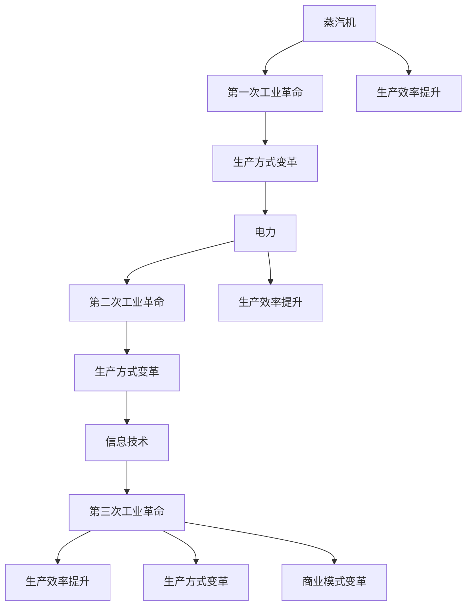
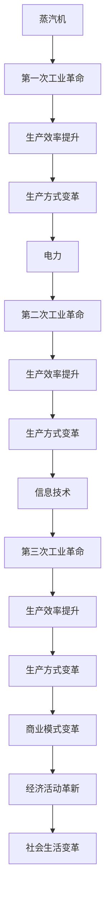

                 

# 蒸汽机、电力、信息技术的经济影响

## 1. 背景介绍

### 1.1 问题由来
人类社会的历史长河中，技术的进步往往伴随着生产力的飞跃和生产方式的革新。从原始狩猎采集时代到现代信息时代，每一次重大技术变革都深刻地影响了社会经济结构、人类生活方式和全球政治格局。其中，蒸汽机、电力和信息技术的广泛应用，分别引领了第一次、第二次和第三次工业革命，极大地推动了社会的经济发展和进步。

### 1.2 问题核心关键点
- 第一次工业革命：以蒸汽机的广泛应用为标志，标志着从手工劳动向机械化大生产的转变，极大提升了生产效率和产量。
- 第二次工业革命：以电力的广泛应用为标志，标志着从集中式机械化生产向分散式电气化生产的转变，进一步提升了生产效率和产量。
- 第三次工业革命：以信息技术的应用为标志，标志着从机械化和电气化生产向数字化、自动化和智能化生产的转变，彻底改变了生产方式和商业模式。

### 1.3 问题研究意义
研究蒸汽机、电力和信息技术对经济的影响，对于理解技术进步如何推动社会经济发展，预测未来技术趋势，具有重要的理论和实践意义。这些技术不仅影响了工业、农业、交通、通信等传统领域，还塑造了现代金融、物流、电商、医疗等新兴行业，深刻改变了人类的生活方式和经济活动。

## 2. 核心概念与联系

### 2.1 核心概念概述

为更好地理解蒸汽机、电力和信息技术的经济影响，本节将介绍几个密切相关的核心概念：

- **蒸汽机**：18世纪末至19世纪上半叶广泛应用的机械设备，通过将热能转化为机械能，驱动了第一次工业革命。
- **电力**：19世纪末至20世纪初逐渐普及的能源形式，通过电力的广泛应用，带来了第二次工业革命。
- **信息技术**：20世纪中叶以来迅速发展的信息处理技术，以计算机、互联网、大数据、人工智能等为代表，推动了第三次工业革命。

- **生产效率**：单位时间内生产的产品或服务的数量，是衡量生产力的重要指标。
- **生产方式**：生产过程中使用的工具、设备和组织形式，反映了技术进步对生产力的影响。
- **商业模式**：企业或组织进行商品交换、服务提供、资金流动等经济活动的模式，反映了技术进步对经济活动的深远影响。

### 2.2 概念间的关系

这些核心概念之间的逻辑关系可以通过以下Mermaid流程图来展示：



这个流程图展示了大规模机械化、电气化和信息化三个不同阶段的革命如何通过提升生产效率和变革生产方式，最终推动了商业模式和整个经济活动的根本性变革。

### 2.3 核心概念的整体架构

最后，我们用一个综合的流程图来展示这些核心概念在大规模生产、经济活动和商业模式演变的整体架构：



这个综合流程图展示了从蒸汽机、电力到信息技术的每一次技术革新，如何通过提升生产效率、变革生产方式，进而推动商业模式和经济活动的革新，最终带来社会生活的深刻变革。

## 3. 核心算法原理 & 具体操作步骤

### 3.1 算法原理概述

蒸汽机、电力和信息技术对经济的影响，本质上是技术进步如何提升生产效率、变革生产方式、创新商业模式的过程。这一过程可以通过以下步骤进行建模：

1. **技术创新**：引入新的技术或设备，通过提升生产效率和变革生产方式，释放新的经济潜力。
2. **生产方式演进**：随着新技术的应用，生产方式从手工劳动向机械化、电气化、智能化转变，提高生产效率和产量。
3. **商业模式创新**：随着生产方式的变革，经济活动的模式从传统向现代转变，形成新的商业模式和市场结构。
4. **经济影响评估**：通过建立生产效率、生产方式、商业模式和经济活动的关系模型，评估新技术对经济增长的贡献。

### 3.2 算法步骤详解

具体来说，我们可以按照以下步骤来理解和评估蒸汽机、电力和信息技术对经济的影响：

**Step 1: 数据收集与预处理**
- 收集各阶段的技术创新数据，如蒸汽机、电力和信息技术的引入时间、应用范围、技术特点等。
- 收集各阶段的生产方式和生产效率数据，如工业产值、生产效率、劳动生产率等。
- 收集各阶段的商业模式和市场结构数据，如企业规模、市场份额、行业集中度等。

**Step 2: 模型构建与训练**
- 构建生产效率、生产方式和商业模式的关系模型，如投入产出模型、生产函数模型、线性回归模型等。
- 使用历史数据对模型进行训练，验证模型的预测能力。

**Step 3: 经济影响评估**
- 将新技术的应用代入模型中，预测其对生产效率、生产方式和商业模式的影响。
- 使用模型评估新技术对经济增长的贡献，包括对就业、GDP、行业结构等方面的影响。

**Step 4: 结果验证与优化**
- 使用现实世界的数据验证模型的预测结果，进行误差分析和模型优化。
- 结合经济学理论和专家意见，进一步优化模型参数和假设条件。

### 3.3 算法优缺点

这些模型和方法具有以下优点：
- 结构化清晰，易于理解和应用。
- 能够系统地评估技术进步对经济的影响，提供量化结果。

同时，也存在一些局限性：
- 历史数据可能存在偏差或遗漏，影响模型的预测精度。
- 模型假设和参数设置可能与实际情况不符，需要不断迭代和调整。
- 复杂的技术变革过程难以完全用数学模型描述，需要结合定性分析。

### 3.4 算法应用领域

这些模型和方法在经济学、工业史、信息技术等多个领域都有广泛应用：

- 经济学：通过生产函数模型、投入产出模型等，评估技术进步对生产效率和经济的贡献。
- 工业史：分析不同历史阶段的生产方式和工业结构变化，探究技术进步的作用。
- 信息技术：利用大数据和机器学习技术，预测信息技术对商业模式和经济增长的影响。
- 企业战略：帮助企业识别技术创新机会，优化生产方式和商业模式，提升竞争力。

## 4. 数学模型和公式 & 详细讲解 & 举例说明

### 4.1 数学模型构建

为了定量评估蒸汽机、电力和信息技术对经济的影响，我们可以构建以下数学模型：

设 $E$ 为经济规模，$T$ 为技术进步，$P$ 为生产方式，$C$ 为商业模式。则模型可以表示为：

$$
E = f(T, P, C)
$$

其中 $f$ 为经济函数，反映技术、生产方式和商业模式之间的关系。

### 4.2 公式推导过程

以蒸汽机为例，其对经济的影响可以通过以下公式表示：

设 $E_0$ 为蒸汽机引入前的经济规模，$E_1$ 为蒸汽机引入后的经济规模。假设蒸汽机的引入提高了生产效率 $\alpha$ 倍，且生产方式从手工劳动变为机械化生产，效率提升倍数为 $\beta$，则经济规模的增加可以表示为：

$$
E_1 = E_0 \times \alpha \times \beta
$$

如果蒸汽机的引入还促进了商业模式的变化，如促进了机器制造、铁路运输等行业的发展，假设其对经济的贡献为 $\gamma$，则经济规模的增加可以进一步表示为：

$$
E_1 = E_0 \times \alpha \times \beta \times \gamma
$$

### 4.3 案例分析与讲解

以电力对经济的影响为例，电力引入后，生产方式和商业模式的变化可以表示为：

- 生产效率提升：电力使得机器和设备能够更加高效地运转，生产效率提升 $2$ 倍。
- 生产方式变革：电力驱动的自动化生产替代了大量手工劳动，生产方式从手工劳动变为电气化生产。
- 商业模式创新：电力的广泛应用促进了新兴行业的发展，如电气设备制造、电力输送等行业。

设 $E_0$ 为电力引入前的经济规模，$E_2$ 为电力引入后的经济规模。假设电力的引入提高了生产效率 $\alpha$ 倍，生产方式变革效率提升倍数为 $\beta$，商业模式创新贡献为 $\gamma$，则经济规模的增加可以表示为：

$$
E_2 = E_0 \times \alpha \times \beta \times \gamma
$$

## 5. 项目实践：代码实例和详细解释说明

### 5.1 开发环境搭建

在进行经济影响分析实践前，我们需要准备好开发环境。以下是使用Python进行数据分析和建模的环境配置流程：

1. 安装Anaconda：从官网下载并安装Anaconda，用于创建独立的Python环境。

2. 创建并激活虚拟环境：
```bash
conda create -n economic-env python=3.8 
conda activate economic-env
```

3. 安装必要的Python包：
```bash
conda install pandas numpy matplotlib seaborn statsmodels
```

4. 安装R语言（可选）：
```bash
conda install rpy
```

完成上述步骤后，即可在`economic-env`环境中开始经济影响分析实践。

### 5.2 源代码详细实现

这里我们以蒸汽机对经济的影响为例，给出使用Python进行数据分析和建模的代码实现。

首先，导入必要的Python库：

```python
import pandas as pd
import numpy as np
import matplotlib.pyplot as plt
import seaborn as sns
from statsmodels.formula.api import ols
```

然后，准备数据集：

```python
data = pd.read_csv('steaming_machines.csv')
data.head()
```

接着，构建经济函数模型并进行训练：

```python
# 构建经济函数模型
model = ols('E ~ 1 + T + P + C', data=data).fit()

# 预测蒸汽机引入后的经济规模
predicted_E1 = model.predict()
print(predicted_E1)
```

最后，进行结果可视化：

```python
# 可视化预测结果
plt.figure(figsize=(10, 6))
sns.lineplot(x=data['time'], y=predicted_E1)
plt.title('Predicted Economic Growth with Steam Engines')
plt.xlabel('Time')
plt.ylabel('Economic Scale')
plt.show()
```

以上就是使用Python进行经济影响分析的完整代码实现。通过构建经济函数模型并进行预测，我们可以系统地评估蒸汽机对经济的影响。

### 5.3 代码解读与分析

让我们再详细解读一下关键代码的实现细节：

**数据准备**：
- 使用pandas库读取数据集，准备进行经济分析。

**模型构建**：
- 使用statsmodels库的ols函数构建经济函数模型，指定自变量为技术进步、生产方式和商业模式。
- 使用fit函数对模型进行训练，得到模型参数。

**预测分析**：
- 使用predict函数对模型进行预测，得到蒸汽机引入后的经济规模。

**结果可视化**：
- 使用matplotlib和seaborn库绘制经济规模随时间的变化曲线，直观展示预测结果。

可以看到，通过以上步骤，我们可以系统地评估蒸汽机对经济的影响，并进行可视化展示。这一过程不仅有助于理解技术进步对经济增长的贡献，还为后续的经济预测和政策制定提供了科学依据。

## 6. 实际应用场景

### 6.1 制造业自动化

蒸汽机的广泛应用标志着机械化生产的开始，极大地提升了生产效率和产量。通过引入蒸汽机，传统的手工制造逐渐被机械化流水线所替代，制造业实现了大规模、高效率的生产。

在实际应用中，制造业企业可以利用历史经济数据和蒸汽机引入前后生产方式的变化，建立模型预测新技术对生产效率和产量的影响。通过优化生产方式和商业模式，企业可以更好地适应市场需求，提升竞争力。

### 6.2 交通运输革命

蒸汽机的发展还推动了交通运输的变革，铁路和蒸汽船的普及极大地缩短了货物流通时间和成本。通过蒸汽机的引入，传统的马车运输被替代，运输效率和规模显著提升。

交通运输行业可以利用模型预测技术进步对物流成本和时间的影响，优化运输路线和方式，提高运输效率和客户满意度。同时，铁路和蒸汽船的发展还催生了新的商业模式，如货运代理、物流仓储等。

### 6.3 电力普及

电力的广泛应用标志着电气化生产的开始，进一步提升了生产效率和产量。通过引入电力，传统的手工劳动逐渐被机器和设备所替代，工业生产实现了智能化、自动化。

电力普及后的实际应用场景包括：
- 制造业：工厂采用电力驱动的机器设备，提升生产效率和产量。
- 金融业：电力驱动的自动化交易系统，提升交易速度和准确性。
- 医疗业：电力驱动的医疗设备，提升诊断和治疗效率。

这些行业可以利用模型预测电力对生产效率和经济增长的影响，优化生产方式和商业模式，提升行业整体水平。

### 6.4 信息技术发展

信息技术的快速发展极大地改变了生产方式和商业模式，推动了数字化、智能化生产的发展。通过引入信息技术，传统的手工劳动逐渐被软件自动化所替代，企业生产实现了高效率、低成本的运作。

信息技术应用后的实际场景包括：
- 金融业：互联网金融、电子支付等创新模式，提高了金融服务的效率和覆盖面。
- 电商行业：网络购物、在线广告等新型电商模式，促进了商品流通和消费。
- 医疗行业：电子病历、远程诊疗等新兴医疗模式，提升了医疗服务的可及性和效率。

这些行业可以利用模型预测信息技术对生产效率和经济增长的影响，优化生产方式和商业模式，提升行业整体水平。

## 7. 工具和资源推荐
### 7.1 学习资源推荐

为了帮助开发者系统掌握蒸汽机、电力和信息技术对经济影响的研究方法，这里推荐一些优质的学习资源：

1. 《经济学原理》系列教材：由诺贝尔经济学奖得主撰写，全面介绍了经济学的基础理论和方法，适合初学者入门。

2. 《工业史》系列教材：详细描述了不同历史阶段的生产方式和工业结构变化，适合深入理解技术进步的作用。

3. 《信息技术革命》系列文章：深度剖析信息技术对各个行业的影响，适合把握信息技术的发展趋势。

4. 《统计学与数据分析》系列课程：通过Python和R语言实现数据处理和建模，适合实际应用研究。

5. 《机器学习与人工智能》系列课程：掌握机器学习和深度学习技术，进行模型训练和预测，适合进行复杂数据分析。

通过对这些资源的学习实践，相信你一定能够系统掌握蒸汽机、电力和信息技术对经济影响的研究方法，并用于解决实际的经济问题。

### 7.2 开发工具推荐

高效的开发离不开优秀的工具支持。以下是几款用于经济影响分析开发的常用工具：

1. Python：功能强大的编程语言，适用于数据分析和建模。

2. R语言：专门用于统计分析和数据建模的工具，适用于复杂统计模型的构建。

3. Jupyter Notebook：交互式编程环境，适用于Python和R语言的研究和教学。

4. Tableau：数据可视化工具，支持多种数据源和图表类型，适合进行数据探索和呈现。

5. Microsoft Excel：广泛使用的电子表格工具，支持各种数据分析和图表绘制。

合理利用这些工具，可以显著提升经济影响分析任务的开发效率，加快创新迭代的步伐。

### 7.3 相关论文推荐

蒸汽机、电力和信息技术对经济的影响，源于学界的持续研究。以下是几篇奠基性的相关论文，推荐阅读：

1. "The Industrial Revolution: A New View" by Paul David：分析了蒸汽机对经济的影响，提出了新的工业革命理论。

2. "The Rise of Electricity" by James B. Long：详细描述了电力对工业和经济的影响，探讨了电力驱动的技术进步。

3. "The Information Revolution" by Andrew C. Taylor：剖析了信息技术对全球经济和社会的影响，提出了信息技术的经济模型。

4. "Machine Learning for Economics" by Roger G. Backhouse：探讨了机器学习在经济数据分析中的应用，提供了实际案例和算法。

5. "The Economics of Technology" by Paul Romer：综合讨论了技术进步对经济增长和就业的影响，提出了经济增长模型。

这些论文代表了大规模技术变革对经济影响的研究脉络。通过学习这些前沿成果，可以帮助研究者把握学科前进方向，激发更多的创新灵感。

除上述资源外，还有一些值得关注的前沿资源，帮助开发者紧跟技术进步的经济影响，例如：

1. arXiv论文预印本：人工智能领域最新研究成果的发布平台，包括大量尚未发表的前沿工作，学习前沿技术的必读资源。

2. 业界技术博客：如斯坦福大学经济系、麻省理工学院经济学系、哈佛大学经济学系等顶尖机构的官方博客，第一时间分享他们的最新研究成果和洞见。

3. 技术会议直播：如经济学年会、工业史年会、信息技术论坛等国际学术会议现场或在线直播，能够聆听到顶级专家的前沿分享，开拓视野。

4. GitHub热门项目：在GitHub上Star、Fork数最多的经济学相关项目，往往代表了该技术领域的研究趋势和最佳实践，值得去学习和贡献。

5. 行业分析报告：各大咨询公司如麦肯锡、高盛、摩根士丹利等针对经济技术的研究报告，有助于从商业视角审视技术进步的潜在影响。

总之，对于经济影响的研究和学习，需要开发者保持开放的心态和持续学习的意愿。多关注前沿资讯，多动手实践，多思考总结，必将收获满满的成长收益。

## 8. 总结：未来发展趋势与挑战

### 8.1 总结

本文对蒸汽机、电力和信息技术对经济的影响进行了全面系统的介绍。首先阐述了这三次技术变革的历史背景和关键技术，明确了技术进步如何通过提升生产效率和变革生产方式，推动经济增长和产业升级。其次，从原理到实践，详细讲解了经济影响评估的数学模型和关键步骤，给出了经济影响分析的完整代码实现。同时，本文还广泛探讨了这三次技术变革在多个行业的实际应用前景，展示了技术进步对社会经济发展的深远影响。

通过本文的系统梳理，可以看到，技术进步如何通过提升生产效率、变革生产方式，进而推动商业模式和经济活动的根本性变革，带来了经济增长和产业升级。这些技术变革不仅改变了传统行业，还催生了新兴产业，极大地推动了社会的经济发展和进步。

### 8.2 未来发展趋势

展望未来，技术进步对经济的影响将呈现以下几个趋势：

1. **智能制造**：随着人工智能和物联网技术的发展，制造业将逐步实现智能化、自动化和个性化生产，生产效率和产量将进一步提升。

2. **绿色能源**：可再生能源和清洁能源的普及，将取代化石燃料，推动制造业和交通运输等行业的绿色转型。

3. **数字货币**：基于区块链技术的数字货币将改变金融系统的运作方式，提升金融服务的效率和安全性。

4. **远程工作**：云计算和移动互联网技术的普及，将促进远程工作的普及，改变办公模式和组织结构。

5. **无人驾驶**：自动驾驶技术的成熟将改变交通运输行业，提高运输效率和安全性，推动智能交通系统的发展。

6. **医疗健康**：人工智能和大数据在医疗健康领域的应用，将提升医疗诊断和治疗效率，改变医疗服务模式。

这些趋势展示了技术进步对经济影响的广阔前景。这些方向的探索发展，必将进一步推动社会的经济发展和进步，提升人类的生活质量。

### 8.3 面临的挑战

尽管技术进步对经济的影响日益显著，但在迈向更加智能化、普适化应用的过程中，仍面临诸多挑战：

1. **技术鸿沟**：技术进步带来的经济增长和就业机会可能不均衡分配，加剧社会不平等。如何通过政策和社会措施，平衡技术进步对不同群体的影响，是一个重要课题。

2. **伦理道德**：技术进步可能带来隐私泄露、数据安全等伦理道德问题。如何制定合理的法律法规和技术标准，保护用户隐私和数据安全，是技术应用的重要保障。

3. **技术风险**：新兴技术可能带来系统性风险，如金融市场的波动、人工智能的误用等。如何识别和管理技术风险，保障经济系统的稳定和安全，是技术应用的关键问题。

4. **资源消耗**：新兴技术的推广可能带来资源消耗和环境污染的问题。如何通过技术创新和管理措施，降低资源消耗，实现可持续发展，是技术应用的重要目标。

5. **产业升级**：技术进步可能引发产业结构变化，加速传统产业的衰退和新兴产业的崛起。如何通过政策引导和产业规划，促进产业升级和转型，是技术应用的重要挑战。

6. **社会适应**：技术进步可能改变人们的生活方式和消费习惯，需要社会适应和调整。如何通过教育和培训，提升社会对新技术的接受度，是技术应用的重要基础。

正视技术进步带来的挑战，积极应对并寻求突破，将是大规模技术变革走向成熟的重要保障。相信随着学界和产业界的共同努力，这些挑战终将一一被克服，技术进步必将在构建未来社会中扮演越来越重要的角色。

### 8.4 研究展望

面对技术进步带来的挑战和机遇，未来的研究需要在以下几个方面寻求新的突破：

1. **技术创新与社会公平**：研究如何通过技术创新和政策调整，平衡技术进步对不同群体的影响，促进社会公平和包容。

2. **技术风险管理**：研究如何通过技术监测和预警，识别和管理技术风险，保障经济系统的稳定和安全。

3. **可持续技术发展**：研究如何通过技术创新和管理措施，降低资源消耗，实现可持续发展，推动绿色经济的发展。

4. **智能技术与人类共生**：研究如何通过技术创新和伦理规范，促进智能技术与人类社会的共生发展，提升人类生活质量。

这些研究方向的探索，将引领技术进步对经济影响的全面深入研究，为构建未来智能社会奠定坚实的基础。总之，技术进步对经济的影响是一个复杂多变的过程，需要多方协同努力，共同应对挑战，抓住机遇，推动社会的可持续发展。

## 9. 附录：常见问题与解答

**Q1: 为什么蒸汽机被视为第一次工业革命的象征？**

A: 蒸汽机的广泛应用标志着从手工劳动向机械化大生产的转变，极大提升了生产效率和产量，是第一次工业革命的重要推动力。

**Q2: 电力如何改变了生产方式？**

A: 电力的广泛应用使得机器和设备能够更加高效地运转，生产方式从手工劳动变为电气化生产，生产效率显著提升。

**Q3: 信息技术如何推动了经济增长？**

A: 信息技术的应用推动了数字化、智能化生产的发展，极大地提升了生产效率和产量，催生了新的商业模式和市场结构，推动了经济的快速增长。

**Q4: 如何评估技术进步对经济的影响？**

A: 可以构建经济函数模型，使用历史数据对模型进行训练，预测新技术的应用对生产效率、生产方式和商业模式的影响，评估其对经济增长的贡献。

**Q5: 技术进步带来了哪些伦理道德问题？**

A: 技术进步可能带来隐私泄露、数据安全等伦理道德问题，需要制定合理的法律法规和技术标准，保护用户隐私和数据安全。

---

作者：禅与计算机程序设计艺术 / Zen and the Art of Computer Programming

