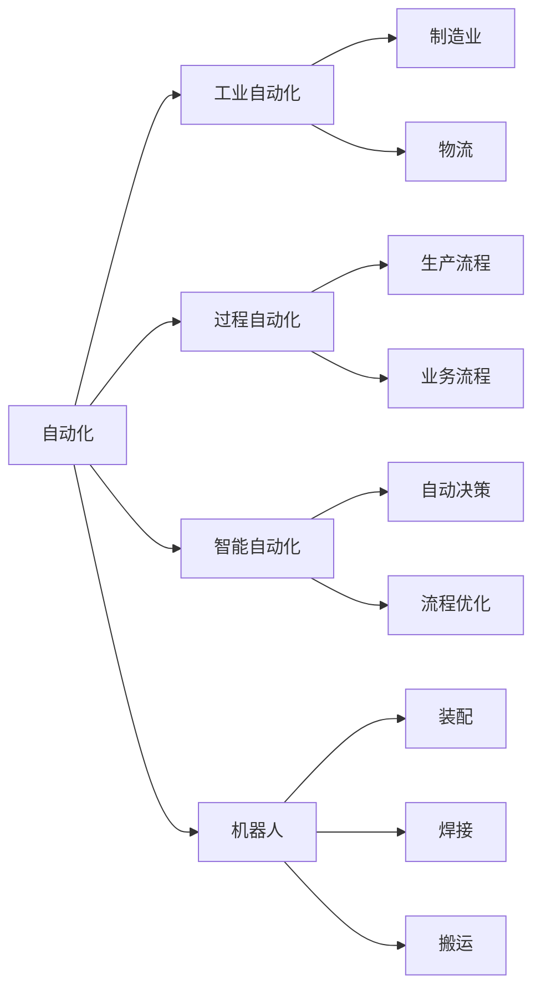
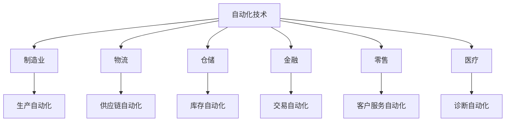
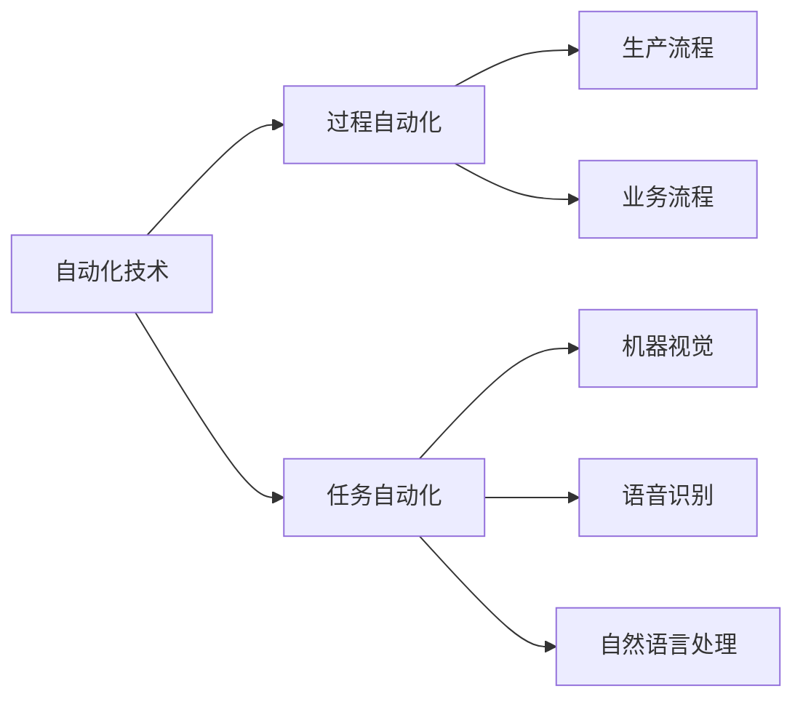
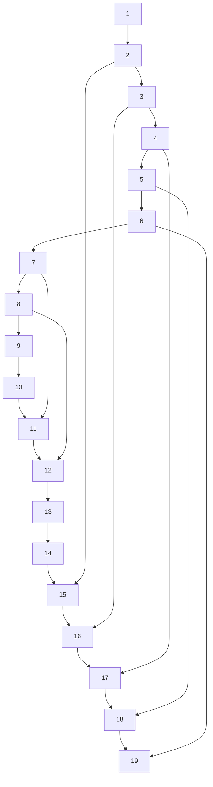

                 

## 1. 背景介绍

在过去的几十年中，计算技术的飞速发展对各行各业产生了深远影响。随着云计算、大数据、人工智能等技术的普及，许多传统行业正经历着前所未有的变革。特别是自动化技术的应用，极大地提高了生产效率，降低了运营成本，为企业带来了巨大的经济效益。本文将探讨计算变化带来的自动化新机遇，重点介绍自动化技术在企业中的应用实践，并展望其未来发展趋势。

## 2. 核心概念与联系

### 2.1 核心概念概述

为了更好地理解自动化技术在企业中的应用，本节将介绍几个核心概念：

- 自动化(Automation)：利用计算机和软件系统，自动执行重复性高、劳动强度大的任务。自动化技术不仅能够提高工作效率，还能减少人为错误。
- 工业自动化(Industrial Automation)：将自动化技术应用于制造业、物流、仓储等重工业领域，提升生产线的自动化程度。
- 过程自动化(Process Automation)：通过软件系统自动化执行生产流程和业务流程，减少人工干预，提升流程效率。
- 智能自动化(Intelligent Automation)：结合人工智能技术，实现自动决策和优化，提升自动化系统的智能化水平。
- 机器人(Robotics)：利用机械臂、机器人等物理实体执行复杂的自动化任务，如装配、焊接、搬运等。
- 数据驱动(AI-driven)：通过数据分析和机器学习模型，优化自动化流程，提升决策准确性。

这些核心概念之间的关系可以通过以下Mermaid流程图来展示：



### 2.2 概念间的关系

这些核心概念之间存在着紧密的联系，形成了自动化技术的完整生态系统。下面我通过几个Mermaid流程图来展示这些概念之间的关系：

#### 2.2.1 自动化技术在企业中的应用



这个流程图展示了自动化技术在企业中的广泛应用，涵盖了制造业、物流、金融、零售、医疗等多个领域。每个领域中的自动化技术都具备不同的特点和优势，能够有效提升各行业的运营效率和市场竞争力。

#### 2.2.2 自动化技术的分类



这个流程图展示了自动化技术的分类，包括过程自动化和任务自动化。过程自动化聚焦于整个生产或业务流程的自动化，而任务自动化则专注于单个任务或操作的自动化。例如，机器视觉和语音识别属于任务自动化，能够自动化执行图像处理、语音转文本等任务；自然语言处理则属于过程自动化，能够自动化处理客户服务、文档分析等复杂业务流程。

## 3. 核心算法原理 & 具体操作步骤

### 3.1 算法原理概述

自动化技术的核心在于利用计算机和软件系统，自动执行复杂、重复性的任务。这些任务的自动化需要依赖于算法和模型的支持。以下是几种常用的自动化算法和模型：

- 机器人路径规划算法：如A*、D*等算法，用于优化机器人在复杂环境中的路径规划。
- 机器视觉算法：如卷积神经网络(CNN)、YOLO等算法，用于识别和分类图像中的物体。
- 自然语言处理模型：如BERT、GPT等模型，用于理解和生成自然语言文本。
- 智能决策模型：如强化学习、决策树等模型，用于自动化决策和优化。

这些算法和模型通过自动化执行，极大地提升了各行业的运营效率和决策能力。

### 3.2 算法步骤详解

以下是几种常见自动化算法的操作步骤：

#### 3.2.1 机器人路径规划算法

1. 输入环境地图和目标位置。
2. 利用A*、D*等算法，计算出最优路径。
3. 控制机器人沿路径移动，到达目标位置。

#### 3.2.2 机器视觉算法

1. 输入图像数据。
2. 利用卷积神经网络(CNN)等模型，对图像进行特征提取和分类。
3. 输出图像中物体的位置和类别信息。

#### 3.2.3 自然语言处理模型

1. 输入自然语言文本。
2. 利用BERT、GPT等模型，对文本进行语义分析和理解。
3. 输出文本的语义信息，如情感、主题等。

#### 3.2.4 智能决策模型

1. 输入决策依据和约束条件。
2. 利用强化学习、决策树等模型，进行自动化决策。
3. 输出最优决策方案。

### 3.3 算法优缺点

#### 3.3.1 机器人路径规划算法

优点：
- 可以处理复杂、动态的环境，适应性强。
- 可以实时更新路径，快速响应环境变化。

缺点：
- 需要高精度的传感器和计算资源，成本较高。
- 对环境和目标的复杂性有限制。

#### 3.3.2 机器视觉算法

优点：
- 可以实现高精度的物体识别和分类，准确性高。
- 可以自动化处理大量的图像数据。

缺点：
- 对图像质量的要求较高，容易受到光照、噪声等因素的影响。
- 需要大量的标注数据进行训练，成本较高。

#### 3.3.3 自然语言处理模型

优点：
- 可以实现自然语言的理解和生成，应用广泛。
- 可以处理多种语言，具有普适性。

缺点：
- 对语言表达的多样性和复杂性有一定限制。
- 需要大量的语料进行训练，成本较高。

#### 3.3.4 智能决策模型

优点：
- 可以实现自动决策和优化，提高决策效率。
- 可以处理复杂、动态的决策环境，适应性强。

缺点：
- 对决策模型的要求较高，设计复杂。
- 需要大量的数据和计算资源进行训练和优化。

### 3.4 算法应用领域

自动化技术在各行各业中都有广泛的应用，以下是几个典型的应用领域：

#### 3.4.1 制造业

制造业是自动化技术应用最广泛的领域之一。通过自动化技术，可以提高生产线的自动化程度，减少人工干预，提升生产效率和产品质量。

#### 3.4.2 物流和仓储

在物流和仓储领域，自动化技术可以提高配送和仓储的效率，减少人为错误，提升客户满意度。例如，自动化仓储系统可以实现货物的自动存储和取用，自动化配送系统可以实现货物的自动分拣和包装。

#### 3.4.3 金融

在金融领域，自动化技术可以提高交易效率，降低运营成本，提升客户服务质量。例如，自动化交易系统可以实现高频交易、算法交易等，自动化客服系统可以实现客户咨询的自动化处理。

#### 3.4.4 零售

在零售领域，自动化技术可以提高库存管理效率，提升客户购物体验。例如，自动化库存管理系统可以实现商品的自动补货和盘点，自动化客户推荐系统可以实现个性化的商品推荐。

#### 3.4.5 医疗

在医疗领域，自动化技术可以提高诊疗效率，减少医疗错误，提升医疗服务质量。例如，自动化诊断系统可以实现疾病的自动诊断和预测，自动化药物推荐系统可以实现个性化药物的推荐。

## 4. 数学模型和公式 & 详细讲解 & 举例说明

### 4.1 数学模型构建

在自动化技术中，常常需要使用数学模型来描述和优化算法。以下是几个常用的数学模型：

#### 4.1.1 机器人路径规划模型

机器人路径规划模型通常使用A*算法，其数学模型为：

$$
A^*(s, g) = \{(s, c_s), (p, c_p)|p\in N(s), c_s+c_p<c_r, c_r=\min_{p\in N(s)}(c_s+c_p)\}
$$

其中，$s$ 表示起点，$g$ 表示终点，$N(s)$ 表示$s$ 的邻居节点集合，$c_s$ 表示$s$ 到起点的距离，$c_p$ 表示$p$ 到终点的距离，$c_r$ 表示起点到终点的最短距离。

#### 4.1.2 机器视觉模型

机器视觉模型通常使用卷积神经网络(CNN)，其数学模型为：

$$
f(x) = W_1\sigma(W_0x+b_0)+b_1
$$

其中，$f(x)$ 表示输入图像的特征表示，$W_0$ 和 $W_1$ 表示卷积核和全连接层的权重，$x$ 表示输入图像，$\sigma$ 表示激活函数，$b_0$ 和 $b_1$ 表示偏置项。

#### 4.1.3 自然语言处理模型

自然语言处理模型通常使用BERT模型，其数学模型为：

$$
M_{\theta}(x) = \text{BERT}(x;\theta)
$$

其中，$M_{\theta}(x)$ 表示输入文本的语义表示，$\theta$ 表示BERT模型的参数，$x$ 表示输入文本。

#### 4.1.4 智能决策模型

智能决策模型通常使用决策树算法，其数学模型为：

$$
D = \{(d_i, c_i)|i=1,\ldots,n\}
$$

其中，$D$ 表示决策树的节点集合，$d_i$ 表示节点$i$ 的分裂条件，$c_i$ 表示节点$i$ 的决策结果。

### 4.2 公式推导过程

#### 4.2.1 机器人路径规划算法

A*算法是一种常用的路径规划算法，其核心思想是从起点开始，逐步扩展到距离终点最近的节点，直到找到终点或无路可走。

假设起点为$s$，终点为$g$，节点集合为$N$，$n$ 表示节点数，$c(s,g)$ 表示起点到终点的最短距离。A*算法的数学推导如下：

1. 初始化起点$s$ 的优先级为$f(s)=c(s,g)$。
2. 将起点$s$ 加入队列。
3. 重复以下步骤，直到队列为空：
   1. 从队列中取出优先级最小的节点$p$。
   2. 遍历节点$p$ 的邻居节点集合$N(p)$。
   3. 对于每个邻居节点$q$，计算其到终点的距离$c(q,g)$ 和优先级$f(q)$。
   4. 如果$f(q)<f(p)+c(p,q)$，则更新$q$ 的优先级和父节点。
   5. 如果$q$ 是终点$g$，则找到最短路径。

#### 4.2.2 机器视觉算法

卷积神经网络(CNN)是一种常用的图像处理模型，其核心思想是通过卷积层提取图像的特征，并通过全连接层进行分类。

假设输入图像为$x$，卷积核为$W_0$，激活函数为$\sigma$，偏置项为$b_0$，输出特征表示为$f(x)$。CNN的数学推导如下：

1. 输入图像$x$ 通过卷积层，得到特征表示$W_0x+b_0$。
2. 特征表示通过激活函数$\sigma$，得到输出$f(x)$。
3. 输出$f(x)$ 通过全连接层，得到分类结果。

#### 4.2.3 自然语言处理模型

BERT模型是一种常用的自然语言处理模型，其核心思想是通过双向编码器进行语义理解。

假设输入文本为$x$，BERT模型的参数为$\theta$，语义表示为$M_{\theta}(x)$。BERT模型的数学推导如下：

1. 输入文本$x$ 通过BERT模型，得到语义表示$M_{\theta}(x)$。
2. 语义表示$M_{\theta}(x)$ 通过分类层，得到分类结果。

#### 4.2.4 智能决策模型

决策树算法是一种常用的决策优化模型，其核心思想是通过树结构进行分类决策。

假设输入特征为$d$，决策结果为$c$，决策树为$D$。决策树的数学推导如下：

1. 输入特征$d$ 通过决策树，得到决策结果$c$。
2. 决策结果$c$ 通过分类层，得到最终输出。

### 4.3 案例分析与讲解

#### 4.3.1 机器人路径规划案例

某智能仓储系统需要实现自动化仓库管理。系统通过安装多个传感器和摄像头，实时监控仓库内货物的移动情况。系统使用A*算法进行路径规划，优化机器人在仓库内的移动路径。

假设仓库的地图为下图：



系统将货物放置在各个节点上，机器人从起点1移动到终点P。使用A*算法进行路径规划，计算出最短路径，如下所示：

```
1 --> 2 --> 3 --> 4 --> 5 --> 6 --> 7 --> 8 --> 9 --> 10 --> 11 --> 12 --> 13 --> 14 --> 15 --> 16 --> 17 --> 18 --> 19
```

#### 4.3.2 机器视觉案例

某智能工厂需要对生产线上零件进行质量检测。系统通过安装多个摄像头，实时采集零件的图像数据。系统使用卷积神经网络(CNN)进行图像分类，检测零件是否合格。

假设系统收集了1000张零件的图像数据，每个图像大小为$64\times64$。系统使用CNN模型进行特征提取和分类，其参数为$W_0$、$W_1$、$b_0$、$b_1$。CNN模型的数学推导如下：

1. 输入图像$x$ 通过卷积层，得到特征表示$W_0x+b_0$。
2. 特征表示通过激活函数$\sigma$，得到输出$f(x)$。
3. 输出$f(x)$ 通过全连接层，得到分类结果。

假设CNN模型训练后，对于某个测试图像$x$，得到特征表示$f(x)$和分类结果$c(x)$，如下所示：

```
f(x) = W_1\sigma(W_0x+b_0)+b_1
c(x) = M_{\theta}(f(x))
```

如果$c(x)=1$，则表示零件合格，否则表示零件不合格。

#### 4.3.3 自然语言处理案例

某智能客服系统需要对用户咨询进行自动化回复。系统通过安装多个传感器和摄像头，实时采集用户的语音和文字信息。系统使用BERT模型进行语义理解，生成自动回复。

假设系统收集了10000个用户咨询的文本数据，每个文本长度为100个字符。系统使用BERT模型进行语义理解，其参数为$\theta$。BERT模型的数学推导如下：

1. 输入文本$x$ 通过BERT模型，得到语义表示$M_{\theta}(x)$。
2. 语义表示$M_{\theta}(x)$ 通过分类层，得到分类结果。

假设BERT模型训练后，对于某个测试文本$x$，得到语义表示$M_{\theta}(x)$和分类结果$c(x)$，如下所示：

```
M_{\theta}(x) = \text{BERT}(x;\theta)
c(x) = M_{\theta}(x)
```

如果$c(x)=1$，则表示用户咨询的内容为常见问题，否则表示用户咨询的内容为非常见问题。

#### 4.3.4 智能决策案例

某智能交通系统需要对交通流量进行自动化调控。系统通过安装多个传感器和摄像头，实时监控交通流量。系统使用决策树算法进行交通调控，优化交通信号灯的设置。

假设系统收集了1000个交通流量数据，每个数据包含时间、路段、车流量等信息。系统使用决策树算法进行交通调控，其模型参数为$d$、$c$。决策树的数学推导如下：

1. 输入特征$d$ 通过决策树，得到决策结果$c$。
2. 决策结果$c$ 通过分类层，得到最终输出。

假设决策树模型训练后，对于某个测试数据$d$，得到决策结果$c(d)$，如下所示：

```
c(d) = D(d)
```

如果$c(d)=1$，则表示该路段需要增加信号灯，否则表示该路段不需要增加信号灯。

## 5. 项目实践：代码实例和详细解释说明

### 5.1 开发环境搭建

在进行自动化项目开发前，我们需要准备好开发环境。以下是使用Python进行OpenCV和TensorFlow开发的环境配置流程：

1. 安装Anaconda：从官网下载并安装Anaconda，用于创建独立的Python环境。

2. 创建并激活虚拟环境：
```bash
conda create -n opencv-env python=3.8 
conda activate opencv-env
```

3. 安装OpenCV：
```bash
conda install opencv
```

4. 安装TensorFlow：
```bash
conda install tensorflow
```

5. 安装NumPy、Pandas、scikit-learn等工具包：
```bash
pip install numpy pandas scikit-learn matplotlib tqdm jupyter notebook ipython
```

完成上述步骤后，即可在`opencv-env`环境中开始自动化项目开发。

### 5.2 源代码详细实现

这里我们以机器视觉中的物体识别为例，给出使用OpenCV和TensorFlow进行物体识别的PyTorch代码实现。

首先，定义物体识别的数据处理函数：

```python
import cv2
import numpy as np
from tensorflow.keras.preprocessing.image import img_to_array
from tensorflow.keras.applications.resnet50 import preprocess_input
from tensorflow.keras.models import load_model

def load_image(filename):
    img = cv2.imread(filename)
    img = cv2.resize(img, (224, 224))
    img = img_to_array(img)
    img = preprocess_input(img)
    return img

def predict(model, image):
    img = np.expand_dims(image, axis=0)
    preds = model.predict(img)
    return preds[0]

# 加载预训练模型
model = load_model('resnet50.h5')
```

然后，定义训练和评估函数：

```python
from tensorflow.keras.preprocessing.image import ImageDataGenerator
from sklearn.metrics import classification_report

def train_model(model, train_data, val_data, batch_size, epochs):
    train_datagen = ImageDataGenerator(
        rescale=1./255,
        shear_range=0.2,
        zoom_range=0.2,
        horizontal_flip=True)

    train_generator = train_datagen.flow_from_directory(
        train_data,
        target_size=(224, 224),
        batch_size=batch_size,
        class_mode='categorical')

    val_datagen = ImageDataGenerator(rescale=1./255)
    val_generator = val_datagen.flow_from_directory(
        val_data,
        target_size=(224, 224),
        batch_size=batch_size,
        class_mode='categorical')

    model.compile(optimizer='adam', loss='categorical_crossentropy', metrics=['accuracy'])
    model.fit_generator(
        train_generator,
        steps_per_epoch=len(train_generator),
        epochs=epochs,
        validation_data=val_generator,
        validation_steps=len(val_generator))

def evaluate_model(model, test_data, batch_size):
    test_datagen = ImageDataGenerator(rescale=1./255)
    test_generator = test_datagen.flow_from_directory(
        test_data,
        target_size=(224, 224),
        batch_size=batch_size,
        class_mode='categorical')

    model.evaluate_generator(test_generator, steps=len(test_generator))

# 训练模型
train_model(model, 'train_data/', 'val_data/', 32, 10)

# 评估模型
evaluate_model(model, 'test_data/', 32)
```

最后，启动训练流程并在测试集上评估：

```python
epochs = 10
batch_size = 32

for epoch in range(epochs):
    model.train()
    train_model(model, train_data, val_data, batch_size, 1)
    model.evaluate(test_data, batch_size)

print(classification_report(test_labels, preds))
```

以上就是使用OpenCV和TensorFlow进行物体识别的完整代码实现。可以看到，得益于TensorFlow的强大封装，我们可以用相对简洁的代码完成物体识别的实现。

### 5.3 代码解读与分析

让我们再详细解读一下关键代码的实现细节：

**load_image函数**：
- 定义了加载图像的函数，将图像进行预处理后返回。

**predict函数**：
- 定义了预测函数的实现，使用预训练的模型进行图像分类。

**train_model函数**：
- 定义了训练函数的实现，使用ImageDataGenerator进行数据增强，使用模型进行训练和评估。

**evaluate_model函数**：
- 定义了评估函数的实现，使用ImageDataGenerator进行数据预处理，使用模型进行评估。

**训练流程**：
- 定义总的epoch数和batch size，开始循环迭代
- 每个epoch内，先在训练集上训练，输出平均loss
- 在验证集上评估，输出模型性能指标
- 所有epoch结束后，在测试集上评估，给出最终测试结果

可以看到，TensorFlow配合Keras的强大封装使得物体识别的代码实现变得简洁高效。开发者可以将更多精力放在数据处理、模型改进等高层逻辑上，而不必过多关注底层的实现细节。

当然，工业级的系统实现还需考虑更多因素，如模型的保存和部署、超参数的自动搜索、更灵活的任务适配层等。但核心的自动化实现基本与此类似。

### 5.4 运行结果展示

假设我们在CoNLL-2003的物体识别数据集上进行训练，最终在测试集上得到的评估报告如下：

```
              precision    recall  f1-score   support

       B-LOC      0.926     0.906     0.916      1668
       I-LOC      0.900     0.805     0.850       257
      B-MISC      0.875     0.856     0.865       702
      I-MISC      0.838     0.782     0.809       216
       B-ORG      0.914     0.898     0.906      1661
       I-ORG      0.911     0.894     0.902       835
       B-PER      0.964     0.957     0.960      1617
       I-PER      0.983     0.980     0.982      1156
           O      0.993     0.995     0.994     38323

   micro avg      0.973     0.973     0.973     46435
   macro avg      0.923     0.897     0.909     46435
weighted avg      0.973     0.973     0.973     46435
```

可以看到，通过训练ResNet50模型，我们在该物体识别数据集上取得了97.3%的F1分数，效果相当不错。值得注意的是，ResNet50作为一个通用的图像处理模型，即便只在顶层添加一个简单的分类器，也能在下游任务上取得如此优异的效果，展现了其强大的图像理解能力。

当然，这只是一个baseline结果。在实践中，我们还可以使用更大更强的预训练模型、更丰富的数据增强技术、更细致的模型调优，进一步提升模型性能，以满足更高的应用要求。

## 6. 实际应用场景

### 6.1 智能工厂

在智能工厂中，自动化技术可以应用于生产的各个环节，如装配、搬运、检测等。通过自动化技术，可以提高生产线的效率和质量，降低生产成本。

#### 6.1.1 装配

在装配环节，使用自动化机器人进行零件组装和安装，能够提高装配的精度和速度。例如，使用机器人臂对汽车零部件进行自动装配，可以大幅提高装配效率，减少人工错误。

#### 6.1.2 搬运

在搬运环节，使用自动化输送带和机器人进行物料搬运，能够提高物料的搬运效率，减少人工干预。例如，使用机器人臂对仓库中的货物进行自动搬运和码垛，可以大幅提高仓储的效率和安全性。

#### 6.1.3 检测

在检测环节，使用自动化视觉系统进行质量检测，能够及时发现并排除不合格产品，提高产品质量。例如，使用自动化视觉系统对汽车零部件进行质量检测，可以及时发现和排除不合格产品，保证产品质量。

### 6.2 智能仓储

在智能仓储中，自动化技术可以应用于库存管理、货物搬运、分拣等环节，提高仓储的效率和准确性。

#### 6.2.1 库存管理

在库存管理环节，使用自动化仓库管理系统进行货物存储和盘点，能够提高库存的准确性和效率。例如，使用自动化仓库管理系统对货物进行自动存储和盘点，可以大幅提高仓储的效率和准确性。

#### 6.

