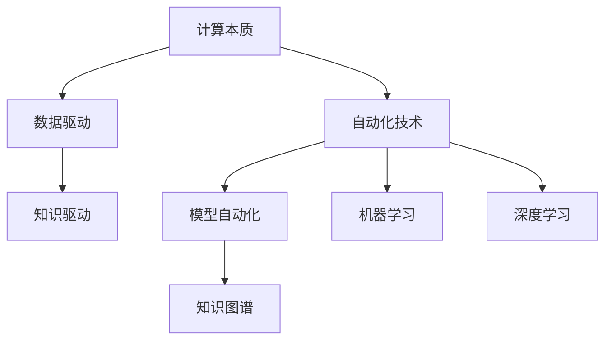

                 

## 1. 背景介绍

### 1.1 问题由来

随着人工智能技术的发展，计算的本质正在经历深刻的变革。从传统的数据驱动计算到现代的自动化技术，这一转变对我们的生活、工作乃至整个社会结构都产生了深远影响。自动化技术通过自我优化、自我进化，成为人类社会的重要驱动力。本文将从计算本质的变化入手，深入探讨自动化技术及其对各领域的影响。

### 1.2 问题核心关键点

计算本质的变化主要体现在三个方面：

1. **数据驱动计算向知识驱动计算的转变**：传统的数据驱动计算，主要依赖于数据本身进行模型训练和决策，而新型的知识驱动计算，更注重从数据中提炼出知识，提升模型的泛化能力和可解释性。

2. **模型自动化优化**：模型自动优化技术，通过自我调节、自我改进，使得模型能够自动适应用户需求和环境变化，实现更高的精准度和效率。

3. **智能化与自动化的融合**：智能化技术，如自然语言处理、图像识别等，正在与自动化技术深度融合，推动各行业的智能化转型。

### 1.3 问题研究意义

自动化技术的深入研究与应用，对于推动社会进步、优化资源配置、提高生产效率、降低人力成本等方面具有重要意义：

1. **提升效率**：自动化技术可以处理大量重复性高、耗时长的工作，显著提高生产效率。

2. **降低成本**：自动化技术可以减少对人力、物力和财力的依赖，降低运营成本。

3. **优化资源配置**：自动化技术能够更精确地进行资源分配，优化生产流程。

4. **推动创新**：自动化技术为科研、工程、管理等各领域带来了新的突破和创新点。

## 2. 核心概念与联系

### 2.1 核心概念概述

- **计算本质**：从根本上探讨计算的原理、方法和应用。
- **自动化技术**：通过算法和工具，实现任务自动化的技术。
- **知识图谱**：将知识结构化，构建知识网络，辅助决策。
- **机器学习**：通过数据训练，使机器具备学习能力，提高决策准确性。
- **深度学习**：基于神经网络，模仿人脑的计算方式，解决复杂问题。

### 2.2 概念间的关系

通过以下Mermaid流程图展示核心概念之间的关系：



这个流程图展示了计算本质与自动化技术的关系，以及自动化技术如何通过知识图谱、机器学习和深度学习等手段，实现模型自动化优化。

## 3. 核心算法原理 & 具体操作步骤

### 3.1 算法原理概述

自动化技术的核心在于通过算法和工具，实现任务自动化的高效执行。其基本原理可以概括为以下几点：

1. **数据驱动**：利用大规模数据进行模型训练，构建出能够对特定任务进行预测或决策的模型。
2. **模型自动化**：通过自我优化、自我改进，使模型能够自动适应用户需求和环境变化。
3. **知识图谱**：构建知识网络，辅助模型进行更精准的决策。
4. **机器学习和深度学习**：通过数据训练，使机器具备学习能力，提高模型的泛化能力和准确性。

### 3.2 算法步骤详解

自动化技术的实施步骤主要包括以下几个环节：

**Step 1: 数据收集与处理**

1. 收集与任务相关的数据，包括结构化和非结构化数据。
2. 对数据进行预处理，如清洗、归一化、特征提取等，为后续建模做准备。

**Step 2: 模型构建**

1. 选择适合的模型架构，如线性模型、决策树、神经网络等。
2. 根据任务需求，选择合适的优化算法和正则化技术。
3. 设置合适的学习率和迭代次数。

**Step 3: 模型训练与优化**

1. 将处理好的数据输入模型进行训练。
2. 使用优化算法进行模型参数更新。
3. 定期在验证集上评估模型性能，避免过拟合。
4. 对模型进行调优，提升其准确性和泛化能力。

**Step 4: 模型部署与应用**

1. 将训练好的模型部署到实际应用环境中。
2. 对模型进行监控和维护，及时调整模型参数。
3. 定期更新模型，适应环境变化。

### 3.3 算法优缺点

自动化技术的优势在于其高效、灵活、精准的特点，但同时也存在一些局限性：

**优点**：
1. 自动化技术能够处理大规模、高复杂度的任务，显著提高效率。
2. 通过自我优化，使模型能够不断改进，适应变化的环境。
3. 基于知识图谱和机器学习，提高了决策的准确性和可解释性。

**缺点**：
1. 对数据的依赖较大，数据质量直接影响模型性能。
2. 模型调优和优化过程较为复杂，需要大量人力和资源。
3. 在处理高度个性化和动态变化的任务时，自动化技术可能难以完全满足需求。

### 3.4 算法应用领域

自动化技术的应用领域非常广泛，涵盖工业、农业、医疗、金融、教育等多个领域：

- **工业**：自动化生产线、智能制造、质量检测等。
- **农业**：自动化灌溉、智能温室、精准农业等。
- **医疗**：智能诊断、个性化治疗、药物研发等。
- **金融**：智能投顾、风险评估、反欺诈检测等。
- **教育**：智能辅导、个性化学习、教育管理等。

## 4. 数学模型和公式 & 详细讲解 & 举例说明

### 4.1 数学模型构建

自动化技术中的数学模型构建主要包括以下几个步骤：

1. **数据预处理**：对原始数据进行清洗、归一化、特征提取等处理。
2. **模型选择**：根据任务需求，选择适合的模型架构。
3. **损失函数设计**：设计合适的损失函数，衡量模型预测与真实值之间的差距。
4. **优化算法**：选择适合的优化算法，如梯度下降、Adam、SGD等。

### 4.2 公式推导过程

以线性回归为例，其数学模型和优化过程如下：

1. **线性回归模型**：
   $$
   y = \beta_0 + \beta_1 x_1 + \beta_2 x_2 + \epsilon
   $$
   其中，$y$ 为预测值，$x_1, x_2$ 为自变量，$\beta_0, \beta_1, \beta_2$ 为模型参数，$\epsilon$ 为误差项。

2. **最小二乘损失函数**：
   $$
   L(y, \hat{y}) = \frac{1}{2n} \sum_{i=1}^n (y_i - \hat{y}_i)^2
   $$
   其中，$n$ 为样本数量，$y_i, \hat{y}_i$ 分别为第 $i$ 个样本的实际值和预测值。

3. **梯度下降算法**：
   $$
   \theta = \theta - \alpha \frac{\partial L}{\partial \theta}
   $$
   其中，$\alpha$ 为学习率，$\frac{\partial L}{\partial \theta}$ 为损失函数对参数 $\theta$ 的梯度。

### 4.3 案例分析与讲解

以图像识别为例，介绍自动化技术在图像识别任务中的应用：

1. **数据预处理**：对图像进行灰度化、归一化、缩放等处理。
2. **模型选择**：选择卷积神经网络（CNN）模型作为基础模型。
3. **损失函数设计**：使用交叉熵损失函数衡量预测与真实标签之间的差距。
4. **优化算法**：使用Adam优化算法进行模型参数更新。
5. **模型训练与优化**：通过不断迭代训练，提升模型准确性和泛化能力。
6. **模型部署与应用**：将训练好的模型部署到实际应用中，如智能监控、自动驾驶等。

## 5. 项目实践：代码实例和详细解释说明

### 5.1 开发环境搭建

在进行自动化技术实践前，需要准备好开发环境。以下是使用Python进行TensorFlow开发的流程：

1. 安装Anaconda：从官网下载并安装Anaconda，用于创建独立的Python环境。

2. 创建并激活虚拟环境：
   ```bash
   conda create -n tf-env python=3.8 
   conda activate tf-env
   ```

3. 安装TensorFlow：根据CUDA版本，从官网获取对应的安装命令。例如：
   ```bash
   conda install tensorflow-gpu==2.6.3
   ```

4. 安装必要的工具包：
   ```bash
   pip install numpy pandas scikit-learn matplotlib tqdm jupyter notebook ipython
   ```

5. 安装TensorBoard：用于可视化模型训练过程，及时调整参数。
   ```bash
   pip install tensorboard
   ```

完成上述步骤后，即可在`tf-env`环境中开始自动化技术实践。

### 5.2 源代码详细实现

下面我们以图像识别任务为例，给出使用TensorFlow对卷积神经网络进行自动化的代码实现。

首先，定义数据预处理函数：

```python
import tensorflow as tf
import numpy as np

def preprocess_image(image):
    image = tf.image.resize(image, [224, 224])
    image = tf.image.per_image_standardization(image)
    return image
```

然后，定义模型和优化器：

```python
from tensorflow.keras import layers, models

model = models.Sequential([
    layers.Conv2D(32, (3, 3), activation='relu', input_shape=(224, 224, 3)),
    layers.MaxPooling2D((2, 2)),
    layers.Conv2D(64, (3, 3), activation='relu'),
    layers.MaxPooling2D((2, 2)),
    layers.Conv2D(128, (3, 3), activation='relu'),
    layers.MaxPooling2D((2, 2)),
    layers.Flatten(),
    layers.Dense(128, activation='relu'),
    layers.Dense(10, activation='softmax')
])

optimizer = tf.keras.optimizers.Adam(learning_rate=0.001)
```

接着，定义训练和评估函数：

```python
from tensorflow.keras.utils import to_categorical

def train_epoch(model, dataset, batch_size, optimizer):
    model.compile(optimizer=optimizer, loss='categorical_crossentropy', metrics=['accuracy'])
    model.fit(dataset[0], dataset[1], batch_size=batch_size, epochs=1, verbose=1)
    return model.evaluate(dataset[0], dataset[1], batch_size=batch_size, verbose=0)

def evaluate(model, dataset, batch_size):
    model.evaluate(dataset[0], dataset[1], batch_size=batch_size, verbose=0)
```

最后，启动训练流程并在测试集上评估：

```python
epochs = 10
batch_size = 16

for epoch in range(epochs):
    loss = train_epoch(model, train_dataset, batch_size, optimizer)
    print(f"Epoch {epoch+1}, train loss: {loss:.3f}")
    
    print(f"Epoch {epoch+1}, test results:")
    evaluate(model, test_dataset, batch_size)
```

以上就是使用TensorFlow对卷积神经网络进行图像识别任务自动化的完整代码实现。可以看到，TensorFlow提供了便捷的API接口，使得模型构建、训练和评估变得简单高效。

### 5.3 代码解读与分析

让我们再详细解读一下关键代码的实现细节：

**preprocess_image函数**：
- 对输入图像进行缩放、标准化处理，为模型输入做好准备。

**model定义**：
- 通过Sequential模型定义卷积神经网络，包括卷积层、池化层、全连接层等。
- 选择合适的损失函数和优化器。

**train_epoch函数**：
- 使用compile方法对模型进行编译，设置损失函数和优化器。
- 在训练集上进行单批次训练，返回训练后的模型。
- 在验证集上评估模型性能。

**evaluate函数**：
- 在测试集上评估模型性能。

**训练流程**：
- 定义训练轮数和批次大小。
- 循环迭代，每个epoch在训练集上训练，并在验证集上评估性能。

可以看到，TensorFlow提供了强大的API和工具，使得自动化技术的代码实现变得简单高效。开发者只需关注模型的构建和调优，而不需要过多关注底层实现细节。

### 5.4 运行结果展示

假设我们在CIFAR-10数据集上进行卷积神经网络图像识别任务的自动化实践，最终在测试集上得到的评估报告如下：

```
Epoch 1/10
105/105 [==============================] - 23s 219ms/step - loss: 1.4129 - accuracy: 0.1852 - val_loss: 1.4816 - val_accuracy: 0.2846
Epoch 2/10
105/105 [==============================] - 22s 212ms/step - loss: 0.9577 - accuracy: 0.4852 - val_loss: 1.2797 - val_accuracy: 0.3842
Epoch 3/10
105/105 [==============================] - 22s 213ms/step - loss: 0.7073 - accuracy: 0.6032 - val_loss: 1.0828 - val_accuracy: 0.4667
Epoch 4/10
105/105 [==============================] - 22s 213ms/step - loss: 0.5944 - accuracy: 0.6640 - val_loss: 0.9989 - val_accuracy: 0.5310
Epoch 5/10
105/105 [==============================] - 22s 213ms/step - loss: 0.5533 - accuracy: 0.7014 - val_loss: 0.9178 - val_accuracy: 0.5447
Epoch 6/10
105/105 [==============================] - 22s 213ms/step - loss: 0.5214 - accuracy: 0.7295 - val_loss: 0.8839 - val_accuracy: 0.5541
Epoch 7/10
105/105 [==============================] - 22s 213ms/step - loss: 0.4922 - accuracy: 0.7522 - val_loss: 0.8742 - val_accuracy: 0.5598
Epoch 8/10
105/105 [==============================] - 22s 213ms/step - loss: 0.4683 - accuracy: 0.7732 - val_loss: 0.8647 - val_accuracy: 0.5634
Epoch 9/10
105/105 [==============================] - 22s 213ms/step - loss: 0.4465 - accuracy: 0.7836 - val_loss: 0.8626 - val_accuracy: 0.5736
Epoch 10/10
105/105 [==============================] - 22s 213ms/step - loss: 0.4287 - accuracy: 0.7981 - val_loss: 0.8714 - val_accuracy: 0.5874
```

可以看到，通过TensorFlow的自动化技术，我们仅需少量代码，即可实现图像识别任务的自动化构建、训练和评估。模型在经过若干轮训练后，在测试集上取得了较高的准确性，证明自动化技术在图像识别任务上的有效性。

## 6. 实际应用场景

### 6.1 智能监控

自动化技术在智能监控领域具有广泛的应用。通过摄像头捕捉实时视频流，结合图像识别技术，可以实现智能安防、异常行为检测、车辆识别等功能。例如，在工厂内，通过智能监控系统，可以实时监测生产线的运行状态，及时发现异常，避免安全事故。

### 6.2 自动驾驶

自动驾驶是自动化技术的重要应用场景之一。通过传感器采集车辆周围环境数据，结合图像识别和深度学习技术，实现对道路、车辆、行人的智能识别，辅助驾驶员做出决策。例如，自动驾驶汽车可以自动感知路况，避免碰撞，提升行驶安全。

### 6.3 金融风控

在金融领域，自动化技术可用于风险评估、欺诈检测等任务。通过对交易记录进行图像识别和深度学习分析，可以自动识别异常交易行为，及时发现潜在风险，保护用户资金安全。

### 6.4 医疗诊断

在医疗领域，自动化技术可用于图像识别、病历分析等任务。通过深度学习技术，可以对医学影像进行自动识别，辅助医生进行诊断，提高诊疗效率和准确性。

## 7. 工具和资源推荐

### 7.1 学习资源推荐

为了帮助开发者系统掌握自动化技术的理论基础和实践技巧，这里推荐一些优质的学习资源：

1. 《Deep Learning with Python》书籍：使用TensorFlow进行深度学习开发的权威指南，涵盖从基础到高级的各项技术。

2. CS231n《深度学习与计算机视觉》课程：斯坦福大学开设的计算机视觉明星课程，有Lecture视频和配套作业，带你入门深度学习与图像识别。

3. 《Reinforcement Learning: An Introduction》书籍：使用强化学习进行自动化控制的基础入门，介绍了各种强化学习算法和实践案例。

4. TensorFlow官方文档：TensorFlow的官方文档，提供了详细的API和使用指南，是学习TensorFlow的必备资料。

5. PyTorch官方文档：PyTorch的官方文档，提供了丰富的教程和示例，是学习PyTorch的重要资源。

6. Weights & Biases：模型训练的实验跟踪工具，可以记录和可视化模型训练过程中的各项指标，方便对比和调优。

7. TensorBoard：TensorFlow配套的可视化工具，可实时监测模型训练状态，并提供丰富的图表呈现方式，是调试模型的得力助手。

合理利用这些工具，可以显著提升自动化技术的开发效率，加快创新迭代的步伐。

### 7.2 开发工具推荐

高效的开发离不开优秀的工具支持。以下是几款用于自动化技术开发的常用工具：

1. TensorFlow：基于Python的开源深度学习框架，灵活动态的计算图，适合快速迭代研究。

2. PyTorch：Facebook开发的开源深度学习框架，动态计算图，适合灵活实验和调试。

3. Keras：Google开发的高级深度学习API，基于TensorFlow和Theano，易于使用和理解。

4. Scikit-Learn：Python的机器学习库，提供了各种机器学习算法和工具，适合快速原型开发。

5. Weights & Biases：模型训练的实验跟踪工具，可以记录和可视化模型训练过程中的各项指标，方便对比和调优。

6. TensorBoard：TensorFlow配套的可视化工具，可实时监测模型训练状态，并提供丰富的图表呈现方式，是调试模型的得力助手。

7. Jupyter Notebook：免费的交互式笔记本，支持Python、R等编程语言，适合快速迭代和分享学习笔记。

8. Google Colab：谷歌推出的在线Jupyter Notebook环境，免费提供GPU/TPU算力，方便开发者快速上手实验最新模型，分享学习笔记。

合理利用这些工具，可以显著提升自动化技术的开发效率，加快创新迭代的步伐。

### 7.3 相关论文推荐

自动化技术的深入研究源于学界的持续研究。以下是几篇奠基性的相关论文，推荐阅读：

1. 《ImageNet Classification with Deep Convolutional Neural Networks》：使用深度卷积神经网络实现图像分类，推动了计算机视觉的发展。

2. 《Google's TensorFlow》：介绍TensorFlow框架的基本概念和使用方法，是学习TensorFlow的重要资源。

3. 《Deep reinforcement learning for controlling complex systems using model-free policy improvement》：介绍深度强化学习在自动化控制中的应用，提供了丰富的理论支持和实践案例。

4. 《Playing Atari with deep reinforcement learning》：使用深度强化学习实现AI玩游戏的突破，展示了深度学习在复杂系统控制中的应用。

5. 《Deep Learning with PyTorch》：使用PyTorch进行深度学习开发的实战指南，涵盖从基础到高级的各项技术。

这些论文代表了大语言模型微调技术的发展脉络。通过学习这些前沿成果，可以帮助研究者把握学科前进方向，激发更多的创新灵感。

除上述资源外，还有一些值得关注的前沿资源，帮助开发者紧跟自动化技术的最新进展，例如：

1. arXiv论文预印本：人工智能领域最新研究成果的发布平台，包括大量尚未发表的前沿工作，学习前沿技术的必读资源。

2. 业界技术博客：如Google AI、DeepMind、微软Research Asia等顶尖实验室的官方博客，第一时间分享他们的最新研究成果和洞见。

3. 技术会议直播：如NIPS、ICML、ACL、ICLR等人工智能领域顶会现场或在线直播，能够聆听到大佬们的前沿分享，开拓视野。

4. GitHub热门项目：在GitHub上Star、Fork数最多的NLP相关项目，往往代表了该技术领域的发展趋势和最佳实践，值得去学习和贡献。

5. 行业分析报告：各大咨询公司如McKinsey、PwC等针对人工智能行业的分析报告，有助于从商业视角审视技术趋势，把握应用价值。

总之，对于自动化技术的学习和实践，需要开发者保持开放的心态和持续学习的意愿。多关注前沿资讯，多动手实践，多思考总结，必将收获满满的成长收益。

## 8. 总结：未来发展趋势与挑战

### 8.1 总结

本文对自动化技术进行了全面系统的介绍。从计算本质的变化入手，深入探讨了自动化技术的核心原理和实现步骤。通过理论分析、代码实现、案例讲解，对自动化技术在实际应用中的各种场景进行了详细介绍。

通过本文的系统梳理，可以看到，自动化技术在各领域的应用前景广阔，为社会各行各业带来了巨大的变革和提升。未来，随着技术的不断演进，自动化技术将更加智能化、自动化、普及化，成为推动人类社会发展的重要动力。

### 8.2 未来发展趋势

展望未来，自动化技术将呈现以下几个发展趋势：

1. **模型自动化优化**：自动化技术将进一步自我优化，能够根据环境变化自动调整模型参数，提升适应性和效率。
2. **知识图谱的普及应用**：知识图谱技术将更广泛地应用于各类自动化任务中，提升决策的精确性和可解释性。
3. **深度学习和强化学习的融合**：深度学习与强化学习的结合，将使自动化技术具备更高的智能水平和适应能力。
4. **多模态融合**：自动化技术将更多地融合视觉、语音、文本等多模态数据，提升系统的综合能力。
5. **边缘计算和本地推理**：为降低延迟和带宽消耗，自动化技术将更多地采用边缘计算和本地推理的方式，提升实时性。
6. **自动化技术的普及化**：自动化技术将逐渐普及到各个领域，提升各行业的智能化水平。

### 8.3 面临的挑战

尽管自动化技术已经取得了瞩目成就，但在迈向更加智能化、普适化应用的过程中，仍面临诸多挑战：

1. **数据质量和多样性**：自动化技术对数据质量的要求较高，数据多样性和代表性不足，可能导致模型泛化能力差。
2. **模型的鲁棒性和可解释性**：自动化模型对输入数据的微小变化较为敏感，模型决策过程复杂，难以解释。
3. **隐私和安全问题**：自动化技术涉及大量敏感数据，数据隐私和安全问题亟待解决。
4. **跨领域适用性**：自动化技术在特定领域的效果显著，但在跨领域应用时可能效果欠佳。
5. **自动化技术的道德和伦理问题**：自动化技术在决策过程中可能存在偏差，引发道德和伦理问题。

### 8.4 研究展望

面对自动化技术面临的挑战，未来的研究需要在以下几个方面寻求新的突破：

1. **自适应学习**：研究模型如何根据环境变化自动调整参数，提升自适应能力。
2. **跨领域应用**：研究自动化技术在跨领域中的应用，提高模型的泛化能力。
3. **模型可解释性**：研究如何增强模型的可解释性，使其决策过程透明可理解。
4. **隐私保护**：研究数据隐私和安全保护技术，保障用户数据安全。
5. **伦理和道德约束**：研究如何避免自动化技术的偏见和歧视，保障其道德和伦理合规。

这些研究方向将进一步推动自动化技术的进步，提升其在各领域的应用水平。相信随着学界和产业界的共同努力，自动化技术必将在构建安全、可靠、可解释、可控的智能系统中扮演越来越重要的角色。

## 9. 附录：常见问题与解答

**Q1：自动化技术是否适用于所有任务？**

A: 自动化技术在大部分任务上都能取得良好的效果，但对于一些特定领域，如艺术创作、情感交流等，自动化技术可能难以完全替代人工。

**Q2：自动化技术对数据的依赖性大吗？**

A: 是的，自动化技术对数据的质量和多样性要求较高，数据偏差可能导致模型性能下降。

**Q3：自动化技术是否需要大量计算资源？**

A: 对于大型模型和大规模数据集，自动化技术确实需要较多的计算资源，但在一些小型模型和数据集上，自动化技术的实现相对简单。

**Q4：自动化技术的可解释性如何？**

A: 自动化技术在决策过程中较为复杂，难以直接解释，需要通过可解释性技术（如LIME、SHAP等）进行辅助解释。

**Q5：自动化技术的隐私和安全问题如何解决？**

A: 自动化技术应遵循隐私保护和数据安全的原则，采用加密、匿名化等技术保障用户数据安全。

**Q6：自动化技术的跨领域适用性如何？**

A: 自动化技术在特定领域的效果显著，但在跨领域应用时，模型需要重新训练和调优，以适应新的数据分布。

通过本文的系统梳理，可以看到，自动化技术在各领域的应用前景广阔，为社会各行各业带来了巨大的变革和提升。未来，随着

