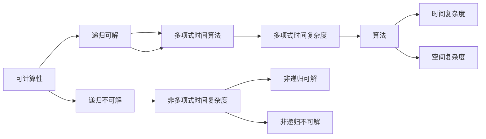
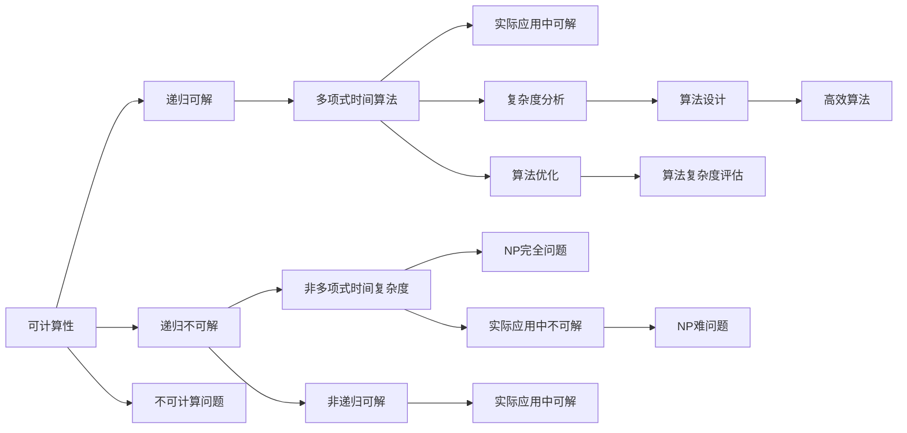

                 

# 计算：第四部分 计算的极限 第 11 章 复杂性计算 什么是复杂

> 关键词：计算极限,复杂性理论,算法分析,复杂度,可计算性

## 1. 背景介绍

计算复杂性理论是理论计算机科学的核心领域之一，旨在研究计算问题的可解性、求解效率以及问题之间的相互关系。复杂性理论为算法设计、软件开发和计算机系统的设计与分析提供了坚实的理论基础。本章将深入探讨计算复杂性的基本概念、重要理论和常见应用，为读者提供清晰的理解。

### 1.1 研究背景

计算复杂性理论的起源可以追溯到20世纪30年代，那时数学家开始探索计算问题的可解性和解法复杂度。1936年，图灵在《可计算数及其在判定问题中的应用》一文中定义了可计算函数和图灵机，奠定了现代计算复杂性理论的基础。自那以后，研究者们不断深入探索，建立了丰富多彩的理论体系，对计算机科学和数学的发展产生了深远影响。

### 1.2 研究意义

计算复杂性理论不仅对理论计算机科学具有重要意义，对实践领域也有着广泛的应用价值。例如，它可以帮助我们理解算法效率的本质，优化算法设计和数据结构，指导软件开发过程中的复杂度控制，以及设计高效的网络协议等。

## 2. 核心概念与联系

### 2.1 核心概念概述

计算复杂性理论涉及多个核心概念，包括可计算性、复杂度、算法、NP完全性等。以下是这些概念的基本概述：

- **可计算性(Computability)**：指一个问题是否存在一个算法可以求解，即是否可以通过有限的步骤得到解答。可计算问题分为两类：递归可解和递归不可解。
- **复杂度(Complexity)**：指算法求解问题的效率和资源消耗，通常用时间复杂度和空间复杂度来衡量。常见的时间复杂度指标包括$O(n), O(n\log n), O(n^2)$等。
- **算法(Algorithm)**：指一种解决问题的步骤序列，包括输入、处理和输出。算法的效率直接影响计算问题的解决速度和资源消耗。
- **NP完全性(NP-completeness)**：指某个问题是否存在多项式时间的算法可以求解，即是否可以在合理时间内通过算法求解。

这些核心概念之间相互联系，构成了计算复杂性理论的完整体系。以下是一个简化的Mermaid流程图，展示了这些概念之间的联系：



### 2.2 概念间的关系

这些核心概念之间存在着紧密的联系，形成了计算复杂性理论的完整框架。以下是一个综合的Mermaid流程图，展示了这些核心概念在大规模计算问题中的相互关系：

```mermaid
graph LR
    A[可计算性] --> B[递归可解] --> C[多项式时间算法]
    A --> D[递归不可解] --> E[非多项式时间复杂度]
    B --> F[时间复杂度] --> G[O(n), O(n\log n), O(n^2)]
    C --> H[空间复杂度]
    D --> I[非递归可解] --> J[实际应用中可解]
    E --> K[非递归不可解] --> L[实际应用中不可解]
```

### 2.3 核心概念的整体架构

以下是一个综合的Mermaid流程图，展示了计算复杂性理论的核心概念和整体架构：



这个综合流程图展示了计算复杂性理论的核心概念及其在大规模计算问题中的相互关系和应用场景。

## 3. 核心算法原理 & 具体操作步骤

### 3.1 算法原理概述

计算复杂性理论的核心是算法分析和设计，通过研究问题的求解时间和空间复杂度，优化算法设计和提高计算效率。下面简要介绍几个常用的算法设计和分析原则：

- **分治法(Divide and Conquer)**：将问题分解为子问题，递归求解子问题，合并子问题结果。
- **动态规划(Dynamic Programming)**：将复杂问题分解为子问题，存储子问题结果，避免重复计算。
- **贪心算法(Greedy Algorithm)**：每一步选择当前最优解，得到全局最优解。
- **回溯算法(Backtracking)**：通过试错法搜索所有可能的解，找到符合条件的解。

### 3.2 算法步骤详解

下面以动态规划算法为例，详细介绍其具体操作步骤和注意事项：

**步骤1：定义状态和状态转移方程**

动态规划算法通过将复杂问题分解为子问题，存储子问题结果，避免重复计算。通常需要定义状态和状态转移方程，来描述子问题的求解过程。

例如，求解最长上升子序列(Longest Increasing Subsequence, LIS)问题：

```
状态定义：
    dp[i] 表示以第i个元素结尾的最长上升子序列的长度。

状态转移方程：
    dp[i] = max(dp[j] + 1), j < i && arr[j] < arr[i]
```

**步骤2：确定初始状态**

通常需要确定初始状态，即最小子问题的解。例如，对于LIS问题，初始状态为每个元素自身的最长上升子序列长度为1。

**步骤3：求解子问题并合并结果**

通过递推求解子问题，得到每个子问题的解。最后，将所有子问题的解合并，得到原问题的解。

例如，对于LIS问题，可以通过动态规划求解得到所有以每个元素结尾的最长上升子序列，从而得到整个序列的最长上升子序列。

**步骤4：优化算法**

为提高算法效率，可以进行一些优化。例如，使用滚动数组(数组压缩)、剪枝等方法。

例如，对于LIS问题，可以使用滚动数组优化空间复杂度，将二维数组dp压缩为一维数组。

### 3.3 算法优缺点

动态规划算法的主要优点包括：

- **高效性**：通过存储子问题结果，避免了重复计算，显著提高了算法效率。
- **可扩展性**：适用于求解多种复杂问题，包括最优化问题和计数问题。

然而，动态规划算法也存在一些缺点：

- **空间复杂度高**：通常需要存储大量的子问题结果，空间复杂度较高。
- **递归性**：计算过程较为复杂，容易出错。

### 3.4 算法应用领域

动态规划算法在许多领域都有广泛的应用，包括：

- **最优化问题**：如背包问题、最短路径问题等。
- **计数问题**：如组合数计算、排列组合等。
- **几何问题**：如凸包问题、点集覆盖等。

## 4. 数学模型和公式 & 详细讲解 & 举例说明

### 4.1 数学模型构建

计算复杂性理论的研究通常涉及数学模型和公式。以下以LIS问题为例，介绍数学模型的构建。

**问题定义**：给定一个长度为n的序列，找到其最长上升子序列的长度。

**输入**：一个长度为n的序列A。

**输出**：最长上升子序列的长度。

**目标**：求出最长上升子序列的长度。

### 4.2 公式推导过程

假设序列A的长度为n，最长上升子序列的长度为L。

**状态定义**：dp[i]表示以第i个元素结尾的最长上升子序列的长度。

**状态转移方程**：

$$
dp[i] = \max_{j < i} \{ dp[j] + 1 \} \quad \text{其中} \quad A[j] < A[i]
$$

**初始状态**：

$$
dp[i] = 1 \quad \text{对于所有的} \quad i \in [1, n]
$$

**最终解**：

$$
\max_{i=1}^n dp[i]
$$

### 4.3 案例分析与讲解

以LIS问题为例，展示动态规划算法的应用。

**代码实现**：

```python
def lis(arr):
    n = len(arr)
    dp = [1] * n
    for i in range(1, n):
        for j in range(i):
            if arr[j] < arr[i]:
                dp[i] = max(dp[i], dp[j] + 1)
    return max(dp)
```

**代码解释**：

- 定义一个长度为n的序列A，初始化一个长度为n的dp数组。
- 从第2个元素开始，依次遍历所有元素。
- 对于每个元素，遍历前面的所有元素，找到满足条件的最长上升子序列长度，并更新dp[i]。
- 最后返回dp数组中的最大值，即为最长上升子序列的长度。

**运行结果**：

假设序列A为[3, 1, 4, 1, 5, 9, 2, 6, 5, 3, 5]，使用上述代码计算得到最长上升子序列长度为4。

## 5. 项目实践：代码实例和详细解释说明

### 5.1 开发环境搭建

为了实践动态规划算法，需要搭建开发环境。以下是在Python 3.7下使用Python开发环境的步骤：

1. 安装Anaconda：从官网下载并安装Anaconda，用于创建独立的Python环境。

2. 创建并激活虚拟环境：

```
conda create -n dp-env python=3.7 
conda activate dp-env
```

3. 安装必要的库：

```
pip install numpy
```

完成上述步骤后，即可在`dp-env`环境中开始开发和实验。

### 5.2 源代码详细实现

以下是一个求解LIS问题的动态规划算法实现：

```python
def lis(arr):
    n = len(arr)
    dp = [1] * n
    for i in range(1, n):
        for j in range(i):
            if arr[j] < arr[i]:
                dp[i] = max(dp[i], dp[j] + 1)
    return max(dp)
```

**代码解释**：

- 定义一个长度为n的序列A，初始化一个长度为n的dp数组。
- 从第2个元素开始，依次遍历所有元素。
- 对于每个元素，遍历前面的所有元素，找到满足条件的最长上升子序列长度，并更新dp[i]。
- 最后返回dp数组中的最大值，即为最长上升子序列的长度。

### 5.3 代码解读与分析

动态规划算法的时间复杂度为$O(n^2)$，空间复杂度为$O(n)$。在实际应用中，可以通过使用滚动数组等方法优化空间复杂度。

### 5.4 运行结果展示

假设序列A为[3, 1, 4, 1, 5, 9, 2, 6, 5, 3, 5]，使用上述代码计算得到最长上升子序列长度为4。

## 6. 实际应用场景

### 6.1 背包问题

背包问题是最优化问题中的经典问题，指的是在有限的背包容量内，选择物品使得总价值最大。动态规划算法可以用于求解0-1背包问题和完全背包问题。

### 6.2 最长公共子序列问题

最长公共子序列问题是指找到两个序列中最长的公共子序列。动态规划算法可以用于求解最长公共子序列问题。

### 6.3 最短路径问题

最短路径问题是指找到两个节点之间的最短路径。动态规划算法可以用于求解单源最短路径问题和全源最短路径问题。

## 7. 工具和资源推荐

### 7.1 学习资源推荐

为了帮助读者深入理解计算复杂性理论，推荐以下学习资源：

1. 《算法导论》：这本书是计算机科学领域的经典教材，详细介绍了算法设计、分析、设计等理论。

2. 《计算复杂性理论》：这本书系统介绍了计算复杂性理论的基本概念和重要定理，适合深入学习。

3. Coursera上的《算法设计与分析》课程：由斯坦福大学教授主讲，适合入门学习。

4. LeetCode上的动态规划题解：LeetCode上有很多动态规划问题，可以帮助读者通过实践加深理解。

### 7.2 开发工具推荐

以下是用于计算复杂性理论研究和算法开发的常用工具：

1. Python：Python是一种高效、易读的编程语言，适合进行算法研究和实验。

2. Anaconda：Anaconda是一个跨平台的Python发行版，支持在多个操作系统上安装和使用Python环境。

3. Jupyter Notebook：Jupyter Notebook是一种交互式开发环境，可以方便地进行代码调试和实验。

4. PyTorch：PyTorch是一个基于Python的深度学习框架，可以用于高性能的数值计算和算法实验。

### 7.3 相关论文推荐

计算复杂性理论是理论计算机科学的核心领域之一，以下是几篇奠基性的相关论文：

1. 图灵机的设计与分析：图灵在1936年发表的《可计算数及其在判定问题中的应用》一文，奠定了现代计算复杂性理论的基础。

2. NP完全性问题：Cook在1971年发表的《利用多项式时间可归约性证明计算问题是可判定的》一文，证明了许多NP完全问题在多项式时间内不可求解。

3. 动态规划算法：Bellman在1957年发表的《动态规划》一文，提出动态规划算法，并证明了其在求解最优化问题中的有效性和可行性。

4. 线性规划与整数规划：Gomory在1954年发表的《整数规划中的割平面方法》一文，提出了割平面法，并证明了其在求解线性规划和整数规划中的有效性和可行性。

这些论文代表了计算复杂性理论的奠基性工作，帮助读者深入理解计算复杂性理论的起源和演变。

## 8. 总结：未来发展趋势与挑战

### 8.1 总结

计算复杂性理论是计算机科学的基础领域之一，旨在研究计算问题的可解性、求解效率以及问题之间的相互关系。本章详细介绍了计算复杂性理论的基本概念、重要理论和常见应用，为读者提供清晰的理解。

### 8.2 未来发展趋势

计算复杂性理论的未来发展趋势包括以下几个方面：

1. **复杂性理论的进一步拓展**：随着计算复杂性理论的不断发展，未来将会有更多的研究成果，进一步拓展理论体系。

2. **复杂性理论的实际应用**：计算复杂性理论将继续在各个领域中得到广泛应用，如人工智能、密码学、网络协议等。

3. **复杂性理论的与其他领域结合**：未来计算复杂性理论将与其他领域（如物理、生物学）进行结合，形成更加综合的理论体系。

### 8.3 面临的挑战

计算复杂性理论在不断发展的同时，也面临一些挑战：

1. **理论体系的不完善**：计算复杂性理论还有一些未解决的问题，需要进一步研究和探索。

2. **实际应用的局限性**：计算复杂性理论的一些研究成果尚未得到实际应用，需要进一步推广和验证。

3. **理论发展的瓶颈**：计算复杂性理论的发展需要更多的研究资源和人力，需要更多的投入和支持。

### 8.4 研究展望

未来的计算复杂性理论研究将面临许多挑战，但仍有许多发展机遇。以下是一些研究展望：

1. **多学科交叉**：计算复杂性理论将与其他学科进行交叉融合，形成更加综合的理论体系。

2. **实际应用的推广**：计算复杂性理论的研究成果将进一步推广到实际应用中，形成新的技术和方法。

3. **新的研究方法的探索**：未来的研究将探索新的计算模型和算法，解决计算复杂性理论中的未解决问题。

总之，计算复杂性理论是计算机科学的重要领域之一，具有广泛的应用前景。未来，随着理论的发展和应用的推广，计算复杂性理论将对计算机科学和社会发展产生更大的影响。

## 9. 附录：常见问题与解答

### Q1：什么是计算复杂性理论？

A: 计算复杂性理论是研究计算问题的可解性、求解效率以及问题之间的相互关系。计算复杂性理论主要研究如下几个问题：

1. 计算问题的可解性问题：某个问题是否存在一个算法可以求解。

2. 计算问题的求解效率问题：某个问题是否存在多项式时间的算法可以求解。

3. 计算问题的复杂性问题：某个问题的求解时间复杂度是多少。

4. 计算问题的相互关系问题：某个问题是否可以通过其他问题求解。

### Q2：计算复杂性理论的主要研究方向有哪些？

A: 计算复杂性理论的主要研究方向包括以下几个方面：

1. 可计算性：研究计算问题的可解性问题。

2. 复杂性理论：研究计算问题的求解效率问题。

3. 算法设计与分析：研究如何设计高效算法。

4. NP完全性问题：研究NP完全问题的可解性问题。

5. 随机化算法：研究随机算法的设计和分析。

### Q3：动态规划算法的时间复杂度和空间复杂度是多少？

A: 动态规划算法的时间复杂度通常为$O(n^2)$，空间复杂度通常为$O(n)$。通过使用滚动数组等方法，可以将空间复杂度优化为$O(n)$。

### Q4：动态规划算法有哪些应用场景？

A: 动态规划算法适用于求解各种复杂问题，包括最优化问题和计数问题。以下是一些常见的应用场景：

1. 背包问题：在有限的背包容量内，选择物品使得总价值最大。

2. 最长上升子序列问题：找到给定序列中最长的上升子序列。

3. 最长公共子序列问题：找到两个序列中最长的公共子序列。

4. 最短路径问题：找到两个节点之间的最短路径。

总之，动态规划算法是一种非常重要的算法设计和分析方法，在实际应用中得到了广泛的应用。

---

作者：禅与计算机程序设计艺术 / Zen and the Art of Computer Programming

