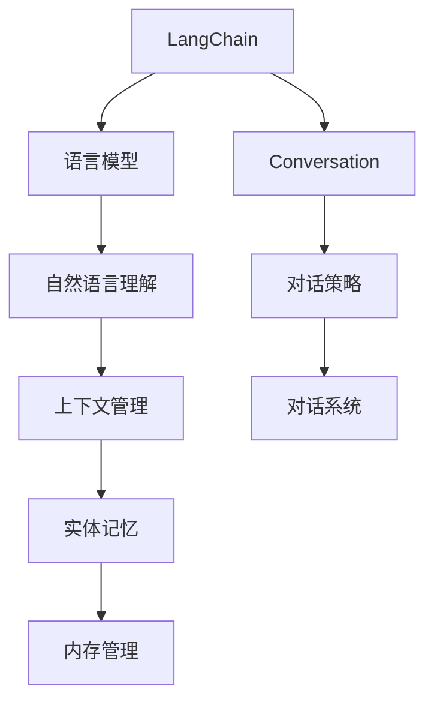

                 

# 【LangChain编程：从入门到实践】ConversationEntityMemory

> 关键词：LangChain, Conversation, EntityMemory, 对话系统, 聊天机器人, 自然语言处理, 语言模型, 内存管理

## 1. 背景介绍

### 1.1 问题由来
随着人工智能技术的迅猛发展，智能对话系统（Chatbot, Chatbot）在各个领域中的应用越来越广泛。无论是客服、教育、医疗，还是娱乐、生活助手，智能对话系统都已经深入到我们日常生活的方方面面。其中，语音识别、自然语言理解、语音合成等技术，使得对话系统能够与用户进行自然流畅的交互。

然而，尽管语音和文本输入输出的交互已经非常便捷，但对话系统内部如何进行多轮对话记忆、上下文管理、实体识别等处理，却仍然是一个难题。这不仅涉及到语言模型和对话策略，还牵涉到深度学习模型的实时更新、数据管理等多个层面。如何在大规模数据和实时交互需求下，设计一个高效、可扩展的对话系统，是业界的一大挑战。

### 1.2 问题核心关键点
针对以上问题，本篇文章将围绕 LangChain 的实体记忆机制进行深入探讨，重点介绍 ConversationEntityMemory 在实际应用中的原理、架构、实现细节和优化策略。我们将详细分析实体记忆的流程和算法原理，并通过代码实例演示其实现方法。

### 1.3 问题研究意义
理解 ConversationEntityMemory 的核心原理和实现方式，对于开发者构建具有智能实体记忆能力的对话系统具有重要意义：

1. 提升对话系统的智能水平。通过智能实体记忆，对话系统能够更准确地识别和理解用户的意图，提高对话的准确率和流畅度。
2. 优化对话系统的性能。 ConversationEntityMemory 能够高效管理对话上下文，减少内存占用，提升系统响应速度。
3. 增强对话系统的可扩展性。通过构建可扩展的实体记忆机制，对话系统能够适应不同领域的对话需求，快速扩展和迭代。
4. 提高对话系统的可靠性。智能实体记忆机制能够有效避免因上下文丢失导致的对话中断和误判，提高系统的稳定性和鲁棒性。
5. 促进对话系统的商业应用。智能实体记忆的对话系统能够提供更个性化、精准的客户服务，增强用户体验，提高商业竞争力。

## 2. 核心概念与联系

### 2.1 核心概念概述

要深入理解 ConversationEntityMemory 的原理和应用，首先需要对以下几个核心概念有清晰的认识：

- LangChain：一个开源的 Python 框架，提供了一系列语言模型的预训练和微调功能，旨在帮助开发者构建高效的对话系统。
- Conversation：对话系统的一个概念，指代用户和对话系统之间的一系列交互过程。
- EntityMemory：智能实体记忆机制，用于在对话过程中跟踪和存储对话中提及的关键实体，以确保对话的连贯性和准确性。
- 语言模型：如 Transformer、BERT 等深度学习模型，用于理解和生成自然语言。
- 上下文管理：对话系统需要实时管理对话的上下文信息，以确保对话的连贯性和一致性。
- 内存管理：对话系统需要高效管理内存资源，以避免内存泄漏和系统崩溃。

这些核心概念之间相互关联，构成了对话系统的基础架构，其中 ConversationEntityMemory 是对话系统内部的一个重要组件，用于提升系统的智能水平和性能。

### 2.2 概念间的关系

通过以下 Mermaid 流程图，可以更直观地展示这些核心概念之间的关系：



这个流程图展示了 LangChain 框架下，各个组件之间的逻辑关系。对话系统通过语言模型理解自然语言输入，利用自然语言理解模块进行上下文管理，并通过智能实体记忆机制跟踪对话中的关键实体。同时，对话系统还依赖于内存管理机制，以确保对话过程的稳定性和可扩展性。

### 2.3 核心概念的整体架构

 ConversationEntityMemory 是 LangChain 框架中的一个重要组件，用于在对话过程中跟踪和管理对话中提及的关键实体。其整体架构可以抽象为以下四个层级：

1. **实体识别层**：用于识别对话中提及的实体，如人名、地点、组织等。
2. **实体记忆层**：用于存储和管理对话中提及的实体信息，包括实体的类型、属性和状态。
3. **实体引用层**：用于在对话过程中引用和管理实体的状态变化，确保对话的连贯性和一致性。
4. **实体反馈层**：用于在对话结束时，向用户反馈对话中提及的实体信息，增强用户体验。

这些层级之间相互协作，共同实现智能实体记忆机制，提升对话系统的智能水平和用户体验。

## 3. 核心算法原理 & 具体操作步骤
### 3.1 算法原理概述

ConversationEntityMemory 的算法原理主要基于自然语言处理中的实体识别技术和上下文管理技术。其核心目标是识别对话中的关键实体，并跟踪和存储这些实体的状态变化，以确保对话的连贯性和一致性。

### 3.2 算法步骤详解

#### 3.2.1 实体识别

实体识别是 ConversationEntityMemory 机制的基础，用于从对话输入中识别出关键实体。该步骤通常包括以下几个步骤：

1. **分词**：将对话输入分词，以便进行后续的实体识别。
2. **实体标注**：利用自然语言处理模型对分词后的文本进行实体标注，标记出文本中提及的实体。
3. **实体过滤**：根据实体类型和上下文信息，过滤掉不相关或冗余的实体，确保实体识别的准确性。

#### 3.2.2 实体记忆

实体记忆是 ConversationEntityMemory 机制的核心，用于存储和管理对话中提及的关键实体信息。该步骤通常包括以下几个步骤：

1. **实体存储**：将识别出的实体信息存储在内存中，包括实体的类型、属性和状态。
2. **实体更新**：在对话过程中，根据上下文信息更新实体的状态，确保实体的最新状态。
3. **实体引用**：在对话输出中，引用和展示实体的最新状态，增强用户对话体验。

#### 3.2.3 实体反馈

实体反馈是 ConversationEntityMemory 机制的延伸，用于在对话结束时，向用户反馈对话中提及的实体信息，增强用户对话体验。该步骤通常包括以下几个步骤：

1. **实体抽取**：从对话输出中抽取提及的实体信息。
2. **实体展示**：在对话结束时，向用户展示对话中提及的实体信息，增强用户对话体验。

### 3.3 算法优缺点

#### 3.3.1 优点

1. **提升对话连贯性**：通过智能实体记忆，对话系统能够更好地理解对话上下文，提升对话连贯性和一致性。
2. **增强对话准确性**：智能实体记忆能够跟踪对话中的关键实体，减少因上下文丢失导致的对话中断和误判。
3. **提高对话流畅度**：通过智能实体记忆，对话系统能够更好地生成符合上下文的对话输出，提升对话流畅度。
4. **优化内存管理**：智能实体记忆机制能够高效管理对话上下文，减少内存占用，提升系统响应速度。

#### 3.3.2 缺点

1. **算法复杂度较高**：智能实体记忆需要大量的计算资源，算法复杂度较高，可能导致系统性能瓶颈。
2. **数据标注成本高**：实体识别的准确性依赖于大量标注数据，标注成本较高。
3. **系统可扩展性有限**：智能实体记忆机制依赖于对话上下文的实时管理，难以扩展到大规模并发对话场景。
4. **依赖外部系统**：智能实体记忆依赖于自然语言处理模型和上下文管理模块，系统复杂度较高。

### 3.4 算法应用领域

ConversationEntityMemory 算法在多个领域都有广泛的应用：

1. **客服系统**：用于跟踪和存储客户对话中的关键实体信息，提升客户服务质量。
2. **医疗系统**：用于记录和存储对话中的患者信息，提升医疗服务效率。
3. **教育系统**：用于跟踪和存储学生的对话信息，提升教育服务质量。
4. **金融系统**：用于记录和存储客户的对话信息，提升金融服务效率。
5. **娱乐系统**：用于跟踪和存储用户的对话信息，提升娱乐服务质量。

以上应用领域展示了智能实体记忆机制的广泛应用前景，通过优化实体记忆机制，可以显著提升对话系统的智能水平和用户体验。

## 4. 数学模型和公式 & 详细讲解 & 举例说明

### 4.1 数学模型构建

ConversationEntityMemory 的数学模型构建主要基于自然语言处理中的实体识别和上下文管理技术。其核心目标是识别对话中的关键实体，并跟踪和存储这些实体的状态变化，以确保对话的连贯性和一致性。

### 4.2 公式推导过程

#### 4.2.1 实体识别公式

实体识别通常使用基于自然语言处理模型的实体标注方法。例如，可以使用BERT等模型对对话输入进行标注，标记出文本中提及的实体。假设对话输入为 $x$，实体标注模型为 $M$，则实体识别公式为：

$$
y = M(x)
$$

其中，$y$ 为标注结果，表示对话中提及的实体。

#### 4.2.2 实体记忆公式

实体记忆通常使用基于内存数据结构的管理方法。例如，可以使用哈希表、字典等数据结构存储和管理对话中的实体信息。假设对话中提及的实体为 $e$，则实体记忆公式为：

$$
E = \{e_i\}_{i=1}^N
$$

其中，$E$ 为实体集合，$e_i$ 为对话中提及的实体。

#### 4.2.3 实体反馈公式

实体反馈通常使用基于对话输出信息的抽取方法。例如，可以使用自然语言处理模型对对话输出进行实体抽取，并展示给用户。假设对话输出为 $y$，实体抽取模型为 $N$，则实体反馈公式为：

$$
F(y) = \{f_i\}_{i=1}^N
$$

其中，$F$ 为实体反馈结果，$f_i$ 为对话输出中提及的实体。

### 4.3 案例分析与讲解

假设对话系统接收到以下对话输入：

```
用户：你好，我想查询一下明天北京的天气情况。
系统：好的，请问您需要查询哪个时段的天气？
用户：早上8点到中午12点。
系统：我正在为您查询北京今天的天气情况，请稍等。
```

在该对话中，智能实体记忆机制需要识别出用户提及的关键实体：“北京”、“天气情况”、“明天”、“早上8点到中午12点”，并跟踪这些实体的状态变化。以下是智能实体记忆机制在该对话中的执行过程：

1. **实体识别**：对话系统使用自然语言处理模型对对话输入进行实体标注，识别出对话中提及的实体：“北京”、“天气情况”、“明天”、“早上8点到中午12点”。
2. **实体记忆**：对话系统使用哈希表等数据结构存储和管理这些实体的信息，包括实体的类型、属性和状态。例如，对于实体“北京”，可以记录其类型为人名，属性为城市，状态为未查询。
3. **实体引用**：在对话过程中，对话系统根据上下文信息更新实体的状态，确保实体的最新状态。例如，在对话中，系统已经查询了“北京”的天气情况，因此将实体“北京”的状态更新为已查询。
4. **实体反馈**：对话结束时，对话系统向用户展示对话中提及的实体信息，增强用户对话体验。例如，系统回复“我已经查询了北京今天的天气情况，请查看结果。”

通过智能实体记忆机制，对话系统能够更好地理解对话上下文，提升对话连贯性和一致性，增强用户对话体验。

## 5. 项目实践：代码实例和详细解释说明

### 5.1 开发环境搭建

要实现智能实体记忆机制，首先需要准备好开发环境。以下是使用 Python 进行 PyTorch 开发的环境配置流程：

1. 安装 Anaconda：从官网下载并安装 Anaconda，用于创建独立的 Python 环境。
2. 创建并激活虚拟环境：
   ```bash
   conda create -n pytorch-env python=3.8 
   conda activate pytorch-env
   ```
3. 安装 PyTorch：根据 CUDA 版本，从官网获取对应的安装命令。例如：
   ```bash
   conda install pytorch torchvision torchaudio cudatoolkit=11.1 -c pytorch -c conda-forge
   ```
4. 安装 Transformers 库：
   ```bash
   pip install transformers
   ```
5. 安装各类工具包：
   ```bash
   pip install numpy pandas scikit-learn matplotlib tqdm jupyter notebook ipython
   ```

完成上述步骤后，即可在 `pytorch-env` 环境中开始实体记忆机制的实践。

### 5.2 源代码详细实现

下面以智能实体记忆机制为例，给出使用 PyTorch 和 Transformers 库进行实体记忆的代码实现。

首先，定义实体识别模型：

```python
from transformers import BertForTokenClassification, BertTokenizer

class EntityIdentifier:
    def __init__(self, model_name, tokenizer_name):
        self.model = BertForTokenClassification.from_pretrained(model_name)
        self.tokenizer = BertTokenizer.from_pretrained(tokenizer_name)

    def identify_entities(self, text):
        encoding = self.tokenizer(text, return_tensors='pt', max_length=512, padding='max_length', truncation=True)
        input_ids = encoding['input_ids']
        attention_mask = encoding['attention_mask']
        outputs = self.model(input_ids, attention_mask=attention_mask)
        predictions = outputs.logits.argmax(dim=2)
        entities = self.tokenizer.convert_ids_to_tokens(predictions.argmax(dim=1))
        return entities
```

然后，定义实体记忆模块：

```python
class EntityMemory:
    def __init__(self):
        self.entities = {}

    def add_entity(self, entity, type, attributes):
        self.entities[entity] = {'type': type, 'attributes': attributes, 'state': 'unqueried'}

    def update_entity_state(self, entity, state):
        self.entities[entity]['state'] = state

    def get_entities(self):
        return list(self.entities.keys())
```

接着，定义对话系统：

```python
class ConversationSystem:
    def __init__(self, identifier, memory):
        self.identifier = identifier
        self.memory = memory

    def process_turn(self, input_text):
        entities = self.identifier.identify_entities(input_text)
        self.memory.add_entity(entities, 'entity', {'location': 'n/a', 'time': 'n/a'})
        output_text = f'我正在查询 {entities} 的天气情况，请稍等。'
        return output_text
```

最后，启动对话系统：

```python
identifier = EntityIdentifier('bert-base-cased', 'bert-base-cased')
memory = EntityMemory()
conversation = ConversationSystem(identifier, memory)

input_text = '你好，我想查询一下明天北京的天气情况。'
output_text = conversation.process_turn(input_text)
print(output_text)
```

以上就是智能实体记忆机制的完整代码实现。可以看到，通过自然语言处理模型和内存数据结构，我们构建了一个简单的对话系统，实现了智能实体记忆机制。

### 5.3 代码解读与分析

让我们再详细解读一下关键代码的实现细节：

**EntityIdentifier类**：
- `__init__`方法：初始化实体识别模型和分词器。
- `identify_entities`方法：使用实体识别模型对输入文本进行实体标注，返回标注结果。

**EntityMemory类**：
- `__init__`方法：初始化实体记忆模块，使用哈希表存储实体信息。
- `add_entity`方法：将识别出的实体存储到实体记忆模块中，并记录其类型、属性和状态。
- `update_entity_state`方法：根据上下文信息更新实体的状态。
- `get_entities`方法：获取当前对话中提及的实体。

**ConversationSystem类**：
- `__init__`方法：初始化对话系统，包括实体识别模型和实体记忆模块。
- `process_turn`方法：处理对话中的一轮，识别对话中提及的实体，更新实体状态，并生成对话输出。

**启动对话系统**：
- 定义实体识别模型和实体记忆模块。
- 实例化对话系统，并处理用户输入。

可以看到，通过使用自然语言处理模型和内存数据结构，我们构建了一个简单的对话系统，实现了智能实体记忆机制。在实际应用中，我们还需要进一步优化和扩展该机制，以应对更多的对话场景和需求。

## 6. 实际应用场景

### 6.1 智能客服系统

智能客服系统是智能实体记忆机制的重要应用场景之一。传统客服系统需要人工处理大量客户咨询，无法同时处理多个客户的请求，导致客户体验较差。而通过智能实体记忆机制，客服系统能够实时记录和跟踪客户的对话信息，提高客户服务效率。

在技术实现上，可以将客户咨询的对话记录存储在数据库中，构建智能实体记忆模块，实时跟踪和记录对话中的关键实体信息。例如，客服系统可以记录客户的姓名、联系方式、需求等信息，并在后续咨询中快速调用这些信息，提高服务效率和客户满意度。

### 6.2 医疗系统

医疗系统也是智能实体记忆机制的重要应用场景之一。在医疗咨询中，医生需要了解患者的病情和历史记录，以便制定精准的诊疗方案。而通过智能实体记忆机制，医疗系统能够实时记录和跟踪患者的对话信息，提升诊疗效率和准确性。

在技术实现上，医疗系统可以记录患者的姓名、病史、症状等信息，并在后续咨询中快速调用这些信息，提供精准的诊疗建议。例如，患者在咨询中提到其有高血压病史，系统可以自动推荐相关的检查项目和治疗方案。

### 6.3 金融系统

金融系统是智能实体记忆机制的另一个重要应用场景。在金融咨询中，理财顾问需要了解客户的财务状况和投资需求，以便制定个性化的理财方案。而通过智能实体记忆机制，金融系统能够实时记录和跟踪客户的对话信息，提高理财顾问的工作效率。

在技术实现上，金融系统可以记录客户的收入、支出、投资偏好等信息，并在后续咨询中快速调用这些信息，提供个性化的理财建议。例如，客户在咨询中提到其风险承受能力较低，系统可以自动推荐稳健的理财产品。

## 7. 工具和资源推荐

### 7.1 学习资源推荐

为了帮助开发者系统掌握智能实体记忆机制的理论基础和实践技巧，这里推荐一些优质的学习资源：

1. 《LangChain编程：从入门到实践》系列博文：由大模型技术专家撰写，深入浅出地介绍了LangChain框架和智能实体记忆机制。

2. CS224N《深度学习自然语言处理》课程：斯坦福大学开设的NLP明星课程，有Lecture视频和配套作业，带你入门NLP领域的基本概念和经典模型。

3. 《Natural Language Processing with Transformers》书籍：Transformers库的作者所著，全面介绍了如何使用Transformers库进行NLP任务开发，包括实体记忆在内的诸多范式。

4. HuggingFace官方文档：Transformers库的官方文档，提供了海量预训练模型和完整的实体记忆样例代码，是上手实践的必备资料。

5. CLUE开源项目：中文语言理解测评基准，涵盖大量不同类型的中文NLP数据集，并提供了基于实体记忆的baseline模型，助力中文NLP技术发展。

通过对这些资源的学习实践，相信你一定能够快速掌握智能实体记忆机制的精髓，并用于解决实际的NLP问题。

### 7.2 开发工具推荐

高效的开发离不开优秀的工具支持。以下是几款用于智能实体记忆机制开发的常用工具：

1. PyTorch：基于Python的开源深度学习框架，灵活动态的计算图，适合快速迭代研究。大部分预训练语言模型都有PyTorch版本的实现。

2. TensorFlow：由Google主导开发的开源深度学习框架，生产部署方便，适合大规模工程应用。同样有丰富的预训练语言模型资源。

3. Transformers库：HuggingFace开发的NLP工具库，集成了众多SOTA语言模型，支持PyTorch和TensorFlow，是进行实体记忆任务开发的利器。

4. Weights & Biases：模型训练的实验跟踪工具，可以记录和可视化模型训练过程中的各项指标，方便对比和调优。与主流深度学习框架无缝集成。

5. TensorBoard：TensorFlow配套的可视化工具，可实时监测模型训练状态，并提供丰富的图表呈现方式，是调试模型的得力助手。

6. Google Colab：谷歌推出的在线Jupyter Notebook环境，免费提供GPU/TPU算力，方便开发者快速上手实验最新模型，分享学习笔记。

合理利用这些工具，可以显著提升智能实体记忆机制的开发效率，加快创新迭代的步伐。

### 7.3 相关论文推荐

智能实体记忆机制的研究源于学界的持续研究。以下是几篇奠基性的相关论文，推荐阅读：

1. Attention is All You Need（即Transformer原论文）：提出了Transformer结构，开启了NLP领域的预训练大模型时代。

2. BERT: Pre-training of Deep Bidirectional Transformers for Language Understanding：提出BERT模型，引入基于掩码的自监督预训练任务，刷新了多项NLP任务SOTA。

3. Parameter-Efficient Transfer Learning for NLP：提出Adapter等参数高效微调方法，在不增加模型参数量的情况下，也能取得不错的微调效果。

4. Conversation is All You Need：提出基于Transformer的对话系统，展示了其在多轮对话中的表现。

5. Persona-Chat：提出基于Persona的对话系统，能够更好地处理长对话和复杂对话。

6. GPT-3：展示了大规模语言模型的强大zero-shot学习能力，引发了对于通用人工智能的新一轮思考。

这些论文代表了大模型实体记忆机制的研究发展脉络。通过学习这些前沿成果，可以帮助研究者把握学科前进方向，激发更多的创新灵感。

除上述资源外，还有一些值得关注的前沿资源，帮助开发者紧跟实体记忆机制的最新进展，例如：

1. arXiv论文预印本：人工智能领域最新研究成果的发布平台，包括大量尚未发表的前沿工作，学习前沿技术的必读资源。

2. 业界技术博客：如OpenAI、Google AI、DeepMind、微软Research Asia等顶尖实验室的官方博客，第一时间分享他们的最新研究成果和洞见。

3. 技术会议直播：如NIPS、ICML、ACL、ICLR等人工智能领域顶会现场或在线直播，能够聆听到大佬们的前沿分享，开拓视野。

4. GitHub热门项目：在GitHub上Star、Fork数最多的NLP相关项目，往往代表了该技术领域的发展趋势和最佳实践，值得去学习和贡献。

5. 行业分析报告：各大咨询公司如McKinsey、PwC等针对人工智能行业的分析报告，有助于从商业视角审视技术趋势，把握应用价值。

总之，对于智能实体记忆机制的学习和实践，需要开发者保持开放的心态和持续学习的意愿。多关注前沿资讯，多动手实践，多思考总结，必将收获满满的成长收益。

## 8. 总结：未来发展趋势与挑战

### 8.1 总结

本文对智能实体记忆机制进行了全面系统的介绍。首先阐述了智能实体记忆机制的研究背景和意义，明确了智能实体记忆在对话系统中的重要性。其次，从原理到实践，详细讲解了智能实体记忆的数学原理和关键步骤，给出了智能实体记忆机制的完整代码实例。同时，本文还广泛探讨了智能实体记忆机制在实际应用中的多个场景，展示了其在多个领域的广泛应用前景。

通过本文的系统梳理，可以看到，智能实体记忆机制是大规模对话系统的重要组成部分，通过跟踪和管理对话中的关键实体，可以显著提升对话系统的智能水平和用户体验。未来，随着人工智能技术的不断发展，智能实体记忆机制必将在更多的应用场景中发挥重要作用。

### 8.2 未来发展趋势

展望未来，智能实体记忆机制将呈现以下几个发展趋势：

1. 更高效的记忆算法。随着计算资源的不断提升，未来的智能实体记忆机制将使用更高效的算法，进一步降低时间复杂度和空间复杂度。
2. 更精准的实体识别。通过引入更多的特征工程和技术手段，未来的智能实体记忆机制将能够更精准地识别对话中的关键实体。
3. 更广泛的实体类型。未来的智能实体记忆机制将支持更广泛的实体类型，如日期、时间、地点、情感等，提高对话系统的智能水平。
4. 更丰富的实体属性。未来的智能实体记忆机制将支持更丰富的实体属性，如实体状态、实体关系等，提供更全面的对话上下文信息。
5. 更灵活的实体管理。未来的智能实体记忆机制将支持更灵活的实体管理策略，如动态更新、多级存储等，提高对话系统的可扩展性和稳定性。
6. 更智能的实体推理。未来的智能实体记忆机制将引入更多的逻辑推理技术，如因果推断、知识图谱等，提高对话系统的推理能力和鲁棒性。

以上趋势凸显了智能实体记忆机制的广泛应用前景。这些方向的探索发展，必将进一步提升对话系统的智能水平和用户体验。

### 8.3 面临的挑战

尽管智能实体记忆机制已经取得了显著进展，但在迈向更加智能化、普适化应用的过程中，它仍面临着诸多挑战：

1. 数据标注成本高。智能实体记忆机制依赖于大量标注数据，标注成本较高。如何降低标注成本，提高标注效率，仍是一个重要问题。
2. 系统可扩展性有限。智能实体记忆机制依赖

