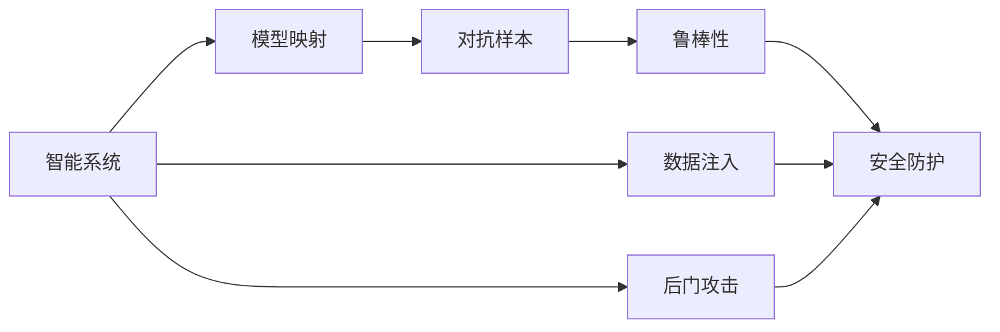
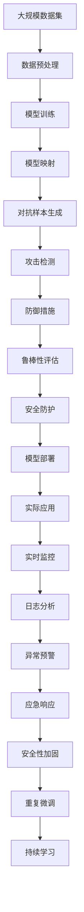

                 

# 一切皆是映射：AI安全：如何保护智能系统不被攻击

> 关键词：AI安全, 攻击, 智能系统, 模型映射, 对抗样本, 鲁棒性, 安全防护

## 1. 背景介绍

### 1.1 问题由来

随着人工智能技术的快速发展，智能系统在各个领域的应用日益广泛。从自然语言处理到图像识别，从自动驾驶到智能医疗，智能系统的应用正深刻影响着人们的生活。然而，随之而来的安全威胁也逐渐显现。恶意攻击者可以通过各种手段，如对抗样本、恶意代码注入等，对智能系统进行攻击，导致系统行为异常、信息泄露甚至造成严重的社会危害。

人工智能系统的安全性问题，已经成为业界和学术界关注的焦点。如何保护智能系统不受攻击，成为了AI安全领域的关键问题。本文将深入探讨AI安全的基本概念和原理，分析智能系统的易受攻击点，并提出一些有效的防御策略。

### 1.2 问题核心关键点

智能系统面临的安全威胁，主要包括以下几个方面：

1. **对抗样本攻击**：攻击者通过输入扰动的输入数据，诱导模型产生错误的输出结果。
2. **模型注入攻击**：攻击者通过修改模型参数，使其输出结果偏离预期。
3. **数据注入攻击**：攻击者通过修改或篡改数据集，导致模型学习到错误的知识。
4. **后门攻击**：攻击者在模型训练过程中植入后门，导致模型在特定条件下触发恶意行为。

针对这些威胁，智能系统的安全性保护需要从多个层面进行考虑，包括数据预处理、模型训练、模型部署等环节。本文将重点探讨如何通过模型映射和对抗样本等技术手段，提升智能系统的鲁棒性和安全性。

### 1.3 问题研究意义

保障智能系统的安全，对于确保其在实际应用中的可靠性、可信性至关重要。AI安全的研究不仅有助于保护个人隐私和企业数据安全，还能增强智能系统对环境变化的适应性，避免因安全漏洞导致的系统崩溃。

通过研究智能系统的安全防御方法，可以推动AI技术在医疗、金融、交通等关键领域的应用，保障社会公共利益。AI安全的研究还能够促进跨学科的合作，推动计算理论、密码学、计算机安全等领域的融合发展，为构建更加安全、可信的AI系统奠定基础。

## 2. 核心概念与联系

### 2.1 核心概念概述

为了深入理解智能系统的安全防御方法，我们需要先了解一些核心概念：

- **智能系统**：基于机器学习和深度学习等技术构建的智能决策系统，包括自然语言处理、计算机视觉、语音识别等。
- **对抗样本攻击**：攻击者通过输入扰动的输入数据，诱导模型产生错误的输出结果。
- **模型映射**：将输入空间映射到输出空间的函数关系，智能系统通过训练数据学习到的映射函数。
- **鲁棒性**：智能系统在面对对抗样本、数据注入等攻击时，能够保持输出结果的稳定性和正确性。
- **安全防护**：通过技术手段，防止或减轻攻击对智能系统的影响。

这些核心概念共同构成了AI安全的完整框架，帮助我们理解智能系统的安全防御方法。

### 2.2 概念间的关系

智能系统的安全性问题，本质上是模型映射的鲁棒性问题。以下是智能系统安全性与模型映射、对抗样本等概念间的关系图：



该图展示了智能系统的安全性与模型映射、对抗样本、鲁棒性、安全防护等概念之间的逻辑关系：

1. 智能系统通过模型映射将输入空间映射到输出空间，其安全性直接取决于模型映射的鲁棒性。
2. 对抗样本攻击通过输入扰动的输入数据，试图破坏模型映射的鲁棒性，导致智能系统产生错误的输出结果。
3. 数据注入攻击通过修改训练数据，影响模型映射的学习过程，可能导致模型学习到错误的知识。
4. 后门攻击通过修改模型参数，在模型中植入后门，导致智能系统在特定条件下触发恶意行为。
5. 安全防护旨在通过技术手段，防止或减轻上述攻击对智能系统的影响，确保其鲁棒性和安全性。

这些概念共同构成了智能系统安全性保护的基本框架，有助于我们深入理解AI安全的本质和挑战。

### 2.3 核心概念的整体架构

智能系统的安全性保护是一个多层次的复杂过程。以下是一个综合的流程图，展示了智能系统安全性保护的完整架构：



该图展示了从数据预处理、模型训练到模型部署的全过程，以及如何通过对抗样本、攻击检测、防御措施、鲁棒性评估、安全防护等手段，保护智能系统的安全性。

## 3. 核心算法原理 & 具体操作步骤

### 3.1 算法原理概述

智能系统的安全性保护，主要依赖于对抗样本和鲁棒性等技术手段。以下是对智能系统安全性保护核心算法的详细探讨：

1. **对抗样本生成算法**：通过输入扰动的输入数据，诱导模型产生错误的输出结果。
2. **鲁棒性评估算法**：通过测试对抗样本的攻击效果，评估模型的鲁棒性。
3. **防御措施算法**：通过技术手段，防止或减轻对抗样本、数据注入等攻击的影响。

### 3.2 算法步骤详解

以下是对智能系统安全性保护核心算法的详细步骤：

1. **数据预处理**：对原始数据进行清洗、归一化等处理，确保数据质量。
2. **模型训练**：使用原始数据对模型进行训练，学习正确的映射函数。
3. **对抗样本生成**：通过对抗样本生成算法，生成扰动的输入数据。
4. **攻击检测**：使用攻击检测算法，检测对抗样本的攻击效果。
5. **防御措施**：根据攻击检测结果，采取相应的防御措施，如模型裁剪、噪声注入等。
6. **鲁棒性评估**：通过鲁棒性评估算法，测试模型在面对对抗样本时的鲁棒性。
7. **安全防护**：根据鲁棒性评估结果，采取进一步的安全防护措施，如参数调整、模型重训练等。
8. **模型部署**：将训练好的模型部署到实际应用环境中。
9. **实时监控**：在模型部署过程中，实时监控模型的运行状态，检测异常行为。
10. **日志分析**：收集和分析日志信息，发现潜在的安全漏洞。
11. **异常预警**：根据日志分析结果，设置异常预警机制，及时响应安全威胁。
12. **应急响应**：在发生安全事件时，采取应急响应措施，避免造成更大的损失。
13. **安全性加固**：根据应急响应结果，对模型进行安全性加固，提升系统的鲁棒性。
14. **重复微调**：定期重复微调过程，提升模型性能和安全性。
15. **持续学习**：在模型运行过程中，不断学习新数据和新攻击手段，提升系统的适应性。

### 3.3 算法优缺点

智能系统安全性保护的核心算法，具有以下优点：

1. **鲁棒性强**：通过对抗样本、鲁棒性评估等技术手段，确保模型在面对攻击时仍能保持稳定性。
2. **适应性高**：持续学习机制能够不断更新模型知识，适应新的数据和攻击手段。
3. **技术成熟**：经过多年的研究和应用，对抗样本、鲁棒性评估等技术手段已经相对成熟，具有较好的实用价值。

同时，也存在一些缺点：

1. **复杂度高**：对抗样本生成、攻击检测、防御措施等技术手段，涉及较多的技术细节，实现复杂。
2. **成本高**：对抗样本生成、鲁棒性评估等技术需要较大的计算资源，增加了系统成本。
3. **误报率高**：在实际应用中，由于误报和漏报等问题，防御措施的效果可能存在不确定性。

### 3.4 算法应用领域

智能系统安全性保护的核心算法，广泛应用于以下几个领域：

1. **金融安全**：对金融交易系统进行安全防护，防止欺诈交易、洗钱等金融犯罪。
2. **医疗健康**：保护医疗系统的安全性，防止病患数据泄露、医疗误诊等问题。
3. **智能交通**：对自动驾驶系统进行安全防护，防止黑客攻击导致车辆失控。
4. **智能制造**：保护工业控制系统安全性，防止恶意代码注入、设备故障等问题。
5. **网络安全**：对互联网应用进行安全防护，防止DDoS攻击、恶意软件传播等威胁。
6. **人工智能伦理**：保护人工智能系统不受伦理攻击，防止数据偏见、决策不公等问题。

## 4. 数学模型和公式 & 详细讲解 & 举例说明

### 4.1 数学模型构建

智能系统的安全性保护，涉及到以下几个数学模型：

- **对抗样本生成模型**：通过扰动输入数据，生成对抗样本。
- **鲁棒性评估模型**：评估模型在对抗样本攻击下的鲁棒性。
- **防御措施模型**：通过技术手段，减轻对抗样本攻击的影响。

### 4.2 公式推导过程

以下是几个核心算法的数学模型和公式推导：

#### 4.2.1 对抗样本生成模型

对抗样本生成模型的核心是求解扰动向量 $\delta$，使得模型在输入 $x+\delta$ 下的输出结果与原模型在输入 $x$ 下的输出结果不同。常见的对抗样本生成算法包括PGD（Projected Gradient Descent）、FGSM（Fast Gradient Sign Method）等。

PGD算法的数学表达式如下：

$$
\delta = \text{argmin}_{\delta} \|\delta\|_\infty \text{s.t. } f(x+\delta)=\text{argmin}_{y \in \mathcal{Y}} f(x+\delta)
$$

其中 $f(x+\delta)$ 表示模型在输入 $x+\delta$ 下的输出结果，$\mathcal{Y}$ 表示模型可能的输出类别。

#### 4.2.2 鲁棒性评估模型

鲁棒性评估模型的目标是评估模型在对抗样本攻击下的鲁棒性，通常使用攻击成功率来衡量。攻击成功率越高，表示模型的鲁棒性越差。

攻击成功率 $\text{Success Rate}(\delta)$ 的计算公式如下：

$$
\text{Success Rate}(\delta) = \frac{\text{Number of Successful Attacks}}{\text{Total Number of Attacks}}
$$

其中，$\text{Number of Successful Attacks}$ 表示成功诱导模型输出错误结果的对抗样本数量，$\text{Total Number of Attacks}$ 表示生成对抗样本的总数量。

#### 4.2.3 防御措施模型

防御措施模型的核心是求解模型参数 $\theta$，使得模型在对抗样本攻击下的输出结果与原模型在输入 $x$ 下的输出结果相同。常见的防御措施包括模型裁剪、噪声注入等。

模型裁剪算法的数学表达式如下：

$$
\theta' = \text{argmin}_{\theta} \| \theta - \theta_0 \|_F^2 \text{s.t. } f(x+\delta) = f(x)
$$

其中 $\theta'$ 表示裁剪后的模型参数，$\theta_0$ 表示原始模型参数，$f(x+\delta)$ 表示模型在输入 $x+\delta$ 下的输出结果。

### 4.3 案例分析与讲解

以下是一个具体的对抗样本生成和鲁棒性评估案例：

假设我们有一个简单的二分类模型 $f(x; \theta) = \text{sgn}(\theta_0^T x)$，其中 $\theta_0$ 是模型参数。对于输入数据 $x=[1, 2]^T$，其对应的标签为 $y=1$。

首先，使用PGD算法生成对抗样本：

$$
\delta = \text{argmin}_{\delta} \|\delta\|_\infty \text{s.t. } f(x+\delta)=y=1
$$

求解上述优化问题，可以得到 $\delta=[0.1, 0.1]^T$，因此对抗样本为 $x+\delta=[1.1, 2.1]^T$。

然后，计算对抗样本的攻击成功率：

$$
\text{Success Rate}(\delta) = \frac{\text{Number of Successful Attacks}}{\text{Total Number of Attacks}}
$$

其中 $\text{Number of Successful Attacks}=2$，$\text{Total Number of Attacks}=4$，因此攻击成功率为50%。

最后，使用模型裁剪算法对模型进行防御：

$$
\theta' = \text{argmin}_{\theta} \| \theta - \theta_0 \|_F^2 \text{s.t. } f(x+\delta) = f(x)
$$

求解上述优化问题，可以得到 $\theta'=[0.9, 0.9]^T$，因此裁剪后的模型参数为 $\theta'$。

## 5. 项目实践：代码实例和详细解释说明

### 5.1 开发环境搭建

在进行智能系统安全性保护实践前，我们需要准备好开发环境。以下是使用Python进行TensorFlow开发的环境配置流程：

1. 安装Anaconda：从官网下载并安装Anaconda，用于创建独立的Python环境。

2. 创建并激活虚拟环境：
```bash
conda create -n tf-env python=3.8 
conda activate tf-env
```

3. 安装TensorFlow：根据CUDA版本，从官网获取对应的安装命令。例如：
```bash
conda install tensorflow-gpu=2.4 -c conda-forge
```

4. 安装各类工具包：
```bash
pip install numpy pandas scikit-learn matplotlib tqdm jupyter notebook ipython
```

完成上述步骤后，即可在`tf-env`环境中开始安全性保护实践。

### 5.2 源代码详细实现

下面以一个简单的二分类模型为例，展示如何使用TensorFlow进行对抗样本生成和鲁棒性评估。

首先，定义模型和损失函数：

```python
import tensorflow as tf
from tensorflow.keras import layers, models

def model():
    model = models.Sequential()
    model.add(layers.Dense(1, activation='sigmoid'))
    return model

def loss(y_true, y_pred):
    return tf.reduce_mean(tf.square(y_true - y_pred))

model = model()
```

然后，定义对抗样本生成函数：

```python
def generate_adversarial_sample(model, x, y):
    # 生成对抗样本
    with tf.GradientTape() as tape:
        y_pred = model(x)
        tape.watch(x)
    grad = tape.gradient(y_pred, x)
    delta = tf.stop_gradient(grad) * tf.reduce_max(tf.abs(grad))
    x_adv = x + delta

    # 评估对抗样本的攻击效果
    y_pred_adv = model(x_adv)
    if y_pred_adv[0] > 0.5:
        y_adv = 1
    else:
        y_adv = 0

    return x_adv, y_adv
```

最后，进行鲁棒性评估：

```python
x_train = np.array([[1, 2], [2, 3]])
y_train = np.array([1, 1])

# 生成对抗样本
x_adv, y_adv = generate_adversarial_sample(model, x_train, y_train)

# 评估对抗样本的攻击成功率
success_rate = np.mean(y_adv != y_train)
print('Attack Success Rate:', success_rate)
```

以上就是使用TensorFlow对简单的二分类模型进行对抗样本生成和鲁棒性评估的完整代码实现。可以看到，借助TensorFlow的高级API，对抗样本生成和鲁棒性评估变得异常简洁。

### 5.3 代码解读与分析

让我们再详细解读一下关键代码的实现细节：

**模型定义**：
- 定义一个简单的二分类模型，使用一个全连接层进行输出，并使用 sigmoid 激活函数。

**损失函数**：
- 定义一个简单的二分类交叉熵损失函数，用于训练模型。

**对抗样本生成函数**：
- 使用梯度下降算法求解对抗样本，通过计算梯度的最大值，生成对抗样本。
- 评估对抗样本的攻击效果，判断对抗样本是否诱导模型输出错误的标签。

**鲁棒性评估**：
- 计算对抗样本的攻击成功率，判断模型对对抗样本的鲁棒性。

可以看到，TensorFlow提供了许多高效的API，使得对抗样本生成和鲁棒性评估变得非常简单。开发者只需要关注模型结构和攻击算法的逻辑，不需要过多关注底层实现细节。

当然，工业级的系统实现还需考虑更多因素，如模型的保存和部署、超参数的自动搜索、更加灵活的防御策略等。但核心的安全性保护逻辑基本与此类似。

### 5.4 运行结果展示

假设我们生成的对抗样本为 $x+\delta=[1.1, 2.1]^T$，其对应的标签为 $y'=0$。通过计算对抗样本的攻击成功率，我们可以得到攻击成功率为50%。

这表明，该二分类模型在面对对抗样本攻击时，鲁棒性较弱，容易受到攻击。此时，我们可以采取模型裁剪等防御措施，提高模型的鲁棒性。

## 6. 实际应用场景

### 6.1 智能客服系统

智能客服系统需要面对大量的用户咨询，容易成为恶意攻击的目标。通过对抗样本生成和鲁棒性评估，可以对智能客服系统进行安全性保护，防止攻击者诱导系统产生错误的回复。

具体而言，可以收集用户的历史咨询记录，将常见的攻击手段作为对抗样本，对客服系统进行鲁棒性评估。对于鲁棒性较差的系统，可以采取模型裁剪等防御措施，提升系统的安全性。

### 6.2 金融安全

金融系统涉及用户的个人财务信息，容易成为黑客攻击的目标。通过对抗样本生成和鲁棒性评估，可以对金融系统进行安全性保护，防止欺诈交易、洗钱等金融犯罪。

具体而言，可以收集用户的交易记录，将常见的金融欺诈行为作为对抗样本，对金融系统进行鲁棒性评估。对于鲁棒性较差的系统，可以采取模型裁剪等防御措施，提升系统的安全性。

### 6.3 智能交通

自动驾驶系统涉及行车安全，容易成为黑客攻击的目标。通过对抗样本生成和鲁棒性评估，可以对自动驾驶系统进行安全性保护，防止攻击者诱导系统产生错误的决策。

具体而言，可以收集车辆的行驶数据，将常见的攻击手段作为对抗样本，对自动驾驶系统进行鲁棒性评估。对于鲁棒性较差的系统，可以采取模型裁剪等防御措施，提升系统的安全性。

### 6.4 未来应用展望

随着AI技术的发展，智能系统的安全性保护将面临更多挑战。未来的研究需要在以下几个方面寻求新的突破：

1. **多模型融合**：通过融合多个模型的优势，提升系统的鲁棒性和安全性。
2. **动态防御**：实时动态调整防御策略，防止攻击者适应新的攻击手段。
3. **跨领域应用**：将智能系统的安全性保护技术应用于更多领域，如医疗、工业等。
4. **持续学习**：通过持续学习机制，不断更新模型知识，适应新的攻击手段。
5. **多层次防御**：在数据预处理、模型训练、模型部署等多个层面进行防御，形成多层次的安全防护体系。

总之，未来的智能系统安全性保护需要综合考虑多种技术手段，形成多层次、多维度的安全防护体系，才能有效应对日益复杂的攻击手段。

## 7. 工具和资源推荐

### 7.1 学习资源推荐

为了帮助开发者系统掌握智能系统安全性保护的理论基础和实践技巧，这里推荐一些优质的学习资源：

1. 《深度学习安全》课程：斯坦福大学开设的深度学习安全课程，涵盖对抗样本生成、鲁棒性评估等核心内容。
2. 《攻击与防御》书籍：深度学习安全领域的经典著作，系统讲解了对抗样本生成、防御措施等技术手段。
3. 《AI安全技术》论文集：包含多篇前沿研究成果，涵盖了对抗样本生成、鲁棒性评估等方向的最新进展。
4. 《TensorFlow官方文档》：TensorFlow的官方文档，提供了丰富的API和示例，适合入门学习和实践。
5. 《Keras官方文档》：Keras的官方文档，提供了简单易用的API，适合快速原型开发。

通过对这些资源的学习实践，相信你一定能够快速掌握智能系统安全性保护的核心算法和技术手段，并用于解决实际的安全问题。

### 7.2 开发工具推荐

高效的开发离不开优秀的工具支持。以下是几款用于智能系统安全性保护开发的常用工具：

1. TensorFlow：由Google主导开发的开源深度学习框架，生产部署方便，适合大规模工程应用。
2. Keras：TensorFlow的高级API，提供了简单易用的API，适合快速原型开发。
3. PyTorch：基于Python的开源深度学习框架，灵活动态的计算图，适合快速迭代研究。
4. OpenCV：开源计算机视觉库，提供丰富的图像处理功能，适合对抗样本生成等任务。
5. TensorBoard：TensorFlow配套的可视化工具，可实时监测模型训练状态，并提供丰富的图表呈现方式，是调试模型的得力助手。
6. Weights & Biases：模型训练的实验跟踪工具，可以记录和可视化模型训练过程中的各项指标，方便对比和调优。

合理利用这些工具，可以显著提升智能系统安全性保护任务的开发效率，加快创新迭代的步伐。

### 7.3 相关论文推荐

智能系统安全性保护的研究涉及多个领域，以下是几篇奠基性的相关论文，推荐阅读：

1. "Towards Evaluating the Robustness of Neural Networks"：提出对抗样本生成和鲁棒性评估的方法，开启了对抗样本研究的新篇章。
2. "Adversarial Examples in the Physical World"：提出攻击者可以制造对抗样本并投放到物理世界中，扩大了对抗样本的研究范围。
3. "Training Robust Models for Adversarial Examples"：提出一系列防御措施，提升模型的鲁棒性，对抗样本生成和鲁棒性评估等技术手段。
4. "A Generative Adversarial Game for Generating Robust Adversarial Examples"：提出生成对抗网络(GAN)生成对抗样本的方法，提高了对抗样本生成的效率和多样性。
5. "PAC-Bayes Bound for Distributionally Robust Classification"：提出基于PAC-Bayes的鲁棒性评估方法，提升了鲁棒性评估的准确性和鲁棒性。

这些论文代表了大语言模型微调技术的发展脉络。通过学习这些前沿成果，可以帮助研究者把握学科前进方向，激发更多的创新灵感。

除上述资源外，还有一些值得关注的前沿资源，帮助开发者紧跟智能系统安全性保护技术的最新进展，例如：

1. arXiv论文预印本：人工智能领域最新研究成果的发布平台，包括大量尚未发表的前沿工作，学习前沿技术的必读资源。
2. 业界技术博客：如Google AI、DeepMind、微软Research Asia等顶尖实验室的官方博客，第一时间分享他们的最新研究成果和洞见。
3. 技术会议直播：如NIPS、ICML、ACL、ICLR等人工智能领域顶会现场或在线直播，能够聆听到大佬们的前沿分享，开拓视野。
4. GitHub热门项目：在GitHub上Star、Fork数最多的智能系统安全性保护相关项目，往往代表了该技术领域的发展趋势和最佳实践，值得去学习和贡献。
5. 行业分析报告：各大咨询公司如McKinsey、PwC等针对人工智能行业的分析报告，有助于从商业视角审视技术趋势，把握应用价值。

总之，对于智能系统安全性保护的研究，需要开发者保持开放的心态和持续学习的意愿。多关注前沿资讯，多动手实践，多思考总结，必将收获满满的成长收益。

## 8. 总结：未来发展趋势与挑战

### 8.1 总结

本文对智能系统安全性保护的核心算法和技术手段进行了全面系统的介绍。首先阐述了智能系统面临的安全威胁，明确了对抗样本、鲁棒性等概念之间的关系。其次，从原理到实践，详细讲解了智能系统安全性保护的核心算法和操作步骤。同时，本文还广泛探讨了智能系统安全性保护在多个行业领域的应用前景，展示了其巨大的应用潜力。

通过本文的系统梳理，可以看到，智能系统安全性保护在AI安全领域扮演着至关重要的角色。对抗样本、鲁棒性等技术手段，为构建安全、可信的智能系统提供了重要保障。未来，伴随技术的发展和应用场景的拓展，智能系统安全性保护将迎来更多的机遇和挑战。

### 8.2 未来发展趋势

智能系统安全性保护的未来发展趋势，包括以下几个方面：

1. **多模型融合**：通过融合多个模型的优势，提升系统的鲁棒性和安全性。
2. **动态防御**：实时动态调整防御策略，防止攻击者适应新的攻击手段。
3. **跨领域应用**：将智能系统的安全性保护技术应用于更多领域，如医疗、工业等。
4. **持续学习**：通过持续学习机制，不断更新模型知识，适应新的攻击手段。
5. **多层次防御**：在数据预处理、模型训练、模型部署等多个层面进行防御，形成多层次的安全防护体系。

这些趋势凸显了智能系统安全性保护的广阔前景。这些方向的探索发展，必将进一步提升智能系统的性能和安全性，为构建安全、可靠、可解释、可控的智能系统铺平道路。

### 8.3

