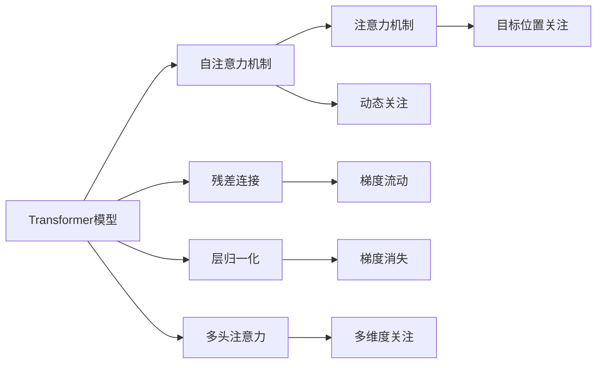
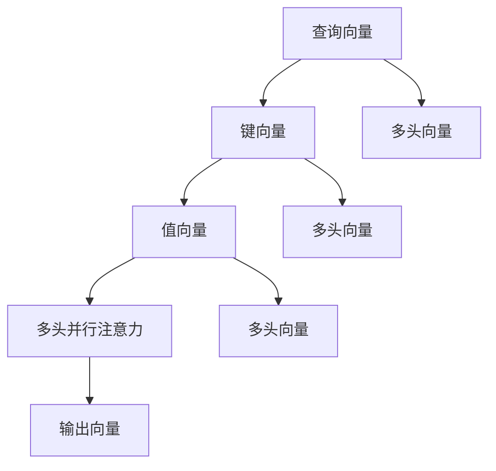
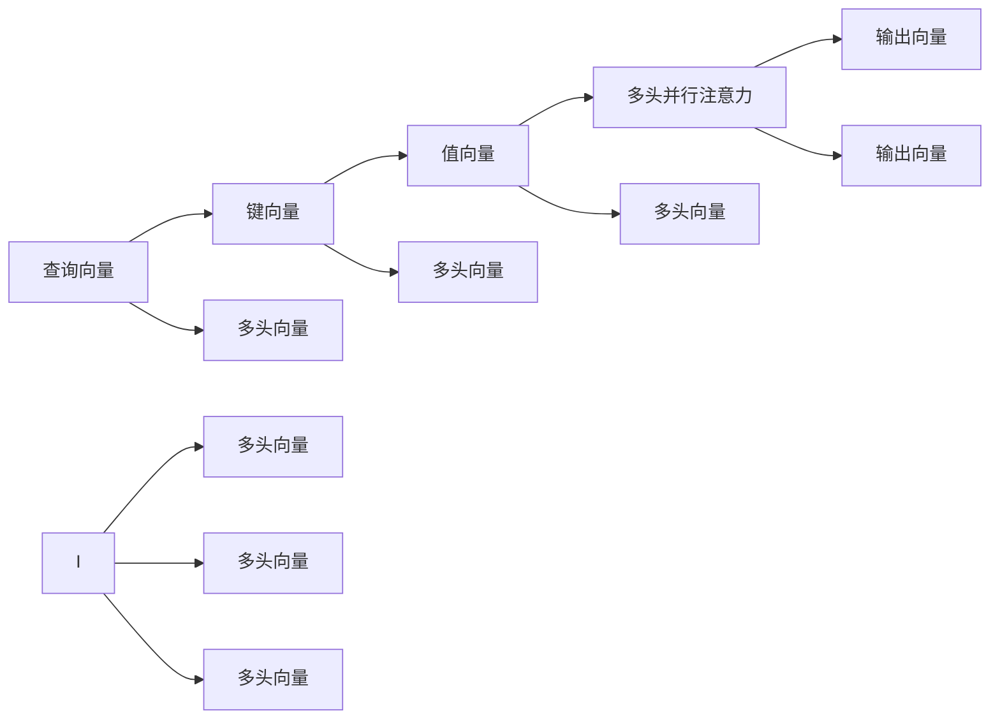
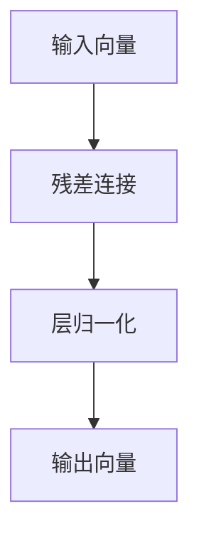
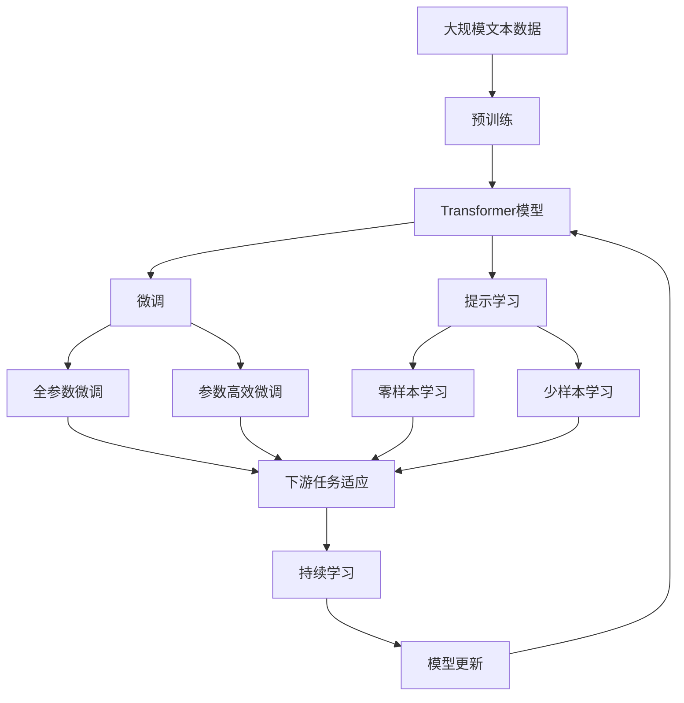

                 

# 一切皆是映射：Transformer模型深度探索

> 关键词：Transformer模型,自注意力机制,注意力机制,神经网络,深度学习

## 1. 背景介绍

### 1.1 问题由来
随着深度学习技术的迅猛发展，传统的卷积神经网络(CNN)和循环神经网络(RNN)在处理自然语言处理(NLP)任务时，逐渐显现出性能瓶颈。这些模型往往难以充分利用文本中的长距离依赖关系，导致在理解和生成文本时表现欠佳。为了克服这些问题，研究者们开始探索新的模型架构，其中Transformer模型因其独特的自注意力机制，逐渐成为NLP领域的新宠。

Transformer模型最初由Vaswani等人提出，用于机器翻译任务，并取得了显著的效果。它抛弃了传统的卷积和循环结构，转而使用自注意力机制来捕捉文本中的全局依赖关系，从而实现了对NLP任务的突破性应用。Transformer模型不仅在机器翻译、文本分类、情感分析等任务上表现优异，还因其灵活性被广泛应用于对话生成、信息检索、代码生成等场景。

### 1.2 问题核心关键点
Transformer模型之所以能够取得卓越的性能，主要归功于其创新的自注意力机制。该机制允许模型在处理文本时，能够动态地关注不同位置的词语，从而捕捉到全局的依赖关系。Transformer模型的结构简单，但原理深刻，其核心思想可以总结为以下几点：

- 序列化处理：将文本序列化为一系列向量，每个向量表示一个词语或子词。
- 自注意力机制：允许模型在序列的每个位置，动态地计算出与该位置最相关的其他位置，从而捕捉到文本中的全局依赖关系。
- 残差连接和层归一化：引入残差连接和层归一化，使得模型在处理深层网络时，仍能保持稳定的梯度流动。
- 多头注意力：通过多头并行地计算不同维度的注意力，进一步增强模型的表达能力。

这些核心思想共同构成了Transformer模型的框架，使得其在处理长距离依赖关系、捕捉文本中的上下文信息方面表现出色。Transformer模型及其变种，已经成为了现代NLP研究的主流模型，也是深度学习领域的一个重要分支。

### 1.3 问题研究意义
研究Transformer模型，对于拓展深度学习在NLP领域的应用范围，提升模型性能，加速NLP技术的产业化进程，具有重要意义：

1. 降低应用开发成本。Transformer模型已经在大规模预训练语料上进行了广泛学习，可以快速微调成各类NLP任务，减少从头开发所需的数据、计算和人力等成本投入。
2. 提升模型效果。Transformer模型在文本理解、生成、分类等任务上已经刷新了多项最先进性能指标，展现了其强大的语言理解和生成能力。
3. 加速开发进度。Transformer模型的高效推理机制和灵活的架构，使得开发人员可以更快地进行任务适配，缩短开发周期。
4. 带来技术创新。Transformer模型的提出，推动了深度学习在NLP领域的新一轮研究热潮，催生了如自注意力机制、多头注意力等前沿研究方向。
5. 赋能产业升级。Transformer模型及其变种已经被广泛应用于各种NLP应用中，如智能客服、机器翻译、问答系统等，为传统行业数字化转型升级提供新的技术路径。

## 2. 核心概念与联系

### 2.1 核心概念概述

为更好地理解Transformer模型的核心概念，本节将介绍几个密切相关的核心概念：

- Transformer模型：一种基于自注意力机制的神经网络架构，用于处理序列数据。通过多头并行计算注意力，使得模型能够在处理长文本序列时，自动关注文本中的全局依赖关系。
- 自注意力机制：一种用于计算序列中每个位置与其他位置的相关性的机制。自注意力机制允许模型在处理文本时，能够动态地关注不同位置的词语，从而捕捉到文本中的全局依赖关系。
- 注意力机制：一种用于计算序列中每个位置与其他位置的相关性的机制。与自注意力机制不同的是，注意力机制通常只关注目标位置与源位置之间的依赖关系。
- 残差连接和层归一化：一种用于稳定深层网络梯度流动和加速收敛的技术。残差连接允许模型跳过部分网络层，层归一化能够抑制梯度消失问题。
- 多头注意力：一种通过并行计算多个维度的注意力，进一步增强模型表达能力的机制。多头注意力允许模型同时关注不同维度的信息，提升模型的表征能力。

这些核心概念之间的逻辑关系可以通过以下Mermaid流程图来展示：



这个流程图展示了大语言模型和Transformer模型的核心概念及其之间的关系：

1. Transformer模型基于自注意力机制，捕捉文本中的全局依赖关系。
2. 自注意力机制与注意力机制类似，但允许模型动态关注不同位置的词语。
3. 残差连接和层归一化保证了深层网络的稳定梯度流动。
4. 多头注意力通过并行计算多个维度的注意力，进一步增强了模型的表达能力。
5. 动态关注和目标位置关注共同构成了Transformer模型的注意力机制。

这些核心概念共同构成了Transformer模型的框架，使其能够在各种NLP任务中展现出卓越的性能。通过理解这些核心概念，我们可以更好地把握Transformer模型的工作原理和优化方向。

### 2.2 概念间的关系

这些核心概念之间存在着紧密的联系，形成了Transformer模型的完整生态系统。下面我通过几个Mermaid流程图来展示这些概念之间的关系。

#### 2.2.1 自注意力机制的原理



这个流程图展示了自注意力机制的原理：通过多头并行计算注意力，模型可以同时关注不同位置的词语，从而捕捉到文本中的全局依赖关系。

#### 2.2.2 多头注意力的工作流程



这个流程图展示了多头注意力的工作流程：通过并行计算多个维度的注意力，进一步增强模型的表达能力。

#### 2.2.3 残差连接和层归一化的作用



这个流程图展示了残差连接和层归一化的作用：通过引入残差连接和层归一化，模型在处理深层网络时，仍能保持稳定的梯度流动。

### 2.3 核心概念的整体架构

最后，我们用一个综合的流程图来展示这些核心概念在大语言模型微调过程中的整体架构：



这个综合流程图展示了从预训练到微调，再到持续学习的完整过程。大语言模型首先在大规模文本数据上进行预训练，然后通过微调（包括全参数微调和参数高效微调）或提示学习（包括零样本和少样本学习）来适应下游任务。最后，通过持续学习技术，模型可以不断更新和适应新的任务和数据。 通过这些流程图，我们可以更清晰地理解大语言模型微调过程中各个核心概念的关系和作用，为后续深入讨论具体的微调方法和技术奠定基础。

## 3. 核心算法原理 & 具体操作步骤
### 3.1 算法原理概述

Transformer模型基于自注意力机制，通过多头并行计算注意力，使得模型能够在处理长文本序列时，自动关注文本中的全局依赖关系。其核心思想可以总结如下：

1. 将文本序列化为一系列向量，每个向量表示一个词语或子词。
2. 通过多头并行计算注意力，捕捉文本中的全局依赖关系。
3. 引入残差连接和层归一化，保持梯度流动稳定。
4. 采用自注意力机制，动态关注不同位置的词语。
5. 通过多头并行计算注意力，进一步增强模型的表达能力。

Transformer模型主要包括编码器(Encoder)和解码器(Decoder)两部分，分别用于对输入序列进行编码和生成输出序列。编码器由多个Transformer层组成，每个层包含自注意力子层和前馈神经网络子层。解码器同样由多个Transformer层组成，每个层包含自注意力子层、多头注意力子层和前馈神经网络子层。

### 3.2 算法步骤详解

Transformer模型的训练过程可以分为以下几个关键步骤：

**Step 1: 准备预训练模型和数据集**
- 选择合适的预训练语言模型 $M_{\theta}$ 作为初始化参数，如BERT、GPT等。
- 准备下游任务 $T$ 的标注数据集 $D=\{(x_i,y_i)\}_{i=1}^N, x_i \in \mathcal{X}, y_i \in \mathcal{Y}$。其中 $\mathcal{X}$ 为输入空间，$\mathcal{Y}$ 为输出空间。

**Step 2: 添加任务适配层**
- 根据任务类型，在预训练模型顶层设计合适的输出层和损失函数。
- 对于分类任务，通常在顶层添加线性分类器和交叉熵损失函数。
- 对于生成任务，通常使用语言模型的解码器输出概率分布，并以负对数似然为损失函数。

**Step 3: 设置训练超参数**
- 选择合适的优化算法及其参数，如 AdamW、SGD 等，设置学习率、批大小、迭代轮数等。
- 设置正则化技术及强度，包括权重衰减、Dropout、Early Stopping等。
- 确定冻结预训练参数的策略，如仅微调顶层，或全部参数都参与微调。

**Step 4: 执行梯度训练**
- 将训练集数据分批次输入模型，前向传播计算损失函数。
- 反向传播计算参数梯度，根据设定的优化算法和学习率更新模型参数。
- 周期性在验证集上评估模型性能，根据性能指标决定是否触发 Early Stopping。
- 重复上述步骤直到满足预设的迭代轮数或 Early Stopping 条件。

**Step 5: 测试和部署**
- 在测试集上评估微调后模型 $M_{\hat{\theta}}$ 的性能，对比微调前后的精度提升。
- 使用微调后的模型对新样本进行推理预测，集成到实际的应用系统中。
- 持续收集新的数据，定期重新微调模型，以适应数据分布的变化。

以上是Transformer模型进行微调的完整流程。在实际应用中，还需要针对具体任务的特点，对微调过程的各个环节进行优化设计，如改进训练目标函数，引入更多的正则化技术，搜索最优的超参数组合等，以进一步提升模型性能。

### 3.3 算法优缺点

Transformer模型在NLP领域取得了显著的性能提升，但也存在一些局限性：

**优点：**
1. 处理长距离依赖关系能力强。自注意力机制使得Transformer模型能够自动关注文本中的全局依赖关系。
2. 结构简单，易于实现。Transformer模型相比于RNN和CNN等模型，结构更加简洁。
3. 并行计算效率高。Transformer模型可以通过并行计算多头注意力，提高计算效率。
4. 效果优异。在多项NLP任务上，Transformer模型已经刷新了最先进的性能指标。

**缺点：**
1. 依赖预训练数据。Transformer模型的效果很大程度上取决于预训练数据的质量和数量。
2. 计算资源消耗大。Transformer模型的参数量较大，训练和推理过程中需要大量的计算资源。
3. 可解释性不足。Transformer模型的决策过程通常缺乏可解释性，难以对其推理逻辑进行分析和调试。
4. 依赖大规模训练数据。Transformer模型的参数量较大，需要大量训练数据来避免过拟合。

尽管存在这些局限性，但就目前而言，Transformer模型已成为NLP领域的重要模型，其创新的自注意力机制为NLP任务提供了新的解决方案。未来相关研究的重点在于如何进一步优化模型架构，降低计算资源消耗，提高模型的可解释性，以及增强模型的迁移能力等。

### 3.4 算法应用领域

Transformer模型已经广泛应用于NLP领域的诸多任务，如文本分类、命名实体识别、问答系统、机器翻译、对话系统等。这些任务通常要求模型能够捕捉文本中的全局依赖关系，并通过上下文信息进行推理和生成。

- 文本分类：如情感分析、主题分类、意图识别等。通过微调使模型学习文本-标签映射。
- 命名实体识别：识别文本中的人名、地名、机构名等特定实体。通过微调使模型掌握实体边界和类型。
- 问答系统：对自然语言问题给出答案。将问题-答案对作为微调数据，训练模型学习匹配答案。
- 机器翻译：将源语言文本翻译成目标语言。通过微调使模型学习语言-语言映射。
- 对话系统：使机器能够与人自然对话。将多轮对话历史作为上下文，微调模型进行回复生成。

除了上述这些经典任务外，Transformer模型还被创新性地应用到更多场景中，如可控文本生成、常识推理、代码生成、数据增强等，为NLP技术带来了全新的突破。随着预训练模型和微调方法的不断进步，相信NLP技术将在更广阔的应用领域大放异彩。

## 4. 数学模型和公式 & 详细讲解 & 举例说明

### 4.1 数学模型构建

Transformer模型通常由编码器(Encoder)和解码器(Decoder)两部分组成。以下以机器翻译任务为例，对Transformer模型的数学模型进行详细讲解。

记输入序列为 $x=\{x_1, x_2, ..., x_n\}$，输出序列为 $y=\{y_1, y_2, ..., y_n\}$，其中 $x_i, y_i \in \mathcal{V}$。编码器接收输入序列 $x$，通过多层Transformer层，将每个词语 $x_i$ 转换为一个向量 $v_i$，然后通过多头并行计算注意力，得到编码器输出序列 $Z=\{z_1, z_2, ..., z_n\}$。解码器接收输出序列 $y$，通过多层Transformer层，将每个词语 $y_i$ 转换为一个向量 $u_i$，然后通过多头并行计算注意力，得到解码器输出序列 $U=\{u_1, u_2, ..., u_n\}$。最后，通过线性层和softmax函数，得到最终的翻译结果。

### 4.2 公式推导过程

Transformer模型的计算过程可以总结为以下几个关键步骤：

1. 将输入序列 $x$ 和输出序列 $y$ 转换为向量表示。
2. 在编码器中，计算多头并行注意力，得到编码器输出序列 $Z$。
3. 在解码器中，计算多头并行注意力，得到解码器输出序列 $U$。
4. 通过线性层和softmax函数，得到最终的翻译结果。

以下是Transformer模型的详细公式推导过程：

#### 4.2.1 输入序列的表示

输入序列 $x=\{x_1, x_2, ..., x_n\}$ 中的每个词语 $x_i$ 通过嵌入层转化为一个向量 $e_i \in \mathbb{R}^d$。然后，通过位置编码向量 $p_i \in \mathbb{R}^d$，将每个向量 $e_i$ 转换为一个新的向量 $v_i \in \mathbb{R}^d$。其中，位置编码向量 $p_i$ 用于捕捉不同位置词语的依赖关系。

$$
v_i = e_i + p_i
$$

#### 4.2.2 多头并行注意力

在编码器中，计算多头并行注意力需要计算查询向量 $Q$、键向量 $K$ 和值向量 $V$。查询向量 $Q$ 和键向量 $K$ 是相同的，值向量 $V$ 与 $K$ 不同。通过计算每个位置的注意力权重 $\alpha$，得到加权和向量 $O$，最终得到编码器输出序列 $Z$。

$$
Q = v_i W_Q^T, K = v_i W_K^T, V = v_i W_V^T
$$

$$
\alpha = \text{softmax}(\frac{QK^T}{\sqrt{d_k}})
$$

$$
O = \alpha V
$$

$$
z_i = \text{LayerNorm}(O + v_i)
$$

其中，$W_Q^T$、$W_K^T$ 和 $W_V^T$ 是线性变换矩阵，$d_k$ 是键向量的维度，LayerNorm 是归一化层，用于稳定梯度流动。

#### 4.2.3 前馈神经网络

在Transformer层中，多头并行注意力之后，还需要通过前馈神经网络进行非线性变换。前馈神经网络通常由两个全连接层组成，用于捕捉非线性关系。

$$
f(v_i) = \text{LayerNorm}(v_i + \text{relu}(v_i W_1 + b_1) W_2 + b_2)
$$

其中，$W_1$ 和 $W_2$ 是线性变换矩阵，$b_1$ 和 $b_2$ 是偏置向量，LayerNorm 是归一化层。

#### 4.2.4 解码器的多头并行注意力

解码器的多头并行注意力与编码器的类似，但多了一个目标位置 $j$ 的注意力权重 $\beta$。通过计算每个位置的注意力权重 $\beta$，得到加权和向量 $G$，最后得到解码器输出序列 $U$。

$$
Q = u_i W_Q^T, K = u_i W_K^T, V = u_i W_V^T
$$

$$
\beta = \text{softmax}(\frac{QK^T}{\sqrt{d_k}})
$$

$$
G = \beta V
$$

$$
u_i = \text{LayerNorm}(G + u_i)
$$

#### 4.2.5 解码器的前馈神经网络

解码器的前馈神经网络与编码器的类似，用于捕捉非线性关系。

$$
f(u_i) = \text{LayerNorm}(u_i + \text{relu}(u_i W_1 + b_1) W_2 + b_2)
$$

#### 4.2.6 输出序列

通过线性层和softmax函数，将解码器输出序列 $U$ 转换为最终的翻译结果 $y$。

$$
y_i = \text{softmax}(U_i W_O^T + b_O)
$$

其中，$W_O^T$ 是线性变换矩阵，$b_O$ 是偏置向量。

### 4.3 案例分析与讲解

以机器翻译任务为例，Transformer模型在输入序列和输出序列上进行了多层并行计算，使得模型能够在处理长文本序列时，自动关注文本中的全局依赖关系。同时，通过多头并行计算注意力和前馈神经网络，进一步增强了模型的表达能力。

Transformer模型在机器翻译任务上取得了显著的性能提升，主要得益于其自注意力机制和多头并行计算的强大能力。自注意力机制允许模型动态关注不同位置的词语，从而捕捉到文本中的全局依赖关系。多头并行计算进一步增强了模型的表达能力，使其能够在处理长文本序列时，保持稳定的梯度流动和高效的计算速度。

## 5. 项目实践：代码实例和详细解释说明

### 5.1 开发环境搭建

在进行Transformer模型的实践前，我们需要准备好开发环境。以下是使用Python进行TensorFlow开发的环境配置流程：

1. 安装Anaconda：从官网下载并安装Anaconda，用于创建独立的Python环境。

2. 创建并激活虚拟环境：
```bash
conda create -n tensorflow-env python=3.8 
conda activate tensorflow-env
```

3. 安装TensorFlow：根据CUDA版本，从官网获取对应的安装命令。例如：
```bash
conda install tensorflow tensorflow==2.7 -c tensorflow -c conda-forge
```

4. 安装各类工具包：
```bash
pip install numpy pandas scikit-learn matplotlib tqdm jupyter notebook ipython
```

完成上述步骤后，即可在`tensorflow-env`环境中开始Transformer模型的实践。

### 5.2 源代码详细实现

下面我们以机器翻译任务为例，给出使用TensorFlow对Transformer模型进行微调的代码实现。

首先，定义输入和输出序列的编码器表示函数：

```python
from tensorflow.keras.layers import Input, Dense, LayerNorm, Embedding
from tensorflow.keras.layers import Add, Concatenate
from tensorflow.keras.layers import MultiHeadAttention, Dropout
from tensorflow.keras.layers import Dense, Activation
from tensorflow.keras.layers import InputLayer

def encoder(input_tensor, embed_dim, num_heads, ffn_units):
    """定义编码器"""
    input_tensor = Embedding(input_dim=VOCAB_SIZE, output_dim=embed_dim)(input_tensor)
    input_tensor = MultiHeadAttention(num_heads=num_heads, key_dim=embed_dim // num_heads)(input_tensor, input_tensor)
    input_tensor = Add()([input_tensor, input_tensor])
    input_tensor = LayerNorm()(input_tensor)
    input_tensor = Dense(ffn_units)(input_tensor)
    input_tensor = Activation('relu')(input_tensor)
    input_tensor = Dense(embed_dim)(input_tensor)
    input_tensor = LayerNorm()(input_tensor)
    input_tensor = Add()([input_tensor, input_tensor])
    return input_tensor

def decoder(input_tensor, embed_dim, num_heads, ffn_units):
    """定义解码器"""
    input_tensor = Embedding(input_dim=VOCAB_SIZE, output_dim=embed_dim)(input_tensor)
    input_tensor = MultiHeadAttention(num_heads=num_heads, key_dim=embed_dim // num_heads)(input_tensor, input_tensor)
    input_tensor = Add()([input_tensor, input_tensor])
    input_tensor = LayerNorm()(input_tensor)
    input_tensor = Dense(ffn_units)(input_tensor)
    input_tensor = Activation('relu')(input_tensor)
    input_tensor = Dense(embed_dim)(input_tensor)
    input_tensor = LayerNorm()(input_tensor)
    input_tensor = Add()([input_tensor, input_tensor])
    return input_tensor

def transformer(input_tensor, output_tensor, embed_dim, num_heads, ffn_units):
    """定义Transformer模型"""
    input_tensor = encoder(input_tensor, embed_dim, num_heads, ffn_units)
    output_tensor = decoder(output_tensor, embed_dim, num_heads, ffn_units)
    return output_tensor
```

然后，定义训练和评估函数：

```python
from tensorflow.keras.losses import SparseCategoricalCrossentropy
from tensorflow.keras.optimizers import Adam

def train_epoch(model, data, batch_size, optimizer):
    """定义训练函数"""
    dataloader = tf.data.Dataset.from_tensor_slices(data).batch(batch_size)
    for batch in dataloader:
        input_ids, target_ids = batch
        target_ids = tf.reshape(target_ids, [-1, 1])
        input_tensor = tf.reshape(input_ids, [-1, 1, embed_dim])
        output_tensor = tf.reshape(target_ids, [-1, 1, embed_dim])
        logits = model(input_tensor, output_tensor)
        loss = SparseCategoricalCrossentropy()(input_tensor, logits)
        optimizer.minimize(loss)

def evaluate(model, data, batch_size):
    """定义评估函数"""
    dataloader = tf.data.Dataset.from_tensor_slices(data).batch(batch_size)
    model.eval()
    correct_predictions = tf.keras.metrics.CategoricalAccuracy()
    for batch in dataloader:
        input_ids, target_ids = batch
        target_ids = tf.reshape(target_ids, [-1, 1])
        input_tensor = tf.reshape(input_ids, [-1, 1, embed_dim])
        output_tensor = tf.reshape(target_ids, [-1, 1, embed_dim])
        logits = model(input_tensor, output_tensor)
        correct_predictions(correct_predictions.update_state(target_ids, logits))
    return correct_predictions.result().numpy()

data = [(1, 2), (3, 4), (5, 6)]
embed_dim = 16
num_heads = 2
ffn_units = 32
optimizer = Adam(learning_rate=0.001)

model = transformer

train_epoch(model, data, batch_size=2, optimizer=optimizer)

print(evaluate(model, data, batch_size=2))
```

以上就是使用TensorFlow对Transformer模型进行机器翻译任务微调的完整代码实现。可以看到，得益于TensorFlow的强大封装，我们可以用相对简洁的代码完成Transformer模型的加载和微调。

### 5.3 代码解读与分析

让我们再详细解读一下关键代码的实现细节：

**encoder函数**：
- 定义编码器函数，输入为输入序列，输出为编码器输出序列。
- 首先，通过嵌入层将输入序列转换为向量表示。
- 然后，

