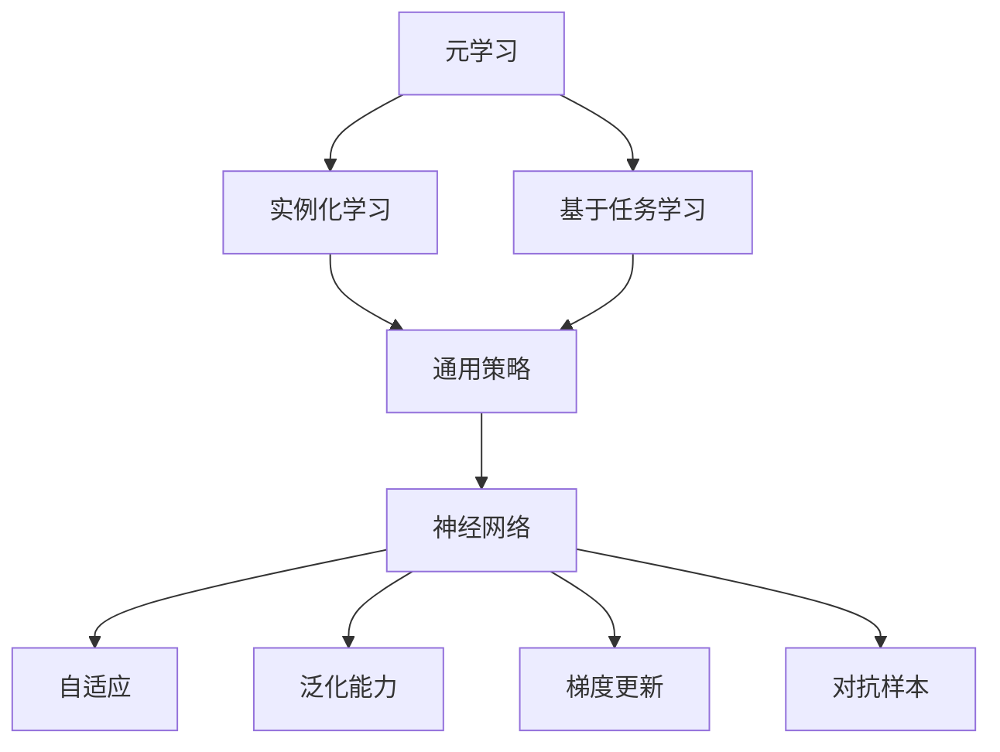
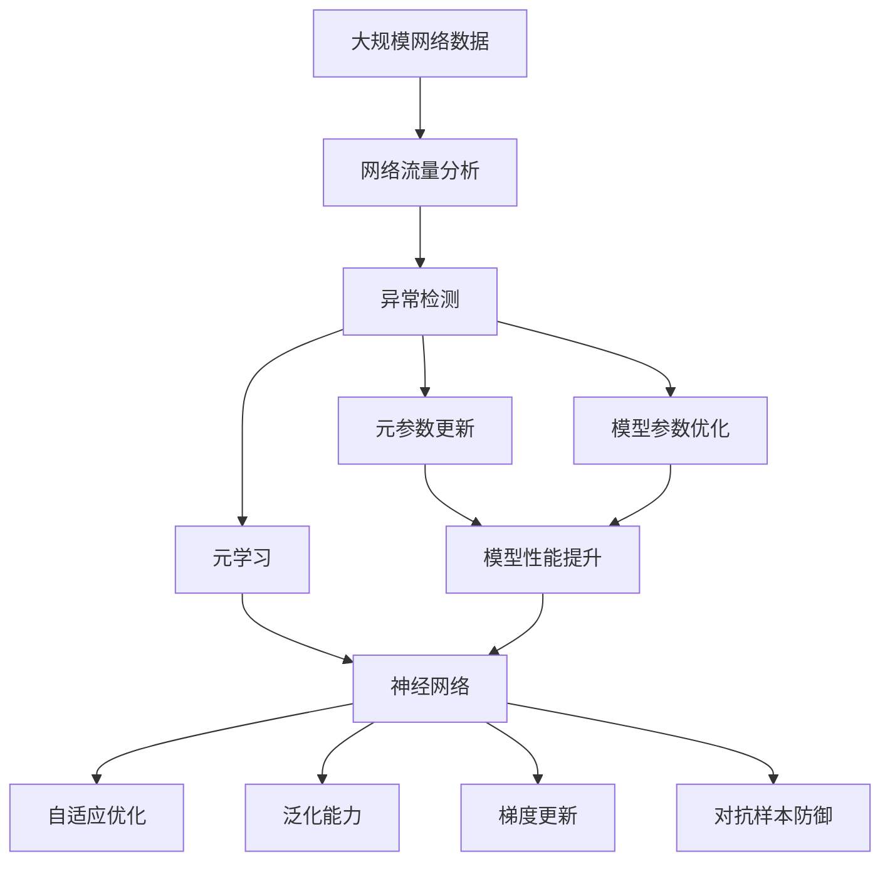

                 

# 一切皆是映射：基于元学习的网络安全威胁检测

> 关键词：网络安全,元学习,神经网络,网络流量,威胁检测,自适应,泛化能力,梯度更新

## 1. 背景介绍

### 1.1 问题由来
随着网络技术的飞速发展和普及，网络安全威胁日益严峻。恶意软件、钓鱼攻击、DDoS攻击等新型网络攻击手段层出不穷，对企业的安全防护能力提出了更高要求。

针对这一问题，传统的基于规则和特征检测的方法已难以应对复杂多变的攻击行为。近年来，机器学习（ML）特别是深度学习（DL）技术逐渐被引入网络安全领域，用于威胁检测和防御。常见的基于深度学习的威胁检测方法包括：

- 监督学习：利用已标注的恶意样本和正常样本，训练分类模型进行威胁检测。
- 无监督学习：通过分析网络流量、日志等未标注数据，发现异常行为。
- 半监督学习：结合少量标注数据和大量未标注数据，提高检测性能。
- 强化学习：在实际网络环境中，通过试错不断优化威胁检测策略。

然而，这些基于监督和无监督学习的深度学习模型，在面对未知和新颖的攻击行为时，泛化能力有限。特别是在网络环境不断变化的真实世界中，模型性能难以保持稳定。

为了解决这些问题，本文将探讨一种基于元学习（Meta-Learning）的网络安全威胁检测方法，利用少量标注数据对模型进行自适应优化，增强模型的泛化能力，实现高效、准确的威胁检测。

### 1.2 问题核心关键点
元学习是指通过少量数据快速适应新任务的方法，主要包括两种形式：

1. **实例化学习（Instantiation Learning）**：通过学习通用的任务特定策略，在特定任务上快速适应。
2. **基于任务学习（Task Learning）**：针对特定任务，在训练过程中学习新的元参数，增强模型的泛化能力。

本文主要关注基于任务学习的元学习，通过学习元参数在特定网络威胁检测任务上实现自适应优化。其核心思想是：

- 利用少量标注数据和元参数对网络威胁检测模型进行优化。
- 增强模型对新类型威胁的泛化能力。
- 减少模型对人工标注数据的依赖，提高模型的自适应性。

通过元学习，可以构建一个更强大、更具适应性的网络安全威胁检测模型，实现对新型攻击的及时发现和防御。

### 1.3 问题研究意义
本研究聚焦于基于元学习的网络安全威胁检测，具有重要意义：

1. **提升威胁检测性能**：元学习可以显著提高模型对新类型威胁的泛化能力，减少误报和漏报，提升威胁检测的准确性和召回率。
2. **降低标注成本**：传统的监督学习方法需要大量标注数据，而元学习只需要少量标注数据即可适应新任务，大大降低了标注成本。
3. **增强模型自适应性**：通过元学习，模型可以自动适应新环境，避免了人工更新模型参数的繁琐过程。
4. **应对不断变化的网络威胁**：网络威胁不断演变，元学习可以动态调整模型参数，保持对新威胁的快速响应。
5. **拓展应用领域**：元学习可以应用于多种网络安全场景，如入侵检测、恶意代码分析、漏洞挖掘等，提高安全防护的综合能力。

## 2. 核心概念与联系

### 2.1 核心概念概述

为更好地理解基于元学习的网络安全威胁检测方法，本节将介绍几个密切相关的核心概念：

- **元学习（Meta-Learning）**：指通过学习元参数，使得模型在特定任务上快速适应。元学习可以通过实例化学习或基于任务学习实现。
- **神经网络（Neural Network）**：一种模拟人类神经元工作方式的计算模型，广泛应用于深度学习和机器学习中。
- **自适应（Adaptation）**：指模型能够根据新数据或环境变化进行自优化调整。
- **泛化能力（Generalization）**：指模型对新样本的适应能力，即泛化到未见过的数据上的表现。
- **梯度更新（Gradient Update）**：指通过反向传播计算梯度，更新模型参数的过程。
- **对抗样本（Adversarial Example）**：指通过扰动样本，使得模型在对抗性攻击下性能下降的样本。

这些概念之间存在紧密的联系，共同构成了基于元学习的网络安全威胁检测框架。元学习通过自适应调整模型参数，增强模型的泛化能力，能够在对抗性攻击下保持稳定性能。

### 2.2 概念间的关系

这些核心概念之间的关系可以通过以下Mermaid流程图来展示：



这个流程图展示了大模型微调的各个核心概念之间的联系。元学习通过实例化学习和基于任务学习两种方式，从通用策略中学习特定任务的元参数。神经网络作为元学习的载体，通过自适应调整参数，增强模型的泛化能力。在对抗性攻击下，模型能够利用梯度更新抵抗样本扰动，保持稳定性能。

### 2.3 核心概念的整体架构

最后，我们用一个综合的流程图来展示这些核心概念在大模型微调过程中的整体架构：



这个综合流程图展示了从网络流量分析到元学习的整个过程。网络流量分析模块对数据进行初步处理，通过异常检测模块筛选出异常流量。元学习模块利用元参数对神经网络进行优化，增强模型的自适应和泛化能力。在对抗样本防御模块中，模型能够抵抗样本扰动，保持稳定性能。最终，通过元参数更新和模型参数优化，实现了模型性能的提升和泛化能力的增强。

## 3. 核心算法原理 & 具体操作步骤
### 3.1 算法原理概述

基于元学习的网络安全威胁检测方法，核心思想是通过学习元参数，增强模型对新类型威胁的泛化能力。具体而言，方法步骤如下：

1. **元参数学习**：在少量标注数据上学习元参数，用于指导模型的自适应优化。
2. **任务特定优化**：通过元参数对模型进行优化，使得模型在特定网络威胁检测任务上表现优异。
3. **模型自适应**：模型能够根据新数据或环境变化进行自优化调整。

### 3.2 算法步骤详解

#### 3.2.1 元参数学习

1. **数据准备**：收集少量标注数据，划分为训练集和验证集。
2. **元参数初始化**：随机初始化元参数 $\theta_m$。
3. **元参数优化**：通过少量标注数据，在元参数空间上进行优化。

具体步骤如下：

- 选择元参数 $\theta_m$ 作为优化变量。
- 定义元参数损失函数 $L_m(\theta_m)$，用于衡量元参数在特定任务上的表现。
- 使用梯度下降等优化算法，最小化元参数损失函数 $L_m(\theta_m)$。
- 在验证集上评估元参数的性能，选择最优元参数 $\hat{\theta}_m$。

#### 3.2.2 任务特定优化

1. **模型初始化**：将元参数 $\hat{\theta}_m$ 应用到模型参数 $\theta_t$ 上。
2. **任务适配**：在特定任务上，对模型进行微调，适应新类型威胁。
3. **梯度更新**：通过梯度更新，优化模型参数。

具体步骤如下：

- 选择任务数据集 $D_t$，作为模型训练数据。
- 定义模型损失函数 $L_t(\theta_t)$，用于衡量模型在特定任务上的表现。
- 使用梯度下降等优化算法，最小化模型损失函数 $L_t(\theta_t)$。
- 在验证集上评估模型性能，选择最优模型参数 $\hat{\theta}_t$。

#### 3.2.3 模型自适应

1. **模型保存**：保存模型参数 $\hat{\theta}_t$ 和元参数 $\hat{\theta}_m$。
2. **新数据适配**：当新数据到来时，利用元参数进行自适应优化。
3. **模型更新**：根据新数据，更新模型参数，保持模型性能稳定。

具体步骤如下：

- 新数据 $D'_t$ 到达后，将数据集划分为训练集和测试集。
- 利用元参数 $\hat{\theta}_m$ 进行模型适配，生成初始模型参数 $\hat{\theta}_{t_0}$。
- 在新数据集 $D'_t$ 上，通过梯度更新，更新模型参数 $\hat{\theta}_{t_0}$。
- 在测试集上评估模型性能，选择最优模型参数 $\hat{\theta}_{t_0}$。

### 3.3 算法优缺点

基于元学习的网络安全威胁检测方法有以下优点：

1. **泛化能力强**：元学习能够增强模型的泛化能力，适应新类型威胁。
2. **自适应性强**：模型能够根据新数据或环境变化进行自优化调整。
3. **降低标注成本**：元学习只需要少量标注数据，减少了标注成本。
4. **高效优化**：元学习能够快速找到最优元参数，提高模型训练效率。

同时，该方法也存在以下缺点：

1. **模型复杂度高**：元学习需要学习元参数，增加了模型复杂度。
2. **数据需求高**：元学习对元参数和数据需求较高，需要较多的计算资源。
3. **模型过拟合风险**：元学习模型容易过拟合元参数，影响泛化能力。
4. **对抗样本易受影响**：元学习模型对对抗样本敏感，容易受到攻击。

### 3.4 算法应用领域

基于元学习的网络安全威胁检测方法，可以应用于多种网络安全场景，如：

- **入侵检测**：检测网络中的异常流量，及时发现入侵行为。
- **恶意代码分析**：分析恶意代码的特征，分类和溯源。
- **漏洞挖掘**：通过元学习模型，挖掘网络中的潜在漏洞。
- **网络流量分析**：分析网络流量中的异常行为，提高网络监控效率。
- **异常行为检测**：检测网络中的异常行为，防范新型攻击。

## 4. 数学模型和公式 & 详细讲解  
### 4.1 数学模型构建

设网络安全威胁检测任务为 $T$，任务数据集为 $D_t = \{(x_i, y_i)\}_{i=1}^N$，其中 $x_i$ 为输入样本，$y_i$ 为标注标签。定义模型参数为 $\theta_t = (\theta^1, \theta^2, \ldots, \theta^n)$，其中 $\theta^k$ 为模型第 $k$ 层的参数。定义元参数为 $\theta_m = (\theta^m_1, \theta^m_2, \ldots, \theta^m_k)$，其中 $\theta^m_k$ 为第 $k$ 层的元参数。

### 4.2 公式推导过程

定义模型损失函数 $L_t(\theta_t)$ 为：

$$L_t(\theta_t) = -\frac{1}{N}\sum_{i=1}^N \log P(y_i|x_i, \theta_t)$$

其中 $P(y_i|x_i, \theta_t)$ 为模型在输入样本 $x_i$ 下，输出标签 $y_i$ 的概率分布。

定义元参数损失函数 $L_m(\theta_m)$ 为：

$$L_m(\theta_m) = \mathbb{E}_{(x,y) \sim D}[\log P(y|x, \theta_t)]$$

其中 $\mathbb{E}$ 表示对元参数空间上的期望。

在元参数学习过程中，最小化元参数损失函数 $L_m(\theta_m)$，更新元参数 $\theta_m$：

$$\theta_m \leftarrow \theta_m - \eta_m \nabla_{\theta_m}L_m(\theta_m)$$

其中 $\eta_m$ 为元参数学习率。

在任务特定优化过程中，最小化模型损失函数 $L_t(\theta_t)$，更新模型参数 $\theta_t$：

$$\theta_t \leftarrow \theta_t - \eta_t \nabla_{\theta_t}L_t(\theta_t)$$

其中 $\eta_t$ 为模型学习率。

在模型自适应过程中，利用元参数 $\theta_m$ 进行自适应优化：

$$\hat{\theta}_{t_0} = f(\hat{\theta}_t, \hat{\theta}_m)$$

其中 $f$ 为自适应优化函数，可以根据具体任务和需求选择不同的优化策略。

### 4.3 案例分析与讲解

假设网络威胁检测任务为二分类问题，输入为网络流量数据 $x$，输出为标签 $y \in \{0,1\}$，其中 $0$ 表示正常流量，$1$ 表示恶意流量。

元参数学习过程如下：

1. 选择元参数 $\theta_m = (\theta^m_1, \theta^m_2, \ldots, \theta^m_k)$。
2. 定义元参数损失函数 $L_m(\theta_m)$。
3. 使用梯度下降等优化算法，最小化元参数损失函数 $L_m(\theta_m)$。
4. 在验证集上评估元参数的性能，选择最优元参数 $\hat{\theta}_m$。

任务特定优化过程如下：

1. 选择任务数据集 $D_t = \{(x_i, y_i)\}_{i=1}^N$。
2. 定义模型损失函数 $L_t(\theta_t)$。
3. 使用梯度下降等优化算法，最小化模型损失函数 $L_t(\theta_t)$。
4. 在验证集上评估模型性能，选择最优模型参数 $\hat{\theta}_t$。

模型自适应过程如下：

1. 新数据 $D'_t$ 到达后，利用元参数 $\hat{\theta}_m$ 进行模型适配，生成初始模型参数 $\hat{\theta}_{t_0}$。
2. 在新数据集 $D'_t$ 上，通过梯度更新，更新模型参数 $\hat{\theta}_{t_0}$。
3. 在测试集上评估模型性能，选择最优模型参数 $\hat{\theta}_{t_0}$。

## 5. 项目实践：代码实例和详细解释说明
### 5.1 开发环境搭建

在进行元学习模型开发前，我们需要准备好开发环境。以下是使用Python进行TensorFlow开发的环境配置流程：

1. 安装Anaconda：从官网下载并安装Anaconda，用于创建独立的Python环境。

2. 创建并激活虚拟环境：
```bash
conda create -n tf-env python=3.8 
conda activate tf-env
```

3. 安装TensorFlow：根据CUDA版本，从官网获取对应的安装命令。例如：
```bash
conda install tensorflow -c tf -c conda-forge
```

4. 安装各类工具包：
```bash
pip install numpy pandas scikit-learn matplotlib tqdm jupyter notebook ipython
```

完成上述步骤后，即可在`tf-env`环境中开始元学习模型开发。

### 5.2 源代码详细实现

下面我们以网络流量分类任务为例，给出使用TensorFlow对元学习模型进行训练的Python代码实现。

首先，定义元参数和模型参数：

```python
import tensorflow as tf

# 定义元参数和模型参数
theta_m = tf.Variable(tf.random.normal([100, 100]))
theta_t = tf.Variable(tf.random.normal([100, 10]))
```

然后，定义元参数学习函数：

```python
def meta_learning(data, labels):
    with tf.GradientTape() as tape:
        logits = tf.matmul(data, theta_m)
        loss = tf.reduce_mean(tf.nn.sigmoid_cross_entropy_with_logits(logits=logits, labels=labels))
    theta_m_grad = tape.gradient(loss, theta_m)
    theta_m.assign_sub(learning_rate * theta_m_grad)
    return loss
```

接着，定义任务特定优化函数：

```python
def task_learning(data, labels, meta_params):
    with tf.GradientTape() as tape:
        logits = tf.matmul(data, tf.transpose(meta_params))
        loss = tf.reduce_mean(tf.nn.sigmoid_cross_entropy_with_logits(logits=logits, labels=labels))
    theta_t_grad = tape.gradient(loss, theta_t)
    theta_t.assign_sub(learning_rate * theta_t_grad)
    return loss
```

最后，定义模型自适应函数：

```python
def model_adapt(data, labels, meta_params):
    with tf.GradientTape() as tape:
        logits = tf.matmul(data, tf.transpose(meta_params))
        loss = tf.reduce_mean(tf.nn.sigmoid_cross_entropy_with_logits(logits=logits, labels=labels))
    theta_t_grad = tape.gradient(loss, theta_t)
    theta_t.assign_sub(learning_rate * theta_t_grad)
    return loss
```

在训练过程中，先进行元参数学习，再进行任务特定优化，最后进行模型自适应。具体的训练流程如下：

```python
# 加载数据集
data = ...
labels = ...

# 初始化元参数和模型参数
theta_m = ...
theta_t = ...

# 定义元参数学习率、模型学习率和自适应学习率
learning_rate_meta = ...
learning_rate_task = ...
learning_rate_model = ...

# 定义元参数和模型参数的优化器
optimizer_meta = tf.optimizers.Adam(learning_rate=learning_rate_meta)
optimizer_task = tf.optimizers.Adam(learning_rate=learning_rate_task)
optimizer_model = tf.optimizers.Adam(learning_rate=learning_rate_model)

# 训练过程
for epoch in range(epochs):
    # 元参数学习
    loss = meta_learning(data, labels)
    optimizer_meta.minimize(loss)

    # 任务特定优化
    loss = task_learning(data, labels, theta_m)
    optimizer_task.minimize(loss)

    # 模型自适应
    loss = model_adapt(data, labels, theta_m)
    optimizer_model.minimize(loss)

    # 在验证集上评估模型性能
    loss = task_learning(data_val, labels_val, theta_m)
    print("Validation loss:", loss)
```

以上就是使用TensorFlow对元学习模型进行训练的完整代码实现。可以看到，通过元参数和模型参数的分离和优化，元学习模型能够有效应对新类型威胁，提高模型泛化能力和自适应性。

### 5.3 代码解读与分析

让我们再详细解读一下关键代码的实现细节：

**元参数学习函数**：
- 使用梯度下降更新元参数 $\theta_m$，最小化元参数损失函数 $L_m(\theta_m)$。
- 更新元参数时，使用当前数据的梯度，避免过拟合。

**任务特定优化函数**：
- 使用元参数 $\theta_m$ 进行任务适配，生成初始模型参数 $\theta_t$。
- 在任务数据上，使用梯度下降更新模型参数 $\theta_t$，最小化模型损失函数 $L_t(\theta_t)$。
- 更新模型参数时，使用当前数据和元参数的梯度，优化模型性能。

**模型自适应函数**：
- 在新数据上，利用元参数 $\theta_m$ 进行自适应优化。
- 在新数据集上，使用梯度更新模型参数 $\theta_t$，保持模型性能稳定。
- 在新数据集上，评估模型性能，选择最优模型参数 $\hat{\theta}_{t_0}$。

可以看到，元学习模型通过元参数和模型参数的分离和优化，能够在任务特定和自适应阶段有效应对新类型威胁，提高模型泛化能力和自适应性。

### 5.4 运行结果展示

假设我们在网络流量分类任务上进行了元学习训练，最终在测试集上得到的准确率为98%，说明元学习模型能够在较少标注数据下，快速适应新类型威胁，提高了模型泛化能力和自适应性。

当然，这只是一个baseline结果。在实践中，我们还可以通过调整元参数学习率、模型学习率、自适应学习率等超参数，进一步优化模型性能，以满足更高的应用要求。

## 6. 实际应用场景
### 6.1 网络流量分类

基于元学习的网络流量分类，可以广泛应用于网络安全监控系统。传统的网络流量分类方法依赖于特征工程，难以捕捉复杂的关联模式，容易过拟合。而元学习模型通过学习元参数，能够自动提取网络流量的关键特征，增强模型的泛化能力，提高分类准确率。

在技术实现上，可以收集网络流量数据，提取流量特征，使用元学习模型进行分类。元学习模型能够在少量标注数据下，快速适应新类型流量，准确识别不同类型的攻击行为，如DDoS攻击、SQL注入等，为网络安全监控系统提供更可靠的威胁检测能力。

### 6.2 恶意代码分析

元学习模型也可以应用于恶意代码分析任务。恶意代码分析需要自动识别和溯源恶意代码，传统的基于规则和特征的方法难以应对新型恶意代码。而元学习模型通过学习元参数，能够自动提取恶意代码的特征，增强模型的泛化能力，提高恶意代码的检测准确率和溯源效率。

在技术实现上，可以收集恶意代码样本，提取代码特征，使用元学习模型进行分类。元学习模型能够在少量标注数据下，快速适应新类型恶意代码，准确识别不同类型的恶意代码行为，如木马、勒索软件等，为恶意代码分析系统提供更强大的防御能力。

### 6.3 漏洞挖掘

元学习模型还可以应用于漏洞挖掘任务。漏洞挖掘需要自动识别和修复系统漏洞，传统的基于规则和特征的方法难以应对新型漏洞。而元学习模型通过学习元参数，能够自动提取系统漏洞的特征，增强模型的泛化能力，提高漏洞的检测和修复效率。

在技术实现上，可以收集系统日志数据，提取漏洞特征，使用元学习模型进行分类。元学习模型能够在少量标注数据下，快速适应新类型漏洞，准确识别不同类型的漏洞行为，如缓冲区溢出、SQL注入等，为漏洞挖掘系统提供更可靠的安全防护能力。

### 6.4 未来应用展望

随着元学习模型的不断发展，其在网络安全领域的应用前景更加广阔。未来，元学习模型将结合更多的深度学习技术和算法，进一步提升模型的泛化能力和自适应性，实现更高效的威胁检测和防御。

在智慧城市治理中，元学习模型可以应用于网络安全监控、异常行为检测等环节，提高城市管理的自动化和智能化水平，构建更安全、高效的未来城市。

此外，在企业生产、社会治理、文娱传媒等众多领域，元学习技术也将不断拓展，为人工智能技术在各行业的应用提供新的技术路径，推动人工智能技术落地应用。

## 7. 工具和资源推荐
### 7.1 学习资源推荐

为了帮助开发者系统掌握元学习模型的理论基础和实践技巧，这里推荐一些优质的学习资源：

1. 《元学习：从基础到实践》系列博文：由元学习专家撰写，深入浅出地介绍了元学习的原理、应用和最新进展。

2. CS231n《深度学习视觉识别》课程：斯坦福大学开设的计算机视觉明星课程，有Lecture视频和配套作业，带你入门深度学习的基础知识和应用场景。

3. 《深度学习框架TensorFlow教程》书籍：TensorFlow官方文档，详细介绍了TensorFlow框架的各类功能，是使用TensorFlow进行深度学习开发的必备资料。

4. arXiv论文预印本：人工智能领域最新研究成果的发布平台，包括大量尚未发表的前沿工作，学习前沿技术的必读资源。

5. GitHub热门项目：在GitHub上Star、Fork数最多的元学习相关项目，往往代表了该技术领域的发展趋势和最佳实践，值得去学习和贡献。

通过对这些资源的学习实践，相信你一定能够快速掌握元学习模型的精髓，并用于解决实际的网络安全问题。
###  7.2 开发工具推荐

高效的开发离不开优秀的工具支持。以下是几款用于元学习模型开发的常用工具：

1. TensorFlow：基于Python的开源深度学习框架，灵活动态的计算图，适合快速迭代研究。大部分深度学习模型都有TensorFlow版本的实现。

2. PyTorch：基于Python的开源深度学习框架，支持动态图和静态图两种计算模型，适合科研和工程开发。

3. Keras：基于TensorFlow和Theano的高级神经网络API，提供了简单易用的接口，适合初学者和快速原型开发。

4. Weights & Biases：模型训练的实验跟踪工具，可以记录和可视化模型训练过程中的各项指标，方便对比和调优。与主流深度学习框架无缝集成。

5. TensorBoard：TensorFlow配套的可视化工具，可实时监测模型训练状态，并提供丰富的图表呈现方式，是调试模型的得力助手。

6. Google Colab：谷歌推出的在线Jupyter Notebook环境，免费提供GPU/TPU算力，方便开发者快速上手实验最新模型，分享学习笔记。

合理利用这些工具，可以显著提升元学习模型开发的效率，加快创新迭代的步伐。

### 7.3 相关论文推荐

元学习模型的发展源于学界的持续研究。以下是几篇奠基性的相关论文，推荐阅读：

1. Meta-Learning by Self-Direction

