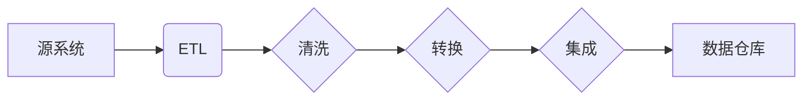
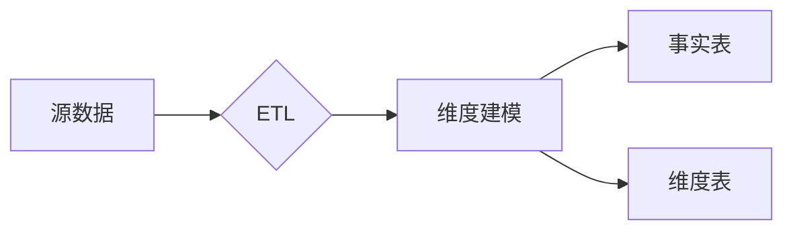
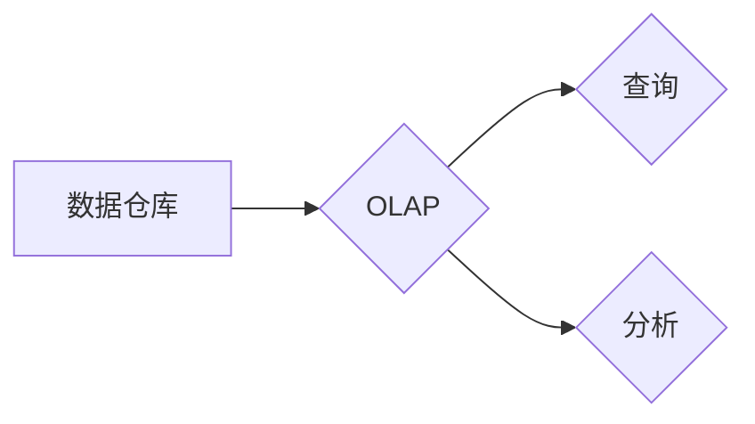

# 数据仓库 原理与代码实例讲解

> 关键词：数据仓库，ETL，星型模式，雪花模式，维度建模，OLAP，数据湖，Hadoop，Spark，SQL

## 1. 背景介绍

数据仓库是现代企业进行数据分析和商业智能决策的核心基础设施。它通过整合来自多个数据源的结构化、半结构化和非结构化数据，为用户提供全面、一致、集成的数据视图，支持复杂的查询和分析操作。本文将深入探讨数据仓库的原理，并通过代码实例讲解其实践方法。

### 1.1 问题的由来

随着互联网和大数据技术的快速发展，企业积累了海量的数据。如何有效地管理和利用这些数据，成为企业提升竞争力的重要课题。数据仓库作为一种专门用于数据分析和报告的工具，应运而生。

### 1.2 研究现状

数据仓库技术已经发展了数十年，经历了多个阶段。目前，数据仓库技术主要包括以下几方面：

- **ETL（Extract, Transform, Load）**：数据抽取、转换和加载技术，用于将数据从源头系统迁移到数据仓库。
- **维度建模**：一种数据建模方法，通过建立维度表和事实表，为数据分析提供灵活的查询接口。
- **OLAP（Online Analytical Processing）**：在线分析处理技术，支持复杂的查询和分析操作。
- **数据湖**：一种新的数据存储方式，可以存储任意类型的数据，并支持大规模数据分析和处理。

### 1.3 研究意义

研究数据仓库技术对于企业具有重要意义：

- **提高数据利用率**：通过数据仓库，企业可以更有效地利用数据，支持决策制定和业务分析。
- **降低数据存储成本**：数据仓库可以整合多个数据源，减少数据冗余，降低数据存储成本。
- **提升数据分析效率**：数据仓库支持高效的查询和分析操作，提高数据分析效率。

### 1.4 本文结构

本文将围绕数据仓库的原理和实践，展开以下内容：

- 核心概念与联系
- 核心算法原理与具体操作步骤
- 数学模型和公式
- 项目实践：代码实例
- 实际应用场景
- 工具和资源推荐
- 总结：未来发展趋势与挑战

## 2. 核心概念与联系

### 2.1 ETL

ETL是数据仓库构建的核心技术之一。它包括以下三个步骤：

- **Extract**：从源头系统抽取数据。
- **Transform**：对数据进行清洗、转换和集成。
- **Load**：将处理后的数据加载到数据仓库。

Mermaid流程图如下：



### 2.2 维度建模

维度建模是数据仓库设计中的一种重要方法。它将数据组织成维度表和事实表，为数据分析提供灵活的查询接口。

- **维度表**：描述了数据的属性，如时间、地点、产品等。
- **事实表**：描述了业务活动，如销售、订单等。

Mermaid流程图如下：



### 2.3 OLAP

OLAP是数据仓库中的查询和分析技术。它支持复杂的查询操作，如切片、切块、钻取、卷起等。

Mermaid流程图如下：



## 3. 核心算法原理与具体操作步骤

### 3.1 算法原理概述

数据仓库的核心算法主要包括ETL和维度建模。

### 3.2 算法步骤详解

#### 3.2.1 ETL

1. **数据抽取**：从源头系统获取数据，可以是SQL查询、日志文件或API调用。
2. **数据清洗**：处理缺失值、异常值和重复数据，确保数据质量。
3. **数据转换**：将数据转换为数据仓库的统一格式，如日期格式、数值格式等。
4. **数据加载**：将处理后的数据加载到数据仓库。

#### 3.2.2 维度建模

1. **识别业务实体**：确定数据仓库中的核心业务实体，如客户、产品、订单等。
2. **设计维度表**：为每个业务实体设计维度表，如客户维度表、产品维度表等。
3. **设计事实表**：设计事实表，记录业务活动数据，如订单数据、销售数据等。
4. **建立数据关联**：建立维度表和事实表之间的关联关系，支持数据分析。

### 3.3 算法优缺点

#### 3.3.1 ETL

**优点**：

- **灵活**：可以适应各种数据源和数据处理需求。
- **高效**：支持大规模数据抽取、转换和加载。
- **可扩展**：可以方便地扩展新的数据源和处理流程。

**缺点**：

- **复杂**：ETL过程涉及多个步骤，需要较高的技术能力。
- **成本高**：需要购买或开发ETL工具。

#### 3.3.2 维度建模

**优点**：

- **简单**：维度建模易于理解和实现。
- **灵活**：可以方便地添加新的维度和事实。
- **高效**：支持复杂的查询和分析操作。

**缺点**：

- **设计复杂**：维度建模需要对业务有深入的理解。
- **维护成本高**：随着业务的变化，维度模型可能需要频繁调整。

### 3.4 算法应用领域

ETL和维度建模广泛应用于数据仓库的构建，包括：

- **企业级数据仓库**：为企业提供全面的数据视图，支持决策制定和业务分析。
- **数据集市**：为特定部门或项目提供定制化的数据视图。
- **商业智能应用**：支持复杂的查询和分析操作，如报表、仪表盘等。

## 4. 数学模型和公式

数据仓库的数学模型主要包括以下内容：

- **数据模型**：描述了数据仓库中数据的结构，如维度模型、星型模式、雪花模式等。
- **统计模型**：描述了数据的统计特征，如平均值、方差、相关性等。
- **预测模型**：描述了数据的预测方法，如线性回归、决策树等。

### 4.1 数学模型构建

#### 4.1.1 数据模型

数据模型是数据仓库的核心，它定义了数据仓库中数据的结构。常见的数据模型包括：

- **维度模型**：由维度表和事实表组成，适用于OLAP查询。
- **星型模式**：事实表与多个维度表直接相连，适用于简单的OLAP查询。
- **雪花模式**：星型模式的变种，维度表进一步细化和归一化。

#### 4.1.2 统计模型

统计模型描述了数据的统计特征，如：

- **平均值**：一组数据的总和除以数据个数。
- **方差**：一组数据与其平均值之差的平方的平均值。
- **相关性**：两个变量之间的线性关系程度。

#### 4.1.3 预测模型

预测模型描述了数据的预测方法，如：

- **线性回归**：预测因变量与自变量之间的线性关系。
- **决策树**：根据一系列规则对数据进行分类或预测。

### 4.2 公式推导过程

以下是一些常见的数学公式：

- **平均值**：$\bar{x} = \frac{1}{n} \sum_{i=1}^{n} x_i$
- **方差**：$s^2 = \frac{1}{n-1} \sum_{i=1}^{n} (x_i - \bar{x})^2$
- **相关系数**：$r = \frac{\sum_{i=1}^{n} (x_i - \bar{x})(y_i - \bar{y})}{\sqrt{\sum_{i=1}^{n} (x_i - \bar{x})^2 \sum_{i=1}^{n} (y_i - \bar{y})^2}}$

### 4.3 案例分析与讲解

以销售数据为例，分析销售趋势和客户行为。

- **数据模型**：采用维度模型，维度表包括时间、产品、客户等，事实表包括销售额、订单数量等。
- **统计模型**：计算销售额的平均值、方差和相关系数，分析销售趋势和客户购买行为。
- **预测模型**：使用时间序列分析，预测未来销售趋势。

## 5. 项目实践：代码实例和详细解释说明

### 5.1 开发环境搭建

- **数据库**：MySQL、PostgreSQL
- **数据仓库**：Apache Hadoop、Apache Hive
- **编程语言**：Python、Java

### 5.2 源代码详细实现

以下是一个使用Python和Hive进行数据仓库构建的示例代码：

```python
# 导入Hive客户端库
from pyhive import hive

# 连接Hive数据库
conn = hive.Connection(host='localhost', port=10000, username='hive')

# 创建维度表
conn.execute('''
    CREATE TABLE IF NOT EXISTS dim_time (
        id STRING,
        year INT,
        month INT,
        day INT,
        ...
    );
''')

# 创建事实表
conn.execute('''
    CREATE TABLE IF NOT EXISTS fact_sales (
        time_id STRING,
        product_id STRING,
        customer_id STRING,
        sale_amount DECIMAL(10, 2),
        ...
    );
''')

# 加载数据到维度表和事实表
# ...
```

### 5.3 代码解读与分析

以上代码首先连接到Hive数据库，然后创建维度表和事实表，最后加载数据到数据仓库。

### 5.4 运行结果展示

通过以上代码，我们可以构建一个简单的数据仓库，并对其进行查询和分析。

```python
# 连接Hive数据库
conn = hive.Connection(host='localhost', port=10000, username='hive')

# 查询销售额
conn.execute('''
    SELECT 
        year, 
        month, 
        SUM(sale_amount) AS total_sales
    FROM 
        fact_sales
    GROUP BY 
        year, month;
''')

# 查询客户购买次数
conn.execute('''
    SELECT 
        customer_id, 
        COUNT(*) AS purchase_count
    FROM 
        fact_sales
    GROUP BY 
        customer_id;
''')
```

## 6. 实际应用场景

数据仓库技术广泛应用于各个行业，以下是一些典型的应用场景：

- **零售行业**：通过分析销售数据，优化库存管理、营销策略等。
- **金融行业**：通过分析交易数据，识别欺诈行为、风险评估等。
- **医疗行业**：通过分析医疗数据，提高医疗质量、降低医疗成本。
- **政府部门**：通过分析公共数据，提高政府决策的科学性和有效性。

### 6.4 未来应用展望

随着大数据技术和人工智能技术的不断发展，数据仓库将朝着以下方向发展：

- **云计算**：基于云的数据仓库，提供更加灵活、可扩展、低成本的解决方案。
- **人工智能**：将人工智能技术应用于数据仓库，实现智能数据分析和预测。
- **物联网**：将物联网数据纳入数据仓库，支持更加智能的物联网应用。

## 7. 工具和资源推荐

### 7.1 学习资源推荐

- 《数据仓库技术内幕》
- 《大数据技术原理与应用》
- 《Hadoop权威指南》

### 7.2 开发工具推荐

- **数据库**：MySQL、PostgreSQL
- **数据仓库**：Apache Hadoop、Apache Hive
- **编程语言**：Python、Java

### 7.3 相关论文推荐

- 《The Data Warehouse Toolkit》
- 《Data Warehouse Management: An Introduction to Concepts and Technology》
- 《Data Management for Data-Driven Decision Making》

## 8. 总结：未来发展趋势与挑战

### 8.1 研究成果总结

本文深入探讨了数据仓库的原理和实践方法，包括ETL、维度建模、OLAP等核心技术。通过代码实例和案例分析，展示了数据仓库在实际应用中的价值。

### 8.2 未来发展趋势

数据仓库技术将继续朝着以下方向发展：

- **云计算**：基于云的数据仓库，提供更加灵活、可扩展、低成本的解决方案。
- **人工智能**：将人工智能技术应用于数据仓库，实现智能数据分析和预测。
- **物联网**：将物联网数据纳入数据仓库，支持更加智能的物联网应用。

### 8.3 面临的挑战

数据仓库技术在未来发展过程中，将面临以下挑战：

- **数据质量和安全**：随着数据量的增加，数据质量和安全成为越来越重要的挑战。
- **数据隐私**：如何保护用户隐私，是数据仓库发展的重要问题。
- **技术更新**：大数据技术和人工智能技术的快速发展，对数据仓库技术提出了更高的要求。

### 8.4 研究展望

未来，数据仓库技术将与其他技术深度融合，为企业和政府提供更加智能、高效、安全的数据服务。

## 9. 附录：常见问题与解答

**Q1：数据仓库和数据库有什么区别？**

A：数据仓库和数据库都是数据存储和管理的工具，但它们的应用场景和目标不同。数据库主要用于日常事务处理，而数据仓库主要用于数据分析和报告。

**Q2：如何选择合适的ETL工具？**

A：选择ETL工具时，需要考虑以下因素：

- **数据源类型**：不同的ETL工具支持不同的数据源。
- **数据处理能力**：ETL工具需要具备强大的数据处理能力，支持各种数据转换操作。
- **易用性**：ETL工具需要易于使用和维护。

**Q3：如何选择合适的维度模型？**

A：选择维度模型时，需要考虑以下因素：

- **业务需求**：根据业务需求选择合适的维度模型。
- **数据特征**：根据数据特征选择合适的维度模型。
- **查询需求**：根据查询需求选择合适的维度模型。

**Q4：如何保证数据仓库的数据质量？**

A：保证数据仓库的数据质量，需要从以下几个方面入手：

- **数据源管理**：确保数据源的数据质量。
- **数据清洗**：对数据进行清洗，去除缺失值、异常值和重复数据。
- **数据监控**：对数据仓库的数据进行监控，及时发现和修复数据质量问题。

**Q5：数据仓库的未来发展趋势是什么？**

A：数据仓库的未来发展趋势包括：

- **云计算**：基于云的数据仓库，提供更加灵活、可扩展、低成本的解决方案。
- **人工智能**：将人工智能技术应用于数据仓库，实现智能数据分析和预测。
- **物联网**：将物联网数据纳入数据仓库，支持更加智能的物联网应用。

作者：禅与计算机程序设计艺术 / Zen and the Art of Computer Programming