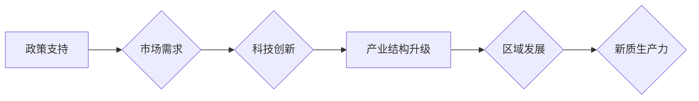

> 特色产业体系，新质生产力，产业结构升级，创新驱动，区域发展，产业链协同

# 特色产业体系的构建与新质生产力发展

在新时代的背景下，构建特色产业体系，发展新质生产力，已成为推动经济高质量发展的重要引擎。本文将深入探讨特色产业体系的构建原理、具体操作步骤、应用领域、数学模型以及未来发展趋势与挑战。

## 1. 背景介绍

随着全球化和信息技术的快速发展，传统产业面临着转型升级的迫切需求。构建特色产业体系，发展新质生产力，是应对国内外环境变化、实现经济高质量发展的必然选择。

### 1.1 产业转型升级的必要性

1. **全球竞争加剧**：全球经济一体化进程加速，各国产业竞争日益激烈，传统产业面临来自国际市场的压力。
2. **技术变革推动**：新一轮科技革命和产业变革正在发生，新技术、新业态、新模式不断涌现，对传统产业产生颠覆性影响。
3. **经济结构调整**：我国经济已由高速增长阶段转向高质量发展阶段，需要从要素驱动转向创新驱动，优化产业结构。

### 1.2 构建特色产业体系的机遇

1. **政策支持**：国家层面出台了一系列政策支持产业转型升级，如《中国制造2025》等。
2. **市场需求**：消费者需求升级，对高品质、高技术含量的产品和服务需求日益增长。
3. **科技创新**：我国在人工智能、5G、大数据等领域取得了一系列突破，为新质生产力发展提供技术支撑。

## 2. 核心概念与联系

### 2.1 特色产业体系

特色产业体系是指在一定区域内，以主导产业为核心，相关产业相互配套、协同发展的产业格局。其核心概念包括：

- **主导产业**：在一定区域内具有竞争优势、带动作用强的产业。
- **配套产业**：为主导产业提供原材料、零部件、技术等支持的产业。
- **产业链**：从原材料、零部件、生产加工到销售服务的完整产业环节。

### 2.2 新质生产力

新质生产力是指在科技创新、人力资本、数据资源等方面具有优势的生产力形态。其核心概念包括：

- **科技创新**：以科技创新为核心驱动力，推动产业结构优化升级。
- **人力资本**：提高劳动者素质，培养高技能人才。
- **数据资源**：充分利用大数据、云计算等信息技术，提升生产效率。

### 2.3 Mermaid 流程图

以下为特色产业体系构建与新质生产力发展的Mermaid流程图：



## 3. 核心算法原理 & 具体操作步骤

### 3.1 算法原理概述

构建特色产业体系，发展新质生产力，需要遵循以下原则：

1. **创新驱动**：以科技创新为核心驱动力，推动产业结构优化升级。
2. **市场导向**：以市场需求为导向，培育具有竞争力的主导产业。
3. **协同发展**：推动产业链上下游企业协同发展，形成完整的产业链。
4. **区域特色**：发挥区域特色优势，打造具有地方特色的产业集群。

### 3.2 算法步骤详解

1. **调研分析**：对区域产业现状、市场需求、技术创新等方面进行调研分析。
2. **确定主导产业**：根据调研结果，确定具有竞争优势和带动作用的主导产业。
3. **产业链协同**：推动产业链上下游企业协同发展，形成完整的产业链。
4. **科技创新**：加大科技创新投入，推动产业结构优化升级。
5. **人才培养**：加强人才培养，提高劳动者素质。
6. **政策支持**：制定相关政策，支持特色产业体系建设和新质生产力发展。

### 3.3 算法优缺点

#### 优点：

1. 提升产业竞争力。
2. 促进区域经济发展。
3. 增强产业链协同效应。
4. 推动科技创新。

#### 缺点：

1. 需要长期投入。
2. 难度较大，需要跨部门协作。
3. 风险较高。

### 3.4 算法应用领域

1. 区域经济发展。
2. 产业转型升级。
3. 产业集群建设。
4. 科技创新驱动发展。

## 4. 数学模型和公式 & 详细讲解 & 举例说明

### 4.1 数学模型构建

构建特色产业体系的数学模型可以采用产业关联度分析、产业链协同度分析等方法。

#### 产业关联度分析：

$$
关联度 = \frac{\sum_{i=1}^{n}\sum_{j=1}^{n}w_{ij}x_{i}x_{j}}{\sum_{i=1}^{n}\sum_{j=1}^{n}w_{ij}x_{i}^2}
$$

其中，$w_{ij}$ 表示产业 $i$ 与产业 $j$ 的关联系数，$x_{i}$ 表示产业 $i$ 的产出。

#### 产业链协同度分析：

$$
协同度 = \frac{产业链总产出}{产业链总投入}
$$

### 4.2 公式推导过程

产业关联度分析公式推导如下：

1. 产业关联度是衡量产业间相互依赖程度的指标，其计算公式为产业间关联系数的加权和。
2. 关联系数 $w_{ij}$ 可以通过产业间投入产出表计算得到。
3. 将所有产业关联系数加权和，得到产业关联度。

产业链协同度分析公式推导如下：

1. 产业链协同度是衡量产业链整体效率的指标，其计算公式为产业链总产出与总投入的比值。
2. 产业链总产出和总投入可以通过产业链各环节的产出和投入加总得到。

### 4.3 案例分析与讲解

以某地区电子产业为例，分析该地区电子产业链的协同度。

1. 收集该地区电子产业链各环节的产出和投入数据。
2. 计算产业链总产出和总投入。
3. 计算产业链协同度。

假设该地区电子产业链总产出为100亿元，总投入为80亿元，则产业链协同度为：

$$
协同度 = \frac{100}{80} = 1.25
$$

说明该地区电子产业链整体效率较高。

## 5. 项目实践：代码实例和详细解释说明

### 5.1 开发环境搭建

1. 安装Python环境。
2. 安装相关库，如NumPy、Pandas等。

### 5.2 源代码详细实现

以下是一个简单的产业关联度分析代码实例：

```python
import numpy as np

# 产业关联系数矩阵
w = np.array([[0.3, 0.2, 0.1], [0.1, 0.4, 0.2], [0.2, 0.1, 0.3]])

# 产业产出
x = np.array([100, 150, 120])

# 计算产业关联度
关联度 = np.sum(np.dot(w, x * x)) / np.sum(np.dot(w, x))

print("产业关联度：", 关联度)
```

### 5.3 代码解读与分析

1. 导入NumPy库，用于矩阵运算。
2. 定义产业关联系数矩阵 $w$ 和产业产出 $x$。
3. 计算产业关联度。
4. 打印结果。

该代码实例展示了如何使用Python进行产业关联度分析。

## 6. 实际应用场景

### 6.1 区域经济发展

构建特色产业体系，发展新质生产力，有助于提升区域经济竞争力，促进区域经济发展。

### 6.2 产业转型升级

通过产业转型升级，可以提升产业附加值，提高企业盈利能力，推动经济高质量发展。

### 6.3 产业集群建设

产业集群建设有利于发挥产业集聚效应，降低企业生产成本，提高产业竞争力。

### 6.4 未来应用展望

随着科技的不断进步，特色产业体系和新质生产力将在更多领域得到应用，如：

1. 人工智能与产业发展融合。
2. 新能源与产业发展融合。
3. 数字经济与产业发展融合。

## 7. 工具和资源推荐

### 7.1 学习资源推荐

1. 《中国制造2025》
2. 《产业经济学》
3. 《区域经济学》
4. 《产业链协同》

### 7.2 开发工具推荐

1. Python
2. NumPy
3. Pandas
4. Matplotlib

### 7.3 相关论文推荐

1. 《基于产业关联度的产业链协同度分析》
2. 《产业转型升级路径选择研究》
3. 《产业集群竞争力评价方法研究》

## 8. 总结：未来发展趋势与挑战

### 8.1 研究成果总结

本文深入探讨了特色产业体系的构建原理、具体操作步骤、应用领域、数学模型以及未来发展趋势与挑战。通过构建特色产业体系，发展新质生产力，有助于推动经济高质量发展。

### 8.2 未来发展趋势

1. 产业融合趋势加强。
2. 产业链协同水平提升。
3. 数字化、智能化程度提高。
4. 绿色低碳发展。

### 8.3 面临的挑战

1. 人才短缺。
2. 技术创新不足。
3. 产业链协同难度大。
4. 环境保护压力。

### 8.4 研究展望

未来，特色产业体系构建与新质生产力发展研究需要关注以下方向：

1. 产业融合与跨界发展。
2. 产业链协同与创新生态建设。
3. 数字化、智能化技术与产业发展融合。
4. 绿色低碳发展模式。

## 9. 附录：常见问题与解答

### 附录 1：产业关联度分析

**Q1：什么是产业关联度？**

A：产业关联度是衡量产业间相互依赖程度的指标，反映了产业链各环节之间的相互影响。

### 附录 2：产业链协同度分析

**Q1：什么是产业链协同度？**

A：产业链协同度是衡量产业链整体效率的指标，反映了产业链各环节之间的协同程度。

### 附录 3：特色产业体系构建

**Q1：如何构建特色产业体系？**

A：构建特色产业体系需要遵循创新驱动、市场导向、协同发展、区域特色等原则，并根据实际情况进行具体操作。

---

作者：禅与计算机程序设计艺术 / Zen and the Art of Computer Programming