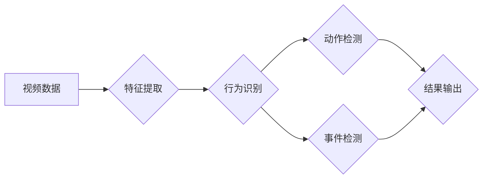

# 视频数据的关键信息捕捉技术

> 关键词：视频分析，关键信息提取，计算机视觉，行为识别，动作检测，事件检测，特征提取，深度学习

## 1. 背景介绍

随着视频监控、网络直播、移动设备等技术的普及，视频数据量呈爆炸式增长。如何从海量视频数据中快速、准确地捕捉关键信息，成为了一个亟待解决的问题。视频数据的关键信息捕捉技术，旨在自动识别和分析视频内容，提取出用户关注的重点信息，为安全监控、内容审核、智能分析等应用提供技术支撑。

## 2. 核心概念与联系

### 2.1 核心概念

- **视频分析**：对视频数据进行分析和处理，以提取有用信息的过程。
- **关键信息提取**：从视频中提取出对用户有意义的、重要的信息，如人物、动作、事件等。
- **计算机视觉**：利用计算机技术和算法对图像和视频进行处理和分析。
- **行为识别**：通过分析视频序列，识别出人物的行为模式。
- **动作检测**：检测视频序列中的特定动作或动作模式。
- **事件检测**：检测视频序列中的特定事件，如异常行为、紧急情况等。
- **特征提取**：从视频数据中提取出具有区分性的特征，用于后续的识别和分析。

### 2.2 核心概念原理和架构的 Mermaid 流程图



### 2.3 核心概念联系

视频分析是关键信息捕捉技术的核心，它通过计算机视觉技术对视频数据进行分析和处理。特征提取是视频分析的基础，它从视频数据中提取出具有区分性的特征。行为识别、动作检测和事件检测则是在提取的特征基础上，对视频内容进行更深层次的分析。最终，这些分析结果将被输出作为关键信息。

## 3. 核心算法原理 & 具体操作步骤

### 3.1 算法原理概述

视频数据的关键信息捕捉技术通常包括以下步骤：

1. **预处理**：对视频数据进行格式转换、去噪、裁剪等操作，提高后续处理的质量。
2. **特征提取**：从视频帧中提取出具有区分性的特征，如颜色、形状、纹理、运动等。
3. **行为识别**：利用机器学习或深度学习算法，对提取的特征进行分类，识别出人物的行为模式。
4. **动作检测**：检测视频序列中的特定动作或动作模式。
5. **事件检测**：检测视频序列中的特定事件，如异常行为、紧急情况等。
6. **结果输出**：将分析结果输出为文本、图像或其他格式，供用户查看或进一步处理。

### 3.2 算法步骤详解

1. **预处理**：
   - 视频格式转换：将不同格式的视频转换为统一的格式，如H.264或MP4。
   - 去噪：去除视频中的噪声，如运动模糊、光线变化等。
   - 裁剪：根据需求裁剪视频，去除无关内容。

2. **特征提取**：
   - 视频帧提取：将视频帧序列从视频中提取出来。
   - 特征提取方法：根据任务需求，选择合适的特征提取方法，如颜色特征、形状特征、纹理特征、运动特征等。

3. **行为识别**：
   - 特征分类：将提取的特征输入到机器学习或深度学习模型中，进行分类。
   - 模型选择：根据任务需求，选择合适的机器学习或深度学习模型，如SVM、CNN、RNN等。

4. **动作检测**：
   - 动作分类：对行为识别结果进行动作分类，如行走、跳跃、跑步等。
   - 检测方法：根据任务需求，选择合适的动作检测方法，如光流法、基于深度学习的检测方法等。

5. **事件检测**：
   - 事件分类：对动作检测结果进行事件分类，如跌倒、打架、火灾等。
   - 检测方法：根据任务需求，选择合适的事件检测方法，如规则匹配、基于深度学习的检测方法等。

6. **结果输出**：
   - 文本输出：将分析结果输出为文本格式，如日志、报告等。
   - 图像输出：将分析结果输出为图像格式，如检测结果图、轨迹图等。

### 3.3 算法优缺点

- **优点**：
  - 自动化程度高，能够快速处理大量视频数据。
  - 可扩展性强，可以适应不同的任务需求。
  - 准确率较高，能够有效地提取关键信息。

- **缺点**：
  - 算法复杂度高，需要大量的计算资源。
  - 需要大量的标注数据进行训练。
  - 算法对噪声和光照变化敏感。

### 3.4 算法应用领域

视频数据的关键信息捕捉技术广泛应用于以下领域：

- **安全监控**：如监控公共场所的安全情况，检测异常行为、紧急情况等。
- **内容审核**：如自动识别视频中的违规内容，如暴力、色情等。
- **智能分析**：如分析视频中的用户行为，为商业决策提供依据。
- **医学诊断**：如分析医学影像数据，辅助医生进行诊断。

## 4. 数学模型和公式 & 详细讲解 & 举例说明

### 4.1 数学模型构建

视频数据的关键信息捕捉技术涉及多个数学模型，包括：

- **特征提取**：如HOG（方向梯度直方图）、SIFT（尺度不变特征变换）等。
- **行为识别**：如支持向量机（SVM）、卷积神经网络（CNN）等。
- **动作检测**：如光流法、基于深度学习的检测方法等。
- **事件检测**：如规则匹配、基于深度学习的检测方法等。

### 4.2 公式推导过程

以下以HOG特征提取为例，简要介绍公式推导过程。

HOG特征提取的基本思想是将图像划分为若干个区域，对每个区域计算方向梯度直方图，然后将所有区域的方向梯度直方图拼接起来形成特征向量。

设图像的一个局部区域为 $R$，则该区域的方向梯度直方图为：

$$
H(R) = \sum_{i=1}^m \sum_{j=1}^n h(x_i, y_j)
$$

其中，$m$ 和 $n$ 分别为该区域的行数和列数，$h(x_i, y_j)$ 为该区域内像素 $(x_i, y_j)$ 的方向梯度直方图。

### 4.3 案例分析与讲解

以下以基于CNN的行为识别为例，分析其工作原理。

1. **数据准备**：收集行为数据集，如UCF101、HMDB51等。
2. **模型构建**：构建基于CNN的行为识别模型，如C3D、I3D等。
3. **模型训练**：使用标注数据进行模型训练。
4. **模型评估**：使用测试集评估模型性能。

## 5. 项目实践：代码实例和详细解释说明

### 5.1 开发环境搭建

1. 安装Python和必要的库，如OpenCV、TensorFlow、PyTorch等。
2. 准备行为数据集，如UCF101或HMDB51。

### 5.2 源代码详细实现

以下是一个基于C3D模型的简单行为识别代码示例：

```python
import cv2
import tensorflow as tf

# 加载C3D模型
model = tf.keras.models.load_model('c3d_model.h5')

# 读取视频文件
cap = cv2.VideoCapture('video.mp4')

# 预处理视频帧
while True:
    ret, frame = cap.read()
    if not ret:
        break

    # 将帧转换成模型输入格式
    frame = cv2.resize(frame, (96, 96))
    frame = frame.reshape(1, 96, 96, 3)

    # 预测行为
    prediction = model.predict(frame)
    print("Predicted behavior: ", prediction.argmax())

cap.release()
```

### 5.3 代码解读与分析

1. **导入库**：导入必要的库，如OpenCV用于视频处理，TensorFlow用于加载模型。
2. **加载模型**：加载预训练好的C3D模型。
3. **读取视频**：读取视频文件，逐帧处理。
4. **预处理视频帧**：将视频帧缩放到模型输入尺寸，并转换为模型所需的格式。
5. **预测行为**：使用模型对视频帧进行行为预测，并打印预测结果。
6. **释放资源**：释放视频文件句柄。

### 5.4 运行结果展示

运行代码后，会逐帧显示视频并打印出预测的行为类别。

## 6. 实际应用场景

### 6.1 安全监控

在公共场所安装视频监控系统，利用关键信息捕捉技术实时检测异常行为，如打架、斗殴、偷窃等，及时报警，保障公共安全。

### 6.2 内容审核

在视频分享平台、社交媒体等场景中，利用关键信息捕捉技术自动检测违规内容，如暴力、色情等，确保内容健康。

### 6.3 智能分析

在商场、超市等场景中，利用关键信息捕捉技术分析顾客行为，如进店人数、停留时间、购买物品等，为商家提供数据支持。

## 7. 工具和资源推荐

### 7.1 学习资源推荐

1. 《计算机视觉：算法与应用》
2. 《深度学习：卷积神经网络》
3. 《Python计算机视觉实践》

### 7.2 开发工具推荐

1. OpenCV：开源的计算机视觉库，适用于视频处理和图像分析。
2. TensorFlow：Google推出的深度学习框架，适用于构建和训练深度学习模型。
3. PyTorch：Facebook AI Research推出的深度学习框架，易于使用和调试。

### 7.3 相关论文推荐

1. HOG: Histogram of Oriented Gradients for Human Detection
2. SIFT: Scale-Invariant Feature Transform
3. C3D: Convolutional 3D ConvNets for Human Action Recognition

## 8. 总结：未来发展趋势与挑战

### 8.1 研究成果总结

视频数据的关键信息捕捉技术经过多年的发展，取得了显著的成果。在特征提取、行为识别、动作检测和事件检测等方面，都取得了较高的准确率和实用性。

### 8.2 未来发展趋势

1. 深度学习技术的进一步发展，将进一步提升视频分析的性能和效率。
2. 多模态信息融合，将提高视频分析的综合能力。
3. 边缘计算和云计算的结合，将实现视频分析的高效处理。

### 8.3 面临的挑战

1. 视频数据量的持续增长，对计算资源和算法效率提出了更高的要求。
2. 多样化的场景和任务，需要开发更加通用的视频分析模型。
3. 数据安全和个人隐私保护，需要更加严格的制度和技术保障。

### 8.4 研究展望

未来，视频数据的关键信息捕捉技术将朝着以下方向发展：

1. 开发更加高效、准确的算法，降低计算成本。
2. 探索多模态信息融合，提高视频分析的综合能力。
3. 加强数据安全和隐私保护，确保技术应用的合规性。

## 9. 附录：常见问题与解答

**Q1：视频数据的关键信息捕捉技术有哪些应用场景？**

A：视频数据的关键信息捕捉技术广泛应用于安全监控、内容审核、智能分析、医学诊断等领域。

**Q2：如何提高视频分析模型的准确率？**

A：提高视频分析模型的准确率，可以从以下几个方面入手：
1. 提高数据质量，如采集高质量的视频数据、去除噪声等。
2. 选择合适的模型和算法，如使用深度学习模型、改进特征提取方法等。
3. 提高模型训练质量，如使用更大的数据集、优化训练过程等。

**Q3：视频分析模型如何处理实时视频流？**

A：处理实时视频流，需要使用高效的算法和优化技术，如：
1. 使用GPU或TPU等高性能计算设备。
2. 使用模型剪枝、量化等技术减小模型尺寸，提高推理速度。
3. 使用边缘计算技术，在摄像头端进行初步处理，减轻云端压力。

**Q4：视频分析模型如何保证数据安全和隐私？**

A：保证数据安全和隐私，需要从以下几个方面入手：
1. 采用加密技术，保护数据传输和存储的安全性。
2. 建立数据访问控制机制，限制对数据的访问权限。
3. 采用数据脱敏技术，保护个人隐私。

**Q5：视频分析模型如何适应不同的场景和任务？**

A：视频分析模型需要根据不同的场景和任务进行调整和优化，如：
1. 根据场景特点，选择合适的模型和算法。
2. 根据任务需求，调整模型的参数和训练过程。
3. 收集不同场景下的数据，进行模型训练和评估。

作者：禅与计算机程序设计艺术 / Zen and the Art of Computer Programming