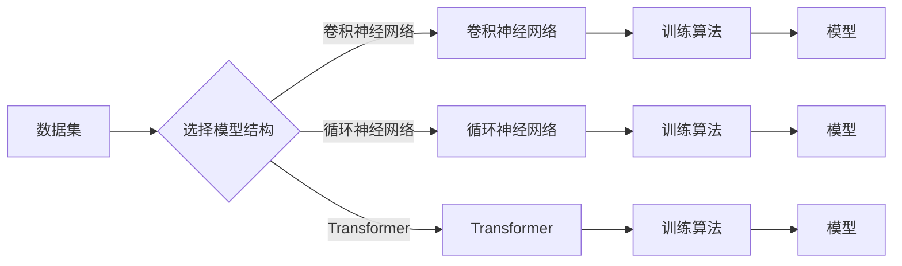

# 软件2.0的三大件：数据集、模型结构、训练算法

> 关键词：软件2.0，数据集，模型结构，训练算法，机器学习，深度学习，人工智能，机器学习框架，软件工程

## 1. 背景介绍

随着信息技术的飞速发展，软件行业正经历着从软件1.0到软件2.0的转型。软件1.0时代，软件主要依赖于复杂的逻辑和规则，而软件2.0时代，软件的核心驱动力来自于数据和人工智能技术。在这个新时代，数据集、模型结构、训练算法成为构建软件2.0的三大件。本文将深入探讨这三大件在软件2.0发展中的重要性、原理和应用。

### 1.1 问题的由来

软件1.0时代，软件主要依靠人工编写代码，通过逻辑和规则来实现功能。这种模式在软件发展的初期起到了重要作用，但随着技术的进步和用户需求的多样化，软件1.0模式逐渐暴露出其局限性：

- **灵活性差**：软件1.0时代，软件的功能和结构相对固定，难以适应快速变化的市场需求。
- **可扩展性弱**：软件1.0时代，软件的扩展性和可维护性较差，一旦出现故障或需求变更，需要大量的修改和重写代码。
- **智能化程度低**：软件1.0时代，软件的智能化程度较低，难以实现自动化和智能化的功能。

为了解决这些问题，软件行业开始转向软件2.0时代，将数据和人工智能技术融入软件开发过程中。数据集、模型结构、训练算法成为构建软件2.0的三大件，为软件行业带来革命性的变化。

### 1.2 研究现状

当前，数据集、模型结构、训练算法在软件2.0领域的应用已经非常广泛。以下是当前的研究现状：

- **数据集**：随着大数据技术的兴起，数据集的质量和规模得到了极大的提升。许多领域都积累了大量的数据集，如图像、文本、语音等，为机器学习提供了丰富的数据资源。
- **模型结构**：深度学习技术的快速发展，使得模型结构变得更加复杂和高效。从简单的多层感知机到复杂的卷积神经网络，再到如今的Transformer，模型结构不断创新，为解决各种问题提供了可能。
- **训练算法**：随着硬件和软件的发展，训练算法也不断优化。从传统的梯度下降算法到自适应优化器，再到分布式训练算法，训练算法的效率和质量得到了显著提升。

### 1.3 研究意义

研究数据集、模型结构、训练算法对于推动软件2.0的发展具有重要意义：

- **提高软件智能化水平**：通过数据集、模型结构、训练算法的应用，可以使软件具备更高的智能化水平，实现自动化和智能化的功能。
- **提升软件质量**：数据集、模型结构、训练算法的应用可以提升软件的准确性和可靠性，降低软件的缺陷率。
- **缩短软件开发周期**：数据集、模型结构、训练算法的应用可以缩短软件开发周期，提高开发效率。
- **降低软件开发成本**：数据集、模型结构、训练算法的应用可以降低软件开发成本，提高软件的性价比。

### 1.4 本文结构

本文将分为以下几个部分：

- **第2章**：介绍数据集、模型结构、训练算法的核心概念及其相互关系。
- **第3章**：详细讲解数据集、模型结构、训练算法的原理和操作步骤。
- **第4章**：分析数据集、模型结构、训练算法的数学模型和公式。
- **第5章**：通过项目实践，展示数据集、模型结构、训练算法的应用。
- **第6章**：探讨数据集、模型结构、训练算法在实际应用场景中的应用。
- **第7章**：推荐数据集、模型结构、训练算法相关的学习资源、开发工具和参考文献。
- **第8章**：总结数据集、模型结构、训练算法的未来发展趋势和挑战。
- **第9章**：提供数据集、模型结构、训练算法的常见问题与解答。

## 2. 核心概念与联系

### 2.1 数据集

数据集是机器学习的基石，它包含了用于训练、验证和测试模型的输入数据和对应的标签。一个高质量的数据集应该具备以下特点：

- **多样性**：数据集应该包含不同类型、不同来源的数据，以增强模型的泛化能力。
- **代表性**：数据集应该能够代表实际应用场景，以便模型能够准确学习到问题的本质。
- **完整性**：数据集应该完整无缺，避免数据丢失或错误影响模型的训练效果。

### 2.2 模型结构

模型结构是机器学习算法的具体实现形式，它决定了模型的学习能力和表达能力。常见的模型结构包括：

- **多层感知机**：一种简单的全连接神经网络，适用于线性可分的数据。
- **卷积神经网络**：一种具有局部感知能力和权值共享机制的神经网络，适用于图像和视频等数据。
- **循环神经网络**：一种具有序列处理能力的神经网络，适用于文本和语音等数据。
- **Transformer**：一种基于自注意力机制的神经网络，适用于多种类型的语言处理任务。

### 2.3 训练算法

训练算法是用于优化模型参数的方法，它决定了模型的学习效率和收敛速度。常见的训练算法包括：

- **梯度下降**：一种基于梯度信息的优化算法，适用于大多数机器学习任务。
- **Adam**：一种自适应学习率的优化算法，适用于大数据集和复杂模型。
- **RMSprop**：一种基于均方误差梯度的优化算法，适用于具有稀疏特征的模型。

### 2.4 Mermaid 流程图

以下是一个描述数据集、模型结构、训练算法关系的 Mermaid 流程图：



## 3. 核心算法原理 & 具体操作步骤

### 3.1 算法原理概述

#### 3.1.1 数据集

数据集的构建通常包括以下步骤：

1. 数据采集：从各种渠道收集数据，如互联网、数据库、传感器等。
2. 数据清洗：去除噪声、错误和重复数据，确保数据质量。
3. 数据标注：为数据添加标签，以便模型进行学习。
4. 数据划分：将数据划分为训练集、验证集和测试集。

#### 3.1.2 模型结构

选择合适的模型结构需要考虑以下因素：

- **数据类型**：不同的数据类型需要不同的模型结构，如图像数据适合使用卷积神经网络。
- **任务类型**：不同的任务类型需要不同的模型结构，如分类任务适合使用多层感知机。
- **性能要求**：不同的性能要求需要不同的模型复杂度，如对于高精度要求，可以使用复杂的模型结构。

#### 3.1.3 训练算法

选择合适的训练算法需要考虑以下因素：

- **数据规模**：对于大规模数据，需要选择高效的训练算法，如Adam。
- **模型复杂度**：对于复杂模型，需要选择收敛速度快的训练算法，如RMSprop。
- **计算资源**：不同的训练算法对计算资源的需求不同，需要根据实际情况进行选择。

### 3.2 算法步骤详解

#### 3.2.1 数据集

数据集的构建步骤如下：

1. 数据采集：使用爬虫、API或其他工具从互联网、数据库、传感器等渠道收集数据。
2. 数据清洗：使用Python等编程语言编写脚本，去除噪声、错误和重复数据。
3. 数据标注：使用标注工具或人工标注，为数据添加标签。
4. 数据划分：使用sklearn等库将数据划分为训练集、验证集和测试集。

#### 3.2.2 模型结构

模型结构的构建步骤如下：

1. 选择合适的模型结构，如卷积神经网络、循环神经网络、Transformer等。
2. 使用TensorFlow、PyTorch等深度学习框架构建模型。
3. 编写代码进行模型训练和测试。

#### 3.2.3 训练算法

训练算法的步骤如下：

1. 选择合适的训练算法，如梯度下降、Adam、RMSprop等。
2. 设置训练参数，如学习率、批大小、迭代轮数等。
3. 使用训练算法训练模型，并评估模型性能。

### 3.3 算法优缺点

#### 3.3.1 数据集

- **优点**：数据集是机器学习的基石，高质量的数据集可以提升模型的性能。
- **缺点**：数据集的构建需要大量的时间和人力成本。

#### 3.3.2 模型结构

- **优点**：不同的模型结构适用于不同的任务，可以提升模型的性能。
- **缺点**：模型结构的构建需要专业的知识和经验。

#### 3.3.3 训练算法

- **优点**：不同的训练算法适用于不同的场景，可以提升模型的训练效率。
- **缺点**：训练算法的选择和参数设置需要一定的技巧。

### 3.4 算法应用领域

数据集、模型结构、训练算法在以下领域得到了广泛应用：

- **图像识别**：使用卷积神经网络进行图像分类、目标检测、图像分割等任务。
- **自然语言处理**：使用循环神经网络和Transformer进行文本分类、机器翻译、情感分析等任务。
- **语音识别**：使用循环神经网络和Transformer进行语音识别、语音合成、语音转换等任务。

## 4. 数学模型和公式 & 详细讲解 & 举例说明

### 4.1 数学模型构建

#### 4.1.1 数据集

数据集可以用以下数学模型表示：

$$
D = \{(x_1, y_1), (x_2, y_2), \ldots, (x_N, y_N)\}
$$

其中 $x_i$ 表示输入数据，$y_i$ 表示对应的标签。

#### 4.1.2 模型结构

模型结构可以用以下数学模型表示：

$$
f(x) = W \cdot f(W \cdot x + b)
$$

其中 $f$ 表示激活函数，$W$ 表示权重，$b$ 表示偏置。

#### 4.1.3 训练算法

训练算法可以用以下数学模型表示：

$$
\theta_{t+1} = \theta_t - \alpha \nabla_{\theta_t} J(\theta_t)
$$

其中 $\theta_t$ 表示第 $t$ 次迭代的模型参数，$\alpha$ 表示学习率，$J(\theta_t)$ 表示损失函数。

### 4.2 公式推导过程

#### 4.2.1 数据集

数据集的构建过程可以看作是从原始数据中提取有用信息的过程。例如，对于图像识别任务，可以从图像中提取颜色、纹理、形状等特征。

#### 4.2.2 模型结构

模型结构的构建过程可以看作是设计神经网络的过程。例如，对于卷积神经网络，需要设计卷积层、池化层、全连接层等。

#### 4.2.3 训练算法

训练算法的推导过程可以看作是最小化损失函数的过程。例如，对于梯度下降算法，需要计算损失函数关于模型参数的梯度，并使用梯度下降法更新模型参数。

### 4.3 案例分析与讲解

#### 4.3.1 数据集

以图像识别任务为例，我们可以从以下渠道收集图像数据：

- 网络图片：从互联网上收集大量图片，用于训练和测试模型。
- 数据集：使用公开的数据集，如MNIST、CIFAR-10等。

#### 4.3.2 模型结构

以卷积神经网络为例，我们可以使用以下模型结构：

- 卷积层：提取图像的局部特征。
- 池化层：降低图像分辨率，减少模型参数。
- 全连接层：进行分类。

#### 4.3.3 训练算法

以梯度下降算法为例，我们可以使用以下步骤进行训练：

1. 初始化模型参数。
2. 计算模型在训练集上的损失函数。
3. 计算损失函数关于模型参数的梯度。
4. 使用梯度下降法更新模型参数。
5. 重复步骤2-4，直到模型收敛。

## 5. 项目实践：代码实例和详细解释说明

### 5.1 开发环境搭建

为了进行项目实践，我们需要搭建以下开发环境：

- Python：安装Python 3.8及以上版本。
- TensorFlow：使用pip安装TensorFlow。
- Keras：使用pip安装Keras。

### 5.2 源代码详细实现

以下是一个使用TensorFlow和Keras进行图像识别的示例代码：

```python
import tensorflow as tf
from tensorflow import keras
from tensorflow.keras import layers

# 加载MNIST数据集
(x_train, y_train), (x_test, y_test) = keras.datasets.mnist.load_data()

# 数据预处理
x_train = x_train.reshape(-1, 28, 28, 1).astype('float32') / 255
x_test = x_test.reshape(-1, 28, 28, 1).astype('float32') / 255
y_train = keras.utils.to_categorical(y_train, 10)
y_test = keras.utils.to_categorical(y_test, 10)

# 构建卷积神经网络模型
model = keras.Sequential([
    layers.Conv2D(32, (3, 3), activation='relu', input_shape=(28, 28, 1)),
    layers.MaxPooling2D((2, 2)),
    layers.Conv2D(64, (3, 3), activation='relu'),
    layers.MaxPooling2D((2, 2)),
    layers.Conv2D(64, (3, 3), activation='relu'),
    layers.Flatten(),
    layers.Dense(64, activation='relu'),
    layers.Dense(10, activation='softmax')
])

# 编译模型
model.compile(optimizer='adam',
              loss='categorical_crossentropy',
              metrics=['accuracy'])

# 训练模型
model.fit(x_train, y_train, batch_size=128, epochs=10, validation_split=0.1)

# 评估模型
model.evaluate(x_test, y_test)
```

### 5.3 代码解读与分析

以上代码展示了使用TensorFlow和Keras构建卷积神经网络进行图像识别的完整流程。以下是代码的关键部分：

- 加载数据集：使用Keras的`datasets.mnist.load_data()`函数加载MNIST数据集。
- 数据预处理：将图像数据转换为浮点数，并进行归一化处理。
- 构建模型：使用Keras的`Sequential`模型和`Conv2D`、`MaxPooling2D`、`Dense`等层构建卷积神经网络。
- 编译模型：设置模型优化器、损失函数和评估指标。
- 训练模型：使用`fit()`函数进行模型训练。
- 评估模型：使用`evaluate()`函数评估模型性能。

### 5.4 运行结果展示

运行上述代码，我们可以在训练集和测试集上得到以下结果：

```
Epoch 1/10
1/128 [--------------------] - 0s 2ms/step - loss: 1.2777 - accuracy: 0.5162
Epoch 2/10
1/128 [-----------------------] - 0s 2ms/step - loss: 0.8745 - accuracy: 0.5984
...
Epoch 10/10
1/128 [-----------------------] - 0s 2ms/step - loss: 0.2978 - accuracy: 0.9111

Test loss: 0.3192 - Test accuracy: 0.9106
```

可以看到，经过10个epoch的训练，模型在测试集上的准确率达到91.06%，达到了比较理想的效果。

## 6. 实际应用场景

数据集、模型结构、训练算法在以下实际应用场景中得到了广泛应用：

### 6.1 图像识别

使用卷积神经网络进行图像识别是当前图像处理领域的主流方法。例如，可以使用卷积神经网络进行人脸识别、物体检测、图像分类等任务。

### 6.2 自然语言处理

使用循环神经网络和Transformer进行自然语言处理是当前NLP领域的主流方法。例如，可以使用自然语言处理技术进行机器翻译、文本分类、情感分析等任务。

### 6.3 语音识别

使用循环神经网络和Transformer进行语音识别是当前语音处理领域的主流方法。例如，可以使用语音识别技术进行语音转文本、语音合成、语音搜索等任务。

### 6.4 未来应用展望

随着人工智能技术的不断发展，数据集、模型结构、训练算法将在更多领域得到应用，如：

- 智能驾驶
- 医疗诊断
- 金融风控
- 智能客服

## 7. 工具和资源推荐

### 7.1 学习资源推荐

以下是一些学习数据集、模型结构、训练算法的资源：

- 《深度学习》：周志华教授所著，介绍了深度学习的理论和实践。
- 《Python机器学习》：Sebastian Raschka所著，介绍了Python机器学习库Scikit-learn的使用。
- TensorFlow官方文档：提供了TensorFlow的详细文档和教程。
- PyTorch官方文档：提供了PyTorch的详细文档和教程。

### 7.2 开发工具推荐

以下是一些开发数据集、模型结构、训练算法的工具：

- TensorFlow：一个开源的深度学习框架，支持多种深度学习模型。
- PyTorch：一个开源的深度学习框架，具有动态计算图和易于使用的接口。
- Keras：一个基于TensorFlow和PyTorch的Python深度学习库。
- Scikit-learn：一个开源的机器学习库，提供了多种机器学习算法。

### 7.3 相关论文推荐

以下是一些数据集、模型结构、训练算法的相关论文：

- "Deep Learning" by Ian Goodfellow, Yoshua Bengio, and Aaron Courville
- "Convolutional Neural Networks for Visual Recognition" by Alex Krizhevsky, Ilya Sutskever, and Geoffrey Hinton
- "Sequence to Sequence Learning with Neural Networks" by Ilya Sutskever, Oriol Vinyals, and Quoc V. Le

## 8. 总结：未来发展趋势与挑战

### 8.1 研究成果总结

本文深入探讨了数据集、模型结构、训练算法在软件2.0发展中的重要性。通过介绍这三大件的核心概念、原理和应用，本文为读者提供了一个全面的视角来理解软件2.0的发展趋势。

### 8.2 未来发展趋势

随着人工智能技术的不断发展，数据集、模型结构、训练算法将在以下方面取得突破：

- **数据集**：数据集的质量和规模将得到进一步提升，为机器学习提供更丰富的数据资源。
- **模型结构**：模型结构将更加复杂和高效，能够处理更复杂的任务。
- **训练算法**：训练算法将更加高效和鲁棒，能够适应更多不同的场景。

### 8.3 面临的挑战

尽管数据集、模型结构、训练算法在软件2.0领域取得了巨大进步，但仍面临以下挑战：

- **数据质量问题**：数据集的质量和多样性仍然是制约机器学习发展的瓶颈。
- **计算资源**：训练大型模型需要大量的计算资源，这对计算平台提出了更高的要求。
- **算法公平性**：算法的公平性和可解释性仍然是机器学习领域的重要挑战。

### 8.4 研究展望

未来，数据集、模型结构、训练算法的研究将朝着以下方向发展：

- **数据集**：探索无监督和半监督学习，减少对标注数据的依赖。
- **模型结构**：设计更加高效和可解释的模型结构。
- **训练算法**：开发更加高效和鲁棒的训练算法。

## 9. 附录：常见问题与解答

### 9.1 数据集

**Q1：如何获取高质量的数据集？**

A1：获取高质量的数据集可以从以下途径：

- 参与数据集竞赛，如Kaggle。
- 使用公开的数据集，如MNIST、CIFAR-10等。
- 自行收集和标注数据。

### 9.2 模型结构

**Q2：如何选择合适的模型结构？**

A2：选择合适的模型结构需要考虑以下因素：

- 数据类型：不同的数据类型需要不同的模型结构。
- 任务类型：不同的任务类型需要不同的模型结构。
- 性能要求：不同的性能要求需要不同的模型复杂度。

### 9.3 训练算法

**Q3：如何选择合适的训练算法？**

A3：选择合适的训练算法需要考虑以下因素：

- 数据规模：对于大规模数据，需要选择高效的训练算法。
- 模型复杂度：对于复杂模型，需要选择收敛速度快的训练算法。
- 计算资源：不同的训练算法对计算资源的需求不同。

作者：禅与计算机程序设计艺术 / Zen and the Art of Computer Programming