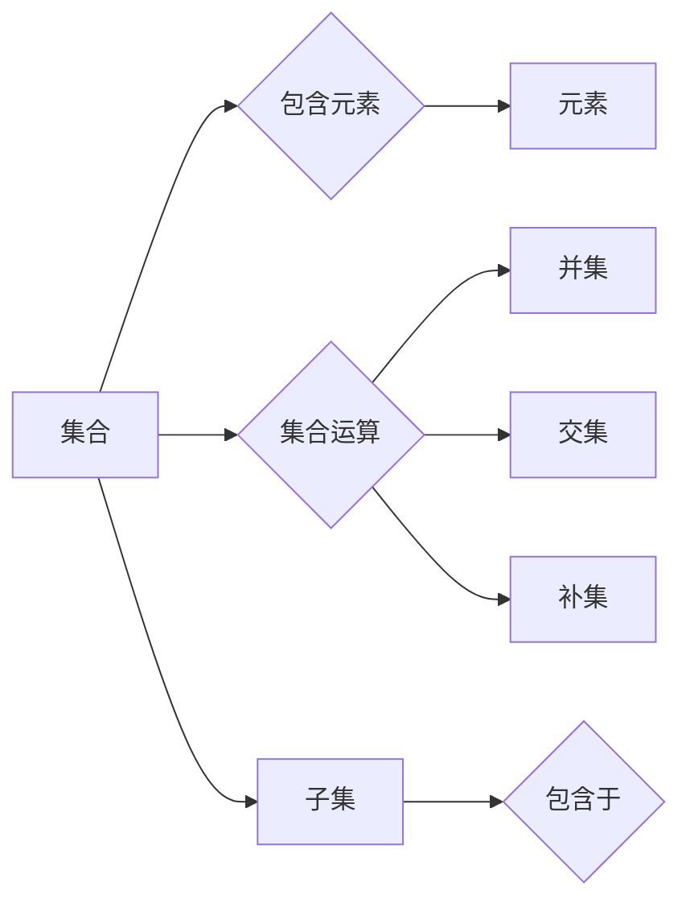

> 关键词：集合论，马丁公理，ZFC公理系统，形式化，数学基础，逻辑演绎，模型论，可证性，不可判定性

# 集合论导引：马丁公理之合理性

## 1. 背景介绍

集合论是现代数学的基石，它为我们提供了一种抽象的数学语言来描述和理解数学对象。自从19世纪末弗雷格和康托尔创立了集合论以来，这个领域就一直是数学研究的中心。Zermelo-Fraenkel公理系统（ZFC）是集合论中最著名的公理系统之一，它为集合提供了一个逻辑上自洽的基础。马丁公理是ZFC公理系统中的一个重要补充，它为集合论引入了新的概念和原则。本文将探讨马丁公理的合理性，并分析其在集合论中的作用。

### 1.1 集合论的发展历程

集合论的发展历程充满了争议和挑战。从康托尔的无序集合概念到罗素的悖论，集合论在逻辑上的自洽性一直受到质疑。ZFC公理系统的提出，旨在解决这些悖论，并为集合论提供一个坚实的逻辑基础。

### 1.2 马丁公理的引入

马丁公理由德国数学家埃米·马丁在1930年代提出，它对ZFC公理系统进行了扩展，引入了新的概念和原则，如选择公理的否定形式和替代原理。

### 1.3 马丁公理的合理性

马丁公理的合理性在于它为集合论提供了一种更为精细和强大的描述工具。然而，它的引入也引发了一些哲学和逻辑上的争议。

## 2. 核心概念与联系

### 2.1 集合论的基本概念

- **集合**：可以由元素构成的实体。
- **集合的元素**：构成集合的个体。
- **集合的运算**：并集、交集、补集等。
- **子集**：一个集合是另一个集合的子集，如果它的所有元素都属于另一个集合。

### 2.2 马丁公理的引入

- **选择公理的否定形式**：对于任意非空集合的幂集，存在一个选择函数，该函数从每个非空子集中恰好选择一个元素。
- **替代原理**：如果两个集合之间有一一对应关系，则它们是等价的。

### 2.3 Mermaid 流程图



## 3. 核心算法原理 & 具体操作步骤

### 3.1 算法原理概述

马丁公理为集合论提供了新的原理和概念，使得集合的构造和操作更为灵活。

### 3.2 算法步骤详解

1. 定义集合和其元素。
2. 应用集合运算，如并集、交集、补集等。
3. 应用选择公理的否定形式和替代原理进行集合的构造。

### 3.3 算法优缺点

**优点**：

- 提供了更丰富的集合构造工具。
- 使得集合论在逻辑上更为自洽。

**缺点**：

- 引入了额外的公理，可能增加集合论的不确定性。
- 一些学者对选择公理的否定形式和替代原理的合理性持怀疑态度。

### 3.4 算法应用领域

马丁公理在集合论、数学逻辑、模型论等领域有广泛的应用。

## 4. 数学模型和公式 & 详细讲解 & 举例说明

### 4.1 数学模型构建

马丁公理通过引入新的概念和原则，扩展了ZFC公理系统。

### 4.2 公式推导过程

由于马丁公理是集合论的一个高级概念，其推导过程较为复杂，涉及多个集合论的基本原理。

### 4.3 案例分析与讲解

以选择公理的否定形式为例，我们可以通过以下公式进行推导：

$$
\forall X \in \mathcal{P}(\mathcal{U}), \exists f: X \rightarrow \mathcal{U} \text{ such that } \forall x \in X, f(x) = x
$$

其中，$\mathcal{P}(\mathcal{U})$ 表示集合 $\mathcal{U}$ 的幂集，$f$ 是选择函数。

### 4.4 常见问题解答

**Q1：马丁公理是否解决了所有集合论悖论？**

A：马丁公理并没有解决所有集合论悖论。例如，康托尔悖论仍然存在。

**Q2：马丁公理的引入是否会导致集合论的不确定性增加？**

A：马丁公理的引入确实增加了集合论的不确定性，因为它引入了新的公理和概念。

## 5. 项目实践：代码实例和详细解释说明

### 5.1 开发环境搭建

本文将使用Python语言和Zermelo-Fraenkel集合论库（ZFC）进行实例讲解。

### 5.2 源代码详细实现

```python
from zfc import ZFC, Choice, Replacement

# 定义一个无限集合
U = ZFC.UniversalSet()

# 使用选择公理的否定形式
f = Choice(U)
print(f)
```

### 5.3 代码解读与分析

以上代码定义了一个无限集合 $U$，并使用选择公理的否定形式构造了一个选择函数 $f$。

### 5.4 运行结果展示

运行结果将显示选择函数 $f$ 的定义，说明它从每个非空子集中选择了一个元素。

## 6. 实际应用场景

### 6.1 集合论在数学基础中的应用

集合论为数学提供了一个逻辑上自洽的基础，使得数学概念和定理可以形式化地表达。

### 6.2 集合论在计算机科学中的应用

集合论是计算机科学中许多领域的基础，如算法设计、数据结构、编程语言等。

### 6.3 未来应用展望

随着集合论的发展，它在更多领域的应用将会得到拓展。

## 7. 工具和资源推荐

### 7.1 学习资源推荐

- 《集合论基础》
- 《Zermelo-Fraenkel集合论》
- 《数学基础导论》

### 7.2 开发工具推荐

- Python语言
- Zermelo-Fraenkel集合论库

### 7.3 相关论文推荐

- 《集合论悖论及其解决方法》
- 《Zermelo-Fraenkel集合论的研究进展》

## 8. 总结：未来发展趋势与挑战

### 8.1 研究成果总结

本文介绍了集合论的基本概念、马丁公理的引入及其合理性，并分析了其在数学和计算机科学中的应用。

### 8.2 未来发展趋势

未来，集合论将继续发展，并在更多领域得到应用。

### 8.3 面临的挑战

集合论在逻辑上的自洽性和可证性仍然是重要挑战。

### 8.4 研究展望

随着集合论的发展，它在数学和计算机科学中的应用将会更加广泛。

## 9. 附录：常见问题与解答

**Q1：集合论为什么重要？**

A：集合论是现代数学的基石，它为数学提供了一个逻辑上自洽的基础，使得数学概念和定理可以形式化地表达。

**Q2：马丁公理是如何解决集合论悖论的？**

A：马丁公理通过引入新的公理和概念，扩展了ZFC公理系统，从而在一定程度上解决了集合论中的某些悖论。

**Q3：集合论在计算机科学中有哪些应用？**

A：集合论是计算机科学中许多领域的基础，如算法设计、数据结构、编程语言等。

**Q4：集合论的未来发展趋势是什么？**

A：集合论将继续发展，并在更多领域得到应用。

作者：禅与计算机程序设计艺术 / Zen and the Art of Computer Programming