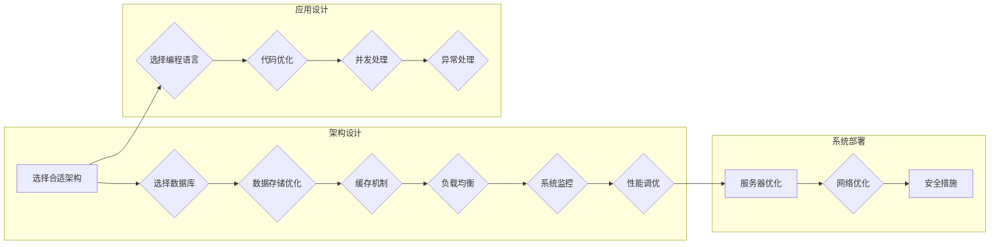

# 高吞吐量系统设计的最佳实践

> 关键词：高吞吐量，系统设计，架构模式，性能优化，可扩展性，负载均衡，数据库设计，缓存机制，微服务

## 1. 背景介绍

随着互联网和大数据时代的到来，对系统性能的要求越来越高。高吞吐量系统设计已经成为现代软件开发中不可或缺的一部分。高吞吐量系统设计的目标是确保系统能够处理大量的并发请求，同时保持高性能和稳定性。本文将探讨高吞吐量系统设计的最佳实践，包括核心概念、算法原理、数学模型、项目实践以及实际应用场景等。

## 2. 核心概念与联系

### 2.1 高吞吐量系统设计概念

高吞吐量系统设计是指在保证系统稳定性和可靠性的前提下，最大化系统处理请求的能力。这通常意味着系统需要能够快速响应，同时处理大量并发请求。

### 2.2 Mermaid 流程图

以下是一个简化的高吞吐量系统设计流程图：



### 2.3 核心概念联系

高吞吐量系统设计涉及多个层面的概念，包括架构设计、应用设计、系统部署等。这些概念相互联系，共同影响系统的整体性能。

## 3. 核心算法原理 & 具体操作步骤

### 3.1 算法原理概述

高吞吐量系统设计的主要原理包括：

- **负载均衡**：通过分布式架构分散请求，提高系统处理能力。
- **缓存机制**：缓存常用数据，减少对数据库的访问，提高响应速度。
- **数据库设计**：优化数据库结构，减少查询时间和数据冗余。
- **代码优化**：优化代码结构，提高执行效率。
- **并发处理**：利用多线程或异步编程技术，提高系统并发能力。
- **系统监控**：实时监控系统性能，及时发现并解决问题。

### 3.2 算法步骤详解

#### 3.2.1 架构设计

- **选择合适的架构**：根据业务需求选择合适的系统架构，如单体架构、微服务架构等。
- **选择数据库**：根据数据访问模式选择合适的数据库，如关系型数据库、NoSQL数据库等。
- **数据存储优化**：优化数据索引、分区、分片等，提高数据访问效率。
- **缓存机制**：使用缓存存储热点数据，如Redis、Memcached等。
- **负载均衡**：使用负载均衡器分散请求，如Nginx、HAProxy等。
- **系统监控**：使用监控系统实时监控系统性能，如Prometheus、Grafana等。

#### 3.2.2 应用设计

- **选择编程语言**：选择性能良好的编程语言，如Go、C++等。
- **代码优化**：优化算法和代码结构，提高执行效率。
- **并发处理**：使用多线程或异步编程技术处理并发请求。
- **异常处理**：设计合理的异常处理机制，确保系统稳定性。

#### 3.2.3 系统部署

- **服务器优化**：优化服务器配置，如CPU、内存、磁盘等。
- **网络优化**：优化网络配置，如TCP参数调整、负载均衡等。
- **安全措施**：实施安全策略，如防火墙、SSL/TLS等。

### 3.3 算法优缺点

#### 3.3.1 优点

- **高性能**：通过多种技术手段提高系统处理能力，满足高吞吐量需求。
- **稳定性**：通过冗余设计、故障转移等手段提高系统稳定性。
- **可扩展性**：系统设计具有较好的可扩展性，能够适应业务增长。

#### 3.3.2 缺点

- **复杂度**：系统设计相对复杂，开发和维护成本较高。
- **资源消耗**：高性能系统需要更多的计算资源，如CPU、内存等。

### 3.4 算法应用领域

高吞吐量系统设计适用于以下领域：

- **电子商务**：处理大量并发订单和支付请求。
- **在线游戏**：处理大量玩家同时在线和数据交互。
- **社交媒体**：处理大量用户信息和内容发布请求。
- **大数据处理**：处理海量数据处理和分析任务。

## 4. 数学模型和公式 & 详细讲解 & 举例说明

### 4.1 数学模型构建

高吞吐量系统设计涉及多个数学模型，如：

- **队列模型**：用于分析系统处理请求的速率和排队时间。
- **马尔可夫决策过程**：用于优化系统资源的分配策略。
- **排队论**：用于分析系统的性能指标。

### 4.2 公式推导过程

以下是一个简化的队列模型公式推导过程：

假设系统到达请求的平均速率率为 $\lambda$，服务速率率为 $\mu$，系统可以容纳的最大请求数为 $N$，则：

- 系统空闲概率 $P_{空闲} = \frac{\mu}{\lambda + \mu}$
- 系统繁忙概率 $P_{繁忙} = \frac{\lambda}{\lambda + \mu}$
- 平均排队长度 $L = \frac{P_{繁忙} \cdot \lambda}{\mu}$
- 平均响应时间 $T = L / \mu + 1 / \mu$

### 4.3 案例分析与讲解

以电商订单处理系统为例，分析系统性能指标：

- 设定系统到达请求的平均速率率为 $\lambda = 100$ 次每秒。
- 设定服务速率率为 $\mu = 200$ 次每秒。
- 设定系统可以容纳的最大请求数为 $N = 50$。

根据上述公式，可以计算出：

- 系统空闲概率 $P_{空闲} = 0.25$
- 系统繁忙概率 $P_{繁忙} = 0.75$
- 平均排队长度 $L = 7.5$ 个请求
- 平均响应时间 $T = 1.125$ 秒

可以看出，该系统在大多数时间内处于繁忙状态，平均等待时间约为1.125秒。如果需要进一步提高系统性能，可以考虑以下方案：

- 增加服务速率，如提高服务器性能或增加服务器数量。
- 优化系统架构，如使用负载均衡技术分散请求。
- 增加系统容量，如扩展数据库存储空间。

## 5. 项目实践：代码实例和详细解释说明

### 5.1 开发环境搭建

由于高吞吐量系统设计涉及多个层面，以下以一个简单的Web服务为例，展示如何使用Python和Flask框架实现。

### 5.2 源代码详细实现

```python
from flask import Flask, jsonify, request
from werkzeug.exceptions import HTTPException

app = Flask(__name__)

# 模拟数据库
db = {
    "users": [
        {"id": 1, "name": "Alice"},
        {"id": 2, "name": "Bob"}
    ]
}

@app.route('/users', methods=['GET'])
def get_users():
    try:
        return jsonify(db['users'])
    except Exception as e:
        raise HTTPException(status_code=500, description=str(e))

@app.route('/users/<int:user_id>', methods=['GET'])
def get_user(user_id):
    try:
        user = next((u for u in db['users'] if u['id'] == user_id), None)
        if user is not None:
            return jsonify(user)
        else:
            return jsonify({"error": "User not found"}), 404
    except Exception as e:
        raise HTTPException(status_code=500, description=str(e))

if __name__ == '__main__':
    app.run(host='0.0.0.0', port=5000)
```

### 5.3 代码解读与分析

该示例使用Flask框架实现了两个API接口：获取所有用户信息和获取单个用户信息。代码首先定义了一个模拟数据库，然后定义了两个路由处理函数，分别用于处理GET请求。

- `get_users`函数处理获取所有用户的请求，返回用户列表。
- `get_user`函数处理获取单个用户的请求，根据用户ID查找用户信息并返回。

该示例展示了如何使用Python和Flask框架实现简单的Web服务。在实际应用中，可以根据需求扩展功能，如添加数据库连接、用户认证等。

### 5.4 运行结果展示

运行该Web服务后，可以使用以下命令测试API：

```
curl http://localhost:5000/users
curl http://localhost:5000/users/1
```

第一个命令将返回所有用户信息，第二个命令将返回ID为1的用户信息。

## 6. 实际应用场景

### 6.1 电商网站

电商网站需要处理大量订单和支付请求，因此需要设计高吞吐量系统，以保证用户购物体验。

### 6.2 在线游戏

在线游戏需要处理大量玩家的同时在线和数据交互，因此需要设计高吞吐量系统，以保证游戏流畅性。

### 6.3 社交媒体

社交媒体平台需要处理大量用户信息和内容发布请求，因此需要设计高吞吐量系统，以保证用户交互体验。

### 6.4 大数据处理

大数据处理需要处理海量数据处理和分析任务，因此需要设计高吞吐量系统，以保证数据处理效率。

## 7. 工具和资源推荐

### 7.1 学习资源推荐

- 《高性能网站架构》
- 《分布式系统原理与范型》
- 《Python Concurrency and Parallelism》
- 《Flask Web Development》

### 7.2 开发工具推荐

- **编程语言**：Python、Java、C++等
- **Web框架**：Flask、Django、Spring Boot等
- **数据库**：MySQL、PostgreSQL、MongoDB等
- **缓存机制**：Redis、Memcached等
- **负载均衡**：Nginx、HAProxy等

### 7.3 相关论文推荐

- **《Scalable Internet Services: Web Services, Service-Oriented Architectures, and Cloud Computing**》
- **《The Art of Multiprocessor Programming**》
- **《Building Microservices: Designing Fine-Grained Systems**》

## 8. 总结：未来发展趋势与挑战

### 8.1 研究成果总结

高吞吐量系统设计已经成为现代软件开发中不可或缺的一部分。本文从核心概念、算法原理、数学模型、项目实践以及实际应用场景等方面，全面介绍了高吞吐量系统设计的最佳实践。

### 8.2 未来发展趋势

- **云计算**：云计算平台提供弹性计算资源，为高吞吐量系统设计提供基础设施支持。
- **微服务**：微服务架构提高了系统的可扩展性和可维护性。
- **容器化**：容器化技术简化了应用部署和运维，提高了系统性能和可靠性。

### 8.3 面临的挑战

- **资源消耗**：高吞吐量系统需要更多的计算资源，如CPU、内存、存储等。
- **复杂性**：高吞吐量系统设计相对复杂，开发和维护成本较高。
- **安全性**：高吞吐量系统需要面对更多的安全威胁，如DDoS攻击等。

### 8.4 研究展望

未来，高吞吐量系统设计将更加注重以下方面：

- **资源优化**：研究更高效的资源调度和分配算法，降低资源消耗。
- **系统架构**：研究更加灵活、可扩展的系统架构，适应业务变化。
- **安全性**：研究更加安全可靠的高吞吐量系统设计，防范安全威胁。

## 9. 附录：常见问题与解答

**Q1：高吞吐量系统设计是否一定需要分布式架构？**

A: 并不一定。高吞吐量系统设计可以采用多种架构，如单体架构、微服务架构、容器化架构等。分布式架构可以提高系统的可扩展性和容错性，但同时也增加了系统的复杂性和运维成本。

**Q2：如何平衡系统性能和资源消耗？**

A: 可以通过以下方法平衡系统性能和资源消耗：
- **优化算法和代码**：提高代码执行效率，减少资源消耗。
- **使用缓存机制**：缓存常用数据，减少对数据库的访问。
- **负载均衡**：使用负载均衡技术分散请求，提高系统吞吐量。
- **资源调度**：合理调度资源，提高资源利用率。

**Q3：如何确保高吞吐量系统的安全性？**

A: 可以通过以下方法确保高吞吐量系统的安全性：
- **安全审计**：定期进行安全审计，发现并修复安全漏洞。
- **访问控制**：实施严格的访问控制策略，限制对敏感数据的访问。
- **安全防护**：采用防火墙、入侵检测系统等安全防护措施。

**Q4：如何评估高吞吐量系统的性能？**

A: 可以通过以下方法评估高吞吐量系统的性能：
- **压力测试**：模拟大量并发请求，测试系统性能。
- **负载测试**：测试系统在特定负载下的表现。
- **性能监控**：实时监控系统性能指标，及时发现并解决问题。

**Q5：高吞吐量系统设计是否适用于所有业务场景？**

A: 高吞吐量系统设计适用于需要处理大量并发请求的业务场景，如电子商务、在线游戏、社交媒体等。对于一些对性能要求不高的业务场景，可以考虑使用其他架构。

---

作者：禅与计算机程序设计艺术 / Zen and the Art of Computer Programming